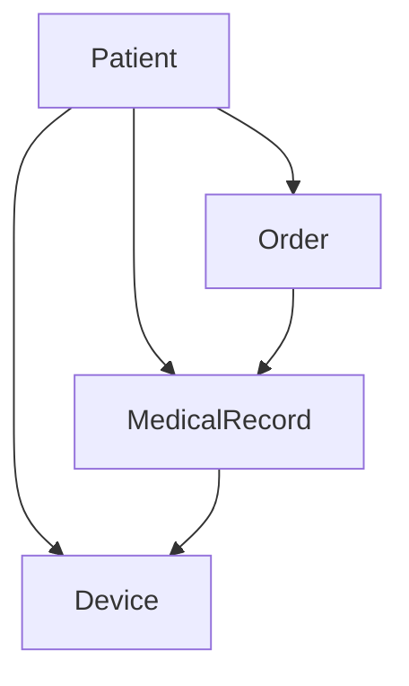

# 04 业务对象与数据建模

## 4.1 核心业务对象

### 4.1.1 患者（Patient）

- 唯一标识、姓名、性别、出生日期、联系方式、地址、保险信息、创建/更新时间等。

```rust
#[derive(Debug, Clone)]
pub struct Patient {
    pub id: PatientId,
    pub name: String,
    pub gender: Gender,
    pub birth_date: Date,
    pub contact_info: ContactInfo,
    pub address: Address,
    pub insurance_info: Option<InsuranceInfo>,
    pub created_at: DateTime<Utc>,
    pub updated_at: DateTime<Utc>,
}
```

### 4.1.2 医疗记录（MedicalRecord）

- 唯一标识、患者ID、记录类型、内容、医生、时间、状态等。

```rust
#[derive(Debug, Clone)]
pub struct MedicalRecord {
    pub id: MedicalRecordId,
    pub patient_id: PatientId,
    pub record_type: RecordType,
    pub content: RecordContent,
    pub doctor_id: DoctorId,
    pub created_at: DateTime<Utc>,
    pub updated_at: DateTime<Utc>,
    pub status: RecordStatus,
}
```

### 4.1.3 设备（Device）

- 唯一标识、类型、型号、序列号、状态、位置、患者ID等。

```rust
#[derive(Debug, Clone)]
pub struct Device {
    pub id: DeviceId,
    pub device_type: DeviceType,
    pub model: String,
    pub serial_number: String,
    pub status: DeviceStatus,
    pub location: Location,
    pub patient_id: Option<PatientId>,
    pub created_at: DateTime<Utc>,
    pub updated_at: DateTime<Utc>,
}
```

### 4.1.4 医嘱（Order）

- 唯一标识、患者ID、医生ID、医嘱类型、内容、状态、时间等。

```rust
#[derive(Debug, Clone)]
pub struct Order {
    pub id: OrderId,
    pub patient_id: PatientId,
    pub doctor_id: DoctorId,
    pub order_type: OrderType,
    pub content: OrderContent,
    pub status: OrderStatus,
    pub created_at: DateTime<Utc>,
    pub updated_at: DateTime<Utc>,
}
```

---

## 4.2 业务对象关系图



---

## 4.3 形式化建模与验证

- 用类型系统表达对象属性、约束与方法（如患者信息验证、医疗记录完整性校验等）。
- 通过方法实现患者注册、医疗记录创建、设备绑定、医嘱执行等业务逻辑。

---

## 4.4 多表征与总结

- Rust类型系统、Mermaid关系图、伪代码、表格等多种方式，提升建模清晰度与可复查性。
