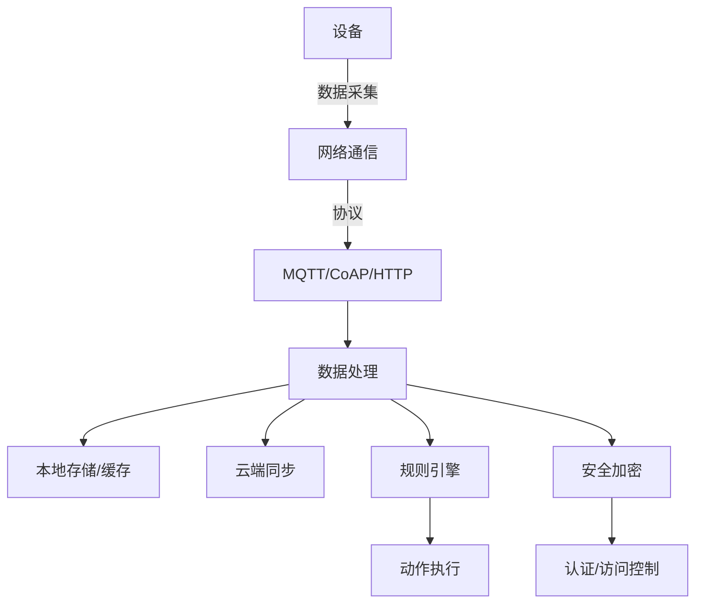

# 02 技术栈与工具链

## 2.1 核心依赖与库

### 2.1.1 异步运行时

- **tokio**：高性能异步运行时，适合并发任务调度。
- **async-std**：轻量级异步运行时，适合嵌入式和资源受限场景。

### 2.1.2 网络通信

- **tokio-mqtt/rumqttc**：MQTT协议支持，适合设备间消息通信。
- **coap**：CoAP协议支持，适合低功耗设备。
- **reqwest**：HTTP客户端，适合云端通信。

### 2.1.3 序列化与存储

- **serde/serde_json/bincode**：高效序列化。
- **sqlx/rusqlite/sled**：数据库与嵌入式存储。

### 2.1.4 加密与安全

- **ring/rustls/webpki-roots**：加密、TLS、安全通信。

### 2.1.5 配置与日志

- **config/toml**：配置管理。
- **tracing/log**：日志与分布式追踪。

### 2.1.6 行业特定库

- **embedded-hal/cortex-m/cortex-m-rt**：硬件抽象与嵌入式支持。
- **embedded-sensors/dht-sensor**：传感器支持。
- **chrono/time**：时间处理。
- **lapin/redis**：消息队列与缓存。
- **moka**：本地缓存。

---

## 2.2 工具链与开发环境

### 2.2.1 构建与包管理

- **cargo**：Rust官方包管理与构建工具。
- **cross**：跨平台交叉编译，适合嵌入式开发。

### 2.2.2 测试与CI

- **cargo test**：单元测试。
- **GitHub Actions/GitLab CI**：持续集成。

### 2.2.3 嵌入式开发与调试

- **probe-rs**：嵌入式调试工具。
- **qemu**：硬件仿真。

---

## 2.3 适用场景与优缺点分析

| 组件/库         | 适用场景                   | 优点                   | 局限/缺点           |
|----------------|--------------------------|----------------------|--------------------|
| tokio          | 并发、IO密集型服务         | 高性能、生态成熟        | 学习曲线陡峭        |
| async-std      | 嵌入式、轻量级并发         | 轻量、易用             | 生态不如tokio       |
| rumqttc/coap   | 设备通信、低功耗           | 协议支持全、适配广      | 文档有限            |
| sqlx/rusqlite  | 数据存储、嵌入式           | 类型安全、异步支持      | 嵌入式功能有限      |
| ring/rustls    | 安全通信、加密             | 性能好、安全性高        | 配置复杂            |
| embedded-hal   | 硬件抽象、嵌入式           | 跨平台、标准化         | 需适配具体芯片      |
| probe-rs/qemu  | 调试、仿真                 | 支持多平台、易集成      | 需硬件/仿真环境     |

---

## 2.4 形式化依赖描述（示例）

```toml
[dependencies]
tokio = { version = "1.35", features = ["full"] }
async-std = "1.35"
tokio-mqtt = "0.8"
rumqttc = "0.24"
coap = "0.3"
reqwest = { version = "0.11", features = ["json"] }
serde = { version = "1.0", features = ["derive"] }
serde_json = "1.0"
bincode = "1.3"
sqlx = { version = "0.7", features = ["sqlite", "runtime-tokio-rustls"] }
rusqlite = "0.29"
sled = "0.34"
ring = "0.17"
rustls = "0.21"
webpki-roots = "0.25"
config = "0.14"
toml = "0.8"
tracing = "0.1"
log = "0.4"
embedded-hal = "0.2"
cortex-m = "0.7"
cortex-m-rt = "0.7"
embedded-sensors = "0.1"
dht-sensor = "0.1"
chrono = { version = "0.4", features = ["serde"] }
time = "0.3"
lapin = "2.3"
redis = { version = "0.24", features = ["tokio-comp"] }
moka = "0.12"
```

---

## 2.5 多表征：技术栈关系图


