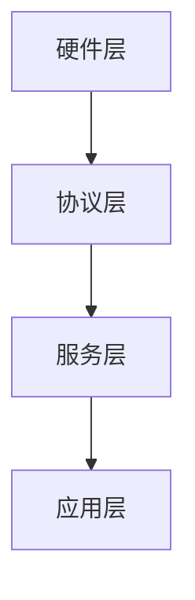
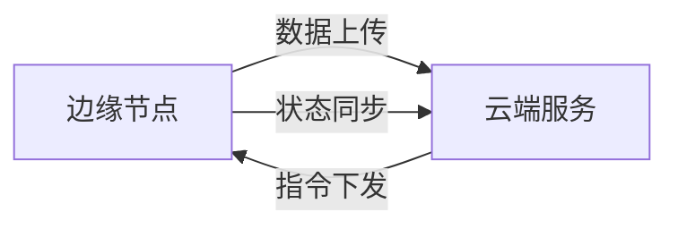
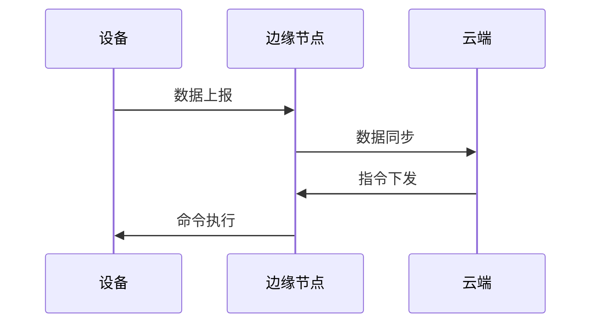

# 03 架构模式与形式化建模

## 3.1 分层架构模式

### 3.1.1 架构分层

1. 应用层（设备管理、数据处理、规则引擎）
2. 服务层（通信服务、存储服务、安全服务）
3. 协议层（MQTT、CoAP、HTTP等协议适配）
4. 硬件层（传感器、执行器、通信模块）

### 3.1.2 Mermaid分层结构图



### 3.1.3 Rust伪代码表达

```rust
pub struct HardwareLayer { /* ... */ }
pub struct ProtocolLayer { /* ... */ }
pub struct ServiceLayer { /* ... */ }
pub struct ApplicationLayer { /* ... */ }

pub struct IoTStack {
    hardware: HardwareLayer,
    protocol: ProtocolLayer,
    service: ServiceLayer,
    application: ApplicationLayer,
}
```

---

## 3.2 边缘计算架构模式

### 3.2.1 边缘-云协同

- 边缘节点负责本地数据采集、处理、规则执行、初步决策
- 云端服务负责设备注册、数据分析、全局指令下发

### 3.2.2 Mermaid边缘-云协同图



### 3.2.3 Rust结构体表达

```rust
pub struct EdgeNode { /* ... */ }
pub struct CloudService { /* ... */ }
```

---

## 3.3 事件驱动架构模式

### 3.3.1 事件流与处理器

- 典型事件：设备连接、断开、数据上报、告警触发、命令执行
- 事件处理器：异步解耦、可扩展

### 3.3.2 事件流Mermaid图



### 3.3.3 Rust事件定义与处理

```rust
#[derive(Debug, Clone)]
pub enum IoTEvent {
    DeviceConnected,
    DeviceDisconnected,
    SensorDataReceived,
    AlertTriggered,
    CommandExecuted,
}

pub trait EventHandler {
    fn handle(&self, event: &IoTEvent);
}
```

---

## 3.4 形式化建模与论证

- 用类型系统表达分层与服务边界，提升可验证性与可维护性。
- 事件驱动模式提升系统解耦与可扩展性。
- 边缘-云协同保障系统弹性与实时性。

---

## 3.5 多表征总结

- Mermaid图、Rust伪代码、结构体、事件枚举等多种形式，提升架构清晰度与可复查性。
