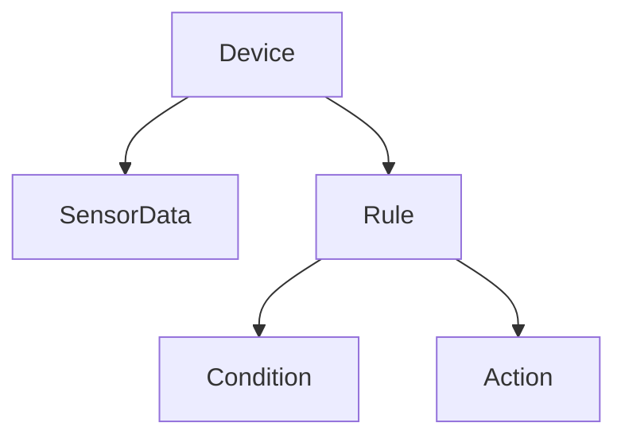

# 04 业务对象与数据建模

## 4.1 核心业务对象

### 4.1.1 设备（Device）

- 唯一标识、名称、类型、型号、厂商、固件、位置、状态、能力、配置、最后上线时间等。

```rust
#[derive(Debug, Clone)]
pub struct Device {
    pub id: DeviceId,
    pub name: String,
    pub device_type: DeviceType,
    pub model: String,
    pub manufacturer: String,
    pub firmware_version: String,
    pub location: Location,
    pub status: DeviceStatus,
    pub capabilities: Vec<Capability>,
    pub configuration: DeviceConfiguration,
    pub last_seen: DateTime<Utc>,
    pub created_at: DateTime<Utc>,
    pub updated_at: DateTime<Utc>,
}
```

### 4.1.2 传感器数据（SensorData）

- 唯一标识、设备ID、类型、数值、单位、时间戳、质量、元数据等。

```rust
#[derive(Debug, Clone)]
pub struct SensorData {
    pub id: SensorDataId,
    pub device_id: DeviceId,
    pub sensor_type: SensorType,
    pub value: f64,
    pub unit: String,
    pub timestamp: DateTime<Utc>,
    pub quality: DataQuality,
    pub metadata: SensorMetadata,
}
```

### 4.1.3 规则（Rule）

- 唯一标识、名称、描述、条件、动作、优先级、启用状态、创建/更新时间等。

```rust
#[derive(Debug, Clone)]
pub struct Rule {
    pub id: RuleId,
    pub name: String,
    pub description: String,
    pub conditions: Vec<Condition>,
    pub actions: Vec<Action>,
    pub priority: u32,
    pub enabled: bool,
    pub created_at: DateTime<Utc>,
    pub updated_at: DateTime<Utc>,
}
```

---

## 4.2 业务对象关系图



---

## 4.3 形式化建模与验证

- 用类型系统表达对象属性、约束与方法（如is_online、check_threshold、is_valid等）。
- 通过方法实现设备状态更新、数据验证、规则评估等业务逻辑。

---

## 4.4 多表征与总结

- Rust类型系统、Mermaid关系图、伪代码、表格等多种方式，提升建模清晰度与可复查性。
