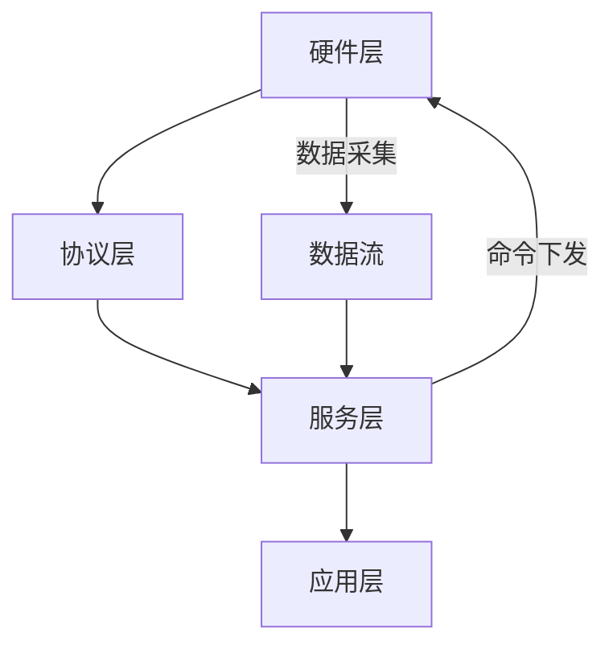
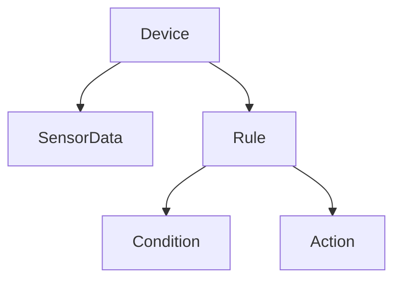
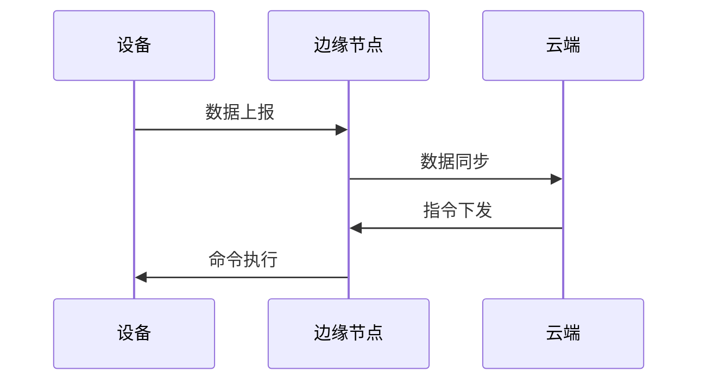

# 07 多表征（图/表/公式）

## 7.1 架构分层与数据流（Mermaid图）



---

## 7.2 业务对象关系（Mermaid关系图）



---

## 7.3 主要流程表格化

| 流程阶段   | 输入           | 输出           | 关键约束/类型         |
|------------|----------------|----------------|----------------------|
| 设备采集   | 设备           | 传感器数据     | SensorData           |
| 规则评估   | 传感器数据+规则| 动作           | Action               |
| 动作执行   | 动作           | 状态变更/告警  | Result/Alert         |
| 云端同步   | 边缘节点数据   | 云端存储/分析  | Data/Analytics       |

---

## 7.4 关键类型与函数签名（Rust伪代码）

```rust
fn collect_data(device: &Device) -> SensorData
fn evaluate_rule(data: &SensorData, rule: &Rule) -> Option<Action>
fn execute_action(action: &Action) -> Result<(), Error>
fn sync_to_cloud(data: &SensorData) -> Result<(), Error>
```

---

## 7.5 典型数学公式表达

- 设备在线性判定：
  - \( Online(d) := Status(d) = Online \land LastSeen(d) > Now() - 300s \)
- 数据阈值告警：
  - \( Alert(d, s, v) := v > Threshold(d, s) \)
- 流程复合：
  - \( h(g(f(a), c)) \) 其中 \( f: A \to B,\ g: (B, C) \to D,\ h: D \to E \)

---

## 7.6 事件驱动流程（时序图）



---

## 7.7 多表征总结

- 通过图、表、公式、伪代码等多种方式，提升IoT系统知识的可视化、可理解、可复查性。
