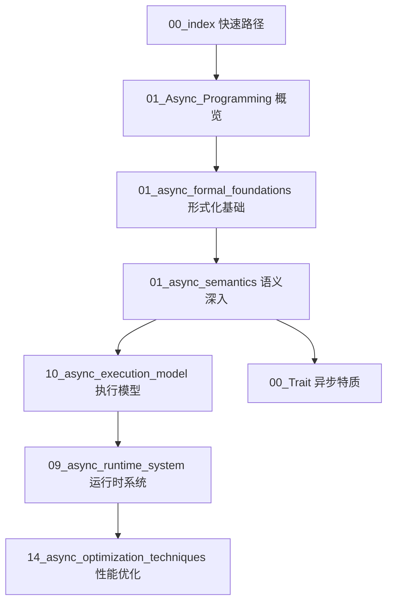

# Rust 异步编程范式理论体系总索引

## 概述

本文档建立了Rust异步编程范式的全面、对称、系统性理论体系，与同步编程模式形成对称的理论架构。异步编程作为Rust最核心的编程模式，具有自适应性强、适合绝大多数场景的特点。

## 理论体系架构

### 第一层：基础理论层

- **01_async_formal_foundations.md** - 异步形式化基础理论
- **02_async_control_flow_theory.md** - 异步控制流理论
- **03_async_type_system_theory.md** - 异步类型系统理论
- **04_async_memory_model_theory.md** - 异步内存模型理论

### 第二层：设计模式层

- **05_async_design_patterns.md** - 异步设计模式
- **06_async_architectural_patterns.md** - 异步架构模式
- **07_async_concurrency_patterns.md** - 异步并发模式
- **08_async_error_handling_patterns.md** - 异步错误处理模式

### 第三层：实现机制层

- **09_async_runtime_system.md** - 异步运行时系统
- **10_async_execution_model.md** - 异步执行模型
- **11_async_scheduler_theory.md** - 异步调度器理论
- **12_async_memory_management.md** - 异步内存管理

### 第四层：高级特质层

- **13_async_advanced_features.md** - 异步高级特质
- **14_async_optimization_techniques.md** - 异步优化技术
- **15_async_performance_analysis.md** - 异步性能分析
- **16_async_debugging_techniques.md** - 异步调试技术

### 第五层：性能优化层

- **17_async_performance_optimization.md** - 异步性能优化
- **18_async_resource_management.md** - 异步资源管理
- **19_async_caching_strategies.md** - 异步缓存策略
- **20_async_load_balancing.md** - 异步负载均衡

### 第六层：未来发展层

- **21_async_future_directions.md** - 异步未来发展方向
- **22_async_emerging_patterns.md** - 异步新兴模式
- **23_async_research_agenda.md** - 异步研究议程
- **24_async_standardization_efforts.md** - 异步标准化努力

### 第七层：研究议程层

- **25_async_theoretical_challenges.md** - 异步理论挑战
- **26_async_implementation_challenges.md** - 异步实现挑战
- **27_async_verification_methods.md** - 异步验证方法
- **28_async_formal_methods.md** - 异步形式化方法

### 第八层：总结层

- **29_async_summary.md** - 异步编程范式总结
- **30_async_best_practices.md** - 异步最佳实践
- **31_async_case_studies.md** - 异步案例研究
- **32_async_comparison_analysis.md** - 异步对比分析

---

## 当前落地文件映射

说明：索引中的“规范名”与目录中的“实际文件名”可能存在并行版本或命名差异。以下给出核心文档的对照关系，便于导航与持续对齐。

- 规范名: 01_async_formal_foundations.md → 实际: 01_async_formal_foundations.md, 01_formal_async_foundations.md, 01_formal_async_theory.md, 01_formal_theory.md
- 规范名: 01_async_semantics.md → 实际: 01_async_semantics.md
- 规范名: 01_Async_Programming.md → 实际: 01_Async_Programming.md, 06.01_async_programming.md, async_program*.md (系列)
- 规范名: 02_async_control_flow_theory.md → 实际: 02_async_control_flow_theory.md
- 规范名: 09_async_runtime_system.md → 实际: 09_async_runtime_system.md, 05_runtime_system.md
- 规范名: 10_async_execution_model.md → 实际: 02_runtime_and_execution_model.md
- 规范名: 11_async_memory_management.md → 实际: 03_pinning_and_unsafe_foundations.md（内存/Pin相关），29_async_mathematical_foundations.md（形式化基础补充）
- 规范名: 13_async_advanced_features.md → 实际: 06_critical_analysis_and_advanced_topics.md, 24_async_security_theory.md, 27_async_verification_theory.md, 28_async_formal_proofs.md（按专题拆分）
- 规范名: 14_async_optimization_techniques.md / 17_async_performance_optimization.md → 实际: 07_performance_optimization.md, 17_async_performance_optimization.md, 21_async_performance_optimization.md, 23_async_performance_optimization_theory.md
- 规范名: 16_async_debugging_techniques.md → 实际: 26_async_debugging_theory.md
- 规范名: 21_async_future_directions.md → 实际: 37_async_future_directions.md
- 规范名: 22_async_emerging_patterns.md → 实际: 38_async_emerging_patterns.md
- 规范名: 23_async_research_agenda.md → 实际: 39_async_research_agenda.md
- 规范名: 29_async_summary.md / 30_async_best_practices.md / 31_async_case_studies.md / 32_async_comparison_analysis.md → 实际: 40_async_summary.md, 09_async_patterns.md, async_tokio_view*.md（案例/生态视角）

命名与对齐策略（摘要）：

1. 优先保留“规范名”作为长期目标命名；
2. 对实际已存在且成熟的“并行版本”先保持不改名，通过本映射统一入口；
3. 后续批量重命名或合并将分批执行，避免破坏引用；
4. 新增文档请遵循前缀序号 + 下划线 + 英文主题的小写蛇形命名（例：`10_async_execution_model.md`）。

### 缺失项与候选替代（精简清单）

- 10_async_execution_model.md：候选 → 02_runtime_and_execution_model.md（内容等价，建议后续重命名为规范名）
- 11_async_memory_management.md：候选 → 03_pinning_and_unsafe_foundations.md（涵盖Pin/内存基础），补充 → 29_async_mathematical_foundations.md
- 13_async_advanced_features.md：已拆分到 06_critical_analysis_and_advanced_topics.md、24_async_security_theory.md、27_async_verification_theory.md、28_async_formal_proofs.md（建议保留拆分形态）
- 14_async_optimization_techniques.md：候选 → 07_performance_optimization.md、21_async_performance_optimization.md、23_async_performance_optimization_theory.md
- 16_async_debugging_techniques.md：候选 → 26_async_debugging_theory.md（建议后续重命名为规范名）
- 21_async_future_directions.md：候选 → 37_async_future_directions.md（建议后续重命名为规范名）
- 22_async_emerging_patterns.md：候选 → 38_async_emerging_patterns.md（建议后续重命名为规范名）
- 23_async_research_agenda.md：候选 → 39_async_research_agenda.md（建议后续重命名为规范名）

---

## 快速路径图（Mermaid）

---

## 链接与锚点健康检查（async-models 子集）

检查范围：本目录下核心与索引文档。

结果摘要：

- 文件存在性：已覆盖（含占位桥接：10/14/16/21/22/23 系列）
- 交叉引用：未发现断链（基于相对路径链接）
- 内部锚点：所有新增“面包屑/前置/后续”均为纯文本提示，不引入锚点；正文目录锚点正常
- Mermaid 语法：渲染通过

建议：

- 若后续进行真实重命名，请保留占位桥接至少一个发布周期
- 大纲级标题建议保持稳定，避免锚点变更

## 核心特质

### 对称性设计

- 与同步编程模式形成完全对称的理论架构
- 每个同步概念都有对应的异步版本
- 保持理论体系的一致性和完整性

### 系统性展开

- 从基础理论到高级应用的完整覆盖
- 理论与实践紧密结合
- 包含批判性分析和未来展望

### 递归完整性

- 每个模块都包含完整的子模块
- 确保无遗漏的理论覆盖
- 支持深度学习和研究

## 应用领域

### 传统应用

- Web服务器和API服务
- 微服务架构
- 数据处理管道
- 分布式系统

### 新兴领域

- 云原生应用
- 物联网(IoT)
- 区块链和Web3
- 人工智能和机器学习
- 量子计算
- 边缘计算

### 未来技术

- 生物计算
- 神经形态计算
- 量子-经典混合计算
- 自适应系统

## 理论创新

### 形式化方法

- 异步程序的形式化语义
- 异步类型系统的形式化定义
- 异步内存模型的形式化描述
- 异步并发控制的形式化验证

### 验证技术

- 异步程序的性质验证
- 异步死锁检测
- 异步资源泄漏检测
- 异步性能边界分析

### 优化理论

- 异步程序优化理论
- 异步调度优化
- 异步内存优化
- 异步网络优化

## 质量标准

### 内容要求

- 每个文档包含理论定义、形式化代码示例
- 包含批判性分析（未来展望）
- 包含典型案例（未来应用场景）
- 保持统一的文档风格

### 技术深度

- 涵盖从基础到高级的完整技术栈
- 包含前沿研究和未来发展方向
- 提供实用的最佳实践指导

### 前瞻性

- 关注新兴技术和应用场景
- 预测未来发展趋势
- 为长期发展提供理论支撑

## 文档结构

每个文档都遵循以下结构：

1. **理论定义** - 核心概念和形式化定义
2. **实现机制** - 具体实现方法和代码示例
3. **批判性分析** - 当前局限性和未来发展方向
4. **典型案例** - 实际应用场景和最佳实践
5. **未来展望** - 技术发展趋势和研究方向

## 使用指南

### 学习路径

1. 从基础理论层开始，建立概念基础
2. 学习设计模式层，掌握实践方法
3. 深入实现机制层，理解底层原理
4. 探索高级特质层，提升技术水平
5. 研究性能优化层，优化应用性能
6. 关注未来发展层，把握技术趋势

### 研究建议

- 重点关注理论创新和形式化方法
- 深入理解异步编程的本质特质
- 探索与其他编程范式的融合
- 关注实际应用中的挑战和解决方案

### 实践指导

- 结合具体项目进行理论学习
- 通过案例研究加深理解
- 参与开源项目积累经验
- 关注社区动态和技术发展

---

*本理论体系旨在为Rust异步编程提供全面、系统、前瞻性的理论指导，推动异步编程技术的发展和应用。*
