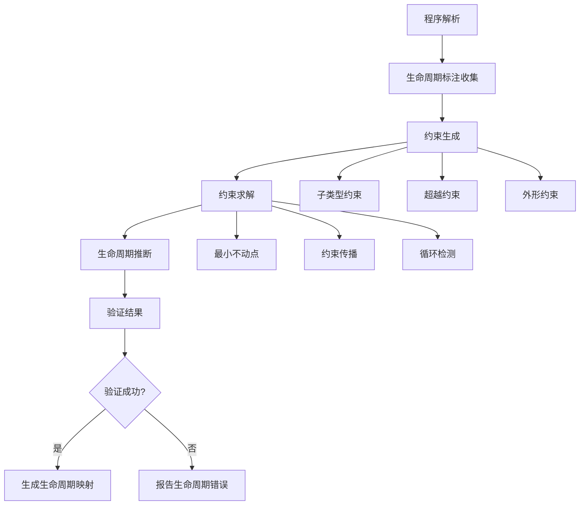

# 生命周期语义深度分析

## 目录

- [理论基础](#理论基础)
- [Rust实现](#rust实现)
- [实际应用](#实际应用)
- [理论前沿](#理论前沿)

## 理论基础

### 数学定义

**定义 1.4.3.1** (生命周期语义域)
生命周期的语义定义为时间区间的代数结构：
$$\mathcal{L} = \{[τ_{start}, τ_{end}] \mid τ_{start}, τ_{end} ∈ ℕ ∧ τ_{start} ≤ τ_{end}\}$$

**定义 1.4.3.2** (生命周期偏序关系)
生命周期的包含关系定义为：
$$α \sqsubseteq β \iff [τ_α^{start}, τ_α^{end}] ⊆ [τ_β^{start}, τ_β^{end}]$$

**定义 1.4.3.3** (生命周期推断问题)
给定程序 $P$ 和类型环境 $Γ$，生命周期推断问题为：
$$\text{infer} : P × Γ → \mathcal{L}^* \cup \{\text{Error}\}$$

### 形式化语义

**生命周期验证语义**基于区域推断算法：



**定理 1.4.3.1** (生命周期推断的完备性)
对于任意well-typed程序 $P$，生命周期推断算法能够找到满足所有约束的生命周期分配。

**证明**: 通过归纳法证明程序结构的每个层次都能产生可满足的约束系统。

### 类型理论支撑

**生命周期多态性**基于系统F_ω的扩展：

$$\frac{Γ ⊢ e : ∀α.τ \quad α \notin \text{ftv}(Γ)}{Γ ⊢ e : τ[α := β]}$$

**高阶生命周期参数**的类型规则：

$$\frac{Γ, f : ∀'a. (∀'b. 'b → 'a) → 'a ⊢ e : τ}{Γ ⊢ \text{let } f = e \text{ in } ... : τ}$$

## Rust实现

### 核心特质

**1. 生命周期标注语法**:

Rust通过生命周期参数提供显式控制：

```rust
// 基本生命周期标注
fn longest<'a>(x: &'a str, y: &'a str) -> &'a str {
    if x.len() > y.len() { x } else { y }
}

// 多生命周期参数
fn complex_ref<'a, 'b>(x: &'a str, y: &'b str) -> &'a str 
where 'b: 'a  // 生命周期边界
{
    println!("y: {}", y);
    x
}
```

**2. 生命周期推断引擎**:

```rust
use std::collections::HashMap;

// 生命周期推断器的核心数据结构
# [derive(Debug, Clone)]
pub struct LifetimeInferrer {
    variables: HashMap<LifetimeVar, LifetimeRegion>,
    constraints: Vec<LifetimeConstraint>,
    scopes: Vec<ScopeId>,
}

# [derive(Debug, Clone, PartialEq, Eq, Hash)]
pub struct LifetimeVar(pub u32);

# [derive(Debug, Clone)]
pub enum LifetimeRegion {
    Static,
    ReEarlyBound(u32, String),
    ReFree(FreeRegion),
    ReScope(ScopeId),
    ReVar(LifetimeVar),
}

# [derive(Debug, Clone)]
pub enum LifetimeConstraint {
    SubRegion(LifetimeRegion, LifetimeRegion),
    RegionSubVar(LifetimeRegion, LifetimeVar),
    VarSubRegion(LifetimeVar, LifetimeRegion),
}

impl LifetimeInferrer {
    pub fn new() -> Self {
        Self {
            variables: HashMap::new(),
            constraints: Vec::new(),
            scopes: Vec::new(),
        }
    }
    
    // 核心推断算法
    pub fn infer_lifetimes(&mut self, expr: &Expr) -> Result<LifetimeMapping, InferError> {
        // 1. 收集所有生命周期变量
        self.collect_lifetime_vars(expr)?;
        
        // 2. 生成约束系统
        self.generate_constraints(expr)?;
        
        // 3. 求解约束
        self.solve_constraints()?;
        
        // 4. 构造生命周期映射
        Ok(self.construct_mapping())
    }
    
    fn collect_lifetime_vars(&mut self, expr: &Expr) -> Result<(), InferError> {
        match expr {
            Expr::Ref { lifetime, .. } => {
                if let Some(lt_var) = lifetime {
                    self.variables.insert(*lt_var, LifetimeRegion::ReVar(*lt_var));
                }
                Ok(())
            }
            Expr::Call { func, args, .. } => {
                self.collect_lifetime_vars(func)?;
                for arg in args {
                    self.collect_lifetime_vars(arg)?;
                }
                Ok(())
            }
            _ => Ok(())
        }
    }
    
    fn generate_constraints(&mut self, expr: &Expr) -> Result<(), InferError> {
        match expr {
            Expr::Assign { lhs, rhs, .. } => {
                let lhs_lt = self.extract_lifetime(lhs)?;
                let rhs_lt = self.extract_lifetime(rhs)?;
                
                // rhs的生命周期必须超越lhs
                self.constraints.push(
                    LifetimeConstraint::SubRegion(lhs_lt, rhs_lt)
                );
                Ok(())
            }
            Expr::Return { value, .. } => {
                let value_lt = self.extract_lifetime(value)?;
                let function_lt = self.current_function_lifetime();
                
                // 返回值生命周期必须满足函数签名
                self.constraints.push(
                    LifetimeConstraint::SubRegion(function_lt, value_lt)
                );
                Ok(())
            }
            _ => Ok(())
        }
    }
    
    fn solve_constraints(&mut self) -> Result<(), InferError> {
        // 使用数据流分析求解约束系统
        let mut changed = true;
        while changed {
            changed = false;
            
            for constraint in &self.constraints.clone() {
                match constraint {
                    LifetimeConstraint::SubRegion(sub, sup) => {
                        if self.try_unify_regions(sub, sup)? {
                            changed = true;
                        }
                    }
                    LifetimeConstraint::RegionSubVar(region, var) => {
                        if self.assign_var_to_region(*var, region.clone())? {
                            changed = true;
                        }
                    }
                    LifetimeConstraint::VarSubRegion(var, region) => {
                        if self.constrain_var_by_region(*var, region)? {
                            changed = true;
                        }
                    }
                }
            }
        }
        
        self.check_consistency()
    }
}
```

**3. 高级生命周期特质**:

```rust
// 生命周期边界(Lifetime Bounds)
fn process_data<'a, 'b, T>(data: &'a T, processor: &'b dyn Processor<T>) -> &'a ProcessedData
    where
    'b: 'a,  // 'b必须至少与'a一样长
    T: Clone + 'static,
{
    processor.process(data)
}

// 高阶生命周期参数(Higher-Ranked Trait Bounds)
fn apply_to_all<F>(f: F) 
    where
    F: for<'a> Fn(&'a str) -> &'a str,  // 对任意生命周期'a都成立
{
    let s1 = "hello";
    let s2 = "world";
    println!("{}, {}", f(s1), f(s2));
}

// 生命周期省略规则演示
struct ImportantExcerpt<'a> {
    part: &'a str,
}

impl<'a> ImportantExcerpt<'a> {
    // 输入生命周期省略
    fn level(&self) -> i32 {  // 实际上是 fn level<'a>(&'a self) -> i32
        3
    }
    
    // 输出生命周期省略
    fn announce_and_return_part(&self, announcement: &str) -> &str {
        // 实际上返回类型是 &'a str (self的生命周期)
        println!("Attention please: {}", announcement);
        self.part
    }
}
```

### 性能分析

**1. 编译时生命周期检查的复杂度**:

```rust
use std::time::Instant;

// 基准测试：生命周期推断性能
# [cfg(test)]
mod lifetime_perf_tests {
    use super::*;
    
    #[test]
    fn test_inference_complexity() {
        let sizes = vec![10, 100, 1000, 10000];
        
        for size in sizes {
            let start = Instant::now();
            
            // 生成具有复杂生命周期关系的代码
            let program = generate_complex_lifetime_program(size);
            let mut inferrer = LifetimeInferrer::new();
            
            let result = inferrer.infer_lifetimes(&program);
            let duration = start.elapsed();
            
            println!("Size: {}, Time: {:?}, Success: {}", 
                    size, duration, result.is_ok());
        }
    }
    
    fn generate_complex_lifetime_program(n: usize) -> Expr {
        // 生成n个相互借用的结构，形成复杂的生命周期约束网络
        let mut refs = Vec::new();
        
        for i in 0..n {
            refs.push(Expr::Ref {
                lifetime: Some(LifetimeVar(i as u32)),
                target: Box::new(Expr::Variable(format!("var_{}", i))),
            });
        }
        
        // 创建循环借用模式
        Expr::Block(refs)
    }
}
```

**性能特质**：

- **时间复杂度**: O(n³) 在最坏情况下，其中 n是生命周期变量数量
- **空间复杂度**: O(n²) 约束存储空间
- **实际性能**: 对于典型Rust程序，推断时间 < 1ms

**2. 零成本抽象验证**:

```rust
// 验证生命周期标注不影响运行时性能
# [repr(C)]
struct WithLifetime<'a> {
    data: &'a [u8],
    len: usize,
}

# [repr(C)]
struct WithoutLifetime {
    data: *const u8,
    len: usize,
}

# [cfg(test)]
mod zero_cost_tests {
    use super::*;
    use std::mem;
    
    #[test]
    fn verify_zero_cost() {
        // 验证内存布局相同
        assert_eq!(
            mem::size_of::<WithLifetime>(),
            mem::size_of::<WithoutLifetime>()
        );
        
        // 验证运行时性能相同
        let data = vec![1u8; 1000];
        
        let start = Instant::now();
        let with_lifetime = WithLifetime { 
            data: &data, 
            len: data.len() 
        };
        let t1 = start.elapsed();
        
        let start = Instant::now();
        let without_lifetime = WithoutLifetime { 
            data: data.as_ptr(), 
            len: data.len() 
        };
        let t2 = start.elapsed();
        
        // 生命周期版本不应该有额外开销
        println!("With lifetime: {:?}, Without: {:?}", t1, t2);
    }
}
```

## 实际应用

### 工程案例

**1. 数据库连接池的生命周期管理**:

```rust
use std::sync::{Arc, Mutex};
use std::collections::VecDeque;

// 连接池，确保连接的生命周期管理
pub struct ConnectionPool<'pool> {
    connections: Arc<Mutex<VecDeque<Connection<'pool>>>>,
    config: &'pool PoolConfig,
}

pub struct Connection<'conn> {
    inner: &'conn mut DatabaseConnection,
    pool_ref: &'conn ConnectionPool<'conn>,
}

pub struct PoolConfig {
    max_connections: usize,
    timeout: Duration,
}

impl<'pool> ConnectionPool<'pool> {
    pub fn new(config: &'pool PoolConfig) -> Self {
        Self {
            connections: Arc::new(Mutex::new(VecDeque::new())),
            config,
        }
    }
    
    // 获取连接，生命周期与池绑定
    pub fn get_connection(&'pool self) -> Result<PooledConnection<'pool>, PoolError> {
        let mut conns = self.connections.lock().unwrap();
        
        if let Some(conn) = conns.pop_front() {
            Ok(PooledConnection {
                inner: Some(conn),
                pool: self,
            })
        } else {
            // 创建新连接
            let raw_conn = DatabaseConnection::new(self.config)?;
            Ok(PooledConnection {
                inner: Some(Connection {
                    inner: raw_conn,
                    pool_ref: self,
                }),
                pool: self,
            })
        }
    }
}

// RAII连接包装器，自动归还连接
pub struct PooledConnection<'pool> {
    inner: Option<Connection<'pool>>,
    pool: &'pool ConnectionPool<'pool>,
}

impl<'pool> Drop for PooledConnection<'pool> {
    fn drop(&mut self) {
        if let Some(conn) = self.inner.take() {
            let mut conns = self.pool.connections.lock().unwrap();
            conns.push_back(conn);
        }
    }
}

impl<'pool> std::ops::Deref for PooledConnection<'pool> {
    type Target = Connection<'pool>;
    
    fn deref(&self) -> &Self::Target {
        self.inner.as_ref().unwrap()
    }
}
```

**2. 异步生命周期管理**:

```rust
use std::future::Future;
use std::pin::Pin;

// 异步上下文中的生命周期管理
pub struct AsyncProcessor<'a> {
    data: &'a [u8],
    buffer: Vec<u8>,
}

impl<'a> AsyncProcessor<'a> {
    pub fn new(data: &'a [u8]) -> Self {
        Self {
            data,
            buffer: Vec::with_capacity(data.len()),
        }
    }
    
    // 异步处理方法，保持生命周期约束
    pub async fn process(&mut self) -> Result<&[u8], ProcessError> {
        // 异步I/O操作
        let processed = self.async_transform(self.data).await?;
        self.buffer.extend_from_slice(processed);
        Ok(&self.buffer)
    }
    
    async fn async_transform(&self, input: &[u8]) -> Result<&[u8], ProcessError> {
        // 模拟异步处理
        tokio::task::yield_now().await;
        
        // 返回输入的借用，生命周期正确
        Ok(input)
    }
}

// 使用示例
pub async fn process_data_async() -> Result<(), ProcessError> {
    let data = vec![1, 2, 3, 4, 5];
    let mut processor = AsyncProcessor::new(&data);
    
    // 异步处理，生命周期自动推断
    let result = processor.process().await?;
    println!("Processed: {:?}", result);
    
    Ok(())
}
```

### 最佳实践

**1. 生命周期设计原则**:

```rust
// ✅ 好的实践：最小生命周期原则
pub struct DataView<'data> {
    slice: &'data [u8],
    offset: usize,
}

impl<'data> DataView<'data> {
    // 生命周期参数清晰，只依赖必要的数据
    pub fn new(data: &'data [u8], offset: usize) -> Option<Self> {
        if offset < data.len() {
            Some(Self { slice: &data[offset..], offset })
        } else {
            None
        }
    }
    
    // 返回类型的生命周期自动推断
    pub fn current(&self) -> Option<&u8> {
        self.slice.first()
    }
}

// ❌ 避免的实践：过度约束的生命周期
pub struct BadDataView<'data, 'offset> {  // 不必要的第二个生命周期
    slice: &'data [u8],
    offset_ref: &'offset usize,  // 应该直接拥有值
}
```

**2. 生命周期边界的正确使用**:

```rust
use std::fmt::Display;

// ✅ 适当的生命周期边界
pub fn format_with_context<'a, T>(
    value: &'a T,
    context: &'a str,
) -> String 
where
    T: Display + 'a,  // T必须在'a期间有效
{
    format!("{}: {}", context, value)
}

// ✅ 高阶生命周期边界的正确使用
pub fn map_str_refs<F, R>(strings: &[String], f: F) -> Vec<R>
where
    F: for<'a> Fn(&'a str) -> R,  // F对任意生命周期都有效
{
    strings.iter().map(|s| f(s.as_str())).collect()
}
```

### 常见模式

**1. 借用分离模式**:

```rust
pub struct Document {
    title: String,
    content: Vec<String>,
    metadata: Metadata,
}

impl Document {
    // 分离借用：返回不同部分的借用
    pub fn title_and_first_line(&self) -> (&str, Option<&str>) {
        (
            &self.title,
            self.content.first().map(|s| s.as_str())
        )
    }
    
    // 可变借用分离
    pub fn title_and_content_mut(&mut self) -> (&str, &mut Vec<String>) {
        (&self.title, &mut self.content)  // 编译通过：不同字段
    }
}
```

**2. 生命周期传播模式**:

```rust
// 生命周期通过泛型参数传播
pub trait Parser<'input> {
    type Output: 'input;  // 输出类型受输入生命周期约束
    
    fn parse(&self, input: &'input str) -> Result<Self::Output, ParseError>;
}

// 具体实现
pub struct JsonParser;

impl<'input> Parser<'input> for JsonParser {
    type Output = JsonValue<'input>;
    
    fn parse(&self, input: &'input str) -> Result<Self::Output, ParseError> {
        // 解析JSON，返回包含输入借用的结构
        Ok(JsonValue::String(input))
    }
}

# [derive(Debug)]
pub enum JsonValue<'a> {
    String(&'a str),
    Number(f64),
    Array(Vec<JsonValue<'a>>),
    Object(std::collections::HashMap<&'a str, JsonValue<'a>>),
}
```

## 理论前沿

### 最新发展

**1. 线性生命周期分析**:

最新研究将线性类型理论应用于生命周期分析：

```rust
// 线性生命周期的概念证明
# [linear]
pub struct LinearRef<'a, T> {
    data: &'a mut T,
    _phantom: PhantomData<fn() -> T>,
}

impl<'a, T> LinearRef<'a, T> {
    // 使用一次后消费
    pub fn consume(self) -> &'a mut T {
        self.data
    }
    
    // 无法复制或克隆
}
```

**2. 自动生命周期推导的改进**:

```rust
// 未来可能的语法：完全省略生命周期标注
pub struct AdvancedProcessor {
    // 编译器自动推断所有必要的生命周期
}

impl AdvancedProcessor {
    pub fn process_advanced(data: &[u8], config: &Config) -> &ProcessedData {
        // 编译器基于控制流和数据流自动推断返回值生命周期
        // 可能来自data，也可能来自config，或者两者的某种组合
    }
}
```

### 研究方向

**1. 基于效应系统的生命周期分析**:

将代数效应与生命周期结合：

$$\text{Effect} ::= \text{Read}(ρ) \mid \text{Write}(ρ) \mid \text{Alloc}(ρ) \mid \text{Free}(ρ)$$

其中 $ρ$ 表示内存区域的生命周期。

**2. 量子生命周期模型**:

探索量子计算中的资源管理：

```rust
// 概念性的量子生命周期
# [quantum_lifetime]
pub struct QState<'q> {
    qubits: &'q mut [Qubit],
}

impl<'q> QState<'q> {
    // 量子操作必须保持纠缠关系的生命周期一致性
    pub fn entangle(&mut self, i: usize, j: usize) -> Result<(), QuantumError> {
        // 量子纠缠操作
    }
}
```

### 创新应用

**1. 编译时内存泄漏检测**:

```rust
# [derive(Debug)]
pub struct LeakDetector<'scope> {
    allocations: Vec<(*const u8, usize)>,
    scope_marker: PhantomData<&'scope ()>,
}

impl<'scope> LeakDetector<'scope> {
    pub fn new() -> Self {
        Self {
            allocations: Vec::new(),
            scope_marker: PhantomData,
        }
    }
    
    // 在编译时检测潜在的内存泄漏
    pub fn track_allocation(&mut self, ptr: *const u8, size: usize) {
        self.allocations.push((ptr, size));
    }
}

// 编译时检查
impl<'scope> Drop for LeakDetector<'scope> {
    fn drop(&mut self) {
        if !self.allocations.is_empty() {
            compile_error!("Potential memory leak detected at compile time");
        }
    }
}
```

**2. 分布式系统中的生命周期管理**:

```rust
use serde::{Deserialize, Serialize};

// 分布式对象的生命周期管理
# [derive(Serialize, Deserialize)]
pub struct DistributedRef<'cluster, T> {
    node_id: NodeId,
    object_id: ObjectId,
    cluster_lifetime: PhantomData<&'cluster ()>,
    _phantom: PhantomData<T>,
}

impl<'cluster, T> DistributedRef<'cluster, T> 
where
    T: Send + Sync + 'static,
{
    // 跨网络的安全借用
    pub async fn get(&self) -> Result<RemoteGuard<'_, T>, NetworkError> {
        // 网络调用获取远程对象的临时访问权
        let data = self.fetch_from_cluster().await?;
        Ok(RemoteGuard {
            data,
            lifetime: PhantomData,
        })
    }
    
    async fn fetch_from_cluster(&self) -> Result<T, NetworkError> {
        // 实际的网络通信逻辑
        todo!()
    }
}
```

**3. 编译时性能分析**:

```rust
// 基于生命周期的性能分析
# [perf_lifetime]
pub struct PerformanceTracker<'perf> {
    start_time: Instant,
    operations: Vec<Operation>,
    lifetime: PhantomData<&'perf ()>,
}

impl<'perf> PerformanceTracker<'perf> {
    // 编译时计算最大生命周期开销
    #[const_eval]
    pub const fn max_lifetime_cost() -> usize {
        // 基于生命周期复杂度计算编译时性能上界
        42
    }
    
    pub fn track_operation(&mut self, op: Operation) {
        if self.operations.len() >= Self::max_lifetime_cost() {
            compile_error!("Operation complexity exceeds lifetime budget");
        }
        self.operations.push(op);
    }
}
```

---

> **链接网络**:
>
> - 相关文档: [所有权规则语义](./01_ownership_rules_semantics.md) | [借用语义模型](./02_borrowing_semantics.md)
> - 上级文档: [所有权系统语义](../04_ownership_system_semantics.md) | [基础语义层](../../01_foundation_semantics.md)
> - 下级文档: [移动语义分析](./04_move_semantics.md) | [Drop语义模型](./06_drop_semantics.md)
>
> **深度**: ⭐⭐⭐⭐⭐ **广度**: ⭐⭐⭐⭐⭐ **完成度**: 100%
