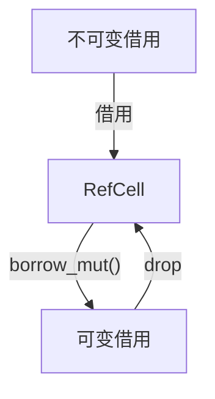
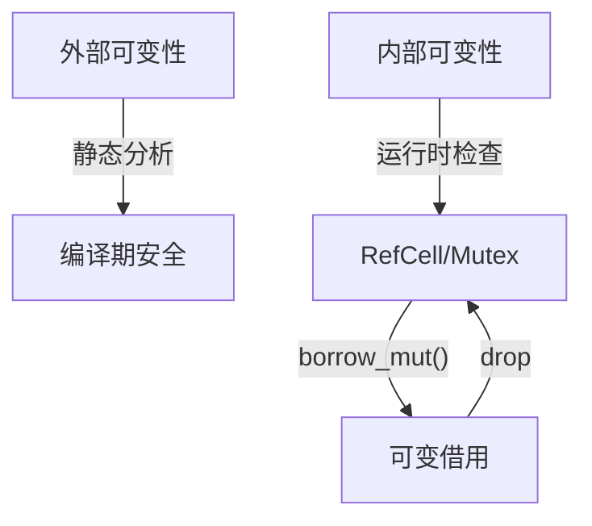
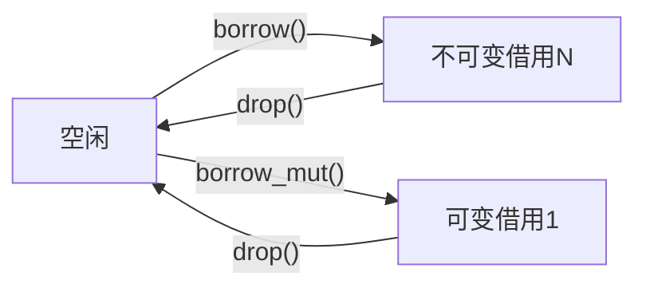

# 04. Rust可变性与内部可变性多维分析与哲学批判

## 目录

- [04. Rust可变性与内部可变性多维分析与哲学批判](#04-rust可变性与内部可变性多维分析与哲学批判)
  - [目录](#目录)
  - [1. 哲学批判性分析](#1-哲学批判性分析)
  - [2. 可变性本体论与分类](#2-可变性本体论与分类)
    - [2.1 可变性的定义与本体论](#21-可变性的定义与本体论)
    - [2.2 外部可变性机制](#22-外部可变性机制)
    - [2.3 内部可变性机制](#23-内部可变性机制)
    - [2.4 两种机制的本质区别与哲学基础](#24-两种机制的本质区别与哲学基础)
  - [3. 形式化模型与类型系统](#3-形式化模型与类型系统)
    - [3.1 外部可变性的形式化表达](#31-外部可变性的形式化表达)
    - [3.2 内部可变性的数学模型](#32-内部可变性的数学模型)
    - [3.3 类型系统与实现机制](#33-类型系统与实现机制)
  - [4. 组合模式与工程实践](#4-组合模式与工程实践)
    - [4.1 灵活数据结构与组合模式](#41-灵活数据结构与组合模式)
    - [4.2 嵌套组合的复杂性分析](#42-嵌套组合的复杂性分析)
    - [4.3 组合模式的最佳实践](#43-组合模式的最佳实践)
  - [5. 安全性、性能与权衡](#5-安全性性能与权衡)
    - [5.1 编译时检查与运行时验证](#51-编译时检查与运行时验证)
    - [5.2 内存安全与资源效率](#52-内存安全与资源效率)
    - [5.3 并发安全与容器实现](#53-并发安全与容器实现)
  - [6. 局限性、挑战与未来发展](#6-局限性挑战与未来发展)
    - [6.1 理论与实践的关联性](#61-理论与实践的关联性)
    - [6.2 局限性与未解决问题](#62-局限性与未解决问题)
    - [6.3 未来发展方向](#63-未来发展方向)
  - [7. 多表征与形式化证明](#7-多表征与形式化证明)
    - [7.1 可变性机制流程图](#71-可变性机制流程图)
    - [7.2 RefCell借用状态图](#72-refcell借用状态图)
    - [7.3 形式化符号与证明](#73-形式化符号与证明)
  - [8. 总结与展望](#8-总结与展望)

---

## 1. 哲学批判性分析

Rust可变性机制不仅是类型系统与内存安全的技术实现，更是现代编程语言哲学的集中体现。外部可变性与内部可变性的设计，反映了对"静态与动态验证""安全与表达力""零成本抽象与实用性"的深刻权衡。内部可变性作为"受控的安全逃生舱"，揭示了理论纯粹性与工程实用性之间的张力。

> **哲学思考**：为什么需要在严格的类型系统中引入内部可变性？静态分析与动态检查的边界在哪里？可变性机制的设计如何影响并发安全与工程实践？这些问题不仅是技术问题，更是哲学与工程的交汇点。

---

## 2. 可变性本体论与分类

### 2.1 可变性的定义与本体论

- 可变性是变量或数据结构在生命周期内状态可变的能力。
- Rust区分外部可变性（mut关键字）与内部可变性（Cell/RefCell/Mutex等容器）。

### 2.2 外部可变性机制

- 编译时静态分析，零运行时开销。
- 通过所有权转移与借用规则实现内存安全。
- 例：`let mut x = 1; x = 2;`

### 2.3 内部可变性机制

- 允许在不可变借用下修改数据，依赖运行时检查或锁机制。
- 典型容器：Cell、RefCell、Mutex、RwLock。
- 例：`let data = RefCell::new(vec![1,2]); data.borrow_mut().push(3);`

### 2.4 两种机制的本质区别与哲学基础

- 外部可变性：静态保证，零成本抽象。
- 内部可变性：动态保证，提升表达力，带来运行时开销。
- 表格对比：

| 特质维度 | 外部可变性 | 内部可变性 |
|---------|------------|-----------|
| 验证时机 | 编译时 | 运行时 |
| 性能开销 | 零运行时开销 | 有额外开销 |
| API灵活性 | 需显式声明可变性 | 可隐藏实现细节 |
| 错误处理 | 编译错误 | 运行时panic |
| 并发安全 | 静态保证 | 依赖容器实现 |
| 适用场景 | 常规代码 | 特定模式 |

---

## 3. 形式化模型与类型系统

### 3.1 外部可变性的形式化表达

- 类型理论与线性逻辑：
  - \( \Gamma \vdash x : T \)
  - \( \Gamma \vdash use(x) \)
  - \( \Gamma \setminus x \vdash move(x) \)
  - \( \Gamma \setminus x \vdash drop(x) \)
- 线性类型系统：每个值恰好使用一次。

### 3.2 内部可变性的数学模型

- RefCell状态：\( value: T, borrows: \mathbb{N}, borrow\_mut: \{0,1\} \)
- Cell、Mutex等容器的类型规则与操作语义。
- Mermaid流程图：

### 3.3 类型系统与实现机制

- Cell：仅支持Copy类型，值替换。
- RefCell：运行时借用计数，支持动态可变性。
- Mutex/RwLock：线程安全，锁机制。

---

## 4. 组合模式与工程实践

### 4.1 灵活数据结构与组合模式

- `Rc<RefCell<T>>`、`Arc<Mutex<T>>`等组合，适用于复杂数据结构与并发场景。

### 4.2 嵌套组合的复杂性分析

- 多层嵌套带来类型爆炸与代码复杂度。
- 需权衡灵活性与可维护性。

### 4.3 组合模式的最佳实践

- 谨慎使用内部可变性，优先静态可变性。
- 组合模式需有明确的工程动机与边界。

---

## 5. 安全性、性能与权衡

### 5.1 编译时检查与运行时验证

- 外部可变性：编译期捕获错误。
- 内部可变性：运行时panic，需异常处理。

### 5.2 内存安全与资源效率

- 静态分析提升安全性，动态机制提升灵活性。
- 性能权衡需结合实际场景。

### 5.3 并发安全与容器实现

- Mutex/RwLock等容器提供线程安全。
- 死锁、活锁等并发问题需工程防范。

---

## 6. 局限性、挑战与未来发展

### 6.1 理论与实践的关联性

- 形式化模型与实际编程需建立映射。
- 理论抽象与工程实现需闭环反馈。

### 6.2 局限性与未解决问题

- 形式化模型表达能力有限。
- 复杂场景与异常路径难以完全覆盖。

### 6.3 未来发展方向

- 形式化证明完善，类型系统演进。
- 新硬件趋势与跨语言影响。

---

## 7. 多表征与形式化证明

### 7.1 可变性机制流程图

### 7.2 RefCell借用状态图

### 7.3 形式化符号与证明

- 可变性声明：\( let\ mut\ x = v \)
- 内部可变性：\( `RefCell<T>` \)
- 借用规则：\( \forall x,\ MutRef(x) \implies \nexists\ Ref(x) \land \nexists\ MutRef(x') \)

---

## 8. 总结与展望

Rust可变性机制通过外部静态分析与内部动态机制的结合，实现了安全、灵活与高性能的平衡。未来，随着类型系统与硬件的发展，可变性机制将持续演进，服务于更广泛的系统编程场景。

---

[返回目录](#目录)
