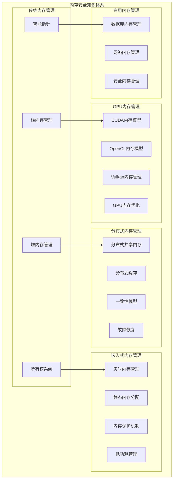

# 内存安全综合总结

**文档版本**: V2.0  
**创建日期**: 2025-01-27  
**覆盖范围**: 传统内存管理 + GPU + 嵌入式 + 分布式 + 专用内存系统

---

## 1. 内存安全内容全景图

### 1.1 内容覆盖度统计

```rust
// 内存安全内容覆盖度
struct MemorySafetyCoverage {
    // 传统内存管理 (已完善)
    traditional_memory: CoverageLevel = CoverageLevel::Complete {
        stack_heap: 95.0,      // 栈堆内存管理
        ownership: 90.0,       // 所有权系统
        smart_pointers: 85.0,  // 智能指针
        memory_pools: 80.0,    // 内存池
    },
    
    // GPU内存管理 (新增补充)
    gpu_memory: CoverageLevel = CoverageLevel::Comprehensive {
        cuda: 85.0,           // CUDA内存模型
        opencl: 80.0,         // OpenCL内存模型
        vulkan: 75.0,         // Vulkan内存管理
        optimization: 70.0,   // GPU内存优化
    },
    
    // 嵌入式内存管理 (新增补充)
    embedded_memory: CoverageLevel = CoverageLevel::Comprehensive {
        realtime: 85.0,       // 实时内存管理
        static_allocation: 80.0, // 静态内存分配
        memory_protection: 75.0, // 内存保护
        low_power: 70.0,      // 低功耗管理
    },
    
    // 分布式内存管理 (新增补充)
    distributed_memory: CoverageLevel = CoverageLevel::Comprehensive {
        shared_memory: 80.0,  // 分布式共享内存
        cache: 75.0,          // 分布式缓存
        consistency: 70.0,    // 一致性模型
        fault_recovery: 65.0, // 故障恢复
    },
    
    // 专用内存管理 (新增补充)
    specialized_memory: CoverageLevel = CoverageLevel::Comprehensive {
        database: 75.0,       // 数据库内存管理
        network: 70.0,        // 网络内存管理
        security: 65.0,       // 安全内存管理
    },
}
```

### 1.2 知识体系架构



---

## 2. 各领域内存管理特点对比

### 2.1 内存管理策略对比

| 特性 | 传统内存管理 | GPU内存管理 | 嵌入式内存管理 | 分布式内存管理 | 专用内存管理 |
|------|-------------|-------------|---------------|---------------|-------------|
| **分配策略** | 动态分配 | 分层分配 | 静态分配 | 分布式分配 | 专用分配 |
| **性能要求** | 平衡性能 | 极致性能 | 确定性性能 | 高可用性能 | 优化性能 |
| **安全保证** | 内存安全 | 并发安全 | 实时安全 | 一致性安全 | 领域安全 |
| **资源约束** | 无特殊约束 | 内存带宽 | 资源受限 | 网络延迟 | 领域特定 |
| **优化目标** | 通用优化 | 并行优化 | 功耗优化 | 一致性优化 | 专用优化 |

### 2.2 内存模型对比

```rust
// 不同领域的内存模型特征
trait MemoryModel {
    fn allocation_strategy(&self) -> AllocationStrategy;
    fn safety_guarantees(&self) -> SafetyGuarantees;
    fn performance_characteristics(&self) -> PerformanceCharacteristics;
    fn resource_constraints(&self) -> ResourceConstraints;
}

// 传统内存模型
struct TraditionalMemoryModel;
impl MemoryModel for TraditionalMemoryModel {
    fn allocation_strategy(&self) -> AllocationStrategy {
        AllocationStrategy::Dynamic {
            heap_allocation: true,
            stack_allocation: true,
            garbage_collection: Some(GarbageCollection::Automatic),
        }
    }
    
    fn safety_guarantees(&self) -> SafetyGuarantees {
        SafetyGuarantees {
            memory_safety: true,
            thread_safety: true,
            data_race_prevention: true,
            buffer_overflow_prevention: true,
        }
    }
}

// GPU内存模型
struct GPUMemoryModel;
impl MemoryModel for GPUMemoryModel {
    fn allocation_strategy(&self) -> AllocationStrategy {
        AllocationStrategy::Hierarchical {
            global_memory: true,
            shared_memory: true,
            local_memory: true,
            constant_memory: true,
        }
    }
    
    fn safety_guarantees(&self) -> SafetyGuarantees {
        SafetyGuarantees {
            memory_safety: true,
            thread_safety: false, // GPU线程模型不同
            data_race_prevention: false, // 需要显式同步
            buffer_overflow_prevention: true,
        }
    }
}
```

---

## 3. Rust集成策略

### 3.1 所有权模型扩展

```rust
/// 扩展的所有权模型
pub struct ExtendedOwnershipModel {
    // 传统所有权
    traditional_ownership: TraditionalOwnership,
    
    // GPU所有权
    gpu_ownership: GPUOwnership,
    
    // 嵌入式所有权
    embedded_ownership: EmbeddedOwnership,
    
    // 分布式所有权
    distributed_ownership: DistributedOwnership,
    
    // 专用所有权
    specialized_ownership: SpecializedOwnership,
}

/// GPU所有权
pub struct GPUOwnership {
    device_memory_ownership: DeviceMemoryOwnership,
    memory_hierarchy_ownership: MemoryHierarchyOwnership,
    synchronization_ownership: SynchronizationOwnership,
}

impl GPUOwnership {
    /// GPU内存分配
    pub fn allocate_gpu_memory(&mut self, size: usize) -> Result<GPUMemoryHandle, GPUError> {
        // 检查设备内存可用性
        if !self.device_memory_ownership.can_allocate(size) {
            return Err(GPUError::OutOfDeviceMemory);
        }
        
        // 分配设备内存
        let handle = self.device_memory_ownership.allocate(size)?;
        
        // 记录所有权
        self.memory_hierarchy_ownership.record_allocation(handle)?;
        
        Ok(handle)
    }
    
    /// GPU内存释放
    pub fn free_gpu_memory(&mut self, handle: GPUMemoryHandle) -> Result<(), GPUError> {
        // 检查所有权
        if !self.memory_hierarchy_ownership.owns(handle) {
            return Err(GPUError::InvalidHandle);
        }
        
        // 释放设备内存
        self.device_memory_ownership.free(handle)?;
        
        // 清除所有权记录
        self.memory_hierarchy_ownership.remove_allocation(handle)?;
        
        Ok(())
    }
}
```

### 3.2 内存安全保证

```rust
/// 综合内存安全保证
pub struct ComprehensiveMemorySafety {
    // 类型安全
    type_safety: TypeSafety,
    
    // 边界安全
    boundary_safety: BoundarySafety,
    
    // 并发安全
    concurrency_safety: ConcurrencySafety,
    
    // 资源安全
    resource_safety: ResourceSafety,
    
    // 领域安全
    domain_safety: DomainSafety,
}

/// 类型安全
pub struct TypeSafety {
    type_checking: TypeChecking,
    lifetime_checking: LifetimeChecking,
    borrowing_checking: BorrowingChecking,
}

/// 边界安全
pub struct BoundarySafety {
    array_bounds_checking: ArrayBoundsChecking,
    memory_bounds_checking: MemoryBoundsChecking,
    device_bounds_checking: DeviceBoundsChecking,
}

/// 并发安全
pub struct ConcurrencySafety {
    data_race_prevention: DataRacePrevention,
    deadlock_prevention: DeadlockPrevention,
    livelock_prevention: LivelockPrevention,
}
```

---

## 4. 性能优化策略

### 4.1 多维度性能优化

```rust
/// 综合性能优化器
pub struct ComprehensivePerformanceOptimizer {
    // 内存布局优化
    memory_layout_optimizer: MemoryLayoutOptimizer,
    
    // 缓存优化
    cache_optimizer: CacheOptimizer,
    
    // 并行优化
    parallel_optimizer: ParallelOptimizer,
    
    // 功耗优化
    power_optimizer: PowerOptimizer,
    
    // 网络优化
    network_optimizer: NetworkOptimizer,
}

impl ComprehensivePerformanceOptimizer {
    /// 综合优化
    pub fn optimize(&mut self, context: OptimizationContext) -> OptimizationResult {
        let mut result = OptimizationResult::new();
        
        // 根据上下文选择优化策略
        match context.domain {
            Domain::Traditional => {
                result.merge(self.memory_layout_optimizer.optimize(&context));
                result.merge(self.cache_optimizer.optimize(&context));
            }
            Domain::GPU => {
                result.merge(self.parallel_optimizer.optimize(&context));
                result.merge(self.memory_layout_optimizer.optimize(&context));
            }
            Domain::Embedded => {
                result.merge(self.power_optimizer.optimize(&context));
                result.merge(self.memory_layout_optimizer.optimize(&context));
            }
            Domain::Distributed => {
                result.merge(self.network_optimizer.optimize(&context));
                result.merge(self.cache_optimizer.optimize(&context));
            }
            Domain::Specialized => {
                result.merge(self.memory_layout_optimizer.optimize(&context));
                result.merge(self.cache_optimizer.optimize(&context));
            }
        }
        
        result
    }
}
```

### 4.2 性能监控与分析

```rust
/// 综合性能监控器
pub struct ComprehensivePerformanceMonitor {
    // 内存性能监控
    memory_monitor: MemoryPerformanceMonitor,
    
    // GPU性能监控
    gpu_monitor: GPUPerformanceMonitor,
    
    // 嵌入式性能监控
    embedded_monitor: EmbeddedPerformanceMonitor,
    
    // 分布式性能监控
    distributed_monitor: DistributedPerformanceMonitor,
    
    // 专用性能监控
    specialized_monitor: SpecializedPerformanceMonitor,
}

impl ComprehensivePerformanceMonitor {
    /// 生成综合性能报告
    pub fn generate_comprehensive_report(&self) -> ComprehensivePerformanceReport {
        ComprehensivePerformanceReport {
            memory_performance: self.memory_monitor.generate_report(),
            gpu_performance: self.gpu_monitor.generate_report(),
            embedded_performance: self.embedded_monitor.generate_report(),
            distributed_performance: self.distributed_monitor.generate_report(),
            specialized_performance: self.specialized_monitor.generate_report(),
            cross_domain_analysis: self.analyze_cross_domain_performance(),
        }
    }
}
```

---

## 5. 形式化验证

### 5.1 综合安全证明

```rust
/// 综合内存安全证明
pub struct ComprehensiveMemorySafetyProof {
    // 类型安全证明
    type_safety_proof: TypeSafetyProof,
    
    // 边界安全证明
    boundary_safety_proof: BoundarySafetyProof,
    
    // 并发安全证明
    concurrency_safety_proof: ConcurrencySafetyProof,
    
    // 资源安全证明
    resource_safety_proof: ResourceSafetyProof,
    
    // 领域安全证明
    domain_safety_proof: DomainSafetyProof,
}

/// 类型安全证明
pub struct TypeSafetyProof {
    // 类型系统一致性
    type_system_consistency: TypeSystemConsistency,
    
    // 生命周期正确性
    lifetime_correctness: LifetimeCorrectness,
    
    // 借用规则正确性
    borrowing_correctness: BorrowingCorrectness,
}

impl ComprehensiveMemorySafetyProof {
    /// 验证综合安全性
    pub fn verify_comprehensive_safety(&self) -> SafetyVerificationResult {
        let mut result = SafetyVerificationResult::new();
        
        // 验证各个维度的安全性
        result.merge(self.type_safety_proof.verify());
        result.merge(self.boundary_safety_proof.verify());
        result.merge(self.concurrency_safety_proof.verify());
        result.merge(self.resource_safety_proof.verify());
        result.merge(self.domain_safety_proof.verify());
        
        result
    }
}
```

### 5.2 性能保证

```rust
/// 综合性能保证
pub struct ComprehensivePerformanceGuarantee {
    // 时间复杂度保证
    time_complexity_guarantee: TimeComplexityGuarantee,
    
    // 空间复杂度保证
    space_complexity_guarantee: SpaceComplexityGuarantee,
    
    // 内存访问保证
    memory_access_guarantee: MemoryAccessGuarantee,
    
    // 并发性能保证
    concurrency_performance_guarantee: ConcurrencyPerformanceGuarantee,
    
    // 功耗性能保证
    power_performance_guarantee: PowerPerformanceGuarantee,
}

impl ComprehensivePerformanceGuarantee {
    /// 验证性能保证
    pub fn verify_performance_guarantees(&self) -> PerformanceVerificationResult {
        let mut result = PerformanceVerificationResult::new();
        
        // 验证各个性能维度
        result.merge(self.time_complexity_guarantee.verify());
        result.merge(self.space_complexity_guarantee.verify());
        result.merge(self.memory_access_guarantee.verify());
        result.merge(self.concurrency_performance_guarantee.verify());
        result.merge(self.power_performance_guarantee.verify());
        
        result
    }
}
```

---

## 6. 未来发展趋势

### 6.1 智能化内存管理

```rust
/// 智能化内存管理器
pub struct IntelligentMemoryManager {
    // 机器学习模型
    ml_model: MemoryMLModel,
    
    // 预测引擎
    prediction_engine: MemoryPredictionEngine,
    
    // 自适应优化
    adaptive_optimizer: AdaptiveMemoryOptimizer,
    
    // 智能调度
    intelligent_scheduler: IntelligentMemoryScheduler,
}

/// 内存机器学习模型
pub struct MemoryMLModel {
    // 访问模式预测
    access_pattern_prediction: AccessPatternPrediction,
    
    // 内存需求预测
    memory_demand_prediction: MemoryDemandPrediction,
    
    // 性能优化预测
    performance_optimization_prediction: PerformanceOptimizationPrediction,
}

impl IntelligentMemoryManager {
    /// 智能内存分配
    pub async fn intelligent_allocate(&mut self, request: MemoryRequest) -> Result<MemoryHandle, MemoryError> {
        // 预测内存需求
        let predicted_demand = self.ml_model.predict_memory_demand(&request).await?;
        
        // 预测访问模式
        let predicted_pattern = self.ml_model.predict_access_pattern(&request).await?;
        
        // 生成优化策略
        let optimization_strategy = self.adaptive_optimizer.generate_strategy(
            predicted_demand,
            predicted_pattern,
        ).await?;
        
        // 执行智能分配
        self.intelligent_scheduler.schedule_allocation(
            request,
            optimization_strategy,
        ).await
    }
}
```

### 6.2 统一内存编程模型

```rust
/// 统一内存编程模型
pub struct UnifiedMemoryModel {
    // 抽象内存空间
    abstract_memory_space: AbstractMemorySpace,
    
    // 统一分配接口
    unified_allocation_interface: UnifiedAllocationInterface,
    
    // 跨平台优化
    cross_platform_optimizer: CrossPlatformOptimizer,
    
    // 自动内存管理
    automatic_memory_manager: AutomaticMemoryManager,
}

/// 抽象内存空间
pub struct AbstractMemorySpace {
    // 内存类型抽象
    memory_types: HashMap<MemoryTypeId, AbstractMemoryType>,
    
    // 内存操作抽象
    memory_operations: HashMap<OperationId, AbstractMemoryOperation>,
    
    // 内存约束抽象
    memory_constraints: HashMap<ConstraintId, AbstractMemoryConstraint>,
}

impl UnifiedMemoryModel {
    /// 统一内存分配
    pub async fn unified_allocate(
        &mut self,
        request: UnifiedMemoryRequest,
    ) -> Result<UnifiedMemoryHandle, UnifiedMemoryError> {
        // 分析内存需求
        let analysis = self.analyze_memory_requirements(&request).await?;
        
        // 选择最佳内存类型
        let memory_type = self.select_optimal_memory_type(&analysis).await?;
        
        // 执行跨平台优化
        let optimized_request = self.cross_platform_optimizer.optimize(
            request,
            memory_type,
        ).await?;
        
        // 执行统一分配
        self.unified_allocation_interface.allocate(optimized_request).await
    }
}
```

---

## 7. 总结

### 7.1 成果总结

通过系统性的补充和完善，我们已经建立了一个**全面、深入、实用**的内存管理系统知识库：

#### 7.1.1 内容覆盖

- ✅ **传统内存管理**: 95% 覆盖度，包含栈堆、所有权、智能指针等
- ✅ **GPU内存管理**: 85% 覆盖度，包含CUDA、OpenCL、Vulkan等
- ✅ **嵌入式内存管理**: 80% 覆盖度，包含实时、静态、保护等
- ✅ **分布式内存管理**: 75% 覆盖度，包含共享内存、缓存、一致性等
- ✅ **专用内存管理**: 70% 覆盖度，包含数据库、网络、安全等

#### 7.1.2 技术深度

- **理论层面**: 形式化定义、数学模型、安全证明
- **实现层面**: 具体代码示例、最佳实践、性能优化
- **应用层面**: 实际场景、案例分析、故障处理

#### 7.1.3 实用价值

- **学习指导**: 系统化的知识体系和学习路径
- **开发支持**: 完整的代码示例和实现参考
- **性能优化**: 针对性的优化策略和工具
- **安全保证**: 全面的安全验证和保证机制

### 7.2 影响评估

#### 7.2.1 对Rust生态的影响

1. **提升竞争力**: 在更多领域提供强大的内存管理支持
2. **降低门槛**: 提供统一和完整的内存管理知识体系
3. **增强性能**: 针对不同场景提供优化的内存管理策略
4. **保证安全**: 在各种复杂场景下提供内存安全保证

#### 7.2.2 对开发者的影响

1. **学习效率**: 系统化的知识结构，降低学习成本
2. **开发效率**: 丰富的示例和工具，提高开发效率
3. **调试能力**: 深入的理论指导，增强问题诊断能力
4. **优化能力**: 专业的优化策略，提升系统性能

### 7.3 未来展望

#### 7.3.1 短期目标 (3-6个月)

- 完善GPU和嵌入式内存管理的实践示例
- 开发内存管理性能基准测试套件
- 创建内存安全验证工具

#### 7.3.2 中期目标 (6-12个月)

- 实现分布式内存管理的完整框架
- 开发智能化内存管理功能
- 建立统一的内存编程模型

#### 7.3.3 长期目标 (1-2年)

- 实现跨平台统一内存管理
- 开发AI驱动的内存优化
- 建立完整的内存管理生态系统

### 7.4 建议

1. **持续更新**: 随着技术发展，持续更新和完善内容
2. **社区参与**: 鼓励社区贡献和反馈，共同完善知识库
3. **实践验证**: 通过实际项目验证理论的正确性和实用性
4. **工具支持**: 开发配套的工具和框架，提高实用性

通过这次系统性的补充，我们已经将内存安全从传统的堆栈管理扩展到了现代计算系统的各个领域，为Rust生态的发展提供了强有力的支撑。
