# 从 HoTT、范畴论、控制论的角度剖析 C++ 类型系统

好的，我们来从同伦类型论（HoTT）、范畴论和控制论的视角，深入探讨 C++ 的类型系统。我们将侧重于形式化分析、逻辑推理，并结合具体的代码示例，对类型、变量、控制流、面向对象、类型变体、并发等进行批判性审视。

**注意:** 将 C++ 类型系统严格映射到 HoTT 这种高度抽象的理论是非常困难且可能存在争议的，C++ 的设计并未直接基于 HoTT。范畴论提供了更自然的映射，而控制论则提供了一个关于系统行为和控制的视角。我们的分析将努力保持严谨，但也会指出这些映射的局限性。

## 目录

- [从 HoTT、范畴论、控制论的角度剖析 C++ 类型系统](#从-hott范畴论控制论的角度剖析-c-类型系统)
  - [目录](#目录)
  - [1. 引言](#1-引言)
    - [1.1 理论视角简介](#11-理论视角简介)
      - [1.1.1 同伦类型论 (HoTT)](#111-同伦类型论-hott)
      - [1.1.2 范畴论](#112-范畴论)
      - [1.1.3 控制论](#113-控制论)
    - [1.2 分析目标与方法](#12-分析目标与方法)
  - [2. 范畴论视角下的 C++ 类型系统](#2-范畴论视角下的-c-类型系统)
    - [2.1 类型作为对象 (Objects)](#21-类型作为对象-objects)
    - [2.2 函数/方法作为态射 (Morphisms)](#22-函数方法作为态射-morphisms)
    - [2.3 类型构造器作为函子 (Functors)](#23-类型构造器作为函子-functors)
      - [2.3.1 示例：`std::vector<T>`](#231-示例stdvectort)
    - [2.4 积类型 (Product Types)](#24-积类型-product-types)
      - [2.4.1 `struct`与`std::pair`/`std::tuple`](#241-struct与stdpairstdtuple)
    - [2.5 和类型 (Sum Types / Coproduct Types)](#25-和类型-sum-types--coproduct-types)
      - [2.5.1 `union`与`std::variant`](#251-union与stdvariant)
    - [2.6 函数类型 (Function Types / Exponential Objects)](#26-函数类型-function-types--exponential-objects)
      - [2.6.1 `std::function`](#261-stdfunction)
    - [2.7 类型代数与运算](#27-类型代数与运算)
    - [2.8 型变 (Variance) 与函子](#28-型变-variance-与函子)
      - [2.8.1 不变性 (Invariance)](#281-不变性-invariance)
      - [2.8.2 协变性 (Covariance)](#282-协变性-covariance)
      - [2.8.3 逆变性 (Contravariance)](#283-逆变性-contravariance)
      - [2.8.4 C++ 中的 (近似) 型变](#284-c-中的-近似-型变)
  - [3. HoTT 视角下的 C++ 类型系统 (概念性探讨)](#3-hott-视角下的-c-类型系统-概念性探讨)
    - [3.1 类型作为空间 (Types as Spaces)](#31-类型作为空间-types-as-spaces)
    - [3.2 命题作为类型 (Propositions as Types)](#32-命题作为类型-propositions-as-types)
    - [3.3 等价作为路径 (Equality as Paths)](#33-等价作为路径-equality-as-paths)
    - [3.4 依赖类型 (Dependent Types) 的缺失](#34-依赖类型-dependent-types-的缺失)
    - [3.5 局限性与批判](#35-局限性与批判)
  - [4. 控制论视角下的 C++ 类型系统](#4-控制论视角下的-c-类型系统)
    - [4.1 类型系统作为控制机制](#41-类型系统作为控制机制)
      - [4.1.1 静态检查：前馈控制](#411-静态检查前馈控制)
      - [4.1.2 运行时检查与异常：反馈控制](#412-运行时检查与异常反馈控制)
    - [4.2 类型作为信息通道与状态表示](#42-类型作为信息通道与状态表示)
      - [4.2.1 接口与契约](#421-接口与契约)
      - [4.2.2 变量类型与系统状态](#422-变量类型与系统状态)
    - [4.3 控制流：状态转换与执行序列](#43-控制流状态转换与执行序列)
      - [4.3.1 同步执行：顺序控制](#431-同步执行顺序控制)
      - [4.3.2 异步执行：并发控制与通信](#432-异步执行并发控制与通信)
    - [4.4 容错与一致性](#44-容错与一致性)
      - [4.4.1 RAII 与资源管理：自动控制](#441-raii-与资源管理自动控制)
      - [4.4.2 `const` 与不变性：状态约束](#442-const-与不变性状态约束)
      - [4.4.3 类型安全与系统稳定性](#443-类型安全与系统稳定性)
  - [5. 综合分析：关联、映射与控制](#5-综合分析关联映射与控制)
    - [5.1 类型、变量与控制 (问题 1 \& 2)](#51-类型变量与控制-问题-1--2)
      - [5.1.1 范畴论：结构与关系](#511-范畴论结构与关系)
      - [5.1.2 控制论：状态与约束](#512-控制论状态与约束)
      - [5.1.3 HoTT：抽象基础 (概念)](#513-hott抽象基础-概念)
      - [5.1.4 代码示例：代数数据类型](#514-代码示例代数数据类型)
    - [5.2 OOP 映射、控制流、容错与一致性 (问题 3)](#52-oop-映射控制流容错与一致性-问题-3)
      - [5.2.1 范畴论：继承与组合](#521-范畴论继承与组合)
      - [5.2.2 控制论：对象交互与系统稳定](#522-控制论对象交互与系统稳定)
      - [5.2.3 代码示例：多态与 RAII](#523-代码示例多态与-raii)
    - [5.3 类型型变与代数运算 (问题 4)](#53-类型型变与代数运算-问题-4)
      - [5.3.1 范畴论：函子性](#531-范畴论函子性)
      - [5.3.2 控制论：转换适应性](#532-控制论转换适应性)
      - [5.3.3 代码示例：型变讨论](#533-代码示例型变讨论)
    - [5.4 控制流同构与转换 (问题 5)](#54-控制流同构与转换-问题-5)
      - [5.4.1 范畴论：Monad 与异步 (概念)](#541-范畴论monad-与异步-概念)
      - [5.4.2 控制论：同步/异步模型](#542-控制论同步异步模型)
      - [5.4.3 代码示例：`std::async` 与 `std::future`](#543-代码示例stdasync-与-stdfuture)
  - [6. 思维导图](#6-思维导图)
  - [7. 结论与批判性总结](#7-结论与批判性总结)

## 1. 引言

### 1.1 理论视角简介

#### 1.1.1 同伦类型论 (HoTT)

HoTT 是构造性类型论的一个分支，它将类型解释为数学中的“空间”（同伦类型），将类型的元素解释为空间的点，将类型之间的等价关系解释为空间之间的路径（同伦）。它提供了一个统一的基础，可以同时表达逻辑（命题即类型）和数学结构。其核心思想包括等价公理（Univalence Axiom），它将同构的类型视为相等的。

#### 1.1.2 范畴论

范畴论是研究数学结构的抽象理论，它关注对象（Objects）和它们之间的态射（Morphisms）以及这些态射的组合规则。类型系统可以自然地用范畴论的语言来描述：类型是对象，函数是态射，类型构造器（如 `List<T>`）是函子。它提供了强大的工具来分析类型的组合、变换和关系（如积类型、和类型、函子、单子等）。

#### 1.1.3 控制论

控制论是研究系统（无论是机械的、物理的、生物的还是社会的）中控制和通信的一般规律的科学。它关注反馈、信息流、系统状态、稳定性和目标导向行为。将控制论应用于编程语言，特别是类型系统，意味着分析类型系统如何作为一种控制机制来约束程序行为、管理状态、处理信息流（如函数签名）、实现反馈（如错误处理）和保证系统（程序）的稳定性和一致性。

### 1.2 分析目标与方法

本分析旨在运用上述三种理论视角，对 C++ 类型系统的设计进行深入、批判性的审视。我们将：

- **形式化分析:** 尝试使用各理论的术语和概念来描述 C++ 的类型特质。
- **逻辑推理:** 基于理论框架推导 C++ 类型系统设计的含义和后果。
- **代码示例:** 使用具体的 C++ 代码来阐释理论概念和分析结果。
- **关联映射:** 探讨 C++ 类型、变量、控制流、OOP 特质等在这些理论框架下的对应关系。
- **批判性评估:** 指出理论映射的适用性、局限性以及 C++ 类型系统设计的优缺点。
- **避免辩证法:** 专注于直接的分析和论证，而非正-反-合的推演。

## 2. 范畴论视角下的 C++ 类型系统

范畴论为理解类型系统提供了一个非常合适的框架 **C++Types** (可以想象这样一个范畴)。

### 2.1 类型作为对象 (Objects)

在 **C++Types** 范畴中，每个 C++ 类型（如 `int`, `double`, `std::string`, `MyClass`, `void` 等）可以被视为一个对象。`void` 可以被看作是**终对象 (Terminal Object)**，因为对于任何其他类型 `T`，都存在唯一的函数 `T -> void`（虽然 C++ 语法不直接支持，但概念上是存在的，比如返回 `void` 的函数）。是否存在**始对象 (Initial Object)** 则有争议，有时 `!` （永不返回的类型，C++ 没有内建，但可以用 `[[noreturn]]` 函数模拟某种效果）被认为是始对象。

### 2.2 函数/方法作为态射 (Morphisms)

从类型 `A` 到类型 `B` 的 C++ 函数（包括自由函数、成员函数、lambda 表达式等）可以被视为从对象 `A` 到对象 `B` 的态射 `f: A -> B`。

- **函数组合:** C++ 的函数调用链 `g(f(x))` 对应于态射的组合 `g ∘ f`。
- **恒等态射:** 对于每个类型 `T`，存在一个恒等函数 `id(T x) { return x; }` (概念上)，对应于恒等态射 `id_T: T -> T`。

```cpp
# include <string>
# include <iostream>

// 态射 f: int -> std::string
std::string intToString(int i) {
    return std::to_string(i);
}

// 态射 g: std::string -> void
void printString(const std::string& s) {
    std::cout << s << std::endl;
}

int main() {
    int value = 42;
    // 组合 g ∘ f
    printString(intToString(value)); // 输出: 42
    return 0;
}
```

### 2.3 类型构造器作为函子 (Functors)

接受一个或多个类型参数并产生一个新类型的模板（如 `std::vector<T>`, `std::optional<T>`, `std::pair<T, U>`）可以被视为 **C++Types** 范畴上的 **函子 (Functors)**。函子不仅映射对象（类型），还映射态射（函数）。

#### 2.3.1 示例：`std::vector<T>`

`std::vector` 是一个类型构造器。

- **对象映射:** 它将类型 `T` 映射到类型 `std::vector<T>`。(`int` -> `std::vector<int>`, `std::string` -> `std::vector<std::string>`)
- **态射映射 (fmap):** 给定一个态射 `f: A -> B`，`std::vector` (或类似的容器) 应该能将其提升为一个态射 `fmap f: std::vector<A> -> std::vector<B>`。C++ 没有内建的 `fmap`，但我们可以用 `std::transform` 来模拟。

```cpp
# include <vector>
# include <string>
# include <algorithm> // for std::transform
# include <iterator>  // for std::back_inserter
# include <iostream>

// 态射 f: int -> std::string
std::string intToString(int i) {
    return "Value: " + std::to_string(i);
}

// 模拟 fmap for std::vector
template <typename A, typename B, typename Func>
std::vector<B> fmap_vector(Func f, const std::vector<A>& va) {
    std::vector<B> vb;
    vb.reserve(va.size());
    std::transform(va.begin(), va.end(), std::back_inserter(vb), f);
    return vb;
}

int main() {
    std::vector<int> v_int = {1, 2, 3};

    // 应用 fmap_vector (提升 intToString)
    // fmap f: std::vector<int> -> std::vector<std::string>
    std::vector<std::string> v_string = fmap_vector(intToString, v_int);

    for (const auto& s : v_string) {
        std::cout << s << std::endl; // 输出: Value: 1, Value: 2, Value: 3
    }

    return 0;
}
```

这表明 `std::vector` 表现得像一个 **Endofunctor** (从 **C++Types** 到自身的函子)。

### 2.4 积类型 (Product Types)

在范畴论中，两个对象 A 和 B 的**积 (Product)** 是一个对象 `A × B`，以及两个投影态射 `π₁: A × B -> A` 和 `π₂: A × B -> B`，满足泛性质。

#### 2.4.1 `struct`与`std::pair`/`std::tuple`

C++ 中的 `struct`、`class`（只包含数据成员时）、`std::pair<T, U>` 和 `std::tuple<Ts...>` 实现了积类型的概念。

```cpp
# include <tuple>
# include <string>
# include <cassert>

// A × B ≈ std::pair<int, std::string>
using IntStringPair = std::pair<int, std::string>;

// 投影 π₁: IntStringPair -> int
int getInt(const IntStringPair& p) {
    return p.first; // std::get<0>(p)
}

// 投影 π₂: IntStringPair -> std::string
std::string getString(const IntStringPair& p) {
    return p.second; // std::get<1>(p)
}

int main() {
    IntStringPair p = {42, "hello"};
    assert(getInt(p) == 42);
    assert(getString(p) == "hello");
    return 0;
}
```

`struct Point { double x; double y; };` 也是 `double × double` 的一个实现。

### 2.5 和类型 (Sum Types / Coproduct Types)

两个对象 A 和 B 的**和 (Coproduct)** 是一个对象 `A + B`，以及两个内射态射 `ι₁: A -> A + B` 和 `ι₂: B -> A + B`，满足泛性质。

#### 2.5.1 `union`与`std::variant`

C++ 的 `union` 是和类型的一种不安全实现（需要手动跟踪有效成员）。`std::variant<Ts...>` (C++17) 提供了一种类型安全的和类型实现。

```cpp
# include <variant>
# include <string>
# include <cassert>
# include <iostream>

// A + B ≈ std::variant<int, std::string>
using IntOrString = std::variant<int, std::string>;

// 内射 ι₁: int -> IntOrString
IntOrString makeIntVariant(int i) {
    return i;
}

// 内射 ι₂: std::string -> IntOrString
IntOrString makeStringVariant(const std::string& s) {
    return s;
}

// 处理函数 (利用泛性质)
void processVariant(const IntOrString& v) {
    std::visit([](auto&& arg){
        using T = std::decay_t<decltype(arg)>;
        if constexpr (std::is_same_v<T, int>) {
            std::cout << "Got an int: " << arg << std::endl;
        } else if constexpr (std::is_same_v<T, std::string>) {
            std::cout << "Got a string: " << arg << std::endl;
        }
    }, v);
}

int main() {
    IntOrString v1 = makeIntVariant(100);
    IntOrString v2 = makeStringVariant("world");

    processVariant(v1); // 输出: Got an int: 100
    processVariant(v2); // 输出: Got a string: world

    assert(std::holds_alternative<int>(v1));
    assert(std::holds_alternative<std::string>(v2));

    return 0;
}
```

### 2.6 函数类型 (Function Types / Exponential Objects)

在笛卡尔闭范畴 (CCC) 中，对于任意两个对象 A 和 B，存在一个**指数对象 (Exponential Object)** `B^A`，它代表从 A 到 B 的所有态射。这对应于编程语言中的**函数类型**。

#### 2.6.1 `std::function`

C++ 中的函数指针、lambda 表达式（可捕获状态的除外，它们更复杂）以及 `std::function<R(Args...)>` 可以看作是指数对象的体现。`std::function` 提供了一种类型擦除的方式来存储任何可调用对象，近似于 `B^A` 的概念。

```cpp
# include <functional>
# include <string>
# include <iostream>

// 类型 A = int, 类型 B = std::string
// 指数对象 B^A ≈ std::function<std::string(int)>

using IntToStringFunc = std::function<std::string(int)>;

std::string formatInt(int i) {
    return "[" + std::to_string(i) + "]";
}

int main() {
    // f 是 B^A 的一个元素 (一个态射 A -> B)
    IntToStringFunc f = formatInt;
    std::cout << f(5) << std::endl; // 输出: [5]

    // lambda 也是 B^A 的一个元素
    IntToStringFunc g = [](int i) { return std::to_string(i * 2); };
    std::cout << g(5) << std::endl; // 输出: 10

    return 0;
}
```

### 2.7 类型代数与运算

积类型 (`×`) 和和类型 (`+`) 构成了类型代数的基础。

- `struct { T1 a; T2 b; }` 对应 `T1 × T2`
- `std::variant<T1, T2>` 对应 `T1 + T2`
- `void` 对应 `1` (终对象，积的单位元)
- `!` (假想的空类型) 对应 `0` (始对象，和的单位元)
- 函数类型 `T1 -> T2` 对应 `T2^T1`

这允许我们对类型进行代数思考，例如 `std::optional<T>` 可以看作 `T + 1` (持有 T 或什么都没有)。

### 2.8 型变 (Variance) 与函子

型变描述了类型构造器（函子）如何作用于类型之间的子类型关系（或更一般的态射）。假设 `A <: B` 表示 `A` 是 `B` 的子类型（在 C++ 中通常通过 public 继承实现）。

- **协变 (Covariant):** 如果 `F<A> <: F<B>`，则 `F` 是协变的。 (如 `const T*` -> `const Base*`)
- **逆变 (Contravariant):** 如果 `F<B> <: F<A>`，则 `F` 是逆变的。 (如函数参数 `void(*)(Base*)` -> `void(*)(Derived*)`)
- **不变 (Invariant):** 如果 `F<A>` 和 `F<B>` 之间没有子类型关系，则 `F` 是不变的。 (如 `std::vector<T>`, `T&`)
- **双变 (Bivariant):** 同时协变和逆变（通常在不健全的类型系统中出现，C++ 中不常见）。

#### 2.8.1 不变性 (Invariance)

大多数 C++ 泛型容器（如 `std::vector`, `std::list`）和借用 (`T&`, `T&&`) 都是不变的。不能将 `std::vector<Derived*>` 赋值给 `std::vector<Base*>`，也不能将 `Derived&` 传递给期望 `Base&` 的函数（除非通过隐式转换创建临时对象或重新绑定，但这改变了借用的对象）。不变性是为了保证类型安全，防止对容器或借用的错误操作。

```cpp
# include <vector>
struct Base { virtual ~Base() = default; };
struct Derived : Base {};

void processBases(std::vector<Base*>& bases) { /* ... */ }
// void processBaseRef(Base& base) { /* ... */ } // 无法直接传递 Derived&

int main() {
    std::vector<Derived*> derived_ptrs;
    // processBases(derived_ptrs); // Compile Error! std::vector 是不变的

    Derived d;
    Base& b_ref = d; // OK: 借用可以绑定到子类对象
    // Derived& d_ref = b_ref; // Compile Error! 不能反向绑定

    // processBaseRef(d); // Compile Error! 不能将 Derived& 传递给 Base& 参数
                       // 可以传递 processBaseRef(static_cast<Base&>(d)) 或 processBaseRef(d) (隐式转换)
                       // 但这并不意味着借用本身是协变的。
    return 0;
}
```

#### 2.8.2 协变性 (Covariance)

C++ 中指针（尤其是 `const` 指针）和智能指针（如 `std::shared_ptr`, `std::unique_ptr`）在指向的对象类型上表现出协变性。可以将 `Derived*` 赋值给 `Base*`，或 `std::shared_ptr<Derived>` 赋值给 `std::shared_ptr<Base>`。函数返回类型也支持协变（如果基类虚函数返回 `Base*`，覆盖函数可以返回 `Derived*`）。

```cpp
# include <memory>
# include <vector>

struct Base { virtual ~Base() = default; virtual Base* clone() { return new Base(*this); } };
struct Derived : Base { Derived* clone() override { return new Derived(*this); } }; // 返回类型协变

int main() {
    Derived* d_ptr = new Derived();
    Base* b_ptr = d_ptr; // OK: 指针协变

    std::shared_ptr<Derived> sp_d = std::make_shared<Derived>();
    std::shared_ptr<Base> sp_b = sp_d; // OK: shared_ptr 协变

    Derived d;
    Base* cloned_b = d.clone(); // 调用 Derived::clone, 返回 Derived*, 赋值给 Base*
    delete b_ptr;
    delete cloned_b;
    return 0;
}
```

#### 2.8.3 逆变性 (Contravariance)

函数参数类型表现出逆变性。如果一个函数接受 `Base*` 参数，那么它可以安全地接受 `Derived*`（因为 `Derived` “is-a” `Base`）。从范畴论角度看，如果 `f: A -> R`，且 `B <: A`，则 `f` 可以被视为 `B -> R`。在类型签名层面，一个期望 `void(*)(Derived*)` 的地方，可以安全地使用 `void(*)(Base*)`，因为后者能处理更多类型的输入（包括 `Derived*`）。`std::function` 的参数类型也体现了逆变。

```cpp
# include <functional>
# include <iostream>

struct Base { int b = 1; };
struct Derived : Base { int d = 2; };

void processBase(Base* b) { std::cout << "Processing Base: " << b->b << std::endl; }
void processDerived(Derived* d) { std::cout << "Processing Derived: " << d->d << std::endl; }

int main() {
    using FuncPtrBase = void(*)(Base*);
    using FuncPtrDerived = void(*)(Derived*);

    FuncPtrBase ptr_base = processBase;
    // FuncPtrDerived ptr_derived = ptr_base; // Compile Error! 函数指针参数类型是逆变的

    // 反过来: 可以将接受更通用参数的函数赋值给需要更具体参数的指针类型 (概念上)
    // C++ 不直接支持这种赋值，但 std::function 可以体现
    std::function<void(Derived*)> func_takes_derived = processBase; // OK!
                                                                 // 因为 processBase 可以安全处理 Derived*
    Derived d;
    func_takes_derived(&d); // 输出: Processing Base: 1

    // std::function<void(Base*)> func_takes_base = processDerived; // Compile Error!
                                                               // processDerived 不能处理任意 Base*

    return 0;
}
```

#### 2.8.4 C++ 中的 (近似) 型变

严格来说，C++ 的子类型关系（`public` 继承）和范畴论中的态射不完全等同。C++ 的型变规则是为了实用性和类型安全而设计的，与纯粹的范畴论定义可能存在细微差别。例如，借用不变性主要是为了防止别名问题和切片（slicing）。

## 3. HoTT 视角下的 C++ 类型系统 (概念性探讨)

将 C++ 类型系统映射到 HoTT 是一个更具挑战性且主要是概念性的尝试。HoTT 提供了一个非常深刻和统一的基础，但 C++ 的设计并未遵循 HoTT 原则。

### 3.1 类型作为空间 (Types as Spaces)

在 HoTT 中，类型被视为同伦空间。例如，`bool` 类型可以看作包含两个离散点的空间，`int` 可以看作无限个离散点的空间。`std::pair<A, B>` 对应于空间 `A` 和 `B` 的笛卡尔积。`std::variant<A, B>` 对应于空间 `A` 和 `B` 的不交并。

- **C++ 局限:** C++ 类型缺乏 HoTT 空间的丰富结构（如路径、高维结构）。`void` 类型可以看作是“可收缩空间”（只有一个点），但 C++ 类型系统主要处理集合论意义上的类型（类型是值的集合）。

### 3.2 命题作为类型 (Propositions as Types)

HoTT 遵循 Curry-Howard 同构的扩展，将命题视为类型，命题的证明视为该类型的元素（居留，inhabitant）。

- **C++ 局限:** C++ 的类型系统主要用于数据建模和静态检查，而不是定理证明。虽然模板元编程 (TMP) 可以执行编译期计算，模拟某些逻辑推理，但这与 HoTT 的构造性证明系统相去甚远。`static_assert` 可以看作是编译期命题的简单形式，其“证明”是条件为真。

```cpp
# include <type_traits>

template <int N>
struct is_even {
    static constexpr bool value = (N % 2 == 0);
};

// 命题: "10 is even"
// 类型: is_even<10>
// 证明: is_even<10>::value == true (在编译期可验证)
static_assert(is_even<10>::value, "10 should be even");

// 命题: "7 is even"
// 类型: is_even<7>
// 证明失败 (编译错误): is_even<7>::value == false
// static_assert(is_even<7>::value, "7 should not be even"); // Fails compilation
```

但这只是非常表层的类比。

### 3.3 等价作为路径 (Equality as Paths)

HoTT 中最深刻的概念之一是等价 (`a = b`) 被解释为类型 `Id_A(a, b)`（从 `a` 到 `b` 的路径类型）。等价本身是有结构的（自反性、对称性、传递性对应于路径的组合和逆转）。等价公理 (Univalence) 进一步断言，类型之间的等价（同构）等同于这些类型之间的等价路径。

- **C++ 局限:** C++ 中的等价 (`==`) 通常是布尔值判断（`bool`），缺乏 HoTT 等价的丰富结构。`std::is_same<T, U>::value` 判断类型是否相同，但这只是一个编译期布尔值，没有路径的概念。C++ 没有内置对类型同构作为等价的支持（例如，`struct P {int x; int y;};` 和 `std::pair<int, int>` 虽然同构，但在类型系统层面是完全不同的）。

### 3.4 依赖类型 (Dependent Types) 的缺失

HoTT 大量使用**依赖类型**，即类型可以依赖于值。例如，一个向量类型 `Vec(A, n)`，其类型依赖于元素类型 `A` 和长度值 `n`。

- **C++ 局限:** C++ 没有真正的依赖类型。模板参数可以是类型或值（非类型模板参数），但类型不能直接依赖于运行时值。`std::array<T, N>` 的大小 `N` 必须是编译期常量。虽然可以用模板元编程模拟某些依赖类型的效果，但这非常复杂且受限。缺乏依赖类型使得在 C++ 中精确表达 HoTT 的许多概念变得不可能。

```cpp
# include <array>
# include <vector>

// 编译期依赖: N 必须是常量表达式
template <typename T, size_t N>
void process_static_array(const std::array<T, N>& arr) {
    // N 在类型中，编译期已知
}

// 运行时大小: size 在类型之外
void process_dynamic_vector(const std::vector<int>& vec) {
    size_t n = vec.size(); // n 是运行时值，不能是类型的一部分
}

int main() {
    std::array<int, 5> arr1; // OK: N=5 是常量
    process_static_array(arr1);

    int runtime_size = 10;
    // std::array<int, runtime_size> arr2; // Compile Error! N 必须是常量
    std::vector<int> vec(runtime_size); // OK: 大小是运行时属性
    process_dynamic_vector(vec);

    return 0;
}
```

### 3.5 局限性与批判

将 C++ 映射到 HoTT 主要是为了智力上的启发，而非精确建模。

- **抽象层级差异:** HoTT 是数学基础理论，而 C++ 是工程工具，其类型系统服务于内存管理、性能和模块化。
- **核心概念缺失:** C++ 缺乏 HoTT 的核心要素，如路径、高维结构、依赖类型和等价公理的直接体现。
- **侧重点不同:** HoTT 关注构造性、证明和数学结构的统一，C++ 类型系统关注静态错误检查、代码组织和运行时效率。

因此，虽然可以进行一些类比，但 HoTT 对 C++ 类型系统的直接解释力有限。它更多地揭示了 C++ 类型系统所*不具备*的表达能力和理论深度。

## 4. 控制论视角下的 C++ 类型系统

控制论将系统视为通过信息传递和反馈来维持稳定或达成目标的实体。C++ 类型系统可以被视为程序这个“系统”的一个关键控制组件。

### 4.1 类型系统作为控制机制

#### 4.1.1 静态检查：前馈控制

C++ 的静态类型检查（编译时执行）是一种**前馈控制 (Feedforward Control)**。它在程序实际运行（系统启动）之前，基于类型的规则（控制律）来预测和防止潜在的错误（系统不稳定或偏离目标状态）。

- **目标:** 保证操作的兼容性（如不能将 `std::string` 赋值给 `int`），防止类型混淆导致的运行时失败。
- **控制信号:** 类型声明、函数签名、模板约束（如 `static_assert`, Concepts C++20）。
- **作用:** 约束程序的可能状态转换，减少运行时不确定性。

```cpp
# include <string>
# include <vector>

void needs_int(int x) {}
void needs_vector_int(std::vector<int>& v) {}

int main() {
    std::string s = "hello";
    std::vector<std::string> vs = {"a", "b"};

    // needs_int(s); // Compile Error! 前馈控制: 类型不匹配，阻止潜在运行时错误
    // needs_vector_int(vs); // Compile Error! 前馈控制: 类型不匹配

    int i = 10;
    std::vector<int> vi = {1, 2};
    needs_int(i); // OK
    needs_vector_int(vi); // OK

    return 0;
}
```

#### 4.1.2 运行时检查与异常：反馈控制

某些类型相关的检查发生在运行时（如 `dynamic_cast`、`std::variant` 访问、数组越界检查——如果开启）。当检测到错误（系统状态偏离预期）时，会触发异常或未定义行为。异常处理机制可以看作是一种**反馈控制 (Feedback Control)**。

- **传感器:** `dynamic_cast` 检查、`std::variant::get`、边界检查逻辑。
- **误差信号:** 转换失败 (返回 `nullptr` 或抛出 `std::bad_cast`)、访问错误 (`std::bad_variant_access`)、越界。
- **控制器:** `try-catch` 块。
- **执行器:** `catch` 块中的恢复代码或程序终止。
- **目标:** 将系统从错误状态恢复到稳定状态，或至少以受控方式失败。

```cpp
# include <iostream>
# include <variant>
# include <stdexcept> // for std::bad_variant_access

using IntOrFloat = std::variant<int, float>;

void process(IntOrFloat& v) {
    try {
        // 尝试获取 int (运行时检查)
        int& i = std::get<int>(v);
        std::cout << "Processing int: " << i << std::endl;
        i *= 2; // 修改状态
    } catch (const std::bad_variant_access& e) {
        // 反馈: 检测到类型不匹配 (错误状态)
        std::cerr << "Feedback: Not an int. " << e.what() << std::endl;
        // 控制动作: 尝试另一种类型或报告错误
        try {
            float& f = std::get<float>(v);
             std::cout << "Processing float: " << f << std::endl;
             f += 1.0f;
        } catch (const std::bad_variant_access& e2) {
             std::cerr << "Feedback: Not a float either. " << e2.what() << std::endl;
             // 最终控制动作: 无法处理，可能需要更高层控制
        }
    }
}

int main() {
    IntOrFloat v1 = 10;
    IntOrFloat v2 = 3.14f;

    process(v1); // 输出: Processing int: 10
    process(v2); // 输出: Feedback: Not an int. ... \n Processing float: 3.14
    process(v1); // 输出: Processing int: 20
    process(v2); // 输出: Feedback: Not an int. ... \n Processing float: 4.14

    return 0;
}
```

### 4.2 类型作为信息通道与状态表示

#### 4.2.1 接口与契约

函数签名（参数类型、返回类型、`const` 限定符、`noexcept` 说明符）定义了组件之间的**信息通道**和**交互契约**。类型系统强制执行这些契约的一部分。

- `void process(const std::string& s) noexcept;`
  - **输入通道:** 期望一个 `std::string` (或可转换的类型)，且承诺不修改它 (`const`)。
  - **输出通道:** 不返回数据 (`void`)。
  - **状态承诺:** 承诺不抛出异常 (`noexcept`)。
调用者和被调用者通过这个类型定义的接口进行受控的通信。

#### 4.2.2 变量类型与系统状态

变量的类型定义了该变量可以存储的值的集合，从而限制了系统状态的一部分。

- `bool is_ready = false;` 状态限制在 `true` 或 `false`。
- `enum class State { Idle, Running, Error }; State current_state = State::Idle;` 状态被明确限制在枚举定义的几个值内。
类型系统帮助管理和约束程序在不同时间点可能处于的状态空间。

### 4.3 控制流：状态转换与执行序列

控制流指令（`if`, `for`, `while`, 函数调用）决定了程序状态如何随时间演变。类型系统在这里的作用是确保状态转换过程中的类型一致性。

#### 4.3.1 同步执行：顺序控制

传统的单线程执行是**顺序控制**。类型系统确保每一步操作的数据类型是兼容的。函数调用可以看作是将控制权（和类型兼容的数据）传递给子系统，并在完成后收回控制权（和类型兼容的返回值）。

#### 4.3.2 异步执行：并发控制与通信

多线程、`std::async`, `std::thread`, actors 等引入了并发。类型系统在并发中扮演更关键的角色：

- **通道类型:** `std::promise<T>` / `std::future<T>` 定义了异步操作结果的类型 `T`，提供了类型安全的**通信通道**。
- **共享状态:** 类型（结合 `std::mutex`, `std::atomic<T>`）用于控制对共享资源的访问，防止数据竞争（一种系统失控状态）。`std::atomic<T>` 对类型 `T` 施加了原子操作的约束。
- **消息类型:** 在 Actor 模型或消息传递并发中，消息本身通常具有类型，类型系统确保接收者能理解和处理接收到的消息。

```cpp
# include <future>
# include <string>
# include <iostream>
# include <thread>         // std::this_thread::sleep_for
# include <chrono>         // std::chrono::seconds

// 异步操作，返回 std::string (通过 future 通道)
std::string async_task() {
    std::cout << "Async task started..." << std::endl;
    std::this_thread::sleep_for(std::chrono::seconds(1));
    return "Task Complete";
}

int main() {
    // 启动异步任务，获取未来结果的句柄 (类型: std::future<std::string>)
    // 类型系统保证了 future 持有的结果类型是 std::string
    std::future<std::string> result_future = std::async(std::launch::async, async_task);

    std::cout << "Main thread continues..." << std::endl;

    // 从未来获取结果 (阻塞或非阻塞)
    // 类型系统保证 get() 返回 std::string
    try {
        std::string result = result_future.get(); // 获取控制权/信息
        std::cout << "Async task result: " << result << std::endl;
    } catch (const std::exception& e) {
        std::cerr << "Error getting future: " << e.what() << std::endl;
    }

    return 0;
}
```

`std::future<T>` 就是一个控制论意义上的延迟信息通道，类型 `T` 保证了通道传输内容的规范。

### 4.4 容错与一致性

#### 4.4.1 RAII 与资源管理：自动控制

RAII (Resource Acquisition Is Initialization) 是 C++ 中实现容错和资源管理的关键模式，它利用了类型系统和对象生命周期。资源（内存、文件句柄、锁）的生命周期绑定到栈上对象的生命周期。

- **控制律:** 对象构造时获取资源，析构时释放资源。
- **自动控制:** 编译器自动插入析构函数调用（在作用域结束或异常展开时），确保资源在任何控制流路径下都能被释放。
- **系统稳定:** 防止资源泄漏，保持系统处于一致和可预测的状态。

```cpp
# include <fstream>
# include <stdexcept>
# include <iostream>

class FileHandler {
    std::ofstream file;
    std::string filename;
public:
    // 获取资源 (控制动作)
    FileHandler(const std::string& fname) : filename(fname) {
        file.open(filename);
        if (!file.is_open()) {
            throw std::runtime_error("Failed to open file: " + filename);
        }
        std::cout << "File opened: " << filename << std::endl;
    }

    void write(const std::string& data) {
        if (file.is_open()) {
            file << data << std::endl;
        }
    }

    // 释放资源 (自动控制)
    ~FileHandler() {
        if (file.is_open()) {
            file.close();
            std::cout << "File closed: " << filename << std::endl;
        }
    }

    // 防止拷贝和赋值，确保单一所有权
    FileHandler(const FileHandler&) = delete;
    FileHandler& operator=(const FileHandler&) = delete;
};

void process_file(const std::string& name) {
    // 类型 FileHandler 封装了控制逻辑
    FileHandler handler(name); // 构造时打开文件
    handler.write("Hello via RAII");
    if (name == "bad") {
         throw std::runtime_error("Simulating error during processing");
    }
    handler.write("More data");
    // 析构函数在函数返回或异常抛出时自动调用，关闭文件
}

int main() {
    try {
        process_file("good.txt");
        process_file("bad"); // 这会抛出异常
    } catch (const std::exception& e) {
        std::cerr << "Caught exception: " << e.what() << std::endl;
        // 即使这里捕获了异常，"bad" 文件的 FileHandler 析构函数也会被调用
    }
    // good.txt 的 FileHandler 析构函数在 process_file 正常返回时调用
    return 0;
} // RAII 保证文件总是被关闭
```

#### 4.4.2 `const` 与不变性：状态约束

`const` 关键字是类型系统的一部分，用于施加**状态不变性约束**。它向编译器（控制系统）声明某个数据或对象的状态不应被修改。

- `const T* ptr`: 指针指向的数据是常量。
- `T* const ptr`: 指针本身是常量。
- `const T& ref`: 借用绑定到的数据是常量。
- `void method() const;`: 成员函数承诺不修改对象的状态。
`const` 增强了代码的可预测性（减少了状态变化的可能路径），有助于维护系统的不变性（Invariants）和一致性。

#### 4.4.3 类型安全与系统稳定性

类型安全是控制论中**系统稳定性**的一个体现。一个类型安全的程序限制了可能发生的操作和状态转换，排除了大量可能导致崩溃或不可预测行为的路径。强类型系统（如 C++）通过在编译时强制执行类型规则，极大地提高了程序的稳定性和可靠性。

## 5. 综合分析：关联、映射与控制

现在我们将结合范畴论、HoTT（概念性）和控制论的视角，回应用户提出的 5 个具体问题。

### 5.1 类型、变量与控制 (问题 1 & 2)

- **问题:** 类型、变量与控制的关系？原始类型、代数类型、组合类型、类类型的关联性？

#### 5.1.1 范畴论：结构与关系

- **类型:** 范畴中的对象，定义了值的结构集合。
  - **原始类型 (`int`, `float`):** 基本对象。
  - **组合类型 (`struct`, `std::pair`):** 积类型对象 (`A × B`)。
  - **代数类型 (`std::variant`, `union`):** 和类型对象 (`A + B`)。
  - **类类型:** 更复杂的对象，可能包含数据（积）和行为（态射）。继承关系可以看作特定类型的态射（尽管不完美）。
- **变量:** 持有某个类型（对象）实例的标识符。可以看作是从某个上下文（如作用域）到类型对象的“指针”或“借用”（非 C++ 术语）。变量的值代表了该对象的一个元素。
- **关联性:** 类型通过构造器（积、和、函数空间、函子如 `vector`）相互关联。`struct Point { double x; double y; };` 将 `double` 这个对象关联起来构成了 `double × double` 这个积对象。`std::vector<int>` 通过函子 `vector` 将 `int` 对象映射到 `vector<int>` 对象。

#### 5.1.2 控制论：状态与约束

- **类型:** 定义了变量（系统状态的一部分）允许存在的状态空间和允许的操作（控制律）。`bool` 类型将状态限制为 2 个值。类类型定义了对象的状态（成员变量）和状态转换规则（成员函数）。
- **变量:** 系统状态的具体载体。`int counter = 0;` 定义了一个状态变量 `counter`，其类型 `int` 规定了它的取值范围和允许的操作（`++`, `--`, `+`, `-` 等）。
- **控制:** 类型系统（主要是静态检查）是主要的**前馈控制器**，通过类型规则约束变量的操作和赋值，防止进入非法状态。`const` 提供了更强的状态不变性控制。运行时类型检查和异常处理提供**反馈控制**。

#### 5.1.3 HoTT：抽象基础 (概念)

- **类型:** 空间。原始类型是简单的（如离散的）空间，组合/代数类型是空间的积/并，类类型是更复杂的空间结构。
- **变量:** 空间中的一个点。
- **控制 (类比):** HoTT 的类型规则（如函数应用必须类型匹配）对应于空间/路径的构造规则。类型检查可以看作是验证一个“点”是否真的位于声明的“空间”中，或者一个“路径”是否连接了正确的点。但这只是非常抽象的类比。

#### 5.1.4 代码示例：代数数据类型

使用 `std::variant` 作为代数和类型 (ADT) 的例子，展示结构 (范畴论) 和状态约束 (控制论)。

```cpp
# include <variant>
# include <string>
# include <iostream>

// 代数和类型: Shape = Circle + Rectangle + Point
struct Circle { double radius; };
struct Rectangle { double width; double height; };
struct Point {}; // Unit type (like void, but usable in variant)

using Shape = std::variant<Circle, Rectangle, Point>; // 范畴论: Circle + Rectangle + 1

// 控制论: 变量 `s` 的状态被限制为这三种形状之一
Shape s;

// 态射/状态转换函数
double get_area(const Shape& shape) {
    // 控制论: 访问需要检查当前状态 (类型)
    return std::visit([](auto&& arg) -> double {
        using T = std::decay_t<decltype(arg)>;
        if constexpr (std::is_same_v<T, Circle>) {
            return 3.14159 * arg.radius * arg.radius;
        } else if constexpr (std::is_same_v<T, Rectangle>) {
            return arg.width * arg.height;
        } else { // Point
            return 0.0; // Point has no area
        }
    }, shape);
}

int main() {
    Shape c = Circle{10.0};      // 状态: Circle
    Shape r = Rectangle{4.0, 5.0}; // 状态: Rectangle

    // 范畴论: get_area 是从 Shape 对象到 double 对象的态射
    std::cout << "Area of Circle: " << get_area(c) << std::endl;
    std::cout << "Area of Rectangle: " << get_area(r) << std::endl;

    // s = "hello"; // Compile Error! 控制论: 静态检查阻止非法状态转换

    return 0;
}
```

### 5.2 OOP 映射、控制流、容错与一致性 (问题 3)

- **问题:** OOP (继承、多态) 的映射关系？控制流、容错和一致性如何体现？

#### 5.2.1 范畴论：继承与组合

- **继承 (`public`):** 可以看作是一种特殊的态射 `i: Derived -> Base`，表示 "is-a" 关系 (子类型关系)。但它与范畴论的态射不完全吻合，因为它涉及实现继承而不仅仅是接口。
- **多态 (虚函数):** `dynamic_cast<Derived*>(base_ptr)` 可以看作是在运行时尝试找到从 `Base` 到 `Derived` 的逆向态射（部分函数）。虚函数调用 `base_ptr->method()` 是一种基于对象实际类型（`Derived`）选择正确态射 (`Derived::method`) 的机制。这有点像通过查表实现的态射分派。
- **组合:** 使用成员对象实现功能（"has-a"）更接近范畴论的积类型 (`A × B`) 或函子应用。通常比继承更受推荐，因为它更符合范畴论的组合思想。

#### 5.2.2 控制论：对象交互与系统稳定

- **OOP:** 提供了一种组织系统状态（成员变量）和控制逻辑（成员函数）的方式，将它们封装在对象内。对象之间的交互通过方法调用（消息传递）进行。
- **控制流:** 方法调用链是主要的控制流机制。多态允许控制流根据对象的运行时状态（实际类型）动态改变路径。
- **容错 (RAII):** 如前所述，利用对象生命周期和析构函数（类型系统的一部分）实现自动资源管理，是 C++ 核心的容错机制。
- **一致性:**
  - **封装:** 隐藏内部状态，只暴露受控接口（方法），有助于维护对象内部状态的一致性。
  - **类型安全:** 防止不相关的对象交互。
  - **`const` 正确性:** 保证对象状态在某些操作下不被修改，维护不变性。
  - **继承契约 (LSP):** 里氏替换原则要求子类必须能够替换基类而不破坏程序的正确性（维持系统行为的一致性）。类型系统本身不完全强制 LSP，需要开发者遵守。

#### 5.2.3 代码示例：多态与 RAII

```cpp
# include <iostream>
# include <vector>
# include <memory> // for std::unique_ptr (RAII)
# include <stdexcept>

// ---- OOP & Polymorphism ----
struct Shape {
    virtual ~Shape() = default; // 控制论: 保证子类析构正确调用 (容错)
    virtual void draw() const = 0; // 纯虚函数定义接口契约
};

struct Circle : Shape {
    void draw() const override { std::cout << "Drawing Circle" << std::endl; }
};

struct Square : Shape {
    void draw() const override { std::cout << "Drawing Square" << std::endl; }
};

// ---- RAII for resource management ----
class Resource {
    int id;
public:
    Resource(int i) : id(i) { std::cout << "Acquiring resource " << id << std::endl; }
    ~Resource() { std::cout << "Releasing resource " << id << std::endl; } // 自动控制
    void use() { std::cout << "Using resource " << id << std::endl; }
};

// ---- Control Flow & Consistency ----
void process_shapes(const std::vector<std::unique_ptr<Shape>>& shapes) {
    Resource res(1); // RAII: 资源在函数作用域内受控
    res.use();

    for (const auto& shape_ptr : shapes) {
        // 控制流: 循环遍历
        // 控制论: 依赖 shape_ptr 的运行时类型进行控制分派
        shape_ptr->draw(); // 多态调用
    }

    if (shapes.empty()) {
         // 模拟错误路径
         throw std::runtime_error("No shapes to process!");
    }
    // 即使抛出异常，Resource res 的析构函数也会被调用 (一致性/容错)
    std::cout << "Shapes processed successfully." << std::endl;
} // res 在这里析构

int main() {
    // 范畴论: shapes 是 Shape* (近似) 对象的集合 (通过函子 vector 和 unique_ptr)
    std::vector<std::unique_ptr<Shape>> shapes;
    shapes.push_back(std::make_unique<Circle>()); // RAII for memory
    shapes.push_back(std::make_unique<Square>()); // RAII for memory

    try {
        process_shapes(shapes);
    } catch (const std::exception& e) {
        std::cerr << "Error: " << e.what() << std::endl;
    }

    // std::vector<std::unique_ptr<Shape>> empty_shapes;
    // try {
    //     process_shapes(empty_shapes); // 会抛出异常，但资源仍会释放
    // } catch (const std::exception& e) {
    //     std::cerr << "Error: " << e.what() << std::endl;
    // }

    return 0;
    // unique_ptr 在 shapes 析构时自动释放内存 (RAII)
}
```

### 5.3 类型型变与代数运算 (问题 4)

- **问题:** 型变（不变、协变、逆变）分析？类型代数运算？

#### 5.3.1 范畴论：函子性

- **型变:** 直接对应于函子（类型构造器）在态射（子类型关系或函数转换）上的行为。
  - 协变函子 `F`: `A -> B` 映射为 `F(A) -> F(B)` (如 `shared_ptr`)。
  - 逆变函子 `G`: `A -> B` 映射为 `G(B) -> G(A)` (如函数参数 `T -> R` 中的 `T`)。
  - 不变函子 `H`: `A -> B` 时 `H(A)` 与 `H(B)` 无映射关系 (如 `vector`, `T&`)。
- **类型代数:** 积类型 (`struct`, `pair`) 对应范畴积 (`×`)，和类型 (`variant`) 对应范畴和 (`+`)，函数类型 (`std::function`) 对应指数对象 (`B^A`)。这些运算构成了类型层面的代数结构。`std::optional<T>` 是 `T + 1`。`std::vector<T>` 可以看作某种自由幺半群构造（List Monad）。

#### 5.3.2 控制论：转换适应性

- **型变:** 描述了系统组件（由类型构造器生成）在接口（类型）发生变化时的适应能力。
  - **协变:** 允许将更具体的输出（如 `Derived*`）适配到需要通用输出（`Base*`）的地方，增强了输出的灵活性。
  - **逆变:** 允许将能处理更通用输入的组件（如 `void(Base*)`）适配到需要处理更具体输入（`void(Derived*)`）的地方，增强了输入的灵活性。
  - **不变:** 限制了适配性，通常是为了保证内部状态的一致性或操作的安全性（如防止向 `vector<Base*>` 添加 `Derived*` 后，又试图从中取出 `OtherDerived*`）。这是为了更严格的控制。
- **类型代数:** 从控制角度看，代数运算是构建复杂状态空间（如 `variant` 定义的多模态）或组合数据结构（如 `struct` 组合状态）的基本方式。类型系统通过这些运算来定义合法的系统状态和结构。

#### 5.3.3 代码示例：型变讨论

(参见 2.8.1, 2.8.2, 2.8.3 中的代码示例)
重点在于理解为什么 C++ 选择让某些构造协变（指针、智能指针、返回类型），某些逆变（函数参数），大多数不变（容器、借用），这是类型安全（控制论目标）和表达能力（范畴论结构）之间的权衡。

### 5.4 控制流同构与转换 (问题 5)

- **问题:** 同步与异步执行流的同构关系和转换？

#### 5.4.1 范畴论：Monad 与异步 (概念)

- **控制流:** 可以看作是一系列态射的组合。
- **异步:** 异步操作（如 `std::async` 返回 `std::future<T>`）可以概念性地用 **Monad** 来建模。`future<T>` 可以看作是 Monad `F` 应用于类型 `T` 的结果 `F<T>`。Monad 提供了一种结构化的方式来组合（bind/`>>=`) 可能产生副作用或延迟计算的操作。
  - `return` (unit): 将一个普通值 `T` 包装进异步上下文 `future<T>` (`std::promise::set_value`)。
  - `bind` (`>>=`): 获取一个 `future<A>` 和一个函数 `A -> future<B>`，组合成一个新的 `future<B>` (C++ 中通过 `.then()` 延续实现)。
- **同构/转换:** 范畴论提供了描述不同计算模型之间转换的工具（如 Monad Transformer）。虽然 C++ 没有直接实现 Monad，但 `std::future` 和 `.then()` 的设计体现了这种组合异步计算的思想。同步流可以看作是 Identity Monad 下的简单情况。将同步代码转换为异步代码，可以看作是将计算从 Identity Monad 提升 (lift) 到 Future Monad。

#### 5.4.2 控制论：同步/异步模型

- **同步:** **集中式控制**或**紧密耦合**系统。执行流是单一的，状态转换是顺序和可预测的。易于推理，但可能阻塞。
- **异步:** **分布式控制**或**松散耦合**系统。多个控制流并发执行。状态转换变得复杂，需要显式的同步（如 `future::get`, mutex）和通信机制（promise/future, condition variable）。
- **转换:** 从同步到异步是为了提高系统的**响应性**和**吞吐量**（控制目标），但代价是增加了**复杂性**和潜在的**竞态条件**（控制风险）。`std::async`, `std::thread` 提供了转换的机制。
- **同构 (局限性):** 同步和异步在计算结果上可能是等价的（如果逻辑正确），但在执行行为、资源使用和时间特质上完全不同。它们不是严格意义上的行为同构。类型系统（如 `future<T>`）帮助在转换过程中保持结果类型的一致性。

#### 5.4.3 代码示例：`std::async` 与 `std::future`

(参见 4.3.2 中的代码示例)
这个例子展示了：

1. **转换:** `async_task` 函数本身是同步执行的，但通过 `std::async`，它的执行被转换到了一个异步的上下文中。
2. **类型控制:** `std::future<std::string>` 这个类型提供了对异步结果的安全访问通道，保证了最终得到的是 `std::string`。
3. **控制流:** `main` 线程和 `async_task` 线程是两个并发的控制流，通过 `future::get()` 进行同步和信息传递。

## 6. 思维导图

```mermaid
graph TD
    A[C++ 类型系统分析] --> B(理论视角);
    B --> B1(范畴论);
    B --> B2(HoTT - 概念);
    B --> B3(控制论);

    B1 --> C1(类型 -> 对象);
    B1 --> C2(函数 -> 态射);
    B1 --> C3(模板 -> 函子);
    B1 --> C4(struct/pair -> 积类型);
    B1 --> C5(variant/union -> 和类型);
    B1 --> C6(std::function -> 指数对象);
    B1 --> C7(型变 -> 函子性);
    C7 --> C7a(协变);
    C7 --> C7b(逆变);
    C7 --> C7c(不变);
    B1 --> C8(类型代数: +, ×, ^);

    B2 --> D1(类型 -> 空间);
    B2 --> D2(命题 -> 类型 - 局限);
    B2 --> D3(等价 -> 路径 - 局限);
    B2 --> D4(缺乏依赖类型);
    B2 --> D5(批判: 抽象层级高, 映射有限);

    B3 --> E1(类型系统 -> 控制机制);
    E1 --> E1a(静态检查 -> 前馈控制);
    E1 --> E1b(运行时检查/异常 -> 反馈控制);
    B3 --> E2(类型 -> 信息通道/状态表示);
    E2 --> E2a(函数签名 -> 接口/契约);
    E2 --> E2b(变量类型 -> 状态空间约束);
    B3 --> E3(控制流 -> 状态转换);
    E3 --> E3a(同步 -> 顺序控制);
    E3 --> E3b(异步 -> 并发控制/通信);
    B3 --> E4(容错与一致性);
    E4 --> E4a(RAII -> 自动控制);
    E4 --> E4b(const -> 状态约束);
    E4 --> E4c(类型安全 -> 系统稳定);

    A --> F(综合分析 - 5个问题);
    F --> F1(Q1&2: 类型/变量/控制);
    F1 --> F1a(范畴: 结构关系);
    F1 --> F1b(控制: 状态约束);
    F1 --> F1c(HoTT: 抽象基础);
    F --> F2(Q3: OOP/控制流/容错);
    F2 --> F2a(范畴: 继承/组合);
    F2 --> F2b(控制: 交互/稳定/RAII);
    F --> F3(Q4: 型变/代数);
    F3 --> F3a(范畴: 函子性);
    F3 --> F3b(控制: 适应性);
    F --> F4(Q5: Sync/Async);
    F4 --> F4a(范畴: Monad概念);
    F4 --> F4b(控制: 模型转换/风险);

    A --> G(代码示例);
    A --> H(批判性总结);
```



## 7. 结论与批判性总结

本次分析尝试从范畴论、同伦类型论和控制论这三个不同但相互关联的视角审视了 C++ 的类型系统。

- **范畴论** 提供了最自然、最富有成效的框架。C++ 的类型、函数、模板、组合类型（积、和）和型变规则能在很大程度上映射到范畴论的对象、态射、函子、积、和以及函子性概念。这有助于我们理解类型构造的代数结构和类型之间的关系。然而，C++ 的实现（如继承、借用不变性）是出于工程实用性和类型安全的考虑，并不总是严格遵循纯粹的范畴论定义。

- **同伦类型论 (HoTT)** 提供了一个极其深刻和统一的数学基础视角，但其核心概念（类型即空间、等价即路径、依赖类型、等价公理）在 C++ 类型系统中缺乏直接和完整的对应。将 C++ 映射到 HoTT 主要是概念性的，有助于我们认识到 C++ 类型系统的理论局限性，以及与现代类型理论前沿之间的差距。它强调了 C++ 类型系统在表达构造性证明和高维结构方面的不足。

- **控制论** 提供了一个关于“系统行为”的视角。它将类型系统视为程序这个动态系统的关键**控制机制**，通过静态检查（前馈）和运行时机制（反馈如异常、RAII）来保证操作的合法性、状态的一致性、资源的有效管理和系统的整体稳定性。类型定义了状态空间、信息通道和交互契约。这个视角特别有助于理解类型系统在容错、并发控制和维护系统不变性方面的作用。

**综合来看:**

1. C++ 的类型系统是一个强大的**工程构造**，其设计深受过程式、面向对象和泛型编程范式的影响，主要目标是**静态错误检测、代码组织、性能和资源管理**。
2. **范畴论** 揭示了其内在的**结构和代数性质**，有助于形式化地理解类型的组合与变换。
3. **控制论** 揭示了其作为**约束和稳定机制**的功能，强调了类型在保证程序正确、可靠运行中的作用。
4. **HoTT** (作为参照) 则突显了其在**理论深度和表达能力**上与数学基础理论前沿的距离，尤其是在依赖类型和等价的构造性处理方面。

**批判性要点:**

- C++ 类型系统为了实用性牺牲了部分理论上的纯粹性（例如，继承与子类型的不完全等同，型变规则的复杂性）。
- 缺乏真正的依赖类型限制了其在编译期表达更复杂约束和证明的能力。
- 虽然强大，但其复杂性（模板元编程、SFINAE、Concepts、各种类型推导规则）也带来了陡峭的学习曲线和潜在的编译期错误复杂性。
- 与 HoTT 等理论相比，C++ 类型系统对“等价”的处理相对简单（基于名称或 `std::is_same`，而非结构同构）。

总而言之，从这三个视角分析 C++ 类型系统，不仅能更深入地理解其设计哲学、优点和局限性，也能启发我们思考更先进、更具表达力的类型系统可能是什么样子。
