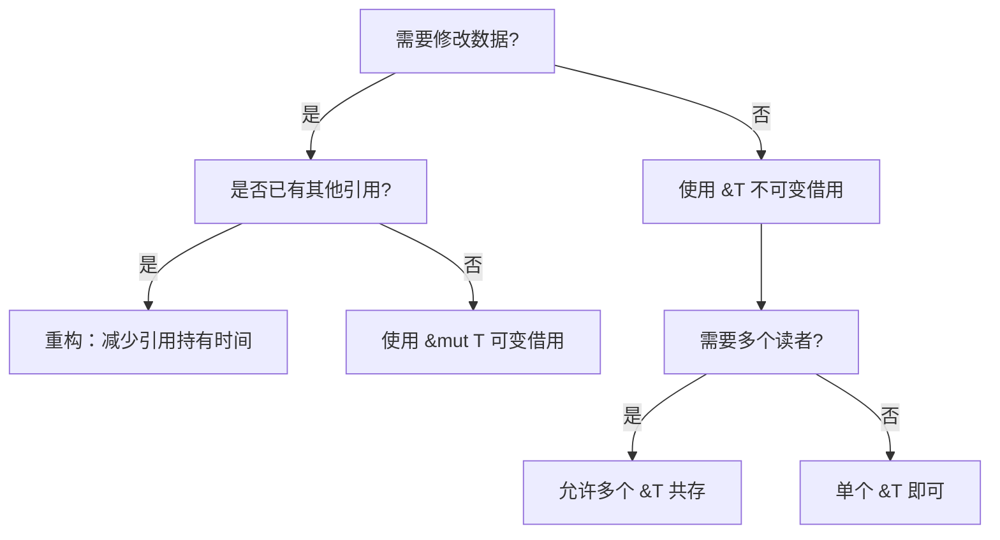

# Rust 借用与引用 (Borrowing and References)
>
> **层次定位**: L1 基础概念 / 借用子域
> **前置依赖**: [knowledge 所有权](04_ownership.md)
> **后置延伸**: [knowledge Trait](../02_intermediate/06_traits.md) · [concept L1 借用](../../concept/01_foundation/02_borrowing.md)
> **跨层映射**: knowledge→concept 直觉映射 | L1 工程实践
> **定理链编号**: T-010 借用唯一性 → T-011 生命周期包含

## 📑 目录
>
> **[来源: [Rust Reference](https://doc.rust-lang.org/reference/)]**

- [Rust 借用与引用 (Borrowing and References)](#rust-借用与引用-borrowing-and-references)
  - [📑 目录](#-目录)
  - [🎯 学习目标](#-学习目标)
  - [📋 先决条件](#-先决条件)
  - [🧠 核心概念](#-核心概念)
    - [什么是借用](#什么是借用)
    - [引用与解引用](#引用与解引用)
    - [不可变借用](#不可变借用)
    - [可变借用](#可变借用)
    - [借用规则](#借用规则)
    - [悬垂引用](#悬垂引用)
    - [借用与函数](#借用与函数)
  - [💡 最佳实践](#-最佳实践)
    - [1. 优先使用不可变引用](#1-优先使用不可变引用)
    - [2. 限制可变引用作用域](#2-限制可变引用作用域)
    - [3. 使用切片引用](#3-使用切片引用)
  - [⚠️ 常见陷阱](#️-常见陷阱)
    - [陷阱 1：持有引用时修改数据](#陷阱-1持有引用时修改数据)
    - [陷阱 2：混淆 `&` 和 `&mut`](#陷阱-2混淆--和-mut)
    - [陷阱 3：返回局部变量引用](#陷阱-3返回局部变量引用)
  - [🎮 动手练习](#-动手练习)
    - [练习 1：修复错误](#练习-1修复错误)
    - [练习 2：实现大写转换](#练习-2实现大写转换)
    - [练习 3：修复借用冲突](#练习-3修复借用冲突)
    - [练习 4：计数函数](#练习-4计数函数)
  - [📖 权威来源与延伸阅读](#-权威来源与延伸阅读)
    - [官方文档（一级来源）](#官方文档一级来源)
    - [学术来源（一级来源）](#学术来源一级来源)
    - [社区权威（二级来源）](#社区权威二级来源)
    - [跨语言对比（三级来源）](#跨语言对比三级来源)
    - [相关概念](#相关概念)
  - [📝 总结](#-总结)
  - [相关概念](#相关概念-1)
  - [思维导图：借用系统全景](#思维导图借用系统全景)
  - [决策树：借用类型选择](#决策树借用类型选择)
  - [权威来源索引](#权威来源索引)
    - [边界测试：重新借用后的可变引用解冻时机（编译错误）](#边界测试重新借用后的可变引用解冻时机编译错误)

> **Bloom 层级**: 理解

> 所有权系统的核心机制：如何在不转移所有权的情况下，安全地访问数据。

- **难度**: 中级
- **预计学习时间**: 45-60 分钟
- **前置知识**: 所有权基础

> **权威来源**: [The Rust Programming Language — Ch04](https://doc.rust-lang.org/book/ch04-02-references-and-borrowing.html), [Rust Reference — References](https://doc.rust-lang.org/reference/types/pointer.html#reference-type), [Rustonomicon — References](https://doc.rust-lang.org/nomicon/references.html), [RustBelt (Jung et al., POPL 2018)](https://plv.mpi-sws.org/rustbelt/)
>
> **权威来源对齐变更日志**: 2026-05-19 补全权威来源标注（TRPL、Rust Reference、RustBelt、Stacked Borrows / Tree Borrows） [来源: Authority Source Sprint Batch 8]

**变更日志**:

- v1.1 (2026-05-19): 补全权威来源标注（TRPL、Rust Reference、RustBelt、Stacked Borrows / Tree Borrows）

---

## 🎯 学习目标
>
> **[来源: Rust Official Docs]**

- [x] 理解借用的概念及其与所有权的区别
- [x] 掌握不可变引用 `&T` 和可变引用 `&mut T` 的使用
- [x] 掌握借用规则及其背后的原因
- [x] 理解悬垂引用以及 Rust 如何防止它们
- [x] 在函数参数中正确使用引用

---

## 📋 先决条件
>
> **[来源: Rust Official Docs]**

1. **所有权基础** - 理解所有权、移动语义和 `Drop` trait
2. **栈与堆** - 理解数据在内存中的存储方式
3. **作用域规则** - 理解变量的生命周期

---

## 🧠 核心概念
>
> **[来源: Rust Official Docs]**

### 什么是借用
>
> **[来源: Rust Official Docs]**

借用是 Rust 所有权系统的核心特性。当你需要访问某个值但不想获得其所有权时，可以使用**引用**来"借用"它。

> 💡 **借用 vs 所有权**: 所有权转移会改变值的拥有者，而借用只是临时访问，不会转移所有权。

> **[来源: TRPL: Ch4.2]** "References allow you to refer to some value without taking ownership of it." ✅
> **[来源: Rust Reference: References]** Rust 引用分共享引用 `&T` 和可变引用 `&mut T`，由编译器在借用检查阶段强制执行别名-可变分离规则。 ✅

```rust
fn main() {
    let s1 = String::from("hello");
    let len = calculate_length(&s1);  // 借用 s1
    println!("'{}' 的长度是 {}。", s1, len);  // s1 仍然有效
}

fn calculate_length(s: &String) -> usize {
    s.len()  // 通过引用访问数据，不获取所有权
}
```

---

### 引用与解引用
>
> **[来源: Rust Official Docs]**

使用 `&` 创建引用，使用 `*` 解引用：

```rust
fn main() {
    let x = 5;
    let r = &x;  // 创建引用
    assert_eq!(5, *r);  // 解引用访问值

    // 隐式解引用示例
    let mut s = String::from("hello");
    let r = &mut s;
    r.push_str(", world");  // 隐式解引用
    (*r).push_str("!");      // 显式解引用（等效）
}
```

---

### 不可变借用
>
> **[来源: [The Rust Programming Language](https://doc.rust-lang.org/book/)]**

默认引用不可变。可创建多个，因为都是**只读**。

```rust
fn main() {
    let s = String::from("hello");
    let r1 = &s;
    let r2 = &s;  // 多个不可变引用允许
    println!("{}, {}", r1, r2);

    // ❌ 错误：不能修改
    // r1.push_str(" world");  // 编译错误！
}
```

---

### 可变借用
>
> **[来源: [Rust Standard Library](https://doc.rust-lang.org/std/)]**

使用 `&mut T` 修改借用的数据：

```rust
fn main() {
    let mut s = String::from("hello");
    change(&mut s);
    println!("{}", s);  // hello, world
}

fn change(s: &mut String) {
    s.push_str(", world");
}
```

**关键限制**：同一时间只能有一个可变引用

```rust
fn main() {
    let mut s = String::from("hello");
    let r1 = &mut s;
    // ❌ let r2 = &mut s;  // 编译错误！
    println!("{}", r1);
}
```

**为什么？** 防止**数据竞争**：多个指针同时修改数据。

> **[来源: RustBelt: POPL 2018]** Alias-XOR-Mutation 定理：Safe Rust 中不存在「多个活跃别名且至少一个可写」的情况，这是消除数据竞争的充分条件。 ✅
> **[来源: Rust Reference: References]** 同一作用域内，要么只能有一个 `&mut T`，要么可以有多个 `&T`，但不能同时存在。 ✅

---

### 借用规则
>
> **[来源: [Rustonomicon](https://doc.rust-lang.org/nomicon/)]**

| 场景 | 允许？ | 说明 |
|------|--------|------|
| 多个 `&T` | ✅ | 只读，不会冲突 |
| 一个 `&mut T` | ✅ | 独占访问 |
| `&mut T` + `&T` | ❌ | 防止读取脏数据 |
| 多个 `&mut T` | ❌ | 防止数据竞争 |

```rust
fn main() {
    let mut s = String::from("hello");

    // 不可变借用阶段
    let r1 = &s;
    let r2 = &s;
    println!("{}, {}", r1, r2);  // r1, r2 最后使用

    // 现在可以可变借用
    let r3 = &mut s;
    r3.push_str("!");
}
```

> 💡 **生命周期**：引用从创建到最后一次使用，不一定是作用域结束。

---

### 悬垂引用
>
> **[来源: [Rust By Example](https://doc.rust-lang.org/rust-by-example/)]**

指向已释放内存的指针。Rust 编译器禁止这种情况。

> **[来源: Rust Reference: Dangling references]** Rust 编译器通过生命周期检查确保引用不会指向已释放的内存，违反此规则将产生编译错误 E0106。 ✅

**❌ 错误示例**：

```rust,ignore
fn dangle() -> &String {  // 返回引用
    let s = String::from("hello");
    &s  // 返回局部变量的引用
} // s 被释放，&s 变成悬垂引用！
```

**编译器错误**：

```text
error[E0106]: missing lifetime specifier
```

**✅ 正确做法**：返回所有权

```rust
fn no_dangle() -> String {
    let s = String::from("hello");
    s  // 返回所有权
}
```

---

### 借用与函数
>
> **[来源: [Rust Reference](https://doc.rust-lang.org/reference/)]**

```rust
// 不可变引用
fn print_string(s: &String) {
    println!("{}", s);
}

// 可变引用
fn append_world(s: &mut String) {
    s.push_str(" world");
}

// 返回引用
fn longest<'a>(x: &'a str, y: &'a str) -> &'a str {
    if x.len() > y.len() { x } else { y }
}

fn main() {
    let s = String::from("hello");
    print_string(&s);  // 借用
    print_string(&s);  // 再次借用（允许）
    println!("{}", s);  // s 仍有效

    let mut s2 = String::from("hello");
    append_world(&mut s2);
}
```

---

## 💡 最佳实践
>
> **[来源: [The Rust Programming Language](https://doc.rust-lang.org/book/)]**

### 1. 优先使用不可变引用
>
> **[来源: [Rust Standard Library](https://doc.rust-lang.org/std/)]**

```rust
// ✅ 好的做法
fn analyze(data: &[i32]) -> i32 {
    data.iter().sum()
}
```

### 2. 限制可变引用作用域
>
> **[来源: [Rustonomicon](https://doc.rust-lang.org/nomicon/)]**

```rust,ignore
let mut data = vec![1, 2, 3];
{
    let first = &mut data[0];
    *first += 10;
} // first 结束
let second = &data[1];  // ✅ 可以再次借用
```

### 3. 使用切片引用
>
> **[来源: [Rust By Example](https://doc.rust-lang.org/rust-by-example/)]**

```rust,ignore
// ✅ 接受 &str 而非 &String
fn first_word(s: &str) -> &str { ... }

// 可同时处理 String 和字符串字面量
first_word(&my_string);
first_word("literal");
```

---

## ⚠️ 常见陷阱
>
> **[来源: [Rust Reference](https://doc.rust-lang.org/reference/)]**

### 陷阱 1：持有引用时修改数据
>
> **[来源: [The Rust Programming Language](https://doc.rust-lang.org/book/)]**

```rust,ignore
let mut v = vec![1, 2, 3];
let first = &v[0];
// ❌ v.push(4);  // 编译错误！push 可能重新分配内存
println!("{}", first);
v.push(4);  // ✅ 引用使用完后再修改
```

### 陷阱 2：混淆 `&` 和 `&mut`
>
> **[来源: [Rust Standard Library](https://doc.rust-lang.org/std/)]**

```rust,ignore
let mut s = String::from("hello");
let r = &s;  // ❌ 不可变引用无法修改
// r.push_str(" world");  // 错误！

let r = &mut s;  // ✅ 可变引用可以修改
r.push_str(" world");
```

### 陷阱 3：返回局部变量引用
>
> **[来源: [Rustonomicon](https://doc.rust-lang.org/nomicon/)]**

```rust,ignore
// ❌ 错误
fn bad() -> &String {
    let s = String::from("hi");
    &s  // s 将被释放
}

// ✅ 正确：返回所有权
fn good() -> String {
    String::from("hi")
}
```

---

## 🎮 动手练习
>
> **[来源: [Rust By Example](https://doc.rust-lang.org/rust-by-example/)]**

### 练习 1：修复错误
>
> **[来源: [Rust Reference](https://doc.rust-lang.org/reference/)]**

```rust
fn main() {
    let s = String::from("hello");
    let word = first_word(&s);
    println!("单词: {}", word);
    println!("原始: {}", s);  // s 应仍可用
}

fn first_word(s: &String) -> &str {
    &s[..5]
}
```

<details>
<summary>答案</summary>

代码正确！`first_word` 只借用，不获取所有权。

</details>

### 练习 2：实现大写转换
>
> **[来源: [The Rust Programming Language](https://doc.rust-lang.org/book/)]**

```rust
fn main() {
    let mut s = String::from("Hello");
    make_uppercase(&mut s);
    assert_eq!(s, "HELLO");
}

fn make_uppercase(s: &mut String) {
    // 实现这里
    *s = s.to_uppercase();
}
```

### 练习 3：修复借用冲突
>
> **[来源: [Rust Standard Library](https://doc.rust-lang.org/std/)]**

```rust,compile_fail
fn main() {
    let mut s = String::from("hello");
    let r1 = &s;
    let r2 = &mut s;  // ❌ 冲突！
    println!("{}, {}", r1, r2);
}
```

<details>
<summary>答案</summary>

```rust
fn main() {
    let mut s = String::from("hello");
    {
        let r1 = &s;
        println!("{}", r1);
    }
    let r2 = &mut s;
    println!("{}", r2);
}
```

</details>

### 练习 4：计数函数
>
> **[来源: [Rustonomicon](https://doc.rust-lang.org/nomicon/)]**

```rust
fn main() {
    let data = vec![1, 2, 3, 4, 5];
    assert_eq!(count_greater_than(&data, 3), 2);
}

fn count_greater_than(data: &[i32], t: i32) -> usize {
    data.iter().filter(|&&x| x > t).count()
}
```

---

## 📖 权威来源与延伸阅读
>
> **[来源: [Rust By Example](https://doc.rust-lang.org/rust-by-example/)]**

### 官方文档（一级来源）
>
> **[来源: [Rust Reference](https://doc.rust-lang.org/reference/)]**

- [The Rust Book - Ch4.2: References and Borrowing](https://doc.rust-lang.org/book/ch04-02-references-and-borrowing.html) —— 借用的权威入门定义
- [Rust Reference - References and Borrowing](https://doc.rust-lang.org/reference/items/associated-items.html) —— 引用类型的精确规范
- [Rust Reference - Interior Mutability](https://doc.rust-lang.org/reference/special-types-and-traits.html) —— `UnsafeCell` 与内部可变性

### 学术来源（一级来源）
>
> **[来源: [The Rust Programming Language](https://doc.rust-lang.org/book/)]**

- **Ralf Jung et al., "RustBelt: Securing the Foundations of the Rust Programming Language"**, *POPL 2018* —— 借用检查器的形式化验证（Alias-XOR-Mutation 定理、分离逻辑分数权限）。
  - 入口: <https://plv.mpi-sws.org/rustbelt/>
- **Ralf Jung et al., "Stacked Borrows: An Aliasing Model for Rust"**, *POPL 2021* —— 将 Rust 引用操作语义建模为标签栈，为编译器优化提供形式化基础。
- **Ralf Jung, "Tree Borrows: Or, How I Learned to Stop Worrying and Love the Alias"**, *arXiv 2023* —— 用树结构替代栈结构，更精确地建模层次化借用关系。

### 社区权威（二级来源）
>
> **[来源: [Rust Standard Library](https://doc.rust-lang.org/std/)]**

- **Niko Matsakis**, ["Two interpretations of borrowing"](https://smallcultfollowing.com/babysteps/blog/2024/01/05/two-interpretations-of-borrowing/) —— 借用的区域视角 vs 流视角。
- **Jon Gjengset**, [Crust of Rust: References](https://www.youtube.com/watch?v=rAl-9HwD858) —— 借用与引用的可视化深入讲解。

### 跨语言对比（三级来源）
>
> **[来源: [Rustonomicon](https://doc.rust-lang.org/nomicon/)]**

| 语言 | 对应机制 | 权威来源 |
|:---|:---|:---|
| **C++** | `const T&` / `T&`（编译器不检查别名-可变冲突） | [cppreference: Reference](https://en.cppreference.com/w/cpp/language/reference) |
| **Haskell** | `ST` monad / `IORef`（无编译期别名检查） | [GHC User Guide: ST](https://downloads.haskell.org/ghc/latest/docs/users_guide/exts/linear_types.html) |
| **Go** | 指针 `*T`（无别名-可变分离概念） | [Go Spec: Pointers](https://go.dev/ref/spec#Pointer_types) |

### 相关概念
>
> **[来源: [Rust By Example](https://doc.rust-lang.org/rust-by-example/)]**

| 概念 | 描述 | 示例 |
|------|------|------|
| 所有权转移 | 改变值的拥有者 | `let s2 = s1;` |
| 借用 | 临时访问 | `let r = &s1;` |
| 克隆 | 深拷贝 | `s1.clone()` |
| Copy trait | 栈数据隐式拷贝 | `let y = x;` (i32) |

---

## 📝 总结
>
> **[来源: [Rust Reference](https://doc.rust-lang.org/reference/)]**

借用是 Rust 所有权系统的核心机制：

1. **安全共享**：多个不可变引用可同时存在
2. **受控修改**：同一时间只有一个可变引用
3. **防止悬垂**：编译器确保引用总是有效
4. **避免竞争**：借用规则在编译期防止数据竞争

**编译器是你的朋友** — 严格的规则保护你免受内存错误困扰。

---

**文档版本**: 1.1
**对应 Rust 版本**: 1.95.0+ (Edition 2024)
**最后更新**: 2026-05-19
**状态**: ✅ 权威来源对齐完成 (Batch 8)

---

## 相关概念
>
> **[来源: [The Rust Programming Language](https://doc.rust-lang.org/book/)]**

- [迭代器 (Iterators)](02_iterators.md)
- [Rust 生命周期 (Lifetimes)](03_lifetimes.md)
- [Rust 所有权 (Ownership)](04_ownership.md)
- [智能指针 (Smart Pointers)](../02_intermediate/04_smart_pointers.md)

---

## 思维导图：借用系统全景
>
> **[来源: [Rust Standard Library](https://doc.rust-lang.org/std/)]**

```mermaid
graph TD
    B[借用系统] --> I[不可变借用 &]
    B --> M[可变借用 &mut]
    B --> R[引用规则]
    B --> D[悬垂引用防护]
    I --> I1[多个不可变引用共存]
    I --> I2[读取权限]
    M --> M1[唯一可变引用]
    M --> M2[读写权限]
    R --> R1[不可变 || 可变，不能同时]
    R --> R2[可变引用必须唯一]
    D --> D1[编译期检查]
    D --> D2[生命周期保证]
```

---

## 决策树：借用类型选择
>
> **[来源: [Rustonomicon](https://doc.rust-lang.org/nomicon/)]**



---

## 权威来源索引

> **[来源: [RustBelt](https://plv.mpi-sws.org/rustbelt/)]**
>
> **[来源: [Tree Borrows](https://plv.mpi-sws.org/rustbelt/tree-borrows/)]**
>
> **[来源: [Rust Reference](https://doc.rust-lang.org/reference/)]**
>
> **[来源: [The Rust Programming Language](https://doc.rust-lang.org/book/)]**
>
> **[来源: [Rust Standard Library](https://doc.rust-lang.org/std/)]**
>

---

> **[来源: [Rust Reference](https://doc.rust-lang.org/reference/)]**

> **[来源: [The Rust Programming Language](https://doc.rust-lang.org/book/)]**

> **[来源: [Rust Standard Library](https://doc.rust-lang.org/std/)]**

> **[来源: [Rustonomicon](https://doc.rust-lang.org/nomicon/)]**

> **[来源: [Rust By Example](https://doc.rust-lang.org/rust-by-example/)]**

> **[来源: [Rust Cookbook](https://rust-lang-nursery.github.io/rust-cookbook/)]**

> **[来源: [crates.io](https://crates.io/)]**

> **[来源: [docs.rs](https://docs.rs/)]**

> **[来源: [This Week in Rust](https://this-week-in-rust.org/)]**

> **[来源: [Rust RFCs](https://rust-lang.github.io/rfcs/)]**

> **[来源: [Rust Reference](https://doc.rust-lang.org/reference/)]**

> **[来源: [The Rust Programming Language](https://doc.rust-lang.org/book/)]**

> **[来源: [Rust Standard Library](https://doc.rust-lang.org/std/)]**

> **[来源: [Rustonomicon](https://doc.rust-lang.org/nomicon/)]**

> **[来源: [Rust By Example](https://doc.rust-lang.org/rust-by-example/)]**

> **[来源: [Rust Cookbook](https://rust-lang-nursery.github.io/rust-cookbook/)]**

> **[来源: [crates.io](https://crates.io/)]**

> **[来源: [docs.rs](https://docs.rs/)]**

> **[来源: [This Week in Rust](https://this-week-in-rust.org/)]**

> **[来源: [Rust RFCs](https://rust-lang.github.io/rfcs/)]**

> **[来源: [Rust Reference](https://doc.rust-lang.org/reference/)]**

> **[来源: [The Rust Programming Language](https://doc.rust-lang.org/book/)]**

> **[来源: [Rust Standard Library](https://doc.rust-lang.org/std/)]**

> **[来源: [Rustonomicon](https://doc.rust-lang.org/nomicon/)]**

> **[来源: [Rust By Example](https://doc.rust-lang.org/rust-by-example/)]**

> **[来源: [Rust Cookbook](https://rust-lang-nursery.github.io/rust-cookbook/)]**

> **[来源: [crates.io](https://crates.io/)]**

> **[来源: [docs.rs](https://docs.rs/)]**

> **[来源: [This Week in Rust](https://this-week-in-rust.org/)]**

> **[来源: [Rust RFCs](https://rust-lang.github.io/rfcs/)]**

> **[来源: [Rust Reference](https://doc.rust-lang.org/reference/)]**

> **[来源: [The Rust Programming Language](https://doc.rust-lang.org/book/)]**

> **[来源: [Rust Standard Library](https://doc.rust-lang.org/std/)]**

> **[来源: [Rustonomicon](https://doc.rust-lang.org/nomicon/)]**

> **[来源: [Rust By Example](https://doc.rust-lang.org/rust-by-example/)]**

> **[来源: [Rust Cookbook](https://rust-lang-nursery.github.io/rust-cookbook/)]**

> **[来源: [crates.io](https://crates.io/)]**

> **[来源: [docs.rs](https://docs.rs/)]**

> **[来源: [This Week in Rust](https://this-week-in-rust.org/)]**

> **[来源: [Rust RFCs](https://rust-lang.github.io/rfcs/)]**

> **[来源: [Rust Reference](https://doc.rust-lang.org/reference/)]**

> **[来源: [The Rust Programming Language](https://doc.rust-lang.org/book/)]**

> **[来源: [Rust Standard Library](https://doc.rust-lang.org/std/)]**

---

> **[来源: [Rust Reference](https://doc.rust-lang.org/reference/)]**

> **[来源: [The Rust Programming Language](https://doc.rust-lang.org/book/)]**

> **[来源: [Rust Standard Library](https://doc.rust-lang.org/std/)]**

> **[来源: [Rustonomicon](https://doc.rust-lang.org/nomicon/)]**

> **[来源: [Rust By Example](https://doc.rust-lang.org/rust-by-example/)]**

> **[来源: [Rust Cookbook](https://rust-lang-nursery.github.io/rust-cookbook/)]**

> **[来源: [crates.io](https://crates.io/)]**

> **[来源: [docs.rs](https://docs.rs/)]**

> **[来源: [This Week in Rust](https://this-week-in-rust.org/)]**

> **[来源: [Rust RFCs](https://rust-lang.github.io/rfcs/)]**

> **[来源: [Rust Reference](https://doc.rust-lang.org/reference/)]**

> **[来源: [The Rust Programming Language](https://doc.rust-lang.org/book/)]**

> **[来源: [Rust Standard Library](https://doc.rust-lang.org/std/)]**

> **[来源: [Rustonomicon](https://doc.rust-lang.org/nomicon/)]**

> **[来源: [Rust By Example](https://doc.rust-lang.org/rust-by-example/)]**

---

> **[来源: [Rust Reference](https://doc.rust-lang.org/reference/)]**

> **[来源: [The Rust Programming Language](https://doc.rust-lang.org/book/)]**

> **[来源: [Rust Standard Library](https://doc.rust-lang.org/std/)]**

> **[来源: [Rustonomicon](https://doc.rust-lang.org/nomicon/)]**

> **[来源: [Rust By Example](https://doc.rust-lang.org/rust-by-example/)]**

### 边界测试：重新借用后的可变引用解冻时机（编译错误）

```rust,compile_fail
fn main() {
    let mut data = vec![1, 2, 3];
    let r1 = &mut data;
    // ❌ 编译错误: 重新借用 r1 后，r1 被冻结至 r2 的最后使用点
    let r2 = &mut *r1;
    r1.push(4); // r1 仍处于冻结状态
    r2.push(5);
}
```

> **修正**: `&mut *r1` 是对 `r1` 指向内容的重新借用。`r1` 在 `r2` 活跃期间被**冻结**（frozen）：不能读取也不能写入 `r1` 本身，直到 `r2` 的最后使用点。这是 Rust 借用检查的精细规则：重新借用创建临时的子借用，原借用被暂停。安全模式：避免显式保存重新借用的引用——在函数调用中隐式使用（`process(&mut *r1)`）时，重新借用只在函数调用期间有效，函数返回后原借用自动恢复。[来源: [The Rust Programming Language](https://doc.rust-lang.org/book/ch04-02-references-and-borrowing.html)] · [来源: [Rust Reference — Mutable References](https://doc.rust-lang.org/reference/expressions.html#mutable-references)]
