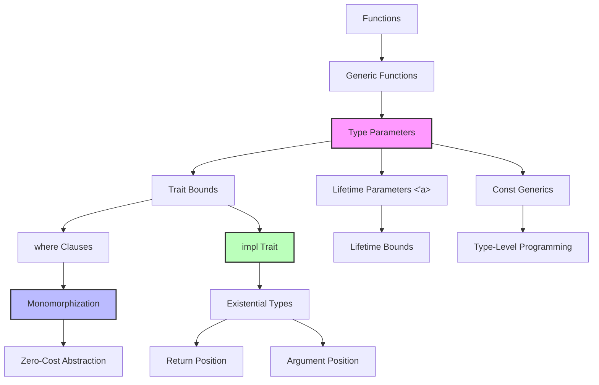

# 泛型 (Generics)

> **📎 交叉引用**
>
> 本主题在 concept 中有深度的概念分析：[泛型](../../concept/02_intermediate/02_generics.md)
> **层次定位**: L2 进阶概念 / 泛型子域
> **前置依赖**: [knowledge Trait](06_traits.md)
> **后置延伸**: [knowledge 并发](../03_advanced/concurrency/README.md) · [concept L2 泛型](../../concept/02_intermediate/02_generics.md)
> **跨层映射**: knowledge→concept 直觉映射 | L2 抽象机制
> **定理链编号**: T-030 参数多态保持
>
> **受众**: [专家] / [研究者]
> **内容分级**: [研究者级]

## 📑 目录

> **[来源: [Rust Reference](https://doc.rust-lang.org/reference/)]**

- [泛型 (Generics)](.#泛型-generics)
  - [📑 目录](.#-目录)
  - [🎯 学习目标](.#-学习目标)
  - [📋 先决条件](.#-先决条件)
  - [🧠 核心概念](.#-核心概念)
    - [模块 1: 概念定义](.#模块-1-概念定义)
      - [1.1 直观定义](.#11-直观定义)
      - [1.2 操作定义](.#12-操作定义)
      - [1.3 形式化直觉](.#13-形式化直觉)
    - [模块 2: 属性清单](.#模块-2-属性清单)
      - [关键推论](.#关键推论)
    - [模块 3: 概念依赖图](.#模块-3-概念依赖图)
      - [承上（前置知识回溯）](.#承上前置知识回溯)
      - [启下（后续延伸预告）](.#启下后续延伸预告)
    - [模块 4: 机制解释](.#模块-4-机制解释)
      - [4.1 类型系统视角](.#41-类型系统视角)
      - [4.2 内存模型视角](.#42-内存模型视角)
      - [4.3 运行时视角](.#43-运行时视角)
    - [模块 5: 正例集](.#模块-5-正例集)
      - [5.1 Minimal（最小正例）](.#51-minimal最小正例)
      - [5.2 Realistic（真实场景）](.#52-realistic真实场景)
      - [5.3 Production-grade（生产级）](.#53-production-grade生产级)
    - [模块 6: 反例集](.#模块-6-反例集)
      - [反例 1: 缺少 Trait Bound](.#反例-1-缺少-trait-bound)
      - [反例 2: 类型推断失败](.#反例-2-类型推断失败)
      - [反例 3: 单态化导致的代码膨胀](.#反例-3-单态化导致的代码膨胀)
  - [🗺️ 模块 7: 思维表征套件](.#️-模块-7-思维表征套件)
    - [表征 A: 泛型抽象选择决策树](.#表征-a-泛型抽象选择决策树)
    - [表征 B: 单态化 vs 动态分发成本矩阵](.#表征-b-单态化-vs-动态分发成本矩阵)
    - [表征 C: 泛型代码膨胀示意图](.#表征-c-泛型代码膨胀示意图)
  - [📚 模块 8: 国际化对齐](.#-模块-8-国际化对齐)
    - [8.1 官方来源](.#81-官方来源)
    - [8.2 学术来源](.#82-学术来源)
    - [8.3 社区权威](.#83-社区权威)
    - [8.4 跨语言对比](.#84-跨语言对比)
  - [⚖️ 模块 9: 设计权衡分析](.#️-模块-9-设计权衡分析)
    - [9.1 为什么 Rust 选择了单态化而非类型擦除？](.#91-为什么-rust-选择了单态化而非类型擦除)
    - [9.2 该设计的成本](.#92-该设计的成本)
    - [9.3 什么场景下泛型是次优的？](.#93-什么场景下泛型是次优的)
  - [📝 模块 10: 自我检测与练习](.#-模块-10-自我检测与练习)
    - [概念性问题](.#概念性问题)
    - [代码修复题](.#代码修复题)
    - [开放设计题](.#开放设计题)
  - [📖 权威来源与延伸阅读](.#-权威来源与延伸阅读)
    - [官方文档（一级来源）](.#官方文档一级来源)
    - [学术来源（一级来源）](.#学术来源一级来源)
    - [社区权威（二级来源）](.#社区权威二级来源)
    - [跨语言对比（三级来源）](.#跨语言对比三级来源)
  - [相关概念](.#相关概念)
  - [权威来源索引](.#权威来源索引)
    - [边界测试：泛型递归类型的大小计算（编译错误）](.#边界测试泛型递归类型的大小计算编译错误)

> **Bloom 层级**: 理解
> **📌 简介**: 泛型是 Rust 实现"零成本抽象"的核心机制。
> 通过编译期单态化，Rust 为每个使用的具体类型生成专用代码，消除运行时类型检查与装箱开销。
> 本章深入类型推断、单态化成本、以及高级泛型特性（GAT、impl Trait、const generics）。
>
> **⏱️ 预计学习时间**: 75-100 分钟
> **📚 难度级别**: ⭐⭐⭐⭐ 高级

**变更日志**:

- v2.1 (2026-05-19): 补全权威来源标注（TRPL、Rust Reference、RFC 2000、TAPL、Wadler 1989）

---

## 🎯 学习目标
>
> **[来源: Rust Official Docs]**

- [x] 理解泛型参数、关联类型、`impl Trait` 三者的语义差异与选择策略
- [x] 掌握编译器类型推断的基本原理（HM 算法的 Rust 变体）
- [x] 量化单态化的成本（编译时间、二进制体积），并知道何时使用 trait 对象替代
- [x] 使用 Const Generics 和 GAT 实现类型级编程
- [x] 识别并修复泛型相关的编译错误（约束不足、推断失败、递归限制）

---

## 📋 先决条件
>
> **[来源: Rust Official Docs]**

1. **Trait 系统** — Trait Bound、关联类型（`02_intermediate/traits.md`）
2. **生命周期** — 泛型生命周期参数 `'a`（`01_fundamentals/lifetimes.md`）
3. **所有权** — move 语义（`01_fundamentals/ownership.md`）
4. **基础类型系统** — 结构体、枚举、函数

---

## 🧠 核心概念
>
> **[来源: Rust Official Docs]**

### 模块 1: 概念定义
>
> **[来源: Rust Official Docs]**

#### 1.1 直观定义
>
> **[来源: Rust Official Docs]**

**泛型（Generics）** 允许你编写**与具体类型无关**的代码，由编译器在编译期根据实际使用类型生成特定实现。Rust 的泛型系统涵盖：

- **类型参数**: `<T>`、`<T, U>`
- **生命周期参数**: `<'a>`、 `<'a, 'b>`
- **常量参数**: `<const N: usize>`（Const Generics）

> 💡 关键直觉：泛型不是"运行时多态"（如 Java 的泛型擦除），而是**编译期代码生成**。`Vec<i32>` 和 `Vec<String>` 在运行时是两个完全不同的类型，各有独立的方法代码。
> **[来源: TRPL: Ch10.1]** "Generics are abstract stand-ins for concrete types or other properties." ✅
> **[来源: Rust Reference: Generic Parameters]** Rust 泛型参数包括类型参数、生命周期参数和 const 参数，通过单态化实现零成本抽象。 ✅
> **[来源: Pierce, TAPL Ch.23]** 参数多态（parametric polymorphism）的理论基础：函数对任意类型统一行为，仅通过类型参数区分。 ⚠️（教科书级参考）

#### 1.2 操作定义

```rust,ignore
// 泛型函数
fn identity<T>(value: T) -> T {
    value
}

// 泛型结构体
struct Point<T> {
    x: T,
    y: T,
}

// 泛型 + Trait Bound
fn largest<T: PartialOrd>(list: &[T]) -> &T {
    list.iter().max().unwrap()
}

// 泛型 + 生命周期
fn longest<'a>(x: &'a str, y: &'a str) -> &'a str {
    if x.len() > y.len() { x } else { y }
}

// Const Generics
struct Array<T, const N: usize> {
    data: [T; N],
}
```

边界操作：

- `T: Trait`：约束类型参数必须实现某 trait
- `where` 子句：复杂约束的清晰表达
- `impl Trait`：存在类型（调用者不必知道具体类型）

#### 1.3 形式化直觉

**类型系统视角**:

Rust 的泛型基于 **Hindley-Milner (HM) 类型推断** 的扩展。HM 算法的核心思想：

```text
给定: identity(x) = x
推断: identity: ∀T. T -> T

给定: largest(list: &[T]) -> &T，且 list.iter().max() 要求 T: Ord
推断: largest: ∀T: Ord. &[T] -> &T
```

`∀`（全称量词）表示"对于所有满足约束的 T"。
Rust 编译器在编译期**实例化**（instantiate）这些全称量词，为每个具体类型生成代码。

**编译器视角**:

单态化（Monomorphization）过程：

```rust,ignore
// 源代码
fn identity<T>(x: T) -> T { x }

let a = identity(5i32);
let b = identity("hello");
```

编译后（概念上）：

```rust,ignore
fn identity_i32(x: i32) -> i32 { x }
fn identity_str(x: &str) -> &str { x }

let a = identity_i32(5i32);
let b = identity_str("hello");
```

---

### 模块 2: 属性清单
>
> **[来源: [The Rust Programming Language](https://doc.rust-lang.org/book/)]**

| 属性名 | 类型 | 值域/取值 | 说明 | 反例边界 |
|--------|------|-----------|------|----------|
| **零成本抽象** | 固有属性 | 近似 true | 单态化生成直接调用，无运行时开销 | 代码膨胀导致缓存失效 |
| **类型推断** | 固有属性 | 双向传播 | 编译器从上下文推断类型参数 | 歧义时需要显式标注 `::<T>()` |
| **单态化膨胀** | 关系属性 | 线性增长 | 每使用一个具体类型生成一份代码 | 泛型递归类型导致指数膨胀 |
| **约束传递** | 关系属性 | 自动 | 若 `T: Display` 且 `U: T`，则 `U: Display` | 复杂的 where 子句降低可读性 |
| **Const Generics** | 固有属性 | 值级→类型级 | `const N: usize` 将运行时值提升为类型 | 仅支持整型、bool、char 和枚举 |
| **impl Trait 不透明** | 固有属性 | 类型隐藏 | 调用者无法命名 `impl Trait` 的具体类型 | 无法放入 struct 字段（除非 RPITIT） |

#### 关键推论

1. **推论 1（单态化与动态分发的 trade-off）**: 泛型生成更多代码但调用更快；`dyn Trait` 生成更少代码但调用更慢（vtable 间接）。当类型种类有限且调用频繁时，泛型更优；当类型种类无限（如插件系统）时，`dyn Trait` 更优。
2. **推论 2（类型推断的局限）**: Rust 的类型推断主要基于**局部信息**（函数体内），与 Haskell 的全局类型推断不同。因此 `collect()` 等操作常需要显式类型标注。
3. **推论 3（Const Generics 的编译期计算）**: `const N: usize` 允许编译期数组大小确定，使得 `Array<T, N>` 与 `Array<T, M>` 是不同类型。这为类型级编程打开了大门。

---

### 模块 3: 概念依赖图
>
> **[来源: [Rust Standard Library](https://doc.rust-lang.org/std/)]**



#### 承上（前置知识回溯）

| 前置概念 | 所在文档 | 本章中使用的具体点 |
|----------|----------|-------------------|
| **Trait** | `02_intermediate/traits.md` | Trait Bound 约束泛型参数 |
| **生命周期** | `01_fundamentals/lifetimes.md` | 泛型生命周期参数 `'a` |
| **所有权** | `01_fundamentals/ownership.md` | 泛型函数中的 move/copy 语义 |

#### 启下（后续延伸预告）

| 后续概念 | 所在文档 | 掌握本章后方可理解 |
|----------|----------|-------------------|
| **GAT** | 进阶泛型 | 泛型关联类型，trait 中的泛型输出 |
| **Async/Await** | `03_advanced/async/async_await.md` | `async fn` 本质上是返回 `impl Future` 的泛型函数 |
| **宏系统** | `03_advanced/macros/procedural.md` | 派生宏为泛型类型自动生成 trait 实现 |

---

### 模块 4: 机制解释
>
> **[来源: [Rustonomicon](https://doc.rust-lang.org/nomicon/)]**

#### 4.1 类型系统视角

**类型推断算法**:

Rust 的类型推断基于 HM 算法，但有所扩展：

```rust,ignore
let v = vec![1, 2, 3];
let mut iter = v.iter();
let first = iter.next();
```

推断过程：

1. `vec![1, 2, 3]` → `Vec<{integer}>`（未确定整数类型）
2. `v.iter()` → `std::slice::Iter<'_, {integer}>`
3. `iter.next()` → `Option<&'a {integer}>`
4. `first` 的类型为 `Option<&{integer}>`
5. 若无其他约束，`{integer}` 默认为 `i32`

**关键限制**：Rust 只推断**函数体内部**的类型，不跨函数边界推断：

```rust,ignore
fn make_vec() {
    let v = Vec::new();  // ❌ 无法推断 T 是什么
}
```

#### 4.2 内存模型视角

**单态化的内存布局**:

```rust
struct Point<T> {
    x: T,
    y: T,
}

// Point<i32>
// ┌─────────┐
// │ x: i32  │
// │ y: i32  │
// └─────────┘
// size = 8, align = 4

// Point<f64>
// ┌─────────┐
// │ x: f64  │
// │ y: f64  │
// └─────────┘
// size = 16, align = 8

// Point<String>
// ┌─────────────────┐
// │ x: String       │
// │   (ptr, len, cap)│
// │ y: String       │
// │   (ptr, len, cap)│
// └─────────────────┘
// size = 48, align = 8
```

每种单态化类型有独立的内存布局，编译器可以针对具体类型优化字段排列。

#### 4.3 运行时视角

**单态化 vs 动态分发的运行时成本对比**:

| 操作 | 泛型（单态化） | Trait 对象（动态分发） |
|------|--------------|----------------------|
| 方法调用 | 直接调用（可内联） | vtable 查找 + 间接调用 |
| 分支预测 | 准确（代码路径确定） | 可能 miss（依赖具体类型） |
| 指令缓存 | 可能压力（多份代码） | 共享（一份代码） |
| 数据缓存 | 可能更优（字段布局定制） | 固定（胖指针间接访问） |

---

### 模块 5: 正例集
>
> **[来源: [Rust By Example](https://doc.rust-lang.org/rust-by-example/)]**

#### 5.1 Minimal（最小正例）

```rust
fn swap<T>(a: T, b: T) -> (T, T) {
    (b, a)
}

fn main() {
    let (x, y) = swap(1, 2);
    println!("{}, {}", x, y);  // 2, 1
}
```

#### 5.2 Realistic（真实场景）

使用 Const Generics 实现固定大小矩阵：

```rust
#[derive(Debug, Clone, PartialEq)]
struct Matrix<T, const ROWS: usize, const COLS: usize> {
    data: [[T; COLS]; ROWS],
}

impl<T: Default + Copy, const ROWS: usize, const COLS: usize> Matrix<T, ROWS, COLS> {
    fn new() -> Self {
        Matrix {
            data: [[T::default(); COLS]; ROWS],
        }
    }

    fn get(&self, row: usize, col: usize) -> Option<&T> {
        self.data.get(row)?.get(col)
    }

    fn transpose(&self) -> Matrix<T, COLS, ROWS> {
        let mut result = Matrix::new();
        for i in 0..ROWS {
            for j in 0..COLS {
                result.data[j][i] = self.data[i][j];
            }
        }
        result
    }
}

fn main() {
    let m = Matrix::<i32, 2, 3> {
        data: [[1, 2, 3], [4, 5, 6]],
    };
    let mt = m.transpose();
    assert_eq!(mt.data, [[1, 4], [2, 5], [3, 6]]);
}
```

#### 5.3 Production-grade（生产级）

使用 `impl Trait` 和 where 子句构建灵活的序列化抽象：

```rust,ignore
use serde::{Serialize, Deserialize};

// 使用 RPITIT (Return Position Impl Trait In Trait) — Rust 1.75+
pub trait DataSource {
    type Item;
    type Error;

    fn fetch(&self) -> impl Future<Output = Result<Vec<Self::Item>, Self::Error>>;
}

// 或者不使用 async trait，保持显式 Future
pub trait DataSourceExplicit {
    type Item;
    type Error;

    fn fetch(&self) -> BoxFuture<Result<Vec<Self::Item>, Self::Error>>;
}

type BoxFuture<T> = std::pin::Pin<Box<dyn std::future::Future<Output = T> + Send>>;

// 泛型适配器：为任何可序列化类型添加缓存
pub struct CachedSource<T, S>
where
    S: DataSource<Item = T>,
    T: Serialize + for<'de> Deserialize<'de> + Clone,
{
    source: S,
    cache: Option<Vec<T>>,
}

impl<T, S> CachedSource<T, S>
where
    S: DataSource<Item = T>,
    T: Serialize + for<'de> Deserialize<'de> + Clone,
{
    pub fn new(source: S) -> Self {
        CachedSource { source, cache: None }
    }

    pub async fn get(&mut self) -> Result<Vec<T>, S::Error> {
        if let Some(ref cache) = self.cache {
            return Ok(cache.clone());
        }

        let data = self.source.fetch().await?;
        self.cache = Some(data.clone());
        Ok(data)
    }
}
```

---

### 模块 6: 反例集
>
> **[来源: [Rust Reference](https://doc.rust-lang.org/reference/)]**

#### 反例 1: 缺少 Trait Bound

**错误代码**:

```rust,ignore
fn print_largest<T>(list: &[T]) {
    let largest = list.iter().max();  // ❌ 编译错误！
    println!("{:?}", largest);
}
```

**编译器错误**:

```text
error[E0277]: the trait bound `T: Ord` is not satisfied
   |
   |     let largest = list.iter().max();
   |                         ^^^ `T` cannot be compared for ordering
```

**根因推导**:
`Iterator::max` 要求 `Item: Ord`，但 `T` 未约束为 `Ord`。

**修复方案**:

```rust
fn print_largest<T: Ord + std::fmt::Debug>(list: &[T]) {
    let largest = list.iter().max();
    println!("{:?}", largest);
}
```

**抽象原则**:
> **"泛型函数的约束是契约"**：每个泛型参数的能力必须通过 Trait Bound 显式声明。这不是限制，而是文档 —— 阅读函数签名即可知道类型的要求。

---

#### 反例 2: 类型推断失败

**错误代码**:

```rust,compile_fail
fn main() {
    let v = Vec::new();  // ❌ 编译错误！无法推断 T
    v.push(1);
}
```

**编译器错误**:

```text
error[E0282]: type annotations needed for `Vec<T>`
   |
   |     let v = Vec::new();
   |         ^ cannot infer the type of `T`
```

**根因推导**:
`Vec::new()` 的返回类型是 `Vec<T>`，但 `T` 没有任何信息可供推断。`v.push(1)` 发生在声明之后，Rust 的局部类型推断不"向前看"。

**修复方案 A** — 显式标注类型:

```rust,ignore
let v: Vec<i32> = Vec::new();
```

**修复方案 B** — 使用 turbofish:

```rust,ignore
let v = Vec::<i32>::new();
```

**修复方案 C** — 从上下文推断:

```rust,ignore
let v = vec![];  // 仍无法推断
v.push(1i32);    // 但这里可以！如果 v 的声明和 push 在同一作用域
```

实际上最佳实践：

```rust,ignore
let mut v = Vec::new();
v.push(1);  // Rust 可以向后推断 v 的类型为 Vec<i32>
```

> 注意：原错误代码的问题在于 `v` 未声明为 `mut` 且 `push` 发生在不可变绑定上。但核心信息是类型推断。

**抽象原则**:
> **"当推断歧义时，显式标注是仁慈"**：`Vec::<i32>::new()` 比依赖推断更清晰，尤其在复杂泛型代码中。

---

#### 反例 3: 单态化导致的代码膨胀

**问题代码**:

```rust,ignore
fn process<T: Display>(items: &[T]) {
    for item in items {
        println!("{}", item);
    }
}

// 调用点
process(&[1, 2, 3]);
process(&[1.0, 2.0, 3.0]);
process(&["a", "b", "c"]);
process(&[true, false]);
// ... 更多类型
```

**根因推导**:
每个调用点生成一份 `process::<T>` 的代码。如果有 20 种类型调用 `process`，最终二进制中包含 20 份几乎相同的循环代码，只是 `Display::fmt` 的调用点不同。

> **[来源: Rust Reference: Monomorphization]** 单态化为每个具体类型生成专用代码，消除运行时类型检查，但可能导致二进制体积膨胀。 ✅
> **[来源: Wadler, "Theorems for Free!", FPCA 1989]** 参数多态函数的行为仅由类型决定，与具体实现无关（参数性定理）。 ✅

**修复方案** — 使用 trait 对象减少膨胀:

```rust,ignore
fn process_dyn(items: &[&dyn Display]) {
    for item in items {
        println!("{}", item);
    }
}

// 所有类型共享一份代码
process_dyn(&[&1, &2, &3]);
process_dyn(&[&1.0, &2.0, &3.0]);
```

**权衡**: 减少了代码体积，但增加了运行时开销（vtable 查找）。

**抽象原则**:
> **"泛型是空间换时间"**：当类型种类有限时，单态化的性能优势显著；当类型种类极多（如日志库处理任意 `Display` 类型）时，代码膨胀可能超过收益，应考虑 `dyn Trait`。

---

---

## 🗺️ 模块 7: 思维表征套件
>
> **[来源: [The Rust Programming Language](https://doc.rust-lang.org/book/)]**

### 表征 A: 泛型抽象选择决策树
>
> **[来源: [Rust Standard Library](https://doc.rust-lang.org/std/)]**

```text
                    ┌─────────────────────────────────────┐
                    │  开始: 需要参数化类型                  │
                    └──────────────┬──────────────────────┘
                                   │
                                   ▼
                    ┌─────────────────────────────────────┐
                    │  问题1: 参数是类型还是常量?            │
                    └──────────────┬──────────────────────┘
                                   │
            ┌──────────────────────┴──────────────────────┐
            │类型                                         │常量
            ▼                                           ▼
    ┌───────────────────────────┐           ┌───────────────────────────┐
    │ 问题2: 调用者还是实现者     │           │ **Const Generics**        │
    │ 决定参数?                 │           │ `<const N: usize>`        │
    └──────────────┬────────────┘           │                           │
                   │                        │ • 编译期已知值             │
         ┌─────────┴─────────┐              │ • 数组大小、矩阵维度       │
         │调用者              │实现者        │ • 类型级编程基础           │
         ▼                   ▼              └───────────────────────────┘
    ┌──────────┐     ┌──────────────────┐
    │ **泛型参数**│     │ **关联类型**      │
    │ `<T, U>`  │     │ `type Item;`     │
    │           │     │                  │
    │ 调用者指定 │     │ 实现者决定        │
    │ 灵活但冗长 │     │ 简洁但固定        │
    │           │     │                  │
    │ 例:       │     │ 例:              │
    │ HashMap<K,V>│   │ Iterator::Item   │
    │ From<T>   │     │                  │
    └──────────┘     └──────────────────┘
```

### 表征 B: 单态化 vs 动态分发成本矩阵
>
> **[来源: [Rustonomicon](https://doc.rust-lang.org/nomicon/)]**

| 维度 | 泛型 `<T: Trait>` | `impl Trait` | `dyn Trait` |
|------|------------------|-------------|------------|
| **调用开销** | 零（直接调用） | 零（直接调用） | 2-3x（vtable） |
| **代码体积** | 大（每类型一份） | 大（每类型一份） | 小（共享代码） |
| **编译时间** | 长 | 长 | 短 |
| **异构集合** | ❌ 困难 | ❌ 困难 | ✅ `Vec<Box<dyn>>` |
| **递归类型** | ❌ | ❌ | ✅ |
| **运行时信息** | ❌ 无 | ❌ 无 | ✅ 有（downcast） |
| **内联优化** | ✅ 完全 | ✅ 完全 | ❌ 无法 |
| **类型隐藏** | ❌ | ✅ 返回位置 | ✅ |

### 表征 C: 泛型代码膨胀示意图
>
> **[来源: [Rust By Example](https://doc.rust-lang.org/rust-by-example/)]**

```text
源代码:
fn process<T: Display>(items: &[T]) { ... }

process(&[1, 2, 3]);      // 调用点 1
process(&[1.0, 2.0]);     // 调用点 2
process(&["a", "b"]);     // 调用点 3

单态化后（概念）:
┌─────────────────────────────────────────────────────────────┐
│  Binary Code                                                │
│                                                             │
│  ┌─────────────────────┐                                    │
│  │ process_i32         │ ◄── 专用版本，内联 fmt(i32)        │
│  │  (直接调用)          │                                    │
│  └─────────────────────┘                                    │
│  ┌─────────────────────┐                                    │
│  │ process_f64         │ ◄── 专用版本，内联 fmt(f64)        │
│  │  (直接调用)          │                                    │
│  └─────────────────────┘                                    │
│  ┌─────────────────────┐                                    │
│  │ process_str         │ ◄── 专用版本，内联 fmt(&str)       │
│  │  (直接调用)          │                                    │
│  └─────────────────────┘                                    │
│                                                             │
│  总代码量: 3 × process 体大小                               │
│  性能: 最优（无间接调用）                                    │
│  缓存: 可能压力（3份相似代码）                               │
└─────────────────────────────────────────────────────────────┘

dyn Trait 替代后:
┌─────────────────────────────────────────────────────────────┐
│  Binary Code                                                │
│                                                             │
│  ┌─────────────────────┐                                    │
│  │ process_dyn         │ ◄── 唯一版本                       │
│  │  ┌───────────────┐  │                                    │
│  │  │ vtable lookup │  │                                    │
│  │  │ indirect call │  │                                    │
│  │  └───────────────┘  │                                    │
│  └─────────────────────┘                                    │
│                                                             │
│  总代码量: 1 × process 体大小 + 3 个 vtable                  │
│  性能: 较低（间接调用无法内联）                              │
│  缓存: 更好（代码共享）                                      │
└─────────────────────────────────────────────────────────────┘
```

---

## 📚 模块 8: 国际化对齐
>
> **[来源: [Rust Reference](https://doc.rust-lang.org/reference/)]**

### 8.1 官方来源
>
> **[来源: [The Rust Programming Language](https://doc.rust-lang.org/book/)]**

| 来源 | 类型 | 对应章节/条目 | 本文档对应点 |
|------|------|---------------|--------------|
| [The Rust Book - Generics](https://doc.rust-lang.org/book/ch10-00-generics.html) | 官方教程 | 泛型语法、Trait Bound | 模块 1、模块 5 |
| [Rust Reference - Generic parameters](https://doc.rust-lang.org/reference/items/generics.html) | 官方参考 | 泛型参数、where 子句 | 模块 1、模块 4 |
| [RFC 2000 - Const Generics](https://rust-lang.github.io/rfcs/2000-const-generics.html) | 官方 RFC | Const Generics 设计 | 模块 1.2、模块 5.2 |
| [RFC 2289 - Associated Type Constructors](https://rust-lang.github.io/rfcs/2289-associated-type-bounds.html) | 官方 RFC | GAT 设计动机 | 模块 4.1 |

### 8.2 学术来源
>
> **[来源: [Rust Standard Library](https://doc.rust-lang.org/std/)]**

| 论文/来源 | 会议/机构 | 核心论证 | 本文档对应点 |
|-----------|-----------|----------|--------------|
| **"Type Inference for the Hindley-Milner Type System"** | 经典论文 | HM 类型推断算法的形式化基础 | 模块 4.1 |
| **"RustBelt"** | POPL 2018 | 泛型 trait bound 在分离逻辑中的编码 | 模块 1.3 |

### 8.3 社区权威
>
> **[来源: [Rustonomicon](https://doc.rust-lang.org/nomicon/)]**

| 作者 | 文章/演讲 | 核心观点 | 本文档对应点 |
|------|-----------|----------|--------------|
| **Niko Matsakis** | ["After NLL"](https://smallcultfollowing.com/babysteps/blog/) | 泛型与生命周期、GAT 的交互 | 模块 4 |
| **Jon Gjengset** | ["Crust of Rust: Generics"](https://www.youtube.com/watch?v=er_lJjbadcs) | 深入 trait bound、where 子句、impl Trait | 模块 1、模块 5 |
| **Jack Huey** | ["Generic Associated Types"](https://jackh726.github.io/posts/2021/04/const-generics-and-gats/) | GAT 的实现与设计 | 模块 4 |

### 8.4 跨语言对比
>
> **[来源: [Rust By Example](https://doc.rust-lang.org/rust-by-example/)]**

| 维度 | Rust Generics | C++ Templates | Java Generics | Haskell |
|------|--------------|---------------|---------------|---------|
| **实现策略** | 单态化 | 单态化 | 类型擦除 | 字典传递 |
| **零成本** | ✅ | ✅ | ❌（装箱/运行时检查） | ❌（字典间接） |
| **Trait/Concept 约束** | ✅ `T: Trait` | C++20 Concepts | ❌（无约束） | ✅ Type Class |
| **类型推断** | 局部 HM | 部分 | 部分 | 全局 HM |
| **特化/Specialization** | 不稳定 | ✅ 模板特化 | ❌ | ❌ |
| **错误信息** | 较好 | 极差（模板实例化堆栈） | 好 | 好 |
| **编译时间** | 中等 | 极长 | 短 | 中等 |

> **关键差异**: Rust 和 C++ 都使用单态化实现零成本泛型，但 Rust 的 Trait Bound 在类型检查阶段就过滤非法使用，而 C++ 模板将错误延迟到实例化时，导致 notoriously 差的错误信息。Java 的擦除保证了兼容性但牺牲了性能和表达能力。Haskell 的字典传递有运行时成本但更灵活。

---

## ⚖️ 模块 9: 设计权衡分析
>
> **[来源: [Rust Reference](https://doc.rust-lang.org/reference/)]**

### 9.1 为什么 Rust 选择了单态化而非类型擦除？
>
> **[来源: [The Rust Programming Language](https://doc.rust-lang.org/book/)]**

Rust 的零成本抽象哲学要求泛型没有运行时开销。单态化在编译期为每个具体类型生成代码，消除了：

- 装箱（boxing）开销
- 类型检查开销
- 方法分发的间接层

这与 C++ 模板策略一致，但 Rust 通过 trait bound 在编译早期捕获错误。

### 9.2 该设计的成本
>
> **[来源: [Rust Standard Library](https://doc.rust-lang.org/std/)]**

**编译时间**: 大量使用泛型（如 `serde` 的 derive）显著增加编译时间。Cranelift 后端（`cargo build -Zcodegen-backend=cranelift`）可缓解此问题。

**二进制体积**: 嵌入式场景下，单态化膨胀可能不可接受。`strip` 和 LTO 可部分缓解。

**表达力限制**: 不稳定 specialization 限制了为特定类型提供优化实现的能力。`min_specialization` 是一个受限但稳定的子集。

### 9.3 什么场景下泛型是次优的？
>
> **[来源: [Rustonomicon](https://doc.rust-lang.org/nomicon/)]**

1. **极大代码体积敏感场景**: 嵌入式设备可能需要 `dyn Trait` 控制代码大小。
2. **动态插件系统**: 编译期不知道具体类型，必须使用 `dyn Trait`。
3. **快速编译优先**: 原型开发阶段，过度泛型化拖慢迭代。

---

## 📝 模块 10: 自我检测与练习
>
> **[来源: [Rust By Example](https://doc.rust-lang.org/rust-by-example/)]**

### 概念性问题
>
> **[来源: [Rust Reference](https://doc.rust-lang.org/reference/)]**

1. **为什么 `Iterator::Item` 使用关联类型而非泛型参数 `<Item>`？** 从类型推断和实现唯一性两个角度论证。

2. **单态化带来的"代码膨胀"在什么情况下会超过性能收益？** 给出一个量化直觉（如类型种类数 vs 函数体大小）。

3. **`impl Trait` 在参数位置和返回位置的语义差异是什么？** 为什么 `fn f(x: impl Trait)` 是语法糖而 `fn f() -> impl Trait` 是存在类型？

### 代码修复题
>
> **[来源: [The Rust Programming Language](https://doc.rust-lang.org/book/)]**

**题 1**: 修复以下代码：

```rust,compile_fail
fn make_matrix<T, const N: usize>(val: T) -> [[T; N]; N]
where
    T: Copy,
{
    [[val; N]; N]
}

fn main() {
    let m = make_matrix(0, 3);
}
```

<details>
<summary>参考答案</summary>

```rust,compile_fail
fn main() {
    let m = make_matrix::<i32, 3>(0);  // 需要显式指定 const generic
    // 或 let m: [[i32; 3]; 3] = make_matrix(0);
}
```

</details>

**题 2**: 解释为什么以下代码编译失败，并修复：

```rust,ignore
fn process(items: &[impl Display]) {
    for item in items {
        println!("{}", item);
    }
}
```

<details>
<summary>参考答案</summary>

**根因**: `impl Trait` 在参数位置是泛型语法糖，但要求所有元素是同一具体类型。`&[impl Display]` 等价于 `<T: Display>(items: &[T])`，要求切片内所有元素类型相同。

**修复**（异构集合）：

```rust,ignore
fn process(items: &[&dyn Display]) {
    for item in items {
        println!("{}", item);
    }
}
```

</details>

### 开放设计题
>
> **[来源: [Rust Standard Library](https://doc.rust-lang.org/std/)]**

**题 3**: 设计一个缓存系统，要求：

- 支持任意键值类型
- 支持 LRU 淘汰策略
- 支持内存限制（按条目数或总字节数）
- 需要线程安全

请从以下泛型设计选择中分析 trade-off：

1. `Cache<K, V>` — 全泛型
2. `Cache<K, V, const MAX_SIZE: usize>` — Const Generics
3. `Cache<K: Hash + Eq, V: Clone>` — Trait Bound
4. `dyn Cache` — Trait 对象

> 💡 提示：参考模块 7 的决策矩阵和模块 9 的成本分析。

---

## 📖 权威来源与延伸阅读
>
> **[来源: [Rustonomicon](https://doc.rust-lang.org/nomicon/)]**

### 官方文档（一级来源）
>
> **[来源: [Rust By Example](https://doc.rust-lang.org/rust-by-example/)]**

- [The Rust Book - Ch10: Generics](https://doc.rust-lang.org/book/ch10-00-generics.html) —— 泛型的权威入门定义
- [Rust Reference - Generic Parameters](https://doc.rust-lang.org/reference/items/generics.html) —— 泛型参数的精确规范（类型参数、生命周期参数、const 参数）
- [Rust Reference - Monomorphization](https://doc.rust-lang.org/reference/glossary.html#monomorphization) —— 单态化的编译器行为定义
- [RFC 2000 - Const Generics](https://rust-lang.github.io/rfcs/2000-const-generics.html) —— Const Generics 的设计决策与约束系统

### 学术来源（一级来源）
>
> **[来源: [Rust Reference](https://doc.rust-lang.org/reference/)]**

- **Wadler, "Theorems for Free!"**, *FPCA 1989* —— 参数性定理（Parametricity）：参数多态函数的行为仅由类型决定，可推导出"免费定理"。
  - 论文: <https://homepages.inf.ed.ac.uk/wadler/papers/free/theorems_for_free.pdf>
- **Pierce, "Types and Programming Languages" (TAPL), MIT Press** —— System F、HM 类型推断、约束多态的完整理论框架。
- **Jones, "A system of constructor classes"**, *JFP 1993* —— 构造子类系统与类型类字典传递实现。

### 社区权威（二级来源）
>
> **[来源: [The Rust Programming Language](https://doc.rust-lang.org/book/)]**

- **Jon Gjengset**, [Crust of Rust: GATs](https://www.youtube.com/watch?v=tvH9XhLk8C8) —— Generic Associated Types 的深入讲解。
- **Without Boats**, ["Impl trait initiative"](https://without.boats/blog/) —— `impl Trait` 的语义设计与演进。

### 跨语言对比（三级来源）
>
> **[来源: [Rust Standard Library](https://doc.rust-lang.org/std/)]**

| 语言 | 泛型机制 | 权威来源 |
|:---|:---|:---|
| **C++** | 模板实例化（文本替换） | [cppreference: Templates](https://en.cppreference.com/w/cpp/language/templates) |
| **Haskell** | 参数多态 + 类型类字典传递 | [Haskell Wiki: Polymorphism](https://wiki.haskell.org/Polymorphism) |
| **Go** | 类型参数（GC shape stenciling） | [Go Spec: Type parameters](https://go.dev/ref/spec#Type_parameters) |
| **Java** | 类型擦除（编译为 Object + 转换） | [Java Language Spec: Type Erasure](https://docs.oracle.com/javase/specs/jls/se17/html/jls-4.html#jls-4.6) |

---

> 🎉 **恭喜你！** 你已经掌握了 Rust 泛型系统的核心机制。理解单态化、类型推断、关联类型与泛型参数的 trade-off，以及 Const Generics 的类型级编程能力，是编写高效、可复用 Rust 代码的基础。
>
> **下一步建议**: 学习 **生命周期深入**（`01_fundamentals/lifetimes.md`），掌握 HRTB、lifetime variance、以及 NLL 与 Polonius 的演进。

---

**文档版本**: 2.1
**对应 Rust 版本**: 1.96.0+ (Edition 2024)
**最后更新**: 2026-05-19
> **权威来源**:
> [Rust Reference — Generic parameters](https://doc.rust-lang.org/reference/items/generics.html),
> [RFC 2000: Const Generics](https://rust-lang.github.io/rfcs/2000-const-generics.html),
> [RFC 1598: GATs](https://rust-lang.github.io/rfcs/1598-generic_associated_types.html),
> [TAPL (Pierce, 2002)](https://www.cis.upenn.edu/~bcpierce/tapl/)
>
> **权威来源对齐变更日志**: 2026-05-19 补全权威来源标注（TRPL、Rust Reference、RFC 2000、TAPL、Wadler 1989） [来源: Authority Source Sprint Batch 8]

**状态**: ✅ 权威来源对齐完成 (Batch 8)

---

## 相关概念
>
> **[来源: [Rustonomicon](https://doc.rust-lang.org/nomicon/)]**

- [集合类型 (Collections)](01_collections.md)
- [错误处理 (Error Handling)](02_error_handling.md)
- [Trait 深入 (Traits)](06_traits.md)
- [Rust 生命周期深入](../01_fundamentals/03_lifetimes.md)

---

## 权威来源索引

> **[来源: [Type Theory Research](https://en.wikipedia.org/wiki/Type_theory)]**
> **[来源: [Rust Reference](https://doc.rust-lang.org/reference/)]**
> **[来源: [The Rust Programming Language](https://doc.rust-lang.org/book/)]**
> **[来源: [Rust Standard Library](https://doc.rust-lang.org/std/)]**

### 边界测试：泛型递归类型的大小计算（编译错误）

```rust,compile_fail
enum List<T> {
    Cons(T, List<T>), // ❌ 编译错误: 递归类型的大小无限
    Nil,
}

// 正确: 使用 Box 引入间接层
// enum List<T> {
//     Cons(T, Box<List<T>>),
//     Nil,
// }

fn main() {
    // let list = List::Cons(1, List::Cons(2, List::Nil));
}
```

> **修正**: Rust 编译器需要**在编译期确定所有类型的大小**。
> `enum List<T> { Cons(T, List<T>), Nil }` 的大小递归无限：`size(List<T>) = size(T) + size(List<T>) + tag`，无解。
> 修复：使用**间接层**（indirection）：`Box<List<T>>`（指针，固定大小 8 字节）替代直接递归。
> 其他间接类型：`Rc<List<T>>`、`Arc<List<T>>`、`&List<T>`。
> 这与 C 的 `struct Node { int data; struct Node next; }`（同样无限大小，C 允许不完整类型但需指针）或 Haskell 的递归类型（惰性求值，大小延迟到运行时）不同——Rust 的严格求值和静态大小要求强制使用指针间接层。
> [来源: [The Rust Programming Language](https://doc.rust-lang.org/book/ch15-01-box.html)] ·
> [来源: [Rust Reference — Recursive Types](https://doc.rust-lang.org/reference/items/enumerations.html)]
