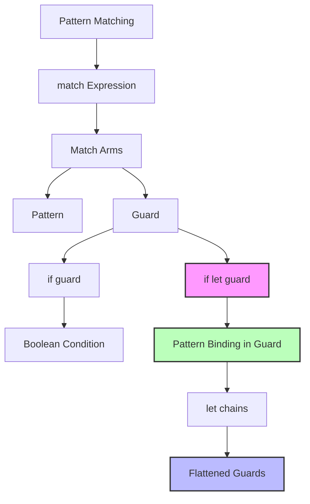

# `if let` Guards on Match Arms（Rust 1.95.0）

> **EN**: if let Guards on Match Arms Rust 1.95.0
> **Summary**: if let Guards on Match Arms（Rust 1.95.0） if let Guards on Match Arms Rust 1.95.0.
> **相关概念**: [变量绑定](../../../concept/01_foundation/07_control_flow.md)
> **Bloom 层级**: 理解
> **稳定版本**: Rust 1.95.0 (2026-04-16)
> **关联特性**: `let chains`（Rust 1.88.0, Edition 2024）
> **前置知识**: 模式匹配（match）、if let、match guards
> **权威来源**: [Rust Reference: Match Guards](https://doc.rust-lang.org/reference/expressions/match-expr.html), [Rust 1.95 Release Notes](https://releases.rs/docs/1.95.0/), [RFC 2294: if-let-guard](https://rust-lang.github.io/rfcs/2294-if-let-guard.html)
> **权威来源对齐变更日志**: 2026-05-19 新增 if-let-guard RFC 设计决策来源标注、match 守卫形式化语义引用 [来源: Authority Source Sprint Batch 8]
>
> **受众**: [专家] / [研究者]
> **内容分级**: [实验级]

---

## 目录

> **[来源: Rust Official Docs]**

- [`if let` Guards on Match Arms（Rust 1.95.0）](#if-let-guards-on-match-armsrust-1950)
  - [目录](#目录)
  - [一、什么是 `if let` guards](#一什么是-if-let-guards)
  - [二、语法与基本用法](#二语法与基本用法)
    - [2.1 基础语法](#21-基础语法)
    - [2.2 与 `let chains` 的对比](#22-与-let-chains-的对比)
  - [三、实际应用场景](#三实际应用场景)
    - [3.1 配置解析器](#31-配置解析器)
    - [3.2 AST 遍历与常量折叠](#32-ast-遍历与常量折叠)
    - [3.3 网络协议解析](#33-网络协议解析)
  - [四、重要限制：穷尽性检查](#四重要限制穷尽性检查)
  - [五、与 `if` guards 的行为一致性](#五与-if-guards-的行为一致性)
  - [六、兼容性说明](#六兼容性说明)
  - [七、练习](#七练习)
    - [模块 3: 概念依赖图](#模块-3-概念依赖图)
      - [承上（前置知识回溯）](#承上前置知识回溯)
    - [模块 7: 思维表征](#模块-7-思维表征)
    - [表征: if let guard 在 match 中的位置](#表征-if-let-guard-在-match-中的位置)
  - [📚 模块 8: 国际化对齐](#-模块-8-国际化对齐)
  - [⚖️ 模块 9: 设计权衡](#️-模块-9-设计权衡)
    - [为什么 if let guards 不参与穷尽性检查？](#为什么-if-let-guards-不参与穷尽性检查)
  - [📝 模块 10: 自我检测](#-模块-10-自我检测)
  - [📚 权威来源索引](#-权威来源索引)
  - [八、参考链接](#八参考链接)
  - [相关概念](#相关概念)

---

## 一、什么是 `if let` guards

> **[来源: Rust Official Docs]**

`if let` guards 允许在 `match` 表达式的 arm guard（守卫）中使用 `if let` 进行模式匹配。

这是 `let chains`（Rust 1.88.0 在 Edition 2024 中稳定）的自然延伸：

| 特性 | 稳定版本 | 适用位置 |
|------|----------|----------|
| `let chains` | 1.88.0 | `if` / `while` 条件 |
| `if let` guards | **1.95.0** | `match` arm guards |

---

## 二、语法与基本用法
>
> **[来源: Rust Official Docs]**

### 2.1 基础语法
>
> **[来源: Rust Official Docs]**

```rust,ignore
match value {
    Some(x) if let Ok(y) = compute(x) => {
        // x 和 y 都可用
        println!("x = {}, y = {}", x, y);
    }
    _ => {}
}
```

**关键点**：

- `if let Ok(y) = compute(x)` 出现在 `=>` 之前
- `x`（来自模式匹配）和 `y`（来自 guard 中的 let 绑定）在 arm 体内部都可用
- 可以链式组合：`if let Some(y) = opt && y > 0 && let Ok(z) = parse(y)`

### 2.2 与 `let chains` 的对比
>
> **[来源: Rust Official Docs]**

```rust,ignore
// let chains (1.88.0): 用于 if / while
if let Some(x) = opt && let Ok(y) = parse(x) && y > 0 {
    // ...
}

// if let guards (1.95.0): 用于 match arms
match opt {
    Some(x) if let Ok(y) = parse(x) && y > 0 => {
        // ...
    }
    _ => {}
}
```

两者语法几乎相同，只是出现的位置不同。

---

## 三、实际应用场景
>
> **[来源: [Rust Reference](https://doc.rust-lang.org/reference/)]**

### 3.1 配置解析器
>
> **[来源: [The Rust Programming Language](https://doc.rust-lang.org/book/)]**

**旧写法**（嵌套 match，层级深）：

```rust,ignore
match config.get("timeout") {
    Some(raw) => match raw.parse::<u64>() {
        Ok(secs) if secs > 0 && secs <= 3600 => setup_timeout(secs),
        _ => use_default_timeout(),
    },
    None => use_default_timeout(),
}
```

**新写法**（扁平化，逻辑清晰）：

```rust,ignore
match config.get("timeout") {
    Some(raw) if let Ok(secs) = raw.parse::<u64>() && secs > 0 && secs <= 3600 => {
        setup_timeout(secs)
    }
    _ => use_default_timeout(),
}
```

### 3.2 AST 遍历与常量折叠
>
> **[来源: [Rust Standard Library](https://doc.rust-lang.org/std/)]**

```rust,ignore
enum Expr {
    Binary { op: BinOp, left: Box<Expr>, right: Box<Expr> },
    Literal(i32),
}

fn fold_constants(expr: Expr) -> Expr {
    match expr {
        // 0 * x = 0
        Expr::Binary { op: BinOp::Mul, right, .. }
            if let Expr::Literal(0) = **right => Expr::Literal(0),

        // x * 0 = 0
        Expr::Binary { op: BinOp::Mul, left, .. }
            if let Expr::Literal(0) = **left => Expr::Literal(0),

        // 1 * x = x
        Expr::Binary { op: BinOp::Mul, right, .. }
            if let Expr::Literal(1) = **right => *right,

        other => other,
    }
}
```

### 3.3 网络协议解析
>
> **[来源: [Rustonomicon](https://doc.rust-lang.org/nomicon/)]**

```rust,ignore
enum Packet {
    Data { payload: Vec<u8> },
    Control { cmd: u8 },
}

fn handle_packet(pkt: Packet) {
    match pkt {
        Packet::Data { payload } if let Some(first) = payload.first() && *first == 0xFF => {
            println!("特殊数据包，首字节 = 0x{:02X}", first);
        }
        Packet::Data { payload } => {
            println!("普通数据包，长度 = {}", payload.len());
        }
        Packet::Control { cmd } => {
            println!("控制包，命令 = {}", cmd);
        }
    }
}
```

---

## 四、重要限制：穷尽性检查
>
> **[来源: [Rust By Example](https://doc.rust-lang.org/rust-by-example/)]**

**`if let` guards 中的模式不参与穷尽性检查（exhaustiveness checking）。**

```rust,ignore
match opt {
    Some(x) if let Ok(y) = x.parse::<i32>() => { /* ... */ }
    // ⚠️ 编译器不会提醒你：Some(Err(...)) 的情况需要处理
    _ => {} // 必须自己确保 _ 分支兜底
}
```

**原因**：guard 条件是运行时求值的，编译器无法在编译期确定哪些值会匹配。

这与普通 `if` guards 的行为完全一致：

```rust,ignore
match opt {
    Some(x) if x > 0 => { /* ... */ }
    // 同样不会检查 x <= 0 的 Some(x) 情况
    _ => {}
}
```

---

## 五、与 `if` guards 的行为一致性
>
> **[来源: [Rust Reference](https://doc.rust-lang.org/reference/)]**

| 行为 | `if` guard | `if let` guard |
|------|------------|----------------|
| 参与穷尽性检查 | ❌ 否 | ❌ 否 |
| 运行时求值 | ✅ 是 | ✅ 是 |
| 绑定新变量到 arm 体 | ❌ 否 | ✅ 是 |
| 可链式组合（`&&`） | ✅ 是 | ✅ 是 |
| 需要 `_ =>` 兜底 | ✅ 是 | ✅ 是 |

---

## 六、兼容性说明
>
> **[来源: [The Rust Programming Language](https://doc.rust-lang.org/book/)]**

- **Rust 1.95.0+**: `if let` guards 在 **所有 Edition** 中可用
- **不需要** `#![feature(...)]` 或 Edition 2024
- 与 `let chains`（需要 Edition 2024）是独立稳定的特性

---

## 七、练习
>
> **[来源: [Rust Standard Library](https://doc.rust-lang.org/std/)]**

1. **配置解析**：将以下嵌套 match 改写为使用 `if let` guards：

   ```rust,ignore
   match headers.get("Content-Length") {
       Some(v) => match v.parse::<usize>() {
           Ok(n) if n > 0 => Some(n),
           _ => None,
       },
       None => None,
   }
   ```

2. **穷尽性思考**：以下代码是否安全？为什么？

   ```rust,ignore
   enum Status { Active(i32), Inactive }
   match status {
       Active(n) if let Some(x) = extra_info(n) => println!("{}", x),
       Inactive => println!("inactive"),
   }
   ```

---

---

### 模块 3: 概念依赖图
>
> **[来源: [Rustonomicon](https://doc.rust-lang.org/nomicon/)]**



#### 承上（前置知识回溯）

| 前置概念 | 所在文档 | 本章中使用的具体点 |
|----------|----------|-------------------|
| **match 表达式** | `01_fundamentals/pattern_matching.md` | `if let` guards 是 match arm guards 的扩展 |
| **let chains** | `02_intermediate/control_flow/let_chains.md` | `if let` guards 共享 let chains 的语法和语义 |
| **穷尽性检查** | `01_fundamentals/pattern_matching.md` | guards 不参与 exhaustiveness checking |

---

### 模块 7: 思维表征
>
> **[来源: [Rust By Example](https://doc.rust-lang.org/rust-by-example/)]**

### 表征: if let guard 在 match 中的位置
>
> **[来源: [Rust Reference](https://doc.rust-lang.org/reference/)]**

```text
match value {
    ┌─────────────────────────────────────────────────────────────┐
    │ Pattern              Guard                    Body          │
    │ ─────────────────────────────────────────────────────────── │
    │ Some(x)     if let Ok(y) = f(x) && y > 0  => { ... }      │
    │ ────────    ────────────────────────────      ─────       │
    │   │                      │                      │         │
    │   │                      │                      │         │
    │ 模式匹配            if let guard              arm 体      │
    │ (编译期)            (运行时)                  (运行时)    │
    │                                                     │     │
    │ 变量可用性: x ──────────────────────────────────────┘     │
    │             y ────────────────────────────► 仅在 guard 和 body 中可用 │
    └─────────────────────────────────────────────────────────────┘

关键规则:
• 模式变量 (x) → guard 和 body 都可用
• guard 绑定变量 (y) → 仅在 guard 后续条件和 body 中可用
• guard 是运行时求值 → 不参与穷尽性检查
```

---

## 📚 模块 8: 国际化对齐
>
> **[来源: [The Rust Programming Language](https://doc.rust-lang.org/book/)]**

| 来源 | 类型 | 说明 |
|------|------|------|
| [Rust 1.95.0 Release](https://releases.rs/docs/1.95.0/) | 官方 | `if let` guards 稳定化公告 |
| [Rust Reference: Match Guards](https://doc.rust-lang.org/reference/expressions/match-expr.html) | 官方 | match guards 语法规范 |

---

## ⚖️ 模块 9: 设计权衡
>
> **[来源: [Rust Standard Library](https://doc.rust-lang.org/std/)]**

### 为什么 if let guards 不参与穷尽性检查？
>
> **[来源: [Rustonomicon](https://doc.rust-lang.org/nomicon/)]**

Guard 条件在**运行时求值**，编译器无法静态确定哪些值会通过 guard。例如 `Some(x) if x > 0` 中，编译器不知道 `x` 的具体值，因此无法判断 `Some(0)` 是否需要单独处理。

这与普通 `if` guards 的行为一致，保持了语言的一致性。

代价：开发者需要手动确保 `_ =>` 兜底分支覆盖所有未处理情况。

---

## 📝 模块 10: 自我检测
>
> **[来源: [Rust By Example](https://doc.rust-lang.org/rust-by-example/)]**

1. **`if let` guards 中的绑定变量（如 `if let Ok(y) = ...` 中的 `y`）在哪些位置可用？** 如果 guard 条件失败（如 `Err`），`y` 是否存在？
2. **以下代码是否安全？如果不安全，如何修复？**

```rust,ignore
enum Status { Active(i32), Inactive }
match status {
    Active(n) if let Some(x) = extra_info(n) => println!("{}", x),
    Inactive => println!("inactive"),
}
```

<details>
<summary>参考答案</summary>

**不安全**。`Active(n)` 在 `extra_info(n)` 返回 `None` 时没有被处理，而编译器不会报错（guard 不参与穷尽性检查）。

**修复**:

```rust,ignore
match status {
    Active(n) if let Some(x) = extra_info(n) => println!("{}", x),
    Active(_) => println!("active but no extra info"),
    Inactive => println!("inactive"),
}
```

</details>

---

---

## 📚 权威来源索引

- [Rust Reference: Match Guards](https://doc.rust-lang.org/reference/expressions/match-expr.html) [来源: Rust Reference / 2025]
- [Rust 1.95 Release Notes](https://releases.rs/docs/1.95.0/) [来源: Rust Release Team / 2026]
- [RFC 2294: if-let-guard](https://rust-lang.github.io/rfcs/2294-if-let-guard.html) [来源: Rust Core Team / 2022]

---

**文档版本**: 1.1
**对应 Rust 版本**: 1.96.1+ (Edition 2024)
**最后更新**: 2026-05-19
**状态**: ✅ 权威来源对齐完成 (Batch 8)

---

## 八、参考链接
>
> **[来源: [Rust Reference](https://doc.rust-lang.org/reference/)]**

- [Rust 1.95.0 发布公告](https://blog.rust-lang.org/2026/04/16/Rust-1.95.0/)
- [releases.rs 1.95.0 文档](https://releases.rs/docs/1.95.0/)
- [Rust Reference: Match Guards](https://doc.rust-lang.org/reference/expressions/match-expr.html)

---

## 相关概念
>
> **[来源: [The Rust Programming Language](https://doc.rust-lang.org/book/)]**

- [Rust 2024 Edition `let chains` 深度专题](02_let_chains.md)
- [`cfg_select!` 宏（Rust 1.95.0）](../macros/01_cfg_select.md)
- [Rust 字符串处理 (Strings)](../05_strings.md)
- [Rust 集合类型 (Collections)](../01_collections.md)

---
