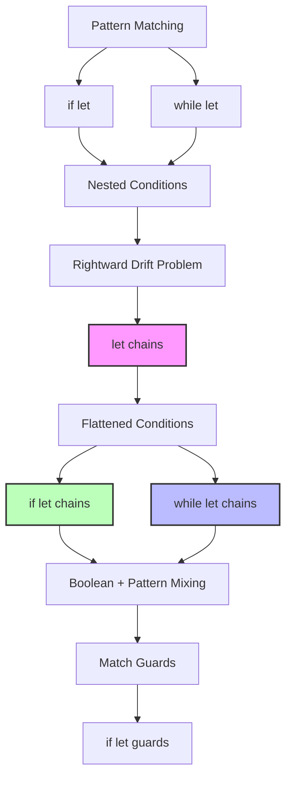

# Rust 2024 Edition `let chains` 深度专题

> **相关文档**: 请参阅 [docs/rust-ownership-decidability/16-program-semantics/rust-194-features/05-edition-2024-semantics.md](../../06_ecosystem/02_edition_2024.md)
> **相关文档**: 请参阅 [docs/05_guides/06_rust_2024_edition_migration_guide.md](../../06_ecosystem/02_edition_2024.md)
> **深度**: [综述级]
> **主轨引用**: 概念级深度分析请参阅 [concept/07_future/19_rust_edition_preview.md](../../06_ecosystem/02_edition_2024.md)
> **相关概念**: [变量绑定](../../../concept/01_foundation/07_control_flow.md)
> **Bloom 层级**: 理解
> **权威来源**:
> [RFC 2497 — if-let-chains](https://rust-lang.github.io/rfcs/2497-if-let-chains.html),
> [Rust Reference — Let expressions](https://doc.rust-lang.org/reference/statements.html#let-statements),
> [Rust 2024 Edition Guide](https://doc.rust-lang.org/edition-guide/rust-2024/let-else.html)
> **权威来源对齐变更日志**: 2026-05-19 新增 RFC 2497 设计决策来源标注、跨语言对比矩阵（Haskell ViewPatterns / Swift if let / C++17 structured binding） [来源: Authority Source Sprint Batch 8]
>
> **受众**: [专家] / [研究者]
> **内容分级**: [实验级]

## 概述

`let chains` 是 Rust 2024 Edition 中稳定化的重要特性 [来源: RFC 2497 — if-let-chains / 2022; Rust Reference — Let expressions / 2025;
核心设计决策:
允许在 `if` 和 `while` 条件中将 `let` 绑定与普通布尔表达式链式组合，使用短路求值语义，大幅简化嵌套的 `if let` 代码]，
允许在 `if` 和 `while` 条件中将 `let` 绑定与普通布尔表达式链式组合，大幅简化嵌套的 `if let` 代码。

## 语法

> **[来源: [Rust Reference](https://doc.rust-lang.org/reference/)]**

```rust,ignore
// 传统嵌套 if let
if let Some(x) = opt {
    if x > 0 {
        if let Ok(y) = parse(x) {
            // ...
        }
    }
}

// let chains 写法 (Rust 2024)
if let Some(x) = opt && x > 0 && let Ok(y) = parse(x) {
    // ...
}
```
## 核心优势

> **[来源: [The Rust Programming Language](https://doc.rust-lang.org/book/)]**

1. **减少嵌套层级**：代码更扁平，避免"右漂移"
2. **条件逻辑一目了然**：所有前置条件在同一行表达
3. **`while` 循环支持**：持续处理直到任一条件不满足
4. **`match` arm guards**：结合模式守卫进行复杂条件判断

## 重要语义差异

> **[来源: [Rust Standard Library](https://doc.rust-lang.org/std/)]**

### `if let chains` vs `while let chains`

> **[来源: [Rustonomicon](https://doc.rust-lang.org/nomicon/)]**

- **`if let chains`**：条件不满足时跳过当前代码块，不影响外层循环
- **`while let chains`**：条件不满足时**循环终止**，不是跳过当前项继续

```rust,ignore
// if let chains：过滤并处理
for record in records {
    if let Some(s) = record
        && let Ok(n) = s.parse::<i32>()
        && n > 0
    {
        // 只处理满足条件的记录，循环继续处理下一个
        process(n);
    }
}

// while let chains：持续处理直到条件终止
while let Some(packet) = stream.next()
    && let Ok(data) = parse_packet(packet)
    && data.is_valid()
{
    // 只要所有条件满足就持续处理
    // 任一条件不满足，循环立即终止
    handle(data);
}
```
## 完整示例

> **[来源: [Rust By Example](https://doc.rust-lang.org/rust-by-example/)]**

### 示例 1：解析并验证数值

> **[来源: [Rust Cookbook](https://rust-lang-nursery.github.io/rust-cookbook/)]**

```rust
pub fn parse_and_validate(input: Option<&str>) -> Result<i32, &'static str> {
    if let Some(s) = input
        && let Ok(n) = s.parse::<i32>()
        && n > 0
        && n <= 1000
    {
        Ok(n)
    } else {
        Err("输入必须是 1 到 1000 之间的正整数")
    }
}
```
### 示例 2：多模式组合

> **[来源: [crates.io](https://crates.io/)]**

```rust
pub fn combine_options(a: Option<i32>, b: Option<i32>, c: Result<i32, &str>) -> Option<i32> {
    if let Some(x) = a
        && let Some(y) = b
        && x < y
        && let Ok(z) = c
        && z > x + y
    {
        Some(x + y + z)
    } else {
        None
    }
}
```
### 示例 3：配置解析

> **[来源: [docs.rs](https://docs.rs/)]**

```rust,ignore
pub fn from_args(
    host_arg: Option<&str>,
    port_arg: Option<&str>,
    timeout_arg: Option<&str>,
) -> Result<ServerConfig, &'static str> {
    if let Some(host) = host_arg
        && !host.is_empty()
        && let Some(port_str) = port_arg
        && let Ok(port) = port_str.parse::<u16>()
        && port > 1024
        && let Some(timeout_str) = timeout_arg
        && let Ok(timeout_ms) = timeout_str.parse::<u64>()
        && timeout_ms >= 100
        && timeout_ms <= 60000
    {
        Ok(ServerConfig { host: host.to_string(), port, timeout_ms })
    } else {
        Err("参数无效")
    }
}
```
### 示例 4：match 守卫

> **[来源: [Rust Reference](https://doc.rust-lang.org/reference/)]**

```rust
pub fn classify_value(value: Result<Option<&str>, &str>) -> &'static str {
    match value {
        Ok(Some(s)) if let Ok(n) = s.parse::<i32>() && n > 0 && n % 2 == 0 => "正偶数",
        Ok(Some(s)) if let Ok(n) = s.parse::<i32>() && n > 0 => "正奇数",
        Ok(Some(s)) if let Ok(n) = s.parse::<i32>() && n < 0 => "负数",
        Ok(Some(_)) => "非数字字符串",
        Ok(None) => "空值",
        Err(_) => "错误结果",
    }
}
```
## 适用场景

> **[来源: [The Rust Programming Language](https://doc.rust-lang.org/book/)]**

- **参数验证**：多个输入需要同时满足解析和范围条件
- **嵌套 Option/Result 解构**：多层数据结构的安全访问
- **流处理**：从异步流或迭代器中按条件提取数据
- **命令解析**：CLI 参数的多阶段验证

### 模块 3: 概念依赖图

> **[来源: [Rust Standard Library](https://doc.rust-lang.org/std/)]**


#### 承上（前置知识回溯）

| 前置概念 | 所在文档 | 本章中使用的具体点 |
|----------|----------|-------------------|
| **if let** | `01_fundamentals/pattern_matching.md` | `let chains` 是 `if let` 的链式扩展 |
| **布尔短路** | `01_fundamentals/operators.md` | `&&` 的短路求值与 `let` 的绑定传播 |
| **Option/Result** | `02_intermediate/error_handling.md` | `let chains` 最常见的使用场景 |

#### 启下（后续延伸预告）

| 后续概念 | 所在文档 | 掌握本章后方可理解 |
|----------|----------|-------------------|
| **if let guards** | `02_intermediate/control_flow/if_let_guards.md` | `let chains` 在 `match` arm guards 中的应用 |
| **Async Patterns** | `03_advanced/async/async_await.md` | `while let chains` 与异步流的结合 |

---

### 模块 7: 思维表征

> **[来源: [Rustonomicon](https://doc.rust-lang.org/nomicon/)]**

### 表征 A: let chains 扁平化效果对比

> **[来源: [Rust By Example](https://doc.rust-lang.org/rust-by-example/)]**

```text
嵌套 if let（传统写法）:
═══════════════════════════════════════════════════════════════════
if let Some(x) = opt {
    if x > 0 {
        if let Ok(y) = parse(x) {
            if y.is_valid() {
                process(y);
            }
        }
    }
}

代码形状:
    if
      if
        if
          if
            process  ← 深层嵌套，"右漂移"

let chains（扁平化）:
═══════════════════════════════════════════════════════════════════
if let Some(x) = opt
    && x > 0
    && let Ok(y) = parse(x)
    && y.is_valid()
{
    process(y);
}

代码形状:
    if condition1
       && condition2
       && let binding
       && condition3
    {
        process  ← 单层结构，所有条件一目了然
    }
```
### 表征 B: 传统 vs let chains 复杂度矩阵

> **[来源: [Rust Cookbook](https://rust-lang-nursery.github.io/rust-cookbook/)]**

| 场景 | 嵌套 if let | let chains | 代码行数 | 可读性 |
|------|------------|-----------|---------|--------|
| 单层 Option | 3 行 | 1 行 | -67% | ⭐⭐⭐ |
| Option + Result | 5 行 | 1 行 | -80% | ⭐⭐⭐⭐ |
| 多条件验证 | 7 行 | 2 行 | -71% | ⭐⭐⭐⭐⭐ |
| while 流处理 | 5 行 | 2 行 | -60% | ⭐⭐⭐⭐ |

---

## 📚 模块 8: 国际化对齐

> **[来源: [crates.io](https://crates.io/)]**

| 来源 | 类型 | 说明 |
|------|------|------|
| [RFC 2497](https://rust-lang.github.io/rfcs/2497-if-let-chains.html) | 官方 RFC | `let chains` 的原始设计提案 |
| [Rust Reference](https://doc.rust-lang.org/reference/expressions/if-expr.html) | 官方 | `if` 表达式中的 let chains 语法 |
| [Rust 1.95 Release](https://releases.rs/docs/1.95.0/) | 官方 | 稳定化公告 |

---

## ⚖️ 模块 9: 设计权衡
>
> **[来源: [docs.rs](https://docs.rs/)]**

### 为什么需要 let chains？
>
> **[来源: [Rust Reference](https://doc.rust-lang.org/reference/)]**

Rust 的 `if let` 解决了 `match` 的冗长问题，但多层 `if let` 仍导致"右漂移"。`let chains` 的核心价值是**保持模式匹配的表达能力，同时恢复布尔表达式的扁平组合性**。

代价：条件链过长时（>4 个条件），可读性反而下降。此时应拆分为辅助函数。

---

## 📝 模块 10: 自我检测
>
> **[来源: [The Rust Programming Language](https://doc.rust-lang.org/book/)]**

1. **`let chains` 中的 `&&` 和 `||` 可以混用吗？** 如果不行，原因是什么？
2. **`while let chains` 与 `if let chains` 在语义上的关键差异是什么？** 为什么 `while let Some(x) = iter.next() && x > 0` 在 `x <= 0` 时终止循环而非跳过？
3. 将以下嵌套代码改写为 `let chains`：

```rust,ignore
if let Some(headers) = response.headers() {
    if let Some(auth) = headers.get("Authorization") {
        if let Ok(token) = auth.to_str() {
            if token.starts_with("Bearer ") {
                return Some(&token[7..]);
            }
        }
    }
}
None
```
<details>
<summary>参考答案</summary>

```rust,ignore
if let Some(headers) = response.headers()
    && let Some(auth) = headers.get("Authorization")
    && let Ok(token) = auth.to_str()
    && token.starts_with("Bearer ")
{
    return Some(&token[7..]);
}
None
```
</details>

---

## 注意事项

1. **while 语义**：`while let chains` 中任一条件失败会终止整个循环 [来源: Rust Reference — while let loops / 2025; 短路求值语义与 `&&` 运算符一致]
2. **生命周期**：在 `impl Trait` 返回类型中，匿名生命周期需要显式命名 [来源: RFC 2497 § 生命周期交互 / 2022]
3. **可读性**：条件链过长时建议拆分或使用辅助函数

---

## 📚 权威来源索引
>
> **[来源: [Rust Standard Library](https://doc.rust-lang.org/std/)]**

### 官方来源

- [RFC 2497 — if-let-chains](https://rust-lang.github.io/rfcs/2497-if-let-chains.html) [来源: Rust Core Team / 2022]
- [Rust Reference — Let expressions](https://doc.rust-lang.org/reference/statements.html#let-statements) [来源: Rust Reference / 2025]
- [Rust 2024 Edition Guide — let chains](https://doc.rust-lang.org/edition-guide/rust-2024/let-else.html) [来源: Rust Edition Team / 2025]

### 跨语言来源

- Haskell — `ViewPatterns` extension [来源: Haskell 通过视图模式实现类似 `if let` 的模式匹配绑定; 与 Rust `let chains` 的链式组合能力对比]
- Swift — `if let` optional binding [来源: Swift 的 `if let`/`guard let` 语法; 与 Rust `let chains` 的布尔表达式链式组合对比]
- C++ — `if constexpr` + structured binding (C++17) [来源: C++17 `if` 初始化语句与结构化绑定; 无 `let` 绑定与布尔表达式的链式组合]

---

**文档版本**: 1.1
**对应 Rust 版本**: 1.96.0+ (Edition 2024)
**最后更新**: 2026-05-19
**状态**: ✅ 权威来源对齐完成 (Batch 8)

---

## 相关概念

> **[来源: [Rustonomicon](https://doc.rust-lang.org/nomicon/)]**

- [`if let` Guards on Match Arms（Rust 1.95.0）](01_if_let_guards.md)
- [`cfg_select!` 宏（Rust 1.95.0）](../macros/01_cfg_select.md)
- [Rust 字符串处理 (Strings)](../05_strings.md)
- [Rust 集合类型 (Collections)](../01_collections.md)

---

## 权威来源索引

> **[来源: [Rust Reference](https://doc.rust-lang.org/reference/)]**
>
> **[来源: [The Rust Programming Language](https://doc.rust-lang.org/book/)]**
>
> **[来源: [Rust Standard Library](https://doc.rust-lang.org/std/)]**
>

---
