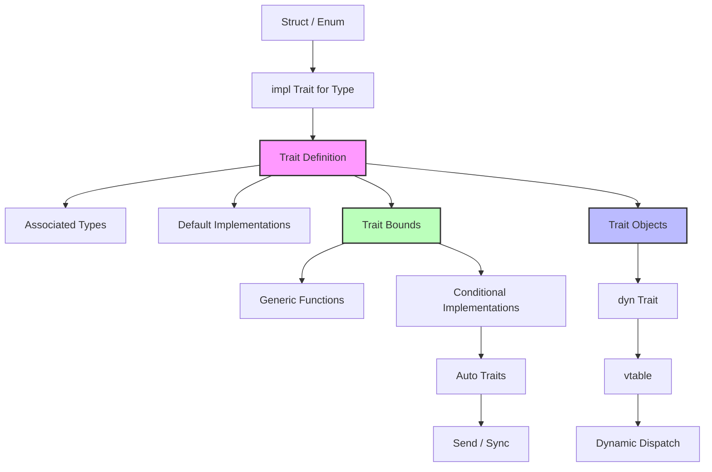

# Trait - 定义共享行为

> **Bloom 层级**: 理解

> **📌 简介**: Trait 是 Rust 的类型接口系统，但它远比传统 OOP 的接口强大：它支持泛型关联类型、默认实现、条件实现、以及编译期多态（单态化）。Trait 是 Rust 实现"零成本抽象"的核心机制。
>
> **⏱️ 预计学习时间**: 90-120 分钟
> **📚 难度级别**: ⭐⭐⭐⭐ 高级

> **权威来源**: [The Rust Programming Language — Ch10](https://doc.rust-lang.org/book/ch10-00-generics.html), [Rust Reference — Traits](https://doc.rust-lang.org/reference/items/traits.html), [RFC 255: Trait Objects](https://rust-lang.github.io/rfcs/0255-object-safety.html), [RFC 1023: Rebalancing Coherence](https://rust-lang.github.io/rfcs/1023-rebalancing-coherence.html), [Wadler & Blott, "How to Make ad-hoc Polymorphism Less ad-hoc" (POPL 1989)](https://dl.acm.org/doi/10.1145/75277.75283)
>
> **权威来源对齐变更日志**: 2026-05-19 补全权威来源标注（TRPL、Rust Reference、RFC 1023、RFC 255、Wadler & Blott 1989） [来源: Authority Source Sprint Batch 8]

**变更日志**:

- v2.1 (2026-05-19): 补全权威来源标注（TRPL、Rust Reference、RFC 1023、RFC 255、Wadler & Blott 1989）

---

## 🎯 学习目标

完成本章学习后，你将能够：

- [x] 区分 trait 的**接口功能**与**约束功能**：trait 不仅是"实现什么"，更是"能做什么"
- [x] 理解关联类型（Associated Types）与泛型参数的 trade-off，以及迭代器协议的设计意图
- [x] 掌握 trait 对象（`dyn Trait`）的 vtable 布局、动态分发成本与使用边界
- [x] 解释 coherence（一致性）与 orphan rules（孤儿规则）的设计理由
- [x] 使用 auto trait 和 marker trait 扩展类型的编译期属性

---

## 📋 先决条件

1. **结构体与枚举** — 自定义类型的定义与使用
2. **泛型基础** — `T`、Trait Bound、`impl Trait`（`02_intermediate/generics.md`）
3. **生命周期** — 引用的有效范围（`01_fundamentals/lifetimes.md`）
4. **所有权** — move 语义与借用规则（`01_fundamentals/ownership.md`）

---

## 🧠 核心概念

### 模块 1: 概念定义

#### 1.1 直观定义

**Trait** 是 Rust 中定义**共享行为契约**的机制。它指定了一组类型必须实现的方法，但与传统面向对象语言的"接口"不同，Trait 还可以：

- 提供**默认实现**
- 定义**关联类型**（输出类型由实现者决定）
- 作为**泛型约束**（Trait Bound）限制类型参数
- 支持**条件实现**（为所有满足某约束的类型实现某 trait）

> 💡 关键直觉：trait 在 Rust 中有两个正交的作用 —— **形容词**（描述类型能做什么，用于泛型约束）和 **名词**（作为 trait 对象，用于动态分发）。

> **[来源: TRPL: Ch10.2]** "A trait defines functionality a particular type has and can share with other types." ✅
> **[来源: Rust Reference: Traits]** Trait 通过 `trait` 定义和 `impl` 实现，支持关联类型、默认方法、泛型参数和 where 子句约束。 ✅
> **[来源: Wikipedia: Type class]** Rust Trait 直接受 Haskell Type Class 启发，支持 ad hoc 多态。 ✅

#### 1.2 操作定义

```rust
// 定义 trait（契约）
pub trait Summary {
    type Author;  // 关联类型

    fn summarize(&self) -> String;

    // 默认实现
    fn summarize_default(&self) -> String {
        format!("(Read more...)")
    }
}

// 为类型实现 trait
pub struct Article {
    pub headline: String,
    pub content: String,
    pub author: String,
}

impl Summary for Article {
    type Author = String;

    fn summarize(&self) -> String {
        format!("{}: {}", self.headline, &self.content[..50.min(self.content.len())])
    }
}

// Trait 作为泛型约束
pub fn notify<T: Summary>(item: &T) {
    println!("Breaking news! {}", item.summarize());
}

// Trait 对象（动态分发）
pub fn notify_dyn(item: &dyn Summary) {
    println!("Breaking news! {}", item.summarize());
}
```

边界操作：

- `impl Trait for Type`：为具体类型实现 trait（需要满足 orphan rules）
- `T: Trait`：泛型约束，限制类型参数必须实现某 trait
- `dyn Trait`：类型擦除，运行时通过 vtable 分发
- `impl Trait`：存在类型（existential type），编译器推断具体实现

#### 1.3 形式化直觉

> ⚠️ **标注**: 本节与类型理论中的 type class 和 Haskell 的 type family 方向对齐。

**类型系统视角**:

Trait 可以看作**带约束的接口（constrained interfaces）**或**类型类（type classes）**的 Rust 实现：

```
Trait Summary ≈ 类型 T 上的方法族 + 关联类型 + 约束规则
```

关联类型（Associated Types）与泛型参数的关键差异：

- **泛型参数**：调用者选择类型（如 `Graph<N, E>` 中调用者选 `N` 和 `E`）
- **关联类型**：实现者选择类型（如 `Iterator::Item` 由 `Vec<i32>` 决定为 `i32`）

这一差异对应于类型理论中的 **输入参数 vs 输出参数**：

- 泛型参数是 trait 的**输入**（调用者提供）
- 关联类型是 trait 的**输出**（实现者决定，调用者使用）

**编译器视角**:

Trait 的编译期实现涉及两个核心机制：

1. **单态化（Monomorphization）**：为每个 `T: Trait` 的具体类型生成专用代码
2. **vtable 生成**：为 `dyn Trait` 生成方法指针表，支持运行时动态分发

---

### 模块 2: 属性清单

| 属性名 | 类型 | 值域/取值 | 说明 | 反例边界 |
|--------|------|-----------|------|----------|
| **默认实现** | 固有属性 | 可选 | trait 可为方法提供默认体，实现者可覆盖 | 默认实现不能访问 `Self` 的私有字段 |
| **关联类型唯一性** | 关系属性 | 每个 impl 一个 | 一个类型对一个 trait 只有一个关联类型映射 | `impl Trait for T` 不能定义多个 `Item` |
| **孤儿规则** | 关系属性 | 编译期约束 | 不能为外部类型实现外部 trait | newtype 模式是 workaround |
| **对象安全性** | 固有属性 | 有条件 | 仅方法返回 `Self`、无泛型参数、无关联常量的 trait 可作 `dyn Trait` | `Clone` 不是对象安全的 |
| **自动实现** | 关系属性 | auto trait | 编译器自动推导（如 `Send`、`Sync`） | 显式 `impl !Send for T` 可撤销 |
| **条件实现** | 关系属性 | 泛型约束 | `impl<T: Debug> Trait for T` | 可能与其他 impl 冲突（coherence） |

#### 关键推论

1. **推论 1（关联类型 vs 泛型的选择）**: 当类型的"输出"由实现者唯一决定时，使用关联类型（如 `Iterator::Item`）。当需要调用者灵活指定时，使用泛型参数（如 `From<T>`）。
2. **推论 2（对象安全的边界）**: `dyn Trait` 要求 trait 是"对象安全"的。`Clone` 不是对象安全的，因为 `clone(&self) -> Self` 的返回类型在编译期未知（`Self` 被擦除）。这解释了为什么 `Box<dyn Clone>` 是非法的。
3. **推论 3（coherence 保证全局一致性）**: Rust 保证任意类型+trait 组合最多只有一个 `impl`。这使得 trait solving 是确定性的，不会出现 C++ 模板特化的歧义。

---

### 模块 3: 概念依赖图



#### 承上（前置知识回溯）

| 前置概念 | 所在文档 | 本章中使用的具体点 |
|----------|----------|-------------------|
| **结构体/枚举** | `01_fundamentals/ownership.md` | trait 的实现对象 |
| **泛型** | `02_intermediate/generics.md` | Trait Bound 约束泛型参数 |
| **生命周期** | `01_fundamentals/lifetimes.md` | trait 方法中的生命周期约束 |

#### 启下（后续延伸预告）

| 后续概念 | 所在文档 | 掌握本章后方可理解 |
|----------|----------|-------------------|
| **泛型深入** | `02_intermediate/generics.md` | GAT、高阶 trait bound |
| **Async/Await** | `03_advanced/async/async_await.md` | `Future` 是 trait，`Pin` 是泛型结构体 |
| **宏系统** | `03_advanced/macros/procedural.md` | 派生宏（derive macro）为类型自动实现 trait |
| **编译器内部** | `04_expert/compiler_internals.md` | trait solving 算法（new solver） |

---

### 模块 4: 机制解释

#### 4.1 类型系统视角

**Trait Solving（Trait 求解）**:

当编译器遇到 `T: Summary` 约束时，它需要"求解"：对于给定的 `T`，是否存在 `impl Summary for T`？

```rust
fn notify<T: Summary>(item: &T) { ... }

// 调用点
let article = Article { ... };
notify(&article);  // 编译器求解: Article: Summary? ✅
```

Rust 的 trait solver 使用 **SLG 解析**（新 solver）或 **chalk 风格**的约束求解：

1. 检查直接实现：`impl Summary for Article`
2. 检查条件实现：`impl<T: Debug> Summary for T`，`Article: Debug?`
3. 检查 blanket impl：`impl<T> Summary for T where T: Display`

**关联类型与类型推断**:

```rust
pub trait Iterator {
    type Item;
    fn next(&mut self) -> Option<Self::Item>;
}

// 使用关联类型
fn process<I: Iterator>(iter: I) -> Vec<I::Item> { ... }
// 编译器从 I 的具体类型推断 I::Item
```

关联类型使得调用者**无需显式指定**输出类型，同时保证每个类型只有一个映射。

#### 4.2 内存模型视角

**Trait 对象的 vtable 布局**:

```rust
let items: Vec<Box<dyn Summary>> = vec![
    Box::new(article),
    Box::new(tweet),
];
```

内存布局概念上如下：

```text
Box<dyn Summary>
┌─────────────────┐      ┌─────────────────────────────────────┐
│  data pointer   │─────►│  实际对象（Article 或 Tweet）        │
│  vtable pointer │──┐   │  （具体内存布局由类型决定）           │
└─────────────────┘  │   └─────────────────────────────────────┘
                     │
                     ▼
              ┌─────────────────────────────────────┐
              │  vtable for Summary                  │
              │  ┌─────────────────────────────────┐│
              │  │ drop fn pointer                 ││
              │  │ size_of::<T>                    ││
              │  │ align_of::<T>                   ││
              │  │ method: summarize               ││ ──► Article::summarize
              │  │ method: summarize_default       ││ ──► 默认实现或覆盖
              │  │ ...                             ││
              │  └─────────────────────────────────┘│
              └─────────────────────────────────────┘
```

每个 `dyn Trait` 值包含两个指针：

- **data pointer**: 指向实际对象
- **vtable pointer**: 指向方法指针表

**动态分发的成本**：

- 方法调用：两次间接跳转（vtable 查找 + 方法调用）
- 无法内联：编译器不知道具体类型，不能内联优化
- 大小开销：`Box<dyn Trait>` 是胖指针（两个 `usize`）

#### 4.3 运行时视角

**单态化 vs 动态分发**:

| 特性 | 单态化（`T: Trait`） | 动态分发（`dyn Trait`） |
|------|---------------------|------------------------|
| 编译输出 | 每种类型生成一份代码 | 一份通用代码 + vtable |
| 方法调用 | 直接调用（可内联） | 间接调用（vtable 查找） |
| 类型擦除 | 无 | 有（运行时不知道具体类型） |
| 同质集合 | 困难（`Vec<T>` 要求同一类型） | 容易（`Vec<Box<dyn Trait>>`） |
| 二进制大小 | 大（代码膨胀） | 小（共享代码） |

---

### 模块 5: 正例集

#### 5.1 Minimal（最小正例）

```rust
trait Greet {
    fn greet(&self) -> String;
}

struct Person {
    name: String,
}

impl Greet for Person {
    fn greet(&self) -> String {
        format!("Hello, I'm {}", self.name)
    }
}

fn main() {
    let p = Person { name: String::from("Alice") };
    println!("{}", p.greet());
}
```

#### 5.2 Realistic（真实场景）

使用关联类型实现自定义迭代器：

```rust
struct Counter {
    count: u32,
    max: u32,
}

impl Iterator for Counter {
    type Item = u32;

    fn next(&mut self) -> Option<Self::Item> {
        if self.count < self.max {
            self.count += 1;
            Some(self.count)
        } else {
            None
        }
    }
}

fn main() {
    let counter = Counter { count: 0, max: 5 };
    for num in counter {
        println!("{}", num);
    }
}
```

#### 5.3 Production-grade（生产级）

使用 trait 实现插件化架构：

```rust
use std::collections::HashMap;

// 插件 trait
trait Plugin: Send + Sync {
    fn name(&self) -> &str;
    fn execute(&self, input: &str) -> Result<String, PluginError>;
    fn version(&self) -> &str { "1.0.0" }
}

#[derive(Debug)]
struct PluginError(String);

struct PluginRegistry {
    plugins: HashMap<String, Box<dyn Plugin>>,
}

impl PluginRegistry {
    fn new() -> Self {
        PluginRegistry {
            plugins: HashMap::new(),
        }
    }

    fn register(&mut self, plugin: Box<dyn Plugin>) {
        let name = plugin.name().to_string();
        self.plugins.insert(name, plugin);
    }

    fn execute(&self, name: &str, input: &str) -> Result<String, PluginError> {
        self.plugins
            .get(name)
            .ok_or_else(|| PluginError(format!("Plugin {} not found", name)))?
            .execute(input)
    }
}

struct UppercasePlugin;
impl Plugin for UppercasePlugin {
    fn name(&self) -> &str { "uppercase" }
    fn execute(&self, input: &str) -> Result<String, PluginError> {
        Ok(input.to_uppercase())
    }
}

fn main() {
    let mut registry = PluginRegistry::new();
    registry.register(Box::new(UppercasePlugin));

    println!("{}", registry.execute("uppercase", "hello").unwrap());
}
```

---

### 模块 6: 反例集

#### 反例 1: 违反孤儿规则（Orphan Rules）

**错误代码**:

```rust
// 尝试为外部类型实现外部 trait
impl serde::Serialize for std::collections::HashMap<String, i32> {
    // ...
}
```

**编译器错误**:

```text
error[E0117]: only traits defined in the current crate can be implemented for arbitrary types
   |
   | impl serde::Serialize for std::collections::HashMap<String, i32> {
   | ^^^^^^^^^^^^^^^^^^^^^^^^^^^^^^^^^^^^^^^^^^^^^^^^^^^^^^^^^^^^^^^
   | |
   | impl doesn't use only types from inside the current crate
```

**根因推导**:
孤儿规则防止两个不同的 crate 为同一类型+trait 组合提供冲突的实现。如果 crate A 和 crate B 都为 `HashMap<String, i32>` 实现了 `Serialize`，下游 crate 依赖两者时将面临不可解的冲突。

> **[来源: RFC 1023]** Orphan Rule 要求 impl 中至少有一方（类型或 Trait）定义在当前 crate，是 Coherence（全局一致性）的必要前提。 ✅
> **[来源: Rust Reference: Orphan Rules]** 该规则确保 trait solving 的确定性，使得 Rust 的泛型系统可以在分布式开发中安全扩展。 ✅

**修复方案** — Newtype 模式:

```rust
use std::collections::HashMap;

// 包装外部类型
pub struct MyMap(HashMap<String, i32>);

// 现在可以为本地类型实现外部 trait
impl serde::Serialize for MyMap {
    fn serialize<S>(&self, serializer: S) -> Result<S::Ok, S::Error>
    where
        S: serde::Serializer,
    {
        self.0.serialize(serializer)
    }
}
```

**抽象原则**:
> **"孤儿规则是全局一致性的基石"**：它保证了 trait solving 的确定性，使得 Rust 的泛型系统可以在分布式开发中安全扩展。Newtype 模式虽然有包装/解包的摩擦成本，但它是类型系统安全性的必要代价。

---

#### 反例 2: 尝试对非对象安全 trait 使用 `dyn Trait`

**错误代码**:

```rust
fn make_cloneable(item: &dyn Clone) -> Box<dyn Clone> {
    Box::new(item.clone())  // ❌ 编译错误！Clone 不是对象安全的
}
```

**编译器错误**:

```text
error[E0038]: the trait `Clone` cannot be made into an object
   |
   | fn make_cloneable(item: &dyn Clone) -> Box<dyn Clone> {
   |                     ^^^^^^^^^^^^^ `Clone` cannot be made into an object
   |
   = note: the trait cannot require that `Self : Sized`
```

**根因推导**:
`Clone::clone(&self) -> Self` 的返回类型是 `Self`。在 `dyn Clone` 中，`Self` 被擦除了（类型大小未知），因此编译器无法为 `clone` 生成 vtable 条目。

对象安全的三个必要条件：[来源: RFC 255] Trait 对象安全规则定义了哪些 trait 可以转换为 `dyn Trait`。 ✅

1. 方法不要求 `Self: Sized`
2. 方法不使用泛型类型参数
3. 方法不返回 `Self`（除非 `Self` 被包装在指针中，如 `Box<Self>`）

> **[来源: Rust Reference: Object Safety]** 对象安全 trait 的方法签名必须满足特定条件，确保 vtable 可以生成且方法调用是良定义的。 ✅

**修复方案 A** — 使用泛型:

```rust
fn make_cloneable<T: Clone>(item: &T) -> T {
    item.clone()
}
```

**修复方案 B** — 定义对象安全的 Clone 变体:

```rust
trait DynClone {
    fn clone_box(&self) -> Box<dyn DynClone>;
}

impl<T: Clone + 'static> DynClone for T {
    fn clone_box(&self) -> Box<dyn DynClone> {
        Box::new(self.clone())
    }
}
```

**抽象原则**:
> **`dyn Trait` 的类型擦除是有代价的**：任何依赖编译期知道 `Self` 大小的操作（如返回 `Self`、使用 `Self` 作为泛型参数）都会破坏对象安全性。需要在"编译期多态（单态化）"和"运行时多态（动态分发）"之间做出选择。

---

#### 反例 3: 冲突实现（Overlapping Implementations）

**错误代码**:

```rust
trait Process {
    fn process(&self);
}

impl<T> Process for T {
    fn process(&self) { println!("generic"); }
}

impl Process for i32 {
    fn process(&self) { println!("i32"); }
}
```

**编译器错误**:

```text
error[E0119]: conflicting implementations of trait `Process` for type `i32`
   |
   | impl<T> Process for T {
   | ^^^^^^^^^^^^^^^^^^^^^ conflicting implementation for `i32`
   |
   | impl Process for i32 {
   | -------------------- first implementation here
```

**根因推导**:
`impl<T> Process for T` 是"blanket impl"（为所有类型实现）。`impl Process for i32` 是为具体类型实现。两者为 `i32` 提供了冲突的实现，编译器无法确定使用哪个。

**修复方案** — 使用 negative bound（不稳定）或重新设计 trait 层次：

```rust
// 方案: 引入中间 trait 区分
trait ProcessGeneric {
    fn process(&self);
}

trait ProcessSpecial: ProcessGeneric {
    fn process_special(&self);
}

impl ProcessGeneric for i32 {
    fn process(&self) { println!("i32 generic"); }
}

impl ProcessSpecial for i32 {
    fn process_special(&self) { println!("i32 special"); }
}
```

**抽象原则**:
> **"Coherence 要求无歧义"**：Rust 的 trait 系统保证任意时刻、任意类型+trait 组合最多只有一个激活的 `impl`。这是类型系统一致性的核心，但也限制了某些灵活的设计模式。

---

---

## 🗺️ 模块 7: 思维表征套件

### 表征 A: Trait 使用场景决策矩阵

| 场景 | `impl Trait` | `dyn Trait` | `T: Trait` 泛型 | 关联类型 | 泛型参数 |
|------|-------------|-------------|----------------|----------|----------|
| **返回类型隐藏** | ✅ `-> impl Trait` | ❌ 不可 | ❌ 不可 | N/A | N/A |
| **异构集合** | ❌ | ✅ `Vec<Box<dyn Trait>>` | ❌ | N/A | N/A |
| **编译期优化** | ✅ 单态化 | ❌ 动态分发 | ✅ 单态化 | ✅ | ✅ |
| **二进制大小敏感** | ❌ 膨胀 | ✅ 共享 | ❌ 膨胀 | ✅ | ❌ |
| **递归类型** | ❌ | ✅ | ❌ | N/A | N/A |
| **调用者指定类型** | N/A | N/A | ✅ | ❌ | ✅ |
| **实现者指定类型** | N/A | N/A | N/A | ✅ | ❌ |
| **Trait Bound 组合** | ❌ | N/A | ✅ `T: A + B` | N/A | N/A |

### 表征 B: 对象安全性检查决策树

```text
                    ┌─────────────────────────────────────┐
                    │  开始: 是否可将 Trait 用作 dyn Trait?  │
                    └──────────────┬──────────────────────┘
                                   │
                                   ▼
                    ┌─────────────────────────────────────┐
                    │  问题1: 是否有方法要求 Self: Sized?   │
                    └──────────────┬──────────────────────┘
                                   │
            ┌──────────────────────┴──────────────────────┐
            │是                                           │否
            ▼                                           ▼
    ┌───────────────────────────┐           ┌───────────────────────────┐
    │ **不是对象安全**           │           │ 问题2: 是否有方法返回 Self? │
    │                           │           │ (非 Box<Self>/&Self 包装)   │
    │ 例: Clone::clone -> Self  │           └──────────────┬────────────┘
    │     Default::default -> Self│                         │
    │                           │              ┌───────────┴───────────┐
    │ 修复: 使用泛型或引入        │              │是                     │否
    │      DynXxx trait         │              ▼                      ▼
    └───────────────────────────┘    ┌──────────────────┐  ┌──────────────────┐
                                     │ **不是对象安全**  │  │ 问题3: 是否有方法  │
                                     │                   │  │ 使用泛型参数?      │
                                     │ 例: Iterator::next│  └────────┬─────────┘
                                     │ 返回 Option<Self::Item>│    │ 实际安全，因为    │
                                     │ 是安全的（关联类型）│  │ Self::Item 在 vtable│
                                     │                   │  │ 中有确定位置       │
                                     └──────────────────┘  │                   │
                                                            │     ┌───────────┴───────────┐
                                                            │     │是                     │否
                                                            │     ▼                      ▼
                                                            │ ┌──────────────────┐ ┌──────────────────┐
                                                            │ │ **不是对象安全**  │ │ **是对象安全**    │
                                                            │ │                   │ │                   │
                                                            │ │ 例: fn f<T>(t: T)│ │ 可以 Box<dyn T>  │
                                                            │ │ 在 trait 方法中   │ │ 可以 &dyn T       │
                                                            │ └──────────────────┘ └──────────────────┘
                                                            │
                                                            │ 注: 关联类型不是泛型参数！
                                                            │ Iterator::Item 是对象安全的
                                                            └──────────────────────────────────────────┘
```

### 表征 C: vtable 内存布局图

```text
dyn Trait 的胖指针结构:
┌─────────────────────────────────────────────────────────────┐
│  &dyn MyTrait                                               │
│  ┌─────────────────────┐  ┌─────────────────────────────┐  │
│  │ data: *mut ()       │  │ vtable: *mut ()             │  │
│  │ 指向实际对象地址      │  │ 指向 vtable 首地址           │  │
│  └─────────────────────┘  └─────────────────────────────┘  │
│           │                           │                     │
│           ▼                           ▼                     │
│  ┌─────────────────────┐  ┌─────────────────────────────┐  │
│  │ Concrete Object     │  │ VTable for MyTrait          │  │
│  │ ┌─────────────────┐ │  │ ┌─────────────────────────┐ │  │
│  │ │ field_a: T      │ │  │ │ drop_in_place: fn(*mut)│ │  │
│  │ │ field_b: U      │ │  │ │ size: usize             │ │  │
│  │ │ ...             │ │  │ │ align: usize            │ │  │
│  │ └─────────────────┘ │  │ │ method_1: fn(*const)    │─┼──┼──► Concrete::method_1
│  │                     │  │ │ method_2: fn(*const)    │─┼──┼──► Concrete::method_2
│  │                     │  │ │ ...                     │ │  │
│  │                     │  │ └─────────────────────────┘ │  │
│  └─────────────────────┘  └─────────────────────────────┘  │
│                                                             │
│  方法调用过程:                                               │
│  1. 从 &dyn Trait 提取 vtable 指针                           │
│  2. 计算方法偏移量 (编译期已知)                               │
│  3. 调用 `vtable[method_offset](data_ptr, args...)`            │
│                                                             │
│  成本: 2 次内存访问 + 间接调用（无法内联）                    │
└─────────────────────────────────────────────────────────────┘
```

---

## 📚 模块 8: 国际化对齐

### 8.1 官方来源

| 来源 | 类型 | 对应章节/条目 | 本文档对应点 |
|------|------|---------------|--------------|
| [The Rust Book - Traits](https://doc.rust-lang.org/book/ch10-02-traits.html) | 官方教程 | 定义、实现、默认方法 | 模块 1、模块 5 |
| [Rust Reference - Traits](https://doc.rust-lang.org/reference/items/traits.html) | 官方参考 | 对象安全、关联类型、auto trait | 模块 4、模块 6 |
| [RFC 255 - Object Safety](https://rust-lang.github.io/rfcs/0255-object-safety.html) | 官方 RFC | 对象安全性的设计论证 | 模块 6 反例 2 |

### 8.2 学术来源

| 论文/来源 | 会议/机构 | 核心论证 | 本文档对应点 |
|-----------|-----------|----------|--------------|
| **"Type Classes in Haskell"** | 原论文 | Haskell 类型类的形式化基础，Rust trait 的直接前身 | 模块 1.3 |
| **"RustBelt"** | POPL 2018 | Trait 作为逻辑断言在分离逻辑中的编码 | 模块 1.3 |
| **"Chalk"** | Rust 编译器项目 | Rust 的 trait solver 的基于 Prolog 的重新实现 | 模块 4.1 |

### 8.3 社区权威

| 作者 | 文章/演讲 | 核心观点 | 本文档对应点 |
|------|-----------|----------|--------------|
| **Niko Matsakis** | ["After NLL: What's next for the borrow checker?"](https://smallcultfollowing.com/babysteps/) | Trait solving 与借用检查的交互 | 模块 4.1 |
| **Without Boats** | ["The Borrow Checker Within"](https://without.boats/blog/) | Trait 系统的设计哲学 | 模块 9 |
| **Jon Gjengset** | ["Crust of Rust: Traits"](https://www.youtube.com/watch?v=grU-4u0Okto) | Trait 对象、关联类型、对象安全的深入讲解 | 模块 6 反例 2 |

### 8.4 跨语言对比

| 维度 | Rust Trait | Java Interface | C++ Concept (C++20) | Haskell Type Class |
|------|-----------|----------------|---------------------|-------------------|
| **默认实现** | ✅ | ✅ (default) | ❌ | ❌ |
| **关联类型** | ✅ | ❌ | 部分 (嵌套 typedef) | ✅ (Associated Type Families) |
| **泛型约束** | ✅ `T: Trait` | ❌ (通配符) | ✅ `requires` | ✅ `=>` |
| **条件实现** | ✅ | ❌ | 部分 | ✅ |
| **对象安全/动态分发** | ✅ `dyn Trait` | ✅ 原生 | ❌ (概念不用于多态) | ❌ (类型擦除需额外机制) |
| **单态化** | ✅ 默认 | ❌ (擦除) | ✅ | ❌ (字典传递) |
| **孤儿规则** | ✅ 严格 | ❌ (无限制) | ❌ (无限制) | ✅ (类似） |

> **关键差异**: Rust trait 的独特组合是**单态化（零成本）+ 关联类型 + 对象安全（可选动态分发）+ 严格的孤儿规则**。Java 接口支持动态分发但无单态化；Haskell 类型类支持关联类型和条件实现但使用字典传递（有运行时成本）；C++20 Concepts 仅用于编译期约束，不用于多态。

---

## ⚖️ 模块 9: 设计权衡分析

### 9.1 为什么 Rust 选择了 trait 而非继承？

Rust 刻意避免了传统 OOP 的类继承，选择了 trait-based composition：

1. **组合优于继承**: 继承创建紧耦合的层次结构，而 trait 允许类型灵活地组合多个行为，无需位于同一继承树中。
2. **无菱形继承问题**: 多重继承的菱形问题（diamond problem）在 trait 中不存在，因为 trait 本身无数据字段（除非使用关联常量）。
3. **显式实现**: `impl Trait for Type` 要求程序员显式声明类型的能力，避免了"意外继承"带来的隐式行为。

### 9.2 该设计的成本

**学习曲线**:

- Trait bound 的语法（`T: A + B`、`where` 子句）对初学者复杂
- 关联类型与泛型参数的选择没有简单规则
- 对象安全的限制令人困惑（"为什么 `Box<dyn Clone>` 不行？"）

**编译时间**:

- 复杂的 trait bound 和关联类型增加类型检查时间
- 深度嵌套的泛型（如 `Vec<Box<dyn Iterator<Item = Result<T, E>>>>`）导致编译器需要大量约束求解

**表达力限制**:

- 不支持 higher-kinded types（HKT），限制了某些抽象模式（如定义"泛型 Monad"）
- 异步 trait 直到近期才稳定，长期依赖 `async-trait` 宏（动态分发开销）
- specialization（特化）不稳定，限制了为特定类型提供优化实现的能力

### 9.3 什么场景下 trait 是次优的？

1. **简单的回调注册**: 如果只需要一个函数指针，`Fn` trait 或原始函数指针比自定义 trait 更简单。
2. **高度动态的行为切换**: 如果需要在运行时频繁组合行为，trait 对象的 vtable 开销可能显著。某些场景下枚举（ADT）+ 模式匹配更清晰。
3. **与 C++ 模板代码互操作**: C++ 的 SFINAE/Concepts 与 Rust trait 的约束模型不同，跨语言设计时需要额外适配层。

---

## 📝 模块 10: 自我检测与练习

### 概念性问题

1. **为什么 `Iterator::Item` 使用关联类型而非泛型参数（`Iterator<T>`）？** 如果改为 `Iterator<T>`，调用 `vec.iter().next()` 时会发生什么？

2. **`dyn Trait` 的方法调用为什么比泛型参数慢？** 从 CPU 指令缓存和编译器优化的角度解释。

3. **孤儿规则禁止为 `(i32, String)` 实现 `Display`（如果两者和 `Display` 都来自外部 crate）。请用"一致性"和"可组合性"论证为什么这个限制是必要的。**

### 代码修复题

**题 1**: 以下代码试图创建一个可以克隆的 trait 对象，但编译失败。请修复：

```rust
trait Widget {
    fn draw(&self);
    fn clone_box(&self) -> Box<dyn Widget>;
}

struct Button;
impl Widget for Button {
    fn draw(&self) { println!("Button"); }
    fn clone_box(&self) -> Box<dyn Widget> {
        Box::new(self.clone())  // ❌ Button 未实现 Clone
    }
}
```

<details>
<summary>参考答案</summary>

```rust
#[derive(Clone)]
struct Button;

impl Widget for Button {
    fn draw(&self) { println!("Button"); }
    fn clone_box(&self) -> Box<dyn Widget> {
        Box::new(self.clone())
    }
}
```

或更通用的模式：

```rust
trait Widget: DynClone {
    fn draw(&self);
}

trait DynClone {
    fn clone_box(&self) -> Box<dyn Widget>;
}

impl<T: Clone + Widget + 'static> DynClone for T {
    fn clone_box(&self) -> Box<dyn Widget> {
        Box::new(self.clone())
    }
}
```

</details>

**题 2**: 解释以下代码为什么编译失败，并提出两种修复方案：

```rust
trait Processor {
    fn process<T>(&self, input: T) -> T;
}

fn use_processor(p: &dyn Processor) {
    p.process(42);
}
```

<details>
<summary>参考答案</summary>

**根因**: `process<T>` 是泛型方法，需要编译期知道 `T` 来单态化。`dyn Processor` 是运行时类型擦除，无法为所有可能的 `T` 生成 vtable 条目。

**方案 A** — 使用泛型而非 trait 对象:

```rust
fn use_processor<T: Processor>(p: &T) {
    p.process(42);
}
```

**方案 B** — 将泛型改为关联类型或具体类型:

```rust
trait Processor {
    type Input;
    fn process(&self, input: Self::Input) -> Self::Input;
}
```

</details>

### 开放设计题

**题 3**: 你正在设计一个图形渲染库，需要支持多种形状（Rectangle、Circle、Triangle）。你面临两个设计选择：

**方案 A - Trait**: `trait Shape { fn draw(&self); fn area(&self) -> f64; }`
**方案 B - 枚举**: `enum Shape { Rectangle { ... }, Circle { ... }, Triangle { ... } }`

请从以下维度分析两种方案的 trade-off，并给出你的选择：

- 第三方扩展性（用户能否定义新形状？）
- 编译期优化（内联、死代码消除）
- 异构集合（`Vec<Shape>`）的内存布局与缓存局部性
- 模式匹配的 exhaustive checking

> 💡 提示：参考模块 7 的"Trait 使用场景决策矩阵"和模块 9 的"trait 次优场景"。

---

## 📖 权威来源与延伸阅读

### 官方文档（一级来源）

- [The Rust Book - Ch10.2: Traits](https://doc.rust-lang.org/book/ch10-02-traits.html) —— Trait 的权威入门定义
- [Rust Reference - Traits](https://doc.rust-lang.org/reference/items/traits.html) —— Trait 定义、实现、对象安全的精确规范
- [Rust Reference - Trait Objects](https://doc.rust-lang.org/reference/types/trait-object.html) —— `dyn Trait` 的 vtable 布局与动态分发语义
- [RFC 255 - Object Safety](https://rust-lang.github.io/rfcs/0255-object-safety.html) —— Trait 对象安全的设计决策
- [RFC 1023 - Rebalancing Coherence](https://rust-lang.github.io/rfcs/1023-rebalancing-coherence.html) —— Orphan Rule 与 Coherence 的演进

### 学术来源（一级来源）

- **Wadler & Blott, "How to make ad-hoc polymorphism less ad hoc"**, *POPL 1989* —— Type Classes 的原始论文，Rust Trait 的直接理论前身。
- **Jones, "A system of constructor classes"**, *JFP 1993* —— 参数化类型类与函数依赖（functional dependencies）。
- **Pierce, "Types and Programming Languages" (TAPL), MIT Press** —— System F 约束多态、 bounded quantification 的理论基础。

### 社区权威（二级来源）

- **Niko Matsakis**, ["After NLL: Interprocedural lifetimes"](https://smallcultfollowing.com/babysteps/) —— Trait solving 与借用检查的交互。
- **Without Boats**, ["Implied bounds and perfect derive"](https://without.boats/blog/implied-bounds-and-perfect-derive/) —— Trait bound 的隐含推导与派生宏设计。

### 跨语言对比（三级来源）

| 语言 | 对应机制 | 权威来源 |
|:---|:---|:---|
| **C++** | Concepts (C++20) + 模板特化 | [cppreference: Concepts](https://en.cppreference.com/w/cpp/language/constraints) |
| **Haskell** | Type Classes + Type Families | [Typeclassopedia](https://wiki.haskell.org/Typeclassopedia) |
| **Go** | Interface（结构类型，隐式实现） | [Go Spec: Interface types](https://go.dev/ref/spec#Interface_types) |

---

> 🎉 **恭喜你！** 你已经掌握了 Rust trait 系统的核心机制。理解关联类型与泛型的选择、trait 对象的 vtable 布局、以及 coherence 的设计理由，是阅读任何 Rust 库源码的基础。
>
> **下一步建议**: 学习 **泛型深入**（`02_intermediate/generics.md`），掌握 GAT、高阶 trait bound、以及 `impl Trait` 在参数和返回位置的精确语义。

---

**文档版本**: 2.1
**对应 Rust 版本**: 1.95.0+ (Edition 2024)
**最后更新**: 2026-05-19
**状态**: ✅ 权威来源对齐完成 (Batch 8)
