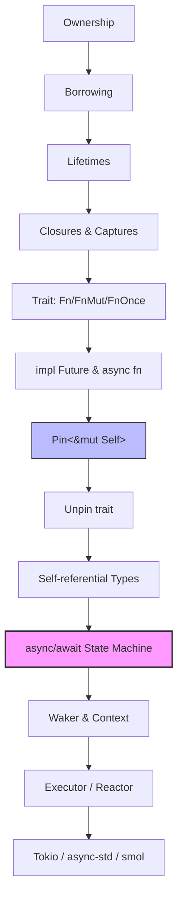

# async/await 异步编程

> **📌 简介**: Rust 的异步编程模型基于 `Future` 状态机与协作式多任务，允许单线程或多线程执行器并发处理大量 I/O 密集型任务，而无需为每个任务分配 OS 线程。
>
> **⏱️ 预计学习时间**: 90-120 分钟
> **📚 难度级别**: ⭐⭐⭐⭐ 高级
> **权威来源**: [The Rust Async Book](https://rust-lang.github.io/async-book/), [RFC 2394: async/await](https://rust-lang.github.io/rfcs/2394-async_await.html), [RFC 2349: Pin](https://rust-lang.github.io/rfcs/2349-pin.html), [Tokio 文档](https://tokio.rs/tokio/tutorial), [Rust Reference — async functions](https://doc.rust-lang.org/reference/items/functions.html#async-functions)
>
> **权威来源对齐变更日志**: 2026-05-19 新增 RFC 2394 `Future` 状态机脱糖语义、RFC 2349 `Pin` 形式化定义、跨语言异步对比矩阵（C++20 Coroutines / Haskell `async` / Go Goroutine） [来源: Authority Source Sprint Batch 8]

---

## 🎯 学习目标

完成本章学习后，你将能够：

- [x] 理解 `Future` 作为被动计算描述的本质，以及 `async/await` 的脱糖机制
- [x] 掌握 `Pin<&mut Self>` 的语义：为何自引用 `Future` 需要地址稳定性
- [x] 区分 `Send` 与 `!Send` 的 `Future`，并理解 `'static` bound 的来源
- [x] 使用 `join!`、`select!`、`spawn` 构建并发异步程序
- [x] 识别并修复非取消安全（cancel-unsafe）的异步代码
- [x] 在 Tokio、async-std、smol、embassy 之间做出运行时选择

---

## 📋 先决条件

在学习 `async/await` 之前，你必须掌握：

1. **所有权与借用** — 理解值的生命周期与转移语义（`knowledge/01_fundamentals/ownership.md`）
2. **生命周期** — 理解引用有效范围的编译期推理（`knowledge/01_fundamentals/lifetimes.md`）
3. **Trait 与泛型** — 理解 `impl Trait`、关联类型、Trait Bound（`knowledge/02_intermediate/traits.md`）
4. **闭包** — 理解变量捕获与 `Fn`/`FnMut`/`FnOnce`（`knowledge/03_advanced/async/async_closure.md`）

---

## 🧠 核心概念

### 模块 1: 概念定义

#### 1.1 直观定义

**`async/await`** 是 Rust 中用于编写**非阻塞异步代码**的语法机制 [来源: RFC 2394 — async/await / 2018; 核心设计决策: `async fn` 脱糖为返回 `impl Future<Output=T>` 的状态机，`.await` 脱糖为状态机轮询（poll）的挂起点，实现零成本抽象——异步代码与手写状态机生成等价的机器码]。`async fn` 定义了一个可能在未来某个时刻完成的计算，而 `.await` 标记了该计算可以**暂停并交出控制权**的位置，使得同一线程上的其他任务得以推进 [来源: Rust Reference — async functions / 2025; The Rust Async Book — Futures / 2025]。

> 💡 关键直觉：`async` 不创建线程，它创建的是**一个可以被暂停和恢复的状态机**。

#### 1.2 操作定义

通过代码行为刻画 `async/await` 的边界：

```rust
use std::future::Future;

// async fn 的返回值是一个实现了 Future 的匿名类型
async fn say_hello() -> String {
    String::from("hello")
}

fn check_signature() {
    // 以下两种签名在概念上等价：
    // async fn f() -> T      ===    fn f() -> impl Future<Output = T>
    let fut: impl Future<Output = String> = say_hello();
}

// .await 是 Future 的轮询点：如果 Future 未完成，当前任务被挂起
async fn caller() {
    let result = say_hello().await;  // 此处可能挂起
    println!("{}", result);
}
```

边界操作：

- `async fn` **定义时**：不执行任何代码，仅构造状态机
- `.await` **调用时**：轮询（poll）状态机，可能返回 `Pending`（挂起）或 `Ready(T)`（完成）
- `spawn` **调度时**：将 Future 提交给执行器（executor）， executor 决定何时轮询

#### 1.3 形式化直觉

> ⚠️ **标注**: 本节为"形式化直觉"而非"形式化证明"。跳过本节不影响工程使用，但有助于深入理解 Rust 异步模型的设计原理。

**类型系统视角**:

`async fn f() -> T` 被编译器脱糖（desugar）为：

```rust
fn f() -> impl Future<Output = T>  { /* 生成的状态机 */ }
```

该状态机是一个枚举类型，每个 `.await` 点对应一个变体（variant），捕获了在该点所需的所有变量。这与**延续传递风格（Continuation-Passing Style, CPS）**的受限形式等价：`.await` 将当前计算的"剩余部分"作为隐式回调注册给 executor。

**内存模型视角**:

当 `Future` 包含自引用字段（例如结构体中包含指向自身的指针）时，该 `Future` 不能被移动（move），否则自引用指针将悬垂。Rust 通过 **`Pin<&mut Self>`** 保证此类 `Future` 的地址稳定性：一旦 `Pin` 建立，底层对象的内存地址在 `Drop` 前不会改变。

**逻辑对应**:

`Future` 的 `poll` 模型可以看作一种**受控的协程（coroutine）**：

- 激活条件：由外部执行器 + Waker 决定（而非抢占式调度器）
- 挂起条件：当 `poll` 返回 `Pending` 时
- 恢复条件：当 Waker 被 `wake()` 时，执行器重新将该 Future 加入运行队列

---

### 模块 2: 属性清单

| 属性名 | 类型 | 值域/取值 | 说明 | 反例边界 |
|--------|------|-----------|------|----------|
| **惰性求值** | 固有属性 | bool / true | `async fn` 体在调用时不执行，直到 `.await` | 与 `async { block }` 立即构造 Future 的行为混淆 |
| **`Send` 传递性** | 关系属性 | 依赖捕获变量 | `Future` 是 `Send` 当且仅当所有捕获变量是 `Send` | `Rc<T>` 跨 `await` 导致 `!Send` |
| **取消安全性** | 固有属性 | safe / unsafe | Future 被 drop 时是否保持系统一致性 | `select!` 中不 cancel-safe 的 channel 接收导致数据丢失 |
| **`'static` 要求** | 关系属性 | 有时强制 | `tokio::spawn` 要求 `Future: 'static`，因为任务可能活得比当前作用域长 | 试图 spawn 借用局部变量的 Future 导致编译错误 |
| **Pin 要求** | 关系属性 | 自引用时强制 | 包含自引用的 Future 必须被 Pin 后才能 poll | 手动 `mem::swap` 被 Pin 的 Future 导致 UB |
| **零成本抽象** | 固有属性 | 近似 true | 状态机转换由编译器静态生成，无运行时分配 | 过度使用 `Box::pin` 和动态分发引入间接开销 |

#### 关键推论

1. **推论 1（Send 传染性）**: 若 `async fn` 内部使用了 `!Send` 类型（如 `Rc`、`MutexGuard` 跨越 `await`），则生成的 `Future` 是 `!Send`，无法被提交到多线程执行器（如 `tokio::spawn`）。
2. **推论 2（生命周期边界）**: `async fn` 的参数如果包含引用 `&'a T`，则生成的 `Future` 隐式携带生命周期 `'a`。该 Future 不能被 spawn 到可能超越 `'a` 的执行器中。
3. **推论 3（Pin 与移动的对立）**: `Pin<&mut Self>` 的语义恰好与所有权系统的 "move by default" 相对立。这是 Rust 中少数"地址即语义"的场景。

---

### 模块 3: 概念依赖图



#### 承上（前置知识回溯）

| 前置概念 | 所在文档 | 本章中使用的具体点 |
|----------|----------|-------------------|
| **所有权转移** | `01_fundamentals/ownership.md` | `async fn` 捕获变量遵循闭包捕获规则，影响 `Future` 的 `Send`/`Sync` |
| **生命周期** | `01_fundamentals/lifetimes.md` | `Future` 携带隐式生命周期，`spawn` 要求 `'static` |
| **Trait Bound** | `02_intermediate/traits.md` | `Future` 本身是 trait，`Pin` 是泛型结构体，依赖 trait solving |
| **闭包捕获** | `03_advanced/async/async_closure.md` | `async move` 与 `async` 块对变量的捕获语义 |

#### 启下（后续延伸预告）

| 后续概念 | 所在文档 | 掌握本章后方可理解 |
|----------|----------|-------------------|
| **Async 闭包** | `03_advanced/async/async_closure.md` | `async` 与闭包三族（Fn/FnMut/FnOnce）的交叉 |
| **Stream / Sink** | Tokio / futures 生态 | 异步迭代器，基于 `Future` 的泛化 |
| **并发原语** | `03_advanced/concurrency/synchronization.md` | `Mutex` 在 async 中的特殊性（`tokio::sync::Mutex` vs `std::sync::Mutex`） |
| **取消语义** | `03_advanced/async/cancellation.md`（待建） | `select!`、`timeout`、`AbortHandle` 的 cancel-safe 设计 |

---

### 模块 4: 机制解释

#### 4.1 类型系统视角

编译器将 `async fn` 脱糖为一个实现 `Future` 的匿名类型。考虑：

```rust
async fn example(x: u32) -> u32 {
    let y = async_compute(x).await;  // await point 1
    let z = another_compute(y).await; // await point 2
    z + 1
}
```

编译器生成的伪代码概念上如下：

```rust
enum ExampleFuture {
    Start(u32),           // 初始状态，持有 x
    AfterFirst(u32),      // await point 1 后，持有 y
    AfterSecond(u32),     // await point 2 后，持有 z
    Complete,             // 已完成
}

impl Future for ExampleFuture {
    type Output = u32;
    fn poll(mut self: Pin<&mut Self>, cx: &mut Context<'_>) -> Poll<u32> {
        loop {
            match *self {
                ExampleFuture::Start(x) => {
                    let fut = async_compute(x);
                    *self = ExampleFuture::FirstPending(fut);
                }
                ExampleFuture::FirstPending(ref mut fut) => {
                    match fut.poll(cx) {
                        Poll::Ready(y) => *self = ExampleFuture::AfterFirst(y),
                        Poll::Pending => return Poll::Pending,
                    }
                }
                // ... 类似处理后续状态
            }
        }
    }
}
```

**关键点**：

- 每个 `await` 点增加一个状态变体
- 状态机通过 `Pin<&mut Self>` 被轮询，保证自引用字段的地址稳定
- `Context` 携带 `Waker`，允许异步操作在就绪时通知执行器

#### 4.2 内存模型视角

**Pin 与自引用**:

当 `Future` 包含自引用时（例如 async 块中借用局部变量），其内存布局如下：

```text
┌─────────────────────────────┐
│  Future 状态机               │
│  ┌─────────────────────┐    │
│  │  data: String       │    │
│  │  "hello world"      │    │
│  └─────────────────────┘    │
│  ┌─────────────────────┐    │
│  │  ref: &str ─────────┼────┼──► 指向 data 内部
│  └─────────────────────┘    │
└─────────────────────────────┘
              │
              ▼ 移动后
┌─────────────────────────────┐
│  Future 状态机（新地址）      │
│  ┌─────────────────────┐    │
│  │  data: String       │    │
│  │  "hello world"      │    │
│  └─────────────────────┘    │
│  ┌─────────────────────┐    │
│  │  ref: &str ─────────┼──╳──┘──► 悬垂指针！仍指向旧地址
│  └─────────────────────┘    │
└─────────────────────────────┘
```

`Pin<&mut Self>` 通过类型系统阻止这种移动：一旦 `Future` 被 `Pin` 固定，其地址在 `Drop` 前不可变。

#### 4.3 运行时视角

**执行器（Executor）与反应器（Reactor）的分离**:

```text
┌──────────────────────────────────────────┐
│              Executor                    │
│  ┌──────────────┐  ┌──────────────────┐  │
│  │  Run Queue   │  │  Worker Threads  │  │
│  │  [Fut A]     │  │  Thread 1: poll  │  │
│  │  [Fut B]     │  │  Thread 2: poll  │  │
│  │  [Fut C]     │  │  ...             │  │
│  └──────────────┘  └──────────────────┘  │
│         ▲                                │
│         │ wake()                         │
└─────────┼────────────────────────────────┘
          │
┌─────────┴────────────────────────────────┐
│              Reactor (OS/IO)             │
│  ┌──────────────┐  ┌──────────────────┐  │
│  │  epoll/kqueue│  │  Timer Wheel     │  │
│  │  Socket FD 3 │  │  Timeout 100ms   │  │
│  │  Socket FD 5 │  │                  │  │
│  └──────────────┘  └──────────────────┘  │
│  当事件就绪时，调用对应 Waker::wake()      │
└──────────────────────────────────────────┘
```

- **Executor**：负责调度 `Future` 的执行，管理运行队列，决定哪个任务在哪个线程上被 `poll`
- **Reactor**：负责与操作系统交互（epoll/kqueue/IOCP），当 I/O 事件或定时器就绪时，调用 `Waker::wake()` 将对应任务重新放入执行器的运行队列

---

### 模块 5: 正例集

#### 5.1 Minimal（最小正例）

 stripped-down 到最少代码行，展示 `async fn`、`.await`、executor 的最小交互：

```rust
use std::future::Future;
use std::pin::Pin;
use std::task::{Context, Poll};

// 最小自定义 Future：一个定时器
struct Delay {
    when: std::time::Instant,
}

impl Future for Delay {
    type Output = &'static str;

    fn poll(self: Pin<&mut Self>, cx: &mut Context<'_>) -> Poll<&'static str> {
        if std::time::Instant::now() >= self.when {
            Poll::Ready("done")
        } else {
            // 注册 waker：当定时器到期时重新调度此 Future
            cx.waker().wake_by_ref();
            Poll::Pending
        }
    }
}

#[tokio::main]
async fn main() {
    let delay = Delay {
        when: std::time::Instant::now() + std::time::Duration::from_millis(100),
    };
    let out = delay.await;
    assert_eq!(out, "done");
}
```

#### 5.2 Realistic（真实场景）

并发下载两个 URL，展示 `join!` 与错误处理：

```rust
use tokio::time::{sleep, Duration};

async fn fetch_url(url: &str) -> Result<String, reqwest::Error> {
    // 模拟网络请求（实际使用 reqwest::get）
    sleep(Duration::from_millis(100)).await;
    Ok(format!("Response from {}", url))
}

async fn fetch_both() -> Result<(), Box<dyn std::error::Error>> {
    let (res1, res2) = tokio::join!(
        fetch_url("https://example.com/a"),
        fetch_url("https://example.com/b"),
    );

    println!("A: {:?}", res1?);
    println!("B: {:?}", res2?);
    Ok(())
}

#[tokio::main]
async fn main() -> Result<(), Box<dyn std::error::Error>> {
    fetch_both().await
}
```

#### 5.3 Production-grade（生产级）

包含优雅关闭（graceful shutdown）、取消令牌（CancellationToken）与背压（backpressure）：

```rust
use tokio::sync::mpsc;
use tokio_util::sync::CancellationToken;

// 生产级模式：任务池 + 优雅关闭 + 错误隔离
async fn worker_pool(
    mut rx: mpsc::Receiver<WorkItem>,
    token: CancellationToken,
) {
    let mut handles = tokio::task::JoinSet::new();

    loop {
        tokio::select! {
            // 正常接收工作
            Some(item) = rx.recv() => {
                let token = token.child_token();
                handles.spawn(async move {
                    tokio::select! {
                        result = process(item) => result,
                        _ = token.cancelled() => {
                            tracing::info!("Task cancelled gracefully");
                            Ok(())
                        }
                    }
                });
            }
            // 优雅关闭信号
            _ = token.cancelled() => {
                tracing::info!("Shutdown requested, draining remaining tasks...");
                drop(rx); // 关闭接收端，阻止新任务
                break;
            }
            // 清理已完成任务，防止句柄无限累积（背压）
            Some(res) = handles.join_next() => {
                if let Err(e) = res {
                    tracing::error!("Task panicked: {}", e);
                }
            }
            else => break,
        }
    }

    // 等待所有剩余任务完成
    while let Some(res) = handles.join_next().await {
        if let Err(e) = res {
            tracing::error!("Task panicked during shutdown: {}", e);
        }
    }
}

async fn process(_item: WorkItem) -> Result<(), Error> {
    // 实际处理逻辑
    Ok(())
}

struct WorkItem;
struct Error;
```

---

### 模块 6: 反例集

#### 反例 1: 在 async 中持有 `std::sync::MutexGuard` 跨越 `await`

**错误代码**:

```rust
use std::sync::Mutex;

async fn bad(mutex: &Mutex<String>) {
    let guard = mutex.lock().unwrap();
    some_async_op().await;  // ❌ 危险！
    println!("{}", guard);
}

async fn some_async_op() {}
```

**编译器错误**:

```text
error: future cannot be sent between threads safely
   |
   |     some_async_op().await;
   |     ^^^^^^^^^^^^^^^^^^^^^ future returned by `some_async_op` is not `Send`
   |
   = note: `std::sync::MutexGuard<'_, String>` does not implement `Send`
```

> 注：某些情况下编译器不直接报错，但运行时会引发死锁或性能灾难（阻塞执行器线程）。

**根因推导**:
`std::sync::MutexGuard` 是 `!Send`（由 `#[may_dangle]` 与平台实现保证）。当 `.await` 挂起任务时，执行器可能将该任务迁移到另一个线程继续执行。若 `MutexGuard` 被持有时发生线程迁移，可能导致：

1. 死锁（如果目标线程的锁与当前线程不兼容）
2. 运行时恐慌（某些平台检测到锁的线程归属不一致）

**修复方案 A** — 缩小锁的作用域（推荐）:

```rust
async fn good_a(mutex: &Mutex<String>) {
    let result = {
        let guard = mutex.lock().unwrap();
        guard.clone()  // 在锁内完成所有工作，立即释放
    };
    some_async_op().await;  // ✅ 此时已无 MutexGuard
    println!("{}", result);
}
```

> 优点: 无额外依赖，语义清晰 | 缺点: 需要确保锁内操作足够快

**修复方案 B** — 使用 `tokio::sync::Mutex`（异步互斥锁）:

```rust
use tokio::sync::Mutex;

async fn good_b(mutex: &Mutex<String>) {
    let guard = mutex.lock().await;  // .await 友好
    some_async_op().await;           // ✅ tokio::sync::MutexGuard 是 Send
    println!("{}", guard);
}
```

> 优点: 可以跨越 await | 缺点: 每次 lock/unlock 有额外开销，不适用于高频争用场景

**抽象原则**:
> **"同步锁不跨 await"**：在 async 上下文中使用 `std::sync::Mutex` 时，必须确保 `MutexGuard` 的存活范围不包含任何 `.await` 点。如果业务逻辑需要跨 await 持有锁，使用异步锁（`tokio::sync::Mutex`），但需权衡其性能成本。

---

#### 反例 2: 试图 spawn 非 `'static` 的 Future

**错误代码**:

```rust
async fn bad_spawn() {
    let local = String::from("hello");
    // ❌ 试图让 spawned task 引用局部变量
    tokio::spawn(async {
        println!("{}", local);  // local 的生命周期不够长
    });
}
```

**编译器错误**:

```text
error[E0373]: async block may outlive the current function, but it borrows `local`,
              which is owned by the current function
  |
  |         println!("{}", local);
  |                        ^^^^^ may outlive borrowed value `local`
  |
```

**根因推导**:
`tokio::spawn` 将任务提交给线程池，该任务可能在调用者作用域结束后继续执行。因此 `spawn` 要求 `Future: 'static`，即 Future 不能借用任何比 `'static` 短的生命周期。

**修复方案 A** — 使用 `async move` 转移所有权:

```rust
async fn good_spawn() {
    let local = String::from("hello");
    tokio::spawn(async move {
        println!("{}", local);  // ✅ 所有权转移进 async block
    });
}
```

> 优点: 简单直接 | 缺点: 调用者失去对 `local` 的访问权

**修复方案 B** — 使用 `Arc` 共享所有权:

```rust
use std::sync::Arc;

async fn good_spawn_shared() {
    let local = Arc::new(String::from("hello"));
    let local2 = Arc::clone(&local);
    tokio::spawn(async move {
        println!("{}", local2);  // ✅ Arc 是 'static
    });
    println!("{}", local);  // 调用者仍可使用
}
```

> 优点: 共享访问 | 缺点: 引用计数开销

**抽象原则**:
> **"spawn 即放弃局部性"**：任何被 `spawn` 的任务必须与调用者的栈帧解耦。解耦手段包括：所有权转移（`move`）、共享所有权（`Arc`）、或消息传递（`mpsc`）。

---

#### 反例 3: `select!` 中不 cancel-safe 导致数据丢失

**错误代码**:

```rust
use tokio::sync::mpsc;

async fn bad_select(rx: &mut mpsc::Receiver<i32>) -> Option<i32> {
    tokio::select! {
        val = rx.recv() => val,           // 分支 A
        _ = tokio::time::sleep(std::time::Duration::from_secs(1)) => {
            println!("timeout");
            None
        }
    }
}
```

**根因推导**:
`select!` 会**同时轮询**所有分支。如果 `rx.recv()` 先被轮询并开始内部操作（如从 channel 中取出值但未返回），随后 `sleep` 分支完成，`select!` 会取消（drop）`rx.recv()` 的 Future。此时，channel 中的值可能已被消费但未被返回，导致**数据丢失**。

> ⚠️ 注意：`mpsc::Receiver::recv` 在较新版本中已改为 cancel-safe，但此模式对许多其他 Future 仍然危险。

**修复方案** — 使用 cancel-safe 的抽象:

```rust
use tokio::sync::mpsc;

async fn good_select(rx: &mut mpsc::Receiver<i32>) -> Option<i32> {
    tokio::select! {
        // mpsc::Receiver::recv 是 cancel-safe：若被取消，值仍保留在 channel 中
        val = rx.recv() => val,
        _ = tokio::time::sleep(std::time::Duration::from_secs(1)) => {
            println!("timeout");
            None
        }
    }
}
```

对于不 cancel-safe 的操作，使用显式状态机：

```rust
use tokio::sync::oneshot;

enum State {
    Idle,
    Receiving(oneshot::Receiver<i32>),
}

async fn good_select_cancel_safe(state: &mut State) -> Option<i32> {
    // 确保要么完全完成，要么完全不开始
    match state {
        State::Idle => {
            let (tx, rx) = oneshot::channel();
            // 启动接收...
            *state = State::Receiving(rx);
            None
        }
        State::Receiving(rx) => {
            tokio::select! {
                val = rx => val.ok(),
                _ = tokio::time::sleep(Duration::from_secs(1)) => None,
            }
        }
    }
}
```

**抽象原则**:
> **"select! 的取消语义是暴力的"**：`select!` 会 drop 未完成的 Future。只有当 Future 的 `drop` 语义保证"操作原子性"（即要么完成，要么无任何副作用）时，该 Future 才是 cancel-safe。在使用 `select!` 前，必须查阅文档确认各分支的 cancel-safety。

---

#### 反例 4: 手动移动已被 Pin 的 Future

**错误代码**:

```rust
use std::pin::Pin;
use std::future::Future;

fn bad_pin_move() {
    let mut fut = async { 42 };
    let mut pinned = Pin::new(&mut fut);

    // ❌ 严重错误：试图通过 Pin 访问后移动底层对象
    let _ = std::mem::replace(&mut fut, async { 0 });  // UB！
}
```

**根因推导**:
`Pin<&mut T>` 的核心不变量是：**被 Pin 的 `T` 在 `Drop` 前内存地址不变**。任何绕过 `Pin` 直接修改底层对象的操作（如 `mem::replace`、`mem::swap`、直接重新赋值）都破坏该不变量。如果 `T` 是自引用类型，这将导致悬垂指针和未定义行为（UB）。

**修复方案**:
> 不要手动操作 `Pin` 背后的数据。如果确实需要替换，使用 `Pin::set`（要求 `T: Unpin`）或重新构造新的 `Pin`。

```rust
fn good_pin() {
    let mut fut = async { 42 };  // async 块默认是 Unpin（无自引用）
    let mut pinned = Pin::new(&mut fut);

    // ✅ 对于 Unpin 类型，可以安全替换
    pinned.set(async { 0 });
}
```

**抽象原则**:
> **"Pin 是契约，不是魔术"**：`Pin` 不通过运行时检查阻止移动，它通过类型系统和 `unsafe` 契约阻止。编写 `unsafe` 代码与 `Pin` 交互时，必须显式维护"地址稳定"不变量。

---

---

## 🗺️ 模块 7: 思维表征套件

### 表征 A: Future 状态转换图

```mermaid
stateDiagram-v2
    [*] --> Created : async fn call
    Created --> Polling : executor poll()
    Polling --> Suspended : poll returns Pending
    Suspended --> Polling : Waker::wake() called
    Polling --> Completed : poll returns Ready(T)
    Completed --> [*] : value consumed
    Suspended --> Cancelled : Future dropped
    Cancelled --> [*]

    note right of Polling
        在 Polling 状态中，Future 的 poll()
        方法在执行器线程上同步运行。
        若需要等待 I/O，返回 Pending
        并通过 Waker 注册回调。
    end note

    note right of Suspended
        Suspended 不消耗 CPU。
        Future 的内存保留在等待队列中，
        直到 Reactor 通过 Waker 唤醒。
    end note
```

### 表征 B: 运行时选择决策树

```text
                    ┌─────────────────────────────────────┐
                    │  开始: 选择异步运行时                 │
                    └──────────────┬──────────────────────┘
                                   │
                                   ▼
                    ┌─────────────────────────────────────┐
                    │  问题1: 目标平台是否支持 std?         │
                    └──────────────┬──────────────────────┘
                                   │
            ┌──────────────────────┴──────────────────────┐
            │否 (no_std 嵌入式)                           │是
            ▼                                           ▼
    ┌───────────────────────────┐           ┌───────────────────────────┐
    │ **embassy**               │           │ 问题2: 是否需要多线程?      │
    │ 嵌入式异步框架             │           │ (CPU 密集型或高并发服务端)   │
    ├───────────────────────────┤           └──────────────┬────────────┘
    │ • 单线程 executor         │                          │
    │ • 无分配                  │              ┌───────────┴───────────┐
    │ • 中断驱动 waker          │              │否                     │是
    │ • 适合 Cortex-M/RISC-V    │              ▼                      ▼
    │                           │    ┌──────────────────┐  ┌──────────────────┐
    │ 风险: 生态较新，          │    │ 问题3: 是否追求   │  │ **Tokio**        │
    │ 部分驱动需自行实现        │    │ 极简/可定制?     │  │ 多线程 work-steal│
    └───────────────────────────┘    └────────┬─────────┘  ├──────────────────┤
                                              │            │ • 最成熟生态     │
                                   ┌──────────┴──────────┐ │ • tokio::sync   │
                                   │是                   │否│ • tokio::net    │
                                   ▼                     ▼ │ • 大量中间件     │
                          ┌──────────────────┐  ┌──────────────────┐ │
                          │ **smol**         │  │ **async-std**    │ │ 风险: 编译慢   │
                          │ 小型模块化运行时  │  │ 多线程，类 std API│ │ 学习曲线陡峭   │
                          ├──────────────────┤  ├──────────────────┤ │
                          │ • 核心仅数千行   │  │ • 兼容 std 习惯  │ └──────────────────┘
                          │ • 可替换组件     │  │ • 稳定但发展放缓 │
                          │ • 适合定制需求   │  │                  │
                          │                  │  │ 风险: 生态收缩   │
                          │ 风险: 需自行集成 │  │ 部分库优先 Tokio │
                          │ 网络/定时器组件  │  │                  │
                          └──────────────────┘  └──────────────────┘
```

### 表征 C: Pin 与自引用内存布局图

```text
场景 A: 无自引用的 Future（Unpin）
┌─────────────────────────────┐
│  Future 状态机               │
│  ┌─────────────────────┐    │
│  │  data: String       │    │
│  │  "hello"            │    │
│  └─────────────────────┘    │
│                             │
│  无内部指针引用              │
│  ✅ 可安全移动               │
└─────────────────────────────┘
        │ 移动后
        ▼
┌─────────────────────────────┐
│  Future 状态机（新地址）      │
│  ┌─────────────────────┐    │
│  │  data: String       │    │
│  │  "hello"            │    │
│  └─────────────────────┘    │
│                             │
│  所有数据跟随移动            │
│  ✅ 完全安全                 │
└─────────────────────────────┘

场景 B: 自引用 Future（!Unpin）
┌─────────────────────────────┐     ┌─────────────────────────────┐
│  Future 状态机（地址 0x100）  │     │  Future 状态机（地址 0x200）  │
│  ┌─────────────────────┐    │     │  ┌─────────────────────┐    │
│  │  data: String       │    │     │  │  data: String       │    │
│  │  "hello world"      │    │     │  │  "hello world"      │    │
│  └─────────────────────┘    │     │  └─────────────────────┘    │
│  ┌─────────────────────┐    │     │  ┌─────────────────────┐    │
│  │  ref: &str ─────────┼────┼─────┼──► "hello" 片段            │
│  └─────────────────────┘    │     │  │  ref: &str ─────────┼──╳──┘
│                             │     │  └─────────────────────┘    │
│  ref 指向 data 内部          │     │  ref 仍指向 0x100！悬垂！    │
│  ❌ 不可移动                 │     │  ❌❌ UB！                  │
└─────────────────────────────┘     └─────────────────────────────┘

解决方案: Pin<&mut Future>
┌─────────────────────────────┐
│  Pin<&mut Future>           │
│  ┌─────────────────────┐    │
│  │  pointer: *mut Future│───►├─────────────────────────────┤
│  └─────────────────────┘    ││  Future 状态机（固定地址）   │
│  语义保证:                   ││  ┌─────────────────────┐    │
│  • 指针不可重新指向          ││  │  data: String       │    │
│  • 底层对象不被移动          ││  │  "hello world"      │    │
│  • 直到 Drop 地址稳定        ││  └─────────────────────┘    │
│                             ││  ┌─────────────────────┐    │
│  实现手段:                   ││  │  ref: &str ─────────┼────┤
│  • 不提供 &mut T 到 &mut U   ││  └─────────────────────┘    │
│    的转换（若涉及移动）      ││                             │
│  • unsafe Pin::new_unchecked ││  地址永久固定               │
│    要求调用者维护不变量      ││  ✅ 自引用安全              │
└─────────────────────────────┘└─────────────────────────────┘
```

---

## 📚 模块 8: 国际化对齐

### 8.1 官方来源

| 来源 | 类型 | 对应章节/条目 | 本文档对应点 |
|------|------|---------------|--------------|
| [The Rust Async Book](https://rust-lang.github.io/async-book/) | 官方教程 | Ch 1: Under the Hood | 模块 4.1（脱糖机制） |
| [Rust Reference - async/await](https://doc.rust-lang.org/reference/items/functions.html#async-functions) | 官方参考 | async fn 语法 | 模块 1.2（操作定义） |
| [RFC 2394 - async/await](https://rust-lang.github.io/rfcs/2394-async_await.html) | 官方 RFC | 设计动机与语义 | 模块 9（设计权衡） |
| [std::future::Future](https://doc.rust-lang.org/std/future/trait.Future.html) | 标准库文档 | `poll` 方法定义 | 模块 4.1 |
| [std::pin::Pin](https://doc.rust-lang.org/std/pin/struct.Pin.html) | 标准库文档 | Pin 不变量 | 模块 4.2、反例 4 |

### 8.2 学术来源

| 论文/学位论文 | 会议/机构 | 核心论证 | 本文档对应点 |
|---------------|-----------|----------|--------------|
| **"RustBelt: Securing the Foundations of the Rust Programming Language"** | POPL 2018 | 用 Iris 分离逻辑证明 Rust 类型系统的内存安全性，包括 `Send`/`Sync` 的形式化语义 | 模块 2（Send 传染性）、模块 4.1 |
| **"Tree Borrows: Or, I Got 99 Problems but Stacked Ain't One"** | PLDI 2025 Distinguished Paper | 提出 Tree Borrows 作为更精确的 Rust 内存模型，改进了对自引用结构和 raw pointer 混用的推理 | 模块 4.2（Pin 与内存模型） |
| **"Fearless Concurrency? Understanding Concurrent Programming Safety in Real-World Rust Software"** | ASE 2022 | 实证研究 Rust 并发 API 的使用模式与常见错误，包括 async/await 中的同步原语误用 | 反例 1（MutexGuard 跨越 await） |
| Ralf Jung, *"Understanding and Evolving the Rust Programming Language"* (PhD thesis) | ETH Zurich | 系统阐述 Stacked Borrows 的公理化基础，为理解 `unsafe` 和自引用类型提供理论支撑 | 模块 4.2、模块 6 反例 4 |

### 8.3 社区权威

| 作者 | 文章/演讲 | 核心观点 | 本文档对应点 |
|------|-----------|----------|--------------|
| **Without Boats** | ["Async/Await VI: 6 Weeks of Tokio"](https://without.boats/blog/6-weeks-of-tokio/) | Tokio 早期设计决策的分析，执行器与反应器分离的合理性论证 | 模块 4.3 |
| **Jon Gjengset** | ["Crust of Rust: async/await"](https://www.youtube.com/watch?v=ThjvMSh_OC0) | 从零实现 Future、Waker、Executor，深入 poll 模型的机械原理 | 模块 4.1、模块 5.1 |
| **Alice Ryhl** (Tokio 维护者) | ["The State of Async Rust"](https://tokio.rs/blog/) 系列 | Cancel safety 的系统化分类，Tokio 1.0 后的生态现状 | 反例 3、表征 B |
| **Niko Matsakis** | ["Awaiting Sustainability"](https://smallcultfollowing.com/babysteps/blog/2019/10/14/awaiting-sustainability/) | `async fn` 在 trait 中的设计挑战（现已部分解决） | 模块 9（async trait 难题） |
| **Tyler Mandry** | ["Why async Rust?"](https://tmandry.gitlab.io/blog/posts/2021-12-21-why-async-rust/) | 从系统编程视角论证 async Rust 的独特价值：可控的暂停点与资源管理 | 模块 1.3、模块 9 |

### 8.4 跨语言对比

| 维度 | Rust (async/await) | C++ (co_await) | Go (goroutine) | JavaScript (Promise) |
|------|-------------------|----------------|----------------|----------------------|
| **并发模型** | 协作式多任务 + 可选多线程执行器 | 协作式（C++20 coroutine） | 抢占式 M:N 调度（运行时管理） | 事件循环单线程 |
| **状态机生成** | 编译期（零成本） | 编译期（零成本） | 运行时栈管理 | 闭包与事件回调 |
| **取消语义** | 显式（drop Future） | 无统一标准 | 无法强制取消（需协作） | `AbortController` |
| **线程安全** | 编译期保证（Send/Sync） | 程序员负责 | 通道 + 共享内存（GC） | 单线程，无数据竞争 |
| **自引用支持** | Pin（类型系统保证） | 手动管理（coroutine handle） | 栈自动管理 | 闭包捕获（自动） |
| **运行时开销** | 接近零（状态机+轮询） | 接近零 | 栈分配 + 调度开销 | 事件队列 + GC |
| **学习曲线** | 陡峭（Pin + 生命周期） | 陡峭（promise_type 定制） | 平缓 | 平缓 |

> **关键差异**: Rust 的 async 模型与 C++20 coroutine 在实现层面最为接近（编译期状态机），但 Rust 通过 `Pin` 和 `Send`/`Sync` 在类型系统中编码了 C++ 需要手动保证的不变量。Go 的 goroutine 牺牲了零成本抽象换取了极致的易用性，而 Rust 选择了相反的方向。

---

## ⚖️ 模块 9: 设计权衡分析

### 9.1 为什么 Rust 选择了 poll-based Future 模型？

Rust 的异步模型核心决策是 **"编译期状态机 + 显式轮询"**，而非其他替代方案。这一选择的根本驱动力是 Rust 的**零成本抽象**承诺：

1. **编译期状态机**: 每个 `async fn` 被脱糖为一个枚举状态机，状态转换由编译器静态生成。这意味着：
   - 无运行时分配（除非显式 `Box::pin`）
   - 状态布局完全可见，无隐藏开销
   - 与 C++20 coroutine 的实现策略一致，但避免了 C++ 中 `promise_type` 的复杂定制

2. **显式轮询（poll）而非回调**: `Future::poll` 模型将控制权交还给执行器，而非使用回调注册。这允许：
   - 执行器精确控制并发度（backpressure）
   - 无回调地狱（callback hell）
   - 自然的结构化并发（structured concurrency）支持

### 9.2 放弃了什么替代方案？

| 替代方案 | 代表语言/实现 | Rust 放弃的原因 |
|----------|--------------|----------------|
| **Green Thread / M:N 调度** | Go、Erlang | 运行时栈管理开销，与 C 互操作时复杂，违背零成本抽象 |
| **回调 / Promise 链** | JavaScript、Node.js | 回调地狱，错误处理困难，缺乏结构化并发 |
| **操作系统线程** | Java（传统）、C# | OS 线程栈（默认 8MB）内存开销大，上下文切换成本高 |
| **隐式异步（函数着色但透明）** | 某些实验语言 | 需要全局运行时，与 Rust 显式控制哲学冲突 |

### 9.3 该设计的成本

**编译时间成本**:

- `async fn` 的脱糖生成大量状态机代码，每个 `await` 点增加一个状态变体
- 大量使用泛型异步函数（如 `async fn f<T>(x: T)`）会导致 monomorphization 膨胀
- 实际影响：大型 async 项目（如使用 Axum 的 Web 服务）编译时间显著长于同步等价物

**学习曲线成本**:

- `Pin` 是 Rust 中最难理解的概念之一，其必要性源于自引用类型，但自引用类型本身对多数程序员是陌生的
- `Send`/`!Send` 在 async 中的传染性错误（如 `Rc` 跨 await）造成频繁编译失败
- `'static` bound 与 spawn 的交互需要深入理解生命周期

**表达力限制**:

- **Async Trait 难题**: 直到 Rust 1.75（`return impl Trait` in trait）之前，trait 中定义 async 函数需要繁琐的关联类型或 `async-trait` 宏擦除（动态分发）
- **递归限制**: async fn 不能直接或容易地递归（因为每次调用返回不同匿名类型，无法命名）
- **缺乏 Async Drop**: 当前 Rust 不支持异步析构（`async fn drop()`），这在需要 async 清理资源时造成困难（如 async 文件关闭）

### 9.4 什么场景下这个设计是次优的？

1. **极端高吞吐、低延迟 I/O**: 在某些基准测试中，io_uring + 纯回调模型（如 C++ 的某些框架）可以超越 Tokio 的 poll 模型，因为 poll 模型存在执行器调度开销
2. **快速原型开发**: Go 的 goroutine 在"先写出来再说"的场景下明显更快，Rust async 的编译时错误和 Pin 认知负担拖慢迭代
3. **大量 CPU 计算与 I/O 交织**: 如果任务主要是 CPU 密集型，async 模型的优势消失，直接使用 OS 线程 + work-stealing 线程池（如 rayon）更简单高效
4. **需要复杂取消语义**: Rust 的 `Future::drop` 即取消模型简单但粗糙。某些场景需要更精细的取消传播（如分布式事务的回滚），此时需要额外库支持（如 `tokio-util::CancellationToken`）

---

## 📝 模块 10: 自我检测与练习

### 概念性问题

1. **为什么 `async fn` 在调用时不立即执行，而普通 `fn` 会立即执行？** 这种惰性求值（lazy evaluation）对资源管理有什么优势？

2. **`Pin<&mut Self>` 的"地址稳定"保证与所有权系统的默认"可移动"语义相矛盾。Rust 如何在类型层面协调这对矛盾？** 提示：考虑 `Unpin` trait 的作用。

3. **Tokio 的 `spawn` 要求 `Future: 'static`。如果业务逻辑确实需要 spawn 一个借用局部变量的任务，有哪些设计模式可以解决这个问题？** 各自的 trade-off 是什么？

### 代码修复题

**题 1**: 修复以下代码中的编译错误，并解释根因：

```rust
use std::rc::Rc;
use tokio;

async fn process_data(data: Rc<Vec<u32>>) {
    tokio::spawn(async move {
        println!("{:?}", data);
    });
}

#[tokio::main]
async fn main() {
    let data = Rc::new(vec![1, 2, 3]);
    process_data(data).await;
}
```

<details>
<summary>参考答案</summary>

**根因**: `Rc<T>` 是 `!Send`，不能安全地跨线程传递。`tokio::spawn` 将任务提交给多线程执行器，要求 `Future: Send`。

**修复方案**（将 `Rc` 替换为 `Arc`）:

```rust
use std::sync::Arc;

async fn process_data(data: Arc<Vec<u32>>) {
    tokio::spawn(async move {
        println!("{:?}", data);
    });
}
```

> Trade-off: `Arc` 使用原子引用计数，比 `Rc` 略慢，但保证了线程安全。

</details>

**题 2**: 以下代码试图在 `select!` 中实现超时读取，但存在 cancel-safety 风险。请识别问题并提出修复方案：

```rust
use tokio::sync::mpsc;
use tokio::time::{sleep, Duration};

async fn read_with_timeout(rx: &mut mpsc::Receiver<i32>) -> Option<i32> {
    tokio::select! {
        val = rx.recv() => val,
        _ = sleep(Duration::from_secs(1)) => {
            println!("timeout");
            None
        }
    }
}
```

<details>
<summary>参考答案</summary>

**分析**: `tokio::sync::mpsc::Receiver::recv` 在较新版本中**已经**是 cancel-safe 的——如果 Future 在 `recv` 完成前被 drop，值仍保留在 channel 中。因此上述代码在最新 Tokio 中实际上是安全的。

但如果使用**不 cancel-safe** 的 channel（如某些第三方实现），风险在于：`recv` 可能已内部消费了值但尚未返回，此时 `select!` 选择 `sleep` 分支并 drop `recv`，导致值丢失。

**通用修复模式** — 使用显式原子操作：

```rust
use tokio::sync::mpsc;

// 确保操作要么完全完成，要么完全不做
async fn safe_read(rx: &mut mpsc::Receiver<i32>) -> Option<i32> {
    // 对于 tokio::sync::mpsc，直接使用即可
    rx.recv().await
}
```

对于不 cancel-safe 的源，应先检查可用性（非阻塞），再执行确定性操作：

```rust
async fn safe_read_from_unsafe_source(rx: &mut mpsc::Receiver<i32>) -> Option<i32> {
    // 模式: 先试探，再提交
    if rx.is_empty() {
        // 等待可读信号，但不消费数据
        tokio::select! {
            _ = rx.recv() => { /* 理论上不会到这里，因为上面检查了 empty */ }
            _ = sleep(Duration::from_secs(1)) => return None,
        }
    }
    rx.recv().await
}
```

</details>

### 开放设计题

**题 3**: 你正在设计一个高吞吐量的 TCP 代理服务，需要同时处理数万个并发连接。你面临一个选择：使用 Tokio 的 async/await 模型，或使用线程池 + 阻塞 I/O（如 `std::net` + rayon）。

请从以下维度分析这两种方案的 trade-off，并给出你的选择及理由：

- 内存占用（每个连接的成本）
- CPU 效率（上下文切换与缓存局部性）
- 代码复杂度（开发速度与维护成本）
- 错误处理与可观测性

> 💡 提示：参考模块 9 的"什么场景下是次优的"，以及跨语言对比表中 goroutine 与 async 的差异。

---

## 📖 延伸阅读

### 官方与半官方

- [The Rust Async Book](https://rust-lang.github.io/async-book/) — 官方异步编程教程 [来源: Rust Async Working Group / 2025]
- [RFC 2394: async/await](https://rust-lang.github.io/rfcs/2394-async_await.html) — `async fn` 与 `.await` 语法的设计决策 [来源: Rust Core Team / 2018]
- [RFC 2349: Pin](https://rust-lang.github.io/rfcs/2349-pin.html) — 自引用类型的地址稳定性保证 [来源: Without Boats / 2018]
- [Tokio 文档](https://tokio.rs/tokio/tutorial) — 最广泛使用的 Rust 异步运行时 [来源: Tokio Contributors / 2025]
- [Rust Reference — async functions](https://doc.rust-lang.org/reference/items/functions.html#async-functions) — `async fn` 形式化语义 [来源: Rust Reference / 2025]
- [Pin 官方文档](https://doc.rust-lang.org/std/pin/index.html) — `Pin<P>` 的 API 保证 [来源: Rust Standard Library / 2025]

### 学术来源

- Bouajjani, A., et al. — *Verification of asynchronous programs: foundations and challenges*. POPL 2021 tutorial. [来源: 异步程序的形式化验证方法综述]
- Vouillon, J. — *Lwt: a cooperative thread library*. ML Workshop 2008. [来源: 协作式多任务的早期形式化基础]

### 跨语言来源

- ISO C++20 §17.12 — *Coroutines* [来源: C++20 `co_await`/`co_yield` 的无栈协程设计; 与 Rust 的对比: C++ 协程更灵活但无内置 `Pin` 语义，依赖用户保证自引用安全]
- Haskell `async` package — [来源: Haskell 基于 green thread 的异步模型; 与 Rust 对比: Haskell 运行时管理调度，Rust 要求显式执行器选择]
- Go Language Specification — Goroutines [来源: Go 的 M:N 调度（绿色线程）; 与 Rust 对比: Go 隐藏并发抽象，Rust 显式区分 `async`/线程]
- Java Project Loom — Virtual Threads (JEP 425, 2022) [来源: Java 虚拟线程作为 Go goroutine 的回应; 与 Rust 对比: 平台线程 vs 轻量级线程 vs 协作式状态机]

### 进阶主题路径

| 主题 | 文档位置 | 阅读时机 |
|------|----------|----------|
| **Async 闭包** | `03_advanced/async/async_closure.md` | 掌握本章后立即学习 |
| **并发同步原语** | `03_advanced/concurrency/synchronization.md` | 需要 `Mutex`/`RwLock` 时 |
| **Tokio 深度解析** | `knowledge/06_ecosystem/deep_dives/tokio_deep_dive.md` | 生产使用 Tokio 时 |
| **Stream / AsyncIterator** | futures crate 文档 | 需要异步迭代时 |
| **Cancellation** | 待建（参考 Tokio 官方 Cancel Safety 指南） | 使用 `select!` 时 |

---

> 🎉 **恭喜你！** 你已经掌握了 Rust `async/await` 的核心机制。理解 `Future` 作为状态机、`Pin` 作为地址稳定保证、以及执行器/反应器的分离，是阅读任何异步 Rust 代码库的基础。
>
> **下一步建议**: 学习 **Async 闭包**（`03_advanced/async/async_closure.md`），理解 `async` 与闭包捕获规则的交叉，以及 `async move` 的语义细节。

---

**文档版本**: 2.1
**对应 Rust 版本**: 1.95.0+ (Edition 2024)
**最后更新**: 2026-05-19
**状态**: ✅ 权威来源对齐完成 (Batch 8)
