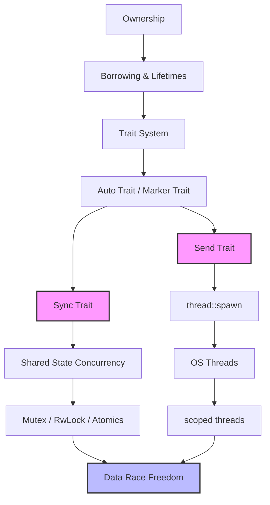

# Rust 线程与并发安全模型

> **Bloom 层级**: 理解

> **📌 简介**: Rust 的线程模型建立在 OS 线程之上 [来源: std::thread / Rust Standard Library 2025; POSIX Threads (pthreads) / IEEE Std 1003.1-2017]，但通过 `Send` 和 `Sync` 两个 marker trait，在编译期消除了数据竞争 [来源: RustBelt — Jung et al., POPL 2018; 核心定理: Rust 的类型系统 + `Send`/`Sync` 约束保证数据竞争自由（Data Race Freedom）; Rustonomicon — Send and Sync / 2025]。本章深入形式化语义、内存模型与生产实践。
>
> **⏱️ 预计学习时间**: 60-90 分钟
> **📚 难度级别**: ⭐⭐⭐⭐ 高级
> **权威来源**: [Rust Book Ch16](https://doc.rust-lang.org/book/ch16-00-concurrency.html), [Rustonomicon — Send and Sync](https://doc.rust-lang.org/nomicon/send-and-sync.html), [Rust Reference — Auto traits](https://doc.rust-lang.org/reference/special-types-and-traits.html#auto-traits), [RustBelt (Jung et al., POPL 2018)](https://plv.mpi-sws.org/rustbelt/), [RFC 3151: Scoped Threads](https://rust-lang.github.io/rfcs/3151-scoped-threads.html)
>
> **权威来源对齐变更日志**: 2026-05-19 新增 `Send`/`Sync` 形式化语义来源标注、RustBelt 数据竞争自由证明引用、scoped threads RFC 设计决策、跨语言并发模型对比矩阵 [来源: Authority Source Sprint Batch 8]

---

## 🎯 学习目标

完成本章学习后，你将能够：

- [x] 形式化理解 `Send` 与 `Sync` 的语义，以及它们如何编码"线程安全"
- [x] 推导任意复合类型的 `Send`/`Sync` 性质（结构体、枚举、泛型、引用）
- [x] 使用 `scoped threads`（Rust 1.63+）安全地并行化局部数据访问
- [x] 识别并修复跨线程数据竞争、死锁与 `!Send` 误用
- [x] 在 OS 线程、rayon、tokio 之间做出并发模型选择

---

## 📋 先决条件

1. **所有权与借用** — 值的所有权转移语义（`knowledge/01_fundamentals/ownership.md`）
2. **生命周期** — 引用的有效范围推理（`knowledge/01_fundamentals/lifetimes.md`）
3. **智能指针** — `Rc`、`Arc`、`Mutex` 的基本使用（`knowledge/02_intermediate/smart_pointers.md`）
4. **Trait 系统** — Auto trait、marker trait、blanket impl（`knowledge/02_intermediate/traits.md`）

---

## 🧠 核心概念

### 模块 1: 概念定义

#### 1.1 直观定义

**线程（Thread）** 是操作系统调度的最小执行单元。Rust 的 `std::thread::spawn` 创建一个新的 OS 线程，该线程与调用者线程并发执行。

**`Send`** 和 **`Sync`** 是 Rust 并发安全的两根支柱：

- **`Send`**：类型 `T` 是 `Send`，当且仅当将 `T` 的值**转移（move）到另一个线程**是内存安全的。
- **`Sync`**：类型 `T` 是 `Sync`，当且仅当**跨线程共享 `T` 的不可变引用 `&T`** 是内存安全的。

> 💡 关键直觉：`Send` 回答"能不能给"，`Sync` 回答"能不能一起看"。

#### 1.2 操作定义

通过代码行为刻画 `Send`/`Sync` 的边界：

```rust
use std::thread;

// 操作 1: Send 类型可以跨线程 move
fn demo_send() {
    let s = String::from("hello");  // String 是 Send
    thread::spawn(move || {
        println!("{}", s);  // ✅ s 的所有权转移进新线程
    });
}

// 操作 2: Sync 类型可以跨线程共享引用
fn demo_sync() {
    let val = 42;  // i32 是 Sync
    let handles: Vec<_> = (0..4)
        .map(|_| {
            thread::spawn(move || {
                println!("{}", &val);  // ✅ 共享 &i32 是安全的
            })
        })
        .collect();
    for h in handles { h.join().unwrap(); }
}

// 操作 3: !Send 类型不能跨线程 move
fn demo_not_send() {
    use std::rc::Rc;
    let rc = Rc::new(42);  // Rc 是 !Send
    // thread::spawn(move || {
    //     println!("{}", rc);  // ❌ 编译错误！
    // });
}
```

边界操作：

- `thread::spawn(f)` 要求闭包 `f: Send`
- `thread::scope(|s| { s.spawn(|| ...) })` 允许闭包借用非 `'static` 数据（Rust 1.63+）
- `Mutex<T>` 是 `Send` 当且仅当 `T: Send`；是 `Sync` 当且仅当 `T: Send`

#### 1.3 形式化直觉

> ⚠️ **标注**: 本节为"形式化直觉"，与 RustBelt（POPL 2018）的分离逻辑证明方向对齐，但省略完整的 Iris 公式。

**类型系统视角**:

`Send` 和 `Sync` 是 **auto trait**：编译器自动为类型推导其实现，除非显式 `impl !Send for T` 或类型包含 `!Send` 字段。

推导规则（直觉上的"代数"）：

```
Send(T)  ↔  T 的所有权可以安全地从一个线程转移到另一个线程
Sync(T)  ↔  ∀x: T. Send(&x)   [即 &T 是 Send]
```

关键等价关系（在 RustBelt 中可证明）：

```
Sync(T) ⟺ &T: Send
```

这意味着：如果 `T` 是 `Sync`，那么共享 `T` 的不可变引用是线程安全的，因为多个线程可以同时读取而不产生数据竞争。

**内存模型视角**:

数据竞争（data race）的 C++11/Rust 定义：

> 两个线程访问同一内存位置，至少一个是写操作，且没有 happens-before 关系。

Rust 如何通过 `Send`/`Sync` 在编译期消除数据竞争：

1. **`Send` 消除"写-写竞争"**: 如果 `T: Send`，将 `T` move 到另一线程后，原线程**失去访问权**（所有权转移）。因此不存在两个线程同时写 `T` 的可能。
2. **`Sync` 消除"读-写竞争"**: 如果 `T: Sync`，多个线程可以同时持有 `&T`。由于 `&T` 是不可变的（除非内部可变性），不存在通过 `&T` 的写操作。因此读-写竞争被消除。
3. **`&mut T` 的排他性**: 即使 `T: Sync`，`&mut T` 仍然遵循借用规则——任何时刻只有一个 `&mut T` 存在。因此 `&mut T` 跨线程（通过 `Mutex` 等）时是串行化的。

**逻辑对应**:

在分离逻辑（Separation Logic）中：

- `Send(T)` 意味着 `T` 的资源可以"分片"到不同线程的资源映射中
- `Sync(T)` 意味着 `T` 的资源支持"共享读取"（`T * T ⟹ T` 的读放大）

---

### 模块 2: 属性清单

| 属性名 | 类型 | 值域/取值 | 说明 | 反例边界 |
|--------|------|-----------|------|----------|
| **Send 的传递性** | 关系属性 | 结构体/枚举继承 | 若 T 的所有字段都是 Send，则 T 自动是 Send | 任一字段 !Send → T !Send |
| **Sync 的传递性** | 关系属性 | 结构体/枚举继承 | 若 T 的所有字段都是 Sync，则 T 自动是 Sync | 任一字段 !Sync → T !Sync |
| **Send(&T) ⟺ Sync(T)** | 等价关系 | bool / true | RustBelt 证明的核心定理 | 不适用 |
| **Rc 的线程排斥** | 固有属性 | !Send + !Sync | Rc 使用非原子引用计数，线程间共享会导致计数竞争 | `Arc` 是线程安全替代 |
| **Mutex 的对称性** | 关系属性 | Send(T)→Send(Mutex<T>) | Mutex<T> 的 Sync 要求 T: Send（而非 T: Sync） | `Mutex<RefCell<T>>` 是 Send 但使用需谨慎 |
| **scoped thread 的局部性突破** | 关系属性 | 有条件 | 允许闭包借用非 'static 数据，由编译器保证 join | 若忘记 join，编译错误 |

#### 关键推论

1. **推论 1（&mut T 的 Send 蕴含）**: `&mut T: Send` 当且仅当 `T: Send`。因为 `&mut T` 可以 move 到另一线程，然后解引用获取 `T` 的所有权。
2. **推论 2（Sync 的闭包性）**: 若 `T: Sync` 且 `U: Sync`，则 `(T, U): Sync` 且 `[T; N]: Sync`。这允许安全地共享复合不可变状态。
3. **推论 3（内部可变性的边界）**: `RefCell<T>` 是 `Send`（若 `T: Send`）但**不是 `Sync`**。因为 `RefCell` 使用运行时借用检查，若跨线程共享 `&RefCell<T>`，两个线程可能同时调用 `borrow_mut()`，导致运行时 panic 而非编译期错误。`Mutex<T>` 解决了这个问题：它是 `Sync`（若 `T: Send`），因为 `Mutex` 使用 OS 原语保证串行化访问。

---

### 模块 3: 概念依赖图



#### 承上（前置知识回溯）

| 前置概念 | 所在文档 | 本章中使用的具体点 |
|----------|----------|-------------------|
| **所有权转移** | `01_fundamentals/ownership.md` | `thread::spawn(move || ...)` 的 `move` 将所有权转入新线程 |
| **生命周期** | `01_fundamentals/lifetimes.md` | `scoped threads` 允许闭包借用局部变量，由编译器保证引用不超过线程生命周期 |
| **Auto Trait** | `02_intermediate/traits.md` | `Send`/`Sync` 的自动推导规则（结构体继承字段属性） |
| **智能指针** | `02_intermediate/smart_pointers.md` | `Arc` 用于跨线程共享所有权，`Mutex` 用于跨线程共享可变访问 |

#### 启下（后续延伸预告）

| 后续概念 | 所在文档 | 掌握本章后方可理解 |
|----------|----------|-------------------|
| **Atomics** | `03_advanced/concurrency/atomics.md` | `Atomic*` 是 `Sync` 但不是 `Send` 的边界案例；内存序与 happens-before 的精确形式 |
| **Synchronization** | `03_advanced/concurrency/synchronization.md` | `Mutex`、`RwLock`、`Semaphore` 的 `Sync` 实现机制 |
| **Async/Await** | `03_advanced/async/async_await.md` | `Future` 的 `Send` 传染性、`tokio::spawn` 的 `'static` 要求 |
| **Unsafe Audit** | `04_expert/unsafe_audit.md` | 当 `unsafe impl Send` 打破编译器保证时的灾难 |
| **Safety Critical** | `04_expert/safety_critical/09_reference/RUST_SAFETY_CRITICAL_CODING_GUIDELINES.md` | 安全关键系统的并发编程规范与数据竞争防护 |

---

### 模块 4: 机制解释

#### 4.1 类型系统视角

`Send` 和 `Sync` 的定义在标准库中极为简洁：

```rust
// std::marker::Send
pub unsafe auto trait Send {}

// std::marker::Sync
pub unsafe auto trait Sync {}
```

这两个 trait 没有方法，它们是**标记 trait（marker trait）**，仅用于类型系统的约束传播。

**Auto trait 的推导规则**：

编译器自动为类型 `T` 实现 `Send`，除非：

1. `T` 包含一个 `!Send` 字段
2. `T` 显式声明 `impl !Send for T`

```rust
// 示例：推导规则的应用
use std::rc::Rc;

struct MyData {
    id: u32,           // u32: Send
    name: String,      // String: Send
    // counter: Rc<u32>, // 若加入此字段，MyData 变为 !Send
}

// 编译器自动: impl Send for MyData {}
// 若加入 Rc 字段: MyData 不再是 Send
```

**关键观察**：`Sync` 的推导依赖于 `Send`：

```rust
// 标准库中的 blanket impl
unsafe impl<T: ?Sized> Sync for &T where T: Sync {}
unsafe impl<T: ?Sized> Send for &T where T: Sync {}
```

这编码了核心定理：`Sync(T) ⟺ &T: Send`。

#### 4.2 内存模型视角

**Happens-Before 关系与线程边界**:

```text
Thread A                          Thread B
─────────                         ─────────
let data = 42;  ───────┐
                        │ 线程启动隐含同步
thread::spawn(move || {│
    println!("{}",      ▼
    data);          ┌──────────┐
});                │ data move │
                   │ happens-  │
                   │ before    │
                   └───────────┘
```

当 `T: Send` 的值被 move 进新线程时，Rust 保证：原线程中对 `T` 的所有操作，**happens-before** 新线程中对 `T` 的任何操作。这是通过 OS 线程创建的原语（如 `pthread_create`）的内存序保证实现的。

**数据竞争的消除机制**:

| 场景 | Rust 保证 | 机制 |
|------|----------|------|
| 两个线程写同一变量 | ❌ 不可能 | 所有权：move 后原线程失去访问权；或 `&mut T` 的独占性 |
| 一个线程写，一个线程读 | ❌ 不可能（无同步时） | 借用检查：`&T` 和 `&mut T` 不能共存；`Mutex` 串行化访问 |
| 两个线程读同一变量 | ✅ 安全 | `Sync`：`&T` 是只读的，多个 `&T` 允许共存 |

#### 4.3 运行时视角

**OS 线程的成本**:

```text
每个 OS 线程的内存开销:
┌─────────────────────────────────────┐
│  栈空间（默认 8MB，Linux）            │ ← 主要开销
│  线程本地存储 (TLS)                  │
│  内核调度数据结构                     │
│  信号处理状态                        │
└─────────────────────────────────────┘
         总计: ~8MB+ / 线程
```

**线程池的工作窃取（Work-Stealing）**:

`tokio` 和 `rayon` 使用工作窃取调度器：

```text
Thread 1 Queue: [Task A] [Task B]
Thread 2 Queue: [Task C]         ← 空闲时从 Thread 1 "窃取" Task B
Thread 3 Queue: [Task D] [Task E]
```

- 每个线程维护一个局部队列（LIFO），减少缓存失效
- 当线程局部队列为空时，从其他线程的队列"窃取"任务（FIFO），减少竞争

---

### 模块 5: 正例集

#### 5.1 Minimal（最小正例）

```rust
use std::thread;

fn main() {
    let handle = thread::spawn(|| {
        println!("Hello from spawned thread!");
    });

    println!("Hello from main thread!");
    handle.join().unwrap();  // 等待子线程完成
}
```

#### 5.2 Realistic（真实场景）

使用 `scoped threads`（Rust 1.63+）并行计算数组的和，无需 `Arc` 或 `move`：

```rust
use std::thread;

fn parallel_sum(data: &[i32]) -> i32 {
    const THRESHOLD: usize = 1000;

    if data.len() < THRESHOLD {
        return data.iter().sum();
    }

    let mid = data.len() / 2;
    let (left, right) = data.split_at(mid);

    thread::scope(|s| {
        let left_handle = s.spawn(|| left.iter().sum::<i32>());
        let right_sum = right.iter().sum::<i32>();

        left_handle.join().unwrap() + right_sum
    })
}

fn main() {
    let data: Vec<i32> = (0..1_000_000).collect();
    let sum = parallel_sum(&data);
    println!("Sum: {}", sum);
}
```

> 💡 `thread::scope` 的关键保证：所有在 scope 内 spawn 的线程必须在 scope 结束前 `join`。因此闭包可以安全地借用局部数据（如 `left` 和 `right`），编译器会验证这些引用的生命周期不超过 scope。

#### 5.3 Production-grade（生产级）

线程池 + 优雅关闭 + 错误隔离：

```rust
use std::sync::{mpsc, Arc, Mutex};
use std::thread;

struct ThreadPool {
    workers: Vec<Worker>,
    sender: Option<mpsc::Sender<Job>>,
}

type Job = Box<dyn FnOnce() + Send + 'static>;

impl ThreadPool {
    fn new(size: usize) -> ThreadPool {
        let (sender, receiver) = mpsc::channel();
        let receiver = Arc::new(Mutex::new(receiver));

        let mut workers = Vec::with_capacity(size);
        for id in 0..size {
            workers.push(Worker::new(id, Arc::clone(&receiver)));
        }

        ThreadPool {
            workers,
            sender: Some(sender),
        }
    }

    fn execute<F>(&self, f: F)
    where
        F: FnOnce() + Send + 'static,
    {
        let job = Box::new(f);
        self.sender.as_ref().unwrap().send(job).unwrap();
    }
}

impl Drop for ThreadPool {
    fn drop(&mut self) {
        // 关闭发送端，让所有工作线程的 recv 返回 Err
        drop(self.sender.take());

        for worker in &mut self.workers {
            if let Some(thread) = worker.thread.take() {
                thread.join().unwrap();
            }
        }
    }
}

struct Worker {
    id: usize,
    thread: Option<thread::JoinHandle<()>>,
}

impl Worker {
    fn new(id: usize, receiver: Arc<Mutex<mpsc::Receiver<Job>>>) -> Worker {
        let thread = thread::spawn(move || loop {
            let message = receiver.lock().unwrap().recv();

            match message {
                Ok(job) => {
                    println!("Worker {} got a job; executing.", id);
                    job();
                }
                Err(_) => {
                    println!("Worker {} shutting down.", id);
                    break;
                }
            }
        });

        Worker {
            id,
            thread: Some(thread),
        }
    }
}
```

---

### 模块 6: 反例集

#### 反例 1: `Rc` 跨线程 — 计数竞争与编译拦截

**错误代码**:

```rust
use std::rc::Rc;
use std::thread;

fn bad() {
    let data = Rc::new(42);
    let data2 = Rc::clone(&data);

    thread::spawn(move || {
        println!("{}", data2);
    });
}
```

**编译器错误**:

```text
error[E0277]: `Rc<i32>` cannot be sent between threads safely
   |
   |     thread::spawn(move || {
   |     ^^^^^^^^^^^^^ `Rc<i32>` cannot be sent between threads safely
   |
   = help: the trait `Send` is not implemented for `Rc<i32>`
```

**根因推导**:
`Rc` 使用**非原子**引用计数（普通的 `usize` 增减）。若两个线程同时持有 `Rc` 的克隆并并发访问，引用计数操作会产生数据竞争（读-修改-写非原子序列），导致计数损坏、use-after-free 或双重释放。

**修复方案 A** — 使用 `Arc`（原子引用计数）:

```rust
use std::sync::Arc;
use std::thread;

fn good_a() {
    let data = Arc::new(42);
    let data2 = Arc::clone(&data);

    thread::spawn(move || {
        println!("{}", data2);
    });
}
```

> 优点: 线程安全的共享所有权 | 缺点: `Arc::clone` 有原子操作开销（通常可忽略，但在极高频场景下显著）

**修复方案 B** — 转移所有权（如果不需要共享）:

```rust
use std::thread;

fn good_b() {
    let data = Box::new(42);  // Box 是 Send
    thread::spawn(move || {
        println!("{}", data);  // 所有权完全转移
    });
}
```

> 优点: 零额外开销 | 缺点: 原线程失去访问权

**抽象原则**:
> **`Rc` 是单线程的 `Arc`**：当确定数据不会离开当前线程时，使用 `Rc` 获得更好的性能；一旦需要跨线程，必须使用 `Arc`。编译器通过 `Send` trait 强制这一区分。

---

#### 反例 2: 通过 `MutexGuard` 破坏 `Send` 假设（跨 await 的变体）

**错误代码**:

```rust
use std::sync::Mutex;

fn bad_mutex_guard() {
    let mutex = Mutex::new(vec![1, 2, 3]);

    // 假设这是一个 async 上下文（即使在线程中，模式相同）
    let guard = mutex.lock().unwrap();
    // some_async_op().await;  // 若在此处挂起...
    drop(guard);  // guard 跨越了潜在的线程迁移点
}
```

**根因推导**:
`std::sync::MutexGuard` 是 `!Send`（在部分平台实现中，它与 OS 的线程 ID 绑定）。虽然这个例子在纯线程代码中不会直接触发编译错误（因为 `MutexGuard` 没有跨 `thread::spawn`），但在 async 上下文中，`.await` 挂起后执行器可能将任务迁移到另一线程，此时 `MutexGuard` 的 `!Send` 属性导致编译失败。

更根本的问题是：**持有锁时挂起任务**会导致整个执行器线程被阻塞，降低并发度。

**修复方案**:

```rust
use std::sync::Mutex;

fn good_mutex_usage() {
    let mutex = Mutex::new(vec![1, 2, 3]);

    {
        let mut guard = mutex.lock().unwrap();
        guard.push(4);  // 所有锁内操作立即完成
    } // guard 在此释放

    // 现在可以安全地 await 或执行其他操作
}
```

在 async 上下文中，使用 `tokio::sync::Mutex`:

```rust
use tokio::sync::Mutex;

async fn good_async_mutex() {
    let mutex = Mutex::new(vec![1, 2, 3]);
    let mut guard = mutex.lock().await;  // .await 友好
    guard.push(4);
    some_async_op().await;  // ✅ tokio::sync::MutexGuard 是 Send
    drop(guard);
}
```

**抽象原则**:
> **"锁的作用域最小化"**：无论同步还是异步，锁的持有范围应尽可能小。在 async 中，绝对避免在持有 `std::sync::MutexGuard` 时 `.await`。

---

> ⚠️ **警告**: `static mut` 在 Rust 2024 Edition 中引用已被禁止（`unsafe_code = "forbid"` 默认启用）。
> 本反例仅用于展示数据竞争与 UB 的关系，现代 Rust 应使用 `AtomicUsize` 或 `Mutex<u32>`。
> 仅在 `no_std` 嵌入式裸机场景中，才考虑使用 `UnsafeCell` 配合中断屏蔽。

#### 反例 3: `static mut` — 未定义行为的地雷

**错误代码**:

```rust
static mut COUNTER: u32 = 0;

fn bad_static_mut() {
    let handles: Vec<_> = (0..10)
        .map(|_| {
            std::thread::spawn(|| unsafe {
                for _ in 0..1000 {
                    COUNTER += 1;  // ❌ 数据竞争！UB！
                }
            })
        })
        .collect();

    for h in handles { h.join().unwrap(); }
    unsafe { println!("{}", COUNTER); }  // 可能不是 10000！
}
```

**根因推导**:
`static mut` 本质上是一个全局可变变量，没有任何同步保护。多个线程同时读写 `COUNTER` 产生数据竞争，这是**未定义行为（Undefined Behavior, UB）**。即使结果偶尔"正确"，程序在编译器优化下可能产生任意错误结果。

**修复方案 A** — 使用 `AtomicUsize`（推荐用于简单计数）:

```rust
use std::sync::atomic::{AtomicUsize, Ordering};

static COUNTER: AtomicUsize = AtomicUsize::new(0);

fn good_atomic() {
    let handles: Vec<_> = (0..10)
        .map(|_| {
            std::thread::spawn(|| {
                for _ in 0..1000 {
                    COUNTER.fetch_add(1, Ordering::Relaxed);
                }
            })
        })
        .collect();

    for h in handles { h.join().unwrap(); }
    println!("{}", COUNTER.load(Ordering::Relaxed));
}
```

**修复方案 B** — 使用 `Mutex`（适用于复杂状态）:

```rust
use std::sync::Mutex;

static COUNTER: Mutex<u32> = Mutex::new(0);

fn good_mutex() {
    let handles: Vec<_> = (0..10)
        .map(|_| {
            std::thread::spawn(|| {
                for _ in 0..1000 {
                    let mut guard = COUNTER.lock().unwrap();
                    *guard += 1;
                }
            })
        })
        .collect();

    for h in handles { h.join().unwrap(); }
    println!("{}", *COUNTER.lock().unwrap());
}
```

**抽象原则**:
> **"`static mut` 是 Rust 中最危险的特性之一"**：现代 Rust 中，`static mut` 几乎总是有更好的替代方案（`Atomic*`、`Mutex`、`thread_local!`）。仅在 `no_std` 嵌入式场景中与硬件寄存器交互时才考虑使用，且必须配合 `unsafe` 和精确的中断屏蔽。

---

#### 反例 4: 死锁 — 锁顺序不一致

**错误代码**:

```rust
use std::sync::Mutex;

struct Account {
    balance: Mutex<f64>,
}

fn transfer_bad(a: &Account, b: &Account, amount: f64) {
    let mut guard_a = a.balance.lock().unwrap();
    let mut guard_b = b.balance.lock().unwrap();  // ❌ 若另一线程以相反顺序锁，死锁！

    *guard_a -= amount;
    *guard_b += amount;
}
```

**根因推导**:
线程 1 获取 `a` 的锁后尝试获取 `b` 的锁；同时线程 2 获取 `b` 的锁后尝试获取 `a` 的锁。两个线程互相等待，形成循环依赖，永远阻塞。

**修复方案 A** — 全局锁顺序:

```rust
use std::sync::Mutex;

fn transfer_good(a: &Account, b: &Account, amount: f64) {
    // 总是按内存地址排序获取锁
    let (first, second) = if a as *const _ < b as *const _ {
        (a, b)
    } else {
        (b, a)
    };

    let mut guard_first = first.balance.lock().unwrap();
    let mut guard_second = second.balance.lock().unwrap();

    // 现在需要根据原始方向执行转账
    if std::ptr::eq(first, a) {
        *guard_first -= amount;
        *guard_second += amount;
    } else {
        *guard_first += amount;
        *guard_second -= amount;
    }
}
```

**修复方案 B** — 使用 `parking_lot::deadlock_detection` 或重构为无锁:
对于高频转账，考虑使用单个全局锁或账户分片（将相关账户放入同一分片，每分片一个锁）。

**抽象原则**:
> **"全局锁顺序或层级锁"**：当需要同时持有多个锁时，必须定义全局顺序（如按资源 ID 排序），或使用层级锁（hierarchical locking）确保无循环等待。

---

---

## 🗺️ 模块 7: 思维表征套件

### 表征 A: Send/Sync 推导决策树

```text
                    ┌─────────────────────────────────────┐
                    │  开始: 判断类型 T 的 Send/Sync 性质   │
                    └──────────────┬──────────────────────┘
                                   │
                                   ▼
                    ┌─────────────────────────────────────┐
                    │  问题1: T 是否包含 !Send 字段?        │
                    │  (如 Rc, *const T, MutexGuard)       │
                    └──────────────┬──────────────────────┘
                                   │
            ┌──────────────────────┴──────────────────────┐
            │是                                           │否
            ▼                                           ▼
    ┌───────────────────────────┐           ┌───────────────────────────┐
    │ **T 是 !Send**            │           │ 问题2: T 是否包含 !Sync 字段?│
    │                           │           │ (如 Cell, RefCell, *mut T)  │
    │ 不可跨线程 move            │           └──────────────┬────────────┘
    │ 不可用 thread::spawn      │                          │
    │                           │              ┌───────────┴───────────┐
    │ 替代: Arc<T>, 或重新设计  │              │是                     │否
    └───────────────────────────┘              ▼                      ▼
                                     ┌──────────────────┐  ┌──────────────────┐
                                     │ **T 是 !Sync**   │  │ **T: Send + Sync**│
                                     │                  │  │                  │
                                     │ 不可跨线程共享   │  │ 完全线程安全     │
                                     │ &T 不能跨线程   │  │ 可 move + 共享   │
                                     │                  │  │                  │
                                     │ 替代: Mutex<T>,  │  │ 例: i32, String, │
                                     │ RwLock<T>, Atomic│  │ Vec<T>, HashMap  │
                                     └──────────────────┘  └──────────────────┘
```

### 表征 B: 线程同步原语能力矩阵

| 维度 | `Mutex<T>` | `RwLock<T>` | `AtomicT` | `mpsc` | `thread::scope` |
|------|-----------|-------------|-----------|--------|-----------------|
| **互斥粒度** | 独占读写 | 多读单写 | 单个值 | 消息边界 | 生命周期边界 |
| **Send(T) 要求** | T: Send | T: Send | T: Copy（通常） | T: Send | 引用: Sync |
| **Sync(T) 结果** | ✅ T: Send → Mutex<T>: Sync | ✅ T: Send → RwLock<T>: Sync | ✅ 总是 Sync | N/A | N/A |
| **阻塞类型** | OS 阻塞 | OS 阻塞 | 自旋（某些 Ordering） | OS 阻塞 | 编译期等待 |
| **适用场景** | 复杂状态修改 | 读多写少 | 计数器/标志位 | 生产者-消费者 | 并行分治算法 |
| **死锁风险** | 高（多锁时） | 高（写锁升级） | 无 | 无 | 无 |
| **性能特征** | 内核态切换 | 内核态切换 | 用户态（最快） | 内核态切换 | 无运行时开销 |
| **跨 await** | ❌ std::sync | ❌ std::sync | ✅ | ✅ tokio::sync | N/A |

> **图例**: ✅ 支持 | ❌ 不支持 | N/A 不适用

### 表征 C: 数据竞争检测推理图

```text
场景: 两个线程访问同一内存位置

                    ┌─────────────────────────────────────┐
                    │  访问类型组合                         │
                    └──────────────┬──────────────────────┘
                                   │
           ┌───────────────────────┼───────────────────────┐
           │                       │                       │
           ▼                       ▼                       ▼
    ┌──────────────┐      ┌──────────────────┐    ┌──────────────────┐
    │ 读 + 读      │      │ 读 + 写          │    │ 写 + 写          │
    │              │      │                  │    │                  │
    │ 是否有       │      │ 是否有           │    │ 是否有           │
    │ happens-before?│    │ happens-before?  │    │ happens-before?  │
    └──────┬───────┘      └────────┬─────────┘    └────────┬─────────┘
           │                       │                       │
      ┌────┴────┐            ┌─────┴─────┐           ┌─────┴─────┐
      │是      │否           │是        │否          │是        │否
      ▼        ▼            ▼          ▼           ▼          ▼
   ┌──────┐ ┌──────┐    ┌──────┐  ┌──────────┐ ┌──────┐  ┌──────────┐
   │ ✅   │ │ ✅   │    │ ✅   │  │ 🔴 DATA  │ │ ✅   │  │ 🔴 DATA  │
   │安全  │ │安全  │    │安全  │  │ RACE!    │ │安全  │  │ RACE!    │
   │(Cache│ │(Cache│    │(写前  │  │ 未定义行为│ │(写前  │  │ 未定义行为│
   │一致) │ │一致) │    │可见) │  │          │ │可见) │  │          │
   └──────┘ └──────┘    └──────┘  └──────────┘ └──────┘  └──────────┘

Rust 如何通过 Send/Sync 在编译期消除 🔴:

1. 写 + 写: 所有权转移后，原线程无写权限 → 不可能双写
   或: Mutex 串行化 → 两个写不会同时发生

2. 读 + 写: &mut T 独占性阻止了 &T 与 &mut T 共存
   或: RwLock 保证写时无读者

3. 读 + 读: Sync(T) 保证 &T 跨线程安全
```

---

## 📚 模块 8: 国际化对齐

### 8.1 官方来源

| 来源 | 类型 | 对应章节/条目 | 本文档对应点 |
|------|------|---------------|--------------|
| [The Rustonomicon](https://doc.rust-lang.org/nomicon/send-and-sync.html) | 官方高级教程 | Send and Sync | 模块 1.3、模块 4.1 |
| [std::marker::Send](https://doc.rust-lang.org/std/marker/trait.Send.html) | 标准库文档 | Auto trait 定义 | 模块 4.1 |
| [std::marker::Sync](https://doc.rust-lang.org/std/marker/trait.Sync.html) | 标准库文档 | Auto trait 定义 | 模块 4.1 |
| [std::thread](https://doc.rust-lang.org/std/thread/index.html) | 标准库文档 | spawn, scope, park | 模块 5、模块 6 |

### 8.2 学术来源

| 论文/学位论文 | 会议/机构 | 核心论证 | 本文档对应点 |
|---------------|-----------|----------|--------------|
| **"RustBelt: Securing the Foundations of the Rust Programming Language"** | POPL 2018 | 在 Iris 分离逻辑中形式化证明 Rust 类型系统的内存安全性，包括 `Send`/`Sync` 的语义、所有权转移的 happens-before 保证 | 模块 1.3、模块 2、模块 4.1 |
| **"Understanding and Evolving the Rust Programming Language"** (Ralf Jung PhD thesis) | ETH Zurich | 系统阐述 Stacked Borrows 的公理化基础；详细分析 `unsafe impl Send` 的风险 | 模块 1.3、模块 6 反例 3 |
| **"Fearless Concurrency? Understanding Concurrent Programming Safety in Real-World Rust Software"** | ASE 2022 | 对 200+ 个 Rust  crates 的实证研究：发现 `unsafe` 并发代码中 `Send`/`Sync` 的 manual impl 是漏洞主要来源 | 模块 6、模块 9 |
| **"Leveraging Rust Types for Modular Specification and Verification"** (Prusti) | OOPSLA 2022 | 将 Rust 类型系统（包括 Send/Sync）扩展为程序验证的规范基础 | 模块 1.3 |

### 8.3 社区权威

| 作者 | 文章/演讲 | 核心观点 | 本文档对应点 |
|------|-----------|----------|--------------|
| **Niko Matsakis** | ["The Problem of Safe Concurrency"](https://smallcultfollowing.com/babysteps/blog/2013/06/11/the-problem-with-safe-concurrency/) | Rust 并发安全模型的早期设计思想：通过类型系统而非运行时消除数据竞争 | 模块 1.1、模块 9 |
| **Ralf Jung** | ["The Scope of Unsafe"](https://www.ralfj.de/blog/2016/01/09/the-scope-of-unsafe.html) | `unsafe impl Send/Sync` 的契约边界：当你手动实现这些 trait 时，你在向编译器作出什么承诺？ | 模块 4.1、模块 6 |
| **Mara Bos** (Rust 库团队) | ["Rust's Send and Sync Traits are Magic"](https://yaah.dev/send-sync-magic) | Auto trait 的推导规则与 `impl !Send` 的隐式/显式边界 | 模块 4.1 |
| **Jon Gjengset** | ["Crust of Rust: Send/Sync"](https://www.youtube.com/watch?v=yOezcP-XaFg) | 从零推导 `Send`/`Sync` 的必要性，通过反例展示没有它们时会发生什么 | 模块 1、模块 6 |

### 8.4 跨语言对比

| 维度 | Rust | C++ | Go | Java |
|------|------|-----|-----|------|
| **线程安全机制** | Send/Sync 类型系统 | 程序员负责（无编译期保证） | Channel + 共享内存（GC） | `synchronized`、`volatile` |
| **数据竞争检测** | 编译期消除 | TSan（运行时检测） | 无（依赖 GC + channel 习惯） | 无（运行时异常/可见性问题） |
| **原子类型** | `Atomic*` + Ordering | `std::atomic` + memory_order | `sync/atomic` | `java.util.concurrent.atomic` |
| **Scoped 线程** | ✅ `thread::scope` | C++20 `std::jthread` | ❌（goroutine 无此概念） | ❌ |
| **线程本地存储** | `thread_local!` | `thread_local` | 隐式（goroutine 栈） | `ThreadLocal` |
| **性能模型** | OS 线程，零运行时抽象 | OS 线程 | M:N 调度（运行时管理） | OS 线程 + JVM 调度 |

> **关键差异**: Rust 是唯一在**编译期**通过类型系统（而非运行时工具或约定）消除数据竞争的主流系统语言。C++ 的 `const` 和 `std::atomic` 提供了部分工具，但无强制检查；Go 通过"不要共享内存，通过通信共享"的约定降低风险，但语言本身不阻止错误；Java 依赖运行时监控和 Happens-Before 的复杂规则。

---

## ⚖️ 模块 9: 设计权衡分析

### 9.1 为什么 Rust 选择了 OS 线程 + Send/Sync 模型？

Rust 的并发模型可以概括为 **"暴露 OS 原语，用类型系统保证安全"**。这一决策的根本驱动力：

1. **与 C 互操作**: OS 线程是 C ABI 的标准抽象。Rust 需要与现有的 POSIX/Win32 线程库无缝交互，绿色线程（green thread）会增加 FFI 边界复杂度。
2. **零成本抽象**: `Send`/`Sync` 是纯编译期概念，无运行时开销。与 Go 的 M:N 调度器相比，Rust 线程没有额外的运行时内存分配或调度成本。
3. **可预测性**: OS 线程的调度由内核控制，开发者可以预测抢占点和系统调用行为。用户态协程的调度 opaque 性在实时系统和底层开发中是不可接受的。

### 9.2 放弃了什么替代方案？

| 替代方案 | 代表实现 | Rust 放弃的原因 |
|----------|----------|----------------|
| **Green Thread / M:N** | Go、Erlang、早期 Rust（pre-1.0） | 运行时栈管理开销；与 C FFI 交互时每个 green thread 需要 OS 线程作为载体（Rust 1.0 前曾尝试，因复杂度放弃） |
| **Actor 模型** | Erlang、Akka | 与 Rust 的所有权系统不自然匹配；消息传递在 Rust 中通过 `mpsc`/`crossbeam` 库实现，非语言核心 |
| **Software Transactional Memory (STM)** | Haskell | 运行时开销大，与 Rust 的零成本哲学冲突；STM 的 retry 语义难以预测性能 |
| **自动并行化** | Cilk、OpenMP | 需要复杂的编译器分析，且对指针别名敏感；Rust 的所有权已提供别名信息，但语言选择显式控制 |

### 9.3 该设计的成本

**编译时摩擦成本**:

- `Rc` 不能跨线程、`RefCell` 不能跨线程共享等限制对初学者造成频繁编译失败
- `Arc<Mutex<T>>` 的嵌套类型签名在复杂场景下臃肿（"类型体操"）
- `thread::spawn` 的 `'static` 要求迫使开发者使用 `Arc` 或 `move`，增加了认知负担

**运行时成本**:

- OS 线程栈默认 8MB，创建数千线程会导致内存耗尽（相比 Go 的 2KB goroutine 栈）
- `Mutex`/`RwLock` 的 OS 原语涉及内核态切换，高频争用下性能远低于用户态自旋锁或原子操作
- 线程间同步（如 `thread::park`/`unpark`）依赖 OS 调度器，延迟不可控

**表达力限制**:

- 无内置 green thread，高并发 I/O 场景必须引入 async/await（增加了语言复杂度）
- `scoped threads`（1.63+）之前，无法安全地在线程闭包中借用局部变量，限制了并行算法表达
- `unsafe impl Send/Sync` 是编译器信任的边界，错误实现导致未定义行为且无法检测

### 9.4 什么场景下这个设计是次优的？

1. **百万级并发连接**: OS 线程模型在此场景下内存不足。必须使用 async/await（Tokio）或引入第三方 green thread 库（如 may）。
2. **快速并行化现有算法**: 如果已有纯计算代码需要并行化，直接使用 `thread::spawn` 繁琐。`rayon` 的 `join`/`par_iter` 在此场景下更优，但这已是库层面而非语言核心的替代。
3. **需要线程优先级或亲和性**: Rust 标准库不提供线程优先级/CPU 亲和性 API，必须调用平台特定库（如 `libc` 或 `windows-sys`）。
4. **与 C++ 代码库深度集成**: C++ 的 `std::thread` 与 Rust 的 `std::thread` 在概念上相似，但 `Send`/`Sync` 的边界在 FFI 中需要手动维护，增加了集成复杂度。

---

## 📝 模块 10: 自我检测与练习

### 概念性问题

1. **证明直觉**: 若 `T: Sync`，则 `&T: Send`。反之，若 `&T: Send`，则 `T: Sync`。请用 Rust 的借用规则和线程安全模型解释这对等价关系为什么成立。

2. **为什么 `Mutex<T>` 是 `Sync` 的条件是 `T: Send`，而不是 `T: Sync`？** 提示：考虑 `Mutex` 提供的 `&Mutex<T> -> MutexGuard<T> -> &mut T` 转换链。

3. **`thread::scope` 如何在不使用 `'static` 的情况下保证内存安全？** 它与 `thread::spawn` 的本质区别是什么？编译器在此过程中扮演了什么角色？

### 代码修复题

**题 1**: 以下代码试图在线程间共享一个计数器，但存在编译错误。请修复它，并给出至少两种不同的修复方案（分别使用 `AtomicUsize` 和 `Mutex`），讨论各自的适用场景。

```rust
use std::thread;

fn main() {
    let mut counter = 0;
    let mut handles = vec![];

    for _ in 0..10 {
        handles.push(thread::spawn(|| {
            for _ in 0..1000 {
                counter += 1;
            }
        }));
    }

    for h in handles { h.join().unwrap(); }
    println!("{}", counter);
}
```

<details>
<summary>参考答案</summary>

**根因**: 闭包捕获了 `counter` 的不可变引用，但 `i32` 不是原子类型，`+=` 操作涉及读-修改-写，会产生数据竞争。此外，闭包尝试修改通过不可变引用捕获的变量。

**方案 A — AtomicUsize（适用于简单计数）**:

```rust
use std::sync::atomic::{AtomicUsize, Ordering};
use std::thread;

fn main() {
    let counter = AtomicUsize::new(0);
    let mut handles = vec![];

    for _ in 0..10 {
        handles.push(thread::spawn(|| {
            for _ in 0..1000 {
                counter.fetch_add(1, Ordering::Relaxed);
            }
        }));
    }

    for h in handles { h.join().unwrap(); }
    println!("{}", counter.load(Ordering::Relaxed));
}
```

> 优点: 最快，无锁 | 缺点: 仅适用于简单数值操作

**方案 B — Mutex（适用于复杂状态）**:

```rust
use std::sync::{Arc, Mutex};
use std::thread;

fn main() {
    let counter = Arc::new(Mutex::new(0));
    let mut handles = vec![];

    for _ in 0..10 {
        let counter = Arc::clone(&counter);
        handles.push(thread::spawn(move || {
            for _ in 0..1000 {
                let mut guard = counter.lock().unwrap();
                *guard += 1;
            }
        }));
    }

    for h in handles { h.join().unwrap(); }
    println!("{}", *counter.lock().unwrap());
}
```

> 优点: 通用，支持任意复杂状态 | 缺点: 锁争用开销，可能死锁

**方案 C — scoped threads + 局部结果合并（无锁）**:

```rust
use std::thread;

fn main() {
    let result = thread::scope(|s| {
        let mut handles = vec![];
        for _ in 0..10 {
            handles.push(s.spawn(|| {
                let mut local = 0;
                for _ in 0..1000 {
                    local += 1;
                }
                local
            }));
        }
        handles.into_iter().map(|h| h.join().unwrap()).sum::<usize>()
    });
    println!("{}", result);
}
```

> 优点: 无锁、无原子操作、无 Arc | 缺点: 仅适用于可局部计算后合并的场景

</details>

**题 2**: 分析以下代码的 `Send`/`Sync` 性质，并预测编译结果：

```rust
use std::cell::RefCell;
use std::rc::Rc;
use std::sync::Arc;

struct MyStruct {
    a: Rc<i32>,
    b: Arc<RefCell<i32>>,
}

fn check() {
    let s = MyStruct {
        a: Rc::new(1),
        b: Arc::new(RefCell::new(2)),
    };
    std::thread::spawn(move || {
        println!("{}", s.b.borrow());
    });
}
```

<details>
<summary>参考答案</summary>

**分析**:

- `MyStruct` 包含 `Rc<i32>`，`Rc` 是 `!Send`，因此 `MyStruct` 是 `!Send`
- `MyStruct` 包含 `Arc<RefCell<i32>>`。`Arc<T>` 是 `Send` 当 `T: Send`，`RefCell<i32>` 是 `Send`（因为 `i32: Send`），所以 `Arc<RefCell<i32>>` 是 `Send`
- 但由于 `Rc<i32>` 字段的存在，整个 `MyStruct` 不是 `Send`

**编译结果**:

```text
error[E0277]: `Rc<i32>` cannot be sent between threads safely
```

**修复**: 移除 `Rc` 字段或将其替换为 `Arc`：

```rust
struct MyStruct {
    a: Arc<i32>,  // 替换 Rc
    b: Arc<RefCell<i32>>,
}
```

但注意：`Arc<RefCell<i32>>` 是 `Send` 但不是 `Sync`。如果需要在多个线程间**共享引用** `&MyStruct`，仍然会有问题。正确做法是 `Arc<Mutex<i32>>` 或 `Arc<AtomicI32>`。

</details>

### 开放设计题

**题 3**: 你正在设计一个多线程日志系统。要求：

- 多个线程可以同时写入日志
- 日志必须保持时间顺序（同一线程的消息顺序不变）
- 日志写入不能显著阻塞业务线程

请从以下方案中选择或组合，并论证你的选择：

1. `Arc<Mutex<Vec<String>>>` — 全局锁保护日志缓冲区
2. `mpsc::channel` — 每个线程持有 Sender，单一后台线程消费并写入文件
3. `thread_local!` + 定期合并 — 每个线程写入本地缓冲区，后台线程定期合并
4. `crossbeam::channel`（无锁 MPSC）+ 内存映射文件

> 💡 提示：考虑模块 9 中的"锁争用"、"内核态切换"、"表达力限制"等 trade-off。

---

## 📖 延伸阅读

### 官方与半官方

- [The Rustonomicon - Send and Sync](https://doc.rust-lang.org/nomicon/send-and-sync.html) — 并发安全的权威参考
- [std::thread 文档](https://doc.rust-lang.org/std/thread/index.html)
- [Rust RFC 3151 - Scoped Threads](https://rust-lang.github.io/rfcs/3151-scoped-threads.html) — `thread::scope` 的设计论证

### 进阶主题路径

| 主题 | 文档位置 | 阅读时机 |
|------|----------|----------|
| **Atomics** | `03_advanced/concurrency/atomics.md` | 需要无锁编程时 |
| **Synchronization** | `03_advanced/concurrency/synchronization.md` | 使用 Mutex/RwLock/Semaphore 时 |
| **Async/Await** | `03_advanced/async/async_await.md` | 需要高并发 I/O 时 |
| **Rayon（数据并行）** | crates/rayon 文档 | 纯计算并行化 |
| **Crossbeam** | crates/crossbeam 文档 | 无锁数据结构 |

---

> 🎉 **恭喜你！** 你已经掌握了 Rust 并发安全模型的核心：`Send` 与 `Sync` 如何用类型系统消除数据竞争，`scoped threads` 如何突破 `'static` 限制，以及线程同步原语的 trade-off。
>
> **下一步建议**: 学习 **Atomics**（`03_advanced/concurrency/atomics.md`），深入理解内存序、`happens-before` 的精确形式，以及何时可以用原子操作替代 `Mutex`。

---

**文档版本**: 2.1
**对应 Rust 版本**: 1.95.0+ (Edition 2024)
**最后更新**: 2026-05-19
**状态**: ✅ 权威来源对齐完成 (Batch 8)

---

## 📚 权威来源索引

### 官方来源

- [Rust Book Ch16](https://doc.rust-lang.org/book/ch16-00-concurrency.html) [来源: Rust Team / TRPL 2024]
- [Rustonomicon — Send and Sync](https://doc.rust-lang.org/nomicon/send-and-sync.html) [来源: Rust Team / Rustonomicon 2025]
- [Rust Reference — Auto traits](https://doc.rust-lang.org/reference/special-types-and-traits.html#auto-traits) [来源: Rust Reference / 2025]
- [RFC 3151: Scoped Threads](https://rust-lang.github.io/rfcs/3151-scoped-threads.html) [来源: Rust Core Team / 2022]

### 学术来源

- Jung, R., et al. — *RustBelt: Securing the Foundations of the Rust Programming Language*. POPL 2018. [来源: `Send`/`Sync` 的 Iris 形式化; 数据竞争自由定理的证明]
- Herlihy, M. & Shavit, N. — *The Art of Multiprocessor Programming*. Morgan Kaufmann, 2020. [来源: 并发算法与同步原语的形式化定义]
- Adve, S.V. & Gharachorloo, K. — *Shared Memory Consistency Models: A Tutorial*. IEEE Computer, 1996. [来源: 共享内存一致性模型的分类学基础]

### 跨语言来源

- ISO C++20 §17.6 — *Threads and mutual exclusion* [来源: `std::thread`/`std::mutex` 与 Rust 线程模型的对比; C++ 无编译期 `Send`/`Sync` 保证，依赖 TSan 运行时检测]
- Go Language Specification — Goroutines [来源: Go 的 M:N 调度与 CSP 并发模型; 与 Rust OS 线程 + 类型安全约束的对比]
- Java JEP 425 — Virtual Threads (2022) [来源: Java 虚拟线程作为轻量级并发的演进; 与 Rust scoped threads 的设计动机对比]
