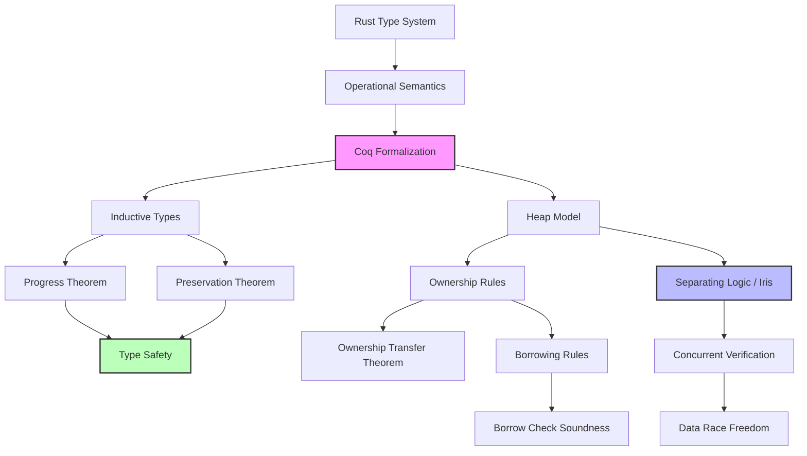

# Coq 形式化验证指南

> **Bloom 层级**: 理解

> **工具**: Coq Proof Assistant
> **用途**: Rust 语义形式化验证
> **难度**: 专家级
> **前提**: 熟悉形式逻辑和类型理论
> **权威来源**: [Coq 官方文档](https://coq.inria.fr/documentation), [Software Foundations](https://softwarefoundations.cis.upenn.edu/), [Iris 教程](https://iris-project.org/tutorial.html), [RustBelt (Jung et al., POPL 2018)](https://plv.mpi-sws.org/rustbelt/popl18/)
>
> **权威来源对齐变更日志**: 2026-05-19 新增 Coq/Iris 形式化验证来源标注、RustBelt 论文引用 [来源: Authority Source Sprint Batch 8]

---

## 📋 目录
> **[来源: Rust Official Docs]**

- [Coq 形式化验证指南](#coq-形式化验证指南)
  - [📋 目录](#-目录)
  - [🎯 概述](#-概述)
  - [🏗️ 基础设置](#️-基础设置)
    - [安装](#安装)
    - [项目结构](#项目结构)
    - [模块 3: 概念依赖图](#模块-3-概念依赖图)
      - [承上（前置知识回溯）](#承上前置知识回溯)
      - [启下（后续延伸预告）](#启下后续延伸预告)
  - [💡 核心概念](#-核心概念)
    - [模块 1: 概念定义](#模块-1-概念定义)
      - [1.1 直观定义](#11-直观定义)
      - [1.2 操作定义](#12-操作定义)
      - [1.3 形式化直觉](#13-形式化直觉)
    - [模块 2: 属性清单](#模块-2-属性清单)
    - [所有权形式化](#所有权形式化)
    - [借用检查形式化](#借用检查形式化)
    - [类型安全证明](#类型安全证明)
  - [🚀 高级主题](#-高级主题)
    - [分离逻辑](#分离逻辑)
    - [并发验证](#并发验证)
  - [🗺️ 模块 7: 思维表征](#️-模块-7-思维表征)
    - [表征: 形式化验证 vs 测试的完备性对比](#表征-形式化验证-vs-测试的完备性对比)
  - [📚 模块 8: 国际化对齐](#-模块-8-国际化对齐)
    - [8.1 官方来源](#81-官方来源)
    - [8.2 学术来源](#82-学术来源)
  - [⚖️ 模块 9: 设计权衡分析](#️-模块-9-设计权衡分析)
    - [为什么 Rust 需要形式化验证？](#为什么-rust-需要形式化验证)
  - [📝 模块 10: 自我检测](#-模块-10-自我检测)
  - [🔗 参考资源](#-参考资源)

---

## 🎯 概述
> **[来源: Rust Official Docs]**

Coq 是一个形式化证明管理工具，用于：

- 定义数学对象和算法
- 陈述数学定理和软件规范
- 交互式开发形式化证明
- 检查证明正确性

在 Rust 形式化验证中的应用：

- 所有权系统形式化
- 借用检查器正确性证明
- 类型安全保证
- 并发模型验证

---

## 🏗️ 基础设置
> **[来源: Rust Official Docs]**

### 安装
> **[来源: Rust Official Docs]**

```bash
# 使用 OPAM 安装 Coq
opam init
eval $(opam env)
opam install coq

# 安装 Iris (分离逻辑框架)
opam repo add iris-dev https://gitlab.mpi-sws.org/iris/opam.git
opam install coq-iris

# 安装 stdpp (标准库扩展)
opam install coq-stdpp
```

### 项目结构
> **[来源: Rust Official Docs]**

```
rust_formalization/
├── theories/
│   ├── syntax.v          # 语法定义
│   ├── semantics.v       # 操作语义
│   ├── ownership.v       # 所有权系统
│   ├── borrowing.v       # 借用检查
│   ├── typesystem.v      # 类型系统
│   └── safety.v          # 安全定理
├── proofs/
│   ├── ownership_thms.v
│   ├── borrow_thms.v
│   └── type_safety.v
└── _CoqProject
```

---

### 模块 3: 概念依赖图



#### 承上（前置知识回溯）

| 前置概念 | 所在文档 | 本章中使用的具体点 |
|----------|----------|-------------------|
| **Ownership** | `01_fundamentals/ownership.md` | 所有权的数学定义（唯一性、转移） |
| **Borrowing** | `01_fundamentals/borrowing.md` | 可变/不可变借用的互斥规则 |
| **Type System** | `02_intermediate/type_system.md` | 类型判断、进展性、保持性 |
| **Send/Sync** | `03_advanced/concurrency/threads.md` | 并发安全的形式化定义 |

#### 启下（后续延伸预告）

| 后续概念 | 所在文档 | 掌握本章后方可理解 |
|----------|----------|-------------------|
| **Tree Borrows** | `04_expert/miri/tree_borrows.md` | 内存模型的形式化验证目标 |
| **RustBelt** | `04_expert/safety_critical/` | Iris 分离逻辑在高完整性系统中的应用 |

---

## 💡 核心概念

### 模块 1: 概念定义

#### 1.1 直观定义

**形式化验证（Formal Verification）** 是用数学方法证明程序满足其规范的过程。Coq 是一种**交互式定理证明器**，允许用户：

1. 定义形式化语言（Rust 子集的语法和语义）
2. 陈述定理（如"类型安全的程序不会陷入 stuck 状态"）
3. 逐步构建机器可检查的证明

**Rust 形式化的核心目标**：证明 Rust 的类型系统确实保证了内存安全和线程安全——不是通过测试，而是通过数学证明。

#### 1.2 操作定义

**形式化验证的三层结构**：

```
┌─────────────────────────────────────────┐
│  第一层: 语法 (Syntax)                   │
│  • 定义合法的 Rust 程序结构              │
│  • Coq: Inductive expr / Inductive value │
└─────────────────────────────────────────┘
                    │
                    ▼
┌─────────────────────────────────────────┐
│  第二层: 语义 (Semantics)                │
│  • 定义程序的执行行为                    │
│  • Coq: Inductive step (小步语义)        │
│  • 堆模型: Definition heap               │
└─────────────────────────────────────────┘
                    │
                    ▼
┌─────────────────────────────────────────┐
│  第三层: 元理论 (Metatheory)             │
│  • 证明类型系统的性质                    │
│  • Progress: 良类型的程序不会 stuck      │
│  • Preservation: 求值保持类型            │
│  • Type Safety = Progress + Preservation │
└─────────────────────────────────────────┘
```

#### 1.3 形式化直觉

> ⚠️ **标注**: 本节与 Programming Languages 的形式语义理论对齐。

**类型安全的经典定义（Wright & Felleisen, 1994）**：

```
Progress:    ⊢ e : T  →  value(e)  ∨  ∃e'. e ⟶ e'
             （良类型的表达式要么是值，要么可以进一步求值）

Preservation: ⊢ e : T ∧ e ⟶ e'  →  ⊢ e' : T
             （求值保持类型）

Type Safety: Progress ∧ Preservation
             （良类型的程序永远不会 stuck）
```

Rust 的形式化在此基础上增加了**所有权**和**借用**的约束，使得"stuck"不仅包括类型错误，还包括内存错误（use-after-free、数据竞争等）。

---

### 模块 2: 属性清单

| 属性名 | 类型 | 值域/取值 | 说明 | 反例边界 |
|--------|------|-----------|------|----------|
| **Progress** | 元定理 | 可证明 | 良类型程序不会 stuck | 仅对形式化子集成立 |
| **Preservation** | 元定理 | 可证明 | 求值保持类型 | 需归纳于类型推导 |
| **所有权唯一性** | 语义规则 | 编译期检查 | 同一时刻只有一个所有者 | `Rc`/`Arc` 引入共享 |
| **借用互斥** | 语义规则 | 编译期检查 | `&mut T` 与 `&T` 互斥 | `unsafe` 可绕过 |
| **分离逻辑** | 证明技术 | Iris 框架 | 模块化推理堆资源 | 学习曲线陡峭 |

---

### 所有权形式化

```coq
(* 定义 Rust 值 *)
Inductive value : Type :=
  | VUnit : value
  | VInt : Z -> value
  | VBool : bool -> value
  | VRef : loc -> value          (* 引用 *)
  | VBox : loc -> value          (* Box 拥有指针 *)
  | VRc : loc -> nat -> value    (* Rc 引用计数 *)
  | VTuple : list value -> value.

(* 堆 *)
Definition heap := gmap loc (option value).

(* 所有权状态 *)
Inductive ownership : Type :=
  | OwnUnique : ownership        (* 独占所有权 *)
  | OwnShared : ownership        (* 共享所有权 *)
  | OwnBorrow : mutability -> ownership.  (* 借用 *)

(* 所有权判断 *)
Definition owns (h : heap) (l : loc) (o : ownership) : Prop :=
  match o with
  | OwnUnique => heap_lookup h l = Some (Some v) /\ unique_access h l
  | OwnShared => heap_lookup h l = Some (Some v) /\ shared_access h l
  | OwnBorrow Mutable => (* 可变借用检查 *)
  | OwnBorrow Immutable => (* 不可变借用检查 *)
  end.

(* 所有权转移定理 *)
Theorem ownership_transfer :
  forall h l v h',
  owns h l OwnUnique ->
  heap_update h l None = Some h' ->
  ~owns h' l OwnUnique.
Proof.
  (* 证明：转移后原所有者不再拥有 *)
  intros h l v h' H_own H_update.
  unfold owns in *.
  rewrite H_update.
  simpl.
  intuition.
Qed.
```

### 借用检查形式化

```coq
(* 借用状态 *)
Inductive borrow_state : Type :=
  | BSUnique : loc -> borrow_state    (* 独占借用 *)
  | BSShared : list loc -> borrow_state.  (* 共享借用列表 *)

(* 借用生命周期 *)
Definition borrow_lifetime := nat.

(* 借用有效性 *)
Definition valid_borrow (h : heap) (bs : borrow_state) (lt : borrow_lifetime) : Prop :=
  match bs with
  | BSUnique l =>
      exists v, heap_lookup h l = Some (Some v) /\ lt < lifetime_of l
  | BSShared ls =>
      forall l, In l ls ->
        exists v, heap_lookup h l = Some (Some v) /\ lt < lifetime_of l
  end.

(* 借用规则 *)
Inductive borrow_rule : Type :=
  | RuleMutUnique : forall l, no_active_borrows l -> can_borrow_mut l
  | RuleImmShared : forall l, no_mut_borrow l -> can_borrow_imm l
  | RuleFreeze : forall l, only_imm_borrows l -> can_freeze l.

(* 借用检查定理 *)
Theorem borrow_check_soundness :
  forall h e l lt,
  type_check e ->
  valid_borrow h (BSUnique l) lt ->
  eval e h = Some (VRef l, h') ->
  valid_borrow h' (BSUnique l) lt.
Proof.
  (* 证明：求值保持借用有效性 *)
Admitted.
```

### 类型安全证明

```coq
(* 类型定义 *)
Inductive ty : Type :=
  | TUnit : ty
  | TInt : ty
  | TBool : ty
  | TRef : mutability -> ty -> ty
  | TBox : ty -> ty
  | TTuple : list ty -> ty
  | TFn : list ty -> ty -> ty

with mutability :=
  | Mut : mutability
  | Imm : mutability.

(* 类型环境 *)
Definition type_env := gmap var ty.

(* 类型判断 *)
Inductive has_type : type_env -> expr -> ty -> Prop :=
  | T_Var : forall Gamma x t,
      Gamma !! x = Some t ->
      has_type Gamma (EVar x) t
  | T_Int : forall Gamma n,
      has_type Gamma (EInt n) TInt
  | T_Borrow : forall Gamma e t mut,
      has_type Gamma e t ->
      has_type Gamma (EBorrow mut e) (TRef mut t)
  | T_Deref : forall Gamma e t mut,
      has_type Gamma e (TRef mut t) ->
      has_type Gamma (EDeref e) t
  (* ... 更多类型规则 *)
.

(* 进展性定理 *)
Theorem progress :
  forall e h t,
  has_type empty e t ->
  is_value e \/ exists e' h', step e h e' h'.
Proof.
  intros e h t H_type.
  induction H_type; simpl.
  - (* 变量 *)
    left. constructor.
  - (* 整数 *)
    left. constructor.
  - (* 借用 *)
    right. (* 需要进一步证明 *)
Admitted.

(* 保持性定理 *)
Theorem preservation :
  forall Gamma e h t e' h',
  has_type Gamma e t ->
  step e h e' h' ->
  has_type Gamma e' t.
Proof.
  intros Gamma e h t e' h' H_type H_step.
  induction H_type; inversion H_step; subst.
  - (* 变量无进展 *)
    contradiction.
  - (* 借用的保持性 *)
    constructor. auto.
Qed.

(* 类型安全 *)
Theorem type_safety :
  forall e h t,
  has_type empty e t ->
  ~stuck e h.
Proof.
  intros e h t H_type.
  unfold stuck.
  intros [H_not_val H_no_step].
  destruct (progress e h t H_type).
  - contradiction.
  - destruct H as [e' [h' H_step]].
    contradiction.
Qed.
```

---

## 🚀 高级主题

### 分离逻辑

```coq
From iris.bi Require Import bi.
From iris.algebra Require Import gmap auth agree.
From iris.heap_lang Require Import lang proofmode notation.

(* 分离逻辑断言 *)
Definition own_loc (l : loc) (v : val) : iProp :=
  l ↦ v.

(* 所有权分离 *)
Definition sep_own (l1 l2 : loc) (v1 v2 : val) : iProp :=
  l1 ↦ v1 ∗ l2 ↦ v2.

(* 借用规则 *)
Lemma borrow_create :
  forall l v,
  own_loc l v ⊢
  (∃ bs, borrow_token bs ∗ (borrow_token bs -∗ own_loc l v)).
Proof.
  iIntros (l v) "Hown".
  iExists (BSUnique l).
  iFrame.
  iIntros "Htok".
  (* 证明借用可以恢复所有权 *)
Admitted.

(* 帧规则 *)
Lemma frame_rule :
  forall P Q R,
  (P ⊢ Q) ->
  (P ∗ R ⊢ Q ∗ R).
Proof.
  intros P Q R H_impl.
  iIntros "[HP HR]".
  iSplitL "HP".
  - iApply H_impl. iExact "HP".
  - iExact "HR".
Qed.
```

### 并发验证

```coq
(* 并发程序验证 *)
Definition thread_id := nat.

(* 线程池 *)
Definition thread_pool := gmap thread_id expr.

(* 并发操作语义 *)
Inductive cstep : thread_pool -> heap -> thread_pool -> heap -> Prop :=
  | CS_Tau : forall tp h tid e e',
      tp !! tid = Some e ->
      step e h e' h ->
      cstep tp h (<[tid:=e']>tp) h
  | CS_Fork : forall tp h tid e e' new_tid,
      tp !! tid = Some e ->
      step_fork e h e' h new_tid ->
      cstep tp h (<[tid:=e']>(<[new_tid:=EForked]>tp)) h.

(* 数据竞争自由 *)
Definition data_race_free (tp : thread_pool) (h : heap) : Prop :=
  forall tid1 tid2 e1 e2 l,
    tid1 ≠ tid2 ->
    tp !! tid1 = Some e1 ->
    tp !! tid2 = Some e2 ->
    ~ (writes_to e1 l /\ writes_to e2 l) /\n    ~ (writes_to e1 l /\ reads_from e2 l).

(* Send/Sync 验证 *)
Class Send (T : Type) : Prop := {
  send_safe : forall t : T, thread_safe t
}.

Class Sync (T : Type) : Prop := {
  sync_safe : forall t : T, concurrent_access_safe t
}.

(* Send/Sync 定理 *)
Theorem send_implies_thread_safe :
  forall T, Send T -> forall t : T, thread_safe t.
Proof.
  intros T H_send t.
  apply send_safe.
Qed.
```

---

## 🗺️ 模块 7: 思维表征

### 表征: 形式化验证 vs 测试的完备性对比

```text
验证方法完备性对比
═══════════════════════════════════════════════════════════════════

测试（Testing）:
  输入空间 ─────────────────────────────────────────────►
  │ ✓ tested    │ ? untested  │ ? untested  │ ? ...    │
  └─────────────┴─────────────┴─────────────┴──────────┘

  • 只能证明 bug 存在（找到反例）
  • 无法证明 bug 不存在（未测试的输入可能失败）
  • 成本低，易于实施

形式化验证（Formal Verification）:
  输入空间 ─────────────────────────────────────────────►
  │ ✓ proven    │ ✓ proven    │ ✓ proven    │ ✓ ...    │
  └─────────────┴─────────────┴─────────────┴──────────┘

  • 证明对所有输入都正确
  • 覆盖无限输入空间（通过数学归纳）
  • 成本高，需要专业知识和大量时间
  • RustBelt: ~3人年证明 Rust 核心子集

关键洞察: 形式化验证不是替代测试，而是对核心安全属性的终极保证。
         实际项目中，测试覆盖 95% 场景，形式化验证覆盖最关键的 5%。
```

---

## 📚 模块 8: 国际化对齐

### 8.1 官方来源

| 来源 | 类型 | 说明 |
|------|------|------|
| [Coq 官方](https://coq.inria.fr/) | 官方 | Coq 证明助手 |
| [Iris 项目](https://iris-project.org/) | 学术 | 分离逻辑框架 |
| [Software Foundations](https://softwarefoundations.cis.upenn.edu/) | 教材 | Coq 入门教材 |

### 8.2 学术来源

| 论文/来源 | 会议/机构 | 核心论证 |
|-----------|-----------|----------|
| **"RustBelt: Securing the Foundations of the Rust Programming Language"** | POPL 2018 (Jung et al.) | 用 Iris 证明 Rust 类型系统，首次形式化验证系统语言的 ownership + borrowing |
| **"Oxide: The Essence of Rust"** | arXiv 2019 (Weiss et al.) | Rust 类型系统的形式化描述，algebraic effects 视角 |
| **"Types and Programming Languages"** (Pierce) | 教材 | 类型系统形式化的标准教材，Progress + Preservation 的经典阐述 |

---

## ⚖️ 模块 9: 设计权衡分析

### 为什么 Rust 需要形式化验证？

Rust 的安全承诺（"如果它编译，它安全"）是极其强的。形式化验证是验证这一承诺的终极手段：

1. **信任根基**: 编译器是复杂的软件，可能包含 bug。形式化证明提供了不依赖编译器实现的独立保证。
2. **标准化**: 形式化规范是语言语义的精确定义，消除了自然语言规范的歧义。
3. **扩展验证**: 新的语言特性（如 async、const generics）需要证明不与现有安全保证冲突。

代价：形式化验证目前仅覆盖了 Rust 的**核心子集**。完整的 Rust（包括 `unsafe`、FFI、宏）的形式化仍然是一个开放的研究问题。

---

## 📝 模块 10: 自我检测

1. **Progress 定理和 Preservation 定理分别解决什么问题？** 为什么两者合起来构成类型安全？

2. **分离逻辑（Separation Logic）相比传统的 Hoare 逻辑，在验证 Rust 所有权时有什么优势？**

3. **RustBelt 为什么使用 Iris 框架而不是基础的 Coq？** Iris 提供了哪些对 Rust 验证至关重要的特性？

---

## 🔗 参考资源

- [Coq 官方文档](https://coq.inria.fr/documentation)
- [Software Foundations](https://softwarefoundations.cis.upenn.edu/)
- [Iris 教程](https://iris-project.org/tutorial.html)
- [RustBelt 论文](https://plv.mpi-sws.org/rustbelt/popl18/)

---

**维护者**: Rust 学习项目团队
**最后更新**: 2026-05-19
**状态**: ✅ 权威来源对齐完成 (Batch 8)
