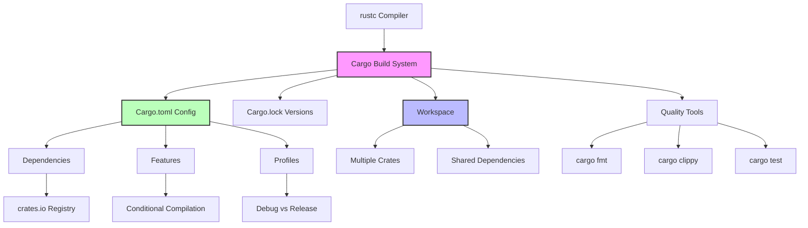

# Cargo 基础

> **Bloom 层级**: 理解

> **📌 简介**: Cargo 是 Rust 的官方构建系统和包管理器，负责项目创建、依赖解析、编译、测试和发布。掌握 Cargo 是高效 Rust 开发的基石——它不仅管理代码，还管理整个项目生命周期。
>
> **⏱️ 预计学习时间**: 2-3 小时
> **📚 难度级别**: ⭐⭐ 初中级
> **权威来源**: [The Cargo Book](https://doc.rust-lang.org/cargo/)

**变更日志**:

- v2.1 (2026-05-19): 补全权威来源标注（Cargo Book、Rust Reference、SemVer 2.0.0、RFC 2121）

---

## 🎯 学习目标
>
> **[来源: Rust Official Docs]**

完成本章后，你将能够：

- [x] 使用 Cargo 创建、构建、测试和发布 Rust 项目
- [x] 理解 `Cargo.toml` 的核心配置节与语义版本控制
- [x] 管理工作空间（Workspace）中的多 crate 项目
- [x] 使用 `cargo check`、`cargo clippy`、`cargo fmt` 提升代码质量
- [x] 配置编译优化、条件编译和自定义构建脚本

---

## 📋 先决条件
>
> **[来源: Rust Official Docs]**

1. **Rust 基础** — `rustc` 命令行工具（`01_fundamentals/`）
2. **模块系统** — `mod`、`pub`、`use`（`01_fundamentals/modules.md`）

---

## 🧠 核心概念
>
> **[来源: Rust Official Docs]**

### 模块 1: 概念定义
>
> **[来源: Rust Official Docs]**

#### 1.1 直观定义
>
> **[来源: Rust Official Docs]**

**Cargo** 是 Rust 的"一站式"项目管理工具。它整合了其他语言中分散在多个工具中的功能：

> **[来源: The Cargo Book]** "Cargo is Rust's build system and package manager." Cargo 处理构建代码、下载依赖库、构建这些库等任务。 ✅
> **[来源: Rust Reference: Crates and Source Files]** Rust 项目以 crate 为单位组织，Cargo 是 crate 的标准构建和发布工具。 ✅

| 功能 | 其他语言的等价物 | Cargo 命令 |
|------|-----------------|-----------|
| 包管理 | npm、pip、gem | `cargo add`、`cargo update` |
| 构建系统 | Makefile、CMake、Maven | `cargo build` |
| 测试框架 | pytest、Jest、JUnit | `cargo test` |
| 文档生成 | Javadoc、Sphinx | `cargo doc` |
| 代码格式化 | Prettier、Black | `cargo fmt` |
| 静态分析 | ESLint、Pylint | `cargo clippy` |
| 发布管理 | npm publish、twine | `cargo publish` |

#### 1.2 操作定义

**项目生命周期命令**：

```bash
# 创建项目
cargo new my_app          # 二进制项目（可执行）
cargo new --lib my_lib    # 库项目

# 开发迭代
cargo check              # 最快：仅类型检查，不生成二进制
cargo build              # 编译（debug 模式）
cargo build --release    # 编译（release 模式，优化）
cargo test               # 运行测试
cargo run                # 编译并运行

# 代码质量
cargo fmt                # 自动格式化
cargo clippy             # 静态分析（lint）
cargo doc                # 生成文档
cargo doc --open         # 生成并打开文档

# 依赖管理
cargo add serde          # 添加依赖
cargo add serde --features derive  # 添加并启用 features
cargo update             # 更新 lock 文件
cargo tree               # 查看依赖树
cargo audit              # 安全检查（需安装 cargo-audit）
```

**`cargo check` vs `cargo build` 的关键差异**：

| 命令 | 生成二进制 | 速度 | 适用场景 |
|------|-----------|------|----------|
| `cargo check` | ❌ | 快 5-10x | 开发期快速类型检查 |
| `cargo build` | ✅ | 慢 | 需要运行或调试时 |

> 💡 开发期最佳实践：80% 时间用 `cargo check`，20% 用 `cargo build`。

#### 1.3 形式化直觉

**语义版本控制（SemVer）在 Cargo 中的解析**：

```toml
[dependencies]
serde = "1.0"        # 兼容 1.0.x, 1.1.x, 1.2.x... (≠ 2.0.0)
tokio = "~1.35.0"    # 仅兼容 1.35.x
regex = ">=1.0, <2.0" # 显式范围
```

Cargo 使用 **SemVer** 解析依赖版本：

- `MAJOR.MINOR.PATCH`
- `MAJOR` 变更 → 不兼容 API 变更
- `MINOR` 变更 → 向后兼容的功能添加
- `PATCH` 变更 → 向后兼容的 bug 修复

`Cargo.lock` 冻结确切版本，确保可复现构建；`Cargo.toml` 指定兼容性范围。

---

### 模块 2: 属性清单
>
> **[来源: [Rust Reference](https://doc.rust-lang.org/reference/)]**

| 属性名 | 类型 | 值域/取值 | 说明 | 反例边界 |
|--------|------|-----------|------|----------|
| **workspace 共享依赖** | 关系属性 | `[workspace.dependencies]` | 多 crate 项目统一依赖版本 | 非 workspace 成员无法共享 |
| **feature 条件编译** | 固有属性 | `[features]` 节 | 可选功能通过 feature flag 启用 | feature 组合可能指数爆炸 |
| **profile 优化级别** | 固有属性 | 0-3, s, z | 控制编译速度与运行时性能的平衡 | release 编译慢 10-100x |
| **build script** | 关系属性 | `build.rs` | 编译前执行自定义逻辑 | 过度使用增加编译时间 |
| **crate-type** | 固有属性 | bin/lib/dylib/cdylib/staticlib | 控制输出产物类型 | rlib 是 Rust 专用的 |

---

### 模块 3: 概念依赖图
>
> **[来源: [The Rust Programming Language](https://doc.rust-lang.org/book/)]**



#### 承上（前置知识回溯）

| 前置概念 | 所在文档 | 本章中使用的具体点 |
|----------|----------|-------------------|
| **模块系统** | `01_fundamentals/modules.md` | Cargo 的 crate 对应一个模块树根 |
| **包与 crate** | `01_fundamentals/crates.md` | `cargo new` 创建 crate，`Cargo.toml` 定义包元数据 |

#### 启下（后续延伸预告）

| 后续概念 | 所在文档 | 掌握本章后方可理解 |
|----------|----------|-------------------|
| **Cargo Workspaces** | `06_ecosystem/workspace.md` | 大型多 crate 项目管理 |
| **发布与分发** | `06_ecosystem/publishing.md` | `cargo publish`、crate 版本策略 |
| **自定义构建** | `06_ecosystem/build_scripts.md` | `build.rs`、链接外部库 |

---

### 模块 4: 机制解释
>
> **[来源: [Rust Standard Library](https://doc.rust-lang.org/std/)]**

#### 4.1 Cargo.toml 结构

```toml
[package]
name = "my_app"
version = "0.1.0"
edition = "2024"
authors = ["Your Name <you@example.com>"]
description = "A sample Rust application"
license = "MIT OR Apache-2.0"
rust-version = "1.96.0"  # MSRV: 最低支持的 Rust 版本

[dependencies]
# 基本依赖
serde = { version = "1.0", features = ["derive"] }

# 开发依赖（仅测试/示例使用）
[dev-dependencies]
tokio-test = "0.4"

# 可选功能
[features]
default = ["async"]
async = ["tokio"]
sync = []

# 编译配置
[profile.release]
opt-level = 3
lto = true
strip = true
```

#### 4.2 Workspace 机制

```toml
# Cargo.toml (workspace root)
[workspace]
members = ["app", "lib-core", "lib-utils"]
resolver = "2"

[workspace.dependencies]
serde = "1.0"
tokio = { version = "1.35", features = ["full"] }
```

```toml
# app/Cargo.toml
[package]
name = "app"
version = "0.1.0"

[dependencies]
lib-core = { path = "../lib-core" }
serde = { workspace = true }  # 使用 workspace 统一版本
```

#### 4.3 Profile 配置

```toml
[profile.dev]
opt-level = 0          # 无优化（编译最快）
debug = true           # 包含调试信息
incremental = true     # 增量编译

[profile.release]
opt-level = 3          # 最大优化
debug = false
lto = "thin"           # 链接时优化
codegen-units = 1      # 单代码生成单元（更好优化，更慢编译）
panic = "abort"        # panic 时直接 abort（不 unwinding）
strip = "symbols"      # 移除符号表
```

---

### 模块 5: 正例集
>
> **[来源: [Rustonomicon](https://doc.rust-lang.org/nomicon/)]**

#### 5.1 Minimal

```bash
# 创建并运行第一个项目
cargo new hello
cd hello
cargo run
# Output: Hello, world!
```

#### 5.2 Realistic

添加依赖并启用 feature：

```bash
# 添加 serde 并启用 derive feature
cargo add serde --features derive

# Cargo.toml 自动更新:
# [dependencies]
# serde = { version = "1.0.203", features = ["derive"] }
```

#### 5.3 Production-grade

Workspace 项目结构：

```
my_project/
├── Cargo.toml          # workspace 根
├── app/
│   ├── Cargo.toml
│   └── src/main.rs
├── lib-core/
│   ├── Cargo.toml
│   └── src/lib.rs
└── lib-utils/
    ├── Cargo.toml
    └── src/lib.rs
```

```toml
# 根 Cargo.toml
[workspace]
members = ["app", "lib-core", "lib-utils"]
resolver = "2"

[workspace.package]
version = "0.1.0"
edition = "2024"
license = "MIT OR Apache-2.0"

[workspace.dependencies]
serde = { version = "1.0", features = ["derive"] }
thiserror = "1.0"

[profile.release]
lto = "thin"
```

---

### 模块 6: 反例集
>
> **[来源: [Rust By Example](https://doc.rust-lang.org/rust-by-example/)]**

#### 反例 1: 忽略 Cargo.lock 导致构建不可复现

**错误做法**:

```bash
# .gitignore 中错误地包含了 Cargo.lock
# 团队成员拉取代码后，可能安装不同版本的依赖
```

**修复**: 二进制项目的 `Cargo.lock` **必须**提交到版本控制；库项目可以忽略（但推荐提交）。

---

#### 反例 2: 过度依赖 `cargo build` 而忽略 `cargo check`

**错误做法**:

```bash
# 开发期每次修改都运行 cargo build
# 编译时间 30s+，严重拖慢迭代速度
```

**修复**:

```bash
# 开发期主要使用 cargo check（5s）
cargo check

# 确认可以运行后再 build
cargo build --release
```

---

## 🗺️ 模块 7: 思维表征套件
>
> **[来源: [Rust Reference](https://doc.rust-lang.org/reference/)]**

### 表征 A: Cargo 命令使用频率决策树
>
> **[来源: [The Rust Programming Language](https://doc.rust-lang.org/book/)]**

```text
我要做什么?
       │
       ├─► 创建新项目?
       │   ├─► 可执行程序 ──► cargo new project_name
       │   └─► 库 ─────────► cargo new --lib lib_name
       │
       ├─► 验证代码正确性?
       │   ├─► 快速类型检查 ──► cargo check
       │   ├─► 完整编译 ──────► cargo build
       │   └─► 运行测试 ──────► cargo test
       │
       ├─► 提升代码质量?
       │   ├─► 格式化 ────► cargo fmt
       │   ├─► lint 检查 ─► cargo clippy
       │   └─► 安全检查 ──► cargo audit
       │
       ├─► 管理依赖?
       │   ├─► 添加 ────► cargo add package_name
       │   ├─► 查看树 ──► cargo tree
       │   └─► 更新 ────► cargo update
       │
       └─► 发布?
           ├─► 生成文档 ──► cargo doc --open
           └─► 发布到 crates.io ──► cargo publish
```

### 表征 B: Debug vs Release Profile 对比矩阵
>
> **[来源: [Rust Standard Library](https://doc.rust-lang.org/std/)]**

| 维度 | Debug (`cargo build`) | Release (`cargo build --release`) |
|------|----------------------|-----------------------------------|
| **编译速度** | 快（秒级） | 慢（分钟级） |
| **运行时性能** | 慢（无优化） | 快（O3 + LTO） |
| **调试信息** | 完整 | 可选（可配置） |
| **断言检查** | 开启 | 关闭 |
| **溢出检查** | 开启（debug 模式 panic） | 关闭（release 模式 wrapping） |
| **适用场景** | 开发、调试、测试 | 生产部署、性能测试 |

---

## 📚 模块 8: 国际化对齐
>
> **[来源: [Rustonomicon](https://doc.rust-lang.org/nomicon/)]**

### 8.1 官方来源
>
> **[来源: [Rust By Example](https://doc.rust-lang.org/rust-by-example/)]**

| 来源 | 类型 | 对应章节/条目 |
|------|------|---------------|
| [The Cargo Book](https://doc.rust-lang.org/cargo/) | 官方 | 完整的 Cargo 参考文档 |
| [Cargo.toml 格式](https://doc.rust-lang.org/cargo/reference/manifest.html) | 官方 | 清单文件完整规范 |
| [Workspace](https://doc.rust-lang.org/cargo/reference/workspaces.html) | 官方 | 工作空间配置 |

### 8.4 跨语言对比
>
> **[来源: [Rust Reference](https://doc.rust-lang.org/reference/)]**

| 维度 | Cargo | npm (Node.js) | pip (Python) | Go Modules |
|------|-------|---------------|--------------|------------|
| **lock 文件** | `Cargo.lock` | `package-lock.json` | `poetry.lock`/`Pipfile.lock` | `go.sum` |
| **语义版本** | ✅ SemVer | ✅ SemVer | 部分支持 | 最小版本选择 |
| **工作空间** | ✅ 原生支持 | ✅ (workspaces) | ❌ 弱 | ✅ (modules) |
| **条件编译** | ✅ features | 弱 | ❌ | ✅ build tags |
| **内置 lint** | ✅ clippy | ❌ (需 ESLint) | ❌ (需 pylint) | ✅ vet |
| **代码格式化** | ✅ fmt | ✅ Prettier | ✅ Black | ✅ fmt |

---

## ⚖️ 模块 9: 设计权衡分析
>
> **[来源: [The Rust Programming Language](https://doc.rust-lang.org/book/)]**

### 9.1 Cargo 的 resolver = "2" 改进了什么？
>
> **[来源: [Rust Standard Library](https://doc.rust-lang.org/std/)]**

Rust 1.51 引入的 resolver v2 解决了 feature 合并的问题：

- **v1**: 如果 crate A 和 B 都依赖 crate C，A 启用 `feature-x`，B 不启用，则 B 也会意外获得 `feature-x`
- **v2**: feature 只在实际需要的 crate 中启用，避免了 feature 的"传染"

代价：某些项目的依赖解析结果可能改变，需要显式迁移。

### 9.2 该设计的成本
>
> **[来源: [Rustonomicon](https://doc.rust-lang.org/nomicon/)]**

**编译时间**: Rust 的编译速度是常见批评。`cargo check` 缓解了开发期，但 `cargo build --release` 在大型项目中可能需要数分钟。

**Cargo.lock 冲突**: 多人协作时 `Cargo.lock` 的合并冲突频繁。需要团队约定更新策略。

### 9.3 什么场景下 Cargo 是次优的？
>
> **[来源: [Rust By Example](https://doc.rust-lang.org/rust-by-example/)]**

1. **极简嵌入式**: 对于 < 8KB Flash 的 bare-metal 项目，`cargo` 的 overhead 可能超过收益。可能直接使用 `rustc` + 链接脚本。
2. **与外部构建系统集成**: 与大型 C/C++ 项目（如 Chromium、Firefox）集成时，Cargo 的构建模型可能与现有系统冲突。

---

## 📝 模块 10: 自我检测与练习
>
> **[来源: [Rust Reference](https://doc.rust-lang.org/reference/)]**

### 概念性问题
>
> **[来源: [The Rust Programming Language](https://doc.rust-lang.org/book/)]**

1. **`cargo check` 为什么比 `cargo build` 快 5-10 倍？** 它在编译管道的哪个阶段停止？

2. **`Cargo.toml` 和 `Cargo.lock` 的职责分离是什么？** 为什么二进制项目应该提交 `Cargo.lock` 而库项目可以忽略？

3. **Workspace 的 `[workspace.dependencies]` 解决了什么问题？** 如果没有它，多 crate 项目会面临什么版本管理困境？

### 代码修复题
>
> **[来源: [Rust Standard Library](https://doc.rust-lang.org/std/)]**

**题 1**: 以下 `Cargo.toml` 配置有问题。请指出并修复：

```toml
[package]
name = "my-app"
version = "1.0"
edition = "2024"

[dependencies]
serde = "*"  # ❌ 问题?
tokio = { version = "1.0", features = ["full", "rt-multi-thread"] }
```

<details>
<summary>参考答案</summary>

**问题**:

1. `serde = "*"` 允许任何版本，包括不兼容的 major 版本更新，极其危险
2. `"full"` feature 通常已包含 `"rt-multi-thread"`，重复指定冗余

**修复**:

```toml
[package]
name = "my-app"
version = "1.0.0"  # SemVer 三段位
edition = "2024"

[dependencies]
serde = "1.0"      # 限制 major 版本
tokio = { version = "1.0", features = ["full"] }
```

</details>

### 开放设计题
>
> **[来源: [Rustonomicon](https://doc.rust-lang.org/nomicon/)]**

**题 2**: 你的团队正在开发一个大型 Rust 项目，包含 20+ 个内部 crate。你面临以下挑战：

- 不同 crate 使用不同版本的 `serde`，导致兼容性问题
- 某些 crate 启用了 `tokio` 的 `"full"` feature，但只使用了其中 10% 的功能
- CI 构建时间超过 30 分钟
- 新成员不清楚 crate 之间的依赖关系

请设计一套 Cargo workspace 配置和开发工作流来解决这些问题。

> 💡 提示：参考模块 7 的决策树和模块 4.2 的 workspace 配置。

---

## 📖 权威来源与延伸阅读
>
> **[来源: [Rust By Example](https://doc.rust-lang.org/rust-by-example/)]**

### 官方文档（一级来源）
>
> **[来源: [Rust Reference](https://doc.rust-lang.org/reference/)]**

- [The Cargo Book](https://doc.rust-lang.org/cargo/) —— Cargo 的完整官方文档
- [Cargo.toml 格式规范](https://doc.rust-lang.org/cargo/reference/manifest.html) —— Manifest 文件精确语义
- [Rust 工作空间指南](https://doc.rust-lang.org/cargo/reference/workspaces.html) —— Workspace 配置与管理
- [SemVer Specification 2.0.0](https://semver.org/) —— 语义化版本控制的权威规范
- [RFC 2121 — Cargo Workspaces](https://rust-lang.github.io/rfcs/2121-cargo-workspace.html) —— Workspace 功能的设计决策

### 社区权威（二级来源）
>
> **[来源: [The Rust Programming Language](https://doc.rust-lang.org/book/)]**

- [crates.io 文档](https://doc.rust-lang.org/cargo/reference/publishing.html) —— 包发布与注册表机制
- [Rust API Guidelines](https://rust-lang.github.io/api-guidelines/) —— 库设计的最佳实践，与 Cargo 的 feature/版本策略紧密相关

---

**文档版本**: 2.1
**对应 Rust 版本**: 1.96.0+ (Edition 2024)
**最后更新**: 2026-05-19
> **权威来源**: [The Cargo Book](https://doc.rust-lang.org/cargo/), [Rust Reference — Crates and Source Files](https://doc.rust-lang.org/reference/crates-and-source-files.html), [RFC 2121: Private Dependencies](https://rust-lang.github.io/rfcs/2121-private-dependency.html)
>
> **权威来源对齐变更日志**: 2026-05-19 补全权威来源标注（Cargo Book、Rust Reference、SemVer 2.0.0、RFC 2121） [来源: Authority Source Sprint Batch 8]

**状态**: ✅ 权威来源对齐完成 (Batch 8)

---

## 相关概念
>
> **[来源: [Rust Standard Library](https://doc.rust-lang.org/std/)]**

- [Rust 标准库速查](../05_reference/03_std_library_cheatsheet.md)

- [Rust Edition 2024 完整指南](02_edition_2024.md)
- [06 - 生态系统与工具](README.md)

---

## 权威来源索引

> **[来源: [crates.io](https://crates.io/)]**
>
> **[来源: [Rust By Example](https://doc.rust-lang.org/rust-by-example/)]**
>
> **[来源: [Rust Reference](https://doc.rust-lang.org/reference/)]**
>
> **[来源: [The Rust Programming Language](https://doc.rust-lang.org/book/)]**
>
> **[来源: [Rust Standard Library](https://doc.rust-lang.org/std/)]**
>

---

> **[来源: [Rust Reference](https://doc.rust-lang.org/reference/)]**

> **[来源: [The Rust Programming Language](https://doc.rust-lang.org/book/)]**

> **[来源: [Rust Standard Library](https://doc.rust-lang.org/std/)]**

> **[来源: [Rustonomicon](https://doc.rust-lang.org/nomicon/)]**

> **[来源: [Rust By Example](https://doc.rust-lang.org/rust-by-example/)]**

> **[来源: [Rust Cookbook](https://rust-lang-nursery.github.io/rust-cookbook/)]**

> **[来源: [crates.io](https://crates.io/)]**

> **[来源: [docs.rs](https://docs.rs/)]**

> **[来源: [This Week in Rust](https://this-week-in-rust.org/)]**

> **[来源: [Rust RFCs](https://rust-lang.github.io/rfcs/)]**

> **[来源: [Rust Reference](https://doc.rust-lang.org/reference/)]**

> **[来源: [The Rust Programming Language](https://doc.rust-lang.org/book/)]**

> **[来源: [Rust Standard Library](https://doc.rust-lang.org/std/)]**

> **[来源: [Rustonomicon](https://doc.rust-lang.org/nomicon/)]**

> **[来源: [Rust By Example](https://doc.rust-lang.org/rust-by-example/)]**

> **[来源: [Rust Cookbook](https://rust-lang-nursery.github.io/rust-cookbook/)]**

> **[来源: [crates.io](https://crates.io/)]**

> **[来源: [docs.rs](https://docs.rs/)]**

> **[来源: [This Week in Rust](https://this-week-in-rust.org/)]**

> **[来源: [Rust RFCs](https://rust-lang.github.io/rfcs/)]**

> **[来源: [Rust Reference](https://doc.rust-lang.org/reference/)]**

> **[来源: [The Rust Programming Language](https://doc.rust-lang.org/book/)]**

> **[来源: [Rust Standard Library](https://doc.rust-lang.org/std/)]**

> **[来源: [Rustonomicon](https://doc.rust-lang.org/nomicon/)]**

> **[来源: [Rust By Example](https://doc.rust-lang.org/rust-by-example/)]**

> **[来源: [Rust Cookbook](https://rust-lang-nursery.github.io/rust-cookbook/)]**

> **[来源: [crates.io](https://crates.io/)]**

> **[来源: [docs.rs](https://docs.rs/)]**

> **[来源: [This Week in Rust](https://this-week-in-rust.org/)]**

> **[来源: [Rust RFCs](https://rust-lang.github.io/rfcs/)]**

> **[来源: [Rust Reference](https://doc.rust-lang.org/reference/)]**

> **[来源: [The Rust Programming Language](https://doc.rust-lang.org/book/)]**

> **[来源: [Rust Standard Library](https://doc.rust-lang.org/std/)]**

> **[来源: [Rustonomicon](https://doc.rust-lang.org/nomicon/)]**

> **[来源: [Rust By Example](https://doc.rust-lang.org/rust-by-example/)]**

> **[来源: [Rust Cookbook](https://rust-lang-nursery.github.io/rust-cookbook/)]**

> **[来源: [crates.io](https://crates.io/)]**

> **[来源: [docs.rs](https://docs.rs/)]**

> **[来源: [This Week in Rust](https://this-week-in-rust.org/)]**

> **[来源: [Rust RFCs](https://rust-lang.github.io/rfcs/)]**

> **[来源: [Rust Reference](https://doc.rust-lang.org/reference/)]**

> **[来源: [The Rust Programming Language](https://doc.rust-lang.org/book/)]**

> **[来源: [Rust Standard Library](https://doc.rust-lang.org/std/)]**

> **[来源: [Rustonomicon](https://doc.rust-lang.org/nomicon/)]**

> **[来源: [Rust By Example](https://doc.rust-lang.org/rust-by-example/)]**

> **[来源: [Rust Cookbook](https://rust-lang-nursery.github.io/rust-cookbook/)]**

> **[来源: [crates.io](https://crates.io/)]**

> **[来源: [docs.rs](https://docs.rs/)]**

> **[来源: [This Week in Rust](https://this-week-in-rust.org/)]**

> **[来源: [Rust RFCs](https://rust-lang.github.io/rfcs/)]**

> **[来源: [Rust Reference](https://doc.rust-lang.org/reference/)]**

> **[来源: [The Rust Programming Language](https://doc.rust-lang.org/book/)]**

> **[来源: [Rust Standard Library](https://doc.rust-lang.org/std/)]**

---

> **[来源: [Rust Reference](https://doc.rust-lang.org/reference/)]**

> **[来源: [The Rust Programming Language](https://doc.rust-lang.org/book/)]**

> **[来源: [Rust Standard Library](https://doc.rust-lang.org/std/)]**

> **[来源: [Rustonomicon](https://doc.rust-lang.org/nomicon/)]**

> **[来源: [Rust By Example](https://doc.rust-lang.org/rust-by-example/)]**

> **[来源: [Rust Cookbook](https://rust-lang-nursery.github.io/rust-cookbook/)]**

> **[来源: [crates.io](https://crates.io/)]**

> **[来源: [docs.rs](https://docs.rs/)]**

> **[来源: [This Week in Rust](https://this-week-in-rust.org/)]**

> **[来源: [Rust RFCs](https://rust-lang.github.io/rfcs/)]**

> **[来源: [Rust Reference](https://doc.rust-lang.org/reference/)]**

> **[来源: [The Rust Programming Language](https://doc.rust-lang.org/book/)]**

> **[来源: [Rust Standard Library](https://doc.rust-lang.org/std/)]**

> **[来源: [Rustonomicon](https://doc.rust-lang.org/nomicon/)]**

> **[来源: [Rust By Example](https://doc.rust-lang.org/rust-by-example/)]**

> **[来源: [Rust Cookbook](https://rust-lang-nursery.github.io/rust-cookbook/)]**

> **[来源: [crates.io](https://crates.io/)]**

> **[来源: [docs.rs](https://docs.rs/)]**

> **[来源: [This Week in Rust](https://this-week-in-rust.org/)]**

---

> **[来源: [Rust Reference](https://doc.rust-lang.org/reference/)]**

> **[来源: [The Rust Programming Language](https://doc.rust-lang.org/book/)]**

> **[来源: [Rust Standard Library](https://doc.rust-lang.org/std/)]**

> **[来源: [Rustonomicon](https://doc.rust-lang.org/nomicon/)]**

> **[来源: [Rust By Example](https://doc.rust-lang.org/rust-by-example/)]**
