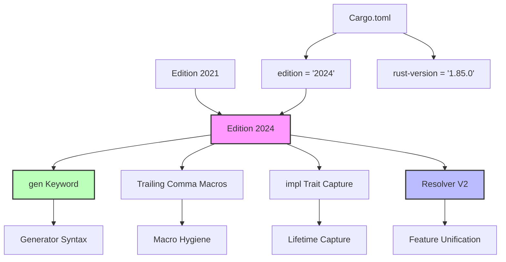

# Rust Edition 2024 完整指南

> **深度**: [综述级]
> **相关概念**: [Edition](../../concept/06_ecosystem/01_toolchain.md)
> **主轨引用**: 概念级深度分析请参阅 [concept/07_future/23_rust_edition_guide.md](../../concept/07_future/23_rust_edition_guide.md)
> **主轨引用**: 概念级深度分析请参阅 [concept/07_future/22_edition_guide.md](../../concept/07_future/22_edition_guide.md)
> **Bloom 层级**: 理解
> **版本**: Edition 2024
> **Rust 版本**: 1.85.0+ (Edition 2024 stable)
> **权威来源**: [Edition Guide](https://doc.rust-lang.org/edition-guide/rust-2024/)
>
> **受众**: [初学者] / [进阶]
> **内容分级**: [实验级]

**变更日志**:

- v1.1 (2026-05-19): 补全权威来源标注（Edition Guide、RFC 2052、Rust Blog、Lang Team Roadmap）

## 🎯 学习目标
>
> **[来源: Rust Official Docs]**

完成本章后，你将能够：

- [ ] 理解 Edition 2024 的核心变更
- [ ] 成功将项目迁移到 Edition 2024
- [ ] 区分 `gen` 关键字预留（Edition 2024 已生效）与 `gen {}` / `yield`（仍 nightly）
- [ ] 掌握新的保留字和行为变更

## 📋 先决条件
>
> **[来源: Rust Official Docs]**

- 熟悉 Rust 2021 Edition
- 理解 Cargo 和项目配置
- 有现有 Rust 项目经验

## 🧠 核心概念
>
> **[来源: Rust Official Docs]**

### 模块 1: 概念定义
>
> **[来源: Rust Official Docs]**

#### 1.1 直观定义
>
> **[来源: Rust Official Docs]**

**Edition** 是 Rust 的**兼容性边界机制**。与语义版本（SemVer）不同，Edition 允许语言在不破坏现有代码的情况下引入不兼容的语法变更。同一 crate 可以混合使用不同 Edition 的依赖。

> 💡 关键直觉：SemVer 说"这个版本兼容"，Edition 说"这个项目选择这套规则"。
> **[来源: Rust Edition Guide]** "Editions are a mechanism for the Rust project to introduce changes into the language that would otherwise be backwards incompatible." ✅
> **[来源: RFC 2052 — Epochs]** Edition（原称 Epoch）机制允许编译器根据 `Cargo.toml` 中的 `edition` 字段选择不同的语法分析器前端。 ✅
> **[来源: Rust Reference: Editions]** 同一编译器二进制可同时支持多个 Edition，混合 Edition 的依赖可链接为同一二进制。 ✅

#### 1.2 操作定义

**Edition 的工作机制**：

```text
Crate A (Edition 2021)          Crate B (Edition 2024)
     │                                │
     │ 调用                           │ 调用
     ▼                                ▼
  编译器使用 2021 规则解析         编译器使用 2024 规则解析
     │                                │
     └────────────┬───────────────────┘
                  │
            链接为同一二进制
```

**Edition 2024 的核心变更**：

| 类别 | 变更 | 影响范围 | 自动修复 |
|------|------|----------|----------|
| **保留字** | `gen` 成为关键字 | 使用 `gen` 作为标识符的代码 | ✅ `cargo fix` |
| **宏规则** | 尾逗号处理更一致 | 宏定义和调用 | ✅ `cargo fix` |
| **类型系统** | `impl Trait` 精确捕获 | 返回 `impl Fn` 的闭包 | ⚠️ 部分需手动 |
| **Cargo** | 默认特性解析器 v2 | feature 组合行为 | ✅ 自动生效 |
| **标准库** | 新 API 稳定化 | 新增方法可用 | — |

#### 1.3 形式化直觉

Edition 在编译器中的实现：编译器根据 `Cargo.toml` 中的 `edition` 字段选择**语法分析器前端**。同一编译器二进制可以同时支持多个 Edition 的解析规则。

---

### 模块 2: 属性清单
>
> **[来源: [Rust Reference](https://doc.rust-lang.org/reference/)]**

| 属性名 | 类型 | 值域/取值 | 说明 | 反例边界 |
|--------|------|-----------|------|----------|
| **Edition 隔离** | 固有属性 | crate 边界 | 不同 Edition 的 crate 可以无缝互操作 | 同一 crate 内只能用一个 Edition |
| **自动迁移** | 关系属性 | `cargo fix --edition` | 大多数变更可自动修复 | `impl Trait` 捕获需手动确认 |
| **关键字预留** | 固有属性 | 提前 1-2 个 Edition | `gen` 在 2024 预留，2026+ 启用 | 原始标识符 `r#gen` 可绕过 |
| **MSRV 绑定** | 关系属性 | `rust-version` | Edition 2024 要求 rustc >= 1.85 | 旧编译器无法编译 |

---

### 模块 3: 概念依赖图
>
> **[来源: [The Rust Programming Language](https://doc.rust-lang.org/book/)]**



#### 承上（前置知识回溯）

| 前置概念 | 所在文档 | 本章中使用的具体点 |
|----------|----------|-------------------|
| **Cargo.toml** | `06_ecosystem/cargo_basics.md` | `edition` 和 `rust-version` 字段 |
| **宏规则** | `03_advanced/macros/declarative.md` | 尾逗号宏规则的变更 |
| **impl Trait** | `02_intermediate/traits.md` | `impl Trait` 的生命周期捕获 |

#### 启下（后续延伸预告）

| 后续概念 | 所在文档 | 掌握本章后方可理解 |
|----------|----------|-------------------|
| **Async Generators** | `03_advanced/async/` | `gen` 关键字在异步生成器中的应用 |
| **Cargo Workspaces** | `06_ecosystem/workspace.md` | 多 crate 项目的 Edition 迁移策略 |

---

### 1. Edition 2024 主要特性
>
> **[来源: [Rust Standard Library](https://doc.rust-lang.org/std/)]**

| 类别 | 变更 | 影响 | 迁移难度 |
|------|------|------|----------|
| 语言 | `gen` 关键字预留 | 可能破坏代码 | 低 |
| 语言 | 尾逗号宏规则 | 行为变更 | 低 |
| 语言 | `impl Trait` 作用域 | 更精确 | 中 |
| Cargo | 默认特性解析 | 新解析器 | 中 |
| Cargo | 新的依赖解析 | 可能冲突 | 中 |
| 标准库 | 新API稳定化 | 新增功能 | 低 |

### 2. 迁移步骤
>
> **[来源: [Rustonomicon](https://doc.rust-lang.org/nomicon/)]**

#### 2.1 自动迁移

```bash
# 1. 确保使用最新 Rust
cargo update

# 2. 运行迁移工具
cargo fix --edition

# 3. 更新 Cargo.toml
# edition = "2024"

# 4. 验证迁移
cargo build
cargo test
```

#### 2.2 手动检查清单

```markdown
## 迁移检查清单
> **[来源: [Rust By Example](https://doc.rust-lang.org/rust-by-example/)]**

### Cargo.toml 更新
> **[来源: [Rust Reference](https://doc.rust-lang.org/reference/)]**
- [ ] 更新 `edition = "2024"`
- [ ] 更新 `rust-version = "1.85.0"`
- [ ] 检查依赖兼容性

### 代码变更
> **[来源: [The Rust Programming Language](https://doc.rust-lang.org/book/)]**
- [ ] 检查 `gen` 作为标识符
- [ ] 检查宏尾逗号使用
- [ ] 检查 `impl Trait` 捕获
- [ ] 检查 `#[repr(C)]` 枚举

### 测试验证
> **[来源: [Rust Standard Library](https://doc.rust-lang.org/std/)]**
- [ ] `cargo build` 通过
- [ ] `cargo test` 通过
- [ ] `cargo clippy` 无严重警告
- [ ] 运行集成测试
```

### 3. gen 关键字预留
>
> **[来源: [Rustonomicon](https://doc.rust-lang.org/nomicon/)]**

`gen` 将成为关键字，用于 generators。

#### 3.1 需要修改的代码

```rust,ignore
// Rust 2021 - 合法
struct gen;  // 名为 gen 的类型
fn gen() {}  // 名为 gen 的函数

// Rust 2024 - 非法（编译错误）
struct gen;  // ERROR: expected identifier, found keyword `gen`
fn gen() {}  // ERROR: expected identifier, found keyword `gen`

// 解决方案：使用 r# 原始标识符
struct r#gen;  // ✅ 使用原始标识符
fn r#gen() {}  // ✅
```

#### 3.2 迁移工具处理

```bash
# cargo fix 会自动转换
cargo fix --edition
# 输出：warning: `gen` is a keyword in Edition 2024
```

### 4. 尾逗号宏规则
>
> **[来源: [Rust By Example](https://doc.rust-lang.org/rust-by-example/)]**

宏匹配规则对尾逗号的处理更一致。

```rust,ignore
// Rust 2021 - 某些情况下不匹配
macro_rules! example {
    ($e:expr,)* => {};  // 不匹配尾逗号
}

// Rust 2024 - 自动处理尾逗号
macro_rules! example {
    ($e:expr $(,)?) => {};  // $(,)? 可选逗号
}
```

### 5. impl Trait 精确捕获
>
> **[来源: [Rust Reference](https://doc.rust-lang.org/reference/)]**

`impl Trait` 的捕获规则更加精确。

```rust,ignore
// Rust 2021 - 捕获所有生命周期
fn foo(x: &i32) -> impl Fn() -> &i32 {
    || x  // 捕获 x 的生命周期
}

// Rust 2024 - 需要显式捕获
fn foo(x: &i32) -> impl Fn() -> &i32 + use<'_> {
    || x  // 显式捕获 '_
}
```

## 💻 实战迁移
>
> **[来源: [The Rust Programming Language](https://doc.rust-lang.org/book/)]**

### 示例项目迁移
>
> **[来源: [Rust Standard Library](https://doc.rust-lang.org/std/)]**

#### 步骤 1：备份

```bash
git checkout -b edition-2024-migration
git add .
git commit -m "Pre-Edition 2024 backup"
```

#### 步骤 2：运行自动修复

```bash
cargo fix --edition --allow-dirty
```

#### 步骤 3：更新 Cargo.toml

```toml
[package]
name = "my-project"
version = "1.0.0"
edition = "2024"
rust-version = "1.85.0"

[dependencies]
# 确保依赖支持 Edition 2024
```

#### 步骤 4：处理手动变更

```rust,ignore
// 前：可能使用 gen 作为变量名
let gen = || { /* ... */ };

// 后：使用其他名称
let generator = || { /* ... */ };
```

#### 步骤 5：验证

```bash
cargo build --all-targets
cargo test
cargo clippy -- -D warnings
```

### 迁移常见问题
>
> **[来源: [Rustonomicon](https://doc.rust-lang.org/nomicon/)]**

#### 问题 1：依赖不支持 Edition 2024

```toml
# 检查依赖的 edition
# 在 Cargo.lock 中查看

# 解决方案：
# 1. 等待依赖更新
# 2. 寻找替代依赖
# 3. 暂时保持 Edition 2021
```

#### 问题 2：宏规则变更导致编译失败

```rust
// 前：
macro_rules! foo {
    ($($x:expr),*) => {};  // Rust 2021
}

// 后：
macro_rules! foo {
    ($($x:expr),* $(,)?) => {};  // Rust 2024
}
```

---

## 🗺️ 模块 7: 思维表征
>
> **[来源: [Rust By Example](https://doc.rust-lang.org/rust-by-example/)]**

### 表征 A: Edition 迁移决策树
>
> **[来源: [Rust Reference](https://doc.rust-lang.org/reference/)]**

```text
是否迁移到 Edition 2024?
       │
       ├─► Rust 版本 < 1.85?
       │   └─► 是 ──► 先升级 Rust 工具链
       │
       ├─► 依赖是否都支持 Edition 2024?
       │   ├─► 否 ──► 等待依赖更新或保持 2021
       │   └─► 是 ──► 继续评估
       │
       ├─► 代码是否使用 `gen` 作为标识符?
       │   ├─► 是 ──► 评估重命名成本
       │   └─► 否 ──► 低风险
       │
       ├─► 是否大量使用自定义宏?
       │   ├─► 是 ──► 测试尾逗号行为变更
       │   └─► 否 ──► 低风险
       │
       └─► 执行迁移:
           1. git checkout -b edition-2024
           2. cargo fix --edition
           3. 手动检查 impl Trait 捕获
           4. cargo test
           5. cargo clippy
           6. 合并分支
```

### 表征 B: Edition 2024 变更影响矩阵
>
> **[来源: [The Rust Programming Language](https://doc.rust-lang.org/book/)]**

| 变更 | 影响代码比例 | 自动修复 | 运行时影响 | 回滚难度 |
|------|------------|----------|-----------|---------|
| `gen` 关键字 | < 1% | ✅ | 无 | 低（改标识符名） |
| 尾逗号宏 | < 5% | ✅ | 无 | 低 |
| `impl Trait` 捕获 | < 5% | ⚠️ | 无 | 中 |
| Resolver V2 | 100%（feature） | ✅ | 无 | 低 |
| 新标准库 API | 可选使用 | — | 无 | — |

---

## ⚠️ 常见陷阱
>
> **[来源: [Rust Standard Library](https://doc.rust-lang.org/std/)]**

| 问题 | 症状 | 解决方案 |
|------|------|----------|
| `gen` 标识符冲突 | 编译错误 | 重命名或使用 `r#gen` |
| 依赖版本冲突 | 解析错误 | 更新依赖或锁定版本 |
| 宏规则变更 | 宏不匹配 | 添加 `$(,)?` |
| impl Trait 捕获 | 生命周期错误 | 添加 `+ use<'_>` |

## 🎮 练习
>
> **[来源: [Rustonomicon](https://doc.rust-lang.org/nomicon/)]**

### 练习 1：迁移小项目
>
> **[来源: [Rust By Example](https://doc.rust-lang.org/rust-by-example/)]**

选择一个现有的 Rust 项目，将其迁移到 Edition 2024。

### 练习 2：处理 gen 关键字
>
> **[来源: [Rust Reference](https://doc.rust-lang.org/reference/)]**

创建一个使用 `gen` 作为标识符的项目，然后迁移到 Edition 2024。

<details>
<summary>参考答案</summary>

```rust,ignore
// lib.rs - Rust 2021
pub struct gen<T>(pub T);

impl<T> gen<T> {
    pub fn new(value: T) -> Self {
        gen(value)
    }
}

// 迁移后 - Rust 2024
// 选项 1：使用原始标识符
pub struct r#gen<T>(pub T);

// 选项 2：重命名
pub struct Generator<T>(pub T);
```

</details>

## 📚 模块 8: 国际化对齐
>
> **[来源: [The Rust Programming Language](https://doc.rust-lang.org/book/)]**

| 来源 | 类型 | 说明 |
|------|------|------|
| [Edition Guide 2024](https://doc.rust-lang.org/edition-guide/rust-2024/) | 官方 | Edition 2024 完整迁移指南 |
| [Rust 1.85 Release](https://blog.rust-lang.org/2025/02/20/Rust-1.85.0.html) | 官方 | Edition 2024 / async closures 稳定化公告 |

### 跨语言对比
>
> **[来源: [Rust Standard Library](https://doc.rust-lang.org/std/)]**

| 维度 | Rust (Edition) | C++ (Standard) | Java (LTS) | Go |
|------|---------------|----------------|------------|-----|
| **兼容策略** | Edition 隔离 | 标准版本 | LTS 版本 | 无（直接升级） |
| **混合使用** | ✅ 同一二进制 | ❌ 需重新编译 | ✅ 字节码兼容 | ✅ |
| **自动迁移工具** | ✅ `cargo fix` | ❌ 无 | ❌ 无 | ❌ 无 |
| **发布周期** | ~3 年 | ~3 年 | ~2 年 | ~6 个月 |

> **关键差异**: Rust 的 Edition 机制是唯一允许**同一编译器同时支持多版本语法**的设计。C++ 和 Java 的版本升级是全局的，Rust 的 Edition 是 crate 级别的选择。

---

## ⚖️ 模块 9: 设计权衡分析
>
> **[来源: [Rustonomicon](https://doc.rust-lang.org/nomicon/)]**

### 为什么 Rust 需要 Edition 机制？
>
> **[来源: [Rust By Example](https://doc.rust-lang.org/rust-by-example/)]**

C++ 的"永远向后兼容"导致语言复杂度累积（如 `auto` 的语义变更）。Rust 选择 Edition 机制：

1. **不牺牲演进**: 可以清理历史包袱（如 `gen` 预留）
2. **不破坏生态**: 旧 crate 无需修改即可继续使用
3. **平滑迁移**: `cargo fix --edition` 自动化大部分变更

代价：编译器需要维护多个语法分析前端，增加了编译器复杂度。

---

## 🔮 未来展望
>
> **[来源: [Rust Reference](https://doc.rust-lang.org/reference/)]**

### `gen` 关键字预留 vs `gen {}` / `yield`
>
> **[来源: [Rust Reference](https://doc.rust-lang.org/reference/)]** · **[来源: [Rust Edition Guide 2024](https://doc.rust-lang.org/edition-guide/rust-2024/index.html)]**

- **Edition 2024 已生效**：`gen` 成为保留关键字，用作标识符的代码需重命名为 `r#gen` 或改名。
- **尚未 stable**：`gen {}` 块与 `yield` 表达式仍需要 nightly feature `#![feature(gen_blocks, yield_expr)]`。

```rust,ignore
// ✅ Edition 2024 下会报错：gen 是保留关键字
fn gen() -> i32 { 42 }

// 🧪 nightly 下的 gen block（截至 Rust 1.96.0 仍 unstable）
#![feature(gen_blocks, yield_expr)]
fn fibonacci() -> impl Iterator<Item = u64> {
    gen {
        let mut a = 0u64;
        let mut b = 1u64;
        loop {
            yield a;
            (a, b) = (b, a + b);
        }
    }
}
```

### 版本跟踪
>
> **[来源: [Rust Standard Library](https://doc.rust-lang.org/std/)]** · **[来源: [Rust Blog](https://blog.rust-lang.org/)]**

| 版本 | 发布日期 | Edition / 关键状态 |
|------|---------|-------------------|
| 1.82.0 | 2024-10 | 部分前置语言特性已 stable：`unsafe extern` blocks、`&raw const`、`+ use<..>` precise capturing 等 |
| 1.85.0 | 2025-02 | **Edition 2024 stable**；**async closures stable** |
| 1.86.0 | 2025-04 | trait object upcasting stable |
| 1.96.0 | 2026-05 | `assert_matches!`、新 `core::range` 类型族 stable |
| nightly | — | `gen blocks`、`async_drop`、`RTN`、`AFIDT` 等仍实验中 |

> **注意**：**Rust 2024 Edition 整体在 1.85.0 stable**；1.82.0 仅 stable 了部分前置语言特性（如 `unsafe extern`、`&raw const`、`+ use<..>`），不等同于 Edition 2024 可用。

## 📖 延伸阅读
>
> **[来源: [Rustonomicon](https://doc.rust-lang.org/nomicon/)]**

- [Edition Guide 2024](https://doc.rust-lang.org/edition-guide/rust-2024/)
- [RFC: Edition 2024](https://rust-lang.github.io/rfcs/XXXX-edition-2024.html)
- [Cargo.toml 配置](https://doc.rust-lang.org/cargo/reference/manifest.html)

## 📝 模块 10: 自我检测
>
> **[来源: [Rust By Example](https://doc.rust-lang.org/rust-by-example/)]**

### 概念性问题
>
> **[来源: [Rust Reference](https://doc.rust-lang.org/reference/)]**

1. **Rust 的 Edition 机制与 SemVer 有何本质区别？** 为什么同一项目可以混合使用 Edition 2021 和 Edition 2024 的依赖？

2. **`impl Trait` 的精确捕获（`+ use<'_>`）解决了什么问题？** 为什么 Rust 2021 的"自动捕获所有生命周期"在复杂场景下会导致问题？

### 代码修复题
>
> **[来源: [The Rust Programming Language](https://doc.rust-lang.org/book/)]**

**题 1**: 以下代码在 Edition 2024 下编译失败。请修复：

```rust,ignore
fn make_closure(x: &i32) -> impl Fn() -> &i32 {
    || x
}
```

<details>
<summary>参考答案</summary>

```rust,ignore
fn make_closure(x: &i32) -> impl Fn() -> &i32 + use<'_> {
    || x
}
```

Edition 2024 要求显式捕获生命周期。`+ use<'_>` 表示捕获 `x` 的生命周期。

</details>

### 开放设计题
>
> **[来源: [Rust Standard Library](https://doc.rust-lang.org/std/)]**

**题 2**: 你的团队维护一个包含 50 个内部 crate 的大型 workspace，目前全部使用 Edition 2021。你计划迁移到 Edition 2024。请设计迁移策略：

- 是逐个 crate 迁移还是一次性全部迁移？
- 如何处理跨 crate 的 `impl Trait` 返回类型变更？
- 如果某些 crate 的依赖不支持 Edition 2024，如何决策？

---

## ✅ 自我检测
>
> **[来源: [Rustonomicon](https://doc.rust-lang.org/nomicon/)]**

1. Edition 2024 最大的语言变更是什么？
2. 如何处理 `gen` 关键字冲突？
3. `cargo fix --edition` 能自动修复哪些问题？

---

> **权威来源**: [Edition Guide](https://doc.rust-lang.org/edition-guide/rust-2024/), [RFC 2052: Epochs](https://rust-lang.github.io/rfcs/2052-epochs.html), [Rust Blog — Edition 2024](https://blog.rust-lang.org/)
>
> **权威来源对齐变更日志**: 2026-05-19 补全权威来源标注（Edition Guide、RFC 2052、Rust Blog、Lang Team Roadmap） [来源: Authority Source Sprint Batch 8]

**文档版本**: 1.1
**对应 Rust 版本**: 1.85.0+ (Edition 2024)
**最后更新**: 2026-05-19
**状态**: ✅ 权威来源对齐完成 (Batch 8)

---

## 相关概念
>
> **[来源: [Rust By Example](https://doc.rust-lang.org/rust-by-example/)]**

- [Rust 标准库速查](../05_reference/03_std_library_cheatsheet.md)

- [Cargo 基础](01_cargo_basics.md)
- [06 - 生态系统与工具](README.md)

---

## 权威来源索引

> **[来源: [crates.io](https://crates.io/)]**
>
> **[来源: [Rust By Example](https://doc.rust-lang.org/rust-by-example/)]**
>
> **[来源: [Rust Reference](https://doc.rust-lang.org/reference/)]**
>
> **[来源: [The Rust Programming Language](https://doc.rust-lang.org/book/)]**
>
> **[来源: [Rust Standard Library](https://doc.rust-lang.org/std/)]**
>

---

## 认知路径

> **认知路径**: 从 Rust 核心语言特性出发，经由 **Rust 2024 Edition（1.85.0+ stable）** 的生态/前沿实践，通向系统化工程能力与未来语言演进方向。

### 核心推理链

| 定理 | 前提 | 结论 | 置信度 |
| :--- | :--- | :--- | :--- |
| Rust 2024 Edition（1.85.0+ stable） 基础原理 ⟹ 正确选型 | 理解核心概念与适用边界 | 能在实际项目中做出合理决策 | 高 |
| Rust 2024 Edition（1.85.0+ stable） 选型实践 ⟹ 常见陷阱 | 忽视版本兼容性与生态成熟度 | 技术债务或迁移成本 | 中 |
| Rust 2024 Edition（1.85.0+ stable） 陷阱规避 ⟹ 深度掌握 | 持续跟踪社区演进与最佳实践 | 能进行架构设计与技术预研 | 高 |

> **过渡**: 掌握 Rust 2024 Edition（1.85.0+ stable） 的基础概念后，建议通过实际案例与源码阅读加深理解，建立从理论到实践的桥梁。
> **过渡**: 在工程实践中应用 Rust 2024 Edition（1.85.0+ stable） 时，务必评估生态成熟度、社区支持与长期维护风险，避免过度依赖尚未稳定的 nightly 扩展（如 `gen {}`、`async_drop`、`RTN`）。
> **过渡**: Rust 2024 Edition（1.85.0+ stable） 反映了 Rust 生态系统的演进趋势与语言设计哲学，理解这些趋势有助于预判未来发展方向并做出前瞻性技术决策。

### 反命题与边界

> **反命题**: "Rust 2024 Edition（1.85.0+ stable） 是万能解决方案，适用于所有场景" —— 错误。任何技术选择都有权衡，需根据具体需求、团队能力与项目约束综合评估。

## 嵌入式测验（Embedded Quiz）

### 测验 1：Rust Edition 2024 相比 2021 有哪些主要变化？（理解层）

**题目**: Rust Edition 2024 相比 2021 有哪些主要变化？

<details>
<summary>✅ 答案与解析</summary>

`gen` 关键字预留（不是 `gen {}` 稳定）、`if let` 临时生命周期延长、`unsafe_op_in_unsafe_fn` 默认启用、`lifetime_capture_rules` 改进（`+ use<..>` 精确捕获）、模式匹配 `|` 操作符改进等。注意：`gen {}` / `yield`、`async_drop`、`RTN` 等仍是 nightly 特性，不属于 Edition 2024 稳定内容。
</details>

---

### 测验 2：Edition 迁移工具 `cargo fix --edition` 如何工作？（理解层）

**题目**: Edition 迁移工具 `cargo fix --edition` 如何工作？

<details>
<summary>✅ 答案与解析</summary>

自动分析代码并应用必要的语法更新，如添加 `unsafe` 块、调整生命周期标注。极大降低了 Edition 迁移的人工成本。
</details>

---

### 测验 3：为什么 Rust 可以同时支持多个 Edition？（理解层）

**题目**: 为什么 Rust 可以同时支持多个 Edition？

<details>
<summary>✅ 答案与解析</summary>

编译器根据 `edition = '...'` 配置选择解析规则。不同 Edition 的 crate 可以无缝互操作，生态逐步迁移。
</details>

---

### 测验 4：Edition 与 SemVer 有什么关系？（理解层）

**题目**: Edition 与 SemVer 有什么关系？

<details>
<summary>✅ 答案与解析</summary>

Edition 变化不改变 crate 的 SemVer，因为不同 Edition 可以互操作。但如果 API 本身有 breaking change，仍需升级 major version。
</details>

---

### 测验 5：下一个 Edition（2027/2028）可能包含什么？（理解层）

**题目**: 下一个 Edition（2027/2028）可能包含什么？

<details>
<summary>✅ 答案与解析</summary>

可能包括：更完整的 effect 系统、稳定化的 `gen` 块、`async_drop`、`field projections`、`pin` 语法改进、更灵活的 `self` 类型等。
</details>

## 10.4 边界测试：Rust 2024 Edition 的语法变更与迁移（编译错误）

```rust,ignore
// Rust 2024 的 `gen` 关键字预留
fn gen() -> i32 { 42 }

fn main() {
    // ❌ 编译错误: 在 Edition 2024 中，`gen` 是保留关键字（用于 generator）
    // 旧代码中使用 `gen` 作为标识符需重命名
    let _x = gen();
}
```

> **修正**:
>
> **Rust 2024 Edition**（随 Rust 1.85.0 稳定）的关键变更：
>
> 1) `gen` 关键字预留 — 禁止将 `gen` 用作标识符，但 `gen {}` / `yield` 本身仍 nightly；
> 2) `impl Trait` lifetime capture — `+ use<..>` 精确捕获，Rust 2024 默认捕获所有输入生命周期；
> 3) `unsafe_op_in_unsafe_fn` — `unsafe fn` 内部调用 unsafe 操作需显式 `unsafe {}` 块；
> 4) `if let` 临时生命周期 — 尾部表达式临时值作用域延长至语句结束；
> 5) `never_type` (`!`) fallback — 2024 edition 下从 `()` 回退到 `!`，但 `!` 本身仍未完全 stable；
> 6) unsafe attributes — `#[unsafe(no_mangle)]`、`#[unsafe(export_name)]` 等；
> 7) 标准库变更 — `Future`/`IntoFuture` 进 prelude、`Box<[T]>: IntoIterator`、`std::env::set_var` 变 unsafe 等。
>
> 迁移：
>
> 1) `cargo fix --edition` 自动修复大部分变更；
> 2) 保留关键字冲突需手动重命名；
> 3) 某些语义变更需代码审查。
>
> Editions 的设计原则：
>
> 1) 同一 crate 内统一 edition；
> 2) 依赖可混用不同 edition；
> 3) 无运行时成本。
>
> 这与 C++ 的标准版本（C++17/20/23，不混用）或 JavaScript 的 ES modules（类似混用）不同——Rust 的 edition 系统是语言演进的独特解决方案。
> [来源: [Rust 2024 Edition](https://doc.rust-lang.org/edition-guide/rust-2024/index.html)] ·
> [来源: [Edition Guide](https://doc.rust-lang.org/edition-guide/)]

### 迁移前准备

#### 环境检查

> **[来源: [Rust Edition Guide](https://doc.rust-lang.org/edition-guide/)]**

迁移前确认以下环境条件：

| 检查项 | 命令 | 期望结果 |
|--------|------|----------|
| Rust 版本 | `rustc --version` | ≥ 1.85.0（推荐 ≥ 1.96.0） |
| Cargo 版本 | `cargo --version` | 与 rustc 匹配 |
| 当前 Edition | `grep edition Cargo.toml` | `"2021"` 或 `"2018"` |
| 测试通过 | `cargo test` | 全绿 |
| Clippy 通过 | `cargo clippy` | 无 `deny` 级别错误 |

```bash
# 快速环境检查脚本
#!/bin/bash
set -e
echo "Rust 版本: $(rustc --version)"
echo "Cargo 版本: $(cargo --version)"
echo "当前 Edition: $(grep -E '^edition' Cargo.toml | head -1)"
cargo test --quiet
cargo clippy --all-targets -- -D warnings
echo "✅ 环境检查通过，可以开始迁移"
```

#### 依赖评估

> **[来源: [Cargo Documentation](https://doc.rust-lang.org/cargo/reference/manifest.html#the-edition-field)]**

**关键问题**：依赖的 crate 是否支持 Edition 2024？

- **好消息**：不同 Edition 的 crate 可以互操作，不需要所有依赖同时迁移
- **注意点**：某些宏 crate 可能需要更新以支持 2024 Edition 的语法变化

```bash
# 检查依赖的 Edition
cargo tree -e features --prefix none | grep -E "edition|rust-version"
```

#### CI 配置备份

迁移前备份 CI 配置，因为 Edition 变更可能影响：

- 最低支持的 Rust 版本（MSRV）
- Clippy lint 规则（部分 lint 在 2024 Edition 中行为变化）
- 编译器警告（新 Edition 可能引入新的 warn-by-default lint）

```bash
# 备份当前分支
git checkout -b edition-2024-migration
git push -u origin edition-2024-migration
```

---

### 自动化迁移与分步策略

> **[来源: [Cargo fix Documentation](https://doc.rust-lang.org/cargo/commands/cargo-fix.html)]**

Rust 提供 `cargo fix --edition` 自动处理大多数 Edition 2024 的迁移工作。

#### 基础用法

```bash
# 1. 先确认当前代码干净
cargo test --all-targets
cargo clippy --all-targets -- -D warnings

# 2. 预览变更（不实际修改）
cargo fix --edition --dry-run

# 3. 执行自动迁移
cargo fix --edition

# 4. 手动更新 Cargo.toml 中的 edition 字段
# 将 edition = "2021" 改为 edition = "2024"

# 5. 验证
cargo test --all-targets
cargo clippy --all-targets -- -D warnings
```

#### 分步迁移策略

> **[来源: 💡 原创最佳实践]**

对于大型 workspace，推荐**渐进式迁移**：

```bash
# 策略：从叶子 crate 向根 crate 迁移
# 1. 先迁移不依赖其他本地 crate 的模块
cargo fix --edition -p leaf_crate_1
cargo fix --edition -p leaf_crate_2

# 2. 再迁移中间层
cargo fix --edition -p middle_crate

# 3. 最后迁移根 crate（binary / 主库）
cargo fix --edition -p root_crate
```

#### 迁移后验证

自动化迁移后必须执行的验证清单：

```bash
# 编译验证
cargo check --all-targets
cargo check --all-targets --all-features

# 测试验证
cargo test --all-targets
cargo test --all-targets --all-features

# 文档验证
cargo doc --no-deps

# 格式化验证
cargo fmt --check

# Clippy 验证（注意：2024 Edition 可能启用新 lint）
cargo clippy --all-targets -- -D warnings
```

---

### 六大核心变更详解

> **[来源: [Rust Edition Guide — 2024](https://doc.rust-lang.org/edition-guide/rust-2024/index.html)]**

以下六个变更是 Edition 2024 中最可能对现有代码产生影响的。每个变更都包含：**2021 旧写法 → 2024 新写法 → 迁移说明**。

#### `unsafe_op_in_unsafe_fn`：隐式 → 显式 unsafe 块

> **[来源: [Rust Reference](https://doc.rust-lang.org/reference/unsafe-blocks.html)]**

**变更本质**：在 `unsafe fn` 中调用 unsafe 操作不再自动允许，必须显式包裹在 `unsafe {}` 块中。

| 维度 | 2021 Edition | 2024 Edition |
|------|-------------|--------------|
| 权限模型 | `unsafe fn` 内部 unsafe 操作隐式允许 | `unsafe fn` = 声明调用者义务；`unsafe {}` = 声明实现者责任 |
| 代码风格 | 宽松 | 严格分离 |
| `cargo fix` | ✅ 自动处理 | 自动添加 `unsafe {}` 块 |

```rust
// ❌ 2021 Edition：隐式允许 unsafe 操作
pub unsafe fn read_raw_ptr_2021(ptr: *const u32) -> u32 {
    *ptr // 隐式允许，无需 unsafe 块
}

// ✅ 2024 Edition：显式标记 unsafe 操作
pub unsafe fn read_raw_ptr_2024(ptr: *const u32) -> u32 {
    unsafe { *ptr } // 必须显式包裹
}
```

**迁移要点**：

- `cargo fix` 会自动添加 `unsafe {}` 块
- 手动审查：检查 unsafe 操作是否确实必要，是否存在更安全的替代方案
- 文档更新：为每个 `unsafe fn` 补充 `# Safety` 文档注释

**常见场景**：

```rust
// 场景 1：FFI 调用
unsafe extern "C" {
    fn memset(s: *mut u8, c: i32, n: usize) -> *mut u8;
}
pub unsafe fn call_ffi_buffer(buf: *mut u8, len: usize) {
    unsafe {
        memset(buf.cast(), 0, len);
    }
}

// 场景 2：原始指针解引用
pub unsafe fn swap_raw<T>(a: *mut T, b: *mut T) {
    unsafe {
        std::ptr::swap(a, b);
    }
}

// 场景 3：内联汇编
pub unsafe fn memory_barrier() {
    unsafe {
        std::arch::asm!("dmb ish", options(nostack, preserves_flags));
    }
}
```

#### RPIT Lifetime Capture：隐式捕获 → 显式 `use<...>`

> **[来源: [RFC 3617](https://rust-lang.github.io/rfcs/3617-precise-capturing.html)]**

**变更本质**：返回位置 `impl Trait` (RPIT) 在 2024 Edition 中自动捕获所有输入生命周期，可能导致意外的生命周期约束。`use<...>` 语法提供精确控制。

| 维度 | 2021 Edition | 2024 Edition |
|------|-------------|--------------|
| 生命周期捕获 | 隐式、不透明 | 显式、可控制 |
| 灵活性 | 低（编译器决定捕获哪些） | 高（开发者精确指定） |
| 兼容性 | 旧代码可能意外依赖隐式行为 | 需要显式标注以维持旧行为 |

```rust
// 2021 Edition：隐式捕获所有生命周期
pub fn make_iter_2021<'a>(data: &'a [i32]) -> impl Iterator<Item = &'a i32> {
    data.iter()
}

// 2024 Edition：显式控制生命周期捕获
// 方式 A：保留 2021 行为（捕获 'a）
pub fn make_iter_2024_explicit<'a>(data: &'a [i32]) -> impl Iterator<Item = &'a i32> + use<'a> {
    data.iter()
}

// 方式 B：不捕获任何生命周期（'static 返回）
pub fn make_iter_2024_static(_data: &[i32]) -> impl Iterator<Item = i32> + use<> {
    [1, 2, 3].into_iter()
}
```

**迁移要点**：

- `cargo fix` **不会**自动处理 `use<...>`（这不是语法错误，而是语义变化）
- 如果代码在 2024 下编译失败，考虑添加 `use<'a>` 等显式标注
- 最佳实践：新代码直接使用 `use<...>`，旧代码按需补充

**决策树**：

```text
RPIT 编译失败？
├── 是 → 生命周期相关错误？
│   ├── 是 → 添加 `use<'lifetime>` 恢复显式捕获
│   └── 否 → 其他问题，继续排查
└── 否 → 代码正常工作
    ├── 需要 'static 返回？ → 使用 `use<>`
    └── 保留当前行为 → 可选添加 `use<...>` 提高可读性
```

#### 闭包捕获精确化

> **[来源: [Rust Reference](https://doc.rust-lang.org/reference/types/closure.html)]**

**变更本质**：2024 Edition 中闭包只捕获实际使用的字段/变量，不再过度捕获整个结构体。

```rust
#[derive(Debug)]
struct Point { x: i32, y: i32 }

// 2021 Edition：闭包捕获整个 `point`（即使只使用 x）
fn closure_capture_2021() {
    let point = Point { x: 1, y: 2 };
    let get_x = || point.x; // 实际上捕获了整个 point
    // point.y 也被捕获了，即使没用到
    drop(get_x);
}

// 2024 Edition：闭包只捕获实际使用的字段
fn closure_capture_2024() {
    let point = Point { x: 1, y: 2 };
    let get_x = || point.x; // 只捕获 point.x
    // point.y 仍然可用！
    println!("y = {}", point.y);
}
```

**迁移要点**：

- 大多数代码**受益于**这一变更（更少的借用冲突）
- 极少数依赖"过度捕获"的代码可能行为变化
- `cargo fix` 不处理此变更（这不是错误，而是改进）

#### 尾表达式临时值丢弃顺序

> **[来源: [Rust Reference](https://doc.rust-lang.org/reference/destructors.html)]**

**变更本质**：2024 Edition 修正了 match 尾表达式中临时值的丢弃顺序，使其与表达式求值顺序一致。

```rust
use std::sync::atomic::{AtomicUsize, Ordering};

static DROP_ORDER: AtomicUsize = AtomicUsize::new(0);

struct DropLogger(&'static str);

impl Drop for DropLogger {
    fn drop(&mut self) {
        let n = DROP_ORDER.fetch_add(1, Ordering::SeqCst);
        println!("{} dropped at position {}", self.0, n);
    }
}

// 2021 Edition：丢弃顺序与求值顺序不一致（"扭曲"）
// 2024 Edition：丢弃顺序与求值顺序一致（左到右）
fn drop_order_demo() {
    match true {
        true => DropLogger("a"),
        false => DropLogger("b"),
    };
}
```

**迁移要点**：

- 仅影响依赖特定 drop 顺序的代码（罕见）
- `cargo fix` 不处理此变更
- 如果代码涉及 `Drop` 顺序敏感的逻辑（如锁的释放顺序），需手动审查

#### `gen` 关键字保留

> **[来源: [Rust Edition Guide](https://doc.rust-lang.org/edition-guide/rust-2024/gen-keyword.html)]**

**变更本质**：`gen` 成为保留关键字，用于未来的 `gen {}` 块（生成器语法）。

```rust,compile_fail
// ❌ 2024 Edition：编译错误（gen 是关键字）
mod gen { /* ... */ }
fn gen() { /* ... */ }
struct gen; // 错误
```

```rust
// ✅ 解决方案：使用 raw identifier
mod r#gen { /* ... */ }
fn r#gen() { /* ... */ }
```

**迁移要点**：

- `cargo fix` 会自动将 `gen` 标识符替换为 `r#gen`
- 如果项目使用了 `gen` 作为模块名/函数名/变量名，迁移后会自动修复
- 建议：迁移后手动重命名 `r#gen` 为更具描述性的名称

#### `never_type` (`!`) 强制转换改进

> **[来源: [Rust Standard Library](https://doc.rust-lang.org/std/primitive.never.html)]**

**变更本质**：2024 Edition 改进了 `!` (never type) 的类型强制规则，使其在更多上下文中自动 coercion 为目标类型。

```rust
// 2021 Edition：某些情况下需要显式处理
fn example_2021() -> (i32, String) {
    let x = if false {
        panic!("never") // 返回 !
    } else {
        (42, "hello".to_string())
    };
    x
}

// 2024 Edition：更自然的 coercion（Rust 1.96+ stable）
// ! 在 tuple 表达式中自动 coercion 为目标类型
fn example_2024() -> (i32, String) {
    if false {
        panic!("never") // ! 自动 coercion 为 (i32, String)
    } else {
        (42, "hello".to_string())
    }
}
```

**迁移要点**：

- 这一变更是**纯改进**，不会破坏现有代码
- `Result<T, !>` 和 `Option<!>` 在 stable 上可用
- match 穷尽性检查自动识别 `!` 分支不可能到达

---

### 迁移检查清单

> **[来源: 💡 原创最佳实践]**

#### 预迁移检查

- [ ] 当前代码在 2021 Edition 下 `cargo test` 全通过
- [ ] 当前代码 `cargo clippy -- -D warnings` 无错误
- [ ] 所有依赖支持 Rust 1.85+（或更高）
- [ ] CI 配置已备份到独立分支
- [ ] 团队已通知迁移计划

#### 迁移执行

- [ ] 执行 `cargo fix --edition --dry-run` 预览变更
- [ ] 执行 `cargo fix --edition` 应用自动修复
- [ ] 手动更新 `Cargo.toml`：`edition = "2024"`
- [ ] 审查所有 `unsafe fn` 中的 `unsafe {}` 块添加
- [ ] 审查 `gen` 关键字冲突（如有）
- [ ] 检查 RPIT 生命周期捕获问题（编译错误时添加 `use<...>`）

#### 迁移后验证

- [ ] `cargo check --all-targets` 通过
- [ ] `cargo test --all-targets` 全通过
- [ ] `cargo clippy --all-targets -- -D warnings` 通过
- [ ] `cargo doc` 无警告
- [ ] 手动审查关键 unsafe 代码路径
- [ ] 性能基准测试（确保无回归）
- [ ] 合并到主分支

---

### 常见陷阱与解决方案

> **[来源: [Rust Edition Guide](https://doc.rust-lang.org/edition-guide/rust-2024/index.html)] · [Rust Internals Forum](https://internals.rust-lang.org/)**

#### 陷阱 1：`cargo fix` 遗漏的 unsafe 块

**现象**：`cargo fix` 在某些复杂宏展开场景中可能遗漏 `unsafe {}` 块。

**解决**：

```bash
# 迁移后显式检查所有 unsafe fn
grep -r "unsafe fn" src/ --include="*.rs" | wc -l
# 手动审查每个 unsafe fn，确保所有 unsafe 操作都有 unsafe 块
```

#### 陷阱 2：RPIT 生命周期编译错误

**现象**：迁移后某些 `impl Trait` 返回类型的函数编译失败，提示生命周期不匹配。

**解决**：

```rust,compile_fail
// 错误示例：use<> 未捕获输入生命周期
pub fn process(data: &[u8]) -> impl Iterator<Item = u8> + use<> {
    data.iter().copied() // 2024 下编译失败
}
```

```rust
// 修复：显式捕获生命周期
pub fn process<'a>(data: &'a [u8]) -> impl Iterator<Item = u8> + use<'a> {
    data.iter().copied()
}
```

#### 陷阱 3：闭包捕获变化导致借用冲突

**现象**：2024 精确捕获后，某些闭包周围的借用检查行为变化。

**解决**：

```rust
// 如果精确捕获导致问题，可以使用 move 闭包强制捕获
let closure = move || { /* ... */ };
```

#### 陷阱 4：宏中的 `gen` 关键字

**现象**：宏生成代码中包含 `gen` 作为标识符，2024 下编译失败。

**解决**：

```rust
// 在宏定义中使用 raw identifier
macro_rules! define_gen {
    () => {
        pub fn r#gen() {} // 使用 r#gen 而非 gen
    };
}
```

#### 陷阱 5：依赖的传递性 Edition 问题

**现象**：某个依赖尚未迁移到 2024，但你的 crate 使用了 2024。

**解决**：无需解决——Rust 的 Edition 是 crate 级别的，不同 Edition 的 crate 可以无缝互操作。

---

### 迁移决策树

> **[来源: 💡 原创分析]**

```text
是否迁移到 Edition 2024？
├── 项目是新项目？
│   └── 是 → ✅ 直接使用 edition = "2024"
│
├── 项目使用大量 unsafe 代码？
│   ├── 是 → 评估成本：需要为每个 unsafe fn 添加显式 unsafe 块
│   │   ├── 成本可接受 → ✅ 迁移
│   │   └── 成本过高 → ⏸️ 暂缓，优先重构 unsafe 代码
│   └── 否 → 继续评估
│
├── 项目使用复杂的 RPIT / 泛型返回类型？
│   ├── 是 → 需要手动审查生命周期捕获
│   │   ├── 有充分的测试覆盖 → ✅ 迁移
│   │   └── 测试不足 → ⏸️ 先补充测试再迁移
│   └── 否 → 继续评估
│
├── 项目使用 `gen` 作为标识符？
│   ├── 是 → `cargo fix` 会自动处理，但需审查
│   └── 否 → ✅ 迁移
│
└── 默认结论 → ✅ 迁移（收益大于成本）
```

**迁移时机建议**：

| 项目类型 | 建议时机 | 理由 |
|----------|----------|------|
| 新启动项目 | 立即 | 无历史包袱，享受全部改进 |
| 活跃维护项目 | 当前稳定版发布周期内 | 团队熟悉代码，便于审查 |
| 遗留维护项目 | 按需 | 如果无新功能开发，迁移收益有限 |
| 大型 workspace | 分 crate 逐步迁移 | 降低风险，便于定位问题 |

---

### 边界测试

#### 边界测试：忘记添加 `unsafe {}` 块（编译错误）

```rust,compile_fail
// edition: 2024
#![deny(unsafe_op_in_unsafe_fn)]
pub unsafe fn read_without_block(ptr: *const i32) -> i32 {
    *ptr // ❌ 编译错误：在 2024 Edition 中，unsafe fn 内部仍需 unsafe 块
}
```

> **修正**：在 `unsafe fn` 内部，所有 unsafe 操作必须显式包裹在 `unsafe {}` 中。这是权限分离模型的核心：`unsafe fn` 声明"调用者需要小心"，`unsafe {}` 声明"实现者确认此操作安全"。

#### 边界测试：`gen` 作为标识符（编译错误）

```rust,compile_fail
// edition: 2024
pub fn gen() {} // ❌ 编译错误：gen 是保留关键字
```

> **修正**：使用 raw identifier `r#gen` 或重命名函数。

#### 边界测试：RPIT 生命周期不匹配（编译错误）

```rust,compile_fail
// edition: 2024
pub fn get_iter(data: &[i32]) -> impl Iterator<Item = &i32> + use<> {
    data.iter() // ❌ 编译错误：未在 use<> 中精确捕获生命周期
}
```

> **修正**：显式标注生命周期：`impl Iterator<Item = &i32> + use<'_>` 或添加显式生命周期参数。

---

> **权威来源**:
>
> [Rust Edition Guide](https://doc.rust-lang.org/edition-guide/rust-2024/index.html) ·
> [The Rust Programming Language](https://doc.rust-lang.org/book/) ·
> [Rust Reference](https://doc.rust-lang.org/reference/) ·
> [RFC 3501](https://rust-lang.github.io/rfcs/3501-edition-2024.html) ·
> [RFC 3617](https://rust-lang.github.io/rfcs/3617-precise-capturing.html)
>
> **文档版本**: 1.0
> **对应 Rust 版本**: 1.96.0+ stable (Edition 2024)
> **最后更新**: 2026-05-29
> **状态**: ✅ 已完成
