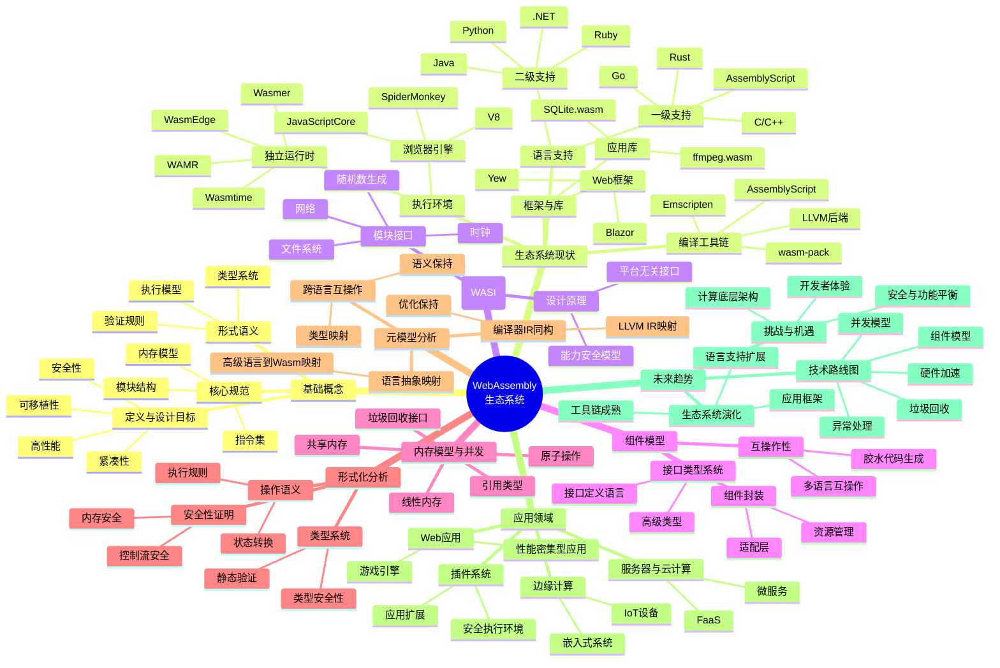

# WebAssembly生态系统分析与未来趋势

## 目录

- [WebAssembly生态系统分析与未来趋势](#webassembly生态系统分析与未来趋势)
  - [目录](#目录)
  - [1. WebAssembly基础概念](#1-webassembly基础概念)
    - [1.1 定义与设计目标](#11-定义与设计目标)
    - [1.2 核心规范](#12-核心规范)
    - [1.3 形式语义](#13-形式语义)
  - [2. WebAssembly生态系统现状](#2-webassembly生态系统现状)
    - [2.1 执行环境](#21-执行环境)
    - [2.2 编译工具链](#22-编译工具链)
    - [2.3 语言支持](#23-语言支持)
    - [2.4 框架与库](#24-框架与库)
  - [3. WebAssembly系统接口 (WASI)](#3-webassembly系统接口-wasi)
    - [3.1 设计原理](#31-设计原理)
    - [3.2 能力模型](#32-能力模型)
    - [3.3 模块接口](#33-模块接口)
  - [4. WebAssembly组件模型](#4-webassembly组件模型)
    - [4.1 接口类型系统](#41-接口类型系统)
    - [4.2 组件封装](#42-组件封装)
    - [4.3 核心模块与组件互操作](#43-核心模块与组件互操作)
  - [5. 内存模型与并发](#5-内存模型与并发)
    - [5.1 线性内存](#51-线性内存)
    - [5.2 共享内存与原子操作](#52-共享内存与原子操作)
    - [5.3 引用类型](#53-引用类型)
    - [5.4 垃圾回收接口](#54-垃圾回收接口)
  - [6. WebAssembly的形式化分析](#6-webassembly的形式化分析)
    - [6.1 类型系统](#61-类型系统)
    - [6.2 操作语义](#62-操作语义)
  - [6. WebAssembly的形式化分析（续）](#6-webassembly的形式化分析续)
    - [6.2 操作语义（续）](#62-操作语义续)
    - [6.3 安全性证明](#63-安全性证明)
  - [7. 元模型分析](#7-元模型分析)
    - [7.1 语言抽象映射](#71-语言抽象映射)
    - [7.2 跨语言互操作模型](#72-跨语言互操作模型)
    - [7.3 编译器IR与Wasm的同构性](#73-编译器ir与wasm的同构性)
  - [8. 应用领域与案例分析](#8-应用领域与案例分析)
    - [8.1 Web应用](#81-web应用)
    - [8.2 服务器与云计算](#82-服务器与云计算)
    - [8.3 边缘计算](#83-边缘计算)
    - [8.4 插件系统](#84-插件系统)
  - [9. 未来发展趋势](#9-未来发展趋势)
    - [9.1 技术路线图](#91-技术路线图)
    - [9.2 生态系统演化](#92-生态系统演化)
    - [9.3 挑战与机遇](#93-挑战与机遇)
  - [10. 思维导图](#10-思维导图)

## 1. WebAssembly基础概念

### 1.1 定义与设计目标

WebAssembly (Wasm) 是一种低级二进制指令格式，基于堆栈机器的虚拟机架构，旨在成为高级语言的编译目标，提供接近原生的执行速度。

**设计目标**：

- **高性能**：执行效率接近原生机器码
- **安全性**：在沙箱环境中执行，内存安全且无副作用
- **可移植性**：硬件、平台和语言无关
- **紧凑性**：二进制格式设计为高效下载
- **开放性**：开放标准，支持调试工具

**形式定义**：WebAssembly可以形式化定义为一个元组 $W = (T, F, G, M, I, E)$，其中：

- $T$ 是类型集合（数值和引用类型）
- $F$ 是指令集合（控制流、内存访问、数值运算等）
- $G$ 是全局状态空间
- $M$ 是模块定义
- $I$ 是导入接口
- $E$ 是导出接口

### 1.2 核心规范

WebAssembly核心规范定义了模块结构、指令集和执行语义：

**模块结构**：

- Types部分：函数类型定义
- Import部分：从宿主环境导入的外部函数、表、内存、全局变量
- Function部分：函数定义
- Table部分：函数引用表
- Memory部分：线性内存区域
- Global部分：全局变量
- Export部分：向宿主环境公开的接口
- Element部分：表的初始化数据
- Data部分：内存的初始化数据

**指令集**：

- 控制指令：分支、循环、调用
- 参数栈指令：局部变量操作
- 内存指令：加载、存储
- 数值指令：算术、逻辑、比较操作
- 表操作指令：访问函数表

```wat
;; 简单模块示例 (WebAssembly文本格式)
(module
  ;; 导入宿主函数
  (import "console" "log" (func $log (param i32)))
  
  ;; 内存定义：1页(64KB)
  (memory (export "memory") 1)
  
  ;; 全局变量定义
  (global $counter (mut i32) (i32.const 0))
  
  ;; 函数定义：计算斐波那契数
  (func $fibonacci (export "fibonacci") (param $n i32) (result i32)
    (local $i i32)
    (local $a i32)
    (local $b i32)
    (local $temp i32)
    
    ;; 边界条件
    (if (i32.lt_s (local.get $n) (i32.const 2))
      (then
        (return (local.get $n))
      )
    )
    
    ;; 初始化
    (local.set $a (i32.const 0))
    (local.set $b (i32.const 1))
    (local.set $i (i32.const 2))
    
    ;; 循环计算斐波那契数
    (loop $fib_loop
      (local.set $temp (local.get $b))
      (local.set $b (i32.add (local.get $a) (local.get $b)))
      (local.set $a (local.get $temp))
      
      ;; 递增计数器
      (local.set $i (i32.add (local.get $i) (i32.const 1)))
      
      ;; 判断是否完成
      (br_if $fib_loop (i32.le_s (local.get $i) (local.get $n)))
    )
    
    ;; 返回结果
    (local.get $b)
  )
  
  ;; 导出函数：调用斐波那契并记录计数
  (func (export "calculateFib") (param $n i32) (result i32)
    ;; 增加计数器
    (global.set $counter (i32.add (global.get $counter) (i32.const 1)))
    
    ;; 打印计数
    (call $log (global.get $counter))
    
    ;; 计算斐波那契数
    (call $fibonacci (local.get $n))
  )
)
```

### 1.3 形式语义

WebAssembly的形式语义基于以下原则：

**类型系统**：

- 静态类型检查确保指令操作类型正确
- 验证器执行类型检查，确保程序安全执行
- 类型系统可形式化为 $\Gamma \vdash e : \tau$，表示在上下文 $\Gamma$ 中表达式 $e$ 具有类型 $\tau$

**执行语义**：

- 操作语义 (Operational Semantics) 定义指令如何改变运行时状态
- 可表示为状态转换规则：$(s, f) \xrightarrow{i} (s', f')$，其中 $s$ 是栈，$f$ 是帧，$i$ 是指令

**内存安全**：

- 内存边界检查确保访问合法
- 执行流控制确保跳转到有效指令位置

## 2. WebAssembly生态系统现状

### 2.1 执行环境

目前WebAssembly执行环境主要分为以下几类：

**浏览器引擎**：

- **V8** (Chrome, Edge, Node.js)：基于TurboFan编译器
- **SpiderMonkey** (Firefox)：分层编译策略
- **JavaScriptCore** (Safari)：集成B3 JIT编译器

**独立运行时**：

- **Wasmtime**：基于Cranelift代码生成器，专注于安全和WASI支持
- **Wasmer**：注重跨平台和嵌入能力
- **WAMR** (WebAssembly Micro Runtime)：为IoT设备优化的轻量级运行时
- **WasmEdge**：云原生场景的高性能运行时

**性能比较**：

| 运行时 | 适用场景 | 相对速度 | 内存占用 | WASI支持 |
|--------|----------|----------|----------|----------|
| V8 | 浏览器、服务器 | 快 | 中等 | 有限 |
| Wasmtime | 服务器、工具链 | 快 | 低 | 完整 |
| Wasmer | 跨平台应用 | 快 | 中等 | 完整 |
| WAMR | 嵌入式、IoT | 中等 | 极低 | 部分 |
| WasmEdge | 云原生、边缘计算 | 快 | 低 | 完整 |

### 2.2 编译工具链

**LLVM后端**：

- Clang/LLVM提供将C/C++编译到Wasm的路径
- 支持optimizations和link-time optimizations
- Binaryen提供了wasm优化和转换工具

**语言特定工具**：

- **Emscripten**：C/C++到WebAssembly的完整工具链
- **wasm-pack**：Rust Wasm构建工具
- **AssemblyScript**：TypeScript子集到WebAssembly编译器

**示例：Rust到WebAssembly编译流程**：

```rust
// lib.rs - Rust中的简单图像处理函数
use wasm_bindgen::prelude::*;

#[wasm_bindgen]
pub fn grayscale(width: u32, height: u32, data: &mut [u8]) {
    // 按RGBA格式每4字节处理一个像素
    for pixel in data.chunks_exact_mut(4) {
        // 计算灰度值: 0.299 * R + 0.587 * G + 0.114 * B
        let gray = (0.299 * pixel[0] as f32 + 
                   0.587 * pixel[1] as f32 + 
                   0.114 * pixel[2] as f32) as u8;
        
        // 替换RGB通道为灰度值，保留Alpha值
        pixel[0] = gray;
        pixel[1] = gray;
        pixel[2] = gray;
        // pixel[3]是Alpha通道保持不变
    }
}

// 初始化函数
#[wasm_bindgen(start)]
pub fn init() {
    // 设置panic hook以更好地调试
    console_error_panic_hook::set_once();
}
```

编译命令：

```bash
# 安装wasm-pack
cargo install wasm-pack

# 构建wasm模块
wasm-pack build --target web
```

生成文件解析：

- `pkg/image_filters_bg.wasm`：WebAssembly二进制模块
- `pkg/image_filters.js`：JavaScript包装器
- `pkg/image_filters.d.ts`：TypeScript类型定义

### 2.3 语言支持

**一级支持**（原生编译到WebAssembly）：

- **Rust**：通过wasm-bindgen提供完整支持
- **C/C++**：通过Emscripten和Clang
- **AssemblyScript**：专为WebAssembly设计的TypeScript子集
- **Zig**：原生支持编译到WebAssembly
- **Go**：1.11版本后提供编译到WebAssembly支持

**二级支持**（通过中间层编译）：

- **Python**：PyScript, Pyodide通过编译CPython
- **Ruby**：Ruby.wasm项目
- **Java**：TeaVM, JWebAssembly将Java字节码转换为Wasm
- **C#/.NET**：Blazor框架，通过mono编译.NET运行时

**语言映射特性比较**：

| 语言 | 内存模型映射 | DOM交互 | 垃圾回收 | 开发体验 |
|------|------------|---------|---------|----------|
| Rust | 直接映射 | 通过bindgen | 无需 | 优秀 |
| C/C++ | 直接映射 | 通过Emscripten | 手动 | 良好 |
| AssemblyScript | 自动管理 | 内置 | 引用计数 | 优秀 |
| Go | GC化简版 | syscall/js | 内置 | 良好 |
| C#/.NET | 托管 | JSInterop | 内置 | 优秀 |

### 2.4 框架与库

**Web框架**：

- **Yew**：Rust编写的React风格框架
- **Sycamore**：Rust响应式前端框架
- **Blazor**：Microsoft的C#/.NET WebAssembly框架
- **Uno Platform**：跨平台.NET UI框架

**应用库**：

- **ffmpeg.wasm**：完整的ffmpeg媒体处理库
- **SQLite.wasm**：浏览器中的SQLite数据库
- **TensorFlow.js with WebAssembly backend**：机器学习库
- **WASI-SDK**：用于开发WASI应用的工具包

**工具链**：

- **wapm**：WebAssembly包管理器
- **Webpack/Rollup Wasm插件**：构建工具集成
- **wasm-bindgen**：Rust与JavaScript互操作工具
- **wasmer-js**：在Node.js/浏览器中运行WASI模块

## 3. WebAssembly系统接口 (WASI)

### 3.1 设计原理

WASI（WebAssembly系统接口）是一套标准化的系统接口，允许WebAssembly应用访问操作系统功能，同时保持安全性和可移植性。

**核心设计原则**：

- 基于能力的安全模型
- 平台无关的API设计
- 模块化功能组织
- 与POSIX兼容但不完全等同

**WASI分层**：

- **WASI核心**：基本文件和环境接口
- **WASI扩展**：网络、加密等附加功能
- **WASI预览**：每个标准化阶段的快照

### 3.2 能力模型

WASI采用能力安全模型，用于访问控制：

**能力原理**：

- 通过文件描述符表示访问权限
- 能力不可伪造，只能从宿主传递
- 权限细粒度控制到单个目录/文件

**形式定义**：
能力可以表示为一个元组 $C = (r, p, o)$，其中：

- $r$ 是资源标识符
- $p$ 是权限集合
- $o$ 是操作函数集合

### 3.3 模块接口

WASI定义了一系列模块接口：

**wasi_snapshot_preview1**：

- **文件/目录操作**：打开、读取、写入、查询
- **随机数生成**：熵源访问
- **时钟**：墙上时钟、单调时钟
- **进程环境**：环境变量、命令行参数

**示例：WASI程序**：

```rust
// Rust WASI应用示例
use std::env;
use std::fs;
use std::io::{self, Read, Write};

fn main() -> io::Result<()> {
    // 读取命令行参数
    let args: Vec<String> = env::args().collect();
    
    if args.len() < 3 {
        eprintln!("用法: {} <输入文件> <输出文件>", args[0]);
        return Ok(());
    }
    
    // 通过WASI接口读取文件
    let mut input_data = Vec::new();
    fs::File::open(&args[1])?.read_to_end(&mut input_data)?;
    
    // 处理数据（简单的大写转换）
    let output_data: Vec<u8> = input_data
        .iter()
        .map(|byte| {
            if (b'a'..=b'z').contains(byte) {
                byte - b'a' + b'A'
            } else {
                *byte
            }
        })
        .collect();
    
    // 通过WASI接口写入文件
    fs::File::create(&args[2])?.write_all(&output_data)?;
    
    println!("已将 '{}' 处理并保存到 '{}'", args[1], args[2]);
    Ok(())
}
```

编译与运行：

```bash
# 编译为WASI目标
rustc --target wasm32-wasi -o text_processor.wasm main.rs

# 使用Wasmtime运行，提供能力
wasmtime run --dir=. text_processor.wasm input.txt output.txt
```

## 4. WebAssembly组件模型

### 4.1 接口类型系统

WebAssembly组件模型引入了更高级的接口类型系统：

**核心特性**：

- **丰富的类型**：字符串、记录、变体、列表等高级类型
- **面向接口设计**：定义模块间通信协议
- **语言无关**：适用于所有编译到WebAssembly的语言

**接口定义语言 (WIT)**：

```wit
// 组件接口定义示例 (使用WIT格式)
package example:image-processor@1.0.0;

interface image {
    // 定义图像格式枚举
    enum format {
        png,
        jpeg,
        webp,
    }

    // 定义图像结构
    record image-data {
        width: u32,
        height: u32,
        format: format,
        data: list<u8>,
    }

    // 定义错误类型
    variant error {
        invalid-format,
        processing-failed(string),
        out-of-memory,
    }

    // 函数接口
    resize: func(image: image-data, new-width: u32, new-height: u32) -> result<image-data, error>;
    grayscale: func(image: image-data) -> result<image-data, error>;
    rotate: func(image: image-data, degrees: float32) -> result<image-data, error>;
}

// 导出接口
world image-processor {
    export image;
}
```

### 4.2 组件封装

组件模型提供了核心模块的封装机制：

**封装流程**：

1. 将传统WebAssembly模块转换为组件
2. 添加接口适配层
3. 封装元数据和导入/导出接口

**组件特性**：

- 多模块支持
- 接口类型转换
- 资源生命周期管理

### 4.3 核心模块与组件互操作

**适配层**：

- 自动生成的胶水代码
- 类型转换逻辑
- 资源管理

**示例：Rust组件**：

```rust
// Rust实现组件接口
use image::{DynamicImage, GenericImageView, ImageFormat};
wit_bindgen::generate!({
    world: "image-processor",
    exports: {
        "example:image-processor/image": ImageProcessor,
    }
});

struct ImageProcessor;

impl exports::example::image_processor::image::Guest for ImageProcessor {
    fn resize(
        img: ImageData, 
        new_width: u32, 
        new_height: u32
    ) -> Result<ImageData, Error> {
        // 从接口类型转换到Rust图像库类型
        let format = match img.format {
            Format::Png => ImageFormat::Png,
            Format::Jpeg => ImageFormat::Jpeg,
            Format::Webp => ImageFormat::WebP,
        };
        
        // 处理图像数据
        let img_data = img.data.as_slice();
        let dynamic_img = image::load_from_memory_with_format(img_data, format)
            .map_err(|e| Error::ProcessingFailed(e.to_string()))?;
        
        // 调整图像大小
        let resized = dynamic_img.resize(
            new_width, new_height, 
            image::imageops::FilterType::Lanczos3
        );
        
        // 编码回输出格式
        let mut output_data = Vec::new();
        resized.write_to(
            &mut std::io::Cursor::new(&mut output_data), 
            format
        ).map_err(|e| Error::ProcessingFailed(e.to_string()))?;
        
        // 返回接口类型结果
        Ok(ImageData {
            width: resized.width(),
            height: resized.height(),
            format: img.format,
            data: output_data,
        })
    }
    
    fn grayscale(img: ImageData) -> Result<ImageData, Error> {
        // 类似的实现...
        // ...
    }
    
    fn rotate(img: ImageData, degrees: f32) -> Result<ImageData, Error> {
        // 类似的实现...
        // ...
    }
}
```

编译为组件:

```bash
cargo component build --release
```

## 5. 内存模型与并发

### 5.1 线性内存

WebAssembly的线性内存是一个连续的字节数组，模拟了传统程序的堆内存：

**特性**：

- 按页(64KB)分配
- 可增长但不可缩小
- 范围从0到最大值

**形式模型**：
线性内存可以建模为函数 $M: \mathbb{N} \rightarrow \mathbb{B}$，其中 $\mathbb{B}$ 是字节值域。

**内存安全保证**：

- 静态和动态边界检查
- 隔离的地址空间
- 无指针算术

### 5.2 共享内存与原子操作

**共享内存**：

- 多线程间共享内存空间
- 使用atomics确保线程安全
- 遵循与JavaScript共享的内存模型

**原子操作**：

- 加载/存储
- 比较与交换
- 原子算术
- 内存栅栏

**示例：使用共享内存和原子操作**：

```rust
// Rust中使用Wasm共享内存与原子操作的示例
use std::sync::atomic::{AtomicU32, Ordering};

#[wasm_bindgen]
pub struct SharedCounter {
    // 放在共享内存中的原子计数器
    counter: AtomicU32,
}

#[wasm_bindgen]
impl SharedCounter {
    #[wasm_bindgen(constructor)]
    pub fn new() -> Self {
        SharedCounter {
            counter: AtomicU32::new(0)
        }
    }
    
    pub fn increment(&self) -> u32 {
        // 原子递增并返回新值
        self.counter.fetch_add(1, Ordering::SeqCst) + 1
    }
    
    pub fn get_value(&self) -> u32 {
        // 原子读取当前值
        self.counter.load(Ordering::SeqCst)
    }
    
    pub fn compare_and_set(&self, expected: u32, new_value: u32) -> bool {
        // 原子比较和交换操作
        self.counter.compare_exchange(
            expected, 
            new_value, 
            Ordering::SeqCst, 
            Ordering::SeqCst
        ).is_ok()
    }
}
```

在JavaScript中使用：

```javascript
// 创建共享内存
const memory = new WebAssembly.Memory({ 
  initial: 1, 
  maximum: 10, 
  shared: true 
});

// 在不同Worker中使用共享计数器
const counterInstance = new SharedCounter();

// 在worker线程中
worker.postMessage({
  type: 'increment',
  counterId: counterInstance.id
});

// 主线程检查更新后的值
console.log(`Current count: ${counterInstance.get_value()}`);
```

### 5.3 引用类型

WebAssembly引入了引用类型，扩展了原始值类型系统：

**类型分类**：

- **externref**：宿主环境值的不透明引用
- **funcref**：函数引用，可用于回调
- **table引用**：允许在表中存储引用

**引用安全性**：

- 引用不可伪造
- 无引用算术
- 类型检查确保安全使用

### 5.4 垃圾回收接口

WebAssembly正在开发垃圾回收接口，以支持托管语言：

**设计目标**：

- 与宿主GC系统集成
- 支持跨语言对象引用
- 减少内存管理负担

**核心机制**：

- 引用跟踪
- 对象终结器
- 弱引用支持

## 6. WebAssembly的形式化分析

### 6.1 类型系统

WebAssembly的类型系统有以下形式化特性：

**值类型**：

- $t ::= i32 \mid i64 \mid f32 \mid f64 \mid \text{externref} \mid \text{funcref}$

**函数类型**：

- $ft ::= t_1^* \rightarrow t_2^*$（参数类型列表映射到结果类型列表）

**子类型关系**：

- 反身性：$t <: t$
- 传递性：如果 $t_1 <: t_2$ 且 $t_2 <: t_3$ 则 $t_1 <: t_3$
- 函数子类型：如果 $t_1' <: t_1$ 且 $t_2 <: t_2'$ 则 $(t_1 \rightarrow t_2) <: (t_1' \rightarrow t_2')$

### 6.2 操作语义

WebAssembly的形式化操作语义定义如下：

**执行状态**：

- 堆栈 $S$
- 局部变量 $L$
- 存储 $\sigma = (tab, mem, glob)$

**指令评估关系**：

- $S; L; \sigma \vdash e \Rightarrow S'; L'; \sigma'$

**控制流规则示例**：

- 块指令：$S; L; \sigma \vdash \text{block}~t~e^* \Rightarrow S', L', \sigma'$ 当 $S; L; \

## 6. WebAssembly的形式化分析（续）

### 6.2 操作语义（续）

**控制流规则示例**（续）：

- 块指令：$S; L; \sigma \vdash \text{block}~t~e^* \Rightarrow S', L', \sigma'$ 当 $S; L; \sigma \vdash e^* \Rightarrow S', L', \sigma'$
- 分支指令：$S; L; \sigma \vdash \text{br}~l \Rightarrow S', L', \sigma'$ 跳转到层级 $l$ 的外部块
- 调用指令：$S; L; \sigma \vdash \text{call}~x \Rightarrow S', L', \sigma'$ 调用索引为 $x$ 的函数

**内存操作规则**：

- 加载：$S; L; \sigma \vdash t.\text{load}~m~o \Rightarrow S', L', \sigma'$，从内存地址 $m+o$ 加载类型 $t$ 的值
- 存储：$S; L; \sigma \vdash t.\text{store}~m~o \Rightarrow S', L', \sigma'$，将类型 $t$ 的值存储到内存地址 $m+o$

**形式化执行过程**：
一个WebAssembly程序的执行可以形式化表示为一系列状态转换：

$\langle S_0, L_0, \sigma_0 \rangle \xrightarrow{i_1} \langle S_1, L_1, \sigma_1 \rangle \xrightarrow{i_2} ... \xrightarrow{i_n} \langle S_n, L_n, \sigma_n \rangle$

其中，$i_k$ 是第 $k$ 步执行的指令，每个转换根据操作语义规则进行。

### 6.3 安全性证明

WebAssembly的安全性基于以下形式化证明：

**类型安全**：

- **定理**：如果程序 $P$ 通过类型检查，并且 $S; L; \sigma \vdash P \Rightarrow S'; L'; \sigma'$，则 $S'$ 包含正确类型的值。
- **证明**：基于结构归纳法，对每种指令和操作语义规则进行类型保持证明。

**内存安全**：

- **定理**：如果程序 $P$ 通过验证，则所有内存访问都在有效范围内。
- **证明**：验证器确保所有内存操作都包含边界检查，越界访问会被捕获并导致陷阱。

**控制流安全**：

- **定理**：如果程序 $P$ 通过验证，则所有控制转移都跳转到有效位置。
- **证明**：所有跳转目标在验证阶段被静态检查，确保跳转到有效指令位置。

**形式化验证过程**：
可以用判定规则表示验证过程：$C \vdash e : t$，表示在上下文 $C$ 中，表达式 $e$ 具有类型 $t$。

## 7. 元模型分析

### 7.1 语言抽象映射

不同高级语言到WebAssembly的映射可以通过元模型分析：

**抽象映射公式**：
对于源语言 $L_S$ 和目标WebAssembly $L_W$，存在映射函数 $f: L_S \rightarrow L_W$，使得程序行为保持一致。

**函数语言映射**：

- **闭包表示**：使用表和内存组合表示高阶函数
- **泛型实现**：通过单态化或类型擦除
- **模式匹配**：转换为分支跳转结构

**面向对象语言映射**：

- **对象表示**：内存布局 + 虚表
- **继承**：通过布局偏移和虚表扩展
- **动态分发**：通过表索引和调用间接实现

**Rust到WebAssembly映射示例**：

```rust
// Rust源代码
enum Result<T, E> {
    Ok(T),
    Err(E)
}

fn process_data(input: &[u8]) -> Result<Vec<u8>, String> {
    if input.len() < 5 {
        return Err("Input too short".to_string());
    }
    
    let mut output = Vec::with_capacity(input.len());
    for byte in input {
        output.push(byte.wrapping_add(1));
    }
    
    Ok(output)
}
```

转换为的WebAssembly（伪代码表示）：

```wat
;; 枚举标签常量
(global $TAG_OK i32 (i32.const 0))
(global $TAG_ERR i32 (i32.const 1))

;; Result结构在内存中表示：
;; - i32 tag (0 = Ok, 1 = Err)
;; - i32 payload_ptr (指向数据或错误字符串)

;; 函数实现
(func $process_data (param $input_ptr i32) (param $input_len i32) (result i32)
  ;; 检查输入长度
  (if (i32.lt_u (local.get $input_len) (i32.const 5))
    (then
      ;; 创建错误字符串 "Input too short"
      (local $err_str i32)
      (local.set $err_str (call $allocate_string (i32.const 16))) ;; 字符串长度16
      (call $write_string (local.get $err_str) ...)
      
      ;; 创建Err变体
      (local $result_ptr i32)
      (local.set $result_ptr (call $allocate (i32.const 8))) ;; tag + payload_ptr
      
      ;; 写入tag和payload
      (i32.store (local.get $result_ptr) (global.get $TAG_ERR))
      (i32.store offset=4 (local.get $result_ptr) (local.get $err_str))
      
      ;; 返回结果指针
      (return (local.get $result_ptr))
    )
  )
  
  ;; 正常处理分支
  (local $output_ptr i32)
  (local $output_cap i32)
  
  ;; 分配输出缓冲区
  (local.set $output_cap (local.get $input_len))
  (local.set $output_ptr (call $allocate_vec (local.get $output_cap)))
  
  ;; 处理循环
  (local $i i32)
  (local.set $i (i32.const 0))
  (loop $process_loop
    ;; 退出条件
    (br_if $process_loop_end (i32.eq (local.get $i) (local.get $input_len)))
    
    ;; 读取输入字节
    (local $byte i32)
    (local.set $byte (i32.load8_u (i32.add (local.get $input_ptr) (local.get $i))))
    
    ;; 处理字节并写入输出
    (i32.store8 
      (i32.add (local.get $output_ptr) (local.get $i))
      (i32.add (local.get $byte) (i32.const 1))
    )
    
    ;; 递增索引
    (local.set $i (i32.add (local.get $i) (i32.const 1)))
    (br $process_loop)
  )
  $process_loop_end
  
  ;; 创建Ok变体
  (local $result_ptr i32)
  (local.set $result_ptr (call $allocate (i32.const 8))) ;; tag + payload_ptr
  
  ;; 写入tag和payload
  (i32.store (local.get $result_ptr) (global.get $TAG_OK))
  (i32.store offset=4 (local.get $result_ptr) (local.get $output_ptr))
  
  ;; 返回结果指针
  (local.get $result_ptr)
)
```

### 7.2 跨语言互操作模型

跨语言互操作可以通过映射关系和同构性形式化：

**类型映射函数**：
对于源语言类型系统 $T_S$ 和WebAssembly类型系统 $T_W$，存在映射 $g: T_S \rightarrow T_W$。

**互操作代数**：
两个语言之间的互操作可以形式化为同构映射 $h: L_1 \times L_2 \rightarrow L_W$，满足以下条件：

- 保持类型：$\forall t \in T_{L_1} \cup T_{L_2}, g(t) \in T_W$
- 保持语义：$\forall p \in L_1 \times L_2, semantics(p) \cong semantics(h(p))$

**类型转换关系**：

|类型维度|映射关系|属性|
|-------|-------|-----|
|原始类型|直接映射|全射|
|结构类型|内存布局转换|单射|
|行为类型|表+调用约定|部分单射|
|泛型类型|单态化/类型擦除|多对一映射|

**组件模型互操作示例**：

```typescript
// TypeScript定义接口
interface ImageProcessor {
  resize(
    image: Uint8Array, 
    width: number, 
    height: number, 
    newWidth: number, 
    newHeight: number
  ): Uint8Array;
}

// 使用Rust实现的组件
async function createImageProcessor(): Promise<ImageProcessor> {
  const { resize } = await WebAssembly.instantiateStreaming(
    fetch('image_processor.wasm')
  ).exports;
  
  return {
    resize(image, width, height, newWidth, newHeight) {
      // 使用共享内存分配图像数据
      const memory = new WebAssembly.Memory({ initial: 10 });
      const imagePtr = /* 分配内存并复制图像数据 */;
      
      // 调用Wasm函数
      const resultPtr = resize(imagePtr, width, height, newWidth, newHeight);
      
      // 从内存中提取结果
      return new Uint8Array(memory.buffer, resultPtr, /* 计算大小 */);
    }
  };
}
```

### 7.3 编译器IR与Wasm的同构性

WebAssembly与编译器中间表示(IR)之间存在结构对应关系：

**LLVM IR到WebAssembly同构**：

- LLVM基本块 → Wasm块和分支指令
- LLVM指令 → Wasm操作码
- LLVM类型系统 → Wasm类型系统的特化

**同构映射公式**：
编译器IR $I$ 和WebAssembly $W$ 之间的同构 $\phi: I \rightarrow W$ 满足：

- $\phi$ 是双射（一一对应）
- $\phi$ 保持控制流结构
- $\phi$ 保持数据流关系
- $\phi$ 保持类型系统层次

**编译优化同态**：
IR上的优化变换 $T_I$ 和Wasm上的优化变换 $T_W$ 之间存在同态关系：
$\phi \circ T_I = T_W \circ \phi$

## 8. 应用领域与案例分析

### 8.1 Web应用

**性能密集型应用**：

- **图像/视频编辑**：浏览器内photoshop.wasm, ffmpeg.wasm
- **游戏引擎**：Unity, Unreal Engine的WebAssembly导出
- **科学计算**：在浏览器中运行计算模拟

**实例分析：Unity WebAssembly**：
Unity WebGL导出使用WebAssembly改善性能：

- 游戏逻辑和物理引擎编译为Wasm
- 与JavaScript和WebGL API交互
- 比asm.js性能提升30-50%

### 8.2 服务器与云计算

**服务器场景**：

- **函数即服务(FaaS)**：WebAssembly作为函数运行时
- **微服务**：轻量级、跨语言微服务
- **边缘计算**：靠近用户部署的计算节点

**案例分析：Fastly Compute@Edge**：
Fastly的边缘计算平台使用WebAssembly：

- 冷启动时间<1ms（比容器快数百倍）
- 内存隔离保障多租户安全
- 支持多种语言的边缘函数

```rust
// Fastly Compute@Edge示例 (Rust)
use fastly::http::{header, Method, StatusCode};
use fastly::{Error, Request, Response};

#[fastly::main]
fn main(req: Request) -> Result<Response, Error> {
    // 根据请求路径处理
    match (req.get_method(), req.get_path()) {
        (&Method::GET, "/api/items") => {
            // 从后端获取数据
            let backend_resp = req.send("backend_api")?;
            
            // 添加缓存控制和CORS头
            let resp = backend_resp
                .with_header(header::CACHE_CONTROL, "public, max-age=60")
                .with_header(header::ACCESS_CONTROL_ALLOW_ORIGIN, "*");
            
            Ok(resp)
        },
        (&Method::GET, "/api/status") => {
            // 返回边缘节点状态信息
            let resp = Response::from_status(StatusCode::OK)
                .with_body_json(&json!({
                    "status": "online",
                    "version": "1.0.0",
                    "region": "eu-west"
                }))?;
            
            Ok(resp)
        },
        _ => {
            // 未知路径返回404
            Ok(Response::from_status(StatusCode::NOT_FOUND)
                .with_body_text_plain("Not Found"))
        }
    }
}
```

### 8.3 边缘计算

**IoT和嵌入式**：

- **设备固件更新**：安全、增量的代码更新
- **跨设备应用**：编写一次，部署到多种硬件
- **安全隔离**：隔离可能不受信任的组件

**案例分析：WasmEdge在IoT设备上运行ML模型**：

```rust
// 用于IoT设备的Rust ML推理代码
use wasm_bindgen::prelude::*;
use tract_tensorflow::prelude::*;

#[wasm_bindgen]
pub struct ImageClassifier {
    model: SimplePlan<TypedFact, Box<dyn TypedOp>, Graph<TypedFact, Box<dyn TypedOp>>>,
}

#[wasm_bindgen]
impl ImageClassifier {
    #[wasm_bindgen(constructor)]
    pub fn new() -> Result<ImageClassifier, JsValue> {
        // 加载预训练的TensorFlow Lite模型
        let model_bytes = include_bytes!("../models/mobilenet_v2.tflite");
        
        // 使用tract-tensorflow处理模型
        let model = tract_tensorflow::tensorflow()
            .model_for_read(&mut model_bytes.as_ref())
            .map_err(|e| JsValue::from_str(&format!("Error loading model: {}", e)))?
            .into_typed()
            .map_err(|e| JsValue::from_str(&format!("Error converting model: {}", e)))?
            .into_optimized()
            .map_err(|e| JsValue::from_str(&format!("Error optimizing model: {}", e)))?
            .into_runnable()
            .map_err(|e| JsValue::from_str(&format!("Error making model runnable: {}", e)))?;
        
        Ok(ImageClassifier { model })
    }
    
    pub fn classify(&self, image_data: &[u8], width: u32, height: u32) -> Result<Vec<f32>, JsValue> {
        // 预处理图像
        let input = self.preprocess_image(image_data, width, height)
            .map_err(|e| JsValue::from_str(&format!("Image preprocessing error: {}", e)))?;
        
        // 运行推理
        let result = self.model
            .run(tvec!(input))
            .map_err(|e| JsValue::from_str(&format!("Inference error: {}", e)))?;
        
        // 获取输出值
        let output = result[0]
            .to_array_view::<f32>()
            .map_err(|e| JsValue::from_str(&format!("Output error: {}", e)))?;
        
        // 将结果转换为向量
        Ok(output.iter().cloned().collect())
    }
    
    fn preprocess_image(&self, image_data: &[u8], width: u32, height: u32) -> TractResult<Tensor> {
        // 转换为RGB并调整大小
        // ... (实际预处理代码)
        
        // 返回预处理后的张量
        Ok(tensor)
    }
}
```

### 8.4 插件系统

**应用扩展**：

- **浏览器扩展**：使用Wasm的安全浏览器插件
- **数据库扩展**：自定义数据库函数和过程
- **内容创作工具**：图像编辑器、视频编辑器插件

**案例：PostgreSQL的pg_wasm扩展**：

```sql
-- 创建WebAssembly函数
CREATE FUNCTION wasm_fibonacci(n INTEGER) RETURNS INTEGER
LANGUAGE wasm
AS $$
(module
  (func $fibonacci (param $n i32) (result i32)
    (local $i i32)
    (local $a i32)
    (local $b i32)
    (local $temp i32)
    
    ;; 边界情况
    (if (i32.lt_s (local.get $n) (i32.const 2))
      (then
        (return (local.get $n))
      )
    )
    
    ;; 计算斐波那契数列
    (local.set $a (i32.const 0))
    (local.set $b (i32.const 1))
    (local.set $i (i32.const 2))
    
    (loop $fib_loop
      (local.set $temp (local.get $b))
      (local.set $b (i32.add (local.get $a) (local.get $b)))
      (local.set $a (local.get $temp))
      
      (local.set $i (i32.add (local.get $i) (i32.const 1)))
      
      (br_if $fib_loop (i32.le_s (local.get $i) (local.get $n)))
    )
    
    (local.get $b)
  )
  
  (export "fibonacci" (func $fibonacci))
)
$$;

-- 使用WebAssembly函数
SELECT wasm_fibonacci(10);  -- 返回55
```

## 9. 未来发展趋势

### 9.1 技术路线图

**近期重点（1-2年）**：

- **组件模型标准化**：完成组件模型和接口类型系统
- **垃圾回收接口**：面向托管语言的GC整合
- **异常处理机制**：标准化异常处理指令

**中期发展（2-4年）**：

- **并发与线程扩展**：细粒度并发模型
- **SIMD扩展增强**：更广泛的SIMD指令支持
- **安全性增强**：形式化验证与沙箱改进

**长期愿景（5年以上）**：

- **分布式WebAssembly**：跨节点执行模型
- **芯片级支持**：专用WebAssembly硬件加速
- **多语言生态系统整合**：任意语言间无缝互操作

### 9.2 生态系统演化

**工具链成熟度**：

- 从实验性到企业级开发工具
- IDE集成与调试体验提升
- 构建和打包标准化

**语言支持扩展**：

- 更多语言一级支持WebAssembly
- 动态语言优化改进
- 特定领域语言(DSL)直接编译到Wasm

**应用框架生态**：

- 原生WebAssembly框架而非语言移植
- 跨平台应用开发标准化
- 优化运行时和特定领域库

### 9.3 挑战与机遇

**技术挑战**：

- 保持安全模型同时增加功能
- 平衡性能与可移植性
- 解决不同语言间的互操作性复杂性

**生态系统挑战**：

- 分散的标准化过程
- 开发者技能差距
- 与现有技术栈的集成

**未来机遇**：

- **统一计算平台**：在任何环境中运行任何代码
- **真正跨平台应用**：一次编写，到处运行
- **永久软件**：与硬件和操作系统变化解耦

**WebAssembly作为计算底层架构**：
形式化而言，WebAssembly有潜力成为普适计算模型 $U$，使得任何计算 $C$ 都可以通过映射 $m: C \rightarrow U$ 在WebAssembly上实现，无论源语言或目标平台。

## 10. 思维导图


