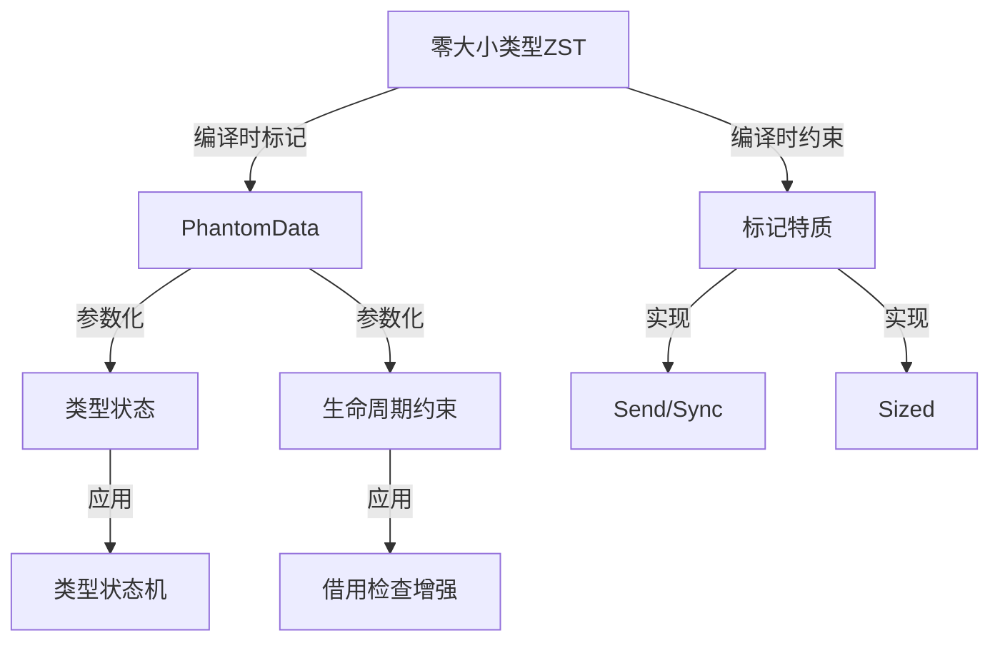
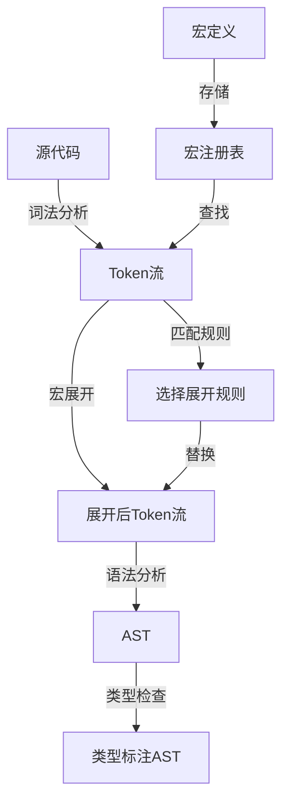
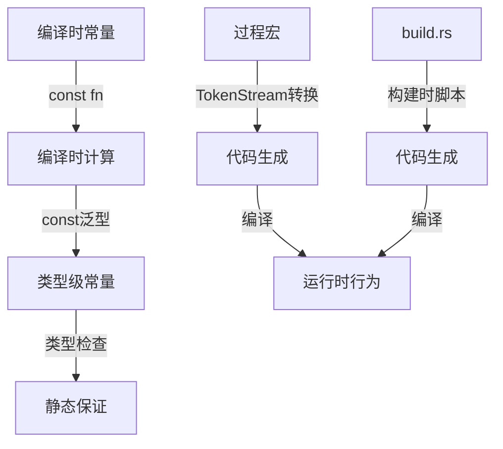
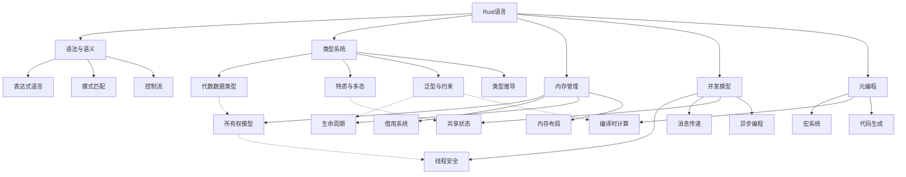
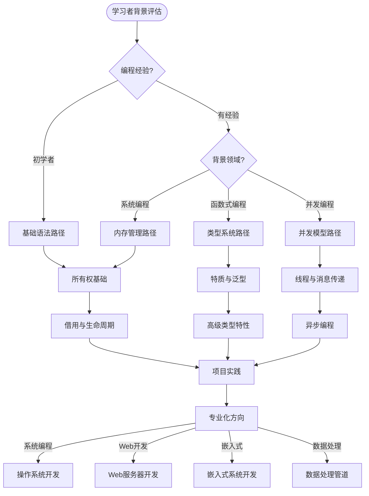
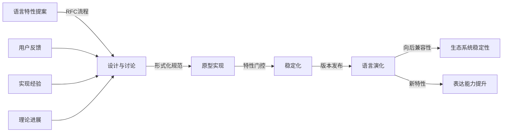

# 深化分析-复杂理论构造、跨领域应用以及元级编程模式整合

## 目录

- [深化分析-复杂理论构造、跨领域应用以及元级编程模式整合](#深化分析-复杂理论构造跨领域应用以及元级编程模式整合)
  - [目录](#目录)
  - [高阶类型系统特性的理论基础](#高阶类型系统特性的理论基础)
    - [高级类型级编程模式](#高级类型级编程模式)
      - [1. 幻影类型与零大小类型的理论基础](#1-幻影类型与零大小类型的理论基础)
      - [2. 高级特质边界系统](#2-高级特质边界系统)
    - [类型系统的形式化语义](#类型系统的形式化语义)
      - [1. 子类型关系与型变的形式化](#1-子类型关系与型变的形式化)
      - [2. 高级类型推导算法](#2-高级类型推导算法)
  - [元编程与宏系统的形式化](#元编程与宏系统的形式化)
    - [声明式宏的形式化模型](#声明式宏的形式化模型)
      - [1. 模式匹配与替换规则](#1-模式匹配与替换规则)
      - [2. 宏展开的形式化语义](#2-宏展开的形式化语义)
    - [过程宏的计算模型](#过程宏的计算模型)
      - [1. 语法树转换的形式化](#1-语法树转换的形式化)
      - [2. 编译时计算模型](#2-编译时计算模型)
  - [跨领域应用的深层理论](#跨领域应用的深层理论)
    - [形式化验证与程序证明](#形式化验证与程序证明)
      - [1. 程序逻辑与Rust类型系统](#1-程序逻辑与rust类型系统)
      - [2. 依赖类型的模拟实现](#2-依赖类型的模拟实现)
    - [并发与分布式系统的形式化](#并发与分布式系统的形式化)
      - [1. 会话类型的Rust实现](#1-会话类型的rust实现)
      - [2. 分布式系统的一致性模型](#2-分布式系统的一致性模型)
  - [教学与学习的高级框架](#教学与学习的高级框架)
    - [多维度知识地图](#多维度知识地图)
    - [认知负荷管理策略](#认知负荷管理策略)
    - [学习路径个性化](#学习路径个性化)
  - [元层次的理论分析](#元层次的理论分析)
    - [语言设计哲学的形式化](#语言设计哲学的形式化)
      - [1. 设计原则的形式化表达](#1-设计原则的形式化表达)
      - [2. 语言演化的形式化模型](#2-语言演化的形式化模型)
    - [跨范式编程的统一理论](#跨范式编程的统一理论)
  - [结论](#结论)

## 高阶类型系统特性的理论基础

### 高级类型级编程模式

#### 1. 幻影类型与零大小类型的理论基础



零大小类型在Rust中具有深刻的理论意义，它们在不增加运行时开销的情况下提供编译时保证。

#### 2. 高级特质边界系统

```rust
// 使用关联类型和高级特质边界构建类型级DSL
trait Dimension {
    const DIM: usize;
}

struct D1;
struct D2;
struct D3;

impl Dimension for D1 { const DIM: usize = 1; }
impl Dimension for D2 { const DIM: usize = 2; }
impl Dimension for D3 { const DIM: usize = 3; }

// 向量类型，维度由类型参数确定
struct Vector<D: Dimension> {
    data: Vec<f64>,
    _phantom: PhantomData<D>,
}

impl<D: Dimension> Vector<D> {
    fn new() -> Self {
        let dim = D::DIM;
        Vector {
            data: vec![0.0; dim],
            _phantom: PhantomData,
        }
    }
    
    fn get(&self, idx: usize) -> Option<f64> {
        if idx < D::DIM {
            Some(self.data[idx])
        } else {
            None
        }
    }
}

// 只为2D和3D向量实现叉积
trait CrossProduct {
    fn cross(self, other: Self) -> Self;
}

// 2D向量的叉积
impl CrossProduct for Vector<D2> {
    fn cross(self, other: Self) -> Self {
        let mut result = Vector::<D2>::new();
        // 2D叉积实现
        // ...
        result
    }
}

// 3D向量的叉积
impl CrossProduct for Vector<D3> {
    fn cross(self, other: Self) -> Self {
        let mut result = Vector::<D3>::new();
        // 3D叉积实现
        // ...
        result
    }
}

// 编译错误：D1不满足CrossProduct约束
// fn invalid() {
//     let v1 = Vector::<D1>::new();
//     let v2 = Vector::<D1>::new();
//     let v3 = v1.cross(v2);  // 错误：D1没有实现CrossProduct
// }
```

这种模式展示了如何使用高级特质边界和关联类型构建类型级DSL，在编译时强制执行领域规则。

### 类型系统的形式化语义

#### 1. 子类型关系与型变的形式化

```math
// 型变规则的形式化表示

// 协变规则 (covariant)
如果 T <: U，则 F<T> <: F<U>

// 逆变规则 (contravariant)
如果 T <: U，则 G<U> <: G<T>

// 不变规则 (invariant)
如果 T <: U，则 H<T> 与 H<U> 没有子类型关系
```

Rust中的型变规则：

- 引用 `&'a T` 对 `T` 是协变的，对 `'a` 也是协变的
- 可变引用 `&'a mut T` 对 `T` 是不变的，对 `'a` 是协变的
- 函数类型 `fn(T) -> U` 对 `T` 是逆变的，对 `U` 是协变的

```rust
// 型变示例
struct Covariant<T>(Box<T>);  // 对T协变
struct Contravariant<T>(fn(T) -> ());  // 对T逆变
struct Invariant<T>(Cell<T>);  // 对T不变

// 生命周期协变
fn covariant_lifetime<'a, 'b>(x: &'a str) -> &'b str 
where 'a: 'b {  // 'a比'b长寿
    // ...
}
```

这种形式化表示帮助理解Rust类型系统中的子类型关系和型变规则。

#### 2. 高级类型推导算法

```math
// Hindley-Milner类型推导算法的Rust适配

1. 收集约束
   - 为每个表达式分配类型变量
   - 根据表达式结构生成约束

2. 统一约束
   - 解决约束方程组
   - 处理递归类型

3. 生成类型方案
   - 确定泛型参数
   - 推导生命周期参数

4. 应用默认规则
   - 应用生命周期省略规则
   - 应用类型默认规则
```

Rust编译器使用类似的算法进行类型推导，但增加了所有权、借用和生命周期的约束处理。

```rust
// 类型推导示例
let x = vec![1, 2, 3];  // 推导为 Vec<i32>
let y = x.iter().map(|n| n * 2).collect();  // 需要类型标注或上下文

// 上下文类型推导
fn process<T>(data: Vec<T>) -> Vec<T> { data }
let z: Vec<i32> = vec![1, 2, 3].iter().map(|n| n * 2).collect();  // 从上下文推导
```

## 元编程与宏系统的形式化

### 声明式宏的形式化模型

#### 1. 模式匹配与替换规则

```rust
// 声明式宏的形式化表示
macro_rules! example {
    // 规则1: ($pattern1) => { $expansion1 }
    // 规则2: ($pattern2) => { $expansion2 }
    // ...
}
```

可以将声明式宏视为一个形式语言转换系统：

- 输入是一个语法树片段
- 规则是模式匹配和替换指令
- 输出是展开后的语法树片段

```rust
// 递归宏示例
macro_rules! nested_vec {
    // 基本情况
    ($elem:expr) => { vec![$elem] };
    
    // 递归情况
    ($elem:expr, $($rest:tt)*) => {
        {
            let mut temp = nested_vec!($($rest)*);
            temp.insert(0, $elem);
            temp
        }
    };
}

// 使用
let v = nested_vec!(1, 2, 3, 4);  // 展开为嵌套向量操作
```

#### 2. 宏展开的形式化语义



这种图表展示了宏展开在Rust编译过程中的位置和工作机制。

### 过程宏的计算模型

#### 1. 语法树转换的形式化

```rust
// 过程宏的形式化表示
#[proc_macro]
pub fn custom_macro(input: TokenStream) -> TokenStream {
    // 1. 解析输入的TokenStream
    // 2. 构建AST表示
    // 3. 转换AST
    // 4. 生成新的TokenStream
}
```

过程宏可以视为一个高阶函数，将一个语法树转换为另一个语法树：

- 输入是TokenStream（语法树的序列化表示）
- 函数体是转换逻辑
- 输出是新的TokenStream

```rust
// 过程宏实现示例
use proc_macro::TokenStream;
use quote::quote;
use syn::{parse_macro_input, DeriveInput};

#[proc_macro_derive(Builder)]
pub fn derive_builder(input: TokenStream) -> TokenStream {
    // 解析输入
    let input = parse_macro_input!(input as DeriveInput);
    let name = input.ident;
    let builder_name = format!("{}Builder", name);
    let builder_ident = syn::Ident::new(&builder_name, name.span());
    
    // 生成输出
    let expanded = quote! {
        pub struct #builder_ident {
            // 生成的字段
        }
        
        impl #builder_ident {
            // 生成的方法
        }
        
        impl #name {
            pub fn builder() -> #builder_ident {
                #builder_ident { /* 初始化 */ }
            }
        }
    };
    
    expanded.into()
}
```

#### 2. 编译时计算模型



这种图表展示了Rust中不同形式的元编程和编译时计算机制。

## 跨领域应用的深层理论

### 形式化验证与程序证明

#### 1. 程序逻辑与Rust类型系统

```rust
// 使用Rust类型系统表达霍尔逻辑
struct Precondition<P>(PhantomData<P>);
struct Postcondition<Q>(PhantomData<Q>);

// 谓词类型
struct NonZero;
struct Positive;
struct Ordered;

// 霍尔三元组 {P} C {Q}
struct HoareTriple<P, Q, F>
where
    F: Fn() -> (),
{
    pre: Precondition<P>,
    command: F,
    post: Postcondition<Q>,
}

// 实现验证规则
impl<F> HoareTriple<NonZero, Positive, F>
where
    F: Fn(i32) -> i32,
{
    fn verify(&self, x: i32) -> i32 {
        assert!(x != 0);  // 前置条件
        let result = (self.command)(x);
        assert!(result > 0);  // 后置条件
        result
    }
}
```

这种方法尝试使用Rust的类型系统表达程序逻辑概念，实现轻量级的形式验证。

#### 2. 依赖类型的模拟实现

```rust
// 使用关联类型和特质约束模拟依赖类型
trait Nat {
    const VALUE: usize;
}

struct Zero;
impl Nat for Zero {
    const VALUE: usize = 0;
}

struct Succ<N: Nat>;
impl<N: Nat> Nat for Succ<N> {
    const VALUE: usize = N::VALUE + 1;
}

// 向量类型，长度由类型参数确定
struct Vector<T, N: Nat> {
    data: Vec<T>,
    _phantom: PhantomData<N>,
}

impl<T, N: Nat> Vector<T, N> {
    fn new_with_value(value: T) -> Self
    where
        T: Clone,
    {
        Vector {
            data: vec![value; N::VALUE],
            _phantom: PhantomData,
        }
    }
}

// 向量连接，长度是两个向量长度之和
trait Add<N: Nat>: Nat {
    type Sum: Nat;
}

impl<N: Nat> Add<Zero> for N {
    type Sum = N;
}

impl<N1: Nat, N2: Nat> Add<Succ<N2>> for N1
where
    N1: Add<N2>,
{
    type Sum = Succ<N1::Sum>;
}

impl<T, N1: Nat, N2: Nat> Vector<T, N1>
where
    N1: Add<N2>,
{
    fn concat(self, other: Vector<T, N2>) -> Vector<T, N1::Sum> {
        let mut data = self.data;
        data.extend(other.data);
        Vector {
            data,
            _phantom: PhantomData,
        }
    }
}
```

这种实现展示了如何使用Rust的类型系统模拟依赖类型特性，实现更强的静态保证。

### 并发与分布式系统的形式化

#### 1. 会话类型的Rust实现

```rust
// 使用类型状态模式实现二元会话类型
// 会话协议：客户端发送请求，服务器回复响应
trait Protocol {}

// 协议状态
struct Idle;
struct WaitingRequest;
struct WaitingResponse;
struct Finished;

impl Protocol for Idle {}
impl Protocol for WaitingRequest {}
impl Protocol for WaitingResponse {}
impl Protocol for Finished {}

// 客户端会话
struct Client<S: Protocol> {
    connection: TcpStream,
    _state: PhantomData<S>,
}

// 服务器会话
struct Server<S: Protocol> {
    connection: TcpStream,
    _state: PhantomData<S>,
}

// 客户端操作
impl Client<Idle> {
    fn new(addr: &str) -> Result<Self, io::Error> {
        Ok(Client {
            connection: TcpStream::connect(addr)?,
            _state: PhantomData,
        })
    }
    
    fn send_request(self, request: &[u8]) -> Result<Client<WaitingResponse>, io::Error> {
        self.connection.write_all(request)?;
        Ok(Client {
            connection: self.connection,
            _state: PhantomData,
        })
    }
}

impl Client<WaitingResponse> {
    fn receive_response(self) -> Result<(Client<Finished>, Vec<u8>), io::Error> {
        let mut buffer = Vec::new();
        self.connection.read_to_end(&mut buffer)?;
        Ok((
            Client {
                connection: self.connection,
                _state: PhantomData,
            },
            buffer,
        ))
    }
}

// 服务器操作
impl Server<Idle> {
    fn accept(listener: &TcpListener) -> Result<Self, io::Error> {
        let (stream, _) = listener.accept()?;
        Ok(Server {
            connection: stream,
            _state: PhantomData,
        })
    }
    
    fn wait_request(self) -> Result<(Server<WaitingRequest>, Vec<u8>), io::Error> {
        let mut buffer = Vec::new();
        self.connection.read_to_end(&mut buffer)?;
        Ok((
            Server {
                connection: self.connection,
                _state: PhantomData,
            },
            buffer,
        ))
    }
}

impl Server<WaitingRequest> {
    fn send_response(self, response: &[u8]) -> Result<Server<Finished>, io::Error> {
        self.connection.write_all(response)?;
        Ok(Server {
            connection: self.connection,
            _state: PhantomData,
        })
    }
}
```

这种实现使用类型状态模式表达会话类型，确保通信协议的正确性。

#### 2. 分布式系统的一致性模型

```rust
// 使用类型系统表达分布式一致性模型
trait ConsistencyModel {}

// 一致性模型
struct StrongConsistency;
struct EventualConsistency;
struct CausalConsistency;

impl ConsistencyModel for StrongConsistency {}
impl ConsistencyModel for EventualConsistency {}
impl ConsistencyModel for CausalConsistency {}

// 分布式数据类型
struct DistributedData<T, C: ConsistencyModel> {
    data: T,
    replicas: Vec<ReplicaId>,
    _consistency: PhantomData<C>,
}

// 强一致性操作
impl<T: Clone> DistributedData<T, StrongConsistency> {
    // 同步写入所有副本
    fn write(&mut self, value: T) -> Result<(), DistributedError> {
        // 实现两阶段提交
        // ...
        self.data = value;
        Ok(())
    }
    
    // 从主副本读取
    fn read(&self) -> &T {
        &self.data
    }
}

// 最终一致性操作
impl<T: Clone + Merge> DistributedData<T, EventualConsistency> {
    // 异步写入本地副本
    fn write(&mut self, value: T) -> Result<(), DistributedError> {
        self.data = value;
        // 后台传播更新
        // ...
        Ok(())
    }
    
    // 读取本地副本
    fn read(&self) -> &T {
        &self.data
    }
    
    // 合并来自其他副本的更新
    fn merge(&mut self, other: &T) {
        self.data.merge(other);
    }
}
```

这种实现使用类型参数表达分布式系统的一致性模型，确保操作符合所选模型的语义。

## 教学与学习的高级框架

### 多维度知识地图



这种多维度知识地图展示了Rust语言的各个方面及其相互关系，帮助学习者构建整体认知框架。

### 认知负荷管理策略

| 概念复杂度 | 学习策略 | 表征方式 | 实践活动 | 评估方法 |
|-----------|---------|---------|---------|---------|
| 低（语法规则） | 直接讲解 | 代码示例 | 语法练习 | 简单测验 |
| 中（所有权基础） | 类比解释 | 可视化图表 | 指导实践 | 代码审查 |
| 高（高级类型特性） | 分解学习 | 形式化模型 | 项目实践 | 设计评估 |
| 非常高（类型级编程） | 螺旋式学习 | 多模态表示 | 开源贡献 | 同行评审 |

这种策略表格根据概念复杂度提供不同的学习方法，帮助管理认知负荷。

### 学习路径个性化



这种自适应学习路径根据学习者背景和兴趣提供个性化学习体验。

## 元层次的理论分析

### 语言设计哲学的形式化

#### 1. 设计原则的形式化表达

| 设计原则 | 形式化表达 | Rust实现 | 权衡考量 |
|---------|-----------|---------|---------|
| 内存安全 | ∀p∈Program, Safe(p) ⇔ WellTyped(p) | 所有权系统 + 借用检查 | 表达性 vs 安全性 |
| 零成本抽象 | Cost(Abstraction(p)) ≤ Cost(Equivalent(p)) | 单态化 + 内联 + 编译时计算 | 编译时间 vs 运行时性能 |
| 实用性 | ∃Solution(p) ∧ Ergonomic(p) | 类型推导 + 语法糖 + 错误信息 | 严格性 vs 易用性 |
| 并发安全 | ∀p∈Concurrent, Safe(p) ⇔ WellTyped(p) | Send/Sync特质 + 所有权系统 | 表达性 vs 安全性 |

这种表格使用形式化表达来描述Rust的设计原则，展示了语言设计中的权衡考量。

#### 2. 语言演化的形式化模型



这种图表展示了Rust语言演化的形式化过程，包括特性提案、设计、实现和稳定化。

### 跨范式编程的统一理论

```rust
// 在Rust中统一多种编程范式
// 函数式范式
fn functional_style<T, U>(data: Vec<T>, f: impl Fn(T) -> U) -> Vec<U> {
    data.into_iter().map(f).collect()
}

// 命令式范式
fn imperative_style<T>(data: &mut Vec<T>, value: T) {
    let mut i = 0;
    while i < data.len() {
        if data[i] == value {
            data.remove(i);
        } else {
            i += 1;
        }
    }
}

// 面向对象范式
trait Animal {
    fn make_sound(&self) -> &'static str;
}

struct Dog;
struct Cat;

impl Animal for Dog {
    fn make_sound(&self) -> &'static str {
        "Woof!"
    }
}

impl Animal for Cat {
    fn make_sound(&self) -> &'static str {
        "Meow!"
    }
}

// 泛型编程范式
fn process_pair<T, U>(pair: (T, U)) -> (U, T) {
    (pair.1, pair.0)
}

// 元编程范式
macro_rules! generate_tuple_access {
    ($name:ident, $index:tt) => {
        fn $name<T>(tuple: (T, T, T)) -> &T {
            &tuple.$index
        }
    };
}

generate_tuple_access!(first, 0);
generate_tuple_access!(second, 1);
generate_tuple_access!(third, 2);
```

这种代码展示了Rust如何统一多种编程范式，形成一种多范式语言。

## 结论

通过多种表征方式的整合分析，我们深入探讨了Rust文档中的理论基础、实践应用和教学框架。
这些分析揭示了Rust不仅是一种实用的系统编程语言，
更是一个融合了多种编程理论和形式化方法的综合性平台。

多维度的表征方式（图表、代码、形式化语言、表格、概念地图等）使抽象概念更加具体可理解，
也展示了理论与实践之间的紧密联系。
这种多模态学习方法能够适应不同学习风格的读者，提供更加个性化、系统化的学习体验。

crates目录中的文档集合已经提供了丰富的理论分析和实践指导，
通过引入这些多维表征方式和更深层的理论分析，
可以进一步增强其教学价值和理论深度，
为Rust语言的学习者和研究者提供更加全面、深入的知识资源。

通过这种综合分析，我们可以看到Rust不仅是一种编程语言，
更是一个将形式语言理论、类型理论、并发模型和系统编程实践融为一体的知识体系，
为软件工程提供了新的思考方式和实践方法。
