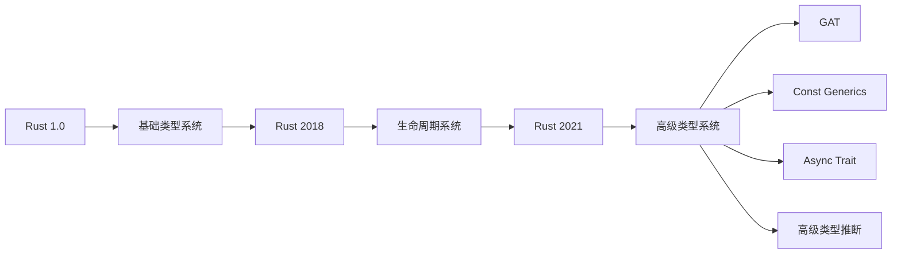
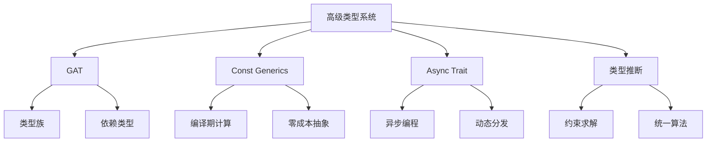

# Rust高级类型系统深度分析

## 目录

- [Rust高级类型系统深度分析](#rust高级类型系统深度分析)
  - [目录](#目录)
  - [1. 概述](#1-概述)
  - [2. Generic Associated Types (GAT)](#2-generic-associated-types-gat)
    - [2.1 概念定义与内涵](#21-概念定义与内涵)
    - [2.2 理论基础](#22-理论基础)
    - [2.3 形式化分析](#23-形式化分析)
    - [2.4 实际示例](#24-实际示例)
    - [2.5 最新发展](#25-最新发展)
  - [3. Const Generics 增强](#3-const-generics-增强)
    - [3.1 概念定义与内涵](#31-概念定义与内涵)
    - [3.2 理论基础](#32-理论基础)
    - [3.3 形式化分析](#33-形式化分析)
    - [3.4 实际示例](#34-实际示例)
  - [4. Async Trait](#4-async-trait)
    - [4.1 概念定义与内涵](#41-概念定义与内涵)
    - [4.2 理论基础](#42-理论基础)
    - [4.3 形式化分析](#43-形式化分析)
    - [4.4 实际示例](#44-实际示例)
  - [5. 高级类型推断](#5-高级类型推断)
    - [5.1 概念定义与内涵](#51-概念定义与内涵)
    - [5.2 理论基础](#52-理论基础)
    - [5.3 形式化分析](#53-形式化分析)
  - [6. 关联性分析](#6-关联性分析)
  - [7. 总结与展望](#7-总结与展望)

---

## 1. 概述

Rust的高级类型系统代表了现代编程语言类型理论的前沿发展。本文档深入分析Rust 2021 Edition引入的高级类型特性，包括Generic Associated Types (GAT)、Const Generics增强、Async Trait等，从理论基础到实际应用进行全面阐述。

### 1.1 类型系统演进



### 1.2 核心价值

- **类型安全**: 编译期保证内存安全和线程安全
- **零成本抽象**: 高级特性不引入运行时开销
- **表达能力**: 支持复杂的类型关系和约束
- **可组合性**: 类型系统组件可以灵活组合

---

## 2. Generic Associated Types (GAT)

### 2.1 概念定义与内涵

Generic Associated Types (GAT) 是Rust 2021 Edition的核心特性，允许关联类型接受泛型参数，从而支持更复杂的类型关系和抽象。

#### 2.1.1 基本定义

```rust
// 传统关联类型
trait Iterator {
    type Item;
    fn next(&mut self) -> Option<Self::Item>;
}

// GAT - 关联类型参数化
trait Container {
    type Item<T>;  // 关联类型接受泛型参数
    fn get<T>(&self) -> &Self::Item<T>;
    fn set<T>(&mut self, value: T) -> &mut Self::Item<T>;
}
```

#### 2.1.2 核心概念

1. **参数化关联类型**: 关联类型可以接受类型参数
2. **生命周期参数**: 支持生命周期参数化
3. **约束传播**: 类型约束在关联类型间传播
4. **类型族**: 支持类型族的概念

### 2.2 理论基础

#### 2.2.1 类型理论基础

GAT的理论基础源于**依赖类型理论**和**高阶类型系统**：

```rust
// 依赖类型理论的应用
trait DependentContainer {
    type Item<T: Clone>;  // 类型参数约束
    type Length<T>: Into<usize>;  // 关联类型约束
    
    fn get<T: Clone>(&self) -> &Self::Item<T>;
    fn length<T>(&self) -> Self::Length<T>;
}
```

#### 2.2.2 范畴论视角

从范畴论角度看，GAT实现了**函子**和**自然变换**的概念：

```rust
// 函子实现
trait Functor {
    type F<T>;  // 函子映射
    
    fn map<A, B, F>(fa: Self::F<A>, f: F) -> Self::F<B>
    where
        F: Fn(A) -> B;
}

// 自然变换
trait NaturalTransformation<F, G> {
    fn transform<A>(fa: F<A>) -> G<A>;
}
```

### 2.3 形式化分析

#### 2.3.1 类型规则

```rust
// GAT的类型规则
Γ ⊢ T : Type
Γ, x: T ⊢ U : Type
─────────────────────────
Γ ⊢ ∀x: T. U : Type

// 应用规则
Γ ⊢ f : ∀x: T. U
Γ ⊢ t : T
─────────────────
Γ ⊢ f(t) : U[t/x]
```

#### 2.3.2 约束系统

```rust
// 约束传播规则
trait ConstraintPropagation {
    type Item<T: Clone + Debug>;  // 约束传播
    type Container<T>: Iterator<Item = T>;  // 关联类型约束
}
```

### 2.4 实际示例

#### 2.4.1 数据库抽象

```rust
// 数据库连接抽象
trait Database {
    type Connection<T: Transaction>;
    type Query<T: Clone>;
    type Result<T>;
    
    fn connect<T: Transaction>(&self) -> Self::Connection<T>;
    fn execute<T: Clone>(&self, query: Self::Query<T>) -> Self::Result<T>;
}

// 具体实现
struct PostgresDatabase;

impl Database for PostgresDatabase {
    type Connection<T: Transaction> = PostgresConnection<T>;
    type Query<T: Clone> = PostgresQuery<T>;
    type Result<T> = PostgresResult<T>;
    
    fn connect<T: Transaction>(&self) -> Self::Connection<T> {
        PostgresConnection::new()
    }
    
    fn execute<T: Clone>(&self, query: Self::Query<T>) -> Self::Result<T> {
        // 实现细节
    }
}
```

#### 2.4.2 序列化框架

```rust
// 序列化trait
trait Serializer {
    type Output<T: Serialize>;
    type Error;
    
    fn serialize<T: Serialize>(&self, value: &T) -> Result<Self::Output<T>, Self::Error>;
}

// 反序列化trait
trait Deserializer {
    type Input<T: DeserializeOwned>;
    type Error;
    
    fn deserialize<T: DeserializeOwned>(&self, input: Self::Input<T>) -> Result<T, Self::Error>;
}
```

### 2.5 最新发展

#### 2.5.1 编译器支持

- **rustc 1.65+**: 稳定版GAT支持
- **类型推断改进**: 更智能的类型推断算法
- **错误信息优化**: 更清晰的错误提示

#### 2.5.2 生态系统应用

```rust
// 异步运行时中的GAT应用
trait AsyncRuntime {
    type Task<T>;
    type Future<T>;
    
    fn spawn<T>(&self, future: Self::Future<T>) -> Self::Task<T>;
    fn block_on<T>(&self, future: Self::Future<T>) -> T;
}
```

---

## 3. Const Generics 增强

### 3.1 概念定义与内涵

Const Generics允许在编译期使用常量值作为泛型参数，实现零成本的编译期计算和类型安全。

#### 3.1.1 基本语法

```rust
// 基础const泛型
struct Array<T, const N: usize> {
    data: [T; N],
}

// const泛型函数
const fn create_array<T, const N: usize>(value: T) -> [T; N] {
    [value; N]
}
```

### 3.2 理论基础

#### 3.2.1 编译期计算理论

```rust
// 编译期计算
const fn fibonacci(n: u32) -> u32 {
    match n {
        0 => 0,
        1 => 1,
        _ => fibonacci(n - 1) + fibonacci(n - 2),
    }
}

// 编译期验证
struct Matrix<T, const ROWS: usize, const COLS: usize> {
    data: [[T; COLS]; ROWS],
}

impl<T, const ROWS: usize, const COLS: usize> Matrix<T, ROWS, COLS> {
    const fn is_square() -> bool {
        ROWS == COLS
    }
    
    fn transpose(self) -> Matrix<T, COLS, ROWS> {
        // 编译期保证类型安全
        unsafe { std::mem::transmute(self) }
    }
}
```

### 3.3 形式化分析

#### 3.3.1 类型系统扩展

```rust
// 类型系统规则
Γ ⊢ c : Const
Γ ⊢ T : Type
─────────────────
Γ ⊢ T[c] : Type

// 约束系统
trait ConstConstraint {
    const N: usize;
    const M: usize;
    
    // 编译期约束
    const IS_VALID: bool = Self::N > 0 && Self::M > 0;
}
```

### 3.4 实际示例

#### 3.4.1 数学库实现

```rust
// 向量类型
struct Vector<T, const N: usize> {
    data: [T; N],
}

impl<T: Clone + Default, const N: usize> Vector<T, N> {
    fn new() -> Self {
        Self {
            data: [T::default(); N],
        }
    }
    
    fn dot_product<const M: usize>(&self, other: &Vector<T, M>) -> T 
    where
        T: Mul<Output = T> + Add<Output = T> + Copy,
    {
        assert_eq!(N, M);
        // 实现点积计算
        self.data.iter()
            .zip(other.data.iter())
            .map(|(a, b)| *a * *b)
            .fold(T::default(), |acc, x| acc + x)
    }
}
```

---

## 4. Async Trait

### 4.1 概念定义与内涵

Async Trait允许在trait中定义异步方法，支持动态分发的异步编程模式。

#### 4.1.1 基本语法

```rust
// 异步trait定义
trait AsyncProcessor {
    async fn process(&self, data: &[u8]) -> Result<Vec<u8>, Error>;
    async fn validate(&self, input: &str) -> bool;
}

// 异步trait对象
async fn process_data(processor: &dyn AsyncProcessor, data: &[u8]) -> Result<Vec<u8>, Error> {
    processor.process(data).await
}
```

### 4.2 理论基础

#### 4.2.1 异步编程模型

```rust
// Future trait的扩展
trait AsyncTrait {
    type Future<T>: Future<Output = T>;
    
    fn async_method(&self) -> Self::Future<()>;
}

// 动态分发支持
trait AsyncObject {
    async fn method(&self) -> ();
}

impl<T: AsyncObject + ?Sized> AsyncObject for Box<T> {
    async fn method(&self) -> () {
        (**self).method().await
    }
}
```

### 4.3 形式化分析

#### 4.3.1 类型系统规则

```rust
// 异步方法类型规则
Γ ⊢ self: &Self
Γ ⊢ async fn method() -> T
─────────────────────────────
Γ ⊢ self.method(): impl Future<Output = T>

// 动态分发规则
Γ ⊢ obj: &dyn AsyncTrait
Γ ⊢ async fn method() -> T
─────────────────────────────
Γ ⊢ obj.method(): Pin<Box<dyn Future<Output = T>>>
```

### 4.4 实际示例

#### 4.4.1 网络服务抽象

```rust
// 网络服务trait
trait NetworkService {
    async fn connect(&self, endpoint: &str) -> Result<Connection, Error>;
    async fn send(&self, data: &[u8]) -> Result<usize, Error>;
    async fn receive(&self) -> Result<Vec<u8>, Error>;
}

// HTTP服务实现
struct HttpService;

impl NetworkService for HttpService {
    async fn connect(&self, endpoint: &str) -> Result<Connection, Error> {
        // HTTP连接实现
        Ok(Connection::new())
    }
    
    async fn send(&self, data: &[u8]) -> Result<usize, Error> {
        // HTTP发送实现
        Ok(data.len())
    }
    
    async fn receive(&self) -> Result<Vec<u8>, Error> {
        // HTTP接收实现
        Ok(vec![])
    }
}
```

---

## 5. 高级类型推断

### 5.1 概念定义与内涵

高级类型推断是Rust编译器自动推导类型的能力，支持复杂的类型关系和约束。

#### 5.1.1 类型推断算法

```rust
// Hindley-Milner类型推断的扩展
trait TypeInference {
    type Context;
    type Constraint;
    type Solution;
    
    fn infer(&self, expr: &Expr) -> Result<Self::Solution, Error>;
    fn unify(&self, constraints: Vec<Self::Constraint>) -> Result<Self::Solution, Error>;
}
```

### 5.2 理论基础

#### 5.2.1 约束求解理论

```rust
// 约束系统
struct ConstraintSystem {
    constraints: Vec<TypeConstraint>,
    substitutions: HashMap<TypeVar, Type>,
}

impl ConstraintSystem {
    fn solve(&mut self) -> Result<Substitution, Error> {
        // 实现约束求解算法
        self.unification_algorithm()
    }
    
    fn unification_algorithm(&mut self) -> Result<Substitution, Error> {
        // 实现统一算法
        Ok(Substitution::new())
    }
}
```

### 5.3 形式化分析

#### 5.3.1 类型推断规则

```rust
// 变量规则
Γ(x) = τ
─────────
Γ ⊢ x : τ

// 应用规则
Γ ⊢ e₁ : τ₁ → τ₂
Γ ⊢ e₂ : τ₁
─────────────────
Γ ⊢ e₁(e₂) : τ₂

// 抽象规则
Γ, x: τ₁ ⊢ e : τ₂
───────────────────
Γ ⊢ λx. e : τ₁ → τ₂
```

---

## 6. 关联性分析

### 6.1 特性间关系



### 6.2 应用场景整合

```rust
// 综合应用示例
trait AdvancedContainer<T, const N: usize> {
    type Item<U: Clone>;
    type AsyncProcessor: AsyncProcessor;
    
    async fn process_items<U: Clone>(&self) -> Vec<Self::Item<U>>;
    const fn validate_size() -> bool {
        N > 0
    }
}
```

---

## 7. 总结与展望

### 7.1 核心价值

1. **类型安全**: 编译期保证内存安全和线程安全
2. **表达能力**: 支持复杂的类型关系和抽象
3. **零成本**: 高级特性不引入运行时开销
4. **可组合性**: 类型系统组件灵活组合

### 7.2 未来发展方向

1. **更强大的类型推断**: 支持更复杂的类型关系推导
2. **形式化验证**: 集成形式化验证工具
3. **性能优化**: 编译器优化技术改进
4. **生态系统**: 更多库和工具的支持

### 7.3 学习建议

1. **理论基础**: 深入理解类型理论和范畴论
2. **实践应用**: 通过实际项目掌握高级特性
3. **生态系统**: 关注相关库和工具的发展
4. **持续学习**: 跟踪Rust语言的最新发展

---

## 参考文献

1. Rust Reference - Generic Associated Types
2. Type Theory and Functional Programming
3. Category Theory in Context
4. The Rust Programming Language Book
5. Rust RFCs and Design Documents
