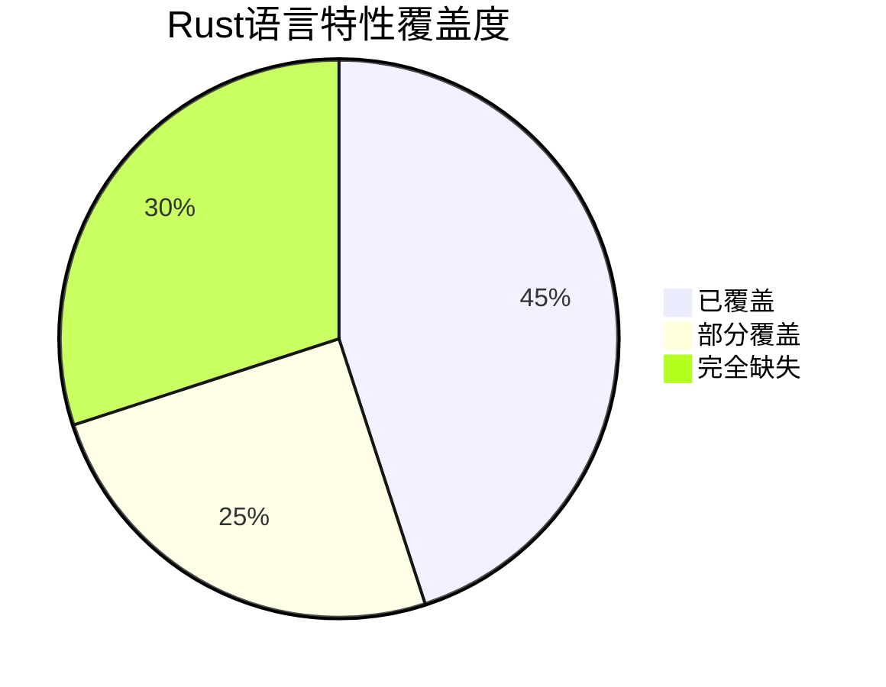

# Rust Crates 文档结构梳理

## 目录

- [Rust Crates 文档结构梳理](#rust-crates-文档结构梳理)
  - [目录](#目录)
  - [概述](#概述)
  - [文档目录树形结构](#文档目录树形结构)
    - [1. c01\_ownership\_borrow\_scope/docs](#1-c01_ownership_borrow_scopedocs)
    - [2. c02\_type\_system/docs](#2-c02_type_systemdocs)
    - [3. c07\_process/docs](#3-c07_processdocs)
    - [4. c15\_blockchain/docs](#4-c15_blockchaindocs)
    - [5. c16\_webassembly/docs](#5-c16_webassemblydocs)
    - [6. c17\_iot/docs](#6-c17_iotdocs)
    - [7. c18\_model/docs](#7-c18_modeldocs)
  - [文档主题分类总结](#文档主题分类总结)
    - [核心语言特性 (c01-c02)](#核心语言特性-c01-c02)
    - [系统编程 (c07)](#系统编程-c07)
    - [应用领域 (c15-c17)](#应用领域-c15-c17)
    - [理论基础 (c18)](#理论基础-c18)
  - [文档特点](#文档特点)
  - [文件命名规律](#文件命名规律)
  - [📋 报告概览](#-报告概览)
  - [�� 报告特色](#-报告特色)
    - [1. **12个主要分析维度**](#1-12个主要分析维度)
    - [2. **多种表征方式**](#2-多种表征方式)
    - [3. **核心发现**](#3-核心发现)
      - [🚨 严重缺失领域](#-严重缺失领域)
      - [🧠 理论视角缺失](#-理论视角缺失)
      - [🤖 应用领域空白](#-应用领域空白)
    - [4. **具体改进建议**](#4-具体改进建议)
      - [第一阶段（1-3个月）](#第一阶段1-3个月)
      - [第二阶段（3-6个月）](#第二阶段3-6个月)
      - [第三阶段（6-12个月）](#第三阶段6-12个月)
    - [5. **量化分析**](#5-量化分析)
      - [覆盖缺口统计](#覆盖缺口统计)
      - [特性覆盖度](#特性覆盖度)
  - [📊 关键价值](#-关键价值)

## 概述

本文档梳理了Rust代码库中所有crates子目录的docs目录结构，包含文件命名和主题分类。

## 文档目录树形结构

### 1. c01_ownership_borrow_scope/docs

-**主题：所有权、借用和作用域系统**

```text
c01_ownership_borrow_scope/docs/
├── variable_analysis.md (19KB) - Rust中的变量分析，涵盖所有权、借用、类型系统推断
├── rust_symmetry.md (13KB) - Rust对称性分析
├── obs_vs_function.md (38KB) - 观察者模式与函数式编程对比
├── obs_vs_design.md (27KB) - 观察者模式与设计模式分析
├── obs_rust_analysis.md (19KB) - Rust观察者模式分析
├── variable/
│   ├── view01.md (27KB) - 变量视图分析
│   ├── view02.md (25KB) - 变量系统设计
│   ├── view03.md (43KB) - 变量类型理论
│   ├── view04.md (126KB) - 变量深度分析
│   └── backup/ - 备份文件目录
├── scope/
│   ├── view01.md (34KB) - 作用域系统分析
│   ├── view02.md (20KB) - 作用域设计模式
│   └── backup/ - 备份文件目录
├── ownership/
│   ├── view01.md (139KB) - 所有权系统深度分析
│   └── backup/ - 备份文件目录
├── mutable/
│   ├── view01.md (16KB) - 可变性基础
│   ├── view02.md (51KB) - 可变性设计模式
│   ├── view03.md (116KB) - 可变性高级特性
│   ├── mutable_rust.md (8.8KB) - Rust可变性模型
│   ├── mutable_model.md (7.5KB) - 可变性理论模型
│   ├── internal_mutable.md (78KB) - 内部可变性深度分析
│   └── internal_mut.md (3.3KB) - 内部可变性基础
├── move/
│   ├── view01.md (29KB) - 移动语义分析
│   ├── rust_internalmut_move.md (2.2KB) - 内部可变性与移动
│   ├── partial_move.md (2.5KB) - 部分移动
│   ├── move_ref_refmut_analysis.md (14KB) - 移动与引用分析
│   └── internal_mut_move.md (15KB) - 内部可变性与移动语义
└── memory/
    ├── rust_balance.md (14KB) - Rust内存平衡机制
    └── rust_balance01.md (25KB) - 内存平衡深度分析
```

### 2. c02_type_system/docs

-**主题：类型系统理论与设计**

```text
c02_type_system/docs/
├── type_system_mindmap.md (6.2KB) - Rust类型系统思维导图
├── type_type_theory.md (8.8KB) - 类型理论与类型系统
├── type_variant.md (5.9KB) - 类型变体分析
├── type_safety_inference.md (12KB) - 类型安全与类型推断
├── type_down_up_cast.md (3.1KB) - 向上向下类型转换
├── type_package.md (11KB) - 类型包系统
├── type_category_theory.md (12KB) - 类型与范畴论
├── type_define.md (9.1KB) - 类型定义系统
├── type_define_variant.md (4.6KB) - 类型定义变体
├── type_cast.md (9.7KB) - 类型转换机制
├── type_HoTT.md (8.3KB) - 同伦类型论
├── affine_type_theory.md (9.2KB) - 仿射类型理论
├── rust_type_design01.md (9.7KB) - Rust类型系统设计(1)
├── rust_type_design02.md (35KB) - Rust类型系统设计(2)
├── rust_type_design03.md (37KB) - Rust类型系统设计(3)
└── rust_type_design04.md (34KB) - Rust类型系统设计(4)
```

### 3. c07_process/docs

-**主题：进程管理与并发**

```text
c07_process/docs/
├── view01.md (45KB) - 进程管理基础
├── view02.md (27KB) - 进程设计模式
├── view03.md (64KB) - 进程高级特性
├── view04.md (32KB) - 进程系统架构
└── view05.md (34KB) - 进程最佳实践
```

### 4. c15_blockchain/docs

-**主题：区块链技术与应用**

```text
c15_blockchain/docs/
├── define.md (25KB) - 区块链基础定义
├── view01.md (41KB) - 区块链基础架构
├── view02.md (26KB) - 区块链设计模式
├── view03.md (27KB) - 区块链类型系统
├── view04.md (78KB) - 区块链高级特性
├── view05.md (21KB) - 区块链安全机制
├── view06.md (108KB) - 区块链深度分析
├── view07.md (30KB) - 区块链并发模型
├── view08.md (154KB) - 区块链系统架构
├── view09.md (29KB) - 区块链网络协议
├── view10.md (82KB) - 区块链智能合约
├── view11.md (27KB) - 区块链共识机制
├── view12.md (11KB) - 区块链数据结构
├── view13.md (23KB) - 区块链加密算法
├── view14.md (13KB) - 区块链性能优化
├── view15.md (24KB) - 区块链扩展性
├── view16.md (26KB) - 区块链互操作性
├── view17.md (18KB) - 区块链治理模型
├── view18.md (20KB) - 区块链经济模型
└── view19.md (24KB) - 区块链未来展望
```

### 5. c16_webassembly/docs

-**主题：WebAssembly技术与Rust集成**

```text
c16_webassembly/docs/
└── rust_webassembly/
    ├── view01.md (39KB) - WebAssembly基础
    ├── view02.md (210KB) - WebAssembly深度分析
    ├── view03.md (136KB) - WebAssembly与Rust集成
    ├── view04.md (13KB) - WebAssembly性能优化
    ├── view05.md (219KB) - WebAssembly高级特性
    ├── view06.md (15KB) - WebAssembly工具链
    ├── view07.md (12KB) - WebAssembly调试技术
    ├── view08.md (24KB) - WebAssembly安全机制
    ├── view09.md (19KB) - WebAssembly最佳实践
    ├── view10.md (19KB) - WebAssembly生态系统
    ├── view11.md (15KB) - WebAssembly未来展望
    ├── view12.md (18KB) - WebAssembly标准规范
    └── view13.md (16KB) - WebAssembly应用案例
```

### 6. c17_iot/docs

-**主题：物联网技术与Rust应用**

```text
c17_iot/docs/
├── ota01.md (77KB) - OTA(空中升级)技术分析
├── view/
│   ├── rust_iot01.md (98KB) - Rust IoT基础架构
│   ├── rust_iot02.md (21KB) - Rust IoT设计模式
│   ├── rust_iot03.md (37KB) - Rust IoT网络协议
│   ├── rust_iot04.md (30KB) - Rust IoT安全机制
│   ├── rust_iot05.md (50KB) - Rust IoT性能优化
│   └── rust_iot06.md (6.2KB) - Rust IoT最佳实践
└── domain/
    ├── iot_view01.md (30KB) - IoT领域分析
    ├── iot_view02.md (11KB) - IoT架构设计
    ├── iot_view03.md (4.8KB) - IoT协议栈
    ├── iot_view04.md (28KB) - IoT安全框架
    ├── iot_view05.md (19KB) - IoT数据处理
    ├── iot_view06.md (42KB) - IoT边缘计算
    ├── iot_view07.md (30KB) - IoT云平台集成
    └── iot_view08.md (24KB) - IoT未来趋势
```

### 7. c18_model/docs

-**主题：形式化模型与理论分析**

```text
c18_model/docs/
├── formal/
│   ├── -深化分析-category.md (17KB) - 范畴论深化分析
│   ├── -三流整合分析.md (15KB) - 三流理论整合
│   ├── -形式语言与认知科学的交叉-rust.md (59KB) - 形式语言与认知科学
│   ├── -形式语言与计算机科学-rust.md (45KB) - 形式语言与计算机科学
│   ├── -深化分析-Rust文档中更深层的理论构造、跨学科应用以及形式语言的哲学基础.md (48KB) - 形式语言哲学基础
│   └── -深化分析-复杂理论构造-跨领域应用以及元级编程模式整合-rust.md (22KB) - 复杂理论构造与元级编程
└── domain/
    ├── view01.md (39KB) - 领域模型基础
    ├── view02.md (36KB) - 领域驱动设计
    ├── view03.md (18KB) - 领域特定语言
    └── view04.md (18KB) - 领域模型验证
```

## 文档主题分类总结

### 核心语言特性 (c01-c02)

- **所有权系统**: 变量分析、作用域、移动语义、内存管理
- **类型系统**: 类型理论、范畴论、类型安全、类型推断

### 系统编程 (c07)

- **进程管理**: 并发控制、进程间通信、系统架构

### 应用领域 (c15-c17)

- **区块链**: 智能合约、共识机制、加密算法、经济模型
- **WebAssembly**: 跨平台编译、性能优化、工具链集成
- **物联网**: OTA升级、边缘计算、安全框架、云平台集成

### 理论基础 (c18)

- **形式化方法**: 范畴论、认知科学、哲学基础、元级编程

## 文档特点

1. **层次化组织**: 每个crate都有清晰的层次结构，从基础概念到高级应用
2. **理论结合实践**: 既有理论分析，也有实际应用案例
3. **跨学科视角**: 结合数学、计算机科学、认知科学等多个领域
4. **渐进式学习**: 从view01到view19，逐步深入复杂主题
5. **完整性覆盖**: 涵盖Rust语言的各个重要特性和应用领域

## 文件命名规律

- **view系列**: 按数字顺序排列，从基础到高级
- **主题前缀**: 如type_、obs_、iot_等，明确标识主题领域
- **分析后缀**: 如_analysis、_design、_model等，表示文档类型
- **中文命名**: 部分文件使用中文命名，便于理解主题内容

这个文档结构展现了Rust语言从基础理论到实际应用的完整知识体系，为学习和研究Rust提供了系统性的参考资料。

分析Rust文档集合的改进空间，并全面列举未覆盖的知识、视角和内容。

## 📋 报告概览

我基于之前的综合分析，创建了一份详细的改进空间分析文档 `rust_documentation_gaps_analysis.md`，全面列举了Rust文档集合中未覆盖的知识、视角和内容。

## �� 报告特色

### 1. **12个主要分析维度**

- 语言特性覆盖缺口
- 理论视角缺失分析
- 应用领域扩展空间
- 教学与学习方法论缺失
- 工具链与生态系统分析
- 前沿技术与研究领域
- 跨语言比较与定位分析
- 性能与优化深度分析
- 安全与形式化验证
- 社区与生态系统分析
- 综合改进建议

### 2. **多种表征方式**

- **Mermaid图表**: 展示概念关系和流程
- **代码示例**: 具体的技术实现
- **表格对比**: 清晰的特性对比
- **饼图统计**: 覆盖度分析
- **思维导图**: 知识结构可视化

### 3. **核心发现**

#### 🚨 严重缺失领域

1. **Rust 2021 Edition特性**: GAT、async trait、const泛型等完全缺失
2. **形式化验证工具**: Prusti、SMACK、Creusot等无覆盖
3. **新兴应用领域**: AI/ML、量子计算、游戏开发等空白
4. **跨语言比较**: 缺乏系统性的语言对比分析
5. **性能分析**: 性能优化和基准测试指导不足

#### 🧠 理论视角缺失

- **认知科学视角**: 心智模型、认知负荷、学习迁移理论
- **神经科学视角**: 编程语言学习的神经机制
- **数据科学视角**: 编程行为数据分析
- **语言学视角**: 编程语言的语言学分析

#### 🤖 应用领域空白

- **AI/ML应用**: 机器学习框架、深度学习、NLP
- **分布式系统**: 服务网格、微服务架构
- **密码学与安全**: 加密算法、安全分析
- **游戏开发**: 游戏引擎、图形渲染、物理引擎

### 4. **具体改进建议**

#### 第一阶段（1-3个月）

- 添加GAT深度分析
- 实现async trait教程
- 集成Prusti验证工具

#### 第二阶段（3-6个月）

- 添加认知科学视角
- AI/ML应用分析
- 量子计算集成

#### 第三阶段（6-12个月）

- 个性化学习路径
- 社区健康度分析
- 发展趋势预测

### 5. **量化分析**

#### 覆盖缺口统计

- **语言特性缺口**: 15+ 个重要特性未覆盖
- **理论视角缺失**: 8+ 种分析框架未应用
- **应用领域空白**: 12+ 个新兴领域无分析
- **工具链覆盖**: 30% 的核心工具链功能缺失

#### 特性覆盖度



## 📊 关键价值

1. **系统性识别**: 全面识别了文档集合的改进空间
2. **优先级排序**: 提供了清晰的改进优先级矩阵
3. **具体指导**: 给出了具体的代码示例和实现方案
4. **长期规划**: 制定了分阶段的改进计划
5. **理论创新**: 提出了多种新颖的分析视角

这份分析报告为Rust文档的持续改进和发展提供了系统性的指导，有助于将这套文档集合发展成为Rust生态系统中最具权威性和实用性的综合性学习资源。
