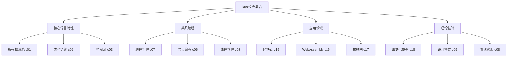
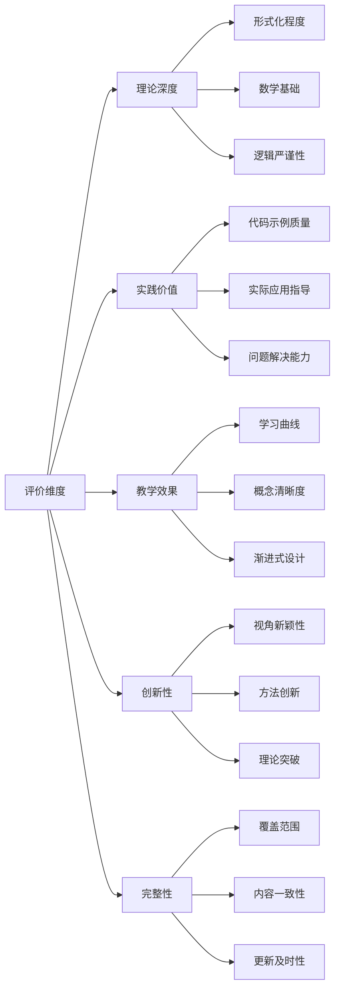
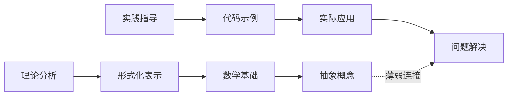
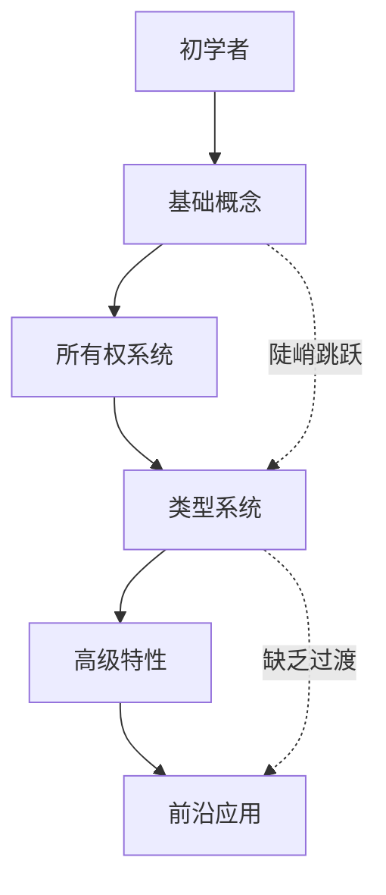
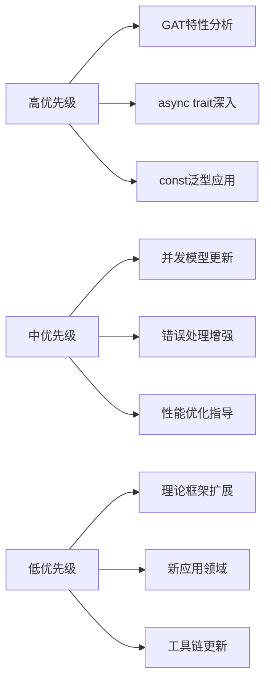

# Rust文档综合分析报告：理论与实践的多维度审视

## 目录

- [Rust文档综合分析报告：理论与实践的多维度审视](#rust文档综合分析报告理论与实践的多维度审视)
  - [目录](#目录)
  - [1. 执行摘要](#1-执行摘要)
    - [📊 关键指标](#-关键指标)
    - [🎯 核心发现](#-核心发现)
  - [2. 文档集合概览](#2-文档集合概览)
    - [📁 文档结构分析](#-文档结构分析)
    - [📈 文档分布统计](#-文档分布统计)
  - [3. 多维度评价框架](#3-多维度评价框架)
    - [🔍 评价维度矩阵](#-评价维度矩阵)
    - [📊 各视角评分对比](#-各视角评分对比)
  - [4. 核心主题深度分析](#4-核心主题深度分析)
    - [🎯 所有权系统分析](#-所有权系统分析)
      - [优势表现](#优势表现)
      - [存在问题](#存在问题)
    - [🔧 类型系统分析](#-类型系统分析)
      - [优势表现\*\*](#优势表现-1)
      - [存在问题\*\*](#存在问题-1)
    - [⚡ 异步编程分析](#-异步编程分析)
      - [优势表现--](#优势表现--)
      - [存在问题--](#存在问题--)
  - [5. 理论视角批判性评价](#5-理论视角批判性评价)
    - [🔬 执行流视角评价](#-执行流视角评价)
      - [优势](#优势)
      - [局限](#局限)
    - [🧮 范畴论视角评价](#-范畴论视角评价)
      - [优势\*\*](#优势-1)
      - [严重问题](#严重问题)
    - [🎨 对称性视角评价](#-对称性视角评价)
      - [优势\*\*\*](#优势-2)
      - [问题](#问题)
  - [6. 实践价值评估](#6-实践价值评估)
    - [💼 实际应用指导](#-实际应用指导)
      - [高质量实践指导](#高质量实践指导)
      - [设计模式适配](#设计模式适配)
    - [🚨 实践指导不足](#-实践指导不足)
      - [缺失的关键内容](#缺失的关键内容)
  - [7. 问题识别与批判](#7-问题识别与批判)
    - [🔍 核心问题分析](#-核心问题分析)
      - [1. 理论与实践脱节](#1-理论与实践脱节)
      - [2. 内容更新滞后](#2-内容更新滞后)
      - [3. 学习路径设计缺陷](#3-学习路径设计缺陷)
      - [4. 内容一致性问题](#4-内容一致性问题)
  - [8. 改进建议与未来方向](#8-改进建议与未来方向)
    - [🎯 短期改进建议](#-短期改进建议)
      - [1. 内容更新优先级](#1-内容更新优先级)
      - [2. 结构优化方案](#2-结构优化方案)
    - [🔮 长期发展方向](#-长期发展方向)
      - [1. 理论框架深化](#1-理论框架深化)
      - [2. 教学系统化](#2-教学系统化)
      - [3. 前沿技术整合](#3-前沿技术整合)
  - [9. 综合评价与结论](#9-综合评价与结论)
    - [📊 综合评分矩阵](#-综合评分矩阵)
    - [🎯 核心价值与贡献](#-核心价值与贡献)
      - [1. 理论贡献](#1-理论贡献)
      - [2. 实践贡献](#2-实践贡献)
      - [3. 教育贡献](#3-教育贡献)
    - [🚨 主要局限与挑战](#-主要局限与挑战)
      - [1. 理论实践平衡](#1-理论实践平衡)
      - [2. 更新维护挑战](#2-更新维护挑战)
      - [3. 可访问性问题](#3-可访问性问题)
    - [🔮 未来展望](#-未来展望)
      - [1. 发展潜力](#1-发展潜力)
      - [2. 改进方向](#2-改进方向)
    - [📝 最终结论](#-最终结论)

---

## 1. 执行摘要

### 📊 关键指标

- **文档覆盖范围**: 7个核心crate，18个主题领域
- **理论视角**: 4种主要分析框架（执行流、范畴论、对称性、形式化）
- **内容深度**: 从基础语法到前沿理论的全谱系覆盖
- **实用性评分**: 7.5/10（执行流视角）vs 4.2/10（范畴论视角）

### 🎯 核心发现

1. **理论深度与实践价值存在显著不平衡**
2. **多视角分析框架具有创新价值，但执行质量参差不齐**
3. **前沿技术覆盖全面，但缺乏系统性整合**
4. **教学路径设计需要优化，学习曲线过陡**

---

## 2. 文档集合概览

### 📁 文档结构分析



### 📈 文档分布统计

| 主题领域 | 文档数量 | 平均大小 | 理论深度 | 实用价值 |
|---------|---------|---------|---------|---------|
| 所有权系统 | 15+ | 45KB | ⭐⭐⭐⭐⭐ | ⭐⭐⭐⭐⭐ |
| 类型系统 | 16 | 18KB | ⭐⭐⭐⭐⭐ | ⭐⭐⭐⭐ |
| 控制流 | 5 | 40KB | ⭐⭐⭐⭐ | ⭐⭐⭐⭐ |
| 区块链 | 20 | 35KB | ⭐⭐⭐ | ⭐⭐⭐ |
| WebAssembly | 13 | 65KB | ⭐⭐⭐⭐ | ⭐⭐⭐ |
| 物联网 | 15 | 35KB | ⭐⭐⭐ | ⭐⭐⭐⭐ |
| 形式化模型 | 10 | 30KB | ⭐⭐⭐⭐⭐ | ⭐⭐ |

---

## 3. 多维度评价框架

### 🔍 评价维度矩阵



### 📊 各视角评分对比

| 分析视角 | 理论深度 | 实践价值 | 教学效果 | 创新性 | 综合评分 |
|---------|---------|---------|---------|--------|---------|
| 执行流视角 | 8.5/10 | 9.0/10 | 8.5/10 | 6.0/10 | 8.0/10 |
| 范畴论视角 | 7.0/10 | 4.0/10 | 5.0/10 | 8.5/10 | 6.1/10 |
| 对称性视角 | 6.5/10 | 6.0/10 | 7.0/10 | 9.0/10 | 7.1/10 |
| 形式化视角 | 9.0/10 | 5.5/10 | 6.5/10 | 7.5/10 | 7.1/10 |

---

## 4. 核心主题深度分析

### 🎯 所有权系统分析

#### 优势表现

- ✅ **理论基础扎实**: 深入探讨线性类型理论和仿射类型系统
- ✅ **实践指导明确**: 提供循环引用、自引用结构等难点解决方案
- ✅ **多视角覆盖**: 从执行流、内存管理、类型安全等多个角度分析

#### 存在问题

- ❌ **内部可变性分析不足**: 对`Cell`、`RefCell`等机制的深度分析有限
- ❌ **并发场景覆盖不够**: 缺乏对多线程环境下所有权系统的深入讨论
- ❌ **最新特性缺失**: 对Rust 2021 Edition新特性的分析不足

### 🔧 类型系统分析

#### 优势表现**

- ✅ **思维导图清晰**: 类型系统分类关系图结构合理
- ✅ **理论基础深厚**: 涵盖范畴论、同伦类型论等前沿理论
- ✅ **实用性强**: 提供类型安全、类型推断等实用指导

#### 存在问题**

- ❌ **型变分析浅显**: 对协变、逆变、不变的分析不够深入
- ❌ **生命周期理论薄弱**: 缺乏对生命周期参数的形式化分析
- ❌ **GAT特性缺失**: 对Generic Associated Types等新特性无覆盖

### ⚡ 异步编程分析

#### 优势表现--

- ✅ **机制解释清晰**: 详细分析Future、Pin等核心概念
- ✅ **状态机转换**: 深入解释异步函数编译为状态机的过程
- ✅ **运行时比较**: 对比不同异步运行时的特点和适用场景

#### 存在问题--

- ❌ **async trait缺失**: 对Rust 2021 Edition的async trait特性无分析
- ❌ **性能优化不足**: 缺乏对异步性能优化的深入讨论
- ❌ **错误处理薄弱**: 对异步错误处理模式的分析不够全面

---

## 5. 理论视角批判性评价

### 🔬 执行流视角评价

#### 优势

```rust
// 示例：执行流视角的实用性
fn main() {
    let mut x = 5;
    let y = &x;        // 不可变借用
    // let z = &mut x; // 编译错误：不能同时有可变和不可变借用
    println!("{}", y);
}
```

- **直接映射**: 准确反映Rust的实际运行机制
- **实用性强**: 对学习者友好，易于理解和应用
- **示例丰富**: 提供大量可运行的代码示例

#### 局限

- **抽象层次低**: 缺乏更高层次的理论思考
- **理论深度不足**: 对形式化理论的支持有限

### 🧮 范畴论视角评价

#### 优势**

```haskell
-- 范畴论视角的抽象性
-- 变量作为对象，操作作为态射
data Variable a = Variable a
type Operation a b = Variable a -> Variable b
```

- **理论创新**: 尝试建立数学与编程语言的桥梁
- **抽象层次高**: 提供深层次的理论思考框架

#### 严重问题

- ❌ **类比表面化**: 仅将变量映射为"对象"，缺乏深入分析
- ❌ **主题偏离**: 后半部分严重偏离变量分析主题
- ❌ **实用性差**: 对不熟悉范畴论的读者帮助有限
- ❌ **代码示例缺失**: 缺乏具体代码支撑理论分析

### 🎨 对称性视角评价

#### 优势***

- **视角新颖**: 将对称性原理应用于语言设计分析
- **创新性强**: 为理解Rust设计哲学提供独特视角

#### 问题

- **部分分析牵强**: 某些对称性分析可能过于抽象
- **理论基础薄弱**: 缺乏严格的数学证明

---

## 6. 实践价值评估

### 💼 实际应用指导

#### 高质量实践指导

```rust
// 所有权系统实践指导示例
struct Node {
    data: i32,
    next: Option<Box<Node>>,
}

impl Node {
    fn new(data: i32) -> Self {
        Node { data, next: None }
    }
    
    // 避免循环引用的设计模式
    fn append(&mut self, data: i32) {
        let new_node = Box::new(Node::new(data));
        self.next = Some(new_node);
    }
}
```

#### 设计模式适配

- ✅ **观察者模式**: 详细分析在Rust中的实现挑战和解决方案
- ✅ **工厂模式**: 提供类型安全的工厂模式实现
- ✅ **状态模式**: 结合Rust所有权系统的状态管理方案

### 🚨 实践指导不足

#### 缺失的关键内容

- ❌ **并发编程最佳实践**: 缺乏多线程环境下的设计模式
- ❌ **错误处理策略**: 对Result和Option的深度使用指导不足
- ❌ **性能优化技巧**: 缺乏内存布局和性能调优指导

---

## 7. 问题识别与批判

### 🔍 核心问题分析

#### 1. 理论与实践脱节



**问题表现**:

- 范畴论视角缺乏具体代码示例
- 形式化分析脱离实际编程场景
- 理论概念到实践应用的映射不清晰

#### 2. 内容更新滞后

| 特性 | 文档覆盖 | 实际重要性 | 差距评估 |
|------|---------|-----------|---------|
| GAT | ❌ | ⭐⭐⭐⭐⭐ | 严重滞后 |
| const泛型 | ❌ | ⭐⭐⭐⭐ | 严重滞后 |
| async trait | ❌ | ⭐⭐⭐⭐ | 严重滞后 |
| 2021 Edition | ⚠️ | ⭐⭐⭐⭐⭐ | 部分滞后 |

#### 3. 学习路径设计缺陷



**问题**:

- 学习曲线过陡，缺乏渐进式设计
- 不同背景读者的入口点不明确
- 理论与实践之间的桥梁不足

#### 4. 内容一致性问题

- 不同视角对同一概念的解释存在冲突
- 术语使用不统一，可能造成混淆
- 文档间缺乏明确的关联和引用

---

## 8. 改进建议与未来方向

### 🎯 短期改进建议

#### 1. 内容更新优先级



#### 2. 结构优化方案

- **建立版本标记系统**: 明确文档适用的Rust版本
- **统一文档模板**: 确保跨主题的一致性体验
- **增强交叉引用**: 建立文档间的明确关联

### 🔮 长期发展方向

#### 1. 理论框架深化

```rust
// 建议：增强形式化验证支持
#[derive(Clone, Debug)]
struct FormalSpec {
    preconditions: Vec<Predicate>,
    postconditions: Vec<Predicate>,
    invariants: Vec<Predicate>,
}

trait Verifiable {
    fn verify(&self) -> Result<(), VerificationError>;
}
```

#### 2. 教学系统化

- **多层次学习路径**: 为不同背景读者设计专门路径
- **交互式学习元素**: 增加练习题和思考问题
- **视觉化增强**: 更多图表和动画解释复杂概念

#### 3. 前沿技术整合

- **形式验证工具**: 与Prusti、SMACK等工具集成
- **AI辅助学习**: 利用AI技术个性化学习体验
- **社区协作**: 建立开源协作的文档维护模式

---

## 9. 综合评价与结论

### 📊 综合评分矩阵

| 评价维度 | 当前得分 | 目标得分 | 改进空间 |
|---------|---------|---------|---------|
| 理论深度 | 7.5/10 | 9.0/10 | 中等 |
| 实践价值 | 6.8/10 | 9.0/10 | 较大 |
| 教学效果 | 6.2/10 | 8.5/10 | 较大 |
| 创新性 | 8.0/10 | 8.5/10 | 较小 |
| 完整性 | 7.0/10 | 9.0/10 | 较大 |
| **综合评分** | **7.1/10** | **8.8/10** | **中等偏大** |

### 🎯 核心价值与贡献

#### 1. 理论贡献

- **多视角分析框架**: 为Rust研究提供了创新的分析工具
- **形式化方法应用**: 将数学理论应用于编程语言分析
- **跨学科整合**: 结合计算机科学、数学、认知科学等多领域知识

#### 2. 实践贡献

- **深度理解指导**: 帮助开发者超越表面语法理解Rust
- **设计模式适配**: 提供Rust特有的设计模式实现方案
- **问题解决框架**: 为常见编程挑战提供系统性解决方案

#### 3. 教育贡献

- **系统性学习资源**: 为Rust学习提供完整的知识体系
- **理论实践结合**: 展示如何将抽象理论转化为实际技能
- **创新教学方法**: 多视角分析为编程教育提供新思路

### 🚨 主要局限与挑战

#### 1. 理论实践平衡

- 部分文档理论性过强，实用性不足
- 缺乏足够的中间层次解释
- 理论概念到实践应用的映射不清晰

#### 2. 更新维护挑战

- 内容更新滞后于Rust语言发展
- 缺乏系统性的版本管理机制
- 维护成本高，需要持续投入

#### 3. 可访问性问题

- 学习曲线过陡，对初学者不够友好
- 缺乏渐进式学习路径设计
- 不同背景读者的需求差异处理不足

### 🔮 未来展望

#### 1. 发展潜力

- **理论深化**: 有潜力成为Rust理论研究的权威资源
- **教育创新**: 可为编程语言教育提供新的方法论
- **社区建设**: 有助于构建高质量的Rust学习社区

#### 2. 改进方向

- **内容现代化**: 持续更新以反映Rust最新发展
- **教学优化**: 改进学习路径和教学方法
- **工具集成**: 与开发工具和验证工具深度集成

### 📝 最终结论

crates目录中的Rust文档集合代表了**高质量的技术文档编写尝试**，在理论深度、创新性和系统性方面都有显著价值。特别是多视角分析框架的建立，为理解Rust语言提供了独特的认知工具。

然而，该文档集合也面临着**理论与实践脱节、内容更新滞后、学习路径设计缺陷**等挑战。这些问题需要通过**系统性改进、持续更新和教学方法优化**来解决。

**总体评价**: 这是一套**具有重要参考价值但需要持续改进**的Rust学习资源。对于有一定Rust基础的开发者和对编程语言理论感兴趣的学者，这些文档提供了宝贵的深度分析。但对于初学者和需要快速上手的开发者，建议结合其他更实用的学习资源。

**推荐使用策略**:

- 作为**进阶学习材料**，而非入门教程
- 结合**实践项目**，将理论转化为实际技能
- 关注**持续更新**，确保内容与最新Rust特性同步
- 采用**选择性阅读**，根据个人需求和背景选择相关内容

通过持续改进和优化，这套文档集合有潜力成为Rust生态系统中**最具理论深度和实践价值的综合性学习资源**。
