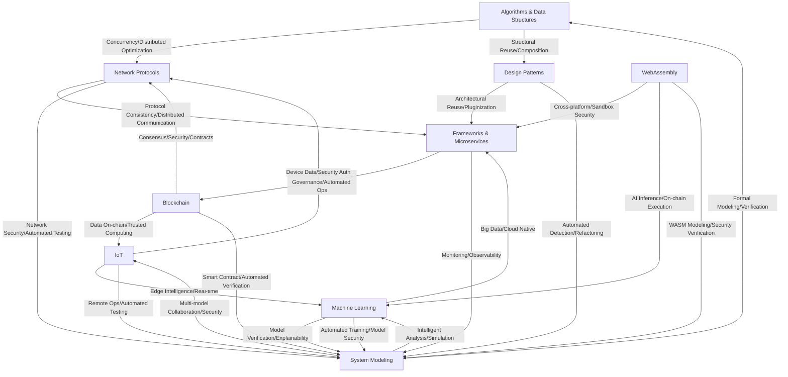

# Rust Formal Engineering Global Knowledge Graph (English)

> This knowledge graph is auto-generated, showing the cross-domain theoretical and engineering relationships of the Rust formal engineering system for global understanding and continuous evolution.
