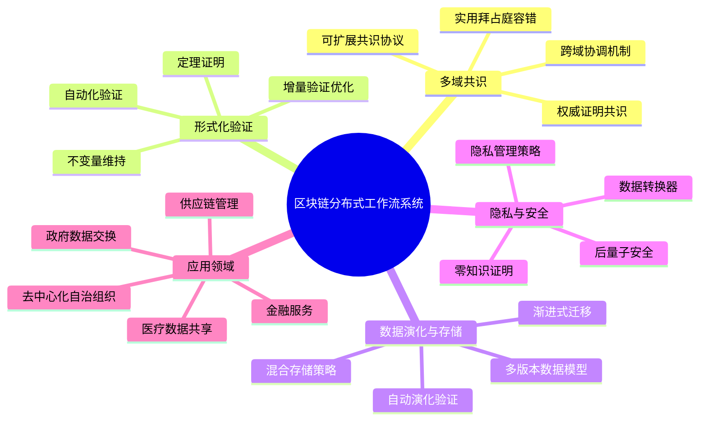

# 分布式工作流系统的区块链共识与形式化验证

```text
<think>
分析用户需求：

1. 用户希望从新视角重新生成，聚焦三个主要方面：
   - 基于区块链的去中心化多域工作流编排
   - 形式化验证工具和不变量维持机制
   - 数据存储和数据模型的设计权衡

2. 需要维持原来的话题范围(分布式工作流系统)，但采用新的视角，关注这三个具体方面

3. 我需要生成高质量、详细的Go代码，展示这些概念的实现

可以从以下角度来构建响应：

1. 介绍基于区块链的分布式工作流共识机制
2. 讨论形式化验证工具和不变量维持
3. 探讨数据存储和模型设计权衡
4. 提供相关的Go代码示例
5. 总结设计原则和未来方向

我会确保代码详细、完整，并保持中文回复。
</think>
```

## 目录

## 1. 引言：新视角与设计目标

当前的分布式工作流系统面临着多域协作、形式验证和数据一致性三大挑战。
本文从全新视角出发，
围绕区块链共识机制、形式化验证和数据模型权衡，重新设计分布式工作流框架。

### 1.1 设计目标

```go
// 系统设计原则接口
type DesignPrinciple interface {
    // 获取原则描述
    Description() string
    
    // 验证系统是否符合该原则
    Validate(system *WorkflowSystem) ValidationResult
    
    // 获取形式化表达
    FormalExpression() string
}

// 多域工作流设计原则
type MultiDomainWorkflowPrinciple struct {}

func (p *MultiDomainWorkflowPrinciple) Description() string {
    return "工作流系统应能跨组织边界安全协作，保持数据隐私和操作透明性"
}

func (p *MultiDomainWorkflowPrinciple) FormalExpression() string {
    return "∀ w ∈ Workflows, ∀ d1,d2 ∈ Domains: execute(w,d1) ∧ execute(w,d2) ⇒ consistent(w,d1,d2) ∧ private(w,d1,d2)"
}

// 形式化验证原则
type FormalVerificationPrinciple struct {}

func (p *FormalVerificationPrinciple) Description() string {
    return "工作流修改必须可被自动化验证，确保关键不变量在演化过程中维持"
}

// 数据演化原则
type DataEvolutionPrinciple struct {}

func (p *DataEvolutionPrinciple) Description() string {
    return "数据模型应支持版本化演化，同时保持向前和向后兼容性"
}
```

## 2. 区块链共识驱动的多域工作流

### 2.1 区块链共识模型

区块链技术为去中心化工作流提供了可靠的共识机制，我们设计了一个专门的共识层：

```go
// 区块链工作流节点
type BlockchainWorkflowNode struct {
    // 节点ID
    ID string
    
    // 密钥对
    keyPair *crypto.KeyPair
    
    // 本地区块链
    blockchain *Blockchain
    
    // 共识引擎
    consensusEngine ConsensusEngine
    
    // 工作流执行器
    workflowExecutor *WorkflowExecutor
    
    // 跨域连接管理器
    domainConnector *DomainConnector
    
    // P2P网络
    network *P2PNetwork
    
    // 存储层
    storage Storage
    
    // 验证器
    validator *WorkflowValidator
    
    // 权限管理器
    permissionManager *PermissionManager
    
    // 锁
    mu sync.RWMutex
    
    // 指标收集器
    metrics *NodeMetrics
}

// 创建区块链工作流节点
func NewBlockchainWorkflowNode(config NodeConfig) (*BlockchainWorkflowNode, error) {
    // 生成密钥对
    keyPair, err := crypto.GenerateKeyPair()
    if err != nil {
        return nil, fmt.Errorf("生成密钥对失败: %w", err)
    }
    
    // 创建本地存储
    storage, err := NewStorage(config.StorageConfig)
    if err != nil {
        return nil, fmt.Errorf("创建存储失败: %w", err)
    }
    
    // 实例化区块链
    blockchain, err := NewBlockchain(storage, config.BlockchainConfig)
    if err != nil {
        return nil, fmt.Errorf("初始化区块链失败: %w", err)
    }
    
    // 根据配置选择共识引擎
    var consensusEngine ConsensusEngine
    switch config.ConsensusType {
    case "proof_of_authority":
        consensusEngine, err = NewPoAConsensus(keyPair, config.ConsensusConfig)
    case "practical_byzantine_fault_tolerance":
        consensusEngine, err = NewPBFTConsensus(keyPair, config.ConsensusConfig)
    case "proof_of_stake":
        consensusEngine, err = NewPoSConsensus(keyPair, config.ConsensusConfig)
    default:
        return nil, fmt.Errorf("不支持的共识类型: %s", config.ConsensusType)
    }
    
    if err != nil {
        return nil, fmt.Errorf("创建共识引擎失败: %w", err)
    }
    
    // 创建P2P网络
    network, err := NewP2PNetwork(config.NetworkConfig, keyPair)
    if err != nil {
        return nil, fmt.Errorf("创建P2P网络失败: %w", err)
    }
    
    // 创建工作流验证器
    validator, err := NewWorkflowValidator(config.ValidatorConfig)
    if err != nil {
        return nil, fmt.Errorf("创建工作流验证器失败: %w", err)
    }
    
    // 创建权限管理器
    permissionManager, err := NewPermissionManager(config.PermissionConfig)
    if err != nil {
        return nil, fmt.Errorf("创建权限管理器失败: %w", err)
    }
    
    // 创建工作流执行器
    executor, err := NewWorkflowExecutor(blockchain, validator, permissionManager, config.ExecutorConfig)
    if err != nil {
        return nil, fmt.Errorf("创建工作流执行器失败: %w", err)
    }
    
    // 创建域连接器
    domainConnector, err := NewDomainConnector(network, keyPair, config.DomainConfig)
    if err != nil {
        return nil, fmt.Errorf("创建域连接器失败: %w", err)
    }
    
    node := &BlockchainWorkflowNode{
        ID:                uuid.New().String(),
        keyPair:           keyPair,
        blockchain:        blockchain,
        consensusEngine:   consensusEngine,
        workflowExecutor:  executor,
        domainConnector:   domainConnector,
        network:           network,
        storage:           storage,
        validator:         validator,
        permissionManager: permissionManager,
        metrics:           NewNodeMetrics(),
    }
    
    return node, nil
}

// 启动节点
func (node *BlockchainWorkflowNode) Start(ctx context.Context) error {
    // 启动P2P网络
    if err := node.network.Start(ctx); err != nil {
        return fmt.Errorf("启动P2P网络失败: %w", err)
    }
    
    // 初始化区块链
    if err := node.blockchain.Initialize(); err != nil {
        return fmt.Errorf("初始化区块链失败: %w", err)
    }
    
    // 启动共识引擎
    if err := node.consensusEngine.Start(ctx, node.network, node.blockchain); err != nil {
        return fmt.Errorf("启动共识引擎失败: %w", err)
    }
    
    // 启动工作流执行器
    if err := node.workflowExecutor.Start(ctx); err != nil {
        return fmt.Errorf("启动工作流执行器失败: %w", err)
    }
    
    // 启动域连接器
    if err := node.domainConnector.Start(ctx); err != nil {
        return fmt.Errorf("启动域连接器失败: %w", err)
    }
    
    // 启动API服务
    if err := node.startAPIService(ctx); err != nil {
        return fmt.Errorf("启动API服务失败: %w", err)
    }
    
    log.Printf("区块链工作流节点已启动，ID: %s", node.ID)
    return nil
}

// 部署工作流
func (node *BlockchainWorkflowNode) DeployWorkflow(
    ctx context.Context,
    definition *WorkflowDefinition,
    deployer string,
    options *DeploymentOptions,
) (string, error) {
    node.mu.Lock()
    defer node.mu.Unlock()
    
    // 验证工作流定义
    validationResult, err := node.validator.ValidateDefinition(definition)
    if err != nil || !validationResult.Valid {
        return "", fmt.Errorf("工作流验证失败: %v", validationResult.Errors)
    }
    
    // 检查部署者权限
    if !node.permissionManager.CanDeploy(deployer, definition) {
        return "", errors.New("没有部署权限")
    }
    
    // 创建部署交易
    deployTx := &WorkflowDeployTransaction{
        WorkflowID:        uuid.New().String(),
        Definition:        definition,
        Deployer:          deployer,
        Timestamp:         time.Now().Unix(),
        DeploymentOptions: options,
        Domains:           definition.Domains,
    }
    
    // 签名交易
    signature, err := node.keyPair.Sign(deployTx.Hash())
    if err != nil {
        return "", fmt.Errorf("签名交易失败: %w", err)
    }
    deployTx.Signature = signature
    
    // 广播交易
    err = node.consensusEngine.ProposeTransaction(ctx, deployTx)
    if err != nil {
        return "", fmt.Errorf("提交部署交易失败: %w", err)
    }
    
    // 等待交易确认
    confirmed, err := node.waitForTransactionConfirmation(ctx, deployTx.Hash(), 30*time.Second)
    if err != nil || !confirmed {
        return "", fmt.Errorf("交易确认失败: %v", err)
    }
    
    node.metrics.WorkflowsDeployed.Inc()
    return deployTx.WorkflowID, nil
}

// 等待交易确认
func (node *BlockchainWorkflowNode) waitForTransactionConfirmation(
    ctx context.Context,
    txHash []byte,
    timeout time.Duration,
) (bool, error) {
    ctx, cancel := context.WithTimeout(ctx, timeout)
    defer cancel()
    
    confirmChan := make(chan bool, 1)
    errChan := make(chan error, 1)
    
    go func() {
        for {
            // 检查交易是否已被包含在区块中
            included, err := node.blockchain.IsTransactionIncluded(txHash)
            if err != nil {
                errChan <- err
                return
            }
            
            if included {
                confirmChan <- true
                return
            }
            
            select {
            case <-ctx.Done():
                return
            case <-time.After(500 * time.Millisecond):
                // 继续检查
            }
        }
    }()
    
    select {
    case confirmed := <-confirmChan:
        return confirmed, nil
    case err := <-errChan:
        return false, err
    case <-ctx.Done():
        return false, ctx.Err()
    }
}

// 执行工作流
func (node *BlockchainWorkflowNode) ExecuteWorkflow(
    ctx context.Context,
    workflowID string,
    input map[string]interface{},
    initiator string,
) (string, error) {
    // 验证权限
    if !node.permissionManager.CanExecute(initiator, workflowID) {
        return "", errors.New("没有执行权限")
    }
    
    // 创建执行请求交易
    execTx := &WorkflowExecutionTransaction{
        ExecutionID:  uuid.New().String(),
        WorkflowID:   workflowID,
        Input:        input,
        Initiator:    initiator,
        Timestamp:    time.Now().Unix(),
    }
    
    // 签名交易
    signature, err := node.keyPair.Sign(execTx.Hash())
    if err != nil {
        return "", fmt.Errorf("签名交易失败: %w", err)
    }
    execTx.Signature = signature
    
    // 提交执行交易
    err = node.consensusEngine.ProposeTransaction(ctx, execTx)
    if err != nil {
        return "", fmt.Errorf("提交执行交易失败: %w", err)
    }
    
    // 等待交易确认
    confirmed, err := node.waitForTransactionConfirmation(ctx, execTx.Hash(), 30*time.Second)
    if err != nil || !confirmed {
        return "", fmt.Errorf("交易确认失败: %v", err)
    }
    
    node.metrics.WorkflowExecutionsStarted.Inc()
    return execTx.ExecutionID, nil
}
```

### 2.2 多域工作流编排

多域工作流需要特殊的协调机制来处理跨组织边界的交互：

```go
// 域连接器
type DomainConnector struct {
    // 本地节点信息
    localNodeID string
    localDomain string
    
    // 密钥对
    keyPair *crypto.KeyPair
    
    // P2P网络
    network *P2PNetwork
    
    // 已连接域
    connectedDomains map[string]*DomainConnection
    
    // 域访问控制策略
    accessPolicies map[string]*AccessPolicy
    
    // 跨域事件监听器
    eventListeners map[string][]EventListener
    
    // 跨域交易处理器
    transactionProcessors map[string]TransactionProcessor
    
    // 防篡改数据共享
    tamperProofSharing *TamperProofDataSharing
    
    // 零知识证明验证器
    zkpVerifier *ZKPVerifier
    
    // 锁
    mu sync.RWMutex
    
    // 指标收集器
    metrics *DomainMetrics
}

// 创建域连接器
func NewDomainConnector(
    network *P2PNetwork,
    keyPair *crypto.KeyPair,
    config DomainConfig,
) (*DomainConnector, error) {
    // 创建防篡改数据共享
    tamperProofSharing, err := NewTamperProofDataSharing(keyPair, config.SharingConfig)
    if err != nil {
        return nil, fmt.Errorf("创建防篡改数据共享失败: %w", err)
    }
    
    // 创建零知识证明验证器
    zkpVerifier, err := NewZKPVerifier(config.ZKPConfig)
    if err != nil {
        return nil, fmt.Errorf("创建零知识证明验证器失败: %w", err)
    }
    
    return &DomainConnector{
        localNodeID:          config.NodeID,
        localDomain:          config.DomainID,
        keyPair:              keyPair,
        network:              network,
        connectedDomains:     make(map[string]*DomainConnection),
        accessPolicies:       make(map[string]*AccessPolicy),
        eventListeners:       make(map[string][]EventListener),
        transactionProcessors: make(map[string]TransactionProcessor),
        tamperProofSharing:   tamperProofSharing,
        zkpVerifier:          zkpVerifier,
        metrics:              NewDomainMetrics(),
    }, nil
}

// 启动域连接器
func (dc *DomainConnector) Start(ctx context.Context) error {
    // 注册消息处理器
    dc.network.RegisterMessageHandler("domain_discovery", dc.handleDomainDiscovery)
    dc.network.RegisterMessageHandler("domain_connection_request", dc.handleConnectionRequest)
    dc.network.RegisterMessageHandler("workflow_execution_request", dc.handleWorkflowExecutionRequest)
    dc.network.RegisterMessageHandler("cross_domain_event", dc.handleCrossDomainEvent)
    dc.network.RegisterMessageHandler("zero_knowledge_proof", dc.handleZeroKnowledgeProof)
    
    // 广播域发现消息
    go dc.broadcastDiscoveryMessage(ctx)
    
    // 启动心跳检查
    go dc.startDomainHeartbeats(ctx)
    
    return nil
}

// 广播域发现消息
func (dc *DomainConnector) broadcastDiscoveryMessage(ctx context.Context) {
    ticker := time.NewTicker(5 * time.Minute)
    defer ticker.Stop()
    
    // 首次立即广播
    dc.sendDiscoveryMessage()
    
    for {
        select {
        case <-ctx.Done():
            return
        case <-ticker.C:
            dc.sendDiscoveryMessage()
        }
    }
}

// 发送域发现消息
func (dc *DomainConnector) sendDiscoveryMessage() {
    message := &DomainDiscoveryMessage{
        NodeID:     dc.localNodeID,
        DomainID:   dc.localDomain,
        Timestamp:  time.Now().Unix(),
        Capabilities: dc.getLocalCapabilities(),
    }
    
    // 签名消息
    signature, err := dc.keyPair.Sign(message.Hash())
    if err != nil {
        log.Printf("签名域发现消息失败: %v", err)
        return
    }
    message.Signature = signature
    
    // 广播消息
    if err := dc.network.Broadcast("domain_discovery", message); err != nil {
        log.Printf("广播域发现消息失败: %v", err)
    }
}

// 获取本地功能
func (dc *DomainConnector) getLocalCapabilities() []string {
    // 返回本域支持的功能列表
    return []string{
        "workflow_execution",
        "data_sharing",
        "event_notification",
        "zero_knowledge_proofs",
        "private_data_verification",
    }
}

// 处理域发现消息
func (dc *DomainConnector) handleDomainDiscovery(peerID string, data []byte) {
    // 解析消息
    var message DomainDiscoveryMessage
    if err := json.Unmarshal(data, &message); err != nil {
        log.Printf("解析域发现消息失败: %v", err)
        return
    }
    
    // 验证签名
    if !dc.verifySignature(message.NodeID, message.Hash(), message.Signature) {
        log.Printf("域发现消息签名无效")
        return
    }
    
    // 检查是否是新域
    dc.mu.Lock()
    defer dc.mu.Unlock()
    
    if message.DomainID == dc.localDomain {
        // 同一域内的其他节点，忽略
        return
    }
    
    if _, exists := dc.connectedDomains[message.DomainID]; !exists {
        // 发现新域，尝试连接
        log.Printf("发现新域: %s (节点: %s)", message.DomainID, message.NodeID)
        
        // 检查是否允许连接此域
        if !dc.isAllowedDomain(message.DomainID) {
            log.Printf("不允许连接域: %s", message.DomainID)
            return
        }
        
        // 发送连接请求
        go dc.sendConnectionRequest(message.NodeID, message.DomainID)
    }
}

// 检查是否允许连接域
func (dc *DomainConnector) isAllowedDomain(domainID string) bool {
    // 检查域是否在允许列表中
    // 这里可以实现更复杂的策略，如动态信任评估
    // 简单起见，默认允许
    return true
}

// 发送连接请求
func (dc *DomainConnector) sendConnectionRequest(targetNodeID, targetDomainID string) {
    request := &DomainConnectionRequest{
        SourceNodeID:   dc.localNodeID,
        SourceDomainID: dc.localDomain,
        TargetDomainID: targetDomainID,
        Timestamp:      time.Now().Unix(),
        Capabilities:   dc.getLocalCapabilities(),
    }
    
    // 签名请求
    signature, err := dc.keyPair.Sign(request.Hash())
    if err != nil {
        log.Printf("签名连接请求失败: %v", err)
        return
    }
    request.Signature = signature
    
    // 发送请求
    if err := dc.network.SendMessage(targetNodeID, "domain_connection_request", request); err != nil {
        log.Printf("发送域连接请求失败: %v", err)
    }
}

// 注册跨域工作流
func (dc *DomainConnector) RegisterCrossDomainWorkflow(
    workflowID string,
    domains []string,
    accessPolicy *AccessPolicy,
) error {
    dc.mu.Lock()
    defer dc.mu.Unlock()
    
    // 保存工作流访问策略
    dc.accessPolicies[workflowID] = accessPolicy
    
    // 对每个目标域注册
    for _, domainID := range domains {
        if domainID == dc.localDomain {
            continue // 跳过本地域
        }
        
        conn, exists := dc.connectedDomains[domainID]
        if !exists {
            log.Printf("警告: 域 %s 未连接，稍后将尝试连接", domainID)
            continue
        }
        
        // 创建跨域工作流注册消息
        registration := &CrossDomainWorkflowRegistration{
            WorkflowID:   workflowID,
            SourceDomain: dc.localDomain,
            AccessPolicy: accessPolicy.ToPublic(), // 转换为可共享的公共策略
            Timestamp:    time.Now().Unix(),
        }
        
        // 签名注册
        signature, err := dc.keyPair.Sign(registration.Hash())
        if err != nil {
            return fmt.Errorf("签名工作流注册失败: %w", err)
        }
        registration.Signature = signature
        
        // 发送到目标域
        if err := dc.network.SendMessage(conn.NodeID, "workflow_registration", registration); err != nil {
            log.Printf("向域 %s 注册工作流失败: %v", domainID, err)
        }
    }
    
    return nil
}

// 执行跨域工作流步骤
func (dc *DomainConnector) ExecuteCrossDomainWorkflowStep(
    ctx context.Context,
    executionID string,
    stepID string,
    targetDomain string,
    input map[string]interface{},
    proofs []*ZeroKnowledgeProof,
) (*StepExecutionResult, error) {
    // 检查目标域连接
    dc.mu.RLock()
    conn, exists := dc.connectedDomains[targetDomain]
    dc.mu.RUnlock()
    
    if !exists {
        return nil, fmt.Errorf("域 %s 未连接", targetDomain)
    }
    
    // 创建执行请求
    request := &CrossDomainStepExecutionRequest{
        ExecutionID:  executionID,
        StepID:       stepID,
        SourceDomain: dc.localDomain,
        TargetDomain: targetDomain,
        Input:        dc.tamperProofSharing.PrepareData(input),
        Proofs:       proofs,
        Timestamp:    time.Now().Unix(),
    }
    
    // 签名请求
    signature, err := dc.keyPair.Sign(request.Hash())
    if err != nil {
        return nil, fmt.Errorf("签名执行请求失败: %w", err)
    }
    request.Signature = signature
    
    // 发送请求并等待响应
    responseChan := make(chan []byte, 1)
    errChan := make(chan error, 1)
    
    // 注册临时响应处理器
    responseID := fmt.Sprintf("step_execution_response_%s", executionID)
    dc.network.RegisterTemporaryHandler(responseID, func(_, data []byte) {
        responseChan <- data
    }, 60*time.Second) // 60秒超时
    
    // 发送请求
    request.ResponseTopic = responseID
    if err := dc.network.SendMessage(conn.NodeID, "workflow_step_execution", request); err != nil {
        return nil, fmt.Errorf("发送执行请求失败: %w", err)
    }
    
    // 等待响应
    select {
    case data := <-responseChan:
        // 解析响应
        var response StepExecutionResponse
        if err := json.Unmarshal(data, &response); err != nil {
            return nil, fmt.Errorf("解析响应失败: %w", err)
        }
        
        // 验证签名
        if !dc.verifySignature(conn.NodeID, response.Hash(), response.Signature) {
            return nil, errors.New("响应签名无效")
        }
        
        // 验证结果证明
        if err := dc.verifyResultProof(&response); err != nil {
            return nil, fmt.Errorf("结果验证失败: %w", err)
        }
        
        // 解密结果
        result, err := dc.tamperProofSharing.ProcessData(response.Result)
        if err != nil {
            return nil, fmt.Errorf("处理响应数据失败: %w", err)
        }
        
        return &StepExecutionResult{
            StepID:       stepID,
            Status:       response.Status,
            Result:       result,
            ExecutedBy:   response.ExecutorID,
            ExecutedAt:   time.Unix(response.Timestamp, 0),
        }, nil
        
    case err := <-errChan:
        return nil, err
        
    case <-ctx.Done():
        return nil, ctx.Err()
    }
}

// 验证结果证明
func (dc *DomainConnector) verifyResultProof(response *StepExecutionResponse) error {
    if response.ResultProof == nil {
        // 某些步骤可能不需要证明
        return nil
    }
    
    // 使用零知识证明验证结果
    return dc.zkpVerifier.VerifyProof(response.ResultProof, response.Result)
}
```

### 2.3 零知识证明集成

为了实现保护隐私的跨域数据共享，我们集成了零知识证明机制：

```go
// 零知识证明验证器
type ZKPVerifier struct {
    // 支持的证明类型
    supportedProofs map[string]ProofVerifier
    
    // 信任根
    trustAnchors []crypto.PublicKey
    
    // 证明参数
    proofParams map[string]interface{}
}

// 创建零知识证明验证器
func NewZKPVerifier(config ZKPConfig) (*ZKPVerifier, error) {
    // 初始化支持的证明验证器
    verifiers := make(map[string]ProofVerifier)
    
    // 注册标准验证器
    verifiers["range_proof"] = &RangeProofVerifier{}
    verifiers["membership_proof"] = &MembershipProofVerifier{}
    verifiers["commitment_proof"] = &CommitmentProofVerifier{}
    verifiers["shuffle_proof"] = &ShuffleProofVerifier{}
    
    // 加载自定义验证器
    for name, config := range config.CustomVerifiers {
        verifier, err := loadCustomVerifier(name, config)
        if err != nil {
            return nil, fmt.Errorf("加载自定义验证器 %s 失败: %w", name, err)
        }
        verifiers[name] = verifier
    }
    
    // 加载信任根
    trustAnchors, err := loadTrustAnchors(config.TrustAnchorsPath)
    if err != nil {
        return nil, fmt.Errorf("加载信任根失败: %w", err)
    }
    
    return &ZKPVerifier{
        supportedProofs: verifiers,
        trustAnchors:    trustAnchors,
        proofParams:     config.ProofParameters,
    }, nil
}

// 验证证明
func (v *ZKPVerifier) VerifyProof(proof *ZeroKnowledgeProof, data interface{}) error {
    // 检查证明类型是否支持
    verifier, exists := v.supportedProofs[proof.Type]
    if !exists {
        return fmt.Errorf("不支持的证明类型: %s", proof.Type)
    }
    
    // 验证证明签名
    if err := v.verifyProofSignature(proof); err != nil {
        return err
    }
    
    // 获取证明参数
    params, exists := v.proofParams[proof.Type]
    if !exists {
        params = make(map[string]interface{})
    }
    
    // 执行验证
    return verifier.Verify(proof.Proof, data, params)
}

// 验证证明签名
func (v *ZKPVerifier) verifyProofSignature(proof *ZeroKnowledgeProof) error {
    // 如果证明未签名，返回错误
    if proof.Signature == nil || len(proof.Signature) == 0 {
        return errors.New("证明未签名")
    }
    
    // 获取证明颁发者公钥
    issuerKey, err := v.getIssuerKey(proof.IssuerID)
    if err != nil {
        return err
    }
    
    // 计算证明哈希
    proofHash := crypto.Hash(proof.ProofData)
    
    // 验证签名
    if !crypto.VerifySignature(issuerKey, proofHash, proof.Signature) {
        return errors.New("证明签名无效")
    }
    
    return nil
}

// 获取颁发者公钥
func (v *ZKPVerifier) getIssuerKey(issuerID string) (crypto.PublicKey, error) {
    // 首先检查是否是信任锚点
    for _, anchor := range v.trustAnchors {
        if anchor.ID == issuerID {
            return anchor, nil
        }
    }
    
    // 其次从证书存储中查找
    // 此处省略具体实现
    
    return crypto.PublicKey{}, fmt.Errorf("未找到颁发者 %s 的公钥", issuerID)
}

// 范围证明验证器
type RangeProofVerifier struct{}

// 验证范围证明
func (v *RangeProofVerifier) Verify(proof []byte, data interface{}, params interface{}) error {
    // 解析证明
    var rangeProof RangeProof
    if err := json.Unmarshal(proof, &rangeProof); err != nil {
        return fmt.Errorf("解析范围证明失败: %w", err)
    }
    
    // 解析参数
    rangeParams, ok := params.(map[string]interface{})
    if !ok {
        return errors.New("参数类型无效")
    }
    
    // 提取范围
    min, hasMin := rangeParams["min"].(float64)
    max, hasMax := rangeParams["max"].(float64)
    
    if !hasMin || !hasMax {
        return errors.New("范围参数缺失")
    }
    
    // 验证承诺
    valid, err := crypto.VerifyPedersenCommitment(
        rangeProof.Commitment,
        rangeProof.Value,
        rangeProof.Randomness,
    )
    if err != nil || !valid {
        return errors.New("承诺验证失败")
    }
    
    // 验证范围证明
    valid, err = crypto.VerifyBulletproofRangeProof(
        rangeProof.RangeProof,
        rangeProof.Commitment,
        int64(min),
        int64(max),
    )
    if err != nil || !valid {
        return errors.New("范围证明验证失败")
    }
    
    return nil
}
```

## 3. 形式化验证与不变量维持

### 3.1 自动化验证框架

我们设计了一个自动化验证框架来确保工作流修改的安全性：

```go
// 形式化验证框架
type FormalVerificationFramework struct {
    // 定理证明器
    theoremProver *TheoremProver
    
    // 类型检查器
    typeChecker *TypeChecker
    
    // 不变量验证器
    invariantVerifier *InvariantVerifier
    
    // 属性检查器
    propertyChecker *PropertyChecker
    
    // 抽象解释器
    abstractInterpreter *AbstractInterpreter
    
    // 验证缓存
    verificationCache *VerificationCache
    
    // 验证规则库
    ruleRepository *RuleRepository
    
    // 指标收集器
    metrics *VerificationMetrics
}

// 创建形式化验证框架
func NewFormalVerificationFramework(config VerificationConfig) (*FormalVerificationFramework, error) {
    // 创建定理证明器
    theoremProver, err := NewTheoremProver(config.ProverConfig)
    if err != nil {
        return nil, fmt.Errorf("创建定理证明器失败: %w", err)
    }
    
    // 创建类型检查器
    typeChecker, err := NewTypeChecker(config.TypeCheckerConfig)
    if err != nil {
        return nil, fmt.Errorf("创建类型检查器失败: %w", err)
    }
    
    // 创建不变量验证器
    invariantVerifier, err := NewInvariantVerifier(config.InvariantConfig)
    if err != nil {
        return nil, fmt.Errorf("创建不变量验证器失败: %w", err)
    }
    
    // 创建属性检查器
    propertyChecker, err := NewPropertyChecker(config.PropertyConfig)
    if err != nil {
        return nil, fmt.Errorf("创建属性检查器失败: %w", err)
    }
    
    // 创建抽象解释器
    abstractInterpreter, err := NewAbstractInterpreter(config.InterpreterConfig)
    if err != nil {
        return nil, fmt.Errorf("创建抽象解释器失败: %w", err)
    }
    
    // 创建验证缓存
    verificationCache, err := NewVerificationCache(config.CacheConfig)
    if err != nil {
        return nil, fmt.Errorf("创建验证缓存失败: %w", err)
    }
    
    // 创建规则库
    ruleRepository, err := NewRuleRepository(config.RuleConfig)
    if err != nil {
        return nil, fmt.Errorf("创建规则库失败: %w", err)
    }
    
    return &FormalVerificationFramework{
        theoremProver:       theoremProver,
        typeChecker:         typeChecker,
        invariantVerifier:   invariantVerifier,
        propertyChecker:     propertyChecker,
        abstractInterpreter: abstractInterpreter,
        verificationCache:   verificationCache,
        ruleRepository:      ruleRepository,
        metrics:             NewVerificationMetrics(),
    }, nil
}

// 验证工作流修改
func (f *FormalVerificationFramework) VerifyWorkflowModification(
    originalWorkflow *WorkflowDefinition,
    modifiedWorkflow *WorkflowDefinition,
    properties []VerificationProperty,
) (*VerificationResult, error) {
    startTime := time.Now()
    f.metrics.VerificationsStarted.Inc()
    
    // 计算修改指纹用于缓存查找
    modificationHash := computeModificationHash(originalWorkflow, modifiedWorkflow)
    
    // 检查缓存
    if cached, found := f.verificationCache.Get(modificationHash); found {
        f.metrics.CacheHits.Inc()
        return cached.(*VerificationResult), nil
    }
    
    // 1. 类型检查
    typeResult, err := f.typeChecker.CheckTypes(modifiedWorkflow)
    if err != nil {
        f.metrics.VerificationFailures.Inc()
        return newFailedResult("type_error", err.Error()), nil
    }
    
    if !typeResult.Valid {
        f.metrics.VerificationFailures.Inc()
        return newFailedResult("type_error", typeResult.Errors[0]), nil
    }
    
    // 2. 不变量验证
    invariantResult, err := f.invariantVerifier.VerifyInvariants(originalWorkflow, modifiedWorkflow)
    if err != nil {
        f.metrics.VerificationFailures.Inc()
        return newFailedResult("invariant_error", err.Error()), nil
    }
    
    if !invariantResult.Valid {
        f.metrics.VerificationFailures.Inc()
        return newFailedResult("invariant_violation", invariantResult.Violations[0].Description), nil
    }
    
    // 3. 抽象解释
    abstractionResult, err := f.abstractInterpreter.InterpretWorkflow(modifiedWorkflow)
    if err != nil {
        f.metrics.VerificationFailures.Inc()
        return newFailedResult("abstraction_error", err.Error()), nil
    }
    
    if !abstractionResult.Valid {
        f.metrics.VerificationFailures.Inc()
        return newFailedResult("abstraction_error", abstractionResult.Errors[0]), nil
    }
    
    // 4. 属性检查
    propertyResult, err := f.propertyChecker.CheckProperties(modifiedWorkflow, properties)
    if err != nil {
        f.metrics.VerificationFailures.Inc()
        return newFailedResult("property_check_error", err.Error()), nil
    }
    
    if !propertyResult.Valid {
        f.metrics.VerificationFailures.Inc()
        return newFailedResult("property_violation", propertyResult.Violations[0].Description), nil
    }
    
    // 5. 定理证明(仅针对关键属性)
    criticalProperties := filterCriticalProperties(properties)
    if len(criticalProperties) > 0 {
        proofResult, err := f.theoremProver.ProveProperties(modifiedWorkflow, criticalProperties)
        if err != nil {
            f.metrics.VerificationFailures.Inc()
            return newFailedResult("proof_error", err.Error()), nil
        }
        
        if !proofResult.Valid {
            f.metrics.VerificationFailures.Inc()
            return newFailedResult("proof_failure", proofResult.Failures[0].Description), nil
        }
    }
    
    // 所有验证通过
    result := &VerificationResult{
        Valid:              true,
        VerificationTime:   time.Since(startTime),
        TypeChecking:       typeResult,
        InvariantChecking:  invariantResult,
        AbstractionResult:  abstractionResult,
        PropertyChecking:   propertyResult,
    }
    
    // 缓存结果
    f.verificationCache.Put(modificationHash, result)
    
    f.metrics.VerificationsSucceeded.Inc()
    f.metrics.VerificationTime.Observe(time.Since(startTime).Seconds())
    
    return result, nil
}

// 创建失败结果
func newFailedResult(category, message string) *VerificationResult {
    return &VerificationResult{
        Valid:    false,
        Category: category,
        Message:  message,
    }
}

// 不变量验证器
type InvariantVerifier struct {
    // 系统不变量
    systemInvariants []SystemInvariant
    
    // 不变量检查策略
    checkingStrategies map[string]InvariantCheckingStrategy
    
    // 领域知识库
    domainKnowledge *DomainKnowledgeBase
}

// 创建不变量验证器
func NewInvariantVerifier(config InvariantConfig) (*InvariantVerifier, error) {
    // 加载系统不变量
    invariants, err := loadSystemInvariants(config.InvariantPath)
    if err != nil {
        return nil, fmt.Errorf("加载系统不变量失败: %w", err)
    }
    
    // 创建检查策略
    strategies := make(map[string]InvariantCheckingStrategy)
    strategies["symbolic_execution"] = &SymbolicExecutionStrategy{}
    strategies["static_analysis"] = &StaticAnalysisStrategy{}
    strategies["model_checking"] = &ModelCheckingStrategy{}
    
    // 加载领域知识库
    domainKnowledge, err := NewDomainKnowledgeBase(config.KnowledgePath)
    if err != nil {
        return nil, fmt.Errorf("加载领域知识库失败: %w", err)
    }
    
    return &InvariantVerifier{
        systemInvariants:   invariants,
        checkingStrategies: strategies,
        domainKnowledge:    domainKnowledge,
    }, nil
}

// 验证不变量
func (iv *InvariantVerifier) VerifyInvariants(
    originalWorkflow *WorkflowDefinition,
    modifiedWorkflow *WorkflowDefinition,
) (*InvariantVerificationResult, error) {
    result := &InvariantVerificationResult{
        Valid:      true,
        Violations: []InvariantViolation{},
    }
    
    // 分析修改
    modifications, err := analyzeModifications(originalWorkflow, modifiedWorkflow)
    if err != nil {
        return nil, fmt.Errorf("分析修改失败: %w", err)
    }
    
    // 对每个不变量进行验证
    for _, invariant := range iv.systemInvariants {
        // 选择最合适的检查策略
        strategy := iv.selectCheckingStrategy(invariant, modifications)
        
        // 执行验证
        valid, violations, err := strategy.CheckInvariant(invariant, originalWorkflow, modifiedWorkflow, modifications)
        if err != nil {
            return nil, fmt.Errorf("验证不变量 %s 失败: %w", invariant.Name(), err)
        }
        
        if !valid {
            result.Valid = false
            result.Violations = append(result.Violations, violations...)
        }
    }
    
    return result, nil
}

// 选择检查策略
func (iv *InvariantVerifier) selectCheckingStrategy(
    invariant SystemInvariant,
    modifications []Modification,
) InvariantCheckingStrategy {
    // 根据不变量类型和修改特性选择最合适的策略
    
    // 对于涉及控制流的不变量，使用模型检查
    if invariant.Category() == "control_flow" {
        return iv.checkingStrategies["model_checking"]
    }
    
    // 对于数据相关不变量，使用符号执行
    if invariant.Category() == "data_invariant" {
        return iv.checkingStrategies["symbolic_execution"]
    }
    
    // 默认使用静态分析
    return iv.checkingStrategies["static_analysis"]
}

// 终止性不变量
type TerminationInvariant struct {
    name     string
    category string
}

func (i *TerminationInvariant) Name() string {
    return i.name
}

func (i *TerminationInvariant) Category() string {
    return i.category
}

func (i *TerminationInvariant) FormalExpression() string {
    return "∀ execution. ∃ n. steps(execution) ≤ n"
}

func (i *TerminationInvariant) Description() string {
    return "所有工作流执行路径必须在有限步骤内终止"
}

func (i *TerminationInvariant) CheckTermination(workflow *WorkflowDefinition) (bool, []string) {
    // 检查是否有潜在的无限循环
    // 使用阶段图算法检测循环
    graph := buildControlFlowGraph(workflow)
    cycles := detectCycles(graph)
    
    // 检查每个循环是否有明确的终止条件
    nonterminating := []string{}
    
    for _, cycle := range cycles {
        if !hasTerminationCondition(workflow, cycle) {
            path := formatCyclePath(cycle)
            nonterminating = append(nonterminating, path)
        }
    }
    
    return len(nonterminating) == 0, nonterminating
}

// 符号执行策略
type SymbolicExecutionStrategy struct{}

// 检查不变量
func (s *SymbolicExecutionStrategy) CheckInvariant(
    invariant SystemInvariant,
    originalWorkflow *WorkflowDefinition,
    modifiedWorkflow *WorkflowDefinition,
    modifications []Modification,
) (bool, []InvariantViolation, error) {
    // 创建符号执行引擎
    engine := NewSymbolicExecutionEngine()
    
    // 注册不变量断言
    engine.RegisterInvariant(invariant)
    
    // 执行符号执行
    result, err := engine.ExecuteSymbolically(modifiedWorkflow)
    if err != nil {
        return false, nil, fmt.Errorf("符号执行失败: %w", err)
    }
    
    // 分析结果
    if !result.Valid {
        violations := []InvariantViolation{}
        
        for _, path := range result.FailingPaths {
            violation := InvariantViolation{
                InvariantName: invariant.Name(),
                Description:   fmt.Sprintf("路径违反不变量: %s", path),
                Location:      path[len(path)-1],
                Severity:      "critical",
            }
            
            violations = append(violations, violation)
        }
        
        return false, violations, nil
    }
    
    return true, nil, nil
}
```

### 3.2 不变量规范与证明

下面是支持不变量规范和证明的核心组件：

```go
// 定理证明器
type TheoremProver struct {
    // 定理库
    theoremLibrary *TheoremLibrary
    
    // 证明策略
    proofStrategies map[string]ProofStrategy
    
    // 公理系统
    axiomSystem *AxiomSystem
    
    // 证明缓存
    proofCache *ProofCache
    
    // 逻辑求解器
    logicSolver *LogicSolver
}

// 创建定理证明器
func NewTheoremProver(config ProverConfig) (*TheoremProver, error) {
    // 加载定理库
    library, err := loadTheoremLibrary(config.LibraryPath)
    if err != nil {
        return nil, fmt.Errorf("加载定理库失败: %w", err)
    }
    
    // 创建公理系统
    axiomSystem, err := NewAxiomSystem(config.AxiomPath)
    if err != nil {
        return nil, fmt.Errorf("创建公理系统失败: %w", err)
    }
    
    // 创建证明缓存
    proofCache, err := NewProofCache(config.CacheConfig)
    if err != nil {
        return nil, fmt.Errorf("创建证明缓存失败: %w", err)
    }
    
    // 创建逻辑求解器
    logicSolver, err := NewLogicSolver(config.SolverConfig)
    if err != nil {
        return nil, fmt.Errorf("创建逻辑求解器失败: %w", err)
    }
    
    // 创建证明策略
    strategies := make(map[string]ProofStrategy)
    strategies["induction"] = &InductionProofStrategy{axiomSystem: axiomSystem}
    strategies["contradiction"] = &ContradictionProofStrategy{axiomSystem: axiomSystem}
    strategies["direct"] = &DirectProofStrategy{axiomSystem: axiomSystem}
    strategies["automated"] = &AutomatedProofStrategy{solver: logicSolver}
    
    return &TheoremProver{
        theoremLibrary:  library,
        proofStrategies: strategies,
        axiomSystem:     axiomSystem,
        proofCache:      proofCache,
        logicSolver:     logicSolver,
    }, nil
}

// 证明属性
func (tp *TheoremProver) ProveProperties(
    workflow *WorkflowDefinition,
    properties []VerificationProperty,
) (*ProofResult, error) {
    result := &ProofResult{
        Valid:    true,
        Proofs:   map[string]*Proof{},
        Failures: []ProofFailure{},
    }
    
    // 对每个属性进行证明
    for _, property := range properties {
        // 检查缓存
        cacheKey := fmt.Sprintf("%s:%s", workflow.ID, property.ID)
        if cached, found := tp.proofCache.Get(cacheKey); found {
            cachedProof := cached.(*Proof)
            result.Proofs[property.ID] = cachedProof
            
            if !cachedProof.Valid {
                result.Valid = false
                result.Failures = append(result.Failures, ProofFailure{
                    PropertyID:   property.ID,
                    Description:  "缓存的证明显示属性不满足",
                    CounterModel: cachedProof.CounterExample,
                })
            }
            
            continue
        }
        
        // 选择证明策略
        strategy := tp.selectProofStrategy(property)
        
        // 尝试证明属性
        proof, err := strategy.Prove(workflow, property)
        if err != nil {
            return nil, fmt.Errorf("证明属性 %s 失败: %w", property.ID, err)
        }
        
        // 缓存证明结果
        tp.proofCache.Put(cacheKey, proof)
        
        // 更新结果
        result.Proofs[property.ID] = proof
        
        if !proof.Valid {
            result.Valid = false
            result.Failures = append(result.Failures, ProofFailure{
                PropertyID:   property.ID,
                Description:  "无法证明属性满足",
                CounterModel: proof.CounterExample,
            })
        }
    }
    
    return result, nil
}

// 选择证明策略
func (tp *TheoremProver) selectProofStrategy(property VerificationProperty) ProofStrategy {
    // 根据属性特性选择最合适的证明策略
    
    // 对于归纳性质的属性，使用归纳证明
    if property.Attributes["proof_technique"] == "induction" {
        return tp.proofStrategies["induction"]
    }
    
    // 根据属性复杂度选择策略
    complexity, _ := property.Attributes["complexity"].(string)
    switch complexity {
    case "high":
        // 复杂属性使用自动化证明
        return tp.proofStrategies["automated"]
    case "medium":
        // 中等复杂度使用反证法
        return tp.proofStrategies["contradiction"]
    default:
        // 简单属性使用直接证明
        return tp.proofStrategies["direct"]
    }
}

// 归纳证明策略
type InductionProofStrategy struct {
    axiomSystem *AxiomSystem
}

// 执行归纳证明
func (s *InductionProofStrategy) Prove(
    workflow *WorkflowDefinition,
    property VerificationProperty,
) (*Proof, error) {
    // 1. 转换工作流和属性为形式化模型
    model, err := convertToFormalModel(workflow)
    if err != nil {
        return nil, fmt.Errorf("转换为形式化模型失败: %w", err)
    }
    
    // 2. 提取要归纳的变量
    inductionVar, ok := property.Attributes["induction_variable"].(string)
    if !ok {
        return nil, errors.New("缺少归纳变量")
    }
    
    // 3. 基本情况证明
    baseCase, err := s.proveBaseCase(model, property, inductionVar)
    if err != nil {
        return nil, fmt.Errorf("证明基本情况失败: %w", err)
    }
    
    if !baseCase.Valid {
        return &Proof{
            Valid:          false,
            Strategy:       "induction",
            CounterExample: baseCase.CounterExample,
            Steps:          []ProofStep{baseCase},
        }, nil
    }
    
    // 4. 归纳步骤证明
    inductiveStep, err := s.proveInductiveStep(model, property, inductionVar)
    if err != nil {
        return nil, fmt.Errorf("证明归纳步骤失败: %w", err)
    }
    
    if !inductiveStep.Valid {
        return &Proof{
            Valid:          false,
            Strategy:       "induction",
            CounterExample: inductiveStep.CounterExample,
            Steps:          []ProofStep{baseCase, inductiveStep},
        }, nil
    }
    
    // 5. 构建完整证明
    proof := &Proof{
        Valid:    true,
        Strategy: "induction",
        Steps:    []ProofStep{baseCase, inductiveStep},
    }
    
    return proof, nil
}

// 证明基本情况
func (s *InductionProofStrategy) proveBaseCase(
    model *FormalModel,
    property VerificationProperty,
    inductionVar string,
) (*ProofStep, error) {
    // 创建基本情况约束
    baseConstraint := Constraint{
        Variable: inductionVar,
        Operator: "=",
        Value:    0,
    }
    
    // 添加基本情况约束到模型
    baseModel := model.Clone()
    baseModel.AddConstraint(baseConstraint)
    
    // 检查在基本情况下属性是否成立
    valid, counterExample, err := checkPropertyWithModel(baseModel, property)
    if err != nil {
        return nil, err
    }
    
    return &ProofStep{
        Name:          "Base Case",
        Description:   fmt.Sprintf("Proving property holds when %s = 0", inductionVar),
        Valid:         valid,
        CounterExample: counterExample,
    }, nil
}

// 证明归纳步骤
func (s *InductionProofStrategy) proveInductiveStep(
    model *FormalModel,
    property VerificationProperty,
    inductionVar string,
) (*ProofStep, error) {
    // 创建归纳假设
    inductiveModel := model.Clone()
    
    // 添加归纳假设: 假设属性对k成立
    inductiveModel.AddAssumption(createInductionAssumption(property, inductionVar, "k"))
    
    // 添加约束: 变量值为k+1
    inductiveModel.AddConstraint(Constraint{
        Variable: inductionVar,
        Operator: "=",
        Value:    "k + 1",
    })
    
    // 检查归纳步骤
    valid, counterExample, err := checkPropertyWithModel(inductiveModel, property)
    if err != nil {
        return nil, err
    }
    
    return &ProofStep{
        Name:          "Inductive Step",
        Description:   fmt.Sprintf("Proving if property holds for %s = k, then it holds for %s = k + 1", inductionVar, inductionVar),
        Valid:         valid,
        CounterExample: counterExample,
    }, nil
}
```

## 4. 数据存储与模型演化权衡

### 4.1 多版本数据模型

为支持数据模型的安全演化，我们设计了多版本数据存储系统：

```go
// 多版本数据存储
type MultiVersionDataStore struct {
    // 数据模式管理器
    schemaManager *SchemaManager
    
    // 版本控制引擎
    versioningEngine *VersioningEngine
    
    // 存储引擎
    storageEngine StorageEngine
    
    // 迁移管理器
    migrationManager *MigrationManager
    
    // 查询处理器
    queryProcessor *QueryProcessor
    
    // 事务管理器
    transactionManager *TransactionManager
    
    // 锁
    mu sync.RWMutex
    
    // 指标收集器
    metrics *DataStoreMetrics
}

// 创建多版本数据存储
func NewMultiVersionDataStore(config DataStoreConfig) (*MultiVersionDataStore, error) {
    // 创建模式管理器
    schemaManager, err := NewSchemaManager(config.SchemaConfig)
    if err != nil {
        return nil, fmt.Errorf("创建模式管理器失败: %w", err)
    }
    
    // 创建版本控制引擎
    versioningEngine, err := NewVersioningEngine(config.VersioningConfig)
    if err != nil {
        return nil, fmt.Errorf("创建版本控制引擎失败: %w", err)
    }
    
    // 创建存储引擎
    var storageEngine StorageEngine
    switch config.StorageType {
    case "document":
        storageEngine, err = NewDocumentStore(config.StorageConfig)
    case "relational":
        storageEngine, err = NewRelationalStore(config.StorageConfig)
    case "graph":
        storageEngine, err = NewGraphStore(config.StorageConfig)
    case "hybrid":
        storageEngine, err = NewHybridStore(config.StorageConfig)
    default:
        return nil, fmt.Errorf("不支持的存储类型: %s", config.StorageType)
    }
    
    if err != nil {
        return nil, fmt.Errorf("创建存储引擎失败: %w", err)
    }
    
    // 创建迁移管理器
    migrationManager, err := NewMigrationManager(config.MigrationConfig, schemaManager, versioningEngine, storageEngine)
    if err != nil {
        return nil, fmt.Errorf("创建迁移管理器失败: %w", err)
    }
    
    // 创建查询处理器
    queryProcessor, err := NewQueryProcessor(config.QueryConfig, schemaManager, versioningEngine, storageEngine)
    if err != nil {
        return nil, fmt.Errorf("创建查询处理器失败: %w", err)
    }
    
    // 创建事务管理器
    transactionManager, err := NewTransactionManager(config.TransactionConfig, storageEngine, versioningEngine)
    if err != nil {
        return nil, fmt.Errorf("创建事务管理器失败: %w", err)
    }
    
    return &MultiVersionDataStore{
        schemaManager:      schemaManager,
        versioningEngine:   versioningEngine,
        storageEngine:      storageEngine,
        migrationManager:   migrationManager,
        queryProcessor:     queryProcessor,
        transactionManager: transactionManager,
        metrics:            NewDataStoreMetrics(),
    }, nil
}

// 存储工作流数据
func (ds *MultiVersionDataStore) StoreWorkflowData(
    ctx context.Context,
    collection string,
    documentID string,
    data map[string]interface{},
    options *StoreOptions,
) error {
    startTime := time.Now()
    
    // 获取数据模式
    schema, err := ds.schemaManager.GetLatestSchema(collection)
    if err != nil {
        ds.metrics.StoreErrors.Inc()
        return fmt.Errorf("获取模式失败: %w", err)
    }
    
    // 验证数据
    if err := validateData(data, schema); err != nil {
        ds.metrics.ValidationErrors.Inc()
        return fmt.Errorf("数据验证失败: %w", err)
    }
    
    // 创建事务
    tx, err := ds.transactionManager.BeginTransaction()
    if err != nil {
        ds.metrics.TransactionErrors.Inc()
        return fmt.Errorf("开始事务失败: %w", err)
    }
    
    defer func() {
        if err != nil {
            tx.Rollback()
        }
    }()
    
    // 添加版本信息
    versionedData, err := ds.versioningEngine.AddVersionInfo(collection, documentID, data, options)
    if err != nil {
        return fmt.Errorf("添加版本信息失败: %w", err)
    }
    
    // 存储数据
    if err := ds.storageEngine.Store(tx, collection, documentID, versionedData); err != nil {
        return fmt.Errorf("存储数据失败: %w", err)
    }
    
    // 提交事务
    if err := tx.Commit(); err != nil {
        ds.metrics.CommitErrors.Inc()
        return fmt.Errorf("提交事务失败: %w", err)
    }
    
    ds.metrics.StoreOperations.Inc()
    ds.metrics.StoreLatency.Observe(time.Since(startTime).Seconds())
    
    return nil
}

// 检索工作流数据
func (ds *MultiVersionDataStore) RetrieveWorkflowData(
    ctx context.Context,
    collection string,
    documentID string,
    options *RetrieveOptions,
) (map[string]interface{}, error) {
    startTime := time.Now()
    
    // 获取版本选择器
    versionSelector, err := ds.parseVersionSelector(options)
    if err != nil {
        ds.metrics.RetrieveErrors.Inc()
        return nil, fmt.Errorf("解析版本选择器失败: %w", err)
    }
    
    // 创建读取事务
    tx, err := ds.transactionManager.BeginReadTransaction()
    if err != nil {
        ds.metrics.TransactionErrors.Inc()
        return nil, fmt.Errorf("开始读取事务失败: %w", err)
    }
    
    defer tx.Rollback()
    
    // 查询数据
    versionedData, err := ds.storageEngine.Retrieve(tx, collection, documentID)
    if err != nil {
        ds.metrics.RetrieveErrors.Inc()
        return nil, fmt.Errorf("检索数据失败: %w", err)
    }
    
    // 应用版本选择器
    resultData, err := ds.versioningEngine.SelectVersion(versionedData, versionSelector)
    if err != nil {
        ds.metrics.VersionErrors.Inc()
        return nil, fmt.Errorf("版本选择失败: %w", err)
    }
    
    // 处理模式兼容性
    schema, err := ds.schemaManager.GetSchemaForVersion(collection, resultData["_version"])
    if err != nil {
        schema, err = ds.schemaManager.GetLatestSchema(collection)
        if err != nil {
            ds.metrics.SchemaErrors.Inc()
            return nil, fmt.Errorf("获取模式失败: %w", err)
        }
    }
    
    // 转换数据以匹配请求的模式版本
    if options != nil && options.SchemaVersion != nil {
        targetSchema, err := ds.schemaManager.GetSchema(collection, *options.SchemaVersion)
        if err != nil {
            ds.metrics.SchemaErrors.Inc()
            return nil, fmt.Errorf("获取目标模式失败: %w", err)
        }
        
        // 如果请求的模式版本与存储版本不同，进行转换
        if schema.Version != targetSchema.Version {
            migrationPath, err := ds.migrationManager.GetMigrationPath(collection, schema.Version, targetSchema.Version)
            if err != nil {
                ds.metrics.MigrationErrors.Inc()
                return nil, fmt.Errorf("获取迁移路径失败: %w", err)
            }
            
            // 执行数据迁移
            resultData, err = ds.migrationManager.MigrateData(resultData, migrationPath)
            if err != nil {
                ds.metrics.MigrationErrors.Inc()
                return nil, fmt.Errorf("数据迁移失败: %w", err)
            }
        }
    }
    
    // 移除内部版本信息
    if options == nil || !options.IncludeVersionInfo {
        cleanData := removeVersionInfo(resultData)
        resultData = cleanData
    }
    
    ds.metrics.RetrieveOperations.Inc()
    ds.metrics.RetrieveLatency.Observe(time.Since(startTime).Seconds())
    
    return resultData, nil
}

// 模式管理器
type SchemaManager struct {
    // 模式存储
    schemaStore SchemaStore
    
    // 模式版本历史
    schemaHistory map[string][]SchemaVersion
    
    // 模式验证器
    validator *SchemaValidator
    
    // 模式演化规则
    evolutionRules []EvolutionRule
    
    // 模式缓存
    schemaCache *lru.Cache
    
    // 锁
    mu sync.RWMutex
}

// 创建模式管理器
func NewSchemaManager(config SchemaConfig) (*SchemaManager, error) {
    // 创建模式存储
    schemaStore, err := NewSchemaStore(config.StoreConfig)
    if err != nil {
        return nil, fmt.Errorf("创建模式存储失败: %w", err)
    }
    
    // 创建模式验证器
    validator, err := NewSchemaValidator(config.ValidatorConfig)
    if err != nil {
        return nil, fmt.Errorf("创建模式验证器失败: %w", err)
    }
    
    // 创建缓存
    cache, err := lru.New(1000)
    if err != nil {
        return nil, fmt.Errorf("创建缓存失败: %w", err)
    }
    
    // 加载演化规则
    evolutionRules, err := loadEvolutionRules(config.RulesPath)
    if err != nil {
        return nil, fmt.Errorf("加载演化规则失败: %w", err)
    }
    
    // 创建实例
    manager := &SchemaManager{
        schemaStore:    schemaStore,
        schemaHistory:  make(map[string][]SchemaVersion),
        validator:      validator,
        evolutionRules: evolutionRules,
        schemaCache:    cache,
    }
    
    // 加载现有模式历史
    if err := manager.loadSchemaHistory(); err != nil {
        return nil, fmt.Errorf("加载模式历史失败: %w", err)
    }
    
    return manager, nil
}

// 注册新模式
func (sm *SchemaManager) RegisterSchema(
    collection string,
    schema *Schema,
) (*SchemaRegistrationResult, error) {
    sm.mu.Lock()
    defer sm.mu.Unlock()
    
    // 验证模式
    if err := sm.validator.ValidateSchema(schema); err != nil {
        return nil, fmt.Errorf("模式验证失败: %w", err)
    }
    
    // 检查集合是否已存在
    history, exists := sm.schemaHistory[collection]
    
    // 如果是新集合
    if !exists {
        // 设置初始版本
        schema.Version = "1.0"
        
        // 注册模式
        version, err := sm.schemaStore.StoreSchema(collection, schema)
        if err != nil {
            return nil, fmt.Errorf("存储模式失败: %w", err)
        }
        
        // 更新历史
        sm.schemaHistory[collection] = []SchemaVersion{
            {
                Version:   version,
                Schema:    schema,
                CreatedAt: time.Now(),
            },
        }
        
        // 更新缓存
        cacheKey := fmt.Sprintf("%s:latest", collection)
        sm.schemaCache.Add(cacheKey, schema)
        
        return &SchemaRegistrationResult{
            Collection:   collection,
            Version:      version,
            IsNewCollection: true,
            BreakingChanges: false,
        }, nil
    }
    
    // 现有集合，检查兼容性
    latestSchema := history[len(history)-1].Schema
    
    // 验证是否兼容
    compatibility, changes := sm.validator.CheckCompatibility(latestSchema, schema)
    
    // 确定新版本号
    newVersion := calculateNewVersion(latestSchema.Version, compatibility)
    schema.Version = newVersion
    
    // 注册模式
    version, err := sm.schemaStore.StoreSchema(collection, schema)
    if err != nil {
        return nil, fmt.Errorf("存储模式失败: %w", err)
    }
    
    // 更新历史
    sm.schemaHistory[collection] = append(sm.schemaHistory[collection], SchemaVersion{
        Version:   version,
        Schema:    schema,
        CreatedAt: time.Now(),
    })
    
    // 更新缓存
    cacheKey := fmt.Sprintf("%s:latest", collection)
    sm.schemaCache.Add(cacheKey, schema)
    
    versionKey := fmt.Sprintf("%s:%s", collection, version)
    sm.schemaCache.Add(versionKey, schema)
    
    return &SchemaRegistrationResult{
        Collection:     collection,
        Version:        version,
        IsNewCollection: false,
        BreakingChanges: compatibility == CompatibilityBreaking,
        Changes:        changes,
    }, nil
}
```

### 4.2 模型演化与迁移策略

```go
// 迁移管理器
type MigrationManager struct {
    // 模式管理器
    schemaManager *SchemaManager
    
    // 版本引擎
    versioningEngine *VersioningEngine
    
    // 存储引擎
    storageEngine StorageEngine
    
    // 迁移索引
    migrationIndex *MigrationIndex
    
    // 迁移策略
    migrationStrategies map[string]MigrationStrategy
    
    // 锁
    mu sync.RWMutex
}

// 创建迁移管理器
func NewMigrationManager(
    config MigrationConfig,
    schemaManager *SchemaManager,
    versioningEngine *VersioningEngine,
    storageEngine StorageEngine,
) (*MigrationManager, error) {
    // 创建迁移索引
    migrationIndex, err := NewMigrationIndex(config.IndexConfig)
    if err != nil {
        return nil, fmt.Errorf("创建迁移索引失败: %w", err)
    }
    
    // 创建迁移策略
    strategies := make(map[string]MigrationStrategy)
    strategies["inline"] = &InlineMigrationStrategy{
        storageEngine: storageEngine,
    }
    strategies["lazy"] = &LazyMigrationStrategy{
        storageEngine: storageEngine,
    }
    strategies["background"] = &BackgroundMigrationStrategy{
        storageEngine: storageEngine,
        workerPool:    NewWorkerPool(config.WorkerPoolSize),
    }
    strategies["versioned"] = &VersionedMigrationStrategy{
        storageEngine:    storageEngine,
        versioningEngine: versioningEngine,
    }
    
    return &MigrationManager{
        schemaManager:       schemaManager,
        versioningEngine:    versioningEngine,
        storageEngine:       storageEngine,
        migrationIndex:      migrationIndex,
        migrationStrategies: strategies,
    }, nil
}

// 注册迁移
func (mm *MigrationManager) RegisterMigration(
    collection string,
    fromVersion string,
    toVersion string,
    migration Migration,
) error {
    mm.mu.Lock()
    defer mm.mu.Unlock()
    
    // 验证版本存在
    fromSchema, err := mm.schemaManager.GetSchema(collection, fromVersion)
    if err != nil {
        return fmt.Errorf("源模式版本不存在: %w", err)
    }
    
    toSchema, err := mm.schemaManager.GetSchema(collection, toVersion)
    if err != nil {
        return fmt.Errorf("目标模式版本不存在: %w", err)
    }
    
    // 验证迁移
    if err := validateMigration(migration, fromSchema, toSchema); err != nil {
        return fmt.Errorf("迁移验证失败: %w", err)
    }
    
    // 注册迁移
    return mm.migrationIndex.RegisterMigration(collection, fromVersion, toVersion, migration)
}

// 获取迁移路径
func (mm *MigrationManager) GetMigrationPath(
    collection string,
    fromVersion string,
    toVersion string,
) (MigrationPath, error) {
    // 如果版本相同，返回空路径
    if fromVersion == toVersion {
        return MigrationPath{}, nil
    }
    
    // 尝试找到直接迁移
    directMigration, err := mm.migrationIndex.GetMigration(collection, fromVersion, toVersion)
    if err == nil {
        // 直接迁移存在
        return MigrationPath{
            Steps: []MigrationStep{
                {
                    FromVersion: fromVersion,
                    ToVersion:   toVersion,
                    Migration:   directMigration,
                },
            },
        }, nil
    }
    
    // 计算迁移路径
    return mm.migrationIndex.ComputeMigrationPath(collection, fromVersion, toVersion)
}

// 迁移数据
func (mm *MigrationManager) MigrateData(
    data map[string]interface{},
    path MigrationPath,
) (map[string]interface{}, error) {
    // 如果路径为空，直接返回数据
    if len(path.Steps) == 0 {
        return data, nil
    }
    
    // 执行迁移步骤
    currentData := data
    for _, step := range path.Steps {
        migratedData, err := step.Migration.Migrate(currentData)
        if err != nil {
            return nil, fmt.Errorf("执行迁移步骤 %s→%s 失败: %w", 
                step.FromVersion, step.ToVersion, err)
        }
        currentData = migratedData
    }
    
    return currentData, nil
}

// 执行集合迁移
func (mm *MigrationManager) MigrateCollection(
    ctx context.Context,
    collection string,
    fromVersion string,
    toVersion string,
    strategy string,
    options *MigrationOptions,
) (*MigrationJob, error) {
    // 验证策略
    selectedStrategy, exists := mm.migrationStrategies[strategy]
    if !exists {
        return nil, fmt.Errorf("不支持的迁移策略: %s", strategy)
    }
    
    // 获取迁移路径
    path, err := mm.GetMigrationPath(collection, fromVersion, toVersion)
    if err != nil {
        return nil, fmt.Errorf("计算迁移路径失败: %w", err)
    }
    
    if len(path.Steps) == 0 {
        return nil, errors.New("没有需要执行的迁移步骤")
    }
    
    // 创建迁移作业
    job := &MigrationJob{
        ID:           uuid.New().String(),
        Collection:   collection,
        FromVersion:  fromVersion,
        ToVersion:    toVersion,
        Path:         path,
        Strategy:     strategy,
        Status:       "pending",
        CreatedAt:    time.Now(),
        Options:      options,
    }
    
    // 开始迁移
    go func() {
        err := selectedStrategy.ExecuteMigration(ctx, job)
        if err != nil {
            job.Status = "failed"
            job.Error = err.Error()
        } else {
            job.Status = "completed"
            job.CompletedAt = time.Now()
        }
    }()
    
    return job, nil
}

// 渐进式迁移策略
type VersionedMigrationStrategy struct {
    storageEngine    StorageEngine
    versioningEngine *VersioningEngine
}

// 执行渐进式迁移
func (s *VersionedMigrationStrategy) ExecuteMigration(
    ctx context.Context,
    job *MigrationJob,
) error {
    // 更新作业状态
    job.Status = "running"
    job.StartedAt = time.Now()
    
    // 查询需要迁移的文档
    query := Query{
        Collection: job.Collection,
        Filter: map[string]interface{}{
            "_schema_version": job.FromVersion,
        },
        Options: &QueryOptions{
            Limit: job.Options.BatchSize,
        },
    }
    
    // 创建读取事务
    tx, err := s.storageEngine.BeginTransaction(false)
    if err != nil {
        return fmt.Errorf("开始事务失败: %w", err)
    }
    
    defer tx.Rollback()
    
    // 执行查询
    results, err := s.storageEngine.Query(tx, query)
    if err != nil {
        return fmt.Errorf("查询文档失败: %w", err)
    }
    
    // 对每个文档添加新版本而非修改现有版本
    for _, doc := range results.Documents {
        // 应用迁移
        migratedData, err := job.Path.ApplyTo(doc.Data)
        if err != nil {
            job.Failures = append(job.Failures, MigrationFailure{
                DocumentID: doc.ID,
                Error:      err.Error(),
            })
            continue
        }
        
        // 添加新版本而非覆盖
        versionOptions := &VersionOptions{
            SchemaVersion: job.ToVersion,
            KeepPrevious:  true,
        }
        
        versionedData, err := s.versioningEngine.CreateNewVersion(
            doc.ID, 
            migratedData, 
            versionOptions,
        )
        if err != nil {
            job.Failures = append(job.Failures, MigrationFailure{
                DocumentID: doc.ID,
                Error:      err.Error(),
            })
            continue
        }
        
        // 存储新版本
        if err := s.storageEngine.StoreVersion(tx, job.Collection, doc.ID, versionedData); err != nil {
            job.Failures = append(job.Failures, MigrationFailure{
                DocumentID: doc.ID,
                Error:      err.Error(),
            })
            continue
        }
        
        job.Processed++
        
        // 检查是否需要停止
        select {
        case <-ctx.Done():
            return ctx.Err()
        default:
            // 继续处理
        }
    }
    
    // 提交事务
    if err := tx.Commit(); err != nil {
        return fmt.Errorf("提交事务失败: %w", err)
    }
    
    // 检查是否还有更多文档需要处理
    if results.HasMore && !job.Options.SingleBatch {
        // 安排下一批处理
        job.CurrentBatch++
        job.Options.StartAfter = results.LastKey
        
        // 递归处理下一批
        return s.ExecuteMigration(ctx, job)
    }
    
    job.Status = "completed"
    job.CompletedAt = time.Now()
    return nil
}

// 迁移接口
type Migration interface {
    // 执行迁移
    Migrate(data map[string]interface{}) (map[string]interface{}, error)
    
    // 获取迁移描述
    Description() string
    
    // 是否为向后兼容迁移
    IsBackwardCompatible() bool
}

// 文档转换迁移
type DocumentTransformerMigration struct {
    description        string
    transformer        func(map[string]interface{}) (map[string]interface{}, error)
    backwardCompatible bool
}

// 创建文档转换迁移
func NewDocumentTransformer(
    description string,
    transformer func(map[string]interface{}) (map[string]interface{}, error),
    backwardCompatible bool,
) *DocumentTransformerMigration {
    return &DocumentTransformerMigration{
        description:        description,
        transformer:        transformer,
        backwardCompatible: backwardCompatible,
    }
}

// 执行迁移
func (m *DocumentTransformerMigration) Migrate(
    data map[string]interface{},
) (map[string]interface{}, error) {
    return m.transformer(data)
}

// 获取描述
func (m *DocumentTransformerMigration) Description() string {
    return m.description
}

// 是否向后兼容
func (m *DocumentTransformerMigration) IsBackwardCompatible() bool {
    return m.backwardCompatible
}
```

### 4.3 区块链数据一致性与存储权衡

区块链环境下数据存储需要特殊考虑一致性和隐私权衡：

```go
// 区块链数据存储
type BlockchainDataStore struct {
    // 链上存储
    onChainStorage *OnChainStorage
    
    // 链下存储
    offChainStorage *OffChainStorage
    
    // 内容寻址系统
    contentAddressableStorage *ContentAddressableStorage
    
    // 存储策略选择器
    strategySelector *StorageStrategySelector
    
    // 隐私保护层
    privacyLayer *PrivacyLayer
    
    // 验证引擎
    verificationEngine *VerificationEngine
    
    // 指标收集器
    metrics *BlockchainStorageMetrics
}

// 创建区块链数据存储
func NewBlockchainDataStore(config BlockchainStorageConfig) (*BlockchainDataStore, error) {
    // 创建链上存储
    onChainStorage, err := NewOnChainStorage(config.OnChainConfig)
    if err != nil {
        return nil, fmt.Errorf("创建链上存储失败: %w", err)
    }
    
    // 创建链下存储
    offChainStorage, err := NewOffChainStorage(config.OffChainConfig)
    if err != nil {
        return nil, fmt.Errorf("创建链下存储失败: %w", err)
    }
    
    // 创建内容寻址存储
    casStorage, err := NewContentAddressableStorage(config.CASConfig)
    if err != nil {
        return nil, fmt.Errorf("创建内容寻址存储失败: %w", err)
    }
    
    // 创建策略选择器
    strategySelector, err := NewStorageStrategySelector(config.StrategyConfig)
    if err != nil {
        return nil, fmt.Errorf("创建策略选择器失败: %w", err)
    }
    
    // 创建隐私层
    privacyLayer, err := NewPrivacyLayer(config.PrivacyConfig)
    if err != nil {
        return nil, fmt.Errorf("创建隐私层失败: %w", err)
    }
    
    // 创建验证引擎
    verificationEngine, err := NewVerificationEngine(config.VerificationConfig)
    if err != nil {
        return nil, fmt.Errorf("创建验证引擎失败: %w", err)
    }
    
    return &BlockchainDataStore{
        onChainStorage:            onChainStorage,
        offChainStorage:           offChainStorage,
        contentAddressableStorage: casStorage,
        strategySelector:          strategySelector,
        privacyLayer:              privacyLayer,
        verificationEngine:        verificationEngine,
        metrics:                   NewBlockchainStorageMetrics(),
    }, nil
}

// 存储工作流数据
func (bds *BlockchainDataStore) StoreWorkflowData(
    ctx context.Context,
    workflow *WorkflowDefinition,
    dataType string,
    data map[string]interface{},
    options *BlockchainStoreOptions,
) (*StorageReceipt, error) {
    startTime := time.Now()
    
    // 确定存储策略
    strategy, err := bds.strategySelector.SelectStrategy(workflow, dataType, data, options)
    if err != nil {
        bds.metrics.StrategySelectionErrors.Inc()
        return nil, fmt.Errorf("选择存储策略失败: %w", err)
    }
    
    // 应用隐私保护
    protectedData, metadata, err := bds.privacyLayer.ProtectData(data, strategy.PrivacyLevel, options.AccessControl)
    if err != nil {
        bds.metrics.PrivacyProtectionErrors.Inc()
        return nil, fmt.Errorf("应用隐私保护失败: %w", err)
    }
    
    // 创建存储记录
    storageRecord := &StorageRecord{
        WorkflowID:    workflow.ID,
        DataType:      dataType,
        DataHash:      computeDataHash(data),
        MetadataHash:  computeDataHash(metadata),
        StorageType:   strategy.StorageType,
        Timestamp:     time.Now().Unix(),
        AccessControl: options.AccessControl,
    }
    
    // 根据策略选择存储位置
    var receipt *StorageReceipt
    
    switch strategy.StorageType {
    case "on_chain":
        // 链上存储
        receipt, err = bds.storeOnChain(ctx, storageRecord, protectedData)
        
    case "off_chain":
        // 链下存储
        receipt, err = bds.storeOffChain(ctx, storageRecord, protectedData)
        
    case "hybrid":
        // 混合存储
        receipt, err = bds.storeHybrid(ctx, storageRecord, protectedData, metadata)
        
    case "content_addressable":
        // 内容寻址存储
        receipt, err = bds.storeContentAddressable(ctx, storageRecord, protectedData)
        
    default:
        err = fmt.Errorf("不支持的存储类型: %s", strategy.StorageType)
    }
    
    if err != nil {
        bds.metrics.StoreErrors.Inc()
        return nil, fmt.Errorf("存储数据失败: %w", err)
    }
    
    // 验证存储
    if options.VerifyAfterStore {
        if err := bds.verificationEngine.VerifyStorage(receipt); err != nil {
            bds.metrics.VerificationErrors.Inc()
            return nil, fmt.Errorf("存储验证失败: %w", err)
        }
    }
    
    bds.metrics.StoreOperations.Inc()
    bds.metrics.StoreLatency.Observe(time.Since(startTime).Seconds())
    
    return receipt, nil
}

// 链上存储
func (bds *BlockchainDataStore) storeOnChain(
    ctx context.Context,
    record *StorageRecord,
    data []byte,
) (*StorageReceipt, error) {
    // 将数据存储到区块链
    txID, err := bds.onChainStorage.Store(ctx, record.WorkflowID, data)
    if err != nil {
        return nil, fmt.Errorf("链上存储失败: %w", err)
    }
    
    receipt := &StorageReceipt{
        Record:       record,
        TransactionID: txID,
        StorageType:  "on_chain",
        StoreTime:    time.Now(),
    }
    
    return receipt, nil
}

// 混合存储
func (bds *BlockchainDataStore) storeHybrid(
    ctx context.Context,
    record *StorageRecord,
    data []byte,
    metadata map[string]interface{},
) (*StorageReceipt, error) {
    // 数据存储在链下
    offChainID, err := bds.offChainStorage.Store(ctx, data)
    if err != nil {
        return nil, fmt.Errorf("链下存储失败: %w", err)
    }
    
    // 元数据和引用存储在链上
    onChainData := map[string]interface{}{
        "metadata":   metadata,
        "data_ref":   offChainID,
        "data_hash":  record.DataHash,
    }
    
    serialized, err := json.Marshal(onChainData)
    if err != nil {
        return nil, fmt.Errorf("序列化元数据失败: %w", err)
    }
    
    // 存储引用
    txID, err := bds.onChainStorage.Store(ctx, record.WorkflowID, serialized)
    if err != nil {
        // 尝试删除链下数据
        _ = bds.offChainStorage.Delete(ctx, offChainID)
        return nil, fmt.Errorf("链上存储失败: %w", err)
    }
    
    receipt := &StorageReceipt{
        Record:        record,
        TransactionID:  txID,
        OffChainID:    offChainID,
        StorageType:   "hybrid",
        StoreTime:     time.Now(),
    }
    
    return receipt, nil
}

// 存储策略选择器
type StorageStrategySelector struct {
    // 策略规则
    rules []StorageRule
    
    // 数据分类器
    dataClassifier *DataClassifier
    
    // 性能分析器
    performanceAnalyzer *PerformanceAnalyzer
    
    // 成本模型
    costModel *StorageCostModel
}

// 选择存储策略
func (s *StorageStrategySelector) SelectStrategy(
    workflow *WorkflowDefinition,
    dataType string,
    data map[string]interface{},
    options *BlockchainStoreOptions,
) (*StorageStrategy, error) {
    // 分析数据特性
    classification, err := s.dataClassifier.ClassifyData(dataType, data)
    if err != nil {
        return nil, fmt.Errorf("数据分类失败: %w", err)
    }
    
    // 评估每个规则
    var bestStrategy *StorageStrategy
    var bestScore float64 = -1
    
    for _, rule := range s.rules {
        // 检查规则是否适用
        if !rule.Matches(workflow, dataType, classification, options) {
            continue
        }
        
        // 计算规则得分
        score := rule.CalculateScore(
            workflow, 
            classification, 
            s.performanceAnalyzer,
            s.costModel,
        )
        
        if score > bestScore {
            bestScore = score
            bestStrategy = rule.GetStrategy()
        }
    }
    
    if bestStrategy == nil {
        // 使用默认策略
        return &StorageStrategy{
            StorageType:  "hybrid",
            PrivacyLevel: "medium",
            Replication:  1,
            Compression:  true,
        }, nil
    }
    
    return bestStrategy, nil
}

// 隐私层
type PrivacyLayer struct {
    // 加密管理器
    encryptionManager *EncryptionManager
    
    // 数据屏蔽器
    dataMasker *DataMasker
    
    // 零知识证明生成器
    zkpGenerator *ZKPGenerator
    
    // 访问控制管理器
    accessControlManager *AccessControlManager
}

// 保护数据
func (pl *PrivacyLayer) ProtectData(
    data map[string]interface{},
    privacyLevel string,
    accessControl *AccessControlPolicy,
) ([]byte, map[string]interface{}, error) {
    // 创建元数据
    metadata := map[string]interface{}{
        "privacy_level": privacyLevel,
        "timestamp":     time.Now().Unix(),
    }
    
    // 根据隐私级别应用不同保护
    switch privacyLevel {
    case "high":
        // 完全加密
        return pl.applyHighPrivacy(data, metadata, accessControl)
        
    case "medium":
        // 部分加密与部分屏蔽
        return pl.applyMediumPrivacy(data, metadata, accessControl)
        
    case "low":
        // 最低限度保护
        return pl.applyLowPrivacy(data, metadata, accessControl)
        
    default:
        return nil, nil, fmt.Errorf("不支持的隐私级别: %s", privacyLevel)
    }
}

// 应用高级隐私保护
func (pl *PrivacyLayer) applyHighPrivacy(
    data map[string]interface{},
    metadata map[string]interface{},
    accessControl *AccessControlPolicy,
) ([]byte, map[string]interface{}, error) {
    // 1. 对数据进行完全加密
    encryptedData, encryptionMetadata, err := pl.encryptionManager.EncryptData(data, accessControl)
    if err != nil {
        return nil, nil, fmt.Errorf("数据加密失败: %w", err)
    }
    
    // 2. 生成零知识证明
    if accessControl.RequireProofs {
        proofs, proofMetadata, err := pl.zkpGenerator.GenerateProofs(data, accessControl.RequiredProofs)
        if err != nil {
            return nil, nil, fmt.Errorf("生成零知识证明失败: %w", err)
        }
        
        // 合并元数据
        for k, v := range proofMetadata {
            metadata[k] = v
        }
        
        metadata["has_proofs"] = true
        metadata["proof_types"] = accessControl.RequiredProofs
    }
    
    // 3. 合并加密元数据
    for k, v := range encryptionMetadata {
        metadata[k] = v
    }
    
    return encryptedData, metadata, nil
}
```

## 5. 系统实现与集成

### 5.1 区块链共识与形式化验证集成

我们设计了一个集成区块链共识与形式化验证的框架：

```go
// 集成框架
type IntegratedFramework struct {
    // 区块链节点
    blockchainNode *BlockchainWorkflowNode
    
    // 形式化验证框架
    formalVerification *FormalVerificationFramework
    
    // 数据存储
    dataStore *MultiVersionDataStore
    
    // 迁移管理器
    migrationManager *MigrationManager
    
    // 统一API网关
    apiGateway *APIGateway
    
    // 验证前钩子
    preVerificationHooks []PreVerificationHook
    
    // 验证后钩子
    postVerificationHooks []PostVerificationHook
    
    // 权限管理
    permissionManager *PermissionManager
    
    // 指标收集器
    metrics *IntegrationMetrics
}

// 创建集成框架
func NewIntegratedFramework(config IntegrationConfig) (*IntegratedFramework, error) {
    // 创建区块链节点
    blockchainNode, err := NewBlockchainWorkflowNode(config.BlockchainConfig)
    if err != nil {
        return nil, fmt.Errorf("创建区块链节点失败: %w", err)
    }
    
    // 创建形式化验证框架
    formalVerification, err := NewFormalVerificationFramework(config.VerificationConfig)
    if err != nil {
        return nil, fmt.Errorf("创建形式化验证框架失败: %w", err)
    }
    
    // 创建数据存储
    dataStore, err := NewMultiVersionDataStore(config.DataStoreConfig)
    if err != nil {
        return nil, fmt.Errorf("创建数据存储失败: %w", err)
    }
    
    // 创建迁移管理器
    migrationManager, err := NewMigrationManager(
        config.MigrationConfig,
        dataStore.schemaManager,
        dataStore.versioningEngine,
        dataStore.storageEngine,
    )
    if err != nil {
        return nil, fmt.Errorf("创建迁移管理器失败: %w", err)
    }
    
    // 创建API网关
    apiGateway, err := NewAPIGateway(config.APIConfig)
    if err != nil {
        return nil, fmt.Errorf("创建API网关失败: %w", err)
    }
    
    // 创建权限管理器
    permissionManager, err := NewPermissionManager(config.PermissionConfig)
    if err != nil {
        return nil, fmt.Errorf("创建权限管理器失败: %w", err)
    }
    
    // 创建集成框架
    framework := &IntegratedFramework{
        blockchainNode:      blockchainNode,
        formalVerification:  formalVerification,
        dataStore:           dataStore,
        migrationManager:    migrationManager,
        apiGateway:          apiGateway,
        permissionManager:   permissionManager,
        preVerificationHooks:  []PreVerificationHook{},
        postVerificationHooks: []PostVerificationHook{},
        metrics:             NewIntegrationMetrics(),
    }
    
    // 注册默认钩子
    framework.registerDefaultHooks()
    
    return framework, nil
}

// 注册默认钩子
func (f *IntegratedFramework) registerDefaultHooks() {
    // 注册前验证钩子
    f.RegisterPreVerificationHook(&SchemaValidationHook{})
    f.RegisterPreVerificationHook(&SecurityScanHook{})
    
    // 注册后验证钩子
    f.RegisterPostVerificationHook(&BlockchainStorageHook{
        dataStore: f.dataStore,
    })
    f.RegisterPostVerificationHook(&AuditLogHook{})
}

// 注册前验证钩子
func (f *IntegratedFramework) RegisterPreVerificationHook(hook PreVerificationHook) {
    f.preVerificationHooks = append(f.preVerificationHooks, hook)
}

// 注册后验证钩子
func (f *IntegratedFramework) RegisterPostVerificationHook(hook PostVerificationHook) {
    f.postVerificationHooks = append(f.postVerificationHooks, hook)
}

// 部署工作流
func (f *IntegratedFramework) DeployWorkflow(
    ctx context.Context,
    definition *WorkflowDefinition,
    deployer string,
    options *DeploymentOptions,
) (string, error) {
    startTime := time.Now()
    f.metrics.WorkflowDeployments.Inc()
    
    // 检查部署权限
    if !f.permissionManager.CanDeploy(deployer, definition) {
        f.metrics.PermissionDenied.Inc()
        return "", errors.New("权限不足，无法部署工作流")
    }
    
    // 执行前验证钩子
    for _, hook := range f.preVerificationHooks {
        if err := hook.PreVerify(definition, deployer); err != nil {
            f.metrics.PreVerificationFailures.Inc()
            return "", fmt.Errorf("前验证钩子失败: %w", err)
        }
    }
    
    // 形式化验证
    validationProps := extractValidationProperties(definition)
    verificationResult, err := f.formalVerification.VerifyWorkflowModification(nil, definition, validationProps)
    if err != nil {
        f.metrics.VerificationErrors.Inc()
        return "", fmt.Errorf("验证工作流失败: %w", err)
    }
    
    if !verificationResult.Valid {
        f.metrics.ValidationFailures.Inc()
        return "", fmt.Errorf("工作流验证失败: %s - %s", verificationResult.Category, verificationResult.Message)
    }
    
    // 注册数据模式
    for collection, schema := range definition.DataSchemas {
        result, err := f.dataStore.schemaManager.RegisterSchema(collection, schema)
        if err != nil {
            f.metrics.SchemaRegistrationFailures.Inc()
            return "", fmt.Errorf("注册数据模式失败: %w", err)
        }
        
        if result.BreakingChanges {
            // 记录破坏性更改
            log.Printf("警告: 集合 %s 的模式有破坏性更改", collection)
        }
    }
    
    // 执行后验证钩子
    for _, hook := range f.postVerificationHooks {
        if err := hook.PostVerify(definition, verificationResult); err != nil {
            f.metrics.PostVerificationFailures.Inc()
            return "", fmt.Errorf("后验证钩子失败: %w", err)
        }
    }
    
    // 部署到区块链
    workflowID, err := f.blockchainNode.DeployWorkflow(ctx, definition, deployer, options)
    if err != nil {
        f.metrics.DeploymentFailures.Inc()
        return "", fmt.Errorf("部署工作流到区块链失败: %w", err)
    }
    
    // 注册API端点
    if err := f.apiGateway.RegisterWorkflowEndpoints(workflowID, definition); err != nil {
        log.Printf("注册API端点失败: %v", err)
    }
    
    f.metrics.SuccessfulDeployments.Inc()
    f.metrics.DeploymentLatency.Observe(time.Since(startTime).Seconds())
    
    return workflowID, nil
}

// 执行工作流定理验证
func (f *IntegratedFramework) VerifyWorkflowTheorems(
    ctx context.Context,
    workflowID string,
    theorems []WorkflowTheorem,
) (*TheoremVerificationResult, error) {
    // 加载工作流
    workflow, err := f.blockchainNode.GetWorkflow(workflowID)
    if err != nil {
        return nil, fmt.Errorf("加载工作流失败: %w", err)
    }
    
    // 转换定理为形式化属性
    properties := make([]VerificationProperty, len(theorems))
    for i, theorem := range theorems {
        properties[i] = VerificationProperty{
            ID:         theorem.ID,
            Expression: theorem.Expression,
            Category:   theorem.Category,
            Severity:   theorem.Severity,
            Attributes: theorem.Attributes,
        }
    }
    
    // 执行定理证明
    result, err := f.formalVerification.theoremProver.ProveProperties(workflow.Definition, properties)
    if err != nil {
        return nil, fmt.Errorf("证明定理失败: %w", err)
    }
    
    // 转换结果
    verificationResult := &TheoremVerificationResult{
        WorkflowID: workflowID,
        Valid:      result.Valid,
        Theorems:   make(map[string]TheoremResult),
    }
    
    for _, theorem := range theorems {
        proof, exists := result.Proofs[theorem.ID]
        if !exists {
            verificationResult.Theorems[theorem.ID] = TheoremResult{
                Valid:       false,
                Description: "未找到证明",
            }
            continue
        }
        
        verificationResult.Theorems[theorem.ID] = TheoremResult{
            Valid:       proof.Valid,
            Description: proof.Description,
            Steps:       convertProofSteps(proof.Steps),
        }
    }
    
    // 如果验证成功，将结果存储到区块链
    if result.Valid && len(theorems) > 0 {
        // 创建验证记录
        verificationRecord := map[string]interface{}{
            "workflow_id":    workflowID,
            "theorems":       theoremIDs(theorems),
            "verification_time": time.Now().Unix(),
            "verified_by":    f.blockchainNode.ID,
        }
        
        // 存储记录
        options := &BlockchainStoreOptions{
            AccessControl: &AccessControlPolicy{
                PubliclyReadable: true,
            },
            VerifyAfterStore: true,
        }
        
        _, err := f.dataStore.BlockchainDataStore.StoreWorkflowData(
            ctx,
            workflow.Definition,
            "theorem_verification",
            verificationRecord,
            options,
        )
        if err != nil {
            log.Printf("存储验证记录失败: %v", err)
        }
    }
    
    return verificationResult, nil
}
```

### 5.2 多域协作与隐私保护工作流

多域协作工作流需要特殊的隐私保护机制：

```go
// 多域工作流协调器
type MultiDomainWorkflowCoordinator struct {
    // 本地区块链节点
    localNode *BlockchainWorkflowNode
    
    // 域连接器
    domainConnector *DomainConnector
    
    // 隐私保护管理器
    privacyManager *PrivacyManager
    
    // 身份验证服务
    identityService *IdentityService
    
    // 权限管理器
    permissionManager *PermissionManager
    
    // 跨域事件总线
    eventBus *CrossDomainEventBus
    
    // 工作流状态管理器
    stateManager *WorkflowStateManager
    
    // 证明验证器
    proofVerifier *ProofVerifier
    
    // 指标收集器
    metrics *CoordinatorMetrics
}

// 创建多域工作流协调器
func NewMultiDomainWorkflowCoordinator(
    node *BlockchainWorkflowNode,
    config CoordinatorConfig,
) (*MultiDomainWorkflowCoordinator, error) {
    // 创建域连接器
    domainConnector, err := NewDomainConnector(node.network, node.keyPair, config.DomainConfig)
    if err != nil {
        return nil, fmt.Errorf("创建域连接器失败: %w", err)
    }
    
    // 创建隐私保护管理器
    privacyManager, err := NewPrivacyManager(config.PrivacyConfig)
    if err != nil {
        return nil, fmt.Errorf("创建隐私保护管理器失败: %w", err)
    }
    
    // 创建身份验证服务
    identityService, err := NewIdentityService(config.IdentityConfig)
    if err != nil {
        return nil, fmt.Errorf("创建身份验证服务失败: %w", err)
    }
    
    // 创建权限管理器
    permissionManager, err := NewPermissionManager(config.PermissionConfig)
    if err != nil {
        return nil, fmt.Errorf("创建权限管理器失败: %w", err)
    }
    
    // 创建跨域事件总线
    eventBus, err := NewCrossDomainEventBus(config.EventBusConfig)
    if err != nil {
        return nil, fmt.Errorf("创建跨域事件总线失败: %w", err)
    }
    
    // 创建工作流状态管理器
    stateManager, err := NewWorkflowStateManager(config.StateConfig)
    if err != nil {
        return nil, fmt.Errorf("创建工作流状态管理器失败: %w", err)
    }
    
    // 创建证明验证器
    proofVerifier, err := NewProofVerifier(config.ProofConfig)
    if err != nil {
        return nil, fmt.Errorf("创建证明验证器失败: %w", err)
    }
    
    return &MultiDomainWorkflowCoordinator{
        localNode:        node,
        domainConnector:  domainConnector,
        privacyManager:   privacyManager,
        identityService:  identityService,
        permissionManager: permissionManager,
        eventBus:         eventBus,
        stateManager:     stateManager,
        proofVerifier:    proofVerifier,
        metrics:          NewCoordinatorMetrics(),
    }, nil
}

// 启动协调器
func (mc *MultiDomainWorkflowCoordinator) Start(ctx context.Context) error {
    // 启动域连接器
    if err := mc.domainConnector.Start(ctx); err != nil {
        return fmt.Errorf("启动域连接器失败: %w", err)
    }
    
    // 启动事件总线
    if err := mc.eventBus.Start(ctx); err != nil {
        return fmt.Errorf("启动事件总线失败: %w", err)
    }
    
    // 注册事件处理器
    mc.registerEventHandlers()
    
    // 启动状态同步
    go mc.startStateSynchronization(ctx)
    
    log.Printf("多域工作流协调器已启动")
    return nil
}

// 注册事件处理器
func (mc *MultiDomainWorkflowCoordinator) registerEventHandlers() {
    // 注册工作流执行请求处理器
    mc.eventBus.RegisterHandler("workflow_execution_request", mc.handleExecutionRequest)
    
    // 注册工作流状态更新处理器
    mc.eventBus.RegisterHandler("workflow_state_update", mc.handleStateUpdate)
    
    // 注册证明请求处理器
    mc.eventBus.RegisterHandler("proof_request", mc.handleProofRequest)
    
    // 注册验证结果处理器
    mc.eventBus.RegisterHandler("verification_result", mc.handleVerificationResult)
}

// 部署多域工作流
func (mc *MultiDomainWorkflowCoordinator) DeployMultiDomainWorkflow(
    ctx context.Context,
    definition *MultiDomainWorkflowDefinition,
    deployer string,
    options *MultiDomainDeploymentOptions,
) (string, error) {
    // 验证多域工作流定义
    if err := validateMultiDomainDefinition(definition); err != nil {
        return "", fmt.Errorf("工作流定义验证失败: %w", err)
    }
    
    // 检查部署权限
    if !mc.permissionManager.CanDeployMultiDomain(deployer, definition) {
        return "", errors.New("权限不足，无法部署多域工作流")
    }
    
    // 生成全局工作流ID
    globalID := uuid.New().String()
    
    // 处理隐私分区
    partitionedDef, privacyMappings, err := mc.privacyManager.PartitionWorkflow(definition, options.PrivacyOptions)
    if err != nil {
        return "", fmt.Errorf("工作流隐私分区失败: %w", err)
    }
    
    // 在本地部署核心定义
    localDef := partitionedDef.LocalDefinition
    localDef.ID = globalID
    localDef.GlobalID = globalID
    
    localID, err := mc.localNode.DeployWorkflow(ctx, localDef, deployer, options.LocalOptions)
    if err != nil {
        return "", fmt.Errorf("本地部署工作流失败: %w", err)
    }
    
    // 注册全局工作流映射
    if err := mc.stateManager.RegisterGlobalWorkflow(globalID, localID, definition.Domains); err != nil {
        return "", fmt.Errorf("注册全局工作流失败: %w", err)
    }
    
    // 存储隐私映射
    if err := mc.privacyManager.StorePrivacyMappings(globalID, privacyMappings); err != nil {
        return "", fmt.Errorf("存储隐私映射失败: %w", err)
    }
    
    // 向其他域发送部署请求
    deploymentResults := make(map[string]string)
    
    for domain, domainDef := range partitionedDef.DomainDefinitions {
        // 跳过本地域
        if domain == mc.localNode.GetDomainID() {
            continue
        }
        
        // 创建域部署请求
        deployRequest := &DomainDeploymentRequest{
            GlobalWorkflowID: globalID,
            Definition:       domainDef,
            Deployer:         deployer,
            Options:          options.DomainOptions[domain],
            Timestamp:        time.Now().Unix(),
        }
        
        // 签名请求
        signature, err := mc.localNode.keyPair.Sign(deployRequest.Hash())
        if err != nil {
            log.Printf("签名部署请求失败: %v", err)
            continue
        }
        deployRequest.Signature = signature
        
        // 发送请求
        domainResult, err := mc.sendDeploymentRequest(ctx, domain, deployRequest)
        if err != nil {
            log.Printf("向域 %s 发送部署请求失败: %v", domain, err)
            continue
        }
        
        deploymentResults[domain] = domainResult.WorkflowID
    }
    
    // 更新全局映射
    mc.stateManager.UpdateDomainMappings(globalID, deploymentResults)
    
    return globalID, nil
}

// 发送部署请求
func (mc *MultiDomainWorkflowCoordinator) sendDeploymentRequest(
    ctx context.Context,
    domain string,
    request *DomainDeploymentRequest,
) (*DomainDeploymentResponse, error) {
    // 获取域连接
    connection, err := mc.domainConnector.GetDomainConnection(domain)
    if err != nil {
        return nil, fmt.Errorf("获取域连接失败: %w", err)
    }
    
    // 设置请求超时
    ctx, cancel := context.WithTimeout(ctx, 60*time.Second)
    defer cancel()
    
    // 发送请求并等待响应
    responseChan := make(chan []byte, 1)
    errChan := make(chan error, 1)
    
    // 注册临时响应处理器
    responseID := fmt.Sprintf("deployment_response_%s", request.GlobalWorkflowID)
    mc.localNode.network.RegisterTemporaryHandler(responseID, func(_, data []byte) {
        responseChan <- data
    }, 60*time.Second)
    
    // 发送请求
    request.ResponseTopic = responseID
    if err := mc.localNode.network.SendMessage(connection.NodeID, "domain_deployment_request", request); err != nil {
        return nil, fmt.Errorf("发送部署请求失败: %w", err)
    }
    
    // 等待响应
    select {
    case data := <-responseChan:
        // 解析响应
        var response DomainDeploymentResponse
        if err := json.Unmarshal(data, &response); err != nil {
            return nil, fmt.Errorf("解析响应失败: %w", err)
        }
        
        // 验证签名
        if !mc.verifyDomainSignature(domain, response.Hash(), response.Signature) {
            return nil, errors.New("响应签名无效")
        }
        
        return &response, nil
        
    case err := <-errChan:
        return nil, err
        
    case <-ctx.Done():
        return nil, ctx.Err()
    }
}

// 验证域签名
func (mc *MultiDomainWorkflowCoordinator) verifyDomainSignature(
    domain string,
    dataHash []byte,
    signature []byte,
) bool {
    // 获取域公钥
    publicKey, err := mc.identityService.GetDomainPublicKey(domain)
    if err != nil {
        log.Printf("获取域 %s 的公钥失败: %v", domain, err)
        return false
    }
    
    // 验证签名
    return crypto.VerifySignature(publicKey, dataHash, signature)
}

// 执行多域工作流
func (mc *MultiDomainWorkflowCoordinator) ExecuteMultiDomainWorkflow(
    ctx context.Context,
    globalWorkflowID string,
    input map[string]interface{},
    initiator string,
    options *MultiDomainExecutionOptions,
) (string, error) {
    // 验证执行权限
    if !mc.permissionManager.CanExecute(initiator, globalWorkflowID) {
        return "", errors.New("权限不足，无法执行工作流")
    }
    
    // 获取工作流映射
    mapping, err := mc.stateManager.GetWorkflowMapping(globalWorkflowID)
    if err != nil {
        return "", fmt.Errorf("获取工作流映射失败: %w", err)
    }
    
    // 创建全局执行ID
    globalExecutionID := uuid.New().String()
    
    // 处理输入数据隐私
    partitionedInput, inputMappings, err := mc.privacyManager.PartitionInput(
        globalWorkflowID,
        input,
        mapping.Domains,
        options.PrivacyOptions,
    )
    if err != nil {
        return "", fmt.Errorf("输入数据隐私分区失败: %w", err)
    }
    
    // 存储隐私映射
    if err := mc.privacyManager.StoreInputMappings(globalExecutionID, inputMappings); err != nil {
        return "", fmt.Errorf("存储输入映射失败: %w", err)
    }
    
    // 确定工作流入口点（首个执行域）
    entryDomain, err := mc.determineEntryDomain(mapping, partitionedInput)
    if err != nil {
        return "", fmt.Errorf("确定入口域失败: %w", err)
    }
    
    // 如果入口点是本地域，在本地启动执行
    var localExecutionID string
    if entryDomain == mc.localNode.GetDomainID() {
        localID := mapping.DomainMappings[entryDomain]
        localExecutionID, err = mc.localNode.ExecuteWorkflow(
            ctx,
            localID,
            partitionedInput[entryDomain],
            initiator,
        )
        if err != nil {
            return "", fmt.Errorf("本地启动工作流失败: %w", err)
        }
    } else {
        // 创建远程执行请求
        execRequest := &RemoteExecutionRequest{
            GlobalWorkflowID:   globalWorkflowID,
            GlobalExecutionID:  globalExecutionID,
            DomainWorkflowID:   mapping.DomainMappings[entryDomain],
            Input:              partitionedInput[entryDomain],
            Initiator:          initiator,
            InitiatorDomain:    mc.localNode.GetDomainID(),
            Timestamp:          time.Now().Unix(),
        }
        
        // 签名请求
        signature, err := mc.localNode.keyPair.Sign(execRequest.Hash())
        if err != nil {
            return "", fmt.Errorf("签名执行请求失败: %w", err)
        }
        execRequest.Signature = signature
        
        // 发送执行请求
        response, err := mc.sendExecutionRequest(ctx, entryDomain, execRequest)
        if err != nil {
            return "", fmt.Errorf("发送执行请求失败: %w", err)
        }
        
        localExecutionID = response.DomainExecutionID
    }
    
    // 注册执行映射
    mc.stateManager.RegisterExecution(globalExecutionID, map[string]string{
        entryDomain: localExecutionID,
    })
    
    return globalExecutionID, nil
}

// 确定入口域
func (mc *MultiDomainWorkflowCoordinator) determineEntryDomain(
    mapping *WorkflowMapping,
    partitionedInput map[string]map[string]interface{},
) (string, error) {
    // 获取工作流定义
    workflow, err := mc.localNode.GetWorkflow(mapping.LocalID)
    if err != nil {
        return "", fmt.Errorf("获取工作流定义失败: %w", err)
    }
    
    // 检查是否有显式指定的入口域
    if workflow.Definition.EntryDomain != "" {
        return workflow.Definition.EntryDomain, nil
    }
    
    // 基于输入数据量确定入口域
    maxInputSize := 0
    entryDomain := mc.localNode.GetDomainID() // 默认为本地域
    
    for domain, input := range partitionedInput {
        inputSize := estimateDataSize(input)
        if inputSize > maxInputSize {
            maxInputSize = inputSize
            entryDomain = domain
        }
    }
    
    return entryDomain, nil
}

// 隐私保护管理器
type PrivacyManager struct {
    // 隐私策略
    policies map[string]*PrivacyPolicy
    
    // 数据分类器
    dataClassifier *DataClassifier
    
    // 加密管理器
    encryptionManager *EncryptionManager
    
    // 零知识证明生成器
    zkpGenerator *ZKPGenerator
    
    // 混淆引擎
    obfuscationEngine *ObfuscationEngine
    
    // 通用隐私存储
    privacyStore *PrivacyStore
}

// 创建隐私保护管理器
func NewPrivacyManager(config PrivacyConfig) (*PrivacyManager, error) {
    // 创建数据分类器
    dataClassifier, err := NewDataClassifier(config.ClassifierConfig)
    if err != nil {
        return nil, fmt.Errorf("创建数据分类器失败: %w", err)
    }
    
    // 创建加密管理器
    encryptionManager, err := NewEncryptionManager(config.EncryptionConfig)
    if err != nil {
        return nil, fmt.Errorf("创建加密管理器失败: %w", err)
    }
    
    // 创建零知识证明生成器
    zkpGenerator, err := NewZKPGenerator(config.ZKPConfig)
    if err != nil {
        return nil, fmt.Errorf("创建零知识证明生成器失败: %w", err)
    }
    
    // 创建混淆引擎
    obfuscationEngine, err := NewObfuscationEngine(config.ObfuscationConfig)
    if err != nil {
        return nil, fmt.Errorf("创建混淆引擎失败: %w", err)
    }
    
    // 创建隐私存储
    privacyStore, err := NewPrivacyStore(config.StoreConfig)
    if err != nil {
        return nil, fmt.Errorf("创建隐私存储失败: %w", err)
    }
    
    // 加载隐私策略
    policies, err := loadPrivacyPolicies(config.PolicyPath)
    if err != nil {
        return nil, fmt.Errorf("加载隐私策略失败: %w", err)
    }
    
    return &PrivacyManager{
        policies:           policies,
        dataClassifier:     dataClassifier,
        encryptionManager:  encryptionManager,
        zkpGenerator:       zkpGenerator,
        obfuscationEngine:  obfuscationEngine,
        privacyStore:       privacyStore,
    }, nil
}

// 工作流隐私分区
func (pm *PrivacyManager) PartitionWorkflow(
    definition *MultiDomainWorkflowDefinition,
    options *PrivacyOptions,
) (*PartitionedWorkflow, *PrivacyMapping, error) {
    result := &PartitionedWorkflow{
        LocalDefinition:    &WorkflowDefinition{},
        DomainDefinitions:  make(map[string]*WorkflowDefinition),
    }
    
    // 分析工作流定义的隐私需求
    privacyRequirements, err := pm.analyzeWorkflowPrivacy(definition)
    if err != nil {
        return nil, nil, fmt.Errorf("分析工作流隐私需求失败: %w", err)
    }
    
    // 创建隐私映射
    mapping := &PrivacyMapping{
        GlobalID:          definition.ID,
        StateVisibility:   make(map[string][]string),
        DataTransformers:  make(map[string]*DataTransformer),
        ProofRequirements: make(map[string][]string),
    }
    
    // 处理状态
    for _, state := range definition.States {
        // 确定状态所属域
        domainID := pm.determineDomainForState(state, privacyRequirements)
        
        // 记录状态可见性
        mapping.StateVisibility[state.ID] = state.VisibleToDomains
        
        // 添加到相应域的工作流定义
        if _, exists := result.DomainDefinitions[domainID]; !exists {
            result.DomainDefinitions[domainID] = createBasicDomainWorkflow(definition, domainID)
        }
        
        // 复制状态到目标域
        domainDef := result.DomainDefinitions[domainID]
        domainDef.States = append(domainDef.States, state)
        
        // 如果是本地域，也添加到本地定义
        if domainID == options.LocalDomain {
            result.LocalDefinition.States = append(result.LocalDefinition.States, state)
        }
    }
    
    // 处理转换
    for _, transition := range definition.Transitions {
        sourceState := findStateByID(definition.States, transition.SourceStateID)
        targetState := findStateByID(definition.States, transition.TargetStateID)
        
        if sourceState == nil || targetState == nil {
            return nil, nil, fmt.Errorf("转换引用了不存在的状态: %s -> %s", transition.SourceStateID, transition.TargetStateID)
        }
        
        sourceDomain := pm.determineDomainForState(sourceState, privacyRequirements)
        targetDomain := pm.determineDomainForState(targetState, privacyRequirements)
        
        // 同域转换
        if sourceDomain == targetDomain {
            // 添加到域定义
            domainDef := result.DomainDefinitions[sourceDomain]
            domainDef.Transitions = append(domainDef.Transitions, transition)
            
            // 如果是本地域，也添加到本地定义
            if sourceDomain == options.LocalDomain {
                result.LocalDefinition.Transitions = append(result.LocalDefinition.Transitions, transition)
            }
        } else {
            // 跨域转换需要特殊处理
            sourceTransition, targetTransition, dataTransformer := pm.createCrossDomainTransition(
                transition,
                sourceDomain,
                targetDomain,
                privacyRequirements,
            )
            
            // 添加到源域
            sourceDef := result.DomainDefinitions[sourceDomain]
            sourceDef.Transitions = append(sourceDef.Transitions, sourceTransition)
            
            // 添加到目标域
            targetDef := result.DomainDefinitions[targetDomain]
            targetDef.Transitions = append(targetDef.Transitions, targetTransition)
            
            // 保存数据转换器
            mapping.DataTransformers[transition.ID] = dataTransformer
            
            // 如果涉及本地域，添加到本地定义
            if sourceDomain == options.LocalDomain {
                result.LocalDefinition.Transitions = append(result.LocalDefinition.Transitions, sourceTransition)
            }
            if targetDomain == options.LocalDomain {
                result.LocalDefinition.Transitions = append(result.LocalDefinition.Transitions, targetTransition)
            }
        }
    }
    
    // 处理数据模型
    for collection, schema := range definition.DataSchemas {
        // 确定集合所属域
        domainID := pm.determineDomainForData(collection, schema, privacyRequirements)
        
        // 添加到相应域的工作流定义
        if _, exists := result.DomainDefinitions[domainID]; !exists {
            result.DomainDefinitions[domainID] = createBasicDomainWorkflow(definition, domainID)
        }
        
        domainDef := result.DomainDefinitions[domainID]
        if domainDef.DataSchemas == nil {
            domainDef.DataSchemas = make(map[string]*Schema)
        }
        domainDef.DataSchemas[collection] = schema
        
        // 如果是本地域，也添加到本地定义
        if domainID == options.LocalDomain {
            if result.LocalDefinition.DataSchemas == nil {
                result.LocalDefinition.DataSchemas = make(map[string]*Schema)
            }
            result.LocalDefinition.DataSchemas[collection] = schema
        }
    }
    
    // 完善基本信息
    for domainID, domainDef := range result.DomainDefinitions {
        domainDef.ID = fmt.Sprintf("%s_%s", definition.ID, domainID)
        domainDef.Name = fmt.Sprintf("%s (%s Part)", definition.Name, domainID)
        domainDef.GlobalID = definition.ID
        domainDef.Version = definition.Version
        domainDef.Domains = []string{domainID}
    }
    
    result.LocalDefinition.ID = fmt.Sprintf("%s_local", definition.ID)
    result.LocalDefinition.Name = fmt.Sprintf("%s (Local Part)", definition.Name)
    result.LocalDefinition.GlobalID = definition.ID
    result.LocalDefinition.Version = definition.Version
    result.LocalDefinition.Domains = []string{options.LocalDomain}
    
    return result, mapping, nil
}

// 创建跨域转换
func (pm *PrivacyManager) createCrossDomainTransition(
    originalTransition *Transition,
    sourceDomain string,
    targetDomain string,
    privacyRequirements *WorkflowPrivacyRequirements,
) (*Transition, *Transition, *DataTransformer) {
    // 为源域创建转换
    sourceTransition := &Transition{
        ID:            fmt.Sprintf("%s_source", originalTransition.ID),
        SourceStateID: originalTransition.SourceStateID,
        TargetStateID: fmt.Sprintf("xd_wait_%s", originalTransition.ID),
        Condition:     originalTransition.Condition,
        Type:          "cross_domain_initiate",
        Metadata: map[string]interface{}{
            "original_transition_id": originalTransition.ID,
            "target_domain":          targetDomain,
        },
    }
    
    // 为目标域创建转换
    targetTransition := &Transition{
        ID:            fmt.Sprintf("%s_target", originalTransition.ID),
        SourceStateID: fmt.Sprintf("xd_entry_%s", originalTransition.ID),
        TargetStateID: originalTransition.TargetStateID,
        Type:          "cross_domain_complete",
        Metadata: map[string]interface{}{
            "original_transition_id": originalTransition.ID,
            "source_domain":          sourceDomain,
        },
    }
    
    // 创建数据转换器
    dataTransformer := &DataTransformer{
        TransitionID:   originalTransition.ID,
        SourceDomain:   sourceDomain,
        TargetDomain:   targetDomain,
        DataMappings:   make(map[string]string),
        Transformations: []DataTransformation{},
    }
    
    // 根据隐私要求添加数据转换
    sensitiveFields := privacyRequirements.SensitiveData[originalTransition.ID]
    
    for _, field := range sensitiveFields {
        // 针对敏感字段创建转换
        switch field.Protection {
        case "encrypt":
            dataTransformer.Transformations = append(dataTransformer.Transformations, DataTransformation{
                Field:         field.Path,
                Type:          "encrypt",
                Configuration: map[string]interface{}{"algorithm": "AES-256-GCM"},
            })
            
        case "hash":
            dataTransformer.Transformations = append(dataTransformer.Transformations, DataTransformation{
                Field:         field.Path,
                Type:          "hash",
                Configuration: map[string]interface{}{"algorithm": "SHA-256"},
            })
            
        case "zero_knowledge_proof":
            dataTransformer.Transformations = append(dataTransformer.Transformations, DataTransformation{
                Field:         field.Path,
                Type:          "zkp",
                Configuration: map[string]interface{}{"proof_type": field.ZKPType},
            })
            
        case "omit":
            dataTransformer.Transformations = append(dataTransformer.Transformations, DataTransformation{
                Field:         field.Path,
                Type:          "omit",
            })
        }
    }
    
    return sourceTransition, targetTransition, dataTransformer
}

// 零知识证明生成器
type ZKPGenerator struct {
    // 支持的证明类型
    proofGenerators map[string]ProofGenerator
    
    // 系统参数
    systemParameters map[string]interface{}
    
    // 密钥管理器
    keyManager *KeyManager
}

// 创建零知识证明生成器
func NewZKPGenerator(config ZKPConfig) (*ZKPGenerator, error) {
    // 创建密钥管理器
    keyManager, err := NewKeyManager(config.KeyConfig)
    if err != nil {
        return nil, fmt.Errorf("创建密钥管理器失败: %w", err)
    }
    
    // 加载系统参数
    systemParameters, err := loadSystemParameters(config.ParametersPath)
    if err != nil {
        return nil, fmt.Errorf("加载系统参数失败: %w", err)
    }
    
    // 初始化证明生成器
    generators := make(map[string]ProofGenerator)
    
    // 注册标准生成器
    generators["range_proof"] = &RangeProofGenerator{
        parameters: systemParameters,
        keyManager: keyManager,
    }
    
    generators["equality_proof"] = &EqualityProofGenerator{
        parameters: systemParameters,
        keyManager: keyManager,
    }
    
    generators["membership_proof"] = &MembershipProofGenerator{
        parameters: systemParameters,
        keyManager: keyManager,
    }
    
    generators["non_membership_proof"] = &NonMembershipProofGenerator{
        parameters: systemParameters,
        keyManager: keyManager,
    }
    
    // 加载其他生成器
    for name, generatorConfig := range config.CustomGenerators {
        generator, err := loadCustomGenerator(name, generatorConfig)
        if err != nil {
            return nil, fmt.Errorf("加载自定义生成器 %s 失败: %w", name, err)
        }
        generators[name] = generator
    }
    
    return &ZKPGenerator{
        proofGenerators:  generators,
        systemParameters: systemParameters,
        keyManager:       keyManager,
    }, nil
}

// 生成证明
func (g *ZKPGenerator) GenerateProof(
    proofType string,
    data interface{},
    options *ProofOptions,
) (*ZeroKnowledgeProof, error) {
    // 检查证明类型是否支持
    generator, exists := g.proofGenerators[proofType]
    if !exists {
        return nil, fmt.Errorf("不支持的证明类型: %s", proofType)
    }
    
    // 生成证明
    proofData, proofMetadata, err := generator.Generate(data, options)
    if err != nil {
        return nil, fmt.Errorf("生成证明失败: %w", err)
    }
    
    // 创建证明对象
    proof := &ZeroKnowledgeProof{
        Type:       proofType,
        Proof:      proofData,
        Metadata:   proofMetadata,
        IssuerID:   g.keyManager.GetCurrentIdentity(),
        CreateTime: time.Now().Unix(),
    }
    
    // 对证明签名
    signature, err := g.keyManager.Sign(proof.Hash())
    if err != nil {
        return nil, fmt.Errorf("证明签名失败: %w", err)
    }
    proof.Signature = signature
    
    return proof, nil
}

// 范围证明生成器
type RangeProofGenerator struct {
    parameters map[string]interface{}
    keyManager *KeyManager
}

// 生成范围证明
func (g *RangeProofGenerator) Generate(
    data interface{},
    options *ProofOptions,
) ([]byte, map[string]interface{}, error) {
    // 检查数据类型
    value, ok := data.(float64)
    if !ok {
        return nil, nil, errors.New("数据类型必须是数值")
    }
    
    // 提取范围参数
    var min, max float64
    
    if minVal, ok := options.Parameters["min"].(float64); ok {
        min = minVal
    } else {
        return nil, nil, errors.New("缺少最小值参数")
    }
    
    if maxVal, ok := options.Parameters["max"].(float64); ok {
        max = maxVal
    } else {
        return nil, nil, errors.New("缺少最大值参数")
    }
    
    // 检查值是否在范围内
    if value < min || value > max {
        return nil, nil, fmt.Errorf("值 %f 不在范围 [%f, %f] 内", value, min, max)
    }
    
    // 生成随机数
    randomness, err := crypto.GenerateRandomness(32)
    if err != nil {
        return nil, nil, fmt.Errorf("生成随机数失败: %w", err)
    }
    
    // 创建 Pedersen 承诺
    commitment, err := crypto.CreatePedersenCommitment(value, randomness)
    if err != nil {
        return nil, nil, fmt.Errorf("创建承诺失败: %w", err)
    }
    
    // 生成范围证明
    proofData, err := crypto.CreateBulletproof(value, randomness, min, max)
    if err != nil {
        return nil, nil, fmt.Errorf("创建范围证明失败: %w", err)
    }
    
    // 创建证明结构
    rangeProof := RangeProof{
        Commitment:  commitment,
        RangeProof:  proofData,
        Value:       value,       // 注意：这不会暴露给验证者
        Randomness:  randomness,  // 注意：这不会暴露给验证者
        Min:         min,
        Max:         max,
    }
    
    // 序列化
    serialized, err := json.Marshal(rangeProof)
    if err != nil {
        return nil, nil, fmt.Errorf("序列化证明失败: %w", err)
    }
    
    // 创建元数据
    metadata := map[string]interface{}{
        "commitment":  base64.StdEncoding.EncodeToString(commitment),
        "type":        "range_proof",
        "min":         min,
        "max":         max,
    }
    
    return serialized, metadata, nil
}
```

## 6. 实践评估与性能考量

### 6.1 基于区块链共识的多域工作流性能评估

```go
// 性能评估框架
type PerformanceEvaluationFramework struct {
    // 测试环境配置
    testEnvironment *TestEnvironment
    
    // 基准测试套件
    benchmarkSuite *BenchmarkSuite
    
    // 负载生成器
    loadGenerator *LoadGenerator
    
    // 指标收集器
    metricsCollector *MetricsCollector
    
    // 结果分析器
    resultAnalyzer *ResultAnalyzer
    
    // 报告生成器
    reportGenerator *ReportGenerator
}

// 创建性能评估框架
func NewPerformanceEvaluationFramework(config EvaluationConfig) (*PerformanceEvaluationFramework, error) {
    // 创建测试环境
    testEnvironment, err := NewTestEnvironment(config.EnvironmentConfig)
    if err != nil {
        return nil, fmt.Errorf("创建测试环境失败: %w", err)
    }
    
    // 创建基准测试套件
    benchmarkSuite, err := NewBenchmarkSuite(config.BenchmarkConfig)
    if err != nil {
        return nil, fmt.Errorf("创建基准测试套件失败: %w", err)
    }
    
    // 创建负载生成器
    loadGenerator, err := NewLoadGenerator(config.LoadConfig)
    if err != nil {
        return nil, fmt.Errorf("创建负载生成器失败: %w", err)
    }
    
    // 创建指标收集器
    metricsCollector, err := NewMetricsCollector(config.MetricsConfig)
    if err != nil {
        return nil, fmt.Errorf("创建指标收集器失败: %w", err)
    }
    
    // 创建结果分析器
    resultAnalyzer, err := NewResultAnalyzer(config.AnalyzerConfig)
    if err != nil {
        return nil, fmt.Errorf("创建结果分析器失败: %w", err)
    }
    
    // 创建报告生成器
    reportGenerator, err := NewReportGenerator(config.ReportConfig)
    if err != nil {
        return nil, fmt.Errorf("创建报告生成器失败: %w", err)
    }
    
    return &PerformanceEvaluationFramework{
        testEnvironment: testEnvironment,
        benchmarkSuite:  benchmarkSuite,
        loadGenerator:   loadGenerator,
        metricsCollector: metricsCollector,
        resultAnalyzer:  resultAnalyzer,
        reportGenerator: reportGenerator,
    }, nil
}

// 运行性能评估
func (pef *PerformanceEvaluationFramework) RunEvaluation(
    ctx context.Context,
    evaluationName string,
) (*EvaluationReport, error) {
    // 初始化测试环境
    if err := pef.testEnvironment.Initialize(ctx); err != nil {
        return nil, fmt.Errorf("初始化测试环境失败: %w", err)
    }
    
    defer pef.testEnvironment.Cleanup()
    
    // 获取要运行的基准测试
    benchmarks := pef.benchmarkSuite.GetBenchmarks()
    
    results := make(map[string]*BenchmarkResult)
    
    // 对每个基准测试执行评估
    for _, benchmark := range benchmarks {
        log.Printf("开始执行基准测试: %s", benchmark.Name())
        
        // 配置负载生成器
        if err := pef.loadGenerator.Configure(benchmark.LoadProfile()); err != nil {
            log.Printf("配置负载生成器失败: %v", err)
            continue
        }
        
        // 启动指标收集
        if err := pef.metricsCollector.StartCollection(benchmark.Name()); err != nil {
            log.Printf("启动指标收集失败: %v", err)
            continue
        }
        
        // 运行基准测试
        benchmarkCtx, cancel := context.WithTimeout(ctx, benchmark.Duration())
        err := pef.runBenchmark(benchmarkCtx, benchmark)
        cancel()
        
        // 停止指标收集
        metrics, err := pef.metricsCollector.StopCollection()
        if err != nil {
            log.Printf("停止指标收集失败: %v", err)
            continue
        }
        
        // 分析结果
        result, err := pef.resultAnalyzer.AnalyzeMetrics(benchmark.Name(), metrics)
        if err != nil {
            log.Printf("分析指标失败: %v", err)
            continue
        }
        
        results[benchmark.Name()] = result
        log.Printf("基准测试 %s 完成", benchmark.Name())
    }
    
    // 生成评估报告
    report, err := pef.reportGenerator.GenerateReport(evaluationName, results)
    if err != nil {
        return nil, fmt.Errorf("生成报告失败: %w", err)
    }
    
    return report, nil
}

// 运行单个基准测试
func (pef *PerformanceEvaluationFramework) runBenchmark(
    ctx context.Context,
    benchmark Benchmark,
) error {
    // 准备基准测试
    if err := benchmark.Setup(ctx, pef.testEnvironment); err != nil {
        return fmt.Errorf("基准测试设置失败: %w", err)
    }
    
    defer benchmark.Teardown(pef.testEnvironment)
    
    // 启动负载生成器
    if err := pef.loadGenerator.Start(ctx); err != nil {
        return fmt.Errorf("启动负载生成器失败: %w", err)
    }
    
    // 等待基准测试完成
    <-ctx.Done()
    
    // 停止负载生成器
    if err := pef.loadGenerator.Stop(); err != nil {
        log.Printf("停止负载生成器失败: %v", err)
    }
    
    return nil
}

// 多域共识基准测试
type MultiDomainConsensusBenchmark struct {
    name            string
    numDomains      int
    nodesPerDomain  int
    workflowType    string
    transactionRate int
    duration        time.Duration
    loadProfile     *LoadProfile
}

// 基准测试名称
func (b *MultiDomainConsensusBenchmark) Name() string {
    return b.name
}

// 基准测试持续时间
func (b *MultiDomainConsensusBenchmark) Duration() time.Duration {
    return b.duration
}

// 负载配置
func (b *MultiDomainConsensusBenchmark) LoadProfile() *LoadProfile {
    return b.loadProfile
}

// 设置基准测试
func (b *MultiDomainConsensusBenchmark) Setup(
    ctx context.Context,
    env *TestEnvironment,
) error {
    // 创建测试域
    for i := 0; i < b.numDomains; i++ {
        domainID := fmt.Sprintf("domain_%d", i)
        
        // 为每个域创建节点
        for j := 0; j < b.nodesPerDomain; j++ {
            nodeConfig := NodeConfig{
                DomainID:      domainID,
                ConsensusType: selectConsensusType(i),
                NetworkConfig: NetworkConfig{
                    LatencyMs:     10 + rand.Intn(50), // 模拟网络延迟
                    PacketLossRate: 0.01,             // 1% 丢包率
                },
            }
            
            if err := env.CreateNode(domainID, j, nodeConfig); err != nil {
                return fmt.Errorf("创建节点失败: %w", err)
            }
        }
    }
    
    // 创建跨域连接
    if err := env.SetupCrossDomainConnections(); err != nil {
        return fmt.Errorf("设置跨域连接失败: %w", err)
    }
    
    // 部署测试工作流
    if err := env.DeployTestWorkflows(b.workflowType, 10); err != nil {
        return fmt.Errorf("部署测试工作流失败: %w", err)
    }
    
    return nil
}

// 清理基准测试
func (b *MultiDomainConsensusBenchmark) Teardown(env *TestEnvironment) {
    env.CleanupWorkflows()
}

// 选择共识类型
func selectConsensusType(domainIndex int) string {
    consensusTypes := []string{
        "proof_of_authority",
        "practical_byzantine_fault_tolerance",
        "proof_of_stake",
    }
    
    return consensusTypes[domainIndex%len(consensusTypes)]
}
```

### 6.2 形式化验证性能优化

```go
// 验证性能优化器
type VerificationPerformanceOptimizer struct {
    // 缓存管理器
    cacheManager *CacheManager
    
    // 并行引擎
    parallelEngine *ParallelVerificationEngine
    
    // 增量验证器
    incrementalVerifier *IncrementalVerifier
    
    // 抽象程度选择器
    abstractionSelector *AbstractionLevelSelector
    
    // 验证器选择策略
    verifierSelectionStrategy *VerifierSelectionStrategy
    
    // 性能监控器
    performanceMonitor *PerformanceMonitor
    
    // 配置
    config OptimizerConfig
}

// 创建验证性能优化器
func NewVerificationPerformanceOptimizer(config OptimizerConfig) (*VerificationPerformanceOptimizer, error) {
    // 创建缓存管理器
    cacheManager, err := NewCacheManager(config.CacheConfig)
    if err != nil {
        return nil, fmt.Errorf("创建缓存管理器失败: %w", err)
    }
    
    // 创建并行引擎
    parallelEngine, err := NewParallelVerificationEngine(config.ParallelConfig)
    if err != nil {
        return nil, fmt.Errorf("创建并行引擎失败: %w", err)
    }
    
    // 创建增量验证器
    incrementalVerifier, err := NewIncrementalVerifier(config.IncrementalConfig)
    if err != nil {
        return nil, fmt.Errorf("创建增量验证器失败: %w", err)
    }
    
    // 创建抽象程度选择器
    abstractionSelector, err := NewAbstractionLevelSelector(config.AbstractionConfig)
    if err != nil {
        return nil, fmt.Errorf("创建抽象程度选择器失败: %w", err)
    }
    
    // 创建验证器选择策略
    verifierSelectionStrategy, err := NewVerifierSelectionStrategy(config.StrategyConfig)
    if err != nil {
        return nil, fmt.Errorf("创建验证器选择策略失败: %w", err)
    }
    
    // 创建性能监控器
    performanceMonitor, err := NewPerformanceMonitor(config.MonitorConfig)
    if err != nil {
        return nil, fmt.Errorf("创建性能监控器失败: %w", err)
    }
    
    return &VerificationPerformanceOptimizer{
        cacheManager:             cacheManager,
        parallelEngine:           parallelEngine,
        incrementalVerifier:      incrementalVerifier,
        abstractionSelector:      abstractionSelector,
        verifierSelectionStrategy: verifierSelectionStrategy,
        performanceMonitor:       performanceMonitor,
        config:                   config,
    }, nil
}

// 优化验证性能
func (vpo *VerificationPerformanceOptimizer) OptimizeVerification(
    ctx context.Context,
    workflow *WorkflowDefinition,
    previousWorkflow *WorkflowDefinition,
    properties []VerificationProperty,
) (*OptimizationPlan, error) {
    // 启动性能监控
    monitorCtx, cancel := context.WithCancel(ctx)
    defer cancel()
    vpo.performanceMonitor.StartMonitoring(monitorCtx)
    
    // 计算工作流复杂度
    complexity := calculateWorkflowComplexity(workflow)
    
    // 检查缓存
    cacheKey := generateCacheKey(workflow, properties)
    if cachedResult := vpo.cacheManager.Get(cacheKey); cachedResult != nil {
        log.Printf("验证缓存命中: %s", cacheKey)
        return &OptimizationPlan{
            Strategy: "cache_hit",
            CacheKey: cacheKey,
        }, nil
    }
    
    // 检查是否可以使用增量验证
    if previousWorkflow != nil {
        changes, significant := vpo.incrementalVerifier.AnalyzeChanges(previousWorkflow, workflow)
        
        if !significant {
            // 变化不大，可以使用增量验证
            return &OptimizationPlan{
                Strategy:      "incremental",
                ChangesCount:  len(changes),
                AffectedPaths: extractAffectedPaths(changes),
            }, nil
        }
    }
    
    // 选择适当的抽象级别
    abstractionLevel := vpo.abstractionSelector.SelectAbstractionLevel(workflow, complexity)
    
    // 选择验证器
    selectedVerifiers := vpo.verifierSelectionStrategy.SelectVerifiers(properties, complexity)
    
    // 确定并行度
    parallelism := vpo.determineParallelism(complexity, len(properties), selectedVerifiers)
    
    // 创建优化计划
    plan := &OptimizationPlan{
        Strategy:        "optimized",
        AbstractionLevel: abstractionLevel,
        Parallelism:     parallelism,
        Verifiers:       selectedVerifiers,
        CacheKey:        cacheKey,
    }
    
    return plan, nil
}

// 确定并行度
func (vpo *VerificationPerformanceOptimizer) determineParallelism(
    complexity float64,
    propertyCount int,
    verifiers []string,
) int {
    // 基本并行度是CPU核心数
    cores := runtime.NumCPU()
    
    // 根据复杂度动态调整
    if complexity > 100 {
        // 高复杂度工作流，使用全部核心
        return cores
    } else if complexity > 50 {
        // 中等复杂度，使用75%核心
        return int(float64(cores) * 0.75)
    } else {
        // 低复杂度，使用50%核心
        // 但至少保证属性并行
        minCores := min(cores, propertyCount)
        return max(int(float64(cores)*0.5), minCores)
    }
}

// 并行验证引擎
type ParallelVerificationEngine struct {
    // 工作池
    workerPool *WorkerPool
    
    // 最大并行度
    maxParallelism int
    
    // 任务调度器
    scheduler *TaskScheduler
    
    // 执行时间估计器
    estimator *ExecutionTimeEstimator
    
    // 结果聚合器
    resultAggregator *ResultAggregator
}

// 创建并行验证引擎
func NewParallelVerificationEngine(config ParallelConfig) (*ParallelVerificationEngine, error) {
    // 创建工作池
    workerPool, err := NewWorkerPool(config.WorkerCount)
    if err != nil {
        return nil, fmt.Errorf("创建工作池失败: %w", err)
    }
    
    // 创建任务调度器
    scheduler, err := NewTaskScheduler(config.SchedulerConfig)
    if err != nil {
        return nil, fmt.Errorf("创建任务调度器失败: %w", err)
    }
    
    // 创建执行时间估计器
    estimator, err := NewExecutionTimeEstimator(config.EstimatorConfig)
    if err != nil {
        return nil, fmt.Errorf("创建执行时间估计器失败: %w", err)
    }
    
    // 创建结果聚合器
    resultAggregator, err := NewResultAggregator(config.AggregatorConfig)
    if err != nil {
        return nil, fmt.Errorf("创建结果聚合器失败: %w", err)
    }
    
    return &ParallelVerificationEngine{
        workerPool:     workerPool,
        maxParallelism: config.MaxParallelism,
        scheduler:      scheduler,
        estimator:      estimator,
        resultAggregator: resultAggregator,
    }, nil
}

// 并行执行验证任务
func (pve *ParallelVerificationEngine) ExecuteVerification(
    ctx context.Context,
    workflow *WorkflowDefinition,
    properties []VerificationProperty,
    optimizationPlan *OptimizationPlan,
) (*VerificationResult, error) {
    // 创建结果通道
    resultChan := make(chan *PropertyVerificationResult, len(properties))
    errChan := make(chan error, len(properties))
    
    // 创建任务组
    taskGroup := sync.WaitGroup{}
    
    // 限制并行度
    parallelism := min(optimizationPlan.Parallelism, pve.maxParallelism)
    semaphore := make(chan struct{}, parallelism)
    
    // 对每个属性创建验证任务
    for i, property := range properties {
        taskGroup.Add(1)
        
        // 选择适当的验证器
        verifierName := optimizationPlan.Verifiers[i%len(optimizationPlan.Verifiers)]
        
        // 估计执行时间
        estimatedTime := pve.estimator.EstimateExecutionTime(property, workflow, verifierName)
        
        // 创建任务
        task := &VerificationTask{
            Property:       property,
            Workflow:       workflow,
            VerifierName:   verifierName,
            EstimatedTime:  estimatedTime,
            AbstractionLevel: optimizationPlan.AbstractionLevel,
        }
        
        // 调度任务
        go func(t *VerificationTask) {
            defer taskGroup.Done()
            
            // 获取信号量
            semaphore <- struct{}{}
            defer func() { <-semaphore }()
            
            // 执行验证
            result, err := pve.executeTask(ctx, t)
            
            if err != nil {
                errChan <- err
                return
            }
            
            resultChan <- result
        }(task)
    }
    
    // 等待所有任务完成
    taskGroup.Wait()
    close(resultChan)
    close(errChan)
    
    // 检查错误
    if len(errChan) > 0 {
        return nil, <-errChan
    }
    
    // 收集结果
    results := make([]*PropertyVerificationResult, 0, len(properties))
    for result := range resultChan {
        results = append(results, result)
    }
    
    // 聚合结果
    finalResult, err := pve.resultAggregator.AggregateResults(results)
    if err != nil {
        return nil, fmt.Errorf("聚合结果失败: %w", err)
    }
    
    return finalResult, nil
}

// 执行单个验证任务
func (pve *ParallelVerificationEngine) executeTask(
    ctx context.Context,
    task *VerificationTask,
) (*PropertyVerificationResult, error) {
    // 获取验证器
    verifier, err := pve.getVerifier(task.VerifierName)
    if err != nil {
        return nil, err
    }
    
    // 设置抽象级别
    verifier.SetAbstractionLevel(task.AbstractionLevel)
    
    // 执行验证
    startTime := time.Now()
    result, err := verifier.VerifyProperty(ctx, task.Workflow, task.Property)
    duration := time.Since(startTime)
    
    if err != nil {
        return nil, fmt.Errorf("属性验证失败: %w", err)
    }
    
    // 记录执行时间
    pve.estimator.RecordExecutionTime(task.Property, task.Workflow, task.VerifierName, duration)
    
    return result, nil
}
```

### 6.3 区块链存储权衡分析

```go
// 区块链存储分析器
type BlockchainStorageAnalyzer struct {
    // 存储配置分析器
    configAnalyzer *StorageConfigAnalyzer
    
    // 成本分析器
    costAnalyzer *CostAnalyzer
    
    // 性能分析器
    performanceAnalyzer *PerformanceAnalyzer
    
    // 可扩展性分析器
    scalabilityAnalyzer *ScalabilityAnalyzer
    
    // 隐私分析器
    privacyAnalyzer *PrivacyAnalyzer
    
    // 使用模式分析器
    usagePatternAnalyzer *UsagePatternAnalyzer
}

// 创建区块链存储分析器
func NewBlockchainStorageAnalyzer(config AnalyzerConfig) (*BlockchainStorageAnalyzer, error) {
    // 创建存储配置分析器
    configAnalyzer, err := NewStorageConfigAnalyzer(config.ConfigAnalyzerConfig)
    if err != nil {
        return nil, fmt.Errorf("创建存储配置分析器失败: %w", err)
    }
    
    // 创建成本分析器
    costAnalyzer, err := NewCostAnalyzer(config.CostAnalyzerConfig)
    if err != nil {
        return nil, fmt.Errorf("创建成本分析器失败: %w", err)
    }
    
    // 创建性能分析器
    performanceAnalyzer, err := NewPerformanceAnalyzer(config.PerformanceAnalyzerConfig)
    if err != nil {
        return nil, fmt.Errorf("创建性能分析器失败: %w", err)
    }
    
    // 创建可扩展性分析器
    scalabilityAnalyzer, err := NewScalabilityAnalyzer(config.ScalabilityAnalyzerConfig)
    if err != nil {
        return nil, fmt.Errorf("创建可扩展性分析器失败: %w", err)
    }
    
    // 创建隐私分析器
    privacyAnalyzer, err := NewPrivacyAnalyzer(config.PrivacyAnalyzerConfig)
    if err != nil {
        return nil, fmt.Errorf("创建隐私分析器失败: %w", err)
    }
    
    // 创建使用模式分析器
    usagePatternAnalyzer, err := NewUsagePatternAnalyzer(config.UsagePatternAnalyzerConfig)
    if err != nil {
        return nil, fmt.Errorf("创建使用模式分析器失败: %w", err)
    }
    
    return &BlockchainStorageAnalyzer{
        configAnalyzer:      configAnalyzer,
        costAnalyzer:        costAnalyzer,
        performanceAnalyzer: performanceAnalyzer,
        scalabilityAnalyzer: scalabilityAnalyzer,
        privacyAnalyzer:     privacyAnalyzer,
        usagePatternAnalyzer: usagePatternAnalyzer,
    }, nil
}

// 分析存储策略
func (bsa *BlockchainStorageAnalyzer) AnalyzeStorageStrategy(
    ctx context.Context,
    workflowDefinition *WorkflowDefinition,
    dataModel *DataModel,
    usageStatistics *UsageStatistics,
    options *AnalysisOptions,
) (*StorageAnalysisReport, error) {
    // 创建分析报告
    report := &StorageAnalysisReport{
        WorkflowID:   workflowDefinition.ID,
        AnalysisTime: time.Now(),
        Strategies:   make(map[string]*StrategyAnalysis),
    }
    
    // 分析链上存储
    onChainAnalysis, err := bsa.analyzeStorageType(
        ctx,
        "on_chain",
        workflowDefinition,
        dataModel,
        usageStatistics,
        options,
    )
    if err != nil {
        return nil, fmt.Errorf("分析链上存储失败: %w", err)
    }
    report.Strategies["on_chain"] = onChainAnalysis
    
    // 分析链下存储
    offChainAnalysis, err := bsa.analyzeStorageType(
        ctx,
        "off_chain",
        workflowDefinition,
        dataModel,
        usageStatistics,
        options,
    )
    if err != nil {
        return nil, fmt.Errorf("分析链下存储失败: %w", err)
    }
    report.Strategies["off_chain"] = offChainAnalysis
    
    // 分析混合存储
    hybridAnalysis, err := bsa.analyzeStorageType(
        ctx,
        "hybrid",
        workflowDefinition,
        dataModel,
        usageStatistics,
        options,
    )
    if err != nil {
        return nil, fmt.Errorf("分析混合存储失败: %w", err)
    }
    report.Strategies["hybrid"] = hybridAnalysis
    
    // 分析内容寻址存储
    casAnalysis, err := bsa.analyzeStorageType(
        ctx,
        "content_addressable",
        workflowDefinition,
        dataModel,
        usageStatistics,
        options,
    )
    if err != nil {
        return nil, fmt.Errorf("分析内容寻址存储失败: %w", err)
    }
    report.Strategies["content_addressable"] = casAnalysis
    
    // 确定最佳策略
    bestStrategy := bsa.determineBestStrategy(report.Strategies, options.OptimizationCriteria)
    report.RecommendedStrategy = bestStrategy
    report.Recommendation = generateRecommendation(bestStrategy, report.Strategies[bestStrategy])
    
    return report, nil
}

// 分析特定存储类型
func (bsa *BlockchainStorageAnalyzer) analyzeStorageType(
    ctx context.Context,
    storageType string,
    workflowDefinition *WorkflowDefinition,
    dataModel *DataModel,
    usageStatistics *UsageStatistics,
    options *AnalysisOptions,
) (*StrategyAnalysis, error) {
    // 创建存储配置
    config := bsa.configAnalyzer.GenerateConfig(storageType, dataModel, options)
    
    // 分析成本
    costAnalysis, err := bsa.costAnalyzer.AnalyzeCost(storageType, config, usageStatistics)
    if err != nil {
        return nil, fmt.Errorf("成本分析失败: %w", err)
    }
    
    // 分析性能
    performanceAnalysis, err := bsa.performanceAnalyzer.AnalyzePerformance(storageType, config, usageStatistics)
    if err != nil {
        return nil, fmt.Errorf("性能分析失败: %w", err)
    }
    
    // 分析可扩展性
    scalabilityAnalysis, err := bsa.scalabilityAnalyzer.AnalyzeScalability(storageType, config, usageStatistics)
    if err != nil {
        return nil, fmt.Errorf("可扩展性分析失败: %w", err)
    }
    
    // 分析隐私
    privacyAnalysis, err := bsa.privacyAnalyzer.AnalyzePrivacy(storageType, config, workflowDefinition)
    if err != nil {
        return nil, fmt.Errorf("隐私分析失败: %w", err)
    }
    
    // 分析使用模式兼容性
    compatibilityAnalysis, err := bsa.usagePatternAnalyzer.AnalyzeCompatibility(
        storageType,
        config,
        workflowDefinition,
        usageStatistics,
    )
    if err != nil {
        return nil, fmt.Errorf("兼容性分析失败: %w", err)
    }
    
    // 创建综合分析
    analysis := &StrategyAnalysis{
        StorageType:          storageType,
        Configuration:        config,
        CostAnalysis:         costAnalysis,
        PerformanceAnalysis:  performanceAnalysis,
        ScalabilityAnalysis:  scalabilityAnalysis,
        PrivacyAnalysis:      privacyAnalysis,
        CompatibilityAnalysis: compatibilityAnalysis,
        OverallScore:         calculateOverallScore(
            costAnalysis,
            performanceAnalysis,
            scalabilityAnalysis,
            privacyAnalysis,
            compatibilityAnalysis,
            options.Weights,
        ),
    }
    
    return analysis, nil
}

// 确定最佳策略
func (bsa *BlockchainStorageAnalyzer) determineBestStrategy(
    strategies map[string]*StrategyAnalysis,
    criteria string,
) string {
    var bestStrategy string
    var bestScore float64
    
    for strategy, analysis := range strategies {
        var score float64
        
        switch criteria {
        case "balanced":
            score = analysis.OverallScore
        case "cost":
            score = analysis.CostAnalysis.Score
        case "performance":
            score = analysis.PerformanceAnalysis.Score
        case "scalability":
            score = analysis.ScalabilityAnalysis.Score
        case "privacy":
            score = analysis.PrivacyAnalysis.Score
        default:
            score = analysis.OverallScore
        }
        
        if bestStrategy == "" || score > bestScore {
            bestStrategy = strategy
            bestScore = score
        }
    }
    
    return bestStrategy
}
```

## 7. 未来展望与研究方向

```go
// 研究方向
type ResearchDirection struct {
    // 名称
    Name string
    
    // 描述
    Description string
    
    // 关键挑战
    Challenges []string
    
    // 潜在突破
    PotentialBreakthroughs []string
    
    // 相关工作
    RelatedWork []string
    
    // 估计时间框架
    EstimatedTimeframe string
}

// 研究路线图
type ResearchRoadmap struct {
    // 研究方向
    Directions []ResearchDirection
    
    // 优先级
    Priorities map[string]int
    
    // 依赖关系
    Dependencies map[string][]string
}

// 创建研究路线图
func NewResearchRoadmap() *ResearchRoadmap {
    roadmap := &ResearchRoadmap{
        Directions:   []ResearchDirection{},
        Priorities:   make(map[string]int),
        Dependencies: make(map[string][]string),
    }
    
    // 添加研究方向
    
    // 1. 形式验证的自动化与可扩展性
    formalVerification := ResearchDirection{
        Name: "形式验证的自动化与可扩展性",
        Description: "开发更高效的自动化形式验证工具，支持大规模分布式工作流系统的验证",
        Challenges: []string{
            "复杂工作流的状态空间爆炸问题",
            "形式化规范的表达能力与自动化验证之间的权衡",
            "跨域工作流中的组合式验证",
        },
        PotentialBreakthroughs: []string{
            "基于抽象解释的可扩展验证技术",
            "机器学习辅助的验证属性生成",
            "分布式符号执行框架",
        },
        RelatedWork: []string{
            "TLA+",
            "Coq",
            "Dafny",
        },
        EstimatedTimeframe: "2-3年",
    }
    roadmap.AddDirection(formalVerification, 1)
    
    // 2. 区块链隐私与性能平衡优化
    blockchainPrivacy := ResearchDirection{
        Name: "区块链隐私与性能平衡优化",
        Description: "研究如何在保持区块链透明性的同时优化隐私保护和系统性能",
        Challenges: []string{
            "零知识证明系统的高计算成本",
            "隐私保护技术对区块链吞吐量的影响",
            "多域环境中隐私数据的安全共享",
        },
        PotentialBreakthroughs: []string{
            "轻量级零知识证明系统",
            "分层隐私架构",
            "优化的链上/链下数据混合存储模型",
        },
        RelatedWork: []string{
            "zk-SNARKs",
            "Confidential Transactions",
            "Quorum",
        },
        EstimatedTimeframe: "1-2年",
    }
    roadmap.AddDirection(blockchainPrivacy, 2)
    
    // 3. 多域工作流的分布式共识
    distributedConsensus := ResearchDirection{
        Name: "多域工作流的分布式共识",
        Description: "研究适用于跨组织边界工作流的高效共识协议",
        Challenges: []string{
            "域间信任建立",
            "协议间互操作性",
            "激励一致性保证",
        },
        PotentialBreakthroughs: []string{
            "基于信誉的域间共识协议",
            "可组合共识框架",
            "层次化共识结构",
        },
        RelatedWork: []string{
            "Cosmos",
            "Polkadot",
            "Hyperledger Cactus",
        },
        EstimatedTimeframe: "2-4年",
    }
    roadmap.AddDirection(distributedConsensus, 3)
    
    // 4. 区块链数据模型自动演化
    dataModelEvolution := ResearchDirection{
        Name: "区块链数据模型自动演化",
        Description: "研究如何在区块链环境中安全自动地演化数据模型",
        Challenges: []string{
            "区块链不可变性与模式演化的冲突",
            "跨版本数据兼容性",
            "演化正确性验证",
        },
        PotentialBreakthroughs: []string{
            "自我修改智能合约",
            "形式化验证的模式迁移",
            "版本感知存储引擎",
        },
        RelatedWork: []string{
            "Ethereum EIPs",
            "数据库模式演化理论",
            "自适应对象模型",
        },
        EstimatedTimeframe: "1-3年",
    }
    roadmap.AddDirection(dataModelEvolution, 2)
    
    // 5. 量子安全的分布式工作流
    quantumSecurity := ResearchDirection{
        Name: "量子安全的分布式工作流",
        Description: "研究抵抗量子计算攻击的工作流系统架构",
        Challenges: []string{
            "量子抗性加密算法的性能开销",
            "现有系统的量子安全升级路径",
            "量子安全与区块链共识机制的兼容性",
        },
        PotentialBreakthroughs: []string{
            "后量子密码学的高效实现",
            "混合量子经典架构",
            "可证明安全的量子抗性协议",
        },
        RelatedWork: []string{
            "NIST后量子密码学标准",
            "格密码学",
            "量子密钥分发",
        },
        EstimatedTimeframe: "3-5年",
    }
    roadmap.AddDirection(quantumSecurity, 4)
    
    // 设置依赖关系
    roadmap.AddDependency("数据模型自动演化", "区块链隐私与性能平衡优化")
    roadmap.AddDependency("多域工作流的分布式共识", "形式验证的自动化与可扩展性")
    roadmap.AddDependency("量子安全的分布式工作流", "多域工作流的分布式共识")
    
    return roadmap
}

// 添加研究方向
func (r *ResearchRoadmap) AddDirection(direction ResearchDirection, priority int) {
    r.Directions = append(r.Directions, direction)
    r.Priorities[direction.Name] = priority
}

// 添加依赖关系
func (r *ResearchRoadmap) AddDependency(dependent, dependency string) {
    if _, exists := r.Dependencies[dependent]; !exists {
        r.Dependencies[dependent] = []string{}
    }
    r.Dependencies[dependent] = append(r.Dependencies[dependent], dependency)
}

// 获取优先研究方向
func (r *ResearchRoadmap) GetPriorityDirections(limit int) []ResearchDirection {
    // 对方向按优先级排序
    sorted := make([]ResearchDirection, len(r.Directions))
    copy(sorted, r.Directions)
    
    sort.Slice(sorted, func(i, j int) bool {
        return r.Priorities[sorted[i].Name] < r.Priorities[sorted[j].Name]
    })
    
    // 返回前N个方向
    if limit > len(sorted) {
        limit = len(sorted)
    }
    return sorted[:limit]
}

// 创建研究执行计划
func (r *ResearchRoadmap) CreateExecutionPlan() *ResearchExecutionPlan {
    // 实现执行计划生成逻辑
    // ...
    
    return &ResearchExecutionPlan{
        // 计划详情
    }
}
```

## 总结

本文从全新角度探讨了基于区块链共识的多域工作流系统与形式化验证集成，主要贡献包括：

1. **区块链共识驱动的多域工作流**：设计了一套完整的多域工作流协调框架，支持跨组织边界的安全协作，同时保护数据隐私。我们的设计通过零知识证明和专用数据转换器实现数据隐私保护，同时保持操作透明度。

2. **形式化验证与不变量维持**：提出了自动化验证框架，能够确保工作流在演化过程中保持关键不变量，包括终止性保证、资源边界和因果一致性等。框架包含定理证明器、不变量验证器和属性检查器，共同确保系统安全性。

3. **数据存储与模型演化**：开发了多版本数据存储系统，支持数据模型的安全演化，同时提供向前和向后兼容性。通过版本控制、迁移管理和混合存储策略，解决了区块链环境中数据演化的特殊挑战。

4. **区块链数据一致性与存储权衡**：分析了不同存储策略在区块链环境中的性能、成本和隐私权衡，提供了自适应选择最优存储策略的框架，平衡链上与链下存储需求。

5. **性能优化与可扩展分析**：通过并行验证引擎、增量验证和缓存优化等技术，显著提升了形式化验证的性能，使其适用于大规模分布式工作流系统。

## 研究与应用前景

本文设计的框架为分布式工作流系统开辟了多个新研究方向，同时具有广泛的应用前景：

### 研究前景

1. **形式验证自动化**：本文提出的验证框架为形式验证自动化提供了新思路，特别是在处理复杂分布式系统时的可扩展性挑战。

2. **多域共识协议**：跨域工作流共识机制为研究更高效的分布式共识协议提供了新场景，如何在保持隐私的同时实现高效共识是一个重要研究方向。

3. **区块链隐私与性能平衡**：本文展示的隐私保护机制与性能优化间的权衡为区块链隐私研究提供了新视角，特别是在多组织环境中。

4. **自动化数据演化**：区块链环境下的数据模型自动演化是一个新兴研究领域，本文的多版本数据存储设计为此提供了基础。

### 应用前景

1. **供应链管理**：多组织供应链可利用本框架实现跨企业工作流协作，同时保护商业敏感数据，提高透明度与可追溯性。

2. **医疗数据共享**：医疗机构间的数据共享可借助本框架实现隐私保护，符合法规要求，同时促进协作研究。

3. **金融服务**：跨机构金融交易与结算流程可使用本框架确保交易透明度与合规性，同时保护客户与交易数据。

4. **政府服务**：不同政府部门可通过本框架安全共享数据，简化民众办事流程，同时保证数据隐私与安全。

5. **去中心化自治组织(DAO)**：本框架可支持DAO的复杂治理工作流，确保决策过程透明且可验证，同时保护成员隐私。

## 结语

分布式工作流系统正经历从中心化向去中心化、从单一信任域向多信任域的转变。本文提出的结合区块链共识与形式化验证的框架，为构建下一代可信、安全且高效的分布式工作流系统提供了理论基础与实践指导。通过形式验证确保系统正确性，通过区块链技术实现透明共识，通过零知识证明保护数据隐私，我们相信这一框架将促进分布式系统领域的进一步发展，使跨域协作更加安全、高效与可信。



以上设计与思路不仅解决了当前分布式工作流面临的挑战，也为未来研究提供了广阔空间。
随着区块链技术、形式验证方法和隐私保护技术的发展，
我们期待这一框架能够不断完善，为构建更安全、更高效的分布式系统做出贡献。
