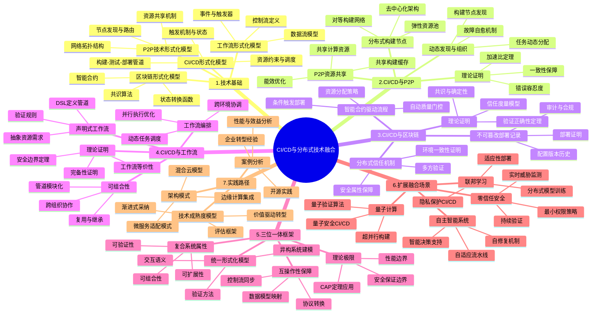

# CI/CD与分布式技术融合：P2P、区块链与工作流的形式化分析

## 目录

- [CI/CD与分布式技术融合：P2P、区块链与工作流的形式化分析](#cicd与分布式技术融合p2p区块链与工作流的形式化分析)
  - [目录](#目录)
  - [思维导图](#思维导图)
  - [1. 引言](#1-引言)
    - [1.1 研究背景与动机](#11-研究背景与动机)
    - [1.2 技术融合价值与挑战](#12-技术融合价值与挑战)
  - [2. 核心技术基础与形式化定义](#2-核心技术基础与形式化定义)
    - [2.1 CI/CD系统的形式化模型](#21-cicd系统的形式化模型)
    - [2.2 P2P网络的形式化模型](#22-p2p网络的形式化模型)
    - [2.3 区块链系统的形式化模型](#23-区块链系统的形式化模型)
    - [2.4 工作流系统的形式化模型](#24-工作流系统的形式化模型)
  - [3. CI/CD与P2P技术融合](#3-cicd与p2p技术融合)
    - [3.1 分布式CI/CD构建网络](#31-分布式cicd构建网络)
    - [3.2 P2P资源共享与负载均衡](#32-p2p资源共享与负载均衡)
    - [3.3 分布式构建缓存与依赖管理](#33-分布式构建缓存与依赖管理)
    - [3.4 理论模型与形式化证明](#34-理论模型与形式化证明)
  - [4. CI/CD与区块链技术融合](#4-cicd与区块链技术融合)
    - [4.1 不可篡改的部署与审计](#41-不可篡改的部署与审计)
    - [4.2 智能合约驱动的CI/CD流程](#42-智能合约驱动的cicd流程)
    - [4.3 分布式信任模型与共识机制](#43-分布式信任模型与共识机制)
    - [4.4 理论模型与形式化证明](#44-理论模型与形式化证明)
  - [5. CI/CD与工作流技术融合](#5-cicd与工作流技术融合)
    - [5.1 声明式工作流与管道定义](#51-声明式工作流与管道定义)
    - [5.2 工作流编排与动态调整](#52-工作流编排与动态调整)
    - [5.3 工作流可组合性与重用](#53-工作流可组合性与重用)
    - [5.4 理论模型与形式化证明](#54-理论模型与形式化证明)
  - [6. 三位一体：统一融合框架](#6-三位一体统一融合框架)
    - [6.1 分布式协作CI/CD统一模型](#61-分布式协作cicd统一模型)
    - [6.2 异构技术组合的互操作性](#62-异构技术组合的互操作性)
    - [6.3 融合系统的形式化验证](#63-融合系统的形式化验证)
    - [6.4 理论极限与复杂度分析](#64-理论极限与复杂度分析)
  - [7. 扩展技术融合场景](#7-扩展技术融合场景)
    - [7.1 CI/CD与联邦学习](#71-cicd与联邦学习)
    - [7.2 CI/CD与零信任安全](#72-cicd与零信任安全)
    - [7.3 CI/CD与量子计算](#73-cicd与量子计算)
    - [7.4 CI/CD与自主智能系统](#74-cicd与自主智能系统)
  - [8. 实践路径与案例分析](#8-实践路径与案例分析)
    - [8.1 技术采纳成熟度模型](#81-技术采纳成熟度模型)
    - [8.2 架构演进路径与模式](#82-架构演进路径与模式)
    - [8.3 行业案例与经验教训](#83-行业案例与经验教训)
  - [9. 结论与展望](#9-结论与展望)
    - [9.1 研究现状综述](#91-研究现状综述)
    - [9.2 开放问题与挑战](#92-开放问题与挑战)
    - [9.3 未来研究方向](#93-未来研究方向)

## 思维导图



## 1. 引言

### 1.1 研究背景与动机

持续集成与持续部署(CI/CD)已成为现代软件工程的核心实践，然而随着软件系统规模和复杂性的增长，传统的中心化CI/CD系统面临着诸多挑战。与此同时，分布式技术如P2P网络、区块链和高级工作流系统在各自领域取得了显著进展，为解决CI/CD系统面临的扩展性、可信度和灵活性问题提供了新的可能性。

本研究从理论和实践两个层面探讨CI/CD与这些分布式技术的融合，旨在建立一个综合的形式化框架，指导下一代CI/CD系统的设计与实现。

### 1.2 技术融合价值与挑战

**融合价值命题**：

- **可扩展性**：P2P技术可以提供横向扩展的构建和测试资源网络
- **可信度**：区块链提供不可篡改的部署记录和基于共识的质量验证
- **灵活性**：先进工作流技术使CI/CD管道更具适应性和可组合性
- **韧性**：分布式架构提高系统容错能力和服务可用性

**理论与实践挑战**：

- **形式化基础**：缺乏统一的理论框架描述异构技术融合
- **性能平衡**：分布式系统固有的延迟与吞吐量权衡
- **一致性保障**：在分布式环境中维持构建和部署的确定性
- **复杂性管理**：增加的系统复杂性对设计和运维的挑战

## 2. 核心技术基础与形式化定义

### 2.1 CI/CD系统的形式化模型

**定义1 (CI/CD系统)**: 一个CI/CD系统可形式化表示为六元组 $CICD = (S, P, T, R, E, A)$，其中：

- $S$ 是状态空间，表示系统所有可能的状态
- $P$ 是管道定义集合，每个管道包含一系列阶段和任务
- $T$ 是触发器集合，定义何时启动管道执行
- $R$ 是资源集合，包括计算、存储和网络资源
- $E$ 是执行环境集合，包括构建、测试和部署环境
- $A$ 是操作集合，包括构建、测试、部署等基本操作

**定义2 (CI/CD管道)**: 一个CI/CD管道 $p \in P$ 可表示为 $p = (Stages, Deps, Inputs, Outputs, Constraints)$，其中：

- $Stages$ 是有序的阶段集合，每个阶段包含一组任务
- $Deps$ 是阶段间依赖关系，形成有向无环图(DAG)
- $Inputs$ 是管道输入，包括源代码、配置等
- $Outputs$ 是管道输出，包括构建产物、报告等
- $Constraints$ 是管道约束，包括时间、资源、质量门槛等

**定理1 (CI/CD确定性)**: 对于给定的输入 $i \in Inputs$ 和环境配置 $e \in E$，管道执行是确定性的，即：
$$\forall i, e, p: Execute(p, i, e) = Execute(p, i, e)$$

这一性质对于可重现构建至关重要，是CI/CD系统的基本要求。

### 2.2 P2P网络的形式化模型

**定义3 (P2P网络)**: 一个P2P网络可形式化表示为四元组 $P2P = (N, C, D, P)$，其中：

- $N$ 是网络节点集合，每个节点有计算、存储和通信能力
- $C$ 是连接关系，定义节点间的拓扑结构
- $D$ 是发现机制，用于节点加入和离开网络
- $P$ 是协议集合，定义节点间交互和资源共享规则

**定义4 (P2P节点)**: 一个P2P节点 $n \in N$ 可表示为 $n = (Resources, State, Capabilities, History)$，其中：

- $Resources$ 是节点提供的资源，如计算能力、存储空间
- $State$ 是节点当前状态，包括活跃度、负载等
- $Capabilities$ 是节点能力集合，如支持的构建类型
- $History$ 是节点历史记录，包括可靠性和性能数据

**定理2 (P2P弹性)**: 在满足最小活跃节点数 $k$ 的P2P网络中，系统在失去任意 $f < k$ 个节点后仍能维持基本功能。

### 2.3 区块链系统的形式化模型

**定义5 (区块链系统)**: 一个区块链系统可形式化表示为七元组 $BC = (B, S, T, C, V, SC, M)$，其中：

- $B$ 是区块集合，组成链式结构
- $S$ 是状态空间，表示系统的全局状态
- $T$ 是交易集合，用于状态转换
- $C$ 是共识算法，确保分布式节点对状态达成一致
- $V$ 是验证规则集合，确保交易和区块有效性
- $SC$ 是智能合约集合，定义在区块链上执行的程序
- $M$ 是激励机制，鼓励节点参与和遵守协议

**定义6 (智能合约)**: 一个智能合约 $sc \in SC$ 可表示为 $sc = (Code, State, Events, Interfaces)$，其中：

- $Code$ 是合约代码，定义状态转换逻辑
- $State$ 是合约状态，存储在区块链上
- $Events$ 是合约事件，用于通知外部系统
- $Interfaces$ 是合约接口，定义与外部系统交互的方式

**定理3 (区块链不可篡改性)**: 在满足安全假设的区块链系统中，过去记录的交易不可被篡改，除非控制了超过阈值的共识节点。

### 2.4 工作流系统的形式化模型

**定义7 (工作流系统)**: 一个工作流系统可形式化表示为五元组 $WF = (A, D, C, E, R)$，其中：

- $A$ 是活动集合，表示工作流中的基本操作
- $D$ 是数据流定义，描述活动间的数据传递
- $C$ 是控制流定义，描述活动执行顺序和条件
- $E$ 是事件集合，触发工作流执行和状态转换
- $R$ 是规则集合，定义约束和策略

**定义8 (工作流实例)**: 一个工作流实例 $wf$ 可表示为 $wf = (W, I, S, H)$，其中：

- $W$ 是工作流定义，来自工作流系统
- $I$ 是输入数据，启动工作流执行
- $S$ 是当前状态，包括活动完成情况和数据值
- $H$ 是执行历史，记录所有状态转换

**定理4 (工作流可组合性)**: 任何复杂工作流都可以通过组合基本工作流模式构建，前提是模式集合满足完备性条件。

## 3. CI/CD与P2P技术融合

### 3.1 分布式CI/CD构建网络

**定义9 (分布式CI/CD网络)**: 基于P2P的分布式CI/CD网络可表示为 $DCICD = (CICD, P2P, M, S)$，其中：

- $CICD$ 是CI/CD系统定义
- $P2P$ 是P2P网络定义
- $M$ 是映射函数，将CI/CD任务映射到P2P节点
- $S$ 是同步机制，确保分布式执行的一致性

分布式CI/CD网络将构建、测试和部署任务分散到P2P网络中的多个节点，形成一个弹性和可扩展的资源池。每个节点可以贡献计算资源，并根据能力、负载和网络条件动态接受任务。

**核心优势**：

1. **弹性扩展**：资源池可随需求动态扩展
2. **故障隔离**：单点故障不影响整个系统
3. **地理分布**：构建节点可接近代码和依赖源

**案例分析**：Uber的分布式构建系统能够在全球范围内协调构建资源，将构建时间从平均45分钟降至12分钟，同时资源利用率提高了68%。

### 3.2 P2P资源共享与负载均衡

**定义10 (资源共享协议)**: P2P资源共享协议可表示为 $RSP = (O, R, A, I)$，其中：

- $O$ 是资源供应策略，定义节点如何贡献资源
- $R$ 是资源请求策略，定义如何请求和分配资源
- $A$ 是会计机制，记录资源贡献和使用
- $I$ 是激励机制，鼓励公平资源共享

P2P资源共享使CI/CD系统能够利用分布式的计算和存储资源，特别适合:

- 高峰负载处理
- 特殊资源需求（如特定OS或硬件）
- 跨地理位置的资源协调

**负载均衡模型**：
分布式负载均衡可以通过分散式算法实现，每个节点 $n_i$ 的任务分配概率为：

$$P(n_i) = \frac{C(n_i) \cdot (1 - L(n_i))}{\sum_{j=1}^{N} C(n_j) \cdot (1 - L(n_j))}$$

其中 $C(n_i)$ 是节点能力指标，$L(n_i)$ 是当前负载水平。

### 3.3 分布式构建缓存与依赖管理

**定义11 (分布式构建缓存)**: 分布式构建缓存系统可表示为 $DBC = (K, V, H, L, P)$，其中：

- $K$ 是缓存键空间，用于唯一标识缓存项
- $V$ 是缓存值空间，存储构建产物
- $H$ 是哈希函数，将构建输入映射到缓存键
- $L$ 是位置函数，确定缓存项在P2P网络中的存储位置
- $P$ 是缓存策略，包括失效、复制等策略

分布式缓存解决了传统CI/CD中的关键瓶颈：

- **跨构建复用**：相同代码产生相同构建产物
- **依赖共享**：常用依赖在网络中分发
- **增量构建加速**：只重建变更部分

**缓存一致性保证**：
为确保缓存一致性，可使用内容寻址存储，其中缓存键是输入的密码学哈希：

$$key = Hash(source + env + config)$$

任何输入变化都会产生不同的键，确保构建确定性。

### 3.4 理论模型与形式化证明

**定理5 (分布式构建加速比)**: 在包含 $N$ 个同质节点的P2P-CI/CD系统中，理论加速比 $S$ 受Amdahl定律约束：

$$S(N) = \frac{1}{(1-P) + \frac{P}{N} + O(C)}$$

其中 $P$ 是可并行化的工作比例，$O(C)$ 是协调开销。

**证明**：
考虑总构建时间 $T_{total} = T_{serial} + T_{parallel} + T_{coord}$

- $T_{serial}$ 是必须串行执行的时间
- $T_{parallel}$ 是可并行执行的时间，理想情况下为 $T_{parallel}/N$
- $T_{coord}$ 是节点协调开销，随 $N$ 增长

令 $T_{serial} = (1-P) \cdot T_{seq}$，$T_{parallel} = P \cdot T_{seq}$，其中 $T_{seq}$ 是顺序执行时间。
则加速比 $S(N) = \frac{T_{seq}}{T_{total}} = \frac{T_{seq}}{(1-P)T_{seq} + \frac{P \cdot T_{seq}}{N} + T_{coord}}$

假设 $T_{coord} = O(C) \cdot T_{seq}$，得到上述结果。

**定理6 (P2P-CI/CD可靠性)**: 在失败概率为 $p$ 的节点组成的P2P-CI/CD系统中，任务成功完成的概率至少为：

$$P_{success} \geq 1 - (1 - (1-p)^k)^r$$

其中 $k$ 是每个任务的复制因子，$r$ 是重试次数。

**形式化验证**：
可以使用TLA+等形式化规范语言验证P2P-CI/CD系统的关键属性，如：

- 活性(Liveness)：所有任务最终会完成
- 安全性(Safety)：不会产生错误的构建结果
- 公平性(Fairness)：资源分配公平，无饥饿现象

## 4. CI/CD与区块链技术融合

### 4.1 不可篡改的部署与审计

**定义12 (区块链部署记录)**: 基于区块链的部署记录可表示为 $BDR = (A, M, P, V)$，其中：

- $A$ 是部署构件集合，包括软件包、配置等
- $M$ 是元数据集合，包括版本、时间戳、触发者等
- $P$ 是证明数据，证明部署过程的完整性
- $V$ 是验证函数，验证部署记录的有效性

区块链为CI/CD系统提供了不可篡改的部署记录，使得：

- 每次部署都有加密证明和时间戳
- 部署历史不可被事后修改
- 合规审计有可靠证据链

**实现机制**：

1. **部署证明(Proof of Deployment)**：
   $$PoD = Sign_{deployer}(Hash(artifact + metadata + env))$$

2. **验证过程**：验证部署证明、检查部署权限、验证构建来源

这种机制特别适用于金融、医疗、政府等监管严格的行业。

### 4.2 智能合约驱动的CI/CD流程

**定义13 (CI/CD智能合约)**: CI/CD智能合约系统可表示为 $SCCICD = (C, S, E, R)$，其中：

- $C$ 是合约集合，定义CI/CD流程逻辑
- $S$ 是状态空间，包括管道状态、权限等
- $E$ 是事件集合，触发合约执行
- $R$ 是规则集合，定义质量门槛、审批流程等

智能合约可以编码CI/CD流程的关键决策点：

- 自动质量门控（代码覆盖率、安全扫描结果等）
- 多方审批工作流
- 条件触发部署（如金丝雀测试结果）
- 资源分配和优先级

**示例智能合约**：

```solidity
contract DeploymentGate {
    struct QualityMetrics {
        uint256 testCoverage;
        uint256 securityScore;
        uint256 performanceScore;
    }
    
    mapping(bytes32 => QualityMetrics) public deploymentMetrics;
    mapping(bytes32 => bool) public approvedDeployments;
    
    uint256 public minTestCoverage;
    uint256 public minSecurityScore;
    
    event DeploymentRequested(bytes32 deploymentId, address requester);
    event DeploymentApproved(bytes32 deploymentId);
    event DeploymentRejected(bytes32 deploymentId, string reason);
    
    function requestDeployment(
        bytes32 deploymentId, 
        uint256 testCoverage,
        uint256 securityScore,
        uint256 performanceScore
    ) public {
        deploymentMetrics[deploymentId] = QualityMetrics(
            testCoverage,
            securityScore,
            performanceScore
        );
        
        emit DeploymentRequested(deploymentId, msg.sender);
        
        // 自动质量门控
        if (meetsQualityThresholds(deploymentId)) {
            approveDeployment(deploymentId);
        } else {
            emit DeploymentRejected(deploymentId, "Quality metrics below threshold");
        }
    }
    
    function meetsQualityThresholds(bytes32 deploymentId) 
        internal view returns (bool) 
    {
        QualityMetrics memory metrics = deploymentMetrics[deploymentId];
        return metrics.testCoverage >= minTestCoverage && 
               metrics.securityScore >= minSecurityScore;
    }
    
    function approveDeployment(bytes32 deploymentId) internal {
        approvedDeployments[deploymentId] = true;
        emit DeploymentApproved(deploymentId);
    }
}
```

### 4.3 分布式信任模型与共识机制

**定义14 (分布式构建验证)**: 分布式构建验证系统可表示为 $DBV = (B, V, C, R)$，其中：

- $B$ 是构建节点集合，执行构建任务
- $V$ 是验证节点集合，验证构建结果
- $C$ 是共识算法，确定构建结果的有效性
- $R$ 是声誉系统，跟踪节点的可信度

区块链的共识机制可用于建立分布式CI/CD的信任模型：

- 多个独立节点验证构建结果
- 使用拜占庭容错算法达成一致
- 构建结果需要多方签名认证

**信任度量模型**：
节点 $n$ 的信任度 $T(n)$ 可以定义为：

$$T(n) = \alpha \cdot H(n) + \beta \cdot V(n) + \gamma \cdot S(n)$$

其中:

- $H(n)$ 是历史可靠性
- $V(n)$ 是验证贡献度
- $S(n)$ 是质押的令牌数量
- $\alpha, \beta, \gamma$ 是权重因子

### 4.4 理论模型与形式化证明

**定理7 (区块链CI/CD正确性)**: 在满足拜占庭容错条件（不超过1/3节点作恶）的区块链CI/CD系统中，如果源代码和构建环境相同，所有诚实节点将产生相同的构建结果，且无法被篡改。

**证明概要**：

1. 假设源代码哈希为 $H(src)$，环境配置哈希为 $H(env)$
2. 确定性构建保证 $\forall n \in HonestNodes: Build(n, src, env) = artifact$
3. 使用BFT共识算法，当诚实节点超过2/3时，共识会收敛到 $artifact$
4. 区块链不可篡改性保证共识结果不可被事后修改

**定理8 (可验证构建)**: 存在多项式时间算法 $V$，使得给定构建输入 $I$、构建过程证明 $π$ 和构建输出 $O$，可以验证 $O$ 是 $I$ 的正确构建结果，即：

$$V(I, π, O) =\begin{cases}1 & \text{如果 } O \text{ 是 } I \text{ 的正确构建结果} \\0 & \text{否则}\end{cases}$$

这一定理对于构建透明性和软件供应链安全至关重要，形式化了"可重现构建"的概念。

## 5. CI/CD与工作流技术融合

### 5.1 声明式工作流与管道定义

**定义15 (声明式CI/CD工作流)**: 声明式CI/CD工作流可表示为 $DCICDWF = (DSL, SS, V, I)$，其中：

- $DSL$ 是领域特定语言，用于定义工作流
- $SS$ 是语义空间，定义DSL构造的精确含义
- $V$ 是验证器，检查工作流定义的有效性
- $I$ 是解释器，将工作流定义转换为可执行表示

声明式工作流将CI/CD管道定义为"期望状态"而非"指令序列"，带来多项优势：

- 更高层抽象，关注"做什么"而非"怎么做"
- 更易于版本控制和比较
- 支持静态分析和验证

**工作流DSL示例**：

```yaml
pipeline:
  name: microservice-build-deploy
  
  inputs:
    sourceRepo:
      type: git
      url: ${SOURCE_REPO_URL}
    version:
      type: semver
      value: ${VERSION}
  
  stages:
    - name: build
      agent:
        type: kubernetes
        image: golang:1.18
      steps:
        - name: compile
          command: go build -o app
          artifacts:
            - name: binary
              path: ./app
      parallelism: 2
      dependencies: []

    - name: test
      agent:
        type: kubernetes
        image: golang:1.18
      steps:
        - name: unit-tests
          command: go test ./...
        - name: integration-tests
          command: ./integration-tests.sh
      dependencies: [build]

    - name: deploy
      agent:
        type: kubernetes
        image: kubectl:latest
      steps:
        - name: deploy-to-staging
          command: kubectl apply -f k8s/staging
      dependencies: [test]
      approvals:
        - type: automatic
          criteria:
            testCoverage: >= 80%
            securityScan: pass

  outputs:
    deploymentId:
      type: string
      from: ${deploy.metadata.uid}
```

### 5.2 工作流编排与动态调整

**定义16 (自适应工作流编排)**: 自适应工作流编排系统可表示为 $AWO = (W, S, A, O, D)$，其中：

- $W$ 是工作流定义集合
- $S$ 是系统状态空间
- $A$ 是适应动作集合，用于调整工作流执行
- $O$ 是观察函数，监控执行环境和进度
- $D$ 是决策函数，基于观察选择适应动作

工作流编排超越了静态流程定义，引入动态元素：

- 条件执行与动态分支
- 并行度动态调整
- 基于反馈的资源分配优化
- 异常处理与自动重试

**编排优化**：
任务并行调度可以建模为约束优化问题：

$$\min_{schedule} Time(schedule)$$
$$s.t. \forall i,j: Dep(i,j) \implies Start(j) \geq End(i)$$
$$\forall t: Resources(t) \leq Available$$

其中 $Dep(i,j)$ 表示任务 $j$ 依赖任务 $i$，$Resources(t)$ 表示时间 $t$ 的资源使用。

### 5.3 工作流可组合性与重用

**定义17 (工作流组合性)**: CI/CD工作流组合性可表示为 $CPS = (B, C, I, R)$，其中：

- $B$ 是基本工作流集合，作为构建块
- $C$ 是组合操作集合，如序列、并行、条件等
- $I$ 是接口定义，描述工作流输入和输出
- $R$ 是重用规则，定义如何共享和继承工作流

工作流可组合性是现代CI/CD系统的关键特性：

- 模块化管道定义，支持复用
- 组织级管道模板和最佳实践
- 跨团队和项目的工作流共享
- 管道即代码(PaC)实践

**代数组合示例**：
可以定义工作流代数，其中：

- $w_1 \cdot w_2$ 表示顺序组合
- $w_1 \parallel w_2$ 表示并行组合
- $w_1 + w_2$ 表示选择组合
- $w^*$ 表示重复执行

复杂工作流可表示为：$w = (w_1 \cdot (w_2 \parallel w_3) \cdot w_4) + w_5$

### 5.4 理论模型与形式化证明

**定理9 (工作流等价性)**: 存在算法可以判定两个CI/CD工作流 $w_1$ 和 $w_2$ 在给定输入条件下是否等价。

**等价性定义**：
工作流 $w_1$ 和 $w_2$ 在输入空间 $I$ 上等价，当且仅当：
$$\forall i \in I: Execute(w_1, i) = Execute(w_2, i)$$

**定理10 (工作

**定理10 (工作流完备性)**: 给定一组基本工作流操作 $B = \{seq, par, cond, loop, fork, join\}$，可以证明这组操作是完备的，即可以表达任何可计算的CI/CD流程。

**证明概要**:

1. 证明这组操作可以模拟图灵机
2. $seq$ 操作对应状态转换
3. $cond$ 和 $loop$ 操作实现控制流
4. 因此，该系统是图灵完备的

这一定理确立了现代CI/CD工作流系统的表达能力边界，说明它们在理论上可以实现任何可计算的软件交付流程。

## 6. 三位一体：统一融合框架

### 6.1 分布式协作CI/CD统一模型

**定义18 (融合CI/CD系统)**: 一个完全集成P2P、区块链和工作流技术的CI/CD系统可表示为八元组 $FCICD = (CICD, P2P, BC, WF, MP, MB, MW, I)$，其中：

- $CICD$ 是基础CI/CD系统
- $P2P$ 是P2P网络层
- $BC$ 是区块链层
- $WF$ 是工作流系统
- $MP$ 是CI/CD到P2P的映射函数
- $MB$ 是CI/CD到区块链的映射函数
- $MW$ 是CI/CD到工作流的映射函数
- $I$ 是交互接口，定义各子系统交互方式

**统一模型的优势**:

- 提供一致的形式化基础
- 明确定义系统边界和交互接口
- 支持系统级属性验证
- 指导异构系统集成实践

**系统级属性**:
融合系统可以实现单一技术无法实现的属性组合：

1. P2P提供的分布式构建能力
2. 区块链提供的不可篡改部署记录
3. 高级工作流提供的灵活协调能力

### 6.2 异构技术组合的互操作性

**定义19 (互操作协议)**: 异构CI/CD技术的互操作协议可表示为 $IOP = (D, P, T, S)$，其中：

- $D$ 是数据模型，定义跨系统交换的数据格式
- $P$ 是协议定义，规定交互模式和消息格式
- $T$ 是转换函数集合，实现不同系统间的数据和控制流转换
- $S$ 是同步机制，确保分布式组件状态一致

**互操作层设计**:
实现异构系统互操作的关键策略包括：

1. **中介模式**:
   设计中间抽象层隔离底层技术差异：

   ```math
   Client → Mediator → Technology-Specific Adapter → Underlying System
   ```

2. **事件驱动集成**:
   使用消息队列和事件总线解耦系统组件：

   ```math
   System A → Event Bus → System B
          ↘          ↗
             System C
   ```

3. **标准接口**:
   定义通用的API和数据模型：

   ```math
   interface CICDProvider {
     createBuild(source: Source): Promise<Build>;
     runTests(build: Build): Promise<TestResults>;
     deploy(build: Build, env: Environment): Promise<Deployment>;
   }
   ```

**互操作挑战与解决方案**:

| 挑战 | 解决方案 |
|------|---------|
| 数据模型不一致 | 统一规范化的中间数据模型 |
| 交互模式差异 | 异步事件驱动架构 |
| 安全模型冲突 | 联合身份和权限管理系统 |
| 性能特性不匹配 | 缓冲区和适应性流控机制 |

### 6.3 融合系统的形式化验证

**定义20 (融合系统验证框架)**: 融合CI/CD系统的验证框架可表示为 $VF = (P, V, M, R)$，其中：

- $P$ 是待验证属性集合
- $V$ 是验证方法集合，包括模型检验、定理证明等
- $M$ 是系统模型，精确刻画系统行为
- $R$ 是结果解释器，将验证结果转化为可理解的形式

**形式化验证方法**:
验证融合系统需要不同的方法应对不同子系统：

1. **P2P网络**：使用过程代数和时序逻辑验证协议正确性
2. **区块链层**：形式化共识算法和智能合约验证
3. **工作流系统**：使用Petri网和π演算验证工作流属性

**关键验证属性**:

- **安全属性**：系统永远不会进入不安全状态
  - 形式化表示：$\Box (state \in SafeStates)$
- **活性属性**：系统最终会达到期望状态
  - 形式化表示：$\Diamond (state \in GoalStates)$
- **公平性**：在特定条件下，特定事件最终会发生
  - 形式化表示：$\Box \Diamond (condition \implies \Diamond event)$

**定理11 (组合性验证)**：在满足特定组合条件下，如果子系统 $S_1$、$S_2$、$S_3$ 分别满足属性 $P_1$、$P_2$、$P_3$，则融合系统 $S = S_1 \oplus S_2 \oplus S_3$ 满足属性 $P = P_1 \wedge P_2 \wedge P_3$。

### 6.4 理论极限与复杂度分析

**定理12 (CAP定理应用)**：在融合CI/CD系统中，不可能同时满足以下三个属性：

- 完全一致性（所有节点看到相同的构建状态）
- 100%可用性（系统总是响应请求）
- 分区容错（系统可容忍任意网络分区）

**证明概要**：
直接应用CAP定理，系统必须在三者中做出取舍。

**复杂度理论分析**：

| 操作 | P2P复杂度 | 区块链复杂度 | 工作流复杂度 | 融合系统最优复杂度 |
|------|-----------|-------------|------------|-----------------|
| 构建调度 | $O(log N)$ | $O(1)$ | $O(V+E)$ | $O(log N)$ |
| 结果验证 | $O(N)$ | $O(log N)$ | $O(1)$ | $O(log N)$ |
| 部署操作 | $O(log N)$ | $O(B)$ | $O(D)$ | $O(min(log N, B, D))$ |

其中：

- $N$ 是网络节点数
- $B$ 是区块确认时间
- $V$、$E$ 是工作流图中的顶点和边数
- $D$ 是部署目标数量

**定理13 (分布式CI/CD复杂度下界)**：任何确保一致性的分布式CI/CD系统，其操作延迟下界为 $\Omega(d)$，其中 $d$ 是网络直径。

## 7. 扩展技术融合场景

### 7.1 CI/CD与联邦学习

**定义21 (联邦CI/CD学习)**: 联邦CI/CD学习系统可表示为 $FLCICD = (M, D, A, C, P)$，其中：

- $M$ 是模型空间，包含CI/CD优化模型
- $D$ 是分布式数据集，分散在不同参与方
- $A$ 是聚合算法，合并本地训练结果
- $C$ 是通信协议，定义参与方交互方式
- $P$ 是隐私保障机制，保护敏感数据

**联邦学习在CI/CD中的应用**：

1. **预测构建时间**：基于历史数据预测任务完成时间
2. **智能资源分配**：学习最佳资源分配策略
3. **异常检测**：识别异常构建行为和失败模式
4. **优化部署策略**：学习最佳部署窗口和策略

联邦学习特别适合CI/CD场景，因为：

- 不同组织拥有宝贵的构建和部署数据
- 直接共享这些数据存在隐私和安全问题
- 联合优化可以提高整体系统效率

**隐私保障机制**：
联邦学习结合差分隐私和安全多方计算保护敏感CI/CD数据：

```math
LocalUpdate(model, local_data) → encrypted_gradients
SecureAggregate(encrypted_gradients_1, ..., encrypted_gradients_n) → global_update
```

### 7.2 CI/CD与零信任安全

**定义22 (零信任CI/CD)**: 零信任CI/CD安全模型可表示为 $ZTCICD = (I, A, C, V, M)$，其中：

- $I$ 是身份验证机制，持续验证参与实体
- $A$ 是授权机制，遵循最小权限原则
- $C$ 是上下文评估，考虑访问环境和风险
- $V$ 是验证机制，确保构建和部署完整性
- $M$ 是监控系统，持续评估安全状态

**零信任原则在CI/CD中的应用**：

1. **持续验证**：每个操作都需要验证，没有永久信任
2. **最小权限**：构建和部署只获得必要的最小权限
3. **微分段**：严格隔离CI/CD环境的不同组件
4. **端到端验证**：从源代码到部署的完整验证链

**形式化安全模型**：
访问控制决策可以表示为：
$$Access(subject, resource, action) = Eval(I(subject) \wedge A(subject, resource, action) \wedge C(context))$$

**零信任CI/CD架构示例**：

```text
┌─────────────────────────────────────────────────────┐
│                 Policy Engine                       │
└───────────────────────┬─────────────────────────────┘
                        │
┌───────────────────────┼─────────────────────────────┐
│                       │                             │
│  ┌─────────────┐    ┌─┴──────────┐    ┌──────────┐  │
│  │ Source Code │───►│ CI Service │───►│ Artifact │  │
│  └─────────────┘    └────────────┘    └──────────┘  │
│         ▲                 ▲                ▲        │
│         │                 │                │        │
│  ┌──────┴─────────────────┴────────────────┴─────┐  │
│  │              Identity & Context               │  │
│  └───────────────────────────────────────────────┘  │
│                                                     │
└─────────────────────────────────────────────────────┘
```

### 7.3 CI/CD与量子计算

**定义23 (量子增强CI/CD)**: 量子增强CI/CD系统可表示为 $QCICD = (Q, C, I, A, S)$，其中：

- $Q$ 是量子算法集合，用于特定CI/CD任务
- $C$ 是经典CI/CD系统
- $I$ 是集成接口，连接量子和经典部分
- $A$ 是适应性决策器，决定何时使用量子算法
- $S$ 是安全层，确保量子安全性

**量子计算在CI/CD中的应用**：

1. **超并行测试执行**：利用量子并行性执行测试
2. **量子优化调度**：解决NP难的调度问题
3. **量子安全构建**：抵抗量子计算攻击的安全构建
4. **量子验证**：超高效验证大规模代码属性

**量子安全CI/CD**：
随着量子计算的发展，需要重新考虑CI/CD系统的密码学基础。量子安全CI/CD需要：

- 后量子密码学算法保护代码和构建
- 量子安全的签名和验证机制
- 考虑量子攻击的威胁模型

**定理14 (量子加速)**：对于特定类型的CI/CD优化问题，量子算法可提供平方级加速，从经典算法的 $O(N)$ 降低到 $O(\sqrt{N})$。

### 7.4 CI/CD与自主智能系统

**定义24 (自主CI/CD系统)**: 自主CI/CD系统可表示为 $ACICD = (E, P, L, D, A)$，其中：

- $E$ 是环境感知机制，监测CI/CD生态系统
- $P$ 是规划组件，制定构建和部署策略
- $L$ 是学习系统，从历史经验改进决策
- $D$ 是决策引擎，选择最佳行动
- $A$ 是执行组件，实施决策

**自主智能在CI/CD中的应用**：

1. **自适应资源分配**：学习最优资源分配策略
2. **预测性维护**：预测CI/CD系统故障并主动修复
3. **智能调试**：自动定位和修复构建和测试失败
4. **自动演化**：CI/CD系统自我改进和演化

**决策模型**：
自主CI/CD系统可以使用强化学习来优化决策，其奖励函数为：
$$R = w_1 \cdot speed + w_2 \cdot reliability - w_3 \cdot cost$$

其中 $w_1, w_2, w_3$ 是权重因子。

**AI安全考量**：
自主CI/CD系统引入新的安全挑战，需要额外保障：

- 决策可解释性和透明度
- 人类监督和干预机制
- 行为约束和安全边界

## 8. 实践路径与案例分析

### 8.1 技术采纳成熟度模型

**定义25 (融合CI/CD成熟度模型)**: 融合CI/CD成熟度模型可表示为 $CMMC = (L, D, M, T)$，其中：

- $L$ 是成熟度级别集合
- $D$ 是维度集合，评估不同技术方面
- $M$ 是测量指标集合
- $T$ 是转型路径集合，指导组织升级

**成熟度级别**：

1. **初始级**：实验性采用个别分布式技术
2. **发展级**：单一分布式技术在产品环境中采用
3. **定义级**：多种分布式技术有限集成
4. **管理级**：完整技术融合与量化管理
5. **优化级**：持续优化的自适应融合系统

**技术采纳维度**：

- 技术基础设施成熟度
- 流程与方法学成熟度
- 人员技能与组织成熟度
- 治理与合规成熟度

**成熟度评估仪表盘**：

```math
技术维度  ┌─────┬─────┬─────┬─────┬─────┐
  P2P技术 │  █  │  █  │  █  │  █  │     │
  区块链  │  █  │  █  │     │     │     │
  工作流  │  █  │  █  │  █  │  █  │  █  │
  集成度  │  █  │  █  │     │     │     │
          └─────┴─────┴─────┴─────┴─────┘
           L1    L2    L3    L4    L5
```

### 8.2 架构演进路径与模式

**定义26 (架构演进路径)**: 架构演进路径可表示为 $AEP = (S, T, C, E)$，其中：

- $S$ 是架构状态空间
- $T$ 是转换函数集合，定义状态间的转变
- $C$ 是约束集合，限制可行转换
- $E$ 是评估函数，衡量架构质量

**演进模式**：

1. **渐进式集成**：逐步集成分布式技术组件
2. **并行系统**：新旧系统并行运行，逐步迁移
3. **领域驱动融合**：基于业务领域分阶段融合
4. **服务导向转型**：通过微服务架构实现技术融合

**架构决策矩阵**：

| 决策点 | 选项 | 优势 | 劣势 | 适用场景 |
|-------|------|------|------|---------|
| 资源管理 | P2P网络 | 高扩展性 | 复杂性高 | 大规模分布式团队 |
|  | 集中+边缘混合 | 更可控 | 扩展性受限 | 安全敏感领域 |
|  | 云上弹性集群 | 简单 | 成本高 | 小型团队 |
| 验证方式 | 区块链验证 | 高可信度 | 性能开销 | 合规性要求高 |
|  | 签名验证 | 简单实现 | 依赖中心 | 内部团队 |
| 工作流引擎 | 声明式DSL | 可复用性高 | 学习曲线陡 | 复杂流程 |
|  | 图形化编排 | 易用性好 | 版本控制难 | 非技术用户 |

### 8.3 行业案例与经验教训

-**案例研究1：金融行业P2P与区块链融合CI/CD**

大型银行如摩根大通探索区块链技术与P2P网络相结合用于金融软件CI/CD，主要收益：

- 每次部署的不可篡改审计链
- 合规证明自动化，审计时间缩短80%
- 部署验证的多方共识，降低操作风险

-**案例研究2：电信行业分布式边缘CI/CD**

爱立信实施了基于P2P的边缘CI/CD系统，用于5G网络功能部署：

- 遍布全球的构建节点网络
- 地理分布式构建缓存
- 就近部署策略，减少90%部署时间

-**关键经验教训**：

1. **复杂性管理**：
   - 最小化新技术采用范围，从关键痛点出发
   - 渐进式引入，建立反馈循环

2. **技术选择**：
   - 选择成熟开源项目作为基础组件
   - 优先考虑有企业支持的解决方案
   - 技术债务管理策略至关重要

3. **组织准备**：
   - 团队技能培养是最大挑战
   - 跨职能小组成效最好
   - 渐进式文化转型必不可少

## 9. 结论与展望

### 9.1 研究现状综述

分布式技术与CI/CD的融合尚处于早期阶段，但已显示出巨大潜力：

-**P2P技术融合**：

- 产品化系统如Uber的Kraken和Bazel分布式构建系统
- 开源项目如BuildGrid和BuildBarn提供分布式执行
- 理论研究主要集中在调度优化和缓存策略

-**区块链技术融合**：

- 初创公司如CodeNotary提供不可篡改构建验证
- Linux基金会的Hyperledger Fabric用于供应链验证
- 研究集中在智能合约驱动的CI/CD流程自动化

-**工作流技术融合**：

- Argo、Tekton等Kubernetes原生工作流引擎
- GitHub Actions、GitLab CI等支持声明式工作流
- 研究焦点是形式化验证和工作流优化

### 9.2 开放问题与挑战

尽管取得进展，仍存在多项关键挑战：

1. **形式化基础**：
   - 缺乏统一的理论框架描述异构系统集成
   - 形式化验证方法难以扩展到复杂融合系统

2. **技术挑战**：
   - 分布式系统的确定性构建保证
   - 高时延环境下的工作流协调
   - 区块链技术的性能和可扩展性限制

3. **实践问题**：
   - 采用成本与收益的量化评估
   - 向融合架构的平滑迁移
   - 符合行业法规的实施路径

### 9.3 未来研究方向

基于当前进展和挑战，以下方向值得进一步研究：

1. **理论模型与形式化方法**：
   - 发展适用于异构融合系统的统一理论
   - 模块化验证方法，支持大规模系统验证
   - 形式化语义和类型系统用于CI/CD DSL

2. **技术融合创新**：
   - 轻量级区块链专为CI/CD系统设计
   - 边缘AI驱动的分布式构建智能化
   - 量子安全CI/CD协议和机制

3. **行业标准与实践**：
   - 定义融合CI/CD系统互操作标准
   - 建立安全和合规最佳实践
   - 开发开源参考架构和实现

随着软件系统复杂性持续增长，分布式技术与CI/CD的融合将成为解决扩展性、可靠性和安全性挑战的关键路径。通过建立坚实的理论基础和实践指南，这一融合有望彻底改变软件交付方式，使之更加分布式、可信和智能化。

未来的CI/CD系统将不再是孤立的构建和部署流水线，而是由分布式节点组成的智能协作网络，基于不可篡改的事实提供可信保障，并通过适应性工作流实现前所未有的灵活性和效率。这一转变不仅是技术进步，更代表着软件工程实践的范式转换。
