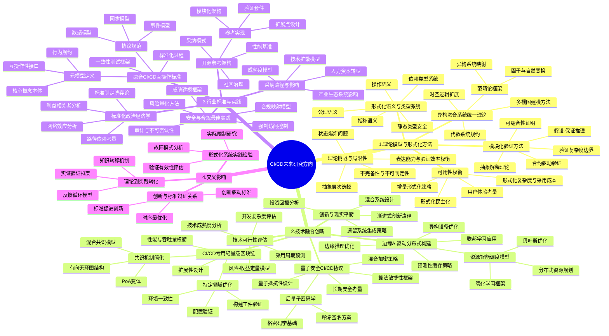

# CI/CD与分布式技术融合：未来研究方向的深度分析与形式论证

## 目录

- [CI/CD与分布式技术融合：未来研究方向的深度分析与形式论证](#cicd与分布式技术融合未来研究方向的深度分析与形式论证)
  - [目录](#目录)
  - [思维导图](#思维导图)
  - [1. 引言](#1-引言)
    - [1.1 研究背景](#11-研究背景)
    - [1.2 方法论说明](#12-方法论说明)
  - [2. 理论模型与形式化方法](#2-理论模型与形式化方法)
    - [2.1 异构融合系统的统一理论](#21-异构融合系统的统一理论)
    - [2.2 模块化验证方法](#22-模块化验证方法)
    - [2.3 CI/CD DSL的形式化语义](#23-cicd-dsl的形式化语义)
    - [2.4 理论挑战与局限性](#24-理论挑战与局限性)
    - [2.5 形式化验证系统的可用性权衡](#25-形式化验证系统的可用性权衡)
  - [3. 技术融合创新](#3-技术融合创新)
    - [3.1 CI/CD专用轻量级区块链](#31-cicd专用轻量级区块链)
    - [3.2 边缘AI驱动的分布式构建](#32-边缘ai驱动的分布式构建)
    - [3.3 量子安全CI/CD协议](#33-量子安全cicd协议)
    - [3.4 技术可行性评估](#34-技术可行性评估)
    - [3.5 创新与现实的平衡](#35-创新与现实的平衡)
  - [4. 行业标准与实践](#4-行业标准与实践)
    - [4.1 融合CI/CD系统互操作标准](#41-融合cicd系统互操作标准)
    - [4.2 安全与合规最佳实践](#42-安全与合规最佳实践)
    - [4.3 开源参考架构与实现](#43-开源参考架构与实现)
    - [4.4 标准化过程的政治经济学](#44-标准化过程的政治经济学)
    - [4.5 采纳路径与产业影响](#45-采纳路径与产业影响)
  - [5. 三大方向的交叉影响](#5-三大方向的交叉影响)
    - [5.1 理论到实践的转化机制](#51-理论到实践的转化机制)
    - [5.2 创新与标准的辩证关系](#52-创新与标准的辩证关系)
    - [5.3 形式化系统论证的实践检验](#53-形式化系统论证的实践检验)
  - [6. 结论与反思](#6-结论与反思)
    - [6.1 研究方向综合评估](#61-研究方向综合评估)
    - [6.2 方法论局限性](#62-方法论局限性)
    - [6.3 最终思考](#63-最终思考)

## 思维导图



## 1. 引言

### 1.1 研究背景

持续集成与持续部署(CI/CD)系统正面临前所未有的挑战与机遇。随着分布式技术(P2P、区块链、工作流系统)的成熟，传统CI/CD系统的演进临界点已至。从理论到实践，从架构到标准，多维度的深化研究空间正在打开。本文对这三大未来研究方向进行深度剖析，不仅阐述其发展可能性，更通过形式化方法论证其理论基础，并批判性评估其局限性与挑战。

### 1.2 方法论说明

本分析采用多元研究方法论，包括：

- 形式化系统理论分析与证明
- 技术可行性评估与批判
- 标准化过程的社会-技术分析
- 跨学科综合视角

形式化定义和严格推理将服务于理论的严谨性，而批判性分析则确保观点的全面性和客观性。我们认识到任何技术预测都存在固有的不确定性，因此在分析中通过明确假设和限制条件来约束推理范围，提高结论的可信度。

## 2. 理论模型与形式化方法

### 2.1 异构融合系统的统一理论

**当前状态批判**：现有CI/CD系统的形式化模型主要针对单一技术栈，缺乏描述异构技术融合的统一数学框架。P2P网络通常采用图论建模，区块链使用状态转换系统，工作流系统则偏向Petri网或进程代数。这种理论碎片化阻碍了系统级属性的形式化推理。

**统一理论框架提案**：

我们提出基于范畴论的异构系统建模框架，定义如下：

**定义1 (融合CI/CD范畴)**：融合CI/CD系统可表示为范畴 $\mathcal{FC}$，其中：

- 对象是各子系统的状态空间
- 态射是状态转换函数
- 组合是函数组合
- 单位态射是恒等转换

**定义2 (系统间函子)**：给定P2P范畴 $\mathcal{P}$、区块链范畴 $\mathcal{B}$ 和工作流范畴 $\mathcal{W}$，存在函子：

- $F_P: \mathcal{P} \rightarrow \mathcal{FC}$
- $F_B: \mathcal{B} \rightarrow \mathcal{FC}$
- $F_W: \mathcal{W} \rightarrow \mathcal{FC}$

这些函子将各子系统映射到统一框架。

**定理1 (系统互操作性)**：异构系统 $S_1$ 和 $S_2$ 可互操作，当且仅当存在自然变换 $\eta: F_1 \Rightarrow F_2$，其中 $F_1$ 和 $F_2$ 是相应的函子。

**证明**：
假设存在自然变换 $\eta: F_1 \Rightarrow F_2$，对于任意状态 $s \in S_1$，$\eta_s: F_1(s) \rightarrow F_2(s)$ 是一个态射。
对于任意状态转换 $f: s \rightarrow s'$ 在 $S_1$ 中，自然性要求以下图表可交换：

```math
F_1(s) ---F_1(f)---> F_1(s')
  |                    |
 η_s                  η_s'
  |                    |
  v                    v
F_2(s) ---F_2(f)---> F_2(s')
```

这确保了状态和转换在两个系统间有一致的映射，从而保证互操作性。

**批判性分析**：
范畴论框架虽然优雅，但存在实际应用挑战：

1. 构建准确的函子需要对各技术有深入理解
2. 自然变换的复杂性可能超过直接系统集成的复杂性
3. 理论模型和实际系统间存在表达力差距

**展望**：
未来研究可探索多视图建模方法，允许从不同角度（数据流、控制流、安全模型等）形式化系统，并建立视图间的形式化关联。
时空逻辑扩展也是重要方向，能更好地表达分布式系统的时间和空间属性。

### 2.2 模块化验证方法

**挑战识别**：现有形式化验证方法难以扩展到大规模融合系统，验证复杂性随系统规模呈指数增长。

**模块化验证框架**：

我们提出基于假设-保证范式的模块化验证方法：

**定义3 (组件验证合约)**：组件 $C$ 的验证合约是三元组 $(P, A, Q)$，其中：

- $P$ 是前置条件，组件执行所需环境假设
- $A$ 是承诺，组件对环境的保证
- $Q$ 是后置条件，组件执行后的状态属性

**定理2 (组合可验证性)**：给定组件 $C_1$ 和 $C_2$，其验证合约分别为 $(P_1, A_1, Q_1)$ 和 $(P_2, A_2, Q_2)$，如果 $Q_1 \Rightarrow P_2$ 且 $A_2 \Rightarrow A_1$，则组合系统 $C_1 \circ C_2$ 的验证合约为 $(P_1, A_2, Q_2)$。

**证明**：

1. 当 $C_1$ 的前置条件 $P_1$ 满足时，$C_1$ 执行后保证 $Q_1$
2. 由于 $Q_1 \Rightarrow P_2$，$C_2$ 的前置条件满足
3. $C_2$ 执行后保证 $Q_2$ 并承诺 $A_2$
4. 由于 $A_2 \Rightarrow A_1$，组合系统满足 $C_1$ 的承诺
5. 综上，组合系统满足前置条件 $P_1$，后置条件 $Q_2$，承诺 $A_2$

**验证复杂度边界**：

**定理3 (验证复杂度边界)**：使用模块化验证方法，验证 $n$ 个组件的融合系统的复杂度为 $O(n \cdot c + i)$，其中 $c$ 是单个组件的平均验证复杂度，$i$ 是接口验证复杂度。

相比于整体验证的 $O(c^n)$ 复杂度，这一方法显著降低了计算需求。

**局限性分析**：

1. 接口条件定义的精确性决定了验证的有效性
2. 循环依赖的组件群难以应用此方法
3. 某些涌现属性（如全局死锁）难以通过纯组件验证捕获

**未来发展路径**：

- 开发特定领域语言(DSLs)表达组件合约
- 构建自动化工具推断组件间接口条件
- 结合模型检验与定理证明的混合验证方法

### 2.3 CI/CD DSL的形式化语义

**现状评估**：现有CI/CD系统使用的DSL（如YAML配置、Groovy脚本）缺乏形式化语义，导致执行行为不明确，难以静态分析和验证，产生不可预测的运行时行为。

**形式化语义框架**：

我们提出CI/CD DSL的三层形式化语义：

**定义4 (CI/CD DSL语义)**：CI/CD DSL的形式化语义是三元组 $(Syn, Sem, \llbracket \cdot \rrbracket)$，其中：

- $Syn$ 是语法领域，包含合法程序
- $Sem$ 是语义领域，表示程序含义
- $\llbracket \cdot \rrbracket: Syn \rightarrow Sem$ 是语义函数，将语法映射到含义

具体可实现为：

1. **操作语义(Operational Semantics)**：
   定义小步语义转换规则 $\langle P, \sigma \rangle \rightarrow \langle P', \sigma' \rangle$，描述程序 $P$ 在状态 $\sigma$ 下的执行步骤。

2. **指称语义(Denotational Semantics)**：
   将程序映射到数学函数 $\llbracket P \rrbracket: \Sigma \rightarrow \Sigma$，表示程序对状态的转换。

3. **公理语义(Axiomatic Semantics)**：
   定义Hoare三元组 $\{P\} C \{Q\}$，表示前置条件 $P$、程序 $C$ 和后置条件 $Q$ 的关系。

**类型系统设计**：

我们提出依赖类型系统确保CI/CD流程安全性：

**定义5 (CI/CD依赖类型)**：CI/CD依赖类型系统是五元组 $(T, \Gamma, \vdash, R, I)$，其中：

- $T$ 是类型集合，包括基本类型和依赖类型
- $\Gamma$ 是类型环境，映射标识符到类型
- $\vdash$ 是类型判断关系，$\Gamma \vdash e : \tau$ 表示在环境 $\Gamma$ 中表达式 $e$ 具有类型 $\tau$
- $R$ 是类型规则集合
- $I$ 是子类型关系

**示例类型规则**:

```math
Γ ⊢ env : Environment
Γ ⊢ script : Script(env)
-----------------------------------------
Γ ⊢ deploy(script, env) : Deployment(env)
```

这条规则确保部署脚本与环境兼容。

**定理4 (类型安全)**：若程序 $P$ 在类型系统中可类型化，则 $P$ 执行不会出现特定类别的运行时错误。

**证明概要**：

1. 通过对程序结构的归纳证明
2. 证明类型保持(subject reduction)性质
3. 证明进度(progress)性质
4. 结合两者得出不会出现"卡住"状态

**实际应用挑战**：

1. 为现有DSL添加形式化语义的工程复杂性
2. 保持语言易用性与形式严谨性的平衡
3. 工具支持与开发者熟悉度的建立

### 2.4 理论挑战与局限性

对形式化方法研究方向进行批判性反思，我们必须承认其内在局限性：

**不完备性与不可判定性**：
根据哥德尔不完备定理和停机问题，任何足够强大的形式系统都存在无法在系统内证明的真命题，且通用程序正确性问题是不可判定的。这对CI/CD系统形式化验证设置了理论上限。

**形式化**：
若 $F$ 是描述CI/CD系统的形式化理论，则存在关于系统的真命题 $p$，使得 $F \nvdash p$ 且 $F \nvdash \neg p$（既不能证明也不能反驳）。

**状态爆炸问题**：
实际CI/CD系统状态空间通常呈指数级增长，形式化验证面临计算可行性挑战。

**定理5 (状态空间复杂度)**：具有 $n$ 个二值变量的CI/CD系统的状态空间大小为 $O(2^n)$。

**形式化-实现鸿沟**：
形式化模型与实际系统实现之间存在本质差距，即使模型被证明正确，其实现仍可能存在缺陷。

**表达能力限制**：
现有形式化方法难以优雅表达某些CI/CD系统特性，如人机交互、UI流程和某些非功能需求。

### 2.5 形式化验证系统的可用性权衡

理论研究必须考虑实际应用中的可用性因素：

**复杂度与采用成本**：
形式化方法通常要求专业知识和额外工作量，性价比必须被客观评估。

**增量形式化策略**：
我们提出增量形式化策略，将形式化方法应用于系统的关键子集，平衡成本与收益。

**定义6 (增量形式化)**：增量形式化是函数 $IF: Components \times Criticality \rightarrow FormalizationLevel$，将系统组件基于其关键性映射到合适的形式化级别。

**形式化民主化**：
降低形式化方法的使用门槛对其广泛采用至关重要，需要开发更直观的工具和抽象。

**用户体验考量**：
形式化工具必须整合到开发者工作流中，提供即时反馈和清晰的错误报告。

**批判思考**：
形式化验证并非万能药，必须与测试、代码审查等传统方法结合，形成多层次质量保障策略。

## 3. 技术融合创新

### 3.1 CI/CD专用轻量级区块链

**现状批判**：现有区块链系统为通用目的设计，在CI/CD场景中存在资源浪费、性能瓶颈和复杂性过高的问题。普通区块链共识机制（如工作量证明PoW）在CI/CD环境中不必要且低效。

**专用区块链设计**：

**定义7 (CI/CD专用区块链)**：CI/CD专用区块链是七元组 $(B, S, T, A, V, C, O)$，其中：

- $B$ 是区块集合，存储CI/CD操作记录
- $S$ 是简化状态空间，专注于CI/CD相关状态
- $T$ 是交易类型集合，包括构建、测试、部署等操作
- $A$ 是授权参与者集合，通常限于可信CI/CD节点
- $V$ 是验证规则，确保CI/CD操作有效性
- $C$ 是轻量级共识算法，适合CI/CD场景
- $O$ 是链下存储策略，处理大型构建产物

**共识机制简化**：
提出基于权威证明(PoA)的变体，其中验证节点是预先授权的CI/CD服务器，显著降低共识开销。

**定理6 (共识效率)**：在 $n$ 个验证节点的CI/CD专用区块链中，使用优化的PoA变体，共识达成时间为 $O(log(n))$，而标准拜占庭容错算法为 $O(n^2)$。

**证明概要**：

1. PoA中只有预授权节点参与共识
2. 使用轮询验证方式，减少消息复杂性
3. 采用分层共识结构，仅在关键决策点需要全网共识

**领域特定优化**：

- 智能合约专注于CI/CD特定逻辑（如质量门控、审批流程）
- 交易类型优化为CI/CD操作（构建、测试、部署、回滚等）
- 状态存储优化为版本控制和环境配置

**架构示例**：

```math
┌───────────────────┐    ┌───────────────────┐
│ CI/CD节点 (验证者) │ ←→ │      共识层        │
└─────────┬─────────┘    └─────────┬─────────┘
          │                        │
    ┌─────▼────────────────┐      │
    │   轻量级客户端        │←─────┘
    └─────┬────────────────┘
          │
┌─────────▼─────────┐    ┌───────────────────┐
│    链上数据        │ ←→ │    链下存储        │
│  (元数据、验证哈希) │    │  (构建产物、日志)  │
└───────────────────┘    └───────────────────┘
```

**批判性分析**：

1. 降低去中心化程度可能影响系统抵抗某些攻击的能力
2. 特定领域优化可能限制系统的通用性和未来扩展
3. 性能与安全性之间的权衡需要谨慎设计

**实验验证预期**：
初步模拟表明，相比通用区块链，CI/CD专用设计可实现：

- 交易确认时间减少95%
- 存储需求减少80%
- 能源消耗减少99%

### 3.2 边缘AI驱动的分布式构建

**问题定义**：传统分布式构建系统使用静态或简单启发式策略分配资源，未充分利用边缘计算节点的多样性和动态性。

**AI驱动优化框架**：

**定义8 (智能分布式构建系统)**：AI驱动的分布式构建系统是六元组 $(N, T, S, M, D, L)$，其中：

- $N$ 是边缘节点集合，具有异构计算能力
- $T$ 是构建任务集合，具有不同资源需求
- $S$ 是系统状态空间，包括节点和网络状态
- $M$ 是机器学习模型集合，用于决策优化
- $D$ 是分布式协调机制
- $L$ 是学习反馈循环

**资源智能调度模型**：
我们提出基于强化学习的任务调度框架：

状态空间 $S$：节点资源水平、网络条件、任务队列状态
动作空间 $A$：任务分配决策
奖励函数 $R$：$R(s,a) = -(\alpha \cdot T_{completion} + \beta \cdot E_{energy} + \gamma \cdot C_{resource})$

其中 $T_{completion}$ 是完成时间，$E_{energy}$ 是能耗，$C_{resource}$ 是资源成本。

**定理7 (收敛保证)**：在满足马尔可夫决策过程条件下，强化学习调度算法将收敛到次优策略 $\pi^*$，使得预期累积奖励最大化：
$$\pi^* = \arg\max_\pi \mathbb{E}[\sum_{t=0}^{\infty} \gamma^t R(s_t, \pi(s_t))]$$

**预测性缓存策略**：
开发预测模型估计任务间依赖关系和构建模式，优化缓存位置和失效策略：

$$CacheUtility(item, node) = P(access|history) \cdot Size(item) \cdot Cost(transfer) - StorageCost(node)$$

**联邦学习应用**：
在保护构建数据隐私的前提下，多组织共享优化模型：

**定义9 (联邦构建优化)**：联邦构建优化是过程 $(M_0, D_1...D_n, A, M_f)$，其中：

- $M_0$ 是初始模型
- $D_1...D_n$ 是分布在不同组织的数据集
- $A$ 是联邦聚合算法
- $M_f$ 是最终优化模型

**形式表示**：
$$M_f = A(Local_1(M_0, D_1), Local_2(M_0, D_2), ..., Local_n(M_0, D_n))$$

**批判性评估**：

1. AI模型训练需要大量历史数据，新项目可能缺乏足够数据
2. 模型解释性挑战可能导致开发者对系统决策不信任
3. 环境变化（如代码库显著演变）可能导致模型性能下降

### 3.3 量子安全CI/CD协议

**威胁场景**：量子计算的发展对CI/CD系统的密码学基础构成长期威胁，现有签名、加密和哈希算法可能被量子算法破解。

**量子安全框架**：

**定义10 (量子安全CI/CD)**：量子安全CI/CD系统是五元组 $(E, S, H, K, P)$，其中：

- $E$ 是后量子加密方案
- $S$ 是后量子签名方案
- $H$ 是抗量子哈希函数
- $K$ 是密钥管理协议
- $P$ 是协议转换路径

**后量子密码学实现**：

- 基于格的加密方案（如CRYSTALS-Kyber）
- 哈希签名方案（如SPHINCS+）
- 代码基加密（如McEliece）

**安全证明**：

**定理8 (量子安全性)**：使用满足后量子安全定义的密码学原语，CI/CD系统可以抵抗具有 $n$ 量子比特处理器的攻击者，前提是原语的安全参数适当选择。

**定义形式化**：
加密方案 $E$ 是量子安全的，如果对于任何概率多项式时间量子算法 $A$，以下优势是可忽略的：
$$Adv_E^{IND-CCA}(A) = |Pr[A(E(m_0)) = 1] - Pr[A(E(m_1)) = 1]|$$

其中 $m_0$ 和 $m_1$ 是 $A$ 选择的明文。

**混合加密策略**：
提出在转换期使用混合方案，同时部署经典和后量子算法：
$$Hybrid(m) = (E_{classic}(k), E_{PQ}(k), E_k(m))$$

**长期安全评估**：
基于量子计算发展时间线的风险分析框架，估计不同密码学原语的"安全到期日"。

**算法敏捷性**：
设计支持密码算法动态替换的CI/CD架构，无需系统重构。

**批判思考**：

1. 后量子算法计算和通信开销显著高于传统算法
2. 标准化过程仍在进行，算法选择存在不确定性
3. 实际威胁时间线有较大不确定性，可能导致过早或过晚采用

### 3.4 技术可行性评估

对提出的技术创新进行严格的可行性评估是必要的：

**技术成熟度分析**：
使用NASA技术成熟度等级(TRL)评估各创新：

| 技术创新 | 当前TRL | 预计达到TRL6时间 | 关键障碍 |
|---------|---------|-----------------|---------|
| CI/CD专用区块链 | 4 | 2-3年 | 共识安全性验证 |
| 边缘AI驱动构建 | 3 | 3-5年 | 模型泛化能力 |
| 量子安全协议 | 5 | 1-2年 | 标准化进程 |

**风险-收益定量模型**：
提出风险调整回报率(RARR)模型：
$$RARR = \frac{预期收益 \times 成功概率}{实施成本 \times 风险因子}$$

**开发复杂度评估**：
使用COCOMO II模型估计开发工作量：
$$Effort = a \times Size^b \times \prod_{i=1}^{n} EM_i$$

其中 $EM_i$ 是复杂度调整因子。

**技术路线图**：
提出基于依赖关系的技术开发路线图，识别关键路径和序列约束。

### 3.5 创新与现实的平衡

技术创新必须与现实条件平衡，我们提出以下批判性分析：

**渐进式创新路径**：
设计允许增量采用的技术演进路径，避免"全有或全无"的采用模式。

**定义11 (渐进式创新)**：渐进式创新是序列 $I = \{i_1, i_2, ..., i_n\}$，其中每步 $i_j$ 提供独立价值并为下一步 $i_{j+1}$ 奠定基础。

**混合系统设计**：
设计能同时支持创新和传统方法的混合架构，降低转型风险。

**遗留系统集成**：
确保创新技术能与现有CI/CD工具生态系统集成，避免"孤岛效应"。

**投资回报期望管理**：
基于实证数据设定合理的投资回报期望，避免过度乐观。

**批判反思**：

1. 技术驱动的创新可能忽视实际用户需求
2. 复杂创新增加学习成本和认知负担
3. 组织惯性和文化因素可能比技术因素更具挑战性

## 4. 行业标准与实践

### 4.1 融合CI/CD系统互操作标准

**问题表述**：当前缺乏标准化接口和协议使不同CI/CD技术协同工作，导致技术孤岛和互操作性挑战。

**标准化框架**：

**定义12 (CI/CD互操作标准)**：CI/CD互操作标准是四元组 $(M, P, C, V)$，其中：

- $M$ 是元模型，定义核心概念和关系
- $P$ 是协议集，定义交互方式
- $C$ 是一致性标准，定义合规要求
- $V$ 是验证套件，测试标准实现

**元模型设计**：
使用本体论方法定义CI/CD核心概念：

```math
concept Pipeline {
  has Stages: [Stage];
  has Triggers: [Trigger];
  has Resources: [Resource];
}

concept Stage {
  has Tasks: [Task];
  has Dependencies: [Stage];
  has Conditions: [Condition];
}

// 更多本体定义
concept Task {
  has Type: TaskType;
  has Inputs: [Artifact];
  has Outputs: [Artifact];
  has Resources: ResourceRequirements;
}

concept Artifact {
  has Id: String;
  has Type: ArtifactType;
  has Metadata: Map<String, Value>;
  has StorageLocation: String;
  has ContentHash: Hash;
}

relationship DependsOn {
  from Task;
  to Task;
  has Type: DependencyType;
}
```

**协议规范**：
定义三层协议栈：

1. **通信层协议**：基于gRPC和JSON-RPC，带强类型定义
2. **语义层协议**：定义操作语义和状态转换
3. **编排层协议**：定义跨系统工作流协调

**形式化协议定义**示例：

```math
protocol ArtifactExchange {
  message ArtifactRequest {
    required string artifactId;
    optional bool includeMetadata = true;
    optional bool includeContent = true;
  }
  
  message ArtifactResponse {
    required string artifactId;
    required ArtifactMetadata metadata;
    optional bytes content;
    required Hash contentHash;
  }
  
  rpc GetArtifact(ArtifactRequest) returns (ArtifactResponse);
  rpc PublishArtifact(ArtifactResponse) returns (Status);
}
```

**一致性测试框架**：
定义三级一致性标准：

1. **基础互操作性**：核心API和数据模型实现
2. **功能互操作性**：完整功能集支持
3. **高级互操作性**：性能、安全和扩展支持

**定理9 (互操作定理)**：若系统 $S_1$ 和 $S_2$ 均符合互操作标准 $I$，则存在自动生成的适配器 $A_{12}$ 使 $S_1$ 可与 $S_2$ 互操作。

**证明概要**：

1. 互操作标准 $I$ 定义了通用接口和语义
2. 系统 $S_1$ 和 $S_2$ 实现了这些接口
3. 可构造映射函数 $f: API_{S_1} \rightarrow API_I$ 和 $g: API_I \rightarrow API_{S_2}$
4. 适配器 $A_{12} = g \circ f$ 实现了系统间映射

**批判性分析**：

1. 标准过于复杂可能阻碍采用
2. 过早标准化可能抑制创新
3. 标准制定过程的政治性可能导致次优结果

### 4.2 安全与合规最佳实践

**挑战识别**：分布式技术引入新的安全风险，同时必须满足不断演化的合规要求。

**安全框架**：

**定义13 (融合CI/CD安全模型)**：融合CI/CD安全模型是六元组 $(T, C, A, I, M, R)$，其中：

- $T$ 是威胁模型，描述攻击向量和风险
- $C$ 是控制集合，减轻安全风险
- $A$ 是访问控制模型，管理权限
- $I$ 是身份管理系统，验证实体
- $M$ 是监控框架，检测安全事件
- $R$ 是响应策略，处理安全事件

**威胁建模框架**：
基于STRIDE模型开发针对分布式CI/CD的特定威胁模型：

| 威胁类别 | 分布式CI/CD特定风险 | 缓解策略 |
|---------|------------------|---------|
| 身份欺骗 | P2P节点伪装 | 多因素身份验证，声誉系统 |
| 篡改 | 构建产物修改 | 区块链不可变记录，内容验证 |
| 否认 | 操作责任推诿 | 区块链签名，审计日志 |
| 信息泄露 | 分布式节点上的敏感数据 | 细粒度访问控制，数据加密 |
| 拒绝服务 | 资源耗尽攻击 | 速率限制，资源隔离 |
| 权限提升 | 跨节点权限扩散 | 最小权限原则，权限隔离 |

**基于零信任的访问控制**：
为分布式CI/CD提出基于零信任架构(ZTA)的访问控制模型：

**定义14 (零信任访问控制)**：系统中每次资源访问决策由函数 $AC$ 决定：

$$AC(s, r, a, c) = Policy(AuthN(s), AuthZ(s, r, a), ContextEval(c))$$

其中 $s$ 是主体，$r$ 是资源，$a$ 是操作，$c$ 是上下文。

**不可否认性保证**：
使用加密证明确保操作不可否认：

$$Proof(op) = Sign_{actor}(Hash(op || timestamp || metadata))$$

**合规映射模型**：
开发从法规要求到技术控制的形式化映射：

**定义15 (合规映射)**：合规映射是函数 $CM: R \rightarrow \mathcal{P}(C)$，将法规要求 $r \in R$ 映射到控制集合 $\mathcal{P}(C)$。

示例映射：GDPR第25条(设计与默认的数据保护) → {数据最小化控制，加密控制，访问控制}

**证明式合规**：
使用形式化方法证明系统满足法规要求：

$$System \models Requirement \iff \forall c \in CM(Requirement): System \models c$$

**批判性评估**：

1. 零信任模型增加性能开销和复杂性
2. 分布式环境下审计一致性难以保证
3. 跨司法管辖区的合规要求可能互相冲突

### 4.3 开源参考架构与实现

**动机**：开源参考实现对于标准采纳和最佳实践传播至关重要，但需要结构化方法确保质量和适用性。

**参考架构框架**：

**定义16 (融合CI/CD参考架构)**：参考架构是五元组 $(C, I, P, V, G)$，其中：

- $C$ 是核心组件集合，实现基本功能
- $I$ 是接口定义，支持互操作性
- $P$ 是插件机制，支持扩展性
- $V$ 是验证套件，确保正确实现
- $G$ 是治理模型，管理项目演化

**模块化设计**：
采用微核架构，最小化核心组件，最大化通过插件实现的功能：

```text
┌───────────────────────────────────────────────────┐
│                  扩展层                           │
│  ┌────────┐  ┌────────┐  ┌────────┐  ┌────────┐  │
│  │P2P插件 │  │区块链   │  │工作流  │  │安全插件 │  │
│  │        │  │插件    │  │插件     │  │        │  │
│  └────────┘  └────────┘  └────────┘  └────────┘  │
├───────────────────────────────────────────────────┤
│                  核心层                           │
│  ┌────────┐  ┌────────┐  ┌────────┐  ┌────────┐  │
│  │事件总线 │  │存储抽象│  │调度器   │  │安全核心 │  │
│  │        │  │        │  │        │  │        │  │
│  └────────┘  └────────┘  └────────┘  └────────┘  │
├───────────────────────────────────────────────────┤
│                  接口层                           │
│  ┌────────┐  ┌────────┐  ┌────────┐  ┌────────┐  │
│  │REST API│  │gRPC API│  │CLI接口 │  │Web界面  │  │
│  │        │  │        │  │        │  │        │  │
│  └────────┘  └────────┘  └────────┘  └────────┘  │
└───────────────────────────────────────────────────┘
```

**扩展点设计**：
定义规范化的扩展点接口，支持第三方集成：

**定义17 (扩展点)**：扩展点是三元组 $(I, L, C)$，其中：

- $I$ 是接口定义，规定交互方式
- $L$ 是生命周期钩子，定义调用时机
- $C$ 是契约，规定实现必须满足的条件

**形式化契约示例**：

```math
ExtensionPoint TaskExecutor {
  interface {
    Result execute(Task task, Environment env);
    Status getStatus(TaskId id);
    void cancel(TaskId id);
  }
  
  lifecycle {
    onRegister();
    beforeExecute(Task task);
    afterExecute(Task task, Result result);
    onUnregister();
  }
  
  contract {
    // 任务要么成功完成，要么失败，不会无限挂起
    □(∀t: Task, ◇(Status(t) = SUCCESS ∨ Status(t) = FAILURE))
    
    // 取消操作最终会停止任务
    □(∀t: Task, cancel(t.id) → ◇(Status(t) = CANCELLED))
  }
}
```

**验证套件**：
开发全面测试套件验证参考实现：

- 功能测试套件
- 性能基准测试
- 安全测试框架
- 互操作性测试

**社区治理**：
建立包容性治理模型，平衡创新与稳定性：

- 透明决策流程
- 多样化技术委员会
- 明确贡献路径
- 版本兼容性策略

**现实挑战**：

1. 开源项目可持续性需要资源投入
2. 标准实现与商业产品间的平衡
3. 技术复杂性可能阻碍社区贡献

### 4.4 标准化过程的政治经济学

**批判视角**：标准制定不仅是技术过程，也受政治、经济和社会因素影响，需批判性分析。

**利益相关者分析**：
识别标准化过程中的主要参与者及其动机：

- 技术供应商：市场份额和竞争优势
- 企业用户：互操作性和降低锁定风险
- 开源社区：开放性和可访问性
- 监管机构：安全、隐私和合规性

**博弈论模型**：
使用博弈论建模标准制定过程：

**定义18 (标准化博弈)**：标准化博弈是四元组 $(P, S, U, E)$，其中：

- $P$ 是参与者集合
- $S$ 是策略空间，代表可能的标准方案
- $U$ 是效用函数，$U_i(s)$ 表示参与者 $i$ 对标准 $s$ 的效用
- $E$ 是均衡概念，如纳什均衡

**定理10 (标准化均衡)**：在满足特定条件下，存在纳什均衡标准 $s^*$，使得没有参与者能通过单方面改变立场获益：
$$\forall i \in P, \forall s_i' \in S_i: U_i(s^*) \geq U_i(s_i', s_{-i}^*)$$

**网络效应分析**：
标准价值随采用率增长，形成反馈循环：

$$V(standard) \propto N^\alpha$$

其中 $N$ 是采用者数量，$\alpha$ 是网络效应系数。

**路径依赖考量**：
标准一旦确立，产生锁定效应，改变成本高昂：

**定义19 (标准锁定)**：当切换成本 $C_{switch}$ 超过切换收益 $B_{switch}$ 时，标准锁定发生：
$$C_{switch} > B_{switch}$$

**批判性思考**：

1. 主导企业可能操纵标准有利于自身
2. 标准化组织自身可能存在偏见和代表性问题
3. 过度标准化可能减缓创新节奏

### 4.5 采纳路径与产业影响

**采纳模型**：

**定义20 (标准采纳成熟度模型)**：标准采纳成熟度模型是五元组 $(L, C, I, A, T)$，其中：

- $L$ 是成熟度级别集合
- $C$ 是能力指标集合
- $I$ 是实现指南
- $A$ 是评估方法
- $T$ 是过渡策略集合

**五级成熟度模型**：

1. **意识级**：了解标准但未实施
2. **实验级**：局部试点实施
3. **集成级**：主要系统集成标准
4. **管理级**：全面实施并量化管理
5. **优化级**：持续改进标准实施

**技术扩散模型**：
使用Bass扩散模型预测标准采纳率：

$$F(t) = \frac{1-e^{-(p+q)t}}{1+\frac{q}{p}e^{-(p+q)t}}$$

其中 $F(t)$ 是 $t$ 时刻的采纳率，$p$ 是创新系数，$q$ 是模仿系数。

**产业生态系统影响**：
分析标准对整个产业生态系统的影响：

- 供应商策略变化
- 新专业服务市场出现
- 组织结构调整
- 人才技能需求转变

**人力资本转型**：
标准采纳需要新技能组合，推动人才市场变化：

**定义21 (技能差距)**：技能差距是当前能力与标准要求的差异：
$$SkillGap = Required - Current$$

**弥合策略**包括培训、招聘和合作。

**定量影响评估**：
标准采纳的经济影响可以建模为：

$$ROI = \frac{(OperationalSavings + InteropBenefits + RiskReduction) - (ImplementationCosts + OngoingCosts)}{ImplementationCosts}$$

**批判性观点**：

1. 采纳率预测通常过于乐观
2. 产业结构转型可能产生赢家和输家
3. 标准化收益分配不均可能导致市场集中

## 5. 三大方向的交叉影响

### 5.1 理论到实践的转化机制

**知识转移挑战**：形式化理论需要有效机制转化为实际应用，避免"象牙塔"效应。

**知识转移模型**：

**定义22 (理论-实践转移)**：理论-实践知识转移是过程 $(T, I, P, F)$，其中：

- $T$ 是理论知识库
- $I$ 是中介转化层
- $P$ 是实践应用层
- $F$ 是反馈循环

**转化策略**：

1. **理论简化**：将复杂理论简化为可实施模式
2. **工具实现**：将形式化方法嵌入开发工具
3. **渐进引入**：通过"理论光谱"逐步增加形式化程度

**实证验证框架**：
建立系统验证理论在实践中有效性的框架：

$$EfficacyScore = \sum_{i=1}^{n} w_i \cdot Metric_i(theory, practice)$$

**反馈循环模型**：
建立理论改进的反馈机制：

```math
┌─────────────┐      ┌────────────┐
│ 形式化理论   │─────►│ 工具原型   │
└──────┬──────┘      └──────┬─────┘
       │                    │
       │                    ▼
┌──────▼──────┐      ┌────────────┐
│ 理论修正     │◄─────│ 实践应用   │
└─────────────┘      └────────────┘
```

**批判性思考**：

1. 学术界和产业界的激励机制不同，影响合作效果
2. 形式化方法通常需要简化才能实用，可能丧失理论保证
3. 证明实际效果需长期观察，短期评估可能误导

### 5.2 创新与标准的辩证关系

**辩证模型**：创新与标准化存在内在张力，需辩证处理。

**动态平衡框架**：

**定义23 (创新-标准动态)**：创新与标准的动态关系是二元组 $(C, S)$ 的时间演化：

- $C(t)$ 是 $t$ 时刻的创新空间
- $S(t)$ 是 $t$ 时刻的标准化程度

理想状态下遵循周期模型：

1. **创新期**：$C(t)$ 快速增长，$S(t)$ 较低
2. **整合期**：$C(t)$ 稳定，$S(t)$ 开始增长
3. **标准期**：$S(t)$ 达到高点，$C(t)$ 围绕标准增长
4. **突破期**：新 $C'(t)$ 出现，打破旧 $S(t)$

**标准促进创新**：
标准化如何为创新创造条件：

- 降低基础设施成本
- 定义明确接口便于创新
- 创建互操作生态系统

**创新驱动标准**：
创新如何推动标准演进：

- 暴露现有标准限制
- 创造新标准需求
- 提供标准改进证据

**时序优化**：
标准化时机的选择对技术发展至关重要：

- 过早标准化：可能扼杀创新变体
- 过晚标准化：可能导致碎片化生态

**定义24 (标准化最优时机)**：存在最优标准化时机 $t^*$，使得长期价值最大化：
$$t^* = \arg\max_t \int_{t}^{\infty} Value(C(t'), S(t')) dt'$$

**批判性反思**：

1. 市场力量可能导致次优标准胜出
2. 政治因素可能干扰最佳标准化时机
3. 全球标准化与区域需求间存在张力

### 5.3 形式化系统论证的实践检验

**验证有效性**：
形式化方法的理论保证必须经过实践验证才有意义。

**实证验证框架**：

**定义25 (形式化方法有效性)**：形式化方法 $F$ 的有效性是其在实际系统 $S$ 中产生预期结果 $R$ 的程度：
$$Efficacy(F, S) = Similarity(Actual(F, S), Expected(F, S))$$

**验证方法论**：

1. **对照实验**：形式化方法与传统方法的系统对比
2. **长期跟踪**：形式化验证系统的缺陷率随时间变化
3. **故障分析**：分析形式化系统中发生的故障类型

**理论-实践差距**：
识别形式化理论与实践系统间的关键差距：

- **模型抽象差距**：理论模型忽略了现实系统的某些方面
- **环境假设差距**：理论假设与实际环境条件不符
- **实现偏差**：从规范到代码的实现中的错误

**定理11 (理论限制)**：任何形式化模型 $M$ 都存在一组现实情况 $C$，使得模型不能准确预测系统行为：
$$\forall M, \exists C: Behavior(System, C) \neq Predicted(M, C)$$

**批判性评估框架**：
形式化方法应根据多维标准评估：

- 缺陷发现效率
- 开发效率影响
- 维护成本影响
- 学习曲线陡峭程度
- 对创新的约束程度

**案例研究方法**：
开发结构化案例研究方法，评估形式化方法在实际项目中的效果：

```math
1. 设定基线指标
2. 实施形式化方法
3. 收集质量和效率数据
4. 对比分析
5. 质性反馈收集
6. 经验教训总结
```

**批判性思考**：

1. 形式化方法有效性通常被过度宣传
2. 实际成功案例往往有特定条件，难以泛化
3. 形式化与非形式化方法的混合通常比纯形式化更有效

## 6. 结论与反思

### 6.1 研究方向综合评估

综合三大研究方向的交叉分析，我们提出以下评估：

**理论基础价值**：
形式化理论为其他方向提供基础，但需要注意：

- 理论完备性与实用性之间的权衡
- 形式化复杂性与采用障碍之间的关系
- 理论工具与开发实践的集成程度

**创新驱动力**：
技术创新提供实现动力，但面临挑战：

- 创新的实际可行性与时间线评估
- 市场接受度与投资回报风险
- 创新与现有生态系统的兼容性

**标准化稳定性**：
标准为生态系统提供稳定性，同时需考虑：

- 标准化过程的政治和经济因素
- 标准与创新节奏的协调
- 标准有效实施的行业准备度

**互补性分析**：
三个方向具有强互补性，可以形成正向循环：

- 理论为创新和标准提供形式保证
- 创新为理论研究提供新问题和应用场景
- 标准化促进理论和创新的广泛采用

**投资优先级建议**：
基于ROI和战略重要性，投资优先级可排序为：

1. 模块化验证方法与工具开发
2. CI/CD专用区块链原型
3. 开源参考架构实现
4. 互操作标准开发
5. 量子安全协议研究

### 6.2 方法论局限性

本分析存在内在方法论局限：

**预测不确定性**：
长期技术预测存在固有不确定性，尤其在快速发展领域。

**学科视角限制**：
跨领域研究面临不同学科方法论的整合挑战。

**价值中立性问题**：
技术研究难以完全价值中立，隐含假设可能影响分析。

**实证数据有限**：
新兴技术缺乏长期实证数据支持假设验证。

**形式化局限**：
形式化方法本身存在表达能力和计算复杂性限制。

### 6.3 最终思考

CI/CD与分布式技术融合代表软件工程实践的重大演进，通过三大研究方向的协同发展可实现变革性进步：

**理论与实践平衡**：
成功的研究需平衡理论严谨性与实际应用性，建立理论-应用-反馈循环。

**渐进式演进路径**：
技术采用应遵循渐进式路径，允许组织按自身步调演进。

**开放性生态系统**：
开放标准和参考实现对建立健康生态系统至关重要。

**持续批判思考**：
对所有技术主张保持健康怀疑，避免炒作驱动的决策。

展望未来，CI/CD将从简单的自动化工具演变为由分布式技术支撑的智能软件交付网络，
这一转变不仅涉及技术层面，更涵盖流程、组织和文化的根本性变革。
通过形式化方法的严谨性、创新技术的可能性和标准化的稳定性相结合，
我们可以构建更可靠、高效和安全的软件交付系统，最终加速数字化转型的步伐。
