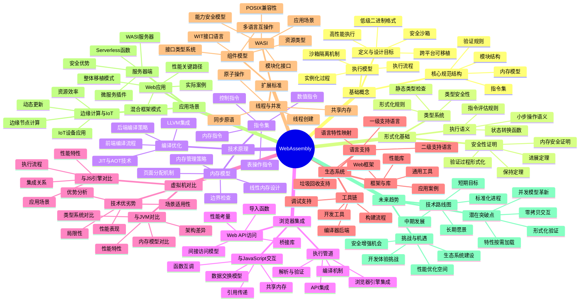

# WebAssembly技术全面分析与展望

## 目录

- [WebAssembly技术全面分析与展望](#webassembly技术全面分析与展望)
  - [目录](#目录)
  - [1. WebAssembly基础概念](#1-webassembly基础概念)
    - [1.1 定义与设计目标](#11-定义与设计目标)
    - [1.2 核心规范与结构](#12-核心规范与结构)
    - [1.3 执行模型](#13-执行模型)
  - [2. 形式化基础与理论](#2-形式化基础与理论)
    - [2.1 类型系统形式化](#21-类型系统形式化)
    - [2.2 执行语义形式化](#22-执行语义形式化)
    - [2.3 安全性证明](#23-安全性证明)
  - [3. 技术原理与架构](#3-技术原理与架构)
    - [3.1 内存模型](#31-内存模型)
    - [3.2 指令集设计](#32-指令集设计)
    - [3.3 编译与优化策略](#33-编译与优化策略)
  - [4. WebAssembly与浏览器技术](#4-webassembly与浏览器技术)
    - [4.1 浏览器集成原理](#41-浏览器集成原理)
    - [4.2 与JavaScript交互机制](#42-与javascript交互机制)
    - [4.3 Web API访问模型](#43-web-api访问模型)
  - [5. 虚拟机技术比较](#5-虚拟机技术比较)
    - [5.1 与JVM的对比](#51-与jvm的对比)
    - [5.2 与V8/JavaScript引擎对比](#52-与v8javascript引擎对比)
    - [5.3 技术优势与局限性](#53-技术优势与局限性)
  - [6. WebAssembly生态系统](#6-webassembly生态系统)
    - [6.1 工具链现状](#61-工具链现状)
    - [6.2 语言支持](#62-语言支持)
    - [6.3 框架与库](#63-框架与库)
  - [7. WebAssembly扩展标准](#7-webassembly扩展标准)
    - [7.1 WASI（WebAssembly系统接口）](#71-wasiwebassembly系统接口)
    - [7.2 组件模型](#72-组件模型)
    - [7.3 线程与并发模型](#73-线程与并发模型)
  - [8. 技术融合与应用场景](#8-技术融合与应用场景)
    - [8.1 Web应用架构模式](#81-web应用架构模式)
    - [8.2 服务器端WebAssembly](#82-服务器端webassembly)
    - [8.3 边缘计算与物联网](#83-边缘计算与物联网)
  - [9. 未来发展趋势](#9-未来发展趋势)
    - [9.1 技术演进路线图](#91-技术演进路线图)
    - [9.2 潜在突破点](#92-潜在突破点)
    - [9.3 挑战与机遇](#93-挑战与机遇)
  - [10. 思维导图](#10-思维导图)

## 1. WebAssembly基础概念

### 1.1 定义与设计目标

WebAssembly（简称Wasm）是一种低级二进制指令格式，基于堆栈机器的虚拟机架构，设计为高级语言的编译目标，可在现代Web浏览器中执行。它是一个开放标准，由W3C WebAssembly社区组维护。

**形式化定义**：
WebAssembly可以形式化定义为一个元组 $W = (T, F, G, M, I, E)$，其中：

- $T$ 是类型集合（数值和引用类型）
- $F$ 是指令集合（控制流、内存访问、数值运算等）
- $G$ 是全局状态空间
- $M$ 是模块定义
- $I$ 是导入接口
- $E$ 是导出接口

**核心设计目标**：

1. **高性能**：执行效率接近原生机器码
2. **安全性**：在沙箱环境中执行，内存安全且无副作用
3. **可移植性**：硬件、平台和语言无关的抽象层
4. **紧凑性**：二进制格式设计为高效下载和解析
5. **开放性**：开放标准，支持多种工具链和调试工具
6. **与Web平台集成**：无缝与JavaScript和Web API互操作

### 1.2 核心规范与结构

WebAssembly核心规范定义了模块结构、指令集和执行语义：

**模块结构**：
WebAssembly程序组织为模块，每个模块包含以下部分：

- **Types部分**：函数类型定义
- **Import部分**：从宿主环境导入的外部函数、表、内存、全局变量
- **Function部分**：函数定义，包括局部变量和指令序列
- **Table部分**：函数引用表，支持间接调用
- **Memory部分**：线性内存区域定义
- **Global部分**：全局变量定义
- **Export部分**：向宿主环境公开的接口
- **Element部分**：表的初始化数据
- **Data部分**：内存的初始化数据
- **Start部分**：模块加载时自动执行的函数

**二进制格式示例**：
WebAssembly模块可以用文本格式（WAT）表示：

```wat
(module
  ;; 导入宿主函数
  (import "console" "log" (func $log (param i32)))
  
  ;; 内存定义：1页(64KB)
  (memory (export "memory") 1)
  
  ;; 全局变量定义
  (global $counter (mut i32) (i32.const 0))
  
  ;; 函数定义：计算斐波那契数
  (func $fibonacci (export "fibonacci") (param $n i32) (result i32)
    (local $i i32)
    (local $a i32)
    (local $b i32)
    (local $temp i32)
    
    ;; 边界条件
    (if (i32.lt_s (local.get $n) (i32.const 2))
      (then
        (return (local.get $n))
      )
    )
    
    ;; 初始化
    (local.set $a (i32.const 0))
    (local.set $b (i32.const 1))
    (local.set $i (i32.const 2))
    
    ;; 循环计算斐波那契数
    (loop $fib_loop
      (local.set $temp (local.get $b))
      (local.set $b (i32.add (local.get $a) (local.get $b)))
      (local.set $a (local.get $temp))
      
      ;; 递增计数器
      (local.set $i (i32.add (local.get $i) (i32.const 1)))
      
      ;; 判断是否完成
      (br_if $fib_loop (i32.le_s (local.get $i) (local.get $n)))
    )
    
    ;; 返回结果
    (local.get $b)
  )
)
```

### 1.3 执行模型

WebAssembly采用堆栈机器模型，具有以下特点：

**验证过程**：
模块在执行前必须通过验证器验证，确保类型安全和内存安全。验证过程包括：

- 类型检查：确保所有指令操作匹配类型
- 控制流验证：确保控制流指令目标有效
- 内存边界检查：确保内存访问在有效范围内

**执行阶段**：

1. **实例化**：分配内存、表和全局变量，设置导入项
2. **初始化**：执行数据初始化和元素段，调用开始函数
3. **执行**：调用导出函数，执行指令序列

**执行状态形式化**：
WebAssembly执行状态可表示为：$S = (stack, locals, globals, memory, tables)$

指令执行可以看作状态转换：$S \xrightarrow{instr} S'$

## 2. 形式化基础与理论

### 2.1 类型系统形式化

WebAssembly采用静态类型系统，可以形式化表示：

**值类型**：
基本类型集合 $ValueType = \{i32, i64, f32, f64, funcref, externref\}$

**函数类型**：
函数类型表示为参数和结果的映射：$FuncType = [t_1^*] \rightarrow [t_2^*]$，其中 $t_1, t_2 \in ValueType$

**类型判断规则**：
可以使用判断式 $\Gamma \vdash e : \tau$ 表示在上下文 $\Gamma$ 中表达式 $e$ 具有类型 $\tau$。

例如，常量指令的类型规则：
$$\frac{}{\Gamma \vdash \text{i32.const}~n : i32}$$

加法指令的类型规则：
$$\frac{\Gamma \vdash e_1 : i32 \quad \Gamma \vdash e_2 : i32}{\Gamma \vdash e_1~e_2~\text{i32.add} : i32}$$

### 2.2 执行语义形式化

WebAssembly的执行语义可以通过小步操作语义形式化：

**指令评估规则**：

常量指令：
$$\frac{}{S; \text{const}~v::instr \Rightarrow S; v::instr}$$

局部变量获取：
$$\frac{locals[i] = v}{S; \text{local.get}~i::instr \Rightarrow S; v::instr}$$

局部变量设置：
$$\frac{locals' = locals[i \mapsto v]}{S, v; \text{local.set}~i::instr \Rightarrow S; instr}$$

二元运算：
$$\frac{v_3 = v_1 \oplus v_2}{S, v_1, v_2; \text{i32.}\oplus::instr \Rightarrow S, v_3; instr}$$

控制流指令（分支）：
$$\frac{v \neq 0}{S, v; \text{br\_if}~l::instr \Rightarrow S; \text{br}~l::instr}$$

$$\frac{v = 0}{S, v; \text{br\_if}~l::instr \Rightarrow S; instr}$$

### 2.3 安全性证明

WebAssembly的安全性可以通过形式化方法证明，包括类型安全和内存安全：

**类型安全定理**：

WebAssembly的类型安全性可以通过进展(Progress)和保持(Preservation)定理证明：

定理(Progress)：如果 $\vdash s : t$ 且 $s$ 不是值，则 $\exists s'$ 使得 $s \to s'$

定理(Preservation)：如果 $\vdash s : t$ 且 $s \to s'$，则 $\vdash s' : t$

这两个定理保证WebAssembly程序不会"卡住"，且类型在执行过程中保持一致。

**内存安全证明**：

定理(内存安全)：对于任何已验证的WebAssembly模块 $m$，
如果 $(s, f) \xrightarrow{i} (s', f')$ 是一个执行步骤，且 $i$ 是内存访问指令，
则访问的内存地址 $addr$ 满足 $0 \leq addr < |mem|$，其中 $|mem|$ 是当前内存大小。

**验证的形式化**：

验证过程可以形式化表示为函数：
$$\text{validate}: \text{Module} \rightarrow \{\text{true}, \text{false}\}$$

对于模块 $m$，$\text{validate}(m) = \text{true}$ 当且仅当所有组件（函数、表、内存等）都通过类型检查和边界检查。

## 3. 技术原理与架构

### 3.1 内存模型

WebAssembly采用线性内存模型，是一个可调整大小的连续字节数组：

**核心特性**：

- **线性寻址**：简单的字节数组，类似于C/C++的内存模型
- **页面分配**：内存以64KB页为单位增长
- **大小限制**：使用32位地址，最大支持4GB内存
- **显式边界检查**：所有内存访问都进行边界检查确保安全
- **无垃圾回收**：手动内存管理，与C/C++/Rust类似

**内存操作**：

```javascript
// JavaScript中创建和操作WebAssembly内存
const memory = new WebAssembly.Memory({ initial: 10, maximum: 100 });
const arrayBuffer = memory.buffer;
const view = new Uint8Array(arrayBuffer);

// 写入数据
view[0] = 42;
view[1] = 43;

// 读取数据
console.log(view[0]); // 42
```

**内存管理策略**：

在WebAssembly中，内存管理通常通过以下方式实现：

1. **静态分配**：编译时分配固定大小内存
2. **堆分配器**：实现自定义内存分配器（如malloc/free）
3. **栈分配**：使用函数局部变量进行临时分配

### 3.2 指令集设计

WebAssembly指令集设计结合了栈机和寄存器机的特点：

**指令分类**：

1. **控制指令**：控制流，如block, loop, if, br, br_if, call, return
2. **参数栈指令**：操作栈和局部变量，如local.get, local.set
3. **内存指令**：内存访问，如i32.load, i32.store
4. **数值指令**：算术和逻辑操作，如i32.add, i32.sub, i32.mul
5. **转换指令**：类型转换，如i32.trunc_f32_s
6. **表操作指令**：操作函数表，如call_indirect

**指令格式**：

WebAssembly指令通常形式为：`[类型].[操作]`，例如：

- `i32.add`：32位整数加法
- `f64.mul`：64位浮点数乘法
- `i32.load`：从内存加载32位整数

**示例**：
以下是一个简单加法函数的WebAssembly文本表示：

```wat
(func $add (param $a i32) (param $b i32) (result i32)
  local.get $a
  local.get $b
  i32.add
)
```

编译为二进制格式后，这个函数非常简洁，只需几个字节。

### 3.3 编译与优化策略

WebAssembly模块的编译流程：

**前端编译**：

1. 高级语言代码 → 中间表示（IR）
2. IR优化（如内联、死代码消除）
3. IR → WebAssembly

**后端编译（在浏览器中）**：

1. WebAssembly二进制 → 浏览器内部IR
2. 验证（类型检查、控制流检查）
3. 优化（针对目标架构）
4. 代码生成（JIT或AOT）

**优化技术**：

- **函数内联**：减少函数调用开销
- **循环优化**：循环展开、循环不变量提升
- **SIMD向量化**：利用SIMD指令并行处理数据
- **内存访问优化**：合并读写操作，减少边界检查
- **常量折叠与传播**：编译时计算常量表达式
- **死代码消除**：移除未使用的代码和变量

**Rust到WebAssembly编译示例**：

```rust
// Rust源代码
#[no_mangle]
pub fn fibonacci(n: i32) -> i32 {
    if n <= 1 {
        return n;
    }
    let mut a = 0;
    let mut b = 1;
    let mut i = 2;
    
    while i <= n {
        let temp = b;
        b = a + b;
        a = temp;
        i += 1;
    }
    
    b
}
```

编译命令：

```bash
rustc --target wasm32-unknown-unknown -O fibonacci.rs
wasm-opt -O3 fibonacci.wasm -o fibonacci.optimized.wasm
```

## 4. WebAssembly与浏览器技术

### 4.1 浏览器集成原理

WebAssembly在现代浏览器中的集成架构：

**执行管道**：

1. **下载与解析**：获取.wasm文件并解析二进制格式
2. **编译与验证**：验证模块并编译为机器码
3. **实例化**：分配资源，设置内存和导入项
4. **执行**：运行WebAssembly代码

**浏览器引擎集成**：

| 浏览器引擎 | 实现方式 | 编译策略 |
|----------|----------|---------|
| V8 (Chrome) | 集成到TurboFan编译器 | 分层编译（解释+JIT） |
| SpiderMonkey (Firefox) | 独立编译器后端 | 基线+优化JIT |
| JavaScriptCore (Safari) | 集成到B3编译器 | 多层JIT |
| Chakra (Edge旧版) | 集成到JIT编译器 | 两级JIT |

**API集成**：
浏览器提供JavaScript API用于WebAssembly操作：

```javascript
// WebAssembly JavaScript API示例
async function loadAndRunWasm() {
  // 方法1：使用fetch和instantiate
  const response = await fetch('module.wasm');
  const buffer = await response.arrayBuffer();
  const { instance } = await WebAssembly.instantiate(buffer);
  
  // 方法2：使用instantiateStreaming（更高效）
  const { instance } = await WebAssembly.instantiateStreaming(
    fetch('module.wasm')
  );
  
  // 使用导出函数
  const result = instance.exports.fibonacci(10);
  console.log(`Result: ${result}`);
}
```

### 4.2 与JavaScript交互机制

WebAssembly与JavaScript的互操作机制：

**数据交换模型**：

1. **数值传递**：直接传递数值类型(i32, i64, f32, f64)
2. **内存共享**：通过共享ArrayBuffer访问WebAssembly线性内存
3. **函数调用**：互相调用对方函数
4. **引用传递**：传递JavaScript对象引用（externref）

**调用WebAssembly函数**：

```javascript
// 从JavaScript调用WebAssembly函数
const importObject = {
  env: {
    memory: new WebAssembly.Memory({ initial: 1 }),
    log: function(arg) {
      console.log(arg);
    }
  }
};

WebAssembly.instantiateStreaming(fetch('module.wasm'), importObject)
  .then(({ instance }) => {
    // 调用导出函数
    const result = instance.exports.compute(5, 3);
    console.log(`计算结果: ${result}`);
    
    // 访问导出内存
    const memory = instance.exports.memory;
    const view = new Uint8Array(memory.buffer);
    console.log(`内存中的值: ${view[0]}`);
  });
```

**复杂数据交换**：

```javascript
// 字符串和数组交换示例
async function exchangeComplexData() {
  const wasm = await WebAssembly.instantiateStreaming(
    fetch('strings.wasm')
  );
  
  const { 
    malloc, free, process_string, memory 
  } = wasm.instance.exports;
  
  // 准备JavaScript字符串
  const jsString = "Hello, WebAssembly!";
  const bytes = new TextEncoder().encode(jsString);
  
  // 在WebAssembly内存中分配空间
  const ptr = malloc(bytes.length + 1);
  
  // 写入字符串到WebAssembly内存
  const wasmMemory = new Uint8Array(memory.buffer);
  wasmMemory.set(bytes, ptr);
  wasmMemory[ptr + bytes.length] = 0; // 添加null终止符
  
  // 调用WebAssembly函数处理字符串
  const resultPtr = process_string(ptr);
  
  // 读取结果字符串
  let result = "";
  let i = resultPtr;
  while (wasmMemory[i] !== 0) {
    result += String.fromCharCode(wasmMemory[i]);
    i++;
  }
  
  // 释放内存
  free(ptr);
  free(resultPtr);
  
  console.log(result); // "!ylbmessAbeW ,olleH"
}
```

### 4.3 Web API访问模型

WebAssembly访问Web API的机制：

**间接访问模型**：
WebAssembly不能直接访问DOM或Web API，必须通过JavaScript作为中介：

```math
WebAssembly → JavaScript → Web API → JavaScript → WebAssembly
```

**导入函数示例**：

```javascript
// 为WebAssembly提供DOM操作能力
const importObject = {
  dom: {
    getElementById: (idPtr, idLen) => {
      // 从WebAssembly内存读取元素ID
      const memory = wasm.instance.exports.memory;
      const bytes = new Uint8Array(memory.buffer, idPtr, idLen);
      const id = new TextDecoder().decode(bytes);
      
      // 查找DOM元素
      const element = document.getElementById(id);
      
      // 返回DOM元素引用索引（存储在全局映射中）
      return storeReference(element);
    },
    setInnerText: (elementRef, textPtr, textLen) => {
      const element = getReference(elementRef);
      const memory = wasm.instance.exports.memory;
      const bytes = new Uint8Array(memory.buffer, textPtr, textLen);
      const text = new TextDecoder().decode(bytes);
      
      element.innerText = text;
    }
  }
};
```

**Web API桥接库**：

多种工具和库简化了WebAssembly与Web API的交互：

1. **wasm-bindgen**：Rust生态系统中的绑定生成器
2. **Emscripten**：提供标准库和API模拟
3. **AssemblyScript的标准库**：TypeScript子集到Web API的绑定

示例（使用wasm-bindgen）：

```rust
// Rust源码使用wasm-bindgen
use wasm_bindgen::prelude::*;

// 导入JavaScript函数
#[wasm_bindgen]
extern "C" {
    #[wasm_bindgen(js_namespace = console)]
    fn log(s: &str);
    
    #[wasm_bindgen(js_namespace = document)]
    fn getElementById(id: &str) -> web_sys::Element;
}

// 导出到JavaScript的函数
#[wasm_bindgen]
pub fn update_element(id: &str, text: &str) {
    log(&format!("更新元素: {}", id));
    let element = getElementById(id);
    element.set_inner_html(text);
}
```

## 5. 虚拟机技术比较

### 5.1 与JVM的对比

WebAssembly和Java虚拟机(JVM)技术对比：

**架构差异**：

| 特性 | WebAssembly | JVM |
|------|------------|-----|
| 指令格式 | 紧凑二进制格式 | Java字节码 |
| 内存模型 | 线性内存（手动管理） | 托管堆（自动GC） |
| 类型系统 | 静态、基本数值类型 | 静态、丰富的对象类型 |
| 运行时特性 | 最小运行时，无GC | 完整运行时，包含GC |
| 执行模型 | 堆栈和寄存器混合 | 基于栈的虚拟机 |
| 目标用例 | 高性能Web应用 | 通用应用平台 |

**性能特性对比**：

1. **启动时间**：WebAssembly通常比JVM启动更快
2. **峰值性能**：JVM在长时间运行后可能通过JIT优化达到更高性能
3. **内存使用**：WebAssembly通常内存使用更少
4. **代码大小**：WebAssembly二进制格式通常更紧凑

**形式化对比**：

使用状态转换系统表示，对于程序P：

WebAssembly执行：$S_0 \xrightarrow{wasm} S_n$，其中状态转换受限于显式内存边界和类型约束。

JVM执行：$S_0 \xrightarrow{jvm} S_n$，其中状态转换包括自动内存管理和异常处理。

### 5.2 与V8/JavaScript引擎对比

WebAssembly与JavaScript引擎的比较：

**执行流程对比**：

**JavaScript执行流程**：

1. 解析源代码生成AST
2. 解释执行或基线JIT编译
3. 监控热点代码
4. 对热点代码进行优化编译
5. 在优化假设失败时回退

**WebAssembly执行流程**：

1. 解码二进制格式
2. 验证类型和安全约束
3. 编译为机器码（可能经过中间表示）
4. 执行编译后的代码

**性能特性**：

| 特性 | WebAssembly | JavaScript |
|------|------------|------------|
| 解析时间 | 快（二进制格式） | 慢（文本解析） |
| 初始执行 | 快（预编译或快速编译） | 慢（解释执行） |
| 峰值性能 | 接近原生代码 | 优化后可接近原生 |
| 预测性 | 高（确定性执行） | 低（依赖优化假设） |
| 内存使用 | 低（精确控制） | 高（运行时开销） |

**集成关系**：

在现代浏览器中，WebAssembly引擎通常与JavaScript引擎紧密集成：

```text
┌─────────────────────────────────┐
│          浏览器引擎              │
├─────────────────────────────────┤
│                                 │
│  ┌─────────────┐ ┌────────────┐ │
│  │ JavaScript  │ │ WebAssembly│ │
│  │   引擎      │ │   引擎     │ │
│  └─────────────┘ └────────────┘ │
│          │            │         │
│          └────────────┘         │
│               │                 │
│       ┌───────────────┐         │
│       │ 优化编译后端  │         │
│       └───────────────┘         │
│                                 │
└─────────────────────────────────┘
```

### 5.3 技术优势与局限性

WebAssembly相对于其他虚拟机技术的优势与局限性：

**优势**：

1. **轻量级**：最小化运行时，适合资源受限环境
2. **快速启动**：二进制格式快速解析，快速编译
3. **跨平台**：一次编译，多处运行
4. **确定性执行**：执行结果在不同平台一致
5. **安全沙箱**：内存安全，无系统访问
6. **与Web生态集成**：无缝与JavaScript交互

**局限性**：

1. **有限的标准库**：需要导入或自行实现常见功能
2. **内存管理负担**：开发者需要手动管理内存
3. **访问平台API受限**：需要通过JavaScript桥接
4. **调试工具不完善**：相比成熟VM调试体验较差
5. **有限的运行时反射**：缺乏类似JVM的运行时类型信息
6. **生态系统尚在成长**：库和工具相对较少

**面向特定场景的优势对比**：

| 场景 | WebAssembly | 传统VM | 原生代码 |
|------|------------|-------|---------|
| Web应用 | ★★★★★ | ★★★ | ✗ |
| 移动应用 | ★★★ | ★★★★ | ★★★★★ |
| 服务器应用 | ★★★ | ★★★★ | ★★★★★ |
| 嵌入式应用 | ★★★★ | ★★ | ★★★★★ |
| 游戏引擎 | ★★★★ | ★★ | ★★★★★ |
| 插件系统 | ★★★★★ | ★★★ | ★★ |

## 6. WebAssembly生态系统

### 6.1 工具链现状

WebAssembly编译和开发工具链概览：

**编译器后端**：

1. **LLVM**：C/C++/Rust/Swift等语言的WebAssembly后端
2. **Binaryen**：WebAssembly优化和工具套件
3. **Emscripten**：C/C++到WebAssembly的完整工具链
4. **wasm-pack**：Rust到WebAssembly的打包工具
5. **Go编译器**：原生支持WebAssembly目标

**开发工具**：

1. **WebAssembly二进制工具包(WABT)**：转换和调试工具
2. **wasm-bindgen**：生成WebAssembly和JavaScript绑定
3. **wasm-opt**：WebAssembly二进制优化器
4. **wasmer/wasmtime**：独立WebAssembly运行时
5. **wasm-pack**：WebAssembly模块打包和发布工具

**调试工具**：

1. **Chrome DevTools**：浏览器内WebAssembly调试
2. **Firefox DevTools**：支持WebAssembly源码映射
3. **DWARF调试信息**：多种编译器支持生成调试信息
4. **wasm-inspect**：检查WebAssembly二进制内容

**构建流程示例**（Rust）：

```bash
# 安装工具链
rustup target add wasm32-unknown-unknown
cargo install wasm-pack

# 创建项目
cargo new --lib wasm-example
cd wasm-example

# 添加wasm-bindgen依赖到Cargo.toml
# [dependencies]
# wasm-bindgen = "0.2"

# 构建WebAssembly模块
wasm-pack build --target web

# 优化（可选）
wasm-opt -O3 -o optimized.wasm pkg/wasm_example_bg.wasm
```

### 6.2 语言支持

不同编程语言对WebAssembly的支持程度：

**一级支持**（原生编译到WebAssembly）：

1. **C/C++**：通过Emscripten或LLVM直接编译
2. **Rust**：原生目标支持，wasm-bindgen提供丰富绑定
3. **AssemblyScript**：TypeScript的子集，专为WebAssembly设计
4. **Go**：1.11版本后提供WebAssembly编译支持
5. **Zig**：内置WebAssembly目标支持

**二级支持**（通过中间层转换）：

1. **Java/Kotlin**：通过TeaVM或JWebAssembly
2. **C#/.NET**：通过Blazor框架（mono运行时）
3. **Python**：通过Pyodide（编译CPython）
4. **Ruby**：通过Ruby.wasm
5. **Dart**：实验性WebAssembly编译

**语言特性映射**：

不同语言特性到WebAssembly的映射：

| 语言特性 | WebAssembly表示 |
|---------|---------------|
| 基本数值类型 | 直接映射到i32/i64/f32/f64 |
| 布尔值 | 映射到i32 (0=false, 1=true) |
| 字符串 | 内存中的字节序列+长度 |
| 数组/列表 | 内存中的连续数据+元数据 |
| 类/结构体 | 内存中的自定义布局 |
| 函数 | 直接映射或间接函数表调用 |
| 异常处理 | 自定义错误码或标准异常提案 |
| 垃圾回收 | 自定义GC实现或标准GC提案 |

**示例**：Rust结构体映射到WebAssembly

```rust
// Rust结构体
struct Point {
    x: f32,
    y: f32,
}

// 在WebAssembly内存中的表示:
// [x的4字节][y的4字节]
```

### 6.3 框架与库

WebAssembly生态系统中的框架和库：

**Web框架**：

1. **Yew**：Rust编写的React风格前端框架
2. **Blazor**：基于.NET的WebAssembly框架
3. **Sycamore**：Rust响应式前端框架
4. **Percy**：用Rust编写的同构Web框架
5. **Iced**：Rust GUI库，可编译为WebAssembly

**性能库**：

1. **wasm-bindgen**：Rust和JavaScript之间的高级绑定
2. **tiny-skia**：WebAssembly优化的2D渲染库
3. **wasm-vips**：图像处理库的WebAssembly移植
4. **ffmpeg.wasm**：FFmpeg的WebAssembly移植
5. **SQLite.wasm**：SQLite数据库的WebAssembly版本

**通用工具库**：

1. **wasm-bindgen-futures**：连接Rust和JavaScript异步编程模型
2. **wasm-streams**：Web Streams API的WebAssembly绑定
3. **js-sys**：完整JavaScript标准库的Rust绑定
4. **web-sys**：Web API的Rust绑定
5. **emscripten-Core**：C/C++项目的系统库模拟

**示例（使用Yew框架）**：

```rust
// Rust Yew框架WebAssembly应用示例
use yew::prelude::*;

enum Msg {
    Increment,
    Decrement,
}

struct Counter {
    value: i64,
}

impl Component for Counter {
    type Message = Msg;
    type Properties = ();

    fn create(_ctx: &Context<Self>) -> Self {
        Self { value: 0 }
    }

    fn update(&mut self, _ctx: &Context<Self>, msg: Self::Message) -> bool {
        match msg {
            Msg::Increment => {
                self.value += 1;
                true
            }
            Msg::Decrement => {
                self.value -= 1;
                true
            }
        }
    }

    fn view(&self, ctx: &Context<Self>) -> Html {
        let link = ctx.link();
        html! {
            <div>
                <button onclick={link.callback(|_| Msg::Decrement)}>{ "-1" }</button>
                <p>{ self.value }</p>
                <button onclick={link.callback(|_| Msg::Increment)}>{ "+1" }</button>
            </div>
        }
    }
}

fn main() {
    yew::start_app::<Counter>();
}
```

## 7. WebAssembly扩展标准

### 7.1 WASI（WebAssembly系统接口）

WASI（WebAssembly系统接口）为WebAssembly提供标准化的系统级功能访问：

**核心概念**：

WASI提供了一个能力导向的安全系统接口，允许WebAssembly程序以可移植方式访问操作系统功能，同时保持安全沙箱。

**特点**：

1. **能力安全模型**：通过文件描述符传递权限，默认零权限
2. **POSIX兼容性**：接口设计类似POSIX，易于移植
3. **模块化设计**：接口按功能分组，可独立实现
4. **可移植性**：跨平台一致行为

**主要模块**：

- **wasi_snapshot_preview1**：当前稳定接口，包含文件/目录、随机数、时钟等
- **wasi_nn**：神经网络推理接口（提案）
- **wasi_crypto**：密码学操作接口（提案）
- **wasi_http**：HTTP客户端/服务器接口（提案）

**WASI示例**（Rust）：

```rust
// Rust WASI文件操作示例
use std::fs::File;
use std::io::{self, Read, Write};

fn main() -> io::Result<()> {
    // 创建并写入文件（需要"/"目录的预授权）
    let mut file = File::create("hello.txt")?;
    file.write_all(b"Hello, WASI!")?;
    
    // 读取文件
    let mut file = File::open("hello.txt")?;
    let mut contents = String::new();
    file.read_to_string(&mut contents)?;
    
    println!("File contents: {}", contents);
    Ok(())
}
```

编译和运行：

```bash
rustc --target wasm32-wasi hello.rs -o hello.wasm
wasmtime --dir=. hello.wasm
```

### 7.2 组件模型

WebAssembly组件模型是一项重要扩展，提供更强大的模块化和互操作性：

**核心概念**：

组件模型通过标准化的接口类型系统和调用约定，允许不同语言编写的WebAssembly模块无缝交互。

**主要特性**：

1. **接口类型系统**：支持丰富的数据类型，包括字符串、记录、变体等
2. **接口定义语言(WIT)**：用于描述组件接口
3. **适配层自动生成**：根据接口定义生成胶水代码
4. **多语言互操作**：不同语言编写的组件可互相调用
5. **资源类型**：表示需要显式管理的资源

**组件组成**：

```math
┌─────────────────────────────────┐
│            组件                 │
│  ┌─────────────────────────────┐│
│  │          导入接口            ││
│  └─────────────────────────────┘│
│  ┌─────────────────────────────┐│
│  │          核心模块            ││
│  └─────────────────────────────┘│
│  ┌─────────────────────────────┐│
│  │          导出接口            ││
│  └─────────────────────────────┘│
└─────────────────────────────────┘
```

**WIT接口示例**：

```wit
// 组件接口定义 (WIT格式)
package example:image-processor@1.0.0;

interface image {
    // 定义图像格式枚举
    enum format {
        png,
        jpeg,
        webp,
    }

    // 定义图像结构
    record image-data {
        width: u32,
        height: u32,
        format: format,
        data: list<u8>,
    }
    
    // 图像处理错误
    enum error {
        invalid-format,
        processing-failed,
    }
    
    // 接口函数
    resize: func(img: image-data, new-width: u32, new-height: u32) -> result<image-data, error>;
    grayscale: func(img: image-data) -> result<image-data, error>;
    rotate: func(img: image-data, degrees: f32) -> result<image-data, error>;
}

export image;
```

**Rust实现**：

```rust
// 使用wit-bindgen实现组件接口
wit_bindgen::generate!({
    world: "image-processor",
    exports: {
        "example:image-processor/image": ImageProcessor,
    }
});

struct ImageProcessor;

impl exports::example::image_processor::image::Guest for ImageProcessor {
    fn resize(
        img: ImageData, 
        new_width: u32, 
        new_height: u32
    ) -> Result<ImageData, Error> {
        // 调整图像大小的实现
        // ...
        
        Ok(resized_image)
    }
    
    fn grayscale(img: ImageData) -> Result<ImageData, Error> {
        // 转换为灰度图的实现
        // ...
        
        Ok(gray_image)
    }
    
    fn rotate(img: ImageData, degrees: f32) -> Result<ImageData, Error> {
        // 旋转图像的实现
        // ...
        
        Ok(rotated_image)
    }
}
```

### 7.3 线程与并发模型

WebAssembly的线程和并发模型解决方案：

**当前状态**：

WebAssembly初始规范不包含线程支持，但线程提案已经处于积极开发阶段。

**线程模型特性**：

1. **共享内存**：允许多个WebAssembly实例共享内存
2. **原子操作**：提供原子内存访问指令
3. **线程创建**：通过宿主环境API创建线程
4. **同步原语**：使用原子操作实现各种同步机制

**示例（使用共享内存和原子操作）**：

```javascript
// JavaScript中创建共享WebAssembly内存
const memory = new WebAssembly.Memory({ 
  initial: 10, 
  maximum: 100, 
  shared: true 
});

// 在主线程中
const importObject = { env: { memory } };
WebAssembly.instantiateStreaming(fetch('threading.wasm'), importObject)
  .then(({ instance }) => {
    // 创建Web Worker
    const worker = new Worker('worker.js');
    
    // 传递共享内存给Worker
    worker.postMessage({ 
      memory, 
      exports: {
        increment: instance.exports.increment,
        getValue: instance.exports.getValue
      }
    });
    
    // 使用原子操作与Worker线程同步
    Atomics.wait(new Int32Array(memory.buffer), 0, 0);
    
    // 读取操作结果
    console.log(`Final value: ${instance.exports.getValue()}`);
  });
```

**Worker线程代码**：

```javascript
// worker.js
self.onmessage = function(e) {
  const { memory, exports } = e.data;
  
  // 使用共享内存
  exports.increment(10);
  
  // 通知主线程完成
  Atomics.notify(new Int32Array(memory.buffer), 0, 1);
};
```

**Rust中的线程**：

```rust
// Rust WebAssembly线程示例
use wasm_bindgen::prelude::*;
use std::sync::atomic::{AtomicI32, Ordering};

// 共享的原子计数器
static COUNTER: AtomicI32 = AtomicI32::new(0);

#[wasm_bindgen]
pub fn increment(n: i32) {
    for _ in 0..n {
        COUNTER.fetch_add(1, Ordering::SeqCst);
    }
}

#[wasm_bindgen]
pub fn get_value() -> i32 {
    COUNTER.load(Ordering::SeqCst)
}
```

## 8. 技术融合与应用场景

### 8.1 Web应用架构模式

WebAssembly在Web应用中的架构模式：

**1. 性能关键路径模式**：

WebAssembly处理性能密集型任务，JavaScript处理UI和业务逻辑。

```math
┌─────────────────────────────────┐
│            Web应用              │
├─────────────────────────────────┤
│           JavaScript            │
│       (UI和应用逻辑)             │
├─────────────────────────────────┤
│          WebAssembly            │
│      (计算密集型功能)            │
└─────────────────────────────────┘
```

**示例应用**：

- 图像/视频处理应用
- 3D建模和CAD软件
- 科学计算应用
- 游戏引擎

**2. 整体移植模式**：

将现有C/C++/Rust应用整体移植到WebAssembly，最小化改动。

```math
┌─────────────────────────────────┐
│     Emscripten/WebAssembly      │
│   ┌─────────────────────────┐   │
│   │    原生应用代码 (C++)   │   │
│   └─────────────────────────┘   │
│   ┌─────────────────────────┐   │
│   │     系统库模拟层        │   │
│   └─────────────────────────┘   │
├─────────────────────────────────┤
│        JavaScript胶水代码        │
└─────────────────────────────────┘
```

**示例应用**：

- AutoCAD Web
- Photoshop Web
- 游戏移植（如Doom、Quake）

**3. 混合框架模式**：

WebAssembly和JavaScript协同工作，各自处理最适合的部分。

```math
┌─────────────────────────────────┐
│          Web应用框架            │
│  ┌─────────────┐ ┌────────────┐ │
│  │ JavaScript  │ │ WebAssembly│ │
│  │   组件      │ │   组件      │ │
│  └─────────────┘ └────────────┘ │
│  ┌─────────────────────────────┐ │
│  │        状态管理层            │ │
│  └─────────────────────────────┘ │
│  ┌─────────────────────────────┐ │
│  │        通信抽象层            │ │
│  └─────────────────────────────┘ │
└─────────────────────────────────┘
```

**示例应用**：

- 具有高性能数据处理的企业Web应用
- 具有复杂可视化的数据分析平台
- 高性能Web编辑器

### 8.2 服务器端WebAssembly

WebAssembly在服务器端的应用架构：

**1. WASI服务器应用**：

使用WASI运行独立的WebAssembly服务器应用。

```math
┌─────────────────────────────────┐
│         操作系统               │
├─────────────────────────────────┤
│       WebAssembly运行时         │
│      (Wasmtime/Wasmer)          │
├─────────────────────────────────┤
│           WASI接口              │
├─────────────────────────────────┤
│      WebAssembly应用            │
└─────────────────────────────────┘
```

**优势**：

- 安全沙箱隔离
- 快速启动时间
- 低内存占用
- 可移植性

**2. 微服务插件架构**：

使用WebAssembly作为微服务架构中的可扩展插件系统。

```math
┌─────────────────────────────────┐
│       微服务应用                 │
├─────────────────────────────────┤
│       核心服务逻辑               │
├─────────────────────────────────┤
│      插件管理系统                │
├─────────────────────────────────┤
│  ┌────────┐ ┌────────┐ ┌────────┐│
│  │ WASM   │ │ WASM   │ │ WASM   ││
│  │ 插件1  │ │ 插件2   │ │ 插件3  ││
│  └────────┘ └────────┘ └────────┘│
└─────────────────────────────────┘
```

**示例应用**：

- API网关中的自定义过滤器
- 规则引擎和策略评估
- 数据转换和处理管道

**3. Serverless函数**：

WebAssembly作为轻量级、快速启动的Serverless执行环境。

```math
┌─────────────────────────────────┐
│     Serverless平台               │
├─────────────────────────────────┤
│     事件触发系统                 │
├─────────────────────────────────┤
│     WebAssembly运行时池          │
├─────────────────────────────────┤
│  ┌────────┐ ┌────────┐ ┌────────┐│
│  │ 函数A  │ │ 函数B   │ │ 函数C  ││
│  └────────┘ └────────┘ └────────┘│
└─────────────────────────────────┘
```

**主要优势**：

- 毫秒级冷启动时间
- 更高的资源利用率
- 更好的多租户隔离
- 跨语言兼容性

**示例代码**（Rust Serverless函数）：

```rust
// Rust WebAssembly Serverless函数
use wasm_bindgen::prelude::*;
use serde::{Serialize, Deserialize};

#[derive(Deserialize)]
struct Request {
    name: String,
    age: u32,
}

#[derive(Serialize)]
struct Response {
    message: String,
    processed: bool,
}

#[wasm_bindgen]
pub fn handle_request(json: &str) -> String {
    // 解析请求
    let request: Request = serde_json::from_str(json)
        .unwrap_or(Request { name: "Unknown".to_string(), age: 0 });
    
    // 处理逻辑
    let message = format!("Hello, {}! You are {} years old.", 
                         request.name, request.age);
    
    // 创建响应
    let response = Response {
        message,
        processed: true,
    };
    
    // 序列化返回
    serde_json::to_string(&response).unwrap_or_default()
}
```

### 8.3 边缘计算与物联网

WebAssembly在边缘计算和物联网中的应用：

**1. 边缘计算节点**：

使用WebAssembly在边缘节点上运行安全、轻量级的计算工作负载。

```math
┌─────────────────────────────────┐
│         边缘设备                 │
├─────────────────────────────────┤
│     设备管理系统                 │
├─────────────────────────────────┤
│   WebAssembly微运行时            │
│      (WAMR)                     │
├─────────────────────────────────┤
│   ┌────────┐     ┌────────┐     │
│   │数据过滤 │     │异常检测│     │
│   │ WASM   │     │ WASM   │     │
│   └────────┘     └────────┘     │
└─────────────────────────────────┘
```

**优势**：

- 极低的资源消耗
- 隔离和安全执行
- 动态更新能力
- 跨设备可移植性

**2. 物联网设备应用**：

使用WebAssembly作为物联网设备上的应用容器。

```math
┌─────────────────────────────────┐
│         IoT设备                 │
├─────────────────────────────────┤
│     嵌入式操作系统              │
├─────────────────────────────────┤
│     WebAssembly运行时           │
├─────────────────────────────────┤
│  ┌────────┐ ┌────────┐ ┌────────┐│
│  │传感器  │ │控制    │ │通信    ││
│  │处理    │ │逻辑    │ │协议    ││
│  └────────┘ └────────┘ └────────┘│
└─────────────────────────────────┘
```

**示例应用**：

- 智能家居控制器
- 工业IoT边缘处理
- 农业监控系统
- 资产跟踪和监控

**示例代码**（边缘设备数据过滤）：

```rust
// Rust边缘计算过滤器
use wasm_bindgen::prelude::*;

// 传感器数据结构
#[derive(Clone)]
#[wasm_bindgen]
pub struct SensorData {
    temperature: f32,
    humidity: f32,
    pressure: f32,
    timestamp: u64,
}

#[wasm_bindgen]
impl SensorData {
    #[wasm_bindgen(constructor)]
    pub fn new(temp: f32, hum: f32, press: f32, time: u64) -> Self {
        SensorData {
            temperature: temp,
            humidity: hum,
            pressure: press,
            timestamp: time,
        }
    }
}

#[wasm_bindgen]
pub struct AnomalyDetector {
    temp_threshold: f32,
    temp_history: [f32; 10],
    history_index: usize,
}

#[wasm_bindgen]
impl AnomalyDetector {
    #[wasm_bindgen(constructor)]
    pub fn new(threshold: f32) -> Self {
        AnomalyDetector {
            temp_threshold: threshold,
            temp_history: [0.0; 10],
            history_index: 0,
        }
    }
    
    // 检测温度异常
    pub fn detect_anomaly(&mut self, data: &SensorData) -> bool {
        // 保存历史数据
        self.temp_history[self.history_index] = data.temperature;
        self.history_index = (self.history_index + 1) % 10;
        
        // 计算平均值
        let sum: f32 = self.temp_history.iter().sum();
        let avg = sum / 10.0;
        
        // 检查是否超过阈值
        (data.temperature - avg).abs() > self.temp_threshold
    }
}
```

## 9. 未来发展趋势

### 9.1 技术演进路线图

WebAssembly技术演进的主要方向：

**短期（1-2年）**：

1. **组件模型标准化**：完成并稳定组件模型规范
2. **垃圾回收接口**：标准化GC集成，改善托管语言支持
3. **异常处理**：完成异常处理提案，支持结构化异常
4. **更多WASI接口**：扩展系统接口覆盖范围（网络、加密等）
5. **工具链成熟**：改善开发者体验和调试工具

**中期（3-5年）**：

1. **多线程模型增强**：完善线程模型和同步原语
2. **微服务标准**：针对服务器端用例的标准化
3. **安全增强**：形式化验证和安全模型改进
4. **边缘计算标准**：针对边缘和IoT的轻量级规范
5. **扩展器械支持**：增强对GPU/NPU等加速硬件的支持

**长期（5年以上）**：

1. **分布式WebAssembly**：跨节点执行与协作标准
2. **硬件加速**：WebAssembly专用处理器和加速单元
3. **AI集成**：机器学习模型和WebAssembly的深度集成
4. **操作系统级集成**：作为通用计算平台下沉到OS层
5. **可证明安全**：完整的形式化验证和安全保证

**标准化过程**：

```math
提案 → 草案 → 实现 → 测试 → 标准化 → 广泛采用
```

### 9.2 潜在突破点

WebAssembly潜在的技术突破点：

**1. 细粒度并发模型**：

超越传统线程模型，采用更轻量级的并发原语。

```rust
// 概念示例：细粒度任务模型
#[wasm_task]
async fn process_chunk(data: &[u8]) -> Result<Vec<u8>, Error> {
    // 处理数据块的逻辑
    // ...
    
    // 可以被调度器暂停和恢复
    yield_if_needed().await;
    
    // 继续处理
    Ok(processed_data)
}

// 并行执行多个任务
pub async fn process_data(chunks: Vec<Vec<u8>>) -> Vec<Vec<u8>> {
    // 自动在可用资源上并行调度
    join_all(chunks.iter().map(|chunk| process_chunk(chunk))).await
}
```

**2. 零拷贝跨平台数据交换**：

在WebAssembly和宿主环境之间实现零拷贝数据交换。

```javascript
// 概念示例：零拷贝缓冲区
// JavaScript 侧
const buffer = new SharedArrayBuffer(1024 * 1024);
const instance = await WebAssembly.instantiate(module, {
  env: {
    buffer: new WebAssembly.Memory({ 
      buffer, 
      shared: true,
      external: true // 概念性API，表示外部管理
    })
  }
});

// 直接在同一内存上操作，无需复制
const view = new Uint8Array(buffer);
view.set([1, 2, 3, 4], 0);

// 调用WebAssembly函数处理同一内存
instance.exports.processBuffer(0, 4);
```

**3. 形式化验证工具链**：

用于自动验证WebAssembly模块安全性和正确性的工具链。

```math
源代码 → WebAssembly → 形式化模型提取 → 属性规范 
                                     ↓
             修复 ← 报告问题 ← 自动验证器
```

**4. 按需特性加载**：

允许WebAssembly模块动态加载所需功能，最小化初始加载大小。

```javascript
// 概念示例：按需模块加载
const baseModule = await WebAssembly.instantiate('base.wasm');

// 用户点击后才加载高级功能
document.getElementById('advanced').addEventListener('click', async () => {
  // 动态加载扩展模块并关联到基础模块
  const advancedFeatures = await WebAssembly.instantiate(
    'advanced-features.wasm',
    { base: baseModule.exports }
  );
  
  // 现在可以使用高级功能
  advancedFeatures.exports.processAdvanced();
});
```

### 9.3 挑战与机遇

WebAssembly面临的主要挑战与机遇：

**挑战**：

1. **开发者体验**：
   - 调试工具仍不成熟
   - 错误信息和诊断不友好
   - 构建工具链复杂性

2. **生态系统分散**：
   - 库和框架较少且分散
   - 依赖管理挑战
   - 缺乏统一最佳实践

3. **性能瓶颈**：
   - JavaScript交互开销
   - DOM访问间接性
   - 某些场景下的预热时间

4. **安全隐患**：
   - 内存安全依赖验证正确性
   - 资源耗尽攻击风险
   - 侧信道攻击可能性

**机遇**：

1. **跨平台统一**：
   - 成为通用计算平台
   - 真正的"一次编写，到处运行"
   - 消除平台碎片化

2. **性能提升**：
   - Web应用性能接近原生
   - 启用新类别的Web应用
   - 降低硬件要求

3. **安全加强**：
   - 形式化验证的可行性
   - 更细粒度权限模型
   - 安全沙箱执行环境

4. **生态系统爆发**：
   - 工具链成熟触发采用增长
   - 跨语言库共享与重用
   - 新型开发范式出现

**平衡与发展路径**：

WebAssembly的成功在于在以下方面找到平衡：

1. 性能与安全性
2. 标准化与创新
3. 简单性与表达能力
4. Web集成与独立性

## 10. 思维导图


