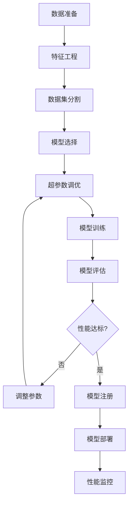
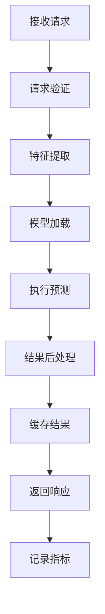

# 人工智能/机器学习 (AI/ML) - Rust架构指南

## 概述

人工智能和机器学习行业需要处理大规模数据、复杂模型训练、高性能推理和实时预测。Rust的内存安全、并发性能和与Python生态的互操作性使其成为AI/ML系统的理想选择。

## 核心挑战

- **数据处理**: 大规模数据ETL、特征工程、数据验证
- **模型训练**: 分布式训练、超参数优化、模型版本管理
- **推理服务**: 低延迟预测、模型部署、A/B测试
- **资源管理**: GPU/CPU资源调度、内存优化、成本控制
- **可扩展性**: 水平扩展、负载均衡、故障恢复
- **监控**: 模型性能监控、数据漂移检测、异常检测

## 技术栈选型

### 核心框架

```toml
[dependencies]
# 异步运行时
tokio = { version = "1.35", features = ["full"] }

# 机器学习框架
tch = "0.13"  # PyTorch绑定
burn = "0.12" # 纯Rust ML框架
candle = "0.3" # Hugging Face Rust实现

# 数据处理
polars = "0.35"
arrow = "50.0"
datafusion = "35.0"

# 数值计算
ndarray = "0.15"
nalgebra = "0.32"
rust-bert = "0.21"

# 序列化
serde = { version = "1.0", features = ["derive"] }
serde_json = "1.0"
bincode = "1.3"

# 数据库
sqlx = { version = "0.7", features = ["postgres", "runtime-tokio-rustls"] }
redis = { version = "0.24", features = ["tokio-comp"] }

# 消息队列
lapin = "2.3"
kafka = "0.9"

# 配置管理
config = "0.14"
toml = "0.8"

# 日志和监控
tracing = "0.1"
tracing-subscriber = "0.3"
prometheus = "0.13"
```

### 行业特定库

```toml
[dependencies]
# 特征工程
feather = "0.1"
feature-store = "0.1"

# 模型服务
mlflow = "0.1"
model-registry = "0.1"

# 分布式计算
rayon = "1.8"
crossbeam = "0.8"

# 可视化
plotters = "0.3"
```

## 架构模式

### 1. MLOps架构

```text
┌─────────────────────────────────────────────────────────────┐
│                    数据层 (Data Layer)                      │
│  ┌─────────────┐ ┌─────────────┐ ┌─────────────┐           │
│  │ 数据采集    │ │ 数据存储    │ │ 数据版本    │           │
│  └─────────────┘ └─────────────┘ └─────────────┘           │
└─────────────────────────────────────────────────────────────┘
┌─────────────────────────────────────────────────────────────┐
│                    特征层 (Feature Layer)                   │
│  ┌─────────────┐ ┌─────────────┐ ┌─────────────┐           │
│  │ 特征工程    │ │ 特征存储    │ │ 特征服务    │           │
│  └─────────────┘ └─────────────┘ └─────────────┘           │
└─────────────────────────────────────────────────────────────┘
┌─────────────────────────────────────────────────────────────┐
│                    模型层 (Model Layer)                     │
│  ┌─────────────┐ ┌─────────────┐ ┌─────────────┐           │
│  │ 模型训练    │ │ 模型评估    │ │ 模型部署    │           │
│  └─────────────┘ └─────────────┘ └─────────────┘           │
└─────────────────────────────────────────────────────────────┘
┌─────────────────────────────────────────────────────────────┐
│                    服务层 (Service Layer)                   │
│  ┌─────────────┐ ┌─────────────┐ ┌─────────────┐           │
│  │ 推理服务    │ │ 批处理      │ │ 实时流      │           │
│  └─────────────┘ └─────────────┘ └─────────────┘           │
└─────────────────────────────────────────────────────────────┘
┌─────────────────────────────────────────────────────────────┐
│                    监控层 (Monitoring Layer)                │
│  ┌─────────────┐ ┌─────────────┐ ┌─────────────┐           │
│  │ 性能监控    │ │ 数据漂移    │ │ 异常检测    │           │
│  └─────────────┘ └─────────────┘ └─────────────┘           │
└─────────────────────────────────────────────────────────────┘
```

### 2. 微服务架构

```rust
// 数据服务
pub struct DataService {
    data_ingestion: DataIngestionService,
    data_processing: DataProcessingService,
    data_storage: DataStorageService,
}

impl DataService {
    pub async fn ingest_data(&self, data: RawData) -> Result<DataId, DataError> {
        // 数据摄入
        let data_id = self.data_ingestion.ingest(data).await?;
        
        // 数据预处理
        self.data_processing.process(data_id).await?;
        
        // 数据存储
        self.data_storage.store(data_id).await?;
        
        Ok(data_id)
    }
}

// 特征服务
pub struct FeatureService {
    feature_engineering: FeatureEngineeringService,
    feature_store: FeatureStoreService,
    feature_serving: FeatureServingService,
}

impl FeatureService {
    pub async fn create_features(&self, data_id: DataId) -> Result<FeatureSet, FeatureError> {
        // 特征工程
        let features = self.feature_engineering.engineer(data_id).await?;
        
        // 特征存储
        let feature_set = self.feature_store.store(features).await?;
        
        Ok(feature_set)
    }
    
    pub async fn serve_features(&self, request: FeatureRequest) -> Result<FeatureVector, FeatureError> {
        self.feature_serving.serve(request).await
    }
}

// 模型服务
pub struct ModelService {
    model_training: ModelTrainingService,
    model_registry: ModelRegistryService,
    model_deployment: ModelDeploymentService,
}

impl ModelService {
    pub async fn train_model(&self, config: TrainingConfig) -> Result<ModelId, ModelError> {
        // 模型训练
        let model = self.model_training.train(config).await?;
        
        // 模型注册
        let model_id = self.model_registry.register(model).await?;
        
        Ok(model_id)
    }
    
    pub async fn deploy_model(&self, model_id: ModelId) -> Result<DeploymentId, ModelError> {
        self.model_deployment.deploy(model_id).await
    }
}

// 推理服务
pub struct InferenceService {
    model_loader: ModelLoader,
    prediction_engine: PredictionEngine,
    result_cache: ResultCache,
}

impl InferenceService {
    pub async fn predict(&self, request: PredictionRequest) -> Result<Prediction, InferenceError> {
        // 检查缓存
        if let Some(cached_result) = self.result_cache.get(&request).await {
            return Ok(cached_result);
        }
        
        // 加载模型
        let model = self.model_loader.load_model(&request.model_id).await?;
        
        // 执行预测
        let prediction = self.prediction_engine.predict(model, &request.features).await?;
        
        // 缓存结果
        self.result_cache.set(&request, &prediction).await;
        
        Ok(prediction)
    }
}
```

### 3. 事件驱动架构

```rust
// 事件定义
#[derive(Debug, Clone, Serialize, Deserialize)]
pub enum AIEvent {
    DataIngested(DataIngestedEvent),
    FeaturesCreated(FeaturesCreatedEvent),
    ModelTrained(ModelTrainedEvent),
    ModelDeployed(ModelDeployedEvent),
    PredictionMade(PredictionEvent),
    ModelPerformanceDegraded(PerformanceEvent),
}

// 事件处理器
pub trait EventHandler {
    async fn handle(&self, event: &AIEvent) -> Result<(), EventError>;
}

// 数据漂移检测器
pub struct DataDriftDetector;

#[async_trait]
impl EventHandler for DataDriftDetector {
    async fn handle(&self, event: &AIEvent) -> Result<(), EventError> {
        match event {
            AIEvent::PredictionMade(prediction_event) => {
                self.detect_drift(&prediction_event.features).await?;
            }
            _ => {}
        }
        Ok(())
    }
}

// 模型性能监控器
pub struct ModelPerformanceMonitor;

#[async_trait]
impl EventHandler for ModelPerformanceMonitor {
    async fn handle(&self, event: &AIEvent) -> Result<(), EventError> {
        match event {
            AIEvent::PredictionMade(prediction_event) => {
                self.update_metrics(prediction_event).await?;
            }
            _ => {}
        }
        Ok(())
    }
}
```

## 业务领域建模

### 核心领域概念

```rust
// 数据集
#[derive(Debug, Clone)]
pub struct Dataset {
    pub id: DatasetId,
    pub name: String,
    pub description: String,
    pub schema: DataSchema,
    pub version: String,
    pub created_at: DateTime<Utc>,
    pub updated_at: DateTime<Utc>,
}

// 特征集
#[derive(Debug, Clone)]
pub struct FeatureSet {
    pub id: FeatureSetId,
    pub name: String,
    pub features: Vec<Feature>,
    pub dataset_id: DatasetId,
    pub created_at: DateTime<Utc>,
}

// 特征
#[derive(Debug, Clone)]
pub struct Feature {
    pub id: FeatureId,
    pub name: String,
    pub feature_type: FeatureType,
    pub data_type: DataType,
    pub description: String,
    pub transformation: Option<Transformation>,
}

// 模型
#[derive(Debug, Clone)]
pub struct Model {
    pub id: ModelId,
    pub name: String,
    pub model_type: ModelType,
    pub algorithm: Algorithm,
    pub hyperparameters: Hyperparameters,
    pub feature_set_id: FeatureSetId,
    pub metrics: ModelMetrics,
    pub version: String,
    pub created_at: DateTime<Utc>,
}

// 预测请求
#[derive(Debug, Clone)]
pub struct PredictionRequest {
    pub id: RequestId,
    pub model_id: ModelId,
    pub features: FeatureVector,
    pub timestamp: DateTime<Utc>,
    pub metadata: HashMap<String, String>,
}

// 预测结果
#[derive(Debug, Clone)]
pub struct Prediction {
    pub id: PredictionId,
    pub request_id: RequestId,
    pub model_id: ModelId,
    pub prediction: PredictionValue,
    pub confidence: f64,
    pub timestamp: DateTime<Utc>,
    pub processing_time: Duration,
}
```

### 值对象

```rust
#[derive(Debug, Clone, PartialEq, Eq, Hash)]
pub struct DatasetId(String);

#[derive(Debug, Clone, PartialEq, Eq, Hash)]
pub struct FeatureSetId(String);

#[derive(Debug, Clone, PartialEq, Eq, Hash)]
pub struct FeatureId(String);

#[derive(Debug, Clone, PartialEq, Eq, Hash)]
pub struct ModelId(String);

#[derive(Debug, Clone, PartialEq, Eq, Hash)]
pub struct RequestId(String);

#[derive(Debug, Clone, PartialEq, Eq, Hash)]
pub struct PredictionId(String);

#[derive(Debug, Clone, PartialEq, Eq, Hash)]
pub struct PredictionValue {
    pub values: Vec<f64>,
    pub feature_names: Vec<String>,
}
```

## 数据建模

### 数据库设计

```sql
-- 数据集表
CREATE TABLE datasets (
    id VARCHAR(50) PRIMARY KEY,
    name VARCHAR(100) NOT NULL,
    description TEXT,
    schema JSON NOT NULL,
    version VARCHAR(20) NOT NULL,
    created_at TIMESTAMP WITH TIME ZONE NOT NULL,
    updated_at TIMESTAMP WITH TIME ZONE NOT NULL
);

-- 特征集表
CREATE TABLE feature_sets (
    id VARCHAR(50) PRIMARY KEY,
    name VARCHAR(100) NOT NULL,
    dataset_id VARCHAR(50) NOT NULL,
    created_at TIMESTAMP WITH TIME ZONE NOT NULL,
    FOREIGN KEY (dataset_id) REFERENCES datasets(id)
);

-- 特征表
CREATE TABLE features (
    id VARCHAR(50) PRIMARY KEY,
    name VARCHAR(100) NOT NULL,
    feature_type VARCHAR(50) NOT NULL,
    data_type VARCHAR(50) NOT NULL,
    description TEXT,
    transformation JSON,
    feature_set_id VARCHAR(50) NOT NULL,
    FOREIGN KEY (feature_set_id) REFERENCES feature_sets(id)
);

-- 模型表
CREATE TABLE models (
    id VARCHAR(50) PRIMARY KEY,
    name VARCHAR(100) NOT NULL,
    model_type VARCHAR(50) NOT NULL,
    algorithm VARCHAR(50) NOT NULL,
    hyperparameters JSON NOT NULL,
    feature_set_id VARCHAR(50) NOT NULL,
    metrics JSON NOT NULL,
    version VARCHAR(20) NOT NULL,
    created_at TIMESTAMP WITH TIME ZONE NOT NULL,
    FOREIGN KEY (feature_set_id) REFERENCES feature_sets(id)
);

-- 预测请求表
CREATE TABLE prediction_requests (
    id VARCHAR(50) PRIMARY KEY,
    model_id VARCHAR(50) NOT NULL,
    features JSON NOT NULL,
    timestamp TIMESTAMP WITH TIME ZONE NOT NULL,
    metadata JSON,
    FOREIGN KEY (model_id) REFERENCES models(id)
);

-- 预测结果表
CREATE TABLE predictions (
    id VARCHAR(50) PRIMARY KEY,
    request_id VARCHAR(50) NOT NULL,
    model_id VARCHAR(50) NOT NULL,
    prediction JSON NOT NULL,
    confidence DECIMAL(5,4),
    timestamp TIMESTAMP WITH TIME ZONE NOT NULL,
    processing_time_ms INTEGER NOT NULL,
    FOREIGN KEY (request_id) REFERENCES prediction_requests(id),
    FOREIGN KEY (model_id) REFERENCES models(id)
);
```

### 特征存储

```rust
// 特征存储接口
pub trait FeatureStore {
    async fn store_features(&self, features: FeatureSet) -> Result<FeatureSetId, FeatureError>;
    async fn get_features(&self, feature_set_id: &FeatureSetId) -> Result<FeatureSet, FeatureError>;
    async fn serve_features(&self, request: FeatureRequest) -> Result<FeatureVector, FeatureError>;
    async fn update_features(&self, feature_set_id: &FeatureSetId, features: FeatureSet) -> Result<(), FeatureError>;
}

// Redis特征存储实现
pub struct RedisFeatureStore {
    client: redis::Client,
    connection: redis::Connection,
}

#[async_trait]
impl FeatureStore for RedisFeatureStore {
    async fn store_features(&self, features: FeatureSet) -> Result<FeatureSetId, FeatureSetId> {
        let feature_set_id = FeatureSetId::generate();
        let key = format!("features:{}", feature_set_id);
        
        let serialized = serde_json::to_string(&features)?;
        redis::cmd("SET").arg(&key).arg(serialized).execute(&mut self.connection);
        
        Ok(feature_set_id)
    }
    
    async fn get_features(&self, feature_set_id: &FeatureSetId) -> Result<FeatureSet, FeatureError> {
        let key = format!("features:{}", feature_set_id);
        let serialized: String = redis::cmd("GET").arg(&key).query(&mut self.connection)?;
        
        let features: FeatureSet = serde_json::from_str(&serialized)?;
        Ok(features)
    }
    
    async fn serve_features(&self, request: FeatureRequest) -> Result<FeatureVector, FeatureError> {
        // 从特征存储中获取特征向量
        let mut feature_vector = FeatureVector {
            values: Vec::new(),
            feature_names: Vec::new(),
        };
        
        for feature_name in &request.feature_names {
            let key = format!("feature:{}:{}", request.entity_id, feature_name);
            if let Ok(value) = redis::cmd("GET").arg(&key).query::<f64>(&mut self.connection) {
                feature_vector.values.push(value);
                feature_vector.feature_names.push(feature_name.clone());
            }
        }
        
        Ok(feature_vector)
    }
}
```

## 流程建模

### 模型训练流程



### 推理服务流程



## 组件建模

### 数据处理管道

```rust
pub struct DataPipeline {
    stages: Vec<Box<dyn PipelineStage>>,
    data_validation: DataValidator,
    data_transformation: DataTransformation,
}

impl DataPipeline {
    pub async fn process(&self, raw_data: RawData) -> Result<ProcessedData, PipelineError> {
        let mut data = raw_data;
        
        // 执行管道阶段
        for stage in &self.stages {
            data = stage.process(data).await?;
        }
        
        // 数据验证
        self.data_validation.validate(&data).await?;
        
        // 数据转换
        let processed_data = self.data_transformation.transform(data).await?;
        
        Ok(processed_data)
    }
}

// 管道阶段
pub trait PipelineStage {
    async fn process(&self, data: RawData) -> Result<RawData, PipelineError>;
}

// 数据清洗阶段
pub struct DataCleaningStage;

#[async_trait]
impl PipelineStage for DataCleaningStage {
    async fn process(&self, data: RawData) -> Result<RawData, PipelineError> {
        // 数据清洗逻辑
        // - 处理缺失值
        // - 移除异常值
        // - 标准化数据
        Ok(data)
    }
}

// 特征工程阶段
pub struct FeatureEngineeringStage {
    feature_extractors: Vec<Box<dyn FeatureExtractor>>,
}

#[async_trait]
impl PipelineStage for FeatureEngineeringStage {
    async fn process(&self, data: RawData) -> Result<RawData, PipelineError> {
        let mut features = Vec::new();
        
        for extractor in &self.feature_extractors {
            let extracted_features = extractor.extract(&data).await?;
            features.extend(extracted_features);
        }
        
        // 将特征添加到数据中
        let mut enriched_data = data;
        enriched_data.features = features;
        
        Ok(enriched_data)
    }
}
```

### 模型训练引擎

```rust
pub struct ModelTrainingEngine {
    model_factory: ModelFactory,
    hyperparameter_optimizer: HyperparameterOptimizer,
    cross_validator: CrossValidator,
    model_evaluator: ModelEvaluator,
}

impl ModelTrainingEngine {
    pub async fn train(&self, config: TrainingConfig) -> Result<TrainedModel, TrainingError> {
        // 1. 超参数优化
        let best_hyperparameters = self.hyperparameter_optimizer.optimize(&config).await?;
        
        // 2. 交叉验证
        let cv_scores = self.cross_validator.validate(&config, &best_hyperparameters).await?;
        
        // 3. 最终训练
        let model = self.model_factory.create_model(&config.algorithm, &best_hyperparameters)?;
        let trained_model = self.train_model(model, &config.training_data).await?;
        
        // 4. 模型评估
        let metrics = self.model_evaluator.evaluate(&trained_model, &config.test_data).await?;
        
        Ok(TrainedModel {
            model: trained_model,
            hyperparameters: best_hyperparameters,
            metrics,
            cv_scores,
        })
    }
    
    async fn train_model(&self, mut model: Box<dyn Model>, data: &TrainingData) -> Result<Box<dyn Model>, TrainingError> {
        // 模型训练逻辑
        for epoch in 0..data.epochs {
            let loss = model.train_epoch(&data.features, &data.labels).await?;
            
            if epoch % 10 == 0 {
                println!("Epoch {}, Loss: {}", epoch, loss);
            }
        }
        
        Ok(model)
    }
}

// 模型接口
pub trait Model {
    async fn train_epoch(&mut self, features: &FeatureMatrix, labels: &LabelVector) -> Result<f64, TrainingError>;
    async fn predict(&self, features: &FeatureVector) -> Result<PredictionValue, PredictionError>;
    async fn save(&self, path: &str) -> Result<(), ModelError>;
    async fn load(path: &str) -> Result<Self, ModelError> where Self: Sized;
}

// 线性回归模型
pub struct LinearRegression {
    weights: Vec<f64>,
    bias: f64,
    learning_rate: f64,
}

#[async_trait]
impl Model for LinearRegression {
    async fn train_epoch(&mut self, features: &FeatureMatrix, labels: &LabelVector) -> Result<f64, TrainingError> {
        let mut total_loss = 0.0;
        
        for (feature_row, label) in features.iter().zip(labels.iter()) {
            let prediction = self.predict_single(feature_row);
            let error = label - prediction;
            
            // 梯度下降
            for (weight, feature) in self.weights.iter_mut().zip(feature_row.iter()) {
                *weight += self.learning_rate * error * feature;
            }
            self.bias += self.learning_rate * error;
            
            total_loss += error * error;
        }
        
        Ok(total_loss / labels.len() as f64)
    }
    
    async fn predict(&self, features: &FeatureVector) -> Result<PredictionValue, PredictionError> {
        let prediction = self.predict_single(&features.values);
        Ok(PredictionValue::Regression(prediction))
    }
    
    async fn save(&self, path: &str) -> Result<(), ModelError> {
        let model_data = ModelData {
            weights: self.weights.clone(),
            bias: self.bias,
            learning_rate: self.learning_rate,
        };
        
        let serialized = serde_json::to_string(&model_data)?;
        std::fs::write(path, serialized)?;
        
        Ok(())
    }
    
    async fn load(path: &str) -> Result<Self, ModelError> {
        let serialized = std::fs::read_to_string(path)?;
        let model_data: ModelData = serde_json::from_str(&serialized)?;
        
        Ok(Self {
            weights: model_data.weights,
            bias: model_data.bias,
            learning_rate: model_data.learning_rate,
        })
    }
}

impl LinearRegression {
    fn predict_single(&self, features: &[f64]) -> f64 {
        let mut prediction = self.bias;
        for (weight, feature) in self.weights.iter().zip(features.iter()) {
            prediction += weight * feature;
        }
        prediction
    }
}
```

### 推理引擎

```rust
pub struct InferenceEngine {
    model_loader: ModelLoader,
    feature_processor: FeatureProcessor,
    prediction_cache: PredictionCache,
    performance_monitor: PerformanceMonitor,
}

impl InferenceEngine {
    pub async fn predict(&self, request: PredictionRequest) -> Result<Prediction, InferenceError> {
        let start_time = Instant::now();
        
        // 1. 检查缓存
        if let Some(cached_prediction) = self.prediction_cache.get(&request).await {
            return Ok(cached_prediction);
        }
        
        // 2. 加载模型
        let model = self.model_loader.load_model(&request.model_id).await?;
        
        // 3. 特征预处理
        let processed_features = self.feature_processor.process(&request.features).await?;
        
        // 4. 执行预测
        let prediction_value = model.predict(&processed_features).await?;
        
        // 5. 后处理
        let prediction = self.post_process(prediction_value, &request).await?;
        
        // 6. 缓存结果
        self.prediction_cache.set(&request, &prediction).await;
        
        // 7. 记录性能指标
        let processing_time = start_time.elapsed();
        self.performance_monitor.record_metrics(&request, &prediction, processing_time).await;
        
        Ok(prediction)
    }
    
    async fn post_process(&self, prediction_value: PredictionValue, request: &PredictionRequest) -> Result<Prediction, InferenceError> {
        let prediction = Prediction {
            id: PredictionId::generate(),
            request_id: request.id.clone(),
            model_id: request.model_id.clone(),
            prediction: prediction_value,
            confidence: self.calculate_confidence(&prediction_value),
            timestamp: Utc::now(),
            processing_time: Duration::from_millis(0), // 将在外部设置
        };
        
        Ok(prediction)
    }
    
    fn calculate_confidence(&self, prediction: &PredictionValue) -> f64 {
        match prediction {
            PredictionValue::Classification(_) => 0.95, // 示例值
            PredictionValue::Regression(_) => 0.90,
            PredictionValue::Probability(probs) => probs.iter().max().unwrap_or(&0.0),
        }
    }
}

// 模型加载器
pub struct ModelLoader {
    model_registry: ModelRegistry,
    model_cache: ModelCache,
}

impl ModelLoader {
    pub async fn load_model(&self, model_id: &ModelId) -> Result<Box<dyn Model>, ModelError> {
        // 1. 检查缓存
        if let Some(cached_model) = self.model_cache.get(model_id).await {
            return Ok(cached_model);
        }
        
        // 2. 从注册表加载
        let model_path = self.model_registry.get_model_path(model_id).await?;
        let model = self.load_model_from_path(&model_path).await?;
        
        // 3. 缓存模型
        self.model_cache.set(model_id, model.clone()).await;
        
        Ok(model)
    }
    
    async fn load_model_from_path(&self, path: &str) -> Result<Box<dyn Model>, ModelError> {
        // 根据文件扩展名决定加载方式
        if path.ends_with(".pt") {
            self.load_pytorch_model(path).await
        } else if path.ends_with(".json") {
            self.load_rust_model(path).await
        } else {
            Err(ModelError::UnsupportedFormat)
        }
    }
}
```

## 性能优化

### 批处理推理

```rust
pub struct BatchInferenceEngine {
    batch_size: usize,
    batch_timeout: Duration,
    current_batch: Vec<PredictionRequest>,
    last_flush: Instant,
    inference_engine: InferenceEngine,
}

impl BatchInferenceEngine {
    pub fn new(batch_size: usize, batch_timeout: Duration, inference_engine: InferenceEngine) -> Self {
        Self {
            batch_size,
            batch_timeout,
            current_batch: Vec::new(),
            last_flush: Instant::now(),
            inference_engine,
        }
    }
    
    pub async fn add_request(&mut self, request: PredictionRequest) -> Result<Option<Vec<Prediction>>, InferenceError> {
        self.current_batch.push(request);
        
        // 检查是否需要处理批次
        if self.current_batch.len() >= self.batch_size || 
           self.last_flush.elapsed() >= self.batch_timeout {
            let batch = std::mem::take(&mut self.current_batch);
            self.last_flush = Instant::now();
            
            let predictions = self.process_batch(batch).await?;
            Ok(Some(predictions))
        } else {
            Ok(None)
        }
    }
    
    async fn process_batch(&self, requests: Vec<PredictionRequest>) -> Result<Vec<Prediction>, InferenceError> {
        let mut predictions = Vec::new();
        
        // 并行处理请求
        let tasks: Vec<_> = requests
            .into_iter()
            .map(|request| {
                let engine = &self.inference_engine;
                tokio::spawn(async move { engine.predict(request).await })
            })
            .collect();
        
        for task in tasks {
            let prediction = task.await??;
            predictions.push(prediction);
        }
        
        Ok(predictions)
    }
}
```

### 模型缓存

```rust
pub struct ModelCache {
    cache: moka::future::Cache<ModelId, Box<dyn Model>>,
    max_size: usize,
}

impl ModelCache {
    pub fn new(max_size: usize) -> Self {
        let cache = moka::future::Cache::builder()
            .max_capacity(max_size as u64)
            .build();
        
        Self { cache, max_size }
    }
    
    pub async fn get(&self, model_id: &ModelId) -> Option<Box<dyn Model>> {
        self.cache.get(model_id).await
    }
    
    pub async fn set(&self, model_id: &ModelId, model: Box<dyn Model>) {
        self.cache.insert(model_id.clone(), model).await;
    }
    
    pub async fn evict(&self, model_id: &ModelId) {
        self.cache.invalidate(model_id).await;
    }
}
```

## 监控和可观测性

### 性能监控

```rust
pub struct PerformanceMonitor {
    metrics: Arc<MetricsCollector>,
}

impl PerformanceMonitor {
    pub async fn record_metrics(&self, request: &PredictionRequest, prediction: &Prediction, processing_time: Duration) {
        // 记录延迟指标
        self.metrics.record_histogram(
            "prediction_latency_seconds",
            processing_time.as_secs_f64(),
            &[("model_id", &request.model_id.to_string())],
        );
        
        // 记录吞吐量指标
        self.metrics.increment_counter(
            "predictions_total",
            &[("model_id", &request.model_id.to_string())],
        );
        
        // 记录错误率
        if prediction.confidence < 0.5 {
            self.metrics.increment_counter(
                "prediction_errors_total",
                &[("model_id", &request.model_id.to_string())],
            );
        }
    }
}

// 数据漂移检测
pub struct DataDriftDetector {
    reference_distribution: HashMap<String, Distribution>,
    drift_threshold: f64,
}

impl DataDriftDetector {
    pub async fn detect_drift(&self, current_features: &FeatureVector) -> Result<DriftReport, DriftError> {
        let mut drift_report = DriftReport::new();
        
        for (feature_name, value) in current_features.feature_names.iter().zip(current_features.values.iter()) {
            if let Some(reference_dist) = self.reference_distribution.get(feature_name) {
                let drift_score = self.calculate_drift_score(value, reference_dist);
                
                if drift_score > self.drift_threshold {
                    drift_report.add_drift(feature_name, drift_score);
                }
            }
        }
        
        Ok(drift_report)
    }
    
    fn calculate_drift_score(&self, value: &f64, distribution: &Distribution) -> f64 {
        // 计算KL散度或其他统计距离
        // 实现细节...
        0.1
    }
}
```

## 测试策略

### 单元测试

```rust
#[cfg(test)]
mod tests {
    use super::*;
    
    #[tokio::test]
    async fn test_model_training() {
        let training_engine = create_test_training_engine().await;
        
        let config = TrainingConfig {
            algorithm: Algorithm::LinearRegression,
            hyperparameters: Hyperparameters::default(),
            training_data: create_test_training_data(),
            test_data: create_test_test_data(),
            epochs: 100,
        };
        
        let trained_model = training_engine.train(config).await.unwrap();
        
        assert!(trained_model.metrics.accuracy > 0.8);
        assert!(trained_model.metrics.loss < 0.1);
    }
    
    #[tokio::test]
    async fn test_inference() {
        let inference_engine = create_test_inference_engine().await;
        
        let request = PredictionRequest {
            id: RequestId::generate(),
            model_id: ModelId::new("test-model"),
            features: FeatureVector {
                values: vec![1.0, 2.0, 3.0],
                feature_names: vec!["feature1".to_string(), "feature2".to_string(), "feature3".to_string()],
            },
            timestamp: Utc::now(),
            metadata: HashMap::new(),
        };
        
        let prediction = inference_engine.predict(request).await.unwrap();
        
        assert!(prediction.confidence > 0.0);
        assert!(prediction.processing_time.as_millis() < 100);
    }
}
```

### 集成测试

```rust
#[cfg(test)]
mod integration_tests {
    use super::*;
    
    #[tokio::test]
    async fn test_end_to_end_ml_pipeline() {
        // 设置测试环境
        let data_service = create_test_data_service().await;
        let feature_service = create_test_feature_service().await;
        let model_service = create_test_model_service().await;
        let inference_service = create_test_inference_service().await;
        
        // 1. 数据摄入
        let data_id = data_service.ingest_data(create_test_raw_data()).await.unwrap();
        
        // 2. 特征工程
        let feature_set = feature_service.create_features(data_id).await.unwrap();
        
        // 3. 模型训练
        let training_config = TrainingConfig {
            algorithm: Algorithm::LinearRegression,
            feature_set_id: feature_set.id,
            // ... 其他配置
        };
        let model_id = model_service.train_model(training_config).await.unwrap();
        
        // 4. 模型部署
        let deployment_id = model_service.deploy_model(model_id).await.unwrap();
        
        // 5. 推理测试
        let request = create_test_prediction_request();
        let prediction = inference_service.predict(request).await.unwrap();
        
        assert!(prediction.confidence > 0.0);
    }
}
```

## 部署和运维

### 容器化部署

```dockerfile
# Dockerfile for ML Inference Service
FROM rust:1.75 as builder
WORKDIR /app
COPY . .
RUN cargo build --release

FROM debian:bullseye-slim
RUN apt-get update && apt-get install -y \
    ca-certificates \
    libssl-dev \
    && rm -rf /var/lib/apt/lists/*
    
WORKDIR /app
COPY --from=builder /app/target/release/ml-inference-service .
COPY models/ models/
COPY config/ config/

EXPOSE 8080
CMD ["./ml-inference-service"]
```

### Kubernetes部署

```yaml
# ml-inference-deployment.yaml
apiVersion: apps/v1
kind: Deployment
metadata:
  name: ml-inference-service
spec:
  replicas: 3
  selector:
    matchLabels:
      app: ml-inference-service
  template:
    metadata:
      labels:
        app: ml-inference-service
    spec:
      containers:
      - name: ml-inference
        image: ml-inference-service:latest
        ports:
        - containerPort: 8080
        env:
        - name: MODEL_REGISTRY_URL
          value: "http://model-registry:8080"
        - name: FEATURE_STORE_URL
          value: "redis://feature-store:6379"
        resources:
          requests:
            memory: "512Mi"
            cpu: "250m"
          limits:
            memory: "1Gi"
            cpu: "500m"
        livenessProbe:
          httpGet:
            path: /health
            port: 8080
          initialDelaySeconds: 30
          periodSeconds: 10
        readinessProbe:
          httpGet:
            path: /ready
            port: 8080
          initialDelaySeconds: 5
          periodSeconds: 5
```

## 总结

人工智能/机器学习行业的Rust架构需要特别关注：

1. **数据处理**: 高效的数据管道、特征工程、数据验证
2. **模型管理**: 模型训练、版本控制、部署管理
3. **推理服务**: 低延迟预测、批处理、缓存策略
4. **性能优化**: GPU加速、并行处理、内存管理
5. **监控**: 模型性能、数据漂移、异常检测

通过遵循这些设计原则和最佳实践，可以构建出高性能、可扩展的AI/ML系统。
