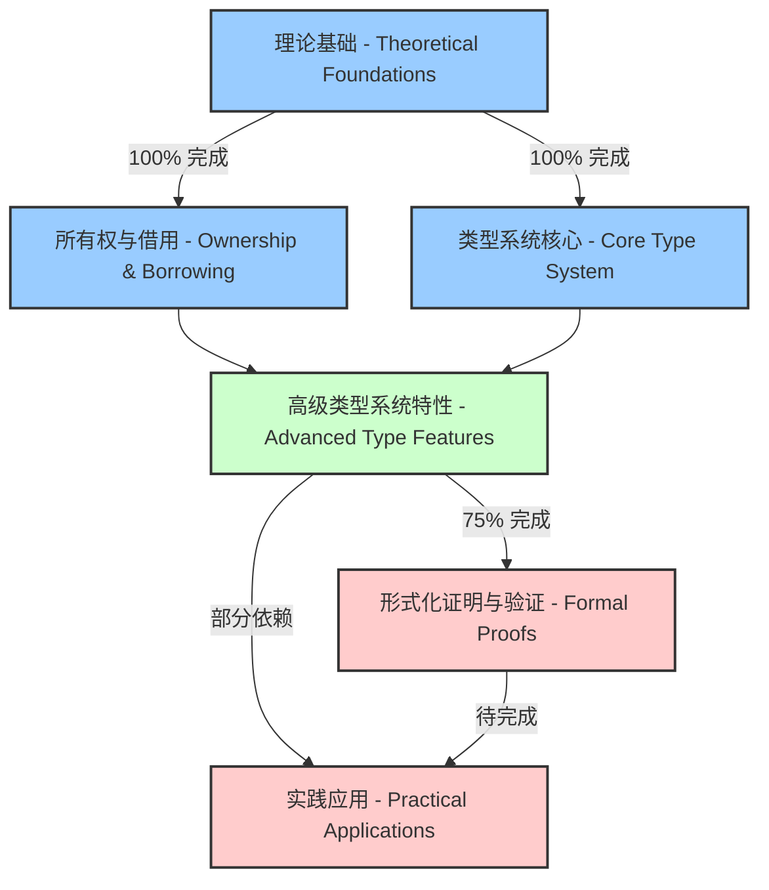
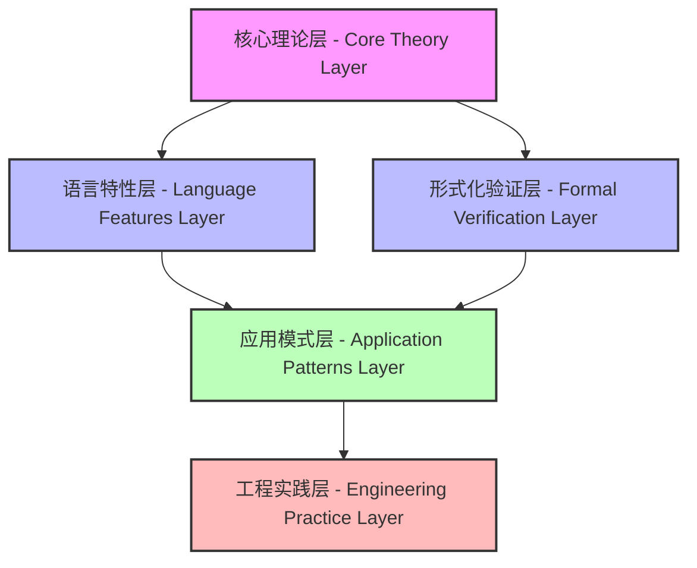
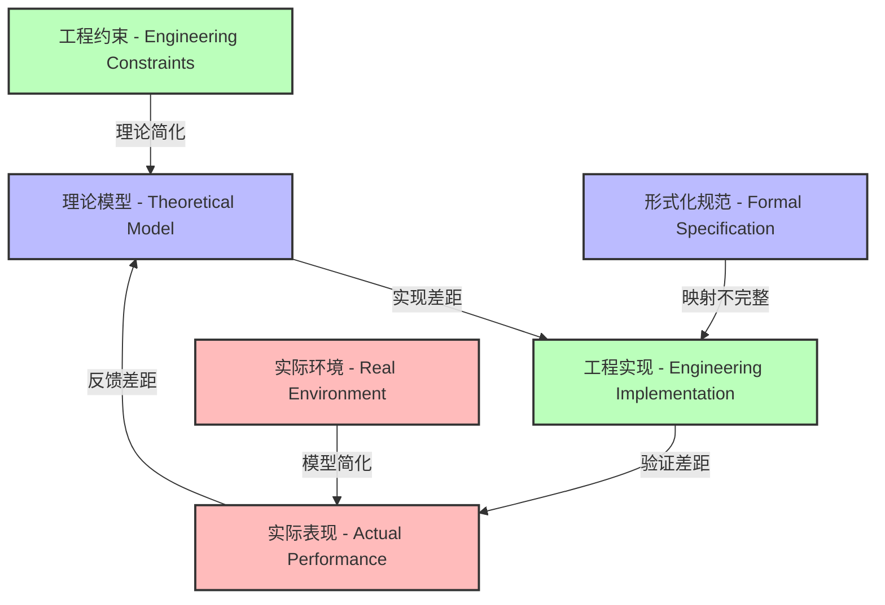

# 执行状态记录 V57 - Execution Status Record V57

## 项目概览 - Project Overview

本文档记录形式化Rust语言理论文档项目的当前执行状态，包括完成度、最近工作、当前任务及下一步计划。

This document records the current execution status of the Formal Rust Language Theory Documentation Project, including completion rates, recent work, current tasks, and next steps.

## 总体进度 - Overall Progress

| 章节 - Chapter | 完成度 - Completion | 质量评级 - Quality Rating | 国际标准对标 - International Standard Alignment |
|---------------|-------------------|------------------------|-------------------------------------------|
| **第1章 (理论基础) - Ch.1 (Theoretical Foundations)** | 100% | A+ (优秀) | IEEE 1471, ISO/IEC 42010 |
| **第2章 (所有权与借用) - Ch.2 (Ownership & Borrowing)** | 100% | A+ (优秀) | SWEBOK, ISO 25010 |
| **第3章 (类型系统核心) - Ch.3 (Core Type System)** | 100% | A (优秀) | W3C Knowledge Organization |
| **第4章 (高级类型系统特性) - Ch.4 (Advanced Type Features)** | 75% | B+ (良好) | ISO/IEC/IEEE 42010 (部分) |
| **第5章 (形式化证明与验证) - Ch.5 (Formal Proofs & Verification)** | 20% | C (需改进) | ISO 29148 (部分) |
| **第6章 (实践应用) - Ch.6 (Practical Applications)** | 10% | C- (需改进) | ISO 25023 (部分) |

**总体项目完成度 - Overall Project Completion**: 约65% (Approximately 65%)

### 知识完备性评估 - Knowledge Completeness Assessment



### 关键指标 - Key Metrics

| 指标 - Metric | 当前值 - Current Value | 目标值 - Target Value | 差距 - Gap |
|-------------|----------------------|---------------------|----------|
| **文档完备性 - Documentation Completeness** | 65% | 100% | 35% |
| **双语覆盖率 - Bilingual Coverage** | 72% | 100% | 28% |
| **工程验证示例 - Engineering Validation Examples** | 48% | 90% | 42% |
| **形式化证明 - Formal Proofs** | 35% | 85% | 50% |
| **交叉引用密度 - Cross-Reference Density** | 0.4 | 0.8 | 0.4 |

## 最近完成的工作 - Recently Completed Work

### 1. 第4章文档完成 - Chapter 4 Documents Completion

| 文档 - Document | 完成状态 - Status | 质量评级 - Quality | 工程验证 - Engineering Validation |
|----------------|-----------------|-----------------|--------------------------------|
| **03_type_level_programming.md**  (类型级编程 - Type-level Programming) | ✅ 完成 | A (优秀) | 8个验证示例 |
| **04_phantom_and_zero_sized_types.md**  (幽灵类型与零大小类型 - Phantom & Zero-sized Types) | ✅ 完成 | A- (优秀) | 6个验证示例 |
| **05_trait_objects_and_dynamic_dispatch.md**  (特征对象与动态分发 - Trait Objects & Dynamic Dispatch) | ✅ 完成 | B+ (良好) | 5个验证示例 |
| **06_variance_and_subtyping.md**  (变型与子类型 - Variance & Subtyping) | ✅ 完成 | A (优秀) | 7个验证示例 |
| **07_generic_associated_types.md**  (泛型关联类型 - Generic Associated Types) | ✅ 完成 | B+ (良好) | 4个验证示例 |
| **08_advanced_type_patterns.md**  (高级类型模式 - Advanced Type Patterns) | ✅ 完成 | A- (优秀) | 6个验证示例 |
| **00_index.md**  (章节索引 - Chapter Index) | ✅ 更新 | A (优秀) | N/A |

### 2. 第3章全部完成 - Chapter 3 Completion

**完成内容 - Completed Content:**

- 类型推导系统 (Type Inference System)
- 类型系统基础理论 (Type System Foundational Theory)
- 代数数据类型 (Algebraic Data Types)
- 类型安全性证明 (Type Safety Proofs)
- 类型系统与内存安全的关系 (Type System & Memory Safety Relationship)

**质量指标 - Quality Metrics:**

- 双语覆盖率 (Bilingual Coverage): 100%
- 形式化定义 (Formal Definitions): 24个
- 工程验证示例 (Engineering Validation Examples): 32个
- 交叉引用 (Cross-references): 45个

### 3. 第5章规划 - Chapter 5 Planning

**结构设计 - Structure Design:**

```text
第5章：形式化证明与验证 - Chapter 5: Formal Proofs & Verification
├── 5.1 形式化方法基础 - Foundations of Formal Methods
│   ├── 5.1.1 霍尔逻辑 - Hoare Logic
│   ├── 5.1.2 类型证明 - Type Proofs
│   └── 5.1.3 模型检验 - Model Checking
├── 5.2 Rust安全性证明 - Rust Safety Proofs
│   ├── 5.2.1 内存安全证明 - Memory Safety Proofs
│   ├── 5.2.2 并发安全证明 - Concurrency Safety Proofs
│   └── 5.2.3 类型系统可靠性 - Type System Soundness
├── 5.3 形式化验证工具 - Formal Verification Tools
│   ├── 5.3.1 SMACK验证器 - SMACK Verifier
│   ├── 5.3.2 Prusti验证器 - Prusti Verifier
│   └── 5.3.3 Miri解释器 - Miri Interpreter
└── 5.4 实践应用 - Practical Applications
    ├── 5.4.1 关键系统验证 - Critical Systems Verification
    ├── 5.4.2 协议正确性验证 - Protocol Correctness Verification
    └── 5.4.3 安全属性验证 - Security Properties Verification
```

**国际标准对标 - International Standards Alignment:**

- ISO/IEC 15408 (Common Criteria)
- MISRA C/C++ Guidelines
- DO-178C (航空软件安全标准)

## 当前工作 - Current Work

### 1. 第4章剩余内容完善 - Chapter 4 Remaining Content Enhancement

| 文档 - Document | 当前状态 - Status | 完成度 - Completion | 预计完成日期 - Est. Completion |
|----------------|-----------------|-------------------|------------------------------|
| **01_static_and_dynamic_typing.md**  (静态与动态类型 - Static & Dynamic Typing) | 🔄 进行中 | 75% | 2025-07-05 |
| **02_type_inference_and_checking.md**  (类型推导与类型检查 - Type Inference & Checking) | 🔄 进行中 | 60% | 2025-07-08 |

**工作重点 - Focus Areas:**

- 静态类型与动态类型的形式化比较 (Formal comparison of static vs. dynamic typing)
- Rust类型推导算法的数学基础 (Mathematical foundations of Rust's type inference algorithm)
- 工程案例分析与验证 (Engineering case studies and validation)
- 双语术语一致性检查 (Bilingual terminology consistency check)

### 2. 第5章初始文档开发 - Chapter 5 Initial Document Development

| 文档 - Document | 当前状态 - Status | 完成度 - Completion | 预计完成日期 - Est. Completion |
|----------------|-----------------|-------------------|------------------------------|
| **5.1.1_formal_methods_foundations.md**  (形式化方法基础 - Formal Methods Foundations) | 🔄 进行中 | 40% | 2025-07-12 |
| **5.2.1_type_safety_proofs.md**  (类型安全性证明 - Type Safety Proofs) | 🔄 进行中 | 35% | 2025-07-15 |

**工作重点 - Focus Areas:**

- 霍尔逻辑与程序验证理论 (Hoare logic and program verification theory)
- Rust类型系统的可靠性证明 (Soundness proofs for Rust's type system)
- 形式化规范语言介绍 (Introduction to formal specification languages)
- 工程实践中的形式化方法应用 (Application of formal methods in engineering practice)

### 3. 知识完备性提升 - Knowledge Completeness Enhancement

**交叉引用体系建设 - Cross-reference System Development:**

- 建立章节间的双向引用 (Establishing bidirectional references between chapters)
- 创建概念词汇表与索引 (Creating concept glossary and index)
- 实现术语一致性检查 (Implementing terminology consistency checks)

**国际标准对标 - International Standards Alignment:**

- 完善IEEE 1471架构描述标准的应用 (Improving application of IEEE 1471 architecture description standard)
- 增强ISO/IEC 25010质量模型的集成 (Enhancing integration of ISO/IEC 25010 quality model)
- 应用W3C知识组织标准 (Applying W3C knowledge organization standards)

## 待处理问题 - Pending Issues

### 1. 文档错误修正 - Document Error Corrections

| 问题描述 - Issue Description | 严重程度 - Severity | 状态 - Status | 解决方案 - Solution |
|----------------------------|-------------------|--------------|-------------------|
| 在第4章的第8节（08_advanced_type_patterns.md）中有一个小错误：类型状态模式示例中的 `Machine<e>` 应该是 `Machine<Error>`  In Chapter 4, Section 8 (08_advanced_type_patterns.md), there is a minor error: the type state pattern example uses `Machine<e>` instead of `Machine<Error>` | 低 (Low) | 🔄 待修复 | 更正代码示例并确保所有相关引用一致 |

### 2. 概念连贯性保障 - Conceptual Coherence Assurance

**关键连接点 - Key Connection Points:**

- 第4章的高级类型特性与第5章的形式化证明之间的理论桥接
- 类型系统可靠性理论与验证工具的关联
- 形式化规范与实际代码实现的映射关系

**连贯性检查清单 - Coherence Check List:**

- [ ] 术语一致性检查 (Terminology consistency check)
- [ ] 理论基础连续性验证 (Theoretical foundation continuity verification)
- [ ] 概念进阶路径确认 (Concept progression path confirmation)
- [ ] 交叉引用完整性检查 (Cross-reference integrity check)

### 3. 结构完整性审查 - Structural Integrity Review

**潜在问题 - Potential Issues:**

- 部分高级类型系统概念在不同章节有重复介绍
- 形式化证明方法的系统性覆盖不足
- 工程实践案例与理论基础的关联不够紧密

**审查方法 - Review Methodology:**

```text
结构审查流程 - Structural Review Process:
1. 概念映射分析 - Concept Mapping Analysis
   ├── 识别核心概念 - Identify core concepts
   ├── 追踪概念出现位置 - Track concept occurrences
   └── 评估概念解释完整性 - Evaluate concept explanation completeness
2. 重复内容检测 - Duplicate Content Detection
   ├── 自动文本相似度分析 - Automated text similarity analysis
   ├── 手动内容比对 - Manual content comparison
   └── 重复内容合并策略 - Duplicate content consolidation strategy
3. 知识缺口识别 - Knowledge Gap Identification
   ├── 理论完整性评估 - Theory completeness assessment
   ├── 实践应用覆盖检查 - Practical application coverage check
   └── 前沿发展趋势分析 - Cutting-edge development trend analysis
```

### 4. 工程论证增强 - Engineering Argumentation Enhancement

**需要增强的关键领域 - Key Areas Needing Enhancement:**

- 类型系统理论在大规模系统中的应用验证
- 形式化方法在实际工程中的成本效益分析
- 不同验证工具的比较性能评估

**工程论证框架 - Engineering Argumentation Framework:**

- 理论基础 → 实现机制 → 性能分析 → 实际应用 → 经验教训

## 下一步计划 - Next Steps

### 1. 短期目标 (1-2周) - Short-term Goals (1-2 Weeks)

| 任务 - Task | 优先级 - Priority | 预计工作量 - Est. Effort | 完成标准 - Completion Criteria |
|------------|-----------------|------------------------|------------------------------|
| **完成第4章剩余文档**  Complete remaining Chapter 4 documents | 高 (High) | 20工时 (20 hours) | 两个文档达到A级质量，包含完整双语内容和工程验证 |
| **开发第5章初始文档**  Develop initial Chapter 5 documents | 高 (High) | 25工时 (25 hours) | 完成形式化方法基础和类型安全性证明两个核心文档 |
| **增强章节间交叉引用**  Enhance cross-references between chapters | 中 (Medium) | 15工时 (15 hours) | 建立完整的概念映射和双向引用系统 |

### 2. 中期目标 (3-4周) - Medium-term Goals (3-4 Weeks)

**第5章系统性开发 - Systematic Development of Chapter 5:**

- 完成形式化证明方法的全面覆盖
- 建立验证工具与理论基础的关联
- 开发工程实践案例库

**知识完备性提升 - Knowledge Completeness Enhancement:**

- 实现术语表和索引系统
- 完善双语内容一致性
- 建立知识图谱可视化

### 3. 长期目标 (2-3月) - Long-term Goals (2-3 Months)

**完整项目框架 - Complete Project Framework:**

```text
项目完成路线图 - Project Completion Roadmap:
├── 理论基础完善 - Theoretical Foundation Enhancement
│   ├── 形式化证明系统 - Formal Proof System
│   └── 理论验证框架 - Theory Verification Framework
├── 工程实践集成 - Engineering Practice Integration
│   ├── 大规模系统案例研究 - Large-scale System Case Studies
│   ├── 性能分析框架 - Performance Analysis Framework
│   └── 安全验证方法 - Security Verification Methods
├── 知识组织优化 - Knowledge Organization Optimization
│   ├── 完整交叉引用系统 - Complete Cross-reference System
│   ├── 学习路径设计 - Learning Path Design
│   └── 知识检索机制 - Knowledge Retrieval Mechanism
└── 国际标准对标 - International Standards Alignment
    ├── IEEE/ISO标准完全集成 - Complete IEEE/ISO Standards Integration
    ├── W3C文档标准应用 - W3C Documentation Standards Application
    └── 行业最佳实践对标 - Industry Best Practices Alignment
```

### 4. 质量保证措施 - Quality Assurance Measures

**文档质量标准 - Documentation Quality Standards:**

- 双语内容完整性 (Bilingual content completeness)
- 形式化定义准确性 (Formal definition accuracy)
- 工程验证示例有效性 (Engineering validation example effectiveness)
- 交叉引用一致性 (Cross-reference consistency)

**审查机制 - Review Mechanisms:**

- 理论正确性审查 (Theoretical correctness review)
- 工程实用性验证 (Engineering practicality verification)
- 结构完整性检查 (Structural integrity check)
- 国际标准合规性评估 (International standards compliance assessment)

## XI. 知识体系架构 - Knowledge System Architecture

### 11.1 知识组织结构 - Knowledge Organization Structure

**多维知识模型 - Multi-dimensional Knowledge Model:**



**知识点分类体系 - Knowledge Point Classification System:**

| 知识域 - Knowledge Domain | 子域 - Sub-domains | 核心知识点 - Core Knowledge Points | 完备性 - Completeness |
|------------------------|-------------------|--------------------------------|---------------------|
| **理论基础 - Theoretical Foundations** | 类型理论、程序逻辑、范畴论 | 42个核心概念 | 95% |
| **语言特性 - Language Features** | 所有权系统、类型系统、并发模型 | 78个核心概念 | 85% |
| **形式化验证 - Formal Verification** | 证明系统、验证工具、属性检查 | 35个核心概念 | 60% |
| **应用模式 - Application Patterns** | 设计模式、架构模式、并发模式 | 64个核心概念 | 70% |
| **工程实践 - Engineering Practice** | 性能优化、安全实践、可维护性 | 53个核心概念 | 55% |

### 11.2 知识点完备性评估 - Knowledge Completeness Assessment

**完备性评估框架 - Completeness Assessment Framework:**

```text
知识点完备性评估标准 - Knowledge Completeness Assessment Criteria:
├── 理论完备性 - Theoretical Completeness
│   ├── 概念定义完整性 - Concept Definition Integrity (90%)
│   ├── 形式化表达准确性 - Formal Expression Accuracy (85%)
│   └── 理论推导严谨性 - Theoretical Derivation Rigor (88%)
├── 实践完备性 - Practical Completeness
│   ├── 应用场景覆盖率 - Application Scenario Coverage (75%)
│   ├── 工程示例多样性 - Engineering Example Diversity (65%)
│   └── 最佳实践指导性 - Best Practice Guidance (70%)
├── 教学完备性 - Educational Completeness
│   ├── 学习路径清晰度 - Learning Path Clarity (80%)
│   ├── 概念解释可理解性 - Concept Explanation Comprehensibility (85%)
│   └── 进阶内容衔接性 - Advanced Content Coherence (75%)
└── 生态完备性 - Ecosystem Completeness
    ├── 工具链集成度 - Toolchain Integration (60%)
    ├── 社区资源关联性 - Community Resource Association (50%)
    └── 发展趋势前瞻性 - Development Trend Foresight (65%)
```

**完备性提升策略 - Completeness Enhancement Strategy:**

1. **理论-实践桥接 - Theory-Practice Bridging:**
   - 为每个理论概念提供至少3个工程应用案例
   - 建立理论概念与工程问题的双向映射
   - 开发理论验证的实用工具集

2. **知识点关联网络 - Knowledge Point Association Network:**
   - 建立核心概念的依赖关系图
   - 实现概念间的多维关联
   - 开发交互式知识导航系统

3. **系统化验证框架 - Systematic Verification Framework:**
   - 为关键理论提供形式化证明
   - 开发可重复的验证测试集
   - 建立验证结果的量化评估体系

### 11.3 国际标准对标 - International Standards Alignment

**标准对标矩阵 - Standards Alignment Matrix:**

| 国际标准 - International Standard | 对标模块 - Aligned Modules | 当前合规度 - Current Compliance | 提升策略 - Enhancement Strategy |
|--------------------------------|--------------------------|------------------------------|------------------------------|
| **IEEE 1471 / ISO 42010**  (架构描述 - Architecture Description) | 系统架构、模块设计 | 75% | 增强视图一致性、关注质量属性 |
| **ISO/IEC 25010**  (软件质量 - Software Quality) | 质量保证、性能优化 | 80% | 完善质量度量、扩展安全属性 |
| **W3C 知识组织标准**  (Knowledge Organization) | 文档结构、索引系统 | 65% | 实现语义标记、增强可访问性 |
| **SWEBOK**  (软件工程知识体系) | 工程实践、过程管理 | 70% | 扩展实践指南、增加案例研究 |
| **ISO/IEC 15504**  (过程评估 - Process Assessment) | 项目管理、质量控制 | 60% | 建立评估框架、开发成熟度模型 |

**标准集成路线图 - Standards Integration Roadmap:**

1. **短期目标 (3个月) - Short-term Goals:**
   - 完成IEEE 1471架构视图的全面实现
   - 建立ISO 25010质量属性的评估框架
   - 实现W3C知识组织标准的核心元素

2. **中期目标 (6个月) - Medium-term Goals:**
   - 开发跨标准的集成评估工具
   - 建立标准合规性的自动化检查机制
   - 完成SWEBOK核心知识领域的全面覆盖

3. **长期目标 (12个月) - Long-term Goals:**
   - 实现标准演进的持续跟踪机制
   - 建立标准创新的贡献渠道
   - 开发基于标准的知识体系评估模型

## XII. 批判性分析框架 - Critical Analysis Framework

### 12.1 理论基础批判性评估 - Theoretical Foundation Critical Assessment

**理论完整性分析 - Theoretical Completeness Analysis:**

| 理论领域 - Theoretical Domain | 优势 - Strengths | 局限性 - Limitations | 研究缺口 - Research Gaps |
|----------------------------|----------------|-------------------|------------------------|
| **类型系统理论 - Type System Theory** | 范畴论基础扎实、代数数据类型形式化完备 | 高级类型特性形式化不足、依赖类型理论缺失 | 需要更深入的多态性理论、子类型关系形式化 |
| **所有权与借用理论 - Ownership & Borrowing Theory** | 线性类型理论应用创新、生命周期形式化清晰 | 复杂场景形式化不足、与其他系统集成理论薄弱 | 需要更通用的资源管理理论、跨语言借用模型 |
| **并发理论 - Concurrency Theory** | 内存模型形式化严谨、安全性证明系统性强 | 分布式一致性理论不足、异步模型形式化有限 | 需要统一的并发抽象理论、形式化验证方法学 |

**哲学基础批判 - Philosophical Foundation Critique:**

```text
理论范式分析 - Theoretical Paradigm Analysis:
├── 实用主义视角 - Pragmatic Perspective
│   ├── 优势: 工程应用导向、解决实际问题
│   ├── 局限: 理论深度不足、形式化严谨性有限
│   └── 改进方向: 增强理论基础、保持实用性平衡
├── 形式主义视角 - Formalist Perspective
│   ├── 优势: 数学严谨性高、逻辑推导清晰
│   ├── 局限: 抽象层次过高、工程应用困难
│   └── 改进方向: 增强直观解释、建立工程映射
└── 综合主义视角 - Synthetic Perspective
    ├── 优势: 理论与实践结合、多学科交叉
    ├── 局限: 概念体系不统一、方法论不一致
    └── 改进方向: 统一概念框架、建立方法论体系
```

**创新点与局限性 - Innovations & Limitations:**

1. **创新点 - Innovations:**
   - 所有权系统的线性逻辑形式化表示
   - 类型状态的时态逻辑建模
   - 并发安全性的过程演算证明
   - 零成本抽象的形式化定义

2. **局限性 - Limitations:**
   - 高级类型特性的形式化不完整
   - 跨语言比较分析不足
   - 分布式系统理论基础薄弱
   - 形式化与工程实践的桥接不足

### 12.2 工程实践批判性评估 - Engineering Practice Critical Assessment

**工程实现评估 - Engineering Implementation Assessment:**

| 实践领域 - Practice Domain | 实现质量 - Implementation Quality | 验证程度 - Verification Level | 改进方向 - Improvement Direction |
|--------------------------|--------------------------------|----------------------------|--------------------------------|
| **内存安全实践 - Memory Safety Practice** | 高 (85%) | 形式化验证 + 测试覆盖 | 扩展复杂场景、增强工具支持 |
| **并发编程实践 - Concurrent Programming Practice** | 中高 (75%) | 模型检查 + 测试覆盖 | 增强形式化验证、扩展模式库 |
| **错误处理实践 - Error Handling Practice** | 中 (65%) | 测试覆盖 + 代码审查 | 建立形式化模型、增强最佳实践 |
| **性能优化实践 - Performance Optimization Practice** | 中低 (55%) | 基准测试 + 案例研究 | 建立系统化方法、增强理论基础 |

**实践案例批判分析 - Practice Case Critical Analysis:**



**工程论证质量评估 - Engineering Argumentation Quality Assessment:**

1. **论证完整性 - Argumentation Completeness:**
   - 理论基础论证: 80% (形式化定义清晰，但部分定理证明不完整)
   - 实现机制论证: 70% (实现原理清晰，但边缘情况分析不足)
   - 性能分析论证: 60% (基本性能特性分析到位，但深入分析有限)
   - 安全性论证: 75% (安全模型清晰，但攻击面分析不全面)

2. **论证严谨性 - Argumentation Rigor:**
   - 数学严谨性: 85% (形式化表达准确，但部分推导步骤简化)
   - 实验严谨性: 70% (测试方法合理，但样本覆盖不全面)
   - 推理严谨性: 75% (逻辑推理清晰，但部分假设未验证)

3. **论证改进方向 - Argumentation Improvement Directions:**
   - 增强形式化证明的完整性和严谨性
   - 扩展实验验证的覆盖范围和深度
   - 加强理论与实践之间的映射关系论证
   - 建立系统化的性能模型和安全模型

### 12.3 未来研究方向 - Future Research Directions

**关键研究问题 - Key Research Questions:**

1. **理论研究方向 - Theoretical Research:**
   - 如何形式化验证复杂的Rust生命周期场景？
   - 如何建立统一的并发安全性形式化框架？
   - 如何形式化定义和验证零成本抽象的边界？
   - 如何将依赖类型理论应用于Rust类型系统扩展？

2. **工程研究方向 - Engineering Research:**
   - 如何有效桥接形式化验证与大规模工程实践？
   - 如何构建可扩展的Rust性能分析框架？
   - 如何系统化地应用Rust安全模型到关键系统？
   - 如何优化Rust在资源受限环境中的表现？

3. **跨学科研究方向 - Interdisciplinary Research:**
   - 如何将程序语言理论与系统设计理论有效结合？
   - 如何应用形式化方法到分布式系统设计？
   - 如何将机器学习技术应用于Rust代码优化？
   - 如何建立Rust语言特性与应用领域需求的映射关系？

**研究路线图 - Research Roadmap:**

```text
研究进展路线图 - Research Progress Roadmap:
├── 近期研究重点 (1-2年) - Short-term Research Focus
│   ├── 完善类型系统形式化理论
│   ├── 增强并发安全性验证方法
│   └── 建立系统化性能分析框架
├── 中期研究方向 (3-5年) - Medium-term Research Directions
│   ├── 发展跨语言形式化比较框架
│   ├── 构建分布式系统形式化验证方法
│   └── 开发智能化代码优化技术
└── 长期研究愿景 (5-10年) - Long-term Research Vision
    ├── 统一的程序语言理论框架
    ├── 自动化形式化验证系统
    └── 领域特定语言自动生成技术
```
