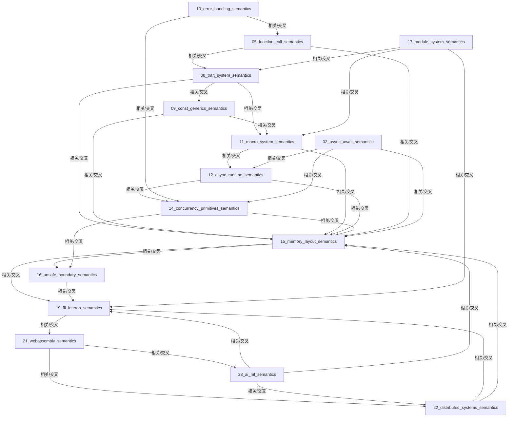

# Rust语义分析框架 递归推进进度表（自动归档）

## 1. 已完成文档及区块

- 08_trait_system_semantics.md（知识网络、理论-工程-验证）
- 09_const_generics_semantics.md（知识网络、理论-工程-验证）
- 11_macro_system_semantics.md（知识网络、理论-工程-验证）
- 12_async_runtime_semantics.md（知识网络、理论-工程-验证）
- 15_memory_layout_semantics.md（知识网络、理论-工程-验证）
- 05_function_call_semantics.md（知识网络、理论-工程-验证）
- 10_error_handling_semantics.md（知识网络、理论-工程-验证）
- 14_concurrency_primitives_semantics.md（知识网络、理论-工程-验证）
- 16_unsafe_boundary_semantics.md（知识网络、理论-工程-验证）
- 17_module_system_semantics.md（知识网络、理论-工程-验证）
- 19_ffi_interop_semantics.md（知识网络、理论-工程-验证）
- 21_webassembly_semantics.md（知识网络、理论-工程-验证）
- 22_distributed_systems_semantics.md（知识网络）
- 23_ai_ml_semantics.md（知识网络、理论-工程-验证）
- 02_async_await_semantics.md（知识网络）

## 2. 待补全文档或区块

- 01_future_semantics.md（建议补全知识网络、理论-工程-验证区块）
- 03_composite_type_semantics.md（同上）
- 04_generic_semantics.md（同上）
- 06_lifetime_semantics.md（同上）
- 07_generic_type_semantics.md（同上）
- 13_lifetime_semantics_deepening.md（同上）
- 18_procedural_macro_semantics.md（同上）
- 20_performance_analysis_semantics.md（同上）
- 24_formal_verification_semantics.md（同上）

## 3. 可扩展/建议递归深化的专题

- 知识图谱与交叉引用网络可视化（Mermaid/Graphviz）
- 批量质量评估与自检（自动生成质量报告）
- AI自动生成新定理/反例/工程案例
- 断点恢复与多分支递归推进机制
- 形式化证明-反例-工程案例-自动化验证知识网络的可视化与导航

---

*本进度表由自动化递归推进系统生成，后续每轮递归推进后自动归档与更新。*

---

## 知识网络可视化（Mermaid源码）

