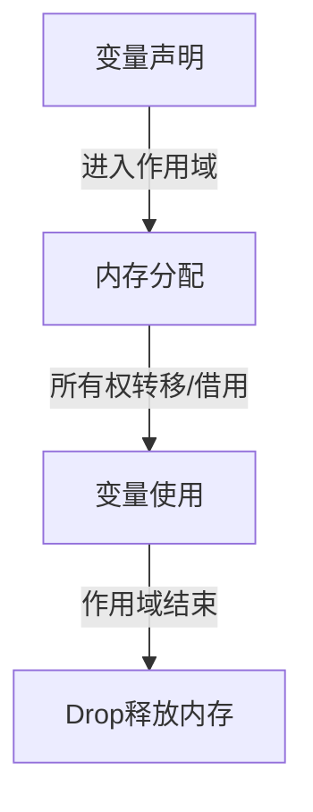

# 04. Rust内存管理与平衡机制多维分析与哲学批判

## 目录

- [04. Rust内存管理与平衡机制多维分析与哲学批判](#04-rust内存管理与平衡机制多维分析与哲学批判)
  - [目录](#目录)
  - [1. 哲学批判性分析](#1-哲学批判性分析)
  - [2. 内存管理本体论与基础](#2-内存管理本体论与基础)
    - [2.1 内存管理的定义与本体论](#21-内存管理的定义与本体论)
    - [2.2 所有权与变量作用域](#22-所有权与变量作用域)
    - [2.3 借用与生命周期](#23-借用与生命周期)
  - [3. Copy/Move语义与变量管理](#3-copymove语义与变量管理)
    - [3.1 Copy语义](#31-copy语义)
    - [3.2 Move语义](#32-move语义)
    - [3.3 Copy与Move的选择](#33-copy与move的选择)
  - [4. 组合与权衡](#4-组合与权衡)
    - [4.1 所有权与Copy/Move的组合](#41-所有权与copymove的组合)
    - [4.2 借用与生命周期的组合](#42-借用与生命周期的组合)
    - [4.3 生命周期与数据结构设计](#43-生命周期与数据结构设计)
  - [5. 实践案例分析](#5-实践案例分析)
    - [5.1 字符串处理](#51-字符串处理)
    - [5.2 集合类型](#52-集合类型)
    - [5.3 自定义数据结构](#53-自定义数据结构)
  - [6. 多表征与形式化证明](#6-多表征与形式化证明)
    - [6.1 内存释放流程图](#61-内存释放流程图)
    - [6.2 生命周期示意图](#62-生命周期示意图)
    - [6.3 形式化符号与证明](#63-形式化符号与证明)
  - [7. 总结与展望](#7-总结与展望)

---

## 1. 哲学批判性分析

Rust内存管理机制不仅是系统安全与高效的技术实现，更是现代类型系统哲学的集中体现。
所有权、借用、生命周期、Copy/Move等机制，反映了对"资源有限性""自动化管理""静态与动态安全"的深刻思考。
Rust通过静态分析实现了无需垃圾回收的内存安全。

> **哲学思考**：所有权与生命周期的静态分析是否能完全规避内存泄漏？Copy/Move的选择如何影响资源管理的本体论？这些问题不仅是技术问题，更是哲学与工程的交汇点。

---

## 2. 内存管理本体论与基础

### 2.1 内存管理的定义与本体论

- 内存管理是指程序对内存资源的分配、使用与释放的全过程。
- Rust通过所有权系统实现自动化内存管理，无需垃圾回收。

### 2.2 所有权与变量作用域

- 每个值有唯一所有者，所有权随变量作用域自动释放。
- 作用域结束时自动调用Drop，释放内存。

### 2.3 借用与生命周期

- 借用允许临时访问数据，生命周期标注确保引用有效。
- 编译器静态分析借用与生命周期，防止悬垂引用。

---

## 3. Copy/Move语义与变量管理

### 3.1 Copy语义

- Copy类型赋值为按位复制，变量可多次使用。
- 例：`let x = 1; let y = x; // x仍然有效（Copy）`

### 3.2 Move语义

- 非Copy类型赋值为所有权转移，原变量失效。
- 例：`let s1 = String::from("hi"); let s2 = s1; // s1无效（Move）`

### 3.3 Copy与Move的选择

- 简单类型实现Copy，复杂类型采用Move。
- 可自定义类型实现Copy/Clone trait。

---

## 4. 组合与权衡

### 4.1 所有权与Copy/Move的组合

- Copy类型所有权不变，Move类型所有权转移。

### 4.2 借用与生命周期的组合

- 借用与生命周期结合，提升内存安全。

### 4.3 生命周期与数据结构设计

- 生命周期标注影响结构体、函数等设计。

---

## 5. 实践案例分析

### 5.1 字符串处理

- 字符串所有权、借用、生命周期的实际应用。

### 5.2 集合类型

- 集合类型的内存管理与所有权转移。

### 5.3 自定义数据结构

- 结构体、枚举等自定义类型的内存管理实践。

---

## 6. 多表征与形式化证明

### 6.1 内存释放流程图

### 6.2 生命周期示意图

### 6.3 形式化符号与证明

- 所有权：\( \text{let}\ x = v \implies x \text{拥有}~v \)
- 借用：\( \text{&x} \implies \text{只读访问} \)
- 可变借用：\( \text{&mut x} \implies \text{独占可写访问} \)
- 生命周期：\( \ell(x) = [t_{start}, t_{end}] \)

---

## 7. 总结与展望

Rust内存管理机制通过所有权、借用、生命周期、Copy/Move等机制，实现了内存安全、资源高效与自动化管理的统一。未来，随着类型系统与硬件的发展，内存管理机制将持续演进，服务于更广泛的系统编程场景。

---

[返回目录](#目录)
