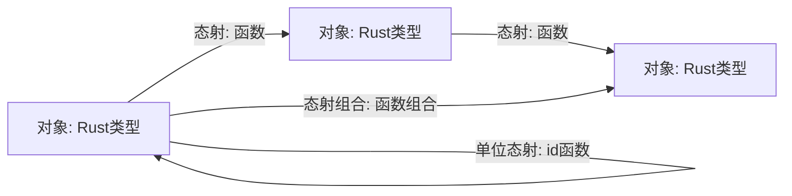
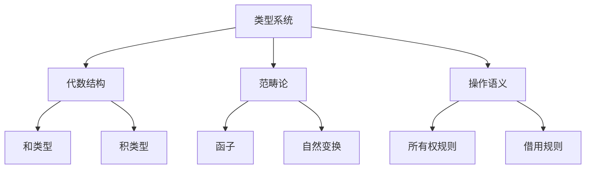

# 18. 模型与形式化方法

## 目录

- [18. 模型与形式化方法](#18-模型与形式化方法)
  - [目录](#目录)
  - [18.1 类型系统与代数结构](#181-类型系统与代数结构)
    - [18.1.1 类型代数基础](#1811-类型代数基础)
    - [18.1.2 类型级别编程与图灵完备性](#1812-类型级别编程与图灵完备性)
  - [18.2 范畴论与模型映射](#182-范畴论与模型映射)
    - [18.2.1 Rust类型系统的范畴学表示](#1821-rust类型系统的范畴学表示)
    - [18.2.2 函子与自然变换的实现](#1822-函子与自然变换的实现)
  - [18.3 形式语义学与操作规则](#183-形式语义学与操作规则)
    - [18.3.1 操作语义与类型规则](#1831-操作语义与类型规则)
    - [18.3.2 去糖化转换的形式化表示](#1832-去糖化转换的形式化表示)
  - [18.4 高级设计模式与DSL](#184-高级设计模式与dsl)
    - [18.4.1 类型状态模式](#1841-类型状态模式)
    - [18.4.2 能力模式与安全封装](#1842-能力模式与安全封装)
    - [18.4.3 领域特定语言(DSL)设计](#1843-领域特定语言dsl设计)
  - [18.5 知识整合与学习框架](#185-知识整合与学习框架)
    - [18.5.1 多层次概念地图](#1851-多层次概念地图)
    - [18.5.2 多维度学习矩阵](#1852-多维度学习矩阵)
    - [18.5.3 理论与实践的整合路径](#1853-理论与实践的整合路径)
  - [18.6 前沿研究与未来发展](#186-前沿研究与未来发展)
    - [18.6.1 Rust与形式化方法的结合](#1861-rust与形式化方法的结合)
    - [18.6.2 量子计算与Rust](#1862-量子计算与rust)
    - [18.6.3 跨语言互操作性的形式化](#1863-跨语言互操作性的形式化)

---

## 18.1 类型系统与代数结构

### 18.1.1 类型代数基础

**定义 18.1.1**（类型代数结构）
Rust类型系统可形式化为代数数据类型（Algebraic Data Types, ADT），包括：

- 单位元类型：`()`，对应数学中的1
- 零元类型：`!`，对应数学中的0
- 和类型（Sum Type）：`enum E { A(T), B(U) }`，对应T + U
- 积类型（Product Type）：`struct S(T, U)`，对应T × U
- 指数类型（Function Type）：`fn(T) -> U`，对应U^T
- 递归类型：`enum List<T> { Nil, Cons(T, Box<List<T>>) }`，对应L = 1 + T × L

**性质 18.1.1**（类型同构）
类型之间存在代数同构映射，如：

- `Option<T>` ≅ `Result<T, ()>`
- `Result<T, !>` ≅ `T`

**Rust类型代数示例**：

```rust
// 和类型
enum Either<A, B> {
    Left(A),
    Right(B),
}

// 积类型
struct Pair<A, B>(A, B);

// 单位元类型
let unit: () = ();

// 零元类型（不可构造）
// let never: !; // 仅用于发散函数
```

### 18.1.2 类型级别编程与图灵完备性

**定义 18.1.2**（类型级别自然数）
类型级别自然数可递归定义：

- Zero
- `Succ<N>`

**Rust类型级别加法与乘法示例**：

```rust
use std::marker::PhantomData;

struct Zero;
struct Succ<N>(PhantomData<N>);

trait Add<B> { type Output; }

impl<B> Add<B> for Zero {
    type Output = B;
}

impl<N, B> Add<B> for Succ<N>
where N: Add<B> {
    type Output = Succ<<N as Add<B>>::Output>;
}

// 类型级别乘法
trait Mul<B> { type Output; }

impl<B> Mul<B> for Zero {
    type Output = Zero;
}

impl<N, B> Mul<B> for Succ<N>
where N: Mul<B>, B: Add<<N as Mul<B>>::Output> {
    type Output = <B as Add<<N as Mul<B>>::Output>>::Output;
}
```

**定理 18.1.1**（类型系统图灵完备性）
Rust类型系统通过递归trait和泛型可实现任意可计算函数，具备图灵完备性。

---

## 18.2 范畴论与模型映射

### 18.2.1 Rust类型系统的范畴学表示

**定义 18.2.1**（类型范畴）

- 对象：Rust类型
- 态射：类型之间的函数
- 态射组合：函数组合
- 单位态射：恒等函数

**Mermaid图示**：



### 18.2.2 函子与自然变换的实现

**定义 18.2.2**（函子 Functor）
函子是类型到类型、函数到函数的结构保持映射。

**Rust Functor实现示例**：

```rust
// Functor trait
trait Functor<A, B> {
    type Target<T>;
    fn map(self, f: impl FnOnce(A) -> B) -> Self::Target<B>;
}

impl<A, B> Functor<A, B> for Option<A> {
    type Target<T> = Option<T>;
    fn map(self, f: impl FnOnce(A) -> B) -> Option<B> {
        match self {
            Some(a) => Some(f(a)),
            None => None,
        }
    }
}
```

**定义 18.2.3**（自然变换 Natural Transformation）
自然变换是两个函子之间的"分量"映射，满足交换律。

**Rust自然变换示例**：

```rust
// Option -> Result 的自然变换
fn natural_transform<T>(opt: Option<T>) -> Result<T, &'static str> {
    match opt {
        Some(v) => Ok(v),
        None => Err("None value"),
    }
}
```

---

## 18.3 形式语义学与操作规则

### 18.3.1 操作语义与类型规则

**定义 18.3.1**（操作语义）
操作语义通过推理规则形式化描述程序执行过程。

**Rust所有权与借用的操作语义规则**：

\[
\frac{\Gamma \vdash x : T}{\Gamma\setminus\{x\} \vdash \text{move } x : T} \quad (\text{所有权转移})
\]

\[
\frac{\Gamma \vdash x : T}{\Gamma \vdash \&x : \&T} \quad (\text{不可变借用})
\]

\[
\frac{\Gamma \vdash x : T}{\Gamma \vdash \&mut x : \&mut T} \quad (\text{可变借用})
\]

**Rust类型规则示例**：

```rust
// 不可变借用
let x = 5;
let y = &x; // y: &i32

// 可变借用
let mut x = 5;
let y = &mut x; // y: &mut i32
```

### 18.3.2 去糖化转换的形式化表示

**定义 18.3.2**（去糖化）
去糖化是将高级语法糖转换为核心语言构造的过程。

**for循环去糖化规则**：

```text
for x in iterator {
    body(x)
}
// 等价于：
{
    let mut iter = iterator.into_iter();
    loop {
        match iter.next() {
            Some(x) => { body(x) },
            None => break,
        }
    }
}
```

**Rust去糖化代码示例**：

```rust
// 语法糖
for x in 0..3 {
    println!("{}", x);
}
// 去糖化后
let mut iter = (0..3).into_iter();
loop {
    match iter.next() {
        Some(x) => println!("{}", x),
        None => break,
    }
}
```

---

## 18.4 高级设计模式与DSL

### 18.4.1 类型状态模式

**定义 18.4.1**（类型状态模式）
类型状态模式通过类型参数编码对象状态，编译时保证状态转换安全。

**Rust类型状态模式示例**：

```rust
use std::marker::PhantomData;

struct File<State> {
    handle: std::fs::File,
    _state: PhantomData<State>,
}

struct Closed;
struct Open;

impl File<Closed> {
    fn open(path: &str) -> std::io::Result<File<Open>> {
        let handle = std::fs::File::open(path)?;
        Ok(File { handle, _state: PhantomData })
    }
}

impl File<Open> {
    fn close(self) -> File<Closed> {
        // 关闭文件逻辑
        File { handle: self.handle, _state: PhantomData }
    }
}
```

### 18.4.2 能力模式与安全封装

**定义 18.4.2**（能力模式）
能力模式通过最小权限原则，将操作能力封装为独立类型，防止越权。

**Rust能力模式示例**：

```rust
struct ReadCap;
struct WriteCap;

struct SecureFile {
    file: std::fs::File,
}

impl SecureFile {
    fn read(&self, _cap: &ReadCap) -> std::io::Result<Vec<u8>> {
        // 只有持有ReadCap才能读取
        Ok(vec![])
    }
    fn write(&mut self, _cap: &WriteCap, data: &[u8]) -> std::io::Result<()> {
        // 只有持有WriteCap才能写入
        Ok(())
    }
}
```

### 18.4.3 领域特定语言(DSL)设计

**定义 18.4.3**（领域特定语言 DSL）
DSL是针对特定领域问题设计的专用编程语言。

**Rust类型安全SQL查询DSL示例**：

```rust
// 伪代码：类型安全SQL查询构建器
let query = sql::select(["id", "name"])
    .from("users")
    .where_eq("active", true)
    .order_by("id")
    .build();

// 状态机DSL示例
state_machine! {
    states { Idle, Running, Finished }
    transitions {
        Idle => Running [on_start],
        Running => Finished [on_complete],
    }
}
```

---

## 18.5 知识整合与学习框架

### 18.5.1 多层次概念地图

**定义 18.5.1**（概念地图）
概念地图是一种图结构，用于表达知识点之间的层次关系与依赖。

**Rust类型系统相关概念地图Mermaid示例**：



### 18.5.2 多维度学习矩阵

**定义 18.5.2**（学习矩阵）
学习矩阵以二维表格形式组织知识点与能力维度。

| 主题           | 理论理解 | 形式化推理 | 工程实现 | 交叉应用 |
|----------------|----------|------------|----------|----------|
| 类型代数       | ✓        | ✓          | ✓        | ✓        |
| 范畴论         | ✓        | ✓          | △        | ✓        |
| 操作语义       | ✓        | ✓          | ✓        | △        |
| 设计模式       | ✓        | △          | ✓        | ✓        |
| DSL            | ✓        | △          | ✓        | ✓        |

（✓：强，△：中等）

### 18.5.3 理论与实践的整合路径

**整合路径示意**：

1. 理论学习 → 形式化建模 → Rust工程实现 → 交叉领域应用
2. 通过DSL/范畴论/操作语义等桥接理论与工程

**Rust工程与理论结合示例**：

- 通过类型系统实现安全协议
- 用范畴论指导抽象库设计
- 以操作语义推导编译器行为

---

## 18.6 前沿研究与未来发展

### 18.6.1 Rust与形式化方法的结合

**定义 18.6.1**（可验证编程）
可验证编程是指通过类型系统、契约、模型检查等手段，在编译期或运行期验证程序正确性。

**Rust可验证编程实践**：

- 类型系统嵌入不变量
- 使用Prusti等工具进行自动化验证
- 结合SMT求解器进行属性证明

### 18.6.2 量子计算与Rust

**定义 18.6.2**（量子类型系统）
量子类型系统用于描述量子比特、量子门等量子计算元素的类型与操作规则。

**Rust量子计算生态**：

- qrust、qcgpu等量子计算库
- 量子电路DSL
- 量子安全协议建模

### 18.6.3 跨语言互操作性的形式化

**定义 18.6.3**（跨语言互操作性）
跨语言互操作性是指不同编程语言之间的数据、类型和行为能够安全、正确地交互。

**Rust FFI与互操作示例**：

```rust
// Rust与C互操作
extern "C" {
    fn c_function(x: i32) -> i32;
}

// Rust与Python互操作（PyO3）
use pyo3::prelude::*;

#[pyfunction]
fn double(x: i32) -> i32 {
    x * 2
}

#[pymodule]
fn mymodule(_py: Python, m: &PyModule) -> PyResult<()> {
    m.add_function(wrap_pyfunction!(double, m)?)?;
    Ok(())
}
```

---

**总结**：
本章系统梳理了模型与形式化方法，包括类型系统、代数结构、范畴论、操作语义、设计模式、DSL、知识整合、前沿研究等，为Rust工程与理论创新提供了坚实基础。
