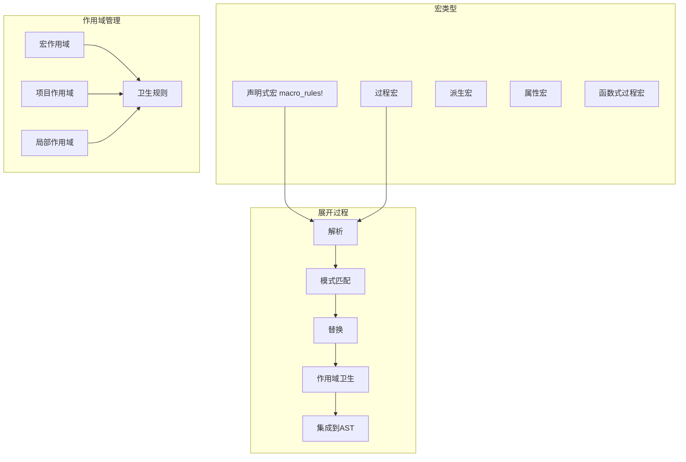

# 5.2.1 Rust宏定义语义模型深度分析

**文档版本**: V1.0  
**创建日期**: 2025-01-27  
**所属层**: 转换语义层 (Transformation Semantics Layer)  
**父模块**: [5.2 宏系统语义](../00_macro_system_index.md)  
**交叉引用**: [5.1.1 编译流程语义](../01_compilation_semantics/01_compilation_process_semantics.md)

---

## 目录

- [5.2.1 Rust宏定义语义模型深度分析](#521-rust宏定义语义模型深度分析)
  - [目录](#目录)
  - [5.2.1.1 宏系统理论基础](#5211-宏系统理论基础)
    - [5.2.1.1.1 宏语义域定义](#52111-宏语义域定义)
  - [5.2.1.2 声明式宏 (macro\_rules!)](#5212-声明式宏-macro_rules)
    - [5.2.1.2.1 基础宏定义](#52121-基础宏定义)
    - [5.2.1.2.2 高级模式匹配](#52122-高级模式匹配)
    - [5.2.1.2.3 递归宏和计数器](#52123-递归宏和计数器)
  - [5.2.1.3 过程宏](#5213-过程宏)
    - [5.2.1.3.1 派生宏](#52131-派生宏)
    - [5.2.1.3.2 属性宏](#52132-属性宏)
    - [5.2.1.3.3 函数式过程宏](#52133-函数式过程宏)
  - [5.2.1.4 宏卫生和作用域](#5214-宏卫生和作用域)
    - [5.2.1.4.1 作用域卫生机制](#52141-作用域卫生机制)
    - [5.2.1.4.2 宏导入和可见性](#52142-宏导入和可见性)
  - [5.2.1.5 高级宏技术](#5215-高级宏技术)
    - [5.2.1.5.1 宏中的宏和元编程](#52151-宏中的宏和元编程)
    - [5.2.1.5.2 编译时计算和类型生成](#52152-编译时计算和类型生成)
  - [5.2.1.6 相关引用与扩展阅读](#5216-相关引用与扩展阅读)
    - [5.2.1.6.1 内部交叉引用](#52161-内部交叉引用)
    - [5.2.1.6.2 外部参考文献](#52162-外部参考文献)
    - [5.2.1.6.3 实现参考](#52163-实现参考)

## 5.2.1.1 宏系统理论基础

### 5.2.1.1.1 宏语义域定义

**定义 5.2.1.1** (宏语义域)
$$\text{Macro} = \langle \text{Pattern}, \text{Template}, \text{Expansion}, \text{Hygiene}, \text{Resolution} \rangle$$

其中：

- $\text{Pattern} : \text{TokenStream} \rightarrow \text{Match}$ - 模式匹配
- $\text{Template} : \text{Match} \rightarrow \text{TokenStream}$ - 代码生成
- $\text{Expansion} : \text{MacroCall} \rightarrow \text{AST}$ - 宏展开
- $\text{Hygiene} : \text{Scope} \times \text{Identifier}$ - 作用域卫生
- $\text{Resolution} : \text{Name} \rightarrow \text{Definition}$ - 名称解析



---

## 5.2.1.2 声明式宏 (macro_rules!)

### 5.2.1.2.1 基础宏定义

```rust
// 基础声明式宏
macro_rules! say_hello {
    () => {
        println!("Hello, World!");
    };
}

// 带参数的宏
macro_rules! debug_print {
    ($value:expr) => {
        println!("{} = {:?}", stringify!($value), $value);
    };
}

// 多模式宏
macro_rules! calculate {
    ($a:expr + $b:expr) => {
        $a + $b
    };
    ($a:expr - $b:expr) => {
        $a - $b
    };
    ($a:expr * $b:expr) => {
        $a * $b
    };
    ($a:expr / $b:expr) => {
        $a / $b
    };
}

fn basic_macro_usage() {
    say_hello!();
    
    let x = 42;
    debug_print!(x);
    
    let result1 = calculate!(5 + 3);
    let result2 = calculate!(10 - 4);
    let result3 = calculate!(6 * 7);
    let result4 = calculate!(15 / 3);
    
    println!("Results: {}, {}, {}, {}", result1, result2, result3, result4);
}
```

### 5.2.1.2.2 高级模式匹配

```rust
// 重复模式和分隔符
macro_rules! vec_of_strings {
    ($($x:expr),* $(,)?) => {
        vec![$(String::from($x)),*]
    };
}

// 嵌套重复模式
macro_rules! hash_map {
    ($($key:expr => $value:expr),* $(,)?) => {
        {
            let mut map = std::collections::HashMap::new();
            $(map.insert($key, $value);)*
            map
        }
    };
}

// 条件编译宏
macro_rules! cfg_match {
    ($(
        $cfg:meta => $code:expr,
    )*) => {
        $(
            #[cfg($cfg)]
            {
                $code
            }
        )*
    };
}

// 类型模式匹配
macro_rules! impl_trait_for_types {
    ($trait_name:ident for $($type:ty),*) => {
        $(
            impl $trait_name for $type {
                fn method(&self) {
                    println!("Implementing {} for {}", 
                            stringify!($trait_name), 
                            stringify!($type));
                }
            }
        )*
    };
}

trait MyTrait {
    fn method(&self);
}

impl_trait_for_types!(MyTrait for i32, f64, String);

fn advanced_macro_usage() {
    let strings = vec_of_strings!["hello", "world", "rust"];
    println!("Strings: {:?}", strings);
    
    let map = hash_map! {
        "name" => "Rust",
        "type" => "Programming Language",
        "year" => "2010",
    };
    println!("Map: {:?}", map);
    
    cfg_match! {
        debug_assertions => println!("Debug mode enabled"),
        not(debug_assertions) => println!("Release mode"),
    }
    
    let value = 42i32;
    value.method();
}
```

### 5.2.1.2.3 递归宏和计数器

```rust
// 递归计算宏
macro_rules! count_tokens {
    () => { 0 };
    ($head:tt $($tail:tt)*) => {
        1 + count_tokens!($($tail)*)
    };
}

// 递归生成代码
macro_rules! generate_functions {
    () => {};
    ($name:ident $(, $rest:ident)*) => {
        fn $name() {
            println!("Function {}", stringify!($name));
        }
        generate_functions!($($rest),*);
    };
}

// 斐波那契数列宏（编译时计算）
macro_rules! fib {
    (0) => { 0 };
    (1) => { 1 };
    ($n:expr) => {
        fib!(($n) - 1) + fib!(($n) - 2)
    };
}

// TT muncher模式
macro_rules! parse_expression {
    // 解析加法
    (@parse $acc:expr, + $($rest:tt)*) => {
        parse_expression!(@parse ($acc), $($rest)*)
    };
    // 解析乘法（优先级更高）
    (@parse $acc:expr, * $next:expr $($rest:tt)*) => {
        parse_expression!(@parse ($acc * $next), $($rest)*)
    };
    // 解析数字
    (@parse $acc:expr, $next:expr $($rest:tt)*) => {
        parse_expression!(@parse ($acc + $next), $($rest)*)
    };
    // 终止条件
    (@parse $acc:expr,) => { $acc };
    
    // 入口点
    ($first:expr $($rest:tt)*) => {
        parse_expression!(@parse $first, $($rest)*)
    };
}

generate_functions!(func1, func2, func3);

fn recursive_macro_usage() {
    let count = count_tokens!(a b c d e);
    println!("Token count: {}", count);
    
    func1();
    func2();
    func3();
    
    // 注意：这里的fib!宏会在编译时展开，对于大数会导致编译时间过长
    // let fib_5 = fib!(5);
    // println!("Fibonacci(5): {}", fib_5);
    
    let result = parse_expression!(1 + 2 * 3 + 4);
    println!("Expression result: {}", result);
}
```

---

## 5.2.1.3 过程宏

### 5.2.1.3.1 派生宏

```rust
// 自定义派生宏示例（需要在proc-macro crate中定义）
use proc_macro::TokenStream;
use quote::quote;
use syn::{parse_macro_input, DeriveInput};

// 这个代码需要在单独的proc-macro crate中
/*
#[proc_macro_derive(MyTrait)]
pub fn my_trait_derive(input: TokenStream) -> TokenStream {
    let input = parse_macro_input!(input as DeriveInput);
    let name = &input.ident;
    
    let expanded = quote! {
        impl MyTrait for #name {
            fn my_method(&self) {
                println!("MyTrait implemented for {}", stringify!(#name));
            }
        }
    };
    
    TokenStream::from(expanded)
}
*/

// 使用派生宏
#[derive(Debug, Clone, PartialEq)]
struct Person {
    name: String,
    age: u32,
}

// 自定义Debug实现的派生宏示例
/*
#[proc_macro_derive(CustomDebug)]
pub fn custom_debug_derive(input: TokenStream) -> TokenStream {
    let input = parse_macro_input!(input as DeriveInput);
    let name = &input.ident;
    
    let fields = match &input.data {
        syn::Data::Struct(data_struct) => &data_struct.fields,
        _ => panic!("CustomDebug only works on structs"),
    };
    
    let field_debug = fields.iter().map(|field| {
        let field_name = &field.ident;
        quote! {
            .field(stringify!(#field_name), &self.#field_name)
        }
    });
    
    let expanded = quote! {
        impl std::fmt::Debug for #name {
            fn fmt(&self, f: &mut std::fmt::Formatter<'_>) -> std::fmt::Result {
                f.debug_struct(stringify!(#name))
                    #(#field_debug)*
                    .finish()
            }
        }
    };
    
    TokenStream::from(expanded)
}
*/

fn derive_macro_usage() {
    let person = Person {
        name: "Alice".to_string(),
        age: 30,
    };
    
    println!("Person: {:?}", person);
    
    let cloned_person = person.clone();
    println!("Cloned: {:?}", cloned_person);
    println!("Equal: {}", person == cloned_person);
}
```

### 5.2.1.3.2 属性宏

```rust
// 属性宏示例（需要在proc-macro crate中定义）
/*
#[proc_macro_attribute]
pub fn timing(args: TokenStream, input: TokenStream) -> TokenStream {
    let input = parse_macro_input!(input as syn::ItemFn);
    let name = &input.sig.ident;
    let block = &input.block;
    let vis = &input.vis;
    let sig = &input.sig;
    
    let expanded = quote! {
        #vis #sig {
            let start = std::time::Instant::now();
            let result = (|| #block)();
            let duration = start.elapsed();
            println!("Function {} took {:?}", stringify!(#name), duration);
            result
        }
    };
    
    TokenStream::from(expanded)
}
*/

// 更复杂的属性宏：缓存函数结果
/*
#[proc_macro_attribute]
pub fn memoize(args: TokenStream, input: TokenStream) -> TokenStream {
    let input = parse_macro_input!(input as syn::ItemFn);
    let name = &input.sig.ident;
    let block = &input.block;
    let vis = &input.vis;
    let sig = &input.sig;
    let inputs = &sig.inputs;
    let output = &sig.output;
    
    let cache_name = syn::Ident::new(&format!("{}_CACHE", name.to_string().to_uppercase()), name.span());
    
    let expanded = quote! {
        lazy_static::lazy_static! {
            static ref #cache_name: std::sync::Mutex<std::collections::HashMap<String, _>> = 
                std::sync::Mutex::new(std::collections::HashMap::new());
        }
        
        #vis #sig {
            let key = format!("{:?}", (#inputs,));
            let mut cache = #cache_name.lock().unwrap();
            
            if let Some(cached) = cache.get(&key) {
                return cached.clone();
            }
            
            let result = (|| #block)();
            cache.insert(key, result.clone());
            result
        }
    };
    
    TokenStream::from(expanded)
}
*/

// 使用属性宏
/*
#[timing]
#[memoize]
fn fibonacci(n: u64) -> u64 {
    if n <= 1 {
        n
    } else {
        fibonacci(n - 1) + fibonacci(n - 2)
    }
}
*/

fn attribute_macro_usage() {
    // let result = fibonacci(40);
    // println!("Fibonacci(40): {}", result);
    
    // 再次调用应该从缓存返回
    // let result2 = fibonacci(40);
    // println!("Fibonacci(40) cached: {}", result2);
}
```

### 5.2.1.3.3 函数式过程宏

```rust
// 函数式过程宏示例（需要在proc-macro crate中定义）
/*
#[proc_macro]
pub fn sql(input: TokenStream) -> TokenStream {
    let input_string = input.to_string();
    
    // 简单的SQL解析和验证
    if !input_string.trim_start().to_lowercase().starts_with("select") {
        return syn::Error::new(
            proc_macro2::Span::call_site(),
            "Only SELECT statements are supported"
        ).to_compile_error().into();
    }
    
    let expanded = quote! {
        {
            let query = #input_string;
            println!("Executing SQL: {}", query);
            // 这里可以生成实际的数据库查询代码
            query
        }
    };
    
    TokenStream::from(expanded)
}
*/

// HTML模板宏
/*
#[proc_macro]
pub fn html(input: TokenStream) -> TokenStream {
    let input_string = input.to_string();
    
    // 简单的HTML验证和转换
    let html_content = input_string
        .replace("\"", "\\\"")
        .replace("\n", "\\n");
    
    let expanded = quote! {
        format!("{}", #html_content)
    };
    
    TokenStream::from(expanded)
}
*/

// 正则表达式编译时验证宏
/*
#[proc_macro]
pub fn regex(input: TokenStream) -> TokenStream {
    let input_string = input.to_string();
    let pattern = input_string.trim_matches('"');
    
    // 编译时验证正则表达式
    if let Err(e) = regex::Regex::new(pattern) {
        return syn::Error::new(
            proc_macro2::Span::call_site(),
            format!("Invalid regex pattern: {}", e)
        ).to_compile_error().into();
    }
    
    let expanded = quote! {
        regex::Regex::new(#pattern).unwrap()
    };
    
    TokenStream::from(expanded)
}
*/

fn function_macro_usage() {
    // let query = sql!("SELECT * FROM users WHERE age > 18");
    // println!("Query: {}", query);
    
    // let html = html!("<div>Hello, World!</div>");
    // println!("HTML: {}", html);
    
    // let pattern = regex!(r"\d{3}-\d{3}-\d{4}");
    // println!("Regex created successfully");
}
```

---

## 5.2.1.4 宏卫生和作用域

### 5.2.1.4.1 作用域卫生机制

```rust
// 宏卫生示例
macro_rules! define_and_use {
    ($name:ident) => {
        let $name = 42;
        println!("Inside macro: {}", $name);
    };
}

macro_rules! capture_local {
    () => {
        // 这个x不会与外部的x冲突
        let x = "macro x";
        println!("Macro x: {}", x);
    };
}

// 不卫生的宏（故意演示问题）
macro_rules! unsafe_capture {
    () => {
        x = x + 1;  // 这会尝试访问外部作用域的x
    };
}

fn hygiene_examples() {
    // 宏内部定义的变量不会泄漏到外部
    define_and_use!(internal_var);
    // println!("{}", internal_var);  // 编译错误：变量不存在
    
    let x = "outer x";
    capture_local!();
    println!("Outer x: {}", x);  // 外部x不受影响
    
    // 不安全的宏使用
    let mut x = 10;
    // unsafe_capture!();  // 这个宏需要x在作用域中存在
    // println!("Modified x: {}", x);
}

// 故意破坏卫生的宏
macro_rules! unhygienic {
    ($var:ident) => {
        let helper = 100;
        let $var = helper + 42;
    };
}

macro_rules! hygienic_helper {
    ($var:ident) => {
        {
            let helper = 100;  // 这个helper是宏内部的
            $var + helper
        }
    };
}

fn hygiene_breaking_examples() {
    let helper = 1;  // 外部helper
    
    unhygienic!(my_var);
    println!("my_var: {}, helper: {}", my_var, helper);  // helper仍然是1
    
    let result = hygienic_helper!(5);
    println!("Result: {}, helper: {}", result, helper);  // helper仍然是1
}
```

### 5.2.1.4.2 宏导入和可见性

```rust
// 宏的可见性和导入
mod inner {
    // 公共宏
    #[macro_export]
    macro_rules! public_macro {
        () => {
            println!("This is a public macro");
        };
    }
    
    // 模块内宏
    macro_rules! private_macro {
        () => {
            println!("This is a private macro");
        };
    }
    
    pub fn use_private() {
        private_macro!();
    }
}

// 使用use导入宏
use inner::*;

// 条件导入宏
#[cfg(feature = "experimental")]
macro_rules! experimental_macro {
    () => {
        println!("Experimental feature enabled");
    };
}

fn macro_visibility_examples() {
    public_macro!();  // 可以使用
    // private_macro!();  // 编译错误：不可见
    
    inner::use_private();  // 通过函数调用使用私有宏
    
    #[cfg(feature = "experimental")]
    experimental_macro!();
}

// 宏的重新导出
pub use inner::public_macro;

// 宏别名
macro_rules! log_info {
    ($($arg:tt)*) => {
        println!("[INFO] {}", format!($($arg)*));
    };
}

macro_rules! info {
    ($($arg:tt)*) => {
        log_info!($($arg)*);
    };
}

fn macro_aliasing_examples() {
    log_info!("This is a log message");
    info!("This is an aliased log message");
}
```

---

## 5.2.1.5 高级宏技术

### 5.2.1.5.1 宏中的宏和元编程

```rust
// 生成宏的宏
macro_rules! make_getter_setter {
    ($field:ident, $field_type:ty) => {
        paste::paste! {
            fn [<get_ $field>](&self) -> &$field_type {
                &self.$field
            }
            
            fn [<set_ $field>](&mut self, value: $field_type) {
                self.$field = value;
            }
        }
    };
}

// 结构体字段宏
macro_rules! define_struct_with_accessors {
    (
        struct $name:ident {
            $(
                $field:ident: $field_type:ty
            ),* $(,)?
        }
    ) => {
        struct $name {
            $(
                $field: $field_type,
            )*
        }
        
        impl $name {
            fn new($($field: $field_type),*) -> Self {
                Self {
                    $(
                        $field,
                    )*
                }
            }
            
            $(
                make_getter_setter!($field, $field_type);
            )*
        }
    };
}

define_struct_with_accessors! {
    struct Person {
        name: String,
        age: u32,
        email: String,
    }
}

fn meta_macro_usage() {
    let mut person = Person::new(
        "Alice".to_string(),
        30,
        "alice@example.com".to_string(),
    );
    
    println!("Name: {}", person.get_name());
    person.set_age(31);
    println!("New age: {}", person.get_age());
}
```

### 5.2.1.5.2 编译时计算和类型生成

```rust
// 编译时字符串处理
macro_rules! const_string_len {
    ($s:expr) => {
        {
            const LEN: usize = $s.len();
            LEN
        }
    };
}

// 类型级别计算
macro_rules! type_list {
    () => { () };
    ($head:ty) => { ($head, ()) };
    ($head:ty, $($tail:ty),*) => {
        ($head, type_list!($($tail),*))
    };
}

// 编译时断言
macro_rules! static_assert {
    ($condition:expr) => {
        const _: () = assert!($condition);
    };
    ($condition:expr, $message:expr) => {
        const _: () = assert!($condition, $message);
    };
}

// 编译时哈希
macro_rules! compile_time_hash {
    ($s:expr) => {
        {
            const fn hash_str(s: &str) -> u64 {
                let bytes = s.as_bytes();
                let mut hash = 0u64;
                let mut i = 0;
                while i < bytes.len() {
                    hash = hash.wrapping_mul(31).wrapping_add(bytes[i] as u64);
                    i += 1;
                }
                hash
            }
            
            const HASH: u64 = hash_str($s);
            HASH
        }
    };
}

fn compile_time_macro_usage() {
    const NAME_LEN: usize = const_string_len!("Hello, World!");
    println!("String length: {}", NAME_LEN);
    
    type MyTypes = type_list!(i32, String, f64, bool);
    println!("Type list created");
    
    static_assert!(size_of::<i32>() == 4);
    static_assert!(size_of::<u64>() == 8, "u64 should be 8 bytes");
    
    const HASH: u64 = compile_time_hash!("compile_time_string");
    println!("Compile-time hash: {}", HASH);
}
```

---

## 5.2.1.6 相关引用与扩展阅读

### 5.2.1.6.1 内部交叉引用

- [5.1.1 编译流程语义](../01_compilation_semantics/01_compilation_process_semantics.md) - 宏展开时机
- [1.1.1 原始类型语义](../../01_foundation_semantics/01_type_system_semantics/01_primitive_types_semantics.md) - 类型在宏中的使用
- [4.1.1 模块定义语义](../../04_organization_semantics/01_module_system_semantics/01_module_definition_semantics.md) - 宏的可见性

### 5.2.1.6.2 外部参考文献

1. *The Rust Programming Language* - Chapter 19: Advanced Features
2. *The Little Book of Rust Macros*
3. Kohlhoff, C. *Procedural Macros in Rust*. 2018.

### 5.2.1.6.3 实现参考

- [syn](https://crates.io/crates/syn) - Rust语法解析
- [quote](https://crates.io/crates/quote) - 代码生成
- [proc-macro2](https://crates.io/crates/proc-macro2) - 过程宏工具

---

**文档元数据**:

- **复杂度级别**: ⭐⭐⭐⭐⭐ (专家级)
- **前置知识**: Rust语法、令牌流、AST概念
- **相关工具**: cargo expand, rust-analyzer
- **更新频率**: 与Rust宏系统演进同步
- **维护者**: Rust转换语义分析工作组
