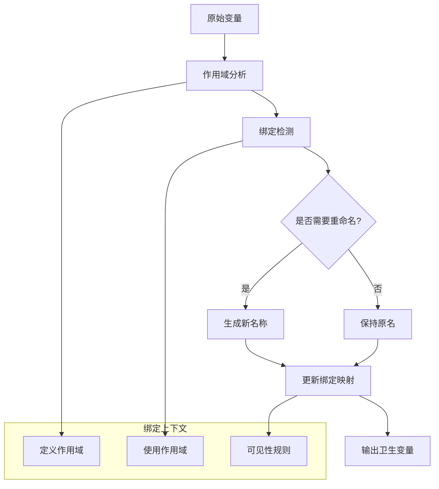

# 宏卫生性语义深度分析

## 目录

- [宏卫生性语义深度分析](#宏卫生性语义深度分析)
  - [目录](#目录)
  - [1. 理论基础](#1-理论基础)
    - [1.1 数学定义](#11-数学定义)
    - [1.2 变量绑定理论](#12-变量绑定理论)
    - [1.3 作用域语义模型](#13-作用域语义模型)
    - [1.4 α-等价理论](#14-α-等价理论)
  - [2. Rust实现分析](#2-rust实现分析)
    - [2.1 卫生性实现机制](#21-卫生性实现机制)
    - [2.2 符号解析系统](#22-符号解析系统)
    - [2.3 作用域管理](#23-作用域管理)
    - [2.4 卫生性验证](#24-卫生性验证)
  - [3. 实际应用](#3-实际应用)
    - [3.1 复杂卫生性场景](#31-复杂卫生性场景)
    - [3.2 最佳实践模式](#32-最佳实践模式)
    - [3.3 常见陷阱分析](#33-常见陷阱分析)
  - [4. 理论前沿](#4-理论前沿)
    - [4.1 最新发展](#41-最新发展)
    - [4.2 研究前沿](#42-研究前沿)
    - [4.3 未来方向](#43-未来方向)

## 1. 理论基础

### 1.1 数学定义

**定义 5.2.10** (卫生性语义域)
宏卫生性的语义域定义为五元组：
$$\mathcal{H} = (V, S, B, R, \alpha)$$

其中：

- $V$ 是变量标识符集合
- $S$ 是作用域上下文集合  
- $B: V \times S \rightarrow V$ 是绑定函数
- $R: V \times S \rightarrow S$ 是解析函数
- $\alpha: Term \times Term \rightarrow \mathbb{B}$ 是α-等价关系

**定义 5.2.11** (卫生性不变量)
对于宏展开 $e: Term \rightarrow Term$，卫生性不变量定义为：
$$\text{Hygienic}(e) \triangleq \forall t \in Term. \text{FreeVars}(e(t)) \subseteq \text{FreeVars}(t)$$

**定义 5.2.12** (变量捕获)
变量捕获关系定义为：
$$\text{Captures}(expansion, var) \triangleq var \in \text{FreeVars}(input) \land var \notin \text{FreeVars}(output)$$

### 1.2 变量绑定理论

卫生性的核心是正确处理变量绑定：



**定理 5.2.5** (绑定保持性)
对于卫生的宏展开：
$$\forall v \in Variables. \text{binding\_scope}(v_{input}) = \text{binding\_scope}(v_{output})$$

**引理 5.2.2** (作用域单调性)
作用域嵌套关系在展开过程中保持单调性：
$$scope_1 \subseteq scope_2 \Rightarrow expand(scope_1) \subseteq expand(scope_2)$$

### 1.3 作用域语义模型

**定义 5.2.13** (作用域层次结构)
作用域形成偏序集 $(S, \preceq)$，其中：

- $s_1 \preceq s_2$ 表示 $s_1$ 是 $s_2$ 的子作用域
- $\text{root}$ 是最顶层作用域
- 每个作用域有唯一的父作用域（除root外）

**作用域查找算法**：

```text
function resolve_variable(var, current_scope):
    scope = current_scope
    while scope != null:
        if var in scope.bindings:
            return scope.bindings[var]
        scope = scope.parent
    return None  // 未找到绑定
```

### 1.4 α-等价理论

**定义 5.2.14** (α-等价)
两个项 $t_1, t_2$ 是α-等价的，记作 $t_1 =_\alpha t_2$，当且仅当：
$$t_1 =_\alpha t_2 \triangleq \exists \sigma: Renaming. t_1[\sigma] = t_2$$

其中 $\sigma$ 是保持绑定结构的重命名。

**定理 5.2.6** (卫生性与α-等价)
卫生的宏展开保持α-等价：
$$t_1 =_\alpha t_2 \Rightarrow expand(t_1) =_\alpha expand(t_2)$$

## 2. Rust实现分析

### 2.1 卫生性实现机制

**核心卫生性系统**：

```rust
use std::collections::{HashMap, HashSet};
use std::sync::atomic::{AtomicUsize, Ordering};

// 全局符号计数器
static SYMBOL_COUNTER: AtomicUsize = AtomicUsize::new(0);

// 卫生性上下文
#[derive(Debug, Clone)]
struct HygieneContext {
    // 作用域栈
    scope_stack: Vec<Scope>,
    // 当前作用域ID
    current_scope: ScopeId,
    // 符号重命名表
    rename_table: HashMap<(Symbol, ScopeId), Symbol>,
    // 定义站点映射
    definition_sites: HashMap<Symbol, ScopeId>,
    // 使用站点映射
    use_sites: HashMap<Symbol, Vec<ScopeId>>,
}

#[derive(Debug, Clone, Copy, PartialEq, Eq, Hash)]
struct ScopeId(usize);

#[derive(Debug, Clone, Copy, PartialEq, Eq, Hash)]
struct Symbol(usize);

#[derive(Debug, Clone)]
struct Scope {
    id: ScopeId,
    parent: Option<ScopeId>,
    kind: ScopeKind,
    bindings: HashMap<String, Symbol>,
    macro_definitions: HashSet<String>,
    transparency: Transparency,
}

#[derive(Debug, Clone, Copy)]
enum ScopeKind {
    Root,
    Module,
    Function,
    Block,
    MacroDefinition,
    MacroUse,
}

#[derive(Debug, Clone, Copy)]
enum Transparency {
    Opaque,        // 完全卫生
    SemiTransparent, // 部分透明
    Transparent,   // 完全透明
}

impl HygieneContext {
    fn new() -> Self {
        let root_scope = Scope {
            id: ScopeId(0),
            parent: None,
            kind: ScopeKind::Root,
            bindings: HashMap::new(),
            macro_definitions: HashSet::new(),
            transparency: Transparency::Transparent,
        };
        
        Self {
            scope_stack: vec![root_scope],
            current_scope: ScopeId(0),
            rename_table: HashMap::new(),
            definition_sites: HashMap::new(),
            use_sites: HashMap::new(),
        }
    }
    
    fn enter_scope(&mut self, kind: ScopeKind, transparency: Transparency) -> ScopeId {
        let scope_id = ScopeId(self.scope_stack.len());
        let parent = Some(self.current_scope);
        
        let scope = Scope {
            id: scope_id,
            parent,
            kind,
            bindings: HashMap::new(),
            macro_definitions: HashSet::new(),
            transparency,
        };
        
        self.scope_stack.push(scope);
        self.current_scope = scope_id;
        scope_id
    }
    
    fn exit_scope(&mut self) {
        if let Some(scope) = self.scope_stack.last() {
            if let Some(parent) = scope.parent {
                self.current_scope = parent;
            }
        }
    }
    
    fn fresh_symbol(&mut self, base_name: &str) -> Symbol {
        let id = SYMBOL_COUNTER.fetch_add(1, Ordering::SeqCst);
        Symbol(id)
    }
    
    fn make_hygienic(&mut self, name: &str, def_scope: ScopeId) -> Symbol {
        let key = (Symbol(name.as_ptr() as usize), def_scope);
        
        if let Some(&symbol) = self.rename_table.get(&key) {
            return symbol;
        }
        
        let fresh = self.fresh_symbol(name);
        self.rename_table.insert(key, fresh);
        self.definition_sites.insert(fresh, def_scope);
        
        fresh
    }
    
    fn resolve_symbol(&self, name: &str, use_scope: ScopeId) -> Option<Symbol> {
        let mut current = Some(use_scope);
        
        while let Some(scope_id) = current {
            if let Some(scope) = self.scope_stack.get(scope_id.0) {
                if let Some(&symbol) = scope.bindings.get(name) {
                    return Some(symbol);
                }
                current = scope.parent;
            } else {
                break;
            }
        }
        
        None
    }
    
    fn check_variable_capture(&self, symbol: Symbol, use_scope: ScopeId) -> bool {
        if let Some(&def_scope) = self.definition_sites.get(&symbol) {
            // 检查定义作用域是否是使用作用域的祖先
            self.is_ancestor_scope(def_scope, use_scope)
        } else {
            false
        }
    }
    
    fn is_ancestor_scope(&self, ancestor: ScopeId, descendant: ScopeId) -> bool {
        let mut current = Some(descendant);
        
        while let Some(scope_id) = current {
            if scope_id == ancestor {
                return true;
            }
            
            if let Some(scope) = self.scope_stack.get(scope_id.0) {
                current = scope.parent;
            } else {
                break;
            }
        }
        
        false
    }
}
```

### 2.2 符号解析系统

**符号解析引擎**：

```rust
// 符号解析器
struct SymbolResolver {
    hygiene_context: HygieneContext,
    import_table: HashMap<String, Symbol>,
    export_table: HashMap<Symbol, String>,
}

impl SymbolResolver {
    fn resolve_identifier(&mut self, ident: &syn::Ident, context: ResolutionContext) -> Resolution {
        let name = ident.to_string();
        let span = ident.span();
        let use_scope = self.span_to_scope(span);
        
        match context {
            ResolutionContext::Definition => {
                // 这是一个新的定义
                let symbol = self.hygiene_context.make_hygienic(&name, use_scope);
                self.bind_symbol(name.clone(), symbol, use_scope);
                Resolution::Definition(symbol)
            }
            ResolutionContext::Use => {
                // 这是对现有绑定的使用
                if let Some(symbol) = self.hygiene_context.resolve_symbol(&name, use_scope) {
                    // 检查是否存在变量捕获
                    if self.hygiene_context.check_variable_capture(symbol, use_scope) {
                        Resolution::Use(symbol)
                    } else {
                        Resolution::CaptureError {
                            name: name.clone(),
                            symbol,
                            use_scope,
                        }
                    }
                } else {
                    Resolution::Unresolved(name)
                }
            }
        }
    }
    
    fn bind_symbol(&mut self, name: String, symbol: Symbol, scope: ScopeId) {
        if let Some(scope_info) = self.hygiene_context.scope_stack.get_mut(scope.0) {
            scope_info.bindings.insert(name, symbol);
        }
    }
    
    fn span_to_scope(&self, span: Span) -> ScopeId {
        // 从span信息推断作用域
        // 这里简化处理，实际实现会更复杂
        self.hygiene_context.current_scope
    }
}

#[derive(Debug)]
enum ResolutionContext {
    Definition,  // 变量定义
    Use,        // 变量使用
}

#[derive(Debug)]
enum Resolution {
    Definition(Symbol),
    Use(Symbol),
    Unresolved(String),
    CaptureError {
        name: String,
        symbol: Symbol,
        use_scope: ScopeId,
    },
}
```

### 2.3 作用域管理

**作用域管理系统**：

```rust
// 作用域管理器
struct ScopeManager {
    scopes: Vec<ScopeInfo>,
    scope_tree: HashMap<ScopeId, Vec<ScopeId>>, // 父子关系
    current_path: Vec<ScopeId>, // 当前作用域路径
}

#[derive(Debug, Clone)]
struct ScopeInfo {
    id: ScopeId,
    kind: ScopeKind,
    transparency: Transparency,
    variables: HashMap<String, VariableInfo>,
    macros: HashMap<String, MacroInfo>,
    imports: HashMap<String, ImportInfo>,
}

#[derive(Debug, Clone)]
struct VariableInfo {
    symbol: Symbol,
    definition_span: Span,
    visibility: Visibility,
    mutability: Mutability,
}

#[derive(Debug, Clone)]
struct MacroInfo {
    name: String,
    definition_scope: ScopeId,
    hygiene_mode: HygieneMode,
}

#[derive(Debug, Clone)]
enum HygieneMode {
    FullyHygienic,    // 声明式宏默认模式
    PartiallyHygienic, // 某些特殊情况
    NonHygienic,      // 明确禁用卫生性
}

impl ScopeManager {
    fn create_child_scope(&mut self, parent: ScopeId, kind: ScopeKind) -> ScopeId {
        let child_id = ScopeId(self.scopes.len());
        
        let scope = ScopeInfo {
            id: child_id,
            kind,
            transparency: self.determine_transparency(kind),
            variables: HashMap::new(),
            macros: HashMap::new(),
            imports: HashMap::new(),
        };
        
        self.scopes.push(scope);
        
        // 更新父子关系
        self.scope_tree.entry(parent).or_insert_with(Vec::new).push(child_id);
        
        child_id
    }
    
    fn determine_transparency(&self, kind: ScopeKind) -> Transparency {
        match kind {
            ScopeKind::Root | ScopeKind::Module => Transparency::Transparent,
            ScopeKind::MacroDefinition => Transparency::Opaque,
            ScopeKind::MacroUse => Transparency::SemiTransparent,
            ScopeKind::Function | ScopeKind::Block => Transparency::Transparent,
        }
    }
    
    fn lookup_variable(&self, name: &str, start_scope: ScopeId) -> Option<&VariableInfo> {
        let mut current = Some(start_scope);
        
        while let Some(scope_id) = current {
            if let Some(scope) = self.scopes.get(scope_id.0) {
                if let Some(var_info) = scope.variables.get(name) {
                    return Some(var_info);
                }
                
                // 根据透明性决定是否继续向上查找
                match scope.transparency {
                    Transparency::Opaque => return None,
                    Transparency::Transparent | Transparency::SemiTransparent => {
                        current = self.get_parent_scope(scope_id);
                    }
                }
            } else {
                break;
            }
        }
        
        None
    }
    
    fn get_parent_scope(&self, scope: ScopeId) -> Option<ScopeId> {
        for (parent, children) in &self.scope_tree {
            if children.contains(&scope) {
                return Some(*parent);
            }
        }
        None
    }
    
    fn check_hygiene_violation(&self, 
                              symbol: Symbol, 
                              use_scope: ScopeId, 
                              def_scope: ScopeId) -> Option<HygieneViolation> {
        // 检查是否存在变量捕获
        if !self.is_scope_visible(def_scope, use_scope) {
            return Some(HygieneViolation::VariableCapture {
                symbol,
                definition_scope: def_scope,
                use_scope,
            });
        }
        
        // 检查是否违反透明性规则
        if self.violates_transparency(def_scope, use_scope) {
            return Some(HygieneViolation::TransparencyViolation {
                symbol,
                definition_scope: def_scope,
                use_scope,
            });
        }
        
        None
    }
    
    fn is_scope_visible(&self, def_scope: ScopeId, use_scope: ScopeId) -> bool {
        // 定义作用域必须是使用作用域的祖先或同级
        self.is_ancestor_or_sibling(def_scope, use_scope)
    }
    
    fn is_ancestor_or_sibling(&self, scope1: ScopeId, scope2: ScopeId) -> bool {
        // 简化实现，实际会更复杂
        self.find_common_ancestor(scope1, scope2).is_some()
    }
    
    fn find_common_ancestor(&self, scope1: ScopeId, scope2: ScopeId) -> Option<ScopeId> {
        let path1 = self.get_scope_path(scope1);
        let path2 = self.get_scope_path(scope2);
        
        for &ancestor1 in &path1 {
            for &ancestor2 in &path2 {
                if ancestor1 == ancestor2 {
                    return Some(ancestor1);
                }
            }
        }
        
        None
    }
    
    fn get_scope_path(&self, scope: ScopeId) -> Vec<ScopeId> {
        let mut path = vec![scope];
        let mut current = scope;
        
        while let Some(parent) = self.get_parent_scope(current) {
            path.push(parent);
            current = parent;
        }
        
        path.reverse();
        path
    }
    
    fn violates_transparency(&self, def_scope: ScopeId, use_scope: ScopeId) -> bool {
        // 检查透明性规则
        if let Some(def_scope_info) = self.scopes.get(def_scope.0) {
            match def_scope_info.transparency {
                Transparency::Opaque => {
                    // 不透明作用域，不允许外部访问内部绑定
                    def_scope != use_scope && self.is_ancestor_or_sibling(def_scope, use_scope)
                }
                _ => false,
            }
        } else {
            false
        }
    }
}

#[derive(Debug)]
enum HygieneViolation {
    VariableCapture {
        symbol: Symbol,
        definition_scope: ScopeId,
        use_scope: ScopeId,
    },
    TransparencyViolation {
        symbol: Symbol,
        definition_scope: ScopeId,
        use_scope: ScopeId,
    },
    ScopeLeakage {
        symbol: Symbol,
        leaked_scope: ScopeId,
    },
}
```

### 2.4 卫生性验证

**卫生性验证系统**：

```rust
// 卫生性验证器
struct HygieneValidator {
    scope_manager: ScopeManager,
    violation_reporter: ViolationReporter,
}

impl HygieneValidator {
    fn validate_expansion(&mut self, 
                         original: &TokenStream, 
                         expanded: &TokenStream) -> ValidationResult {
        let mut violations = Vec::new();
        
        // 1. 分析原始代码的自由变量
        let original_free_vars = self.extract_free_variables(original);
        
        // 2. 分析展开后代码的自由变量
        let expanded_free_vars = self.extract_free_variables(expanded);
        
        // 3. 检查是否有新的自由变量引入（变量捕获）
        for var in &expanded_free_vars {
            if !original_free_vars.contains(var) {
                violations.push(HygieneViolation::VariableCapture {
                    symbol: var.symbol,
                    definition_scope: var.definition_scope,
                    use_scope: var.use_scope,
                });
            }
        }
        
        // 4. 检查绑定结构是否保持
        let binding_violations = self.check_binding_preservation(original, expanded);
        violations.extend(binding_violations);
        
        // 5. 检查作用域泄漏
        let scope_violations = self.check_scope_leakage(expanded);
        violations.extend(scope_violations);
        
        if violations.is_empty() {
            ValidationResult::Valid
        } else {
            ValidationResult::Invalid(violations)
        }
    }
    
    fn extract_free_variables(&self, tokens: &TokenStream) -> HashSet<VariableReference> {
        let mut visitor = FreeVariableVisitor::new(&self.scope_manager);
        visitor.visit_token_stream(tokens);
        visitor.free_variables
    }
    
    fn check_binding_preservation(&self, 
                                 original: &TokenStream, 
                                 expanded: &TokenStream) -> Vec<HygieneViolation> {
        let original_bindings = self.extract_bindings(original);
        let expanded_bindings = self.extract_bindings(expanded);
        
        let mut violations = Vec::new();
        
        // 检查每个原始绑定在展开后是否保持
        for (name, original_binding) in original_bindings {
            if let Some(expanded_binding) = expanded_bindings.get(&name) {
                if !self.bindings_equivalent(&original_binding, expanded_binding) {
                    violations.push(HygieneViolation::BindingStructureChanged {
                        variable: name,
                        original: original_binding,
                        expanded: expanded_binding.clone(),
                    });
                }
            }
        }
        
        violations
    }
    
    fn check_scope_leakage(&self, expanded: &TokenStream) -> Vec<HygieneViolation> {
        let mut violations = Vec::new();
        let mut visitor = ScopeLeakageVisitor::new(&self.scope_manager);
        
        visitor.visit_token_stream(expanded);
        
        for leaked_variable in visitor.leaked_variables {
            violations.push(HygieneViolation::ScopeLeakage {
                symbol: leaked_variable.symbol,
                leaked_scope: leaked_variable.scope,
            });
        }
        
        violations
    }
    
    fn extract_bindings(&self, tokens: &TokenStream) -> HashMap<String, BindingInfo> {
        let mut visitor = BindingExtractor::new();
        visitor.visit_token_stream(tokens);
        visitor.bindings
    }
    
    fn bindings_equivalent(&self, binding1: &BindingInfo, binding2: &BindingInfo) -> bool {
        // 检查绑定是否在语义上等价
        binding1.binding_kind == binding2.binding_kind &&
        self.scopes_equivalent(binding1.scope, binding2.scope)
    }
    
    fn scopes_equivalent(&self, scope1: ScopeId, scope2: ScopeId) -> bool {
        // 简化实现：检查作用域是否语义等价
        scope1 == scope2
    }
}

#[derive(Debug, Clone)]
struct VariableReference {
    name: String,
    symbol: Symbol,
    definition_scope: ScopeId,
    use_scope: ScopeId,
}

#[derive(Debug, Clone)]
struct BindingInfo {
    binding_kind: BindingKind,
    scope: ScopeId,
    span: Span,
}

#[derive(Debug, Clone, PartialEq)]
enum BindingKind {
    LetBinding,
    FunctionParameter,
    LoopVariable,
    PatternBinding,
}

#[derive(Debug)]
enum ValidationResult {
    Valid,
    Invalid(Vec<HygieneViolation>),
}

// 访问者模式实现
struct FreeVariableVisitor<'a> {
    scope_manager: &'a ScopeManager,
    free_variables: HashSet<VariableReference>,
    current_scope: ScopeId,
    bound_variables: HashSet<String>,
}

impl<'a> FreeVariableVisitor<'a> {
    fn new(scope_manager: &'a ScopeManager) -> Self {
        Self {
            scope_manager,
            free_variables: HashSet::new(),
            current_scope: ScopeId(0),
            bound_variables: HashSet::new(),
        }
    }
    
    fn visit_token_stream(&mut self, tokens: &TokenStream) {
        for token in tokens.clone() {
            self.visit_token(token);
        }
    }
    
    fn visit_token(&mut self, token: TokenTree) {
        match token {
            TokenTree::Ident(ident) => {
                let name = ident.to_string();
                if !self.bound_variables.contains(&name) {
                    if let Some(var_info) = self.scope_manager.lookup_variable(&name, self.current_scope) {
                        self.free_variables.insert(VariableReference {
                            name,
                            symbol: var_info.symbol,
                            definition_scope: ScopeId(0), // 简化
                            use_scope: self.current_scope,
                        });
                    }
                }
            }
            TokenTree::Group(group) => {
                self.visit_token_stream(&group.stream());
            }
            _ => {}
        }
    }
}
```

## 3. 实际应用

### 3.1 复杂卫生性场景

**场景1：嵌套宏与变量捕获**：

```rust
// 外层宏定义
macro_rules! outer_macro {
    ($var:ident) => {
        {
            let temp = 42;  // 这个temp应该是卫生的
            inner_macro!($var, temp);
        }
    };
}

// 内层宏定义
macro_rules! inner_macro {
    ($x:ident, $y:ident) => {
        {
            let result = $x + $y;
            println!("Result: {}", result);
            result
        }
    };
}

// 使用场景
fn test_nested_hygiene() {
    let temp = 100;  // 用户定义的temp
    
    // 这里不应该发生变量捕获
    let value = outer_macro!(temp);
    
    // temp仍然应该是100，不是42
    assert_eq!(temp, 100);
}
```

**场景2：跨模块宏卫生性**：

```rust
// 模块A
mod module_a {
    macro_rules! export_macro {
        ($name:ident) => {
            pub fn $name() -> i32 {
                let private_var = 123;  // 模块私有
                helper_function(private_var)
            }
        };
    }
    
    fn helper_function(x: i32) -> i32 {
        x * 2
    }
    
    // 导出宏
    pub use export_macro;
}

// 模块B
mod module_b {
    use super::module_a::export_macro;
    
    // 使用导入的宏
    export_macro!(my_function);
    
    // 这里不应该能访问module_a的私有项
    fn test() {
        let result = my_function();
        // helper_function(10);  // 错误：helper_function不可见
    }
}
```

### 3.2 最佳实践模式

**模式1：安全的宏参数处理**：

```rust
macro_rules! safe_parameter_macro {
    ($param:ident) => {
        {
            // 创建新的作用域以避免污染
            (|| {
                let $param = $param;  // 重新绑定参数
                // 宏的主体逻辑
                process_parameter($param)
            })()
        }
    };
}

fn process_parameter<T>(param: T) -> T {
    param
}
```

**模式2：卫生的辅助宏模式**：

```rust
macro_rules! with_helpers {
    ($($body:tt)*) => {
        {
            // 定义卫生的辅助函数
            fn __helper_add(a: i32, b: i32) -> i32 {
                a + b
            }
            
            fn __helper_multiply(a: i32, b: i32) -> i32 {
                a * b
            }
            
            // 在闭包中使用，确保作用域隔离
            (|| {
                $($body)*
            })()
        }
    };
}

// 使用示例
let result = with_helpers! {
    let x = __helper_add(5, 3);
    let y = __helper_multiply(x, 2);
    y
};
// __helper_add 在这里不可见
```

### 3.3 常见陷阱分析

**陷阱1：意外的变量捕获**：

```rust
// 危险的宏定义
macro_rules! dangerous_macro {
    ($expr:expr) => {
        {
            let result = $expr;  // 可能捕获用户的变量
            println!("Computed: {}", result);
            result
        }
    };
}

// 安全的修正版本
macro_rules! safe_macro {
    ($expr:expr) => {
        {
            let __safe_result = $expr;  // 使用卫生名称
            println!("Computed: {}", __safe_result);
            __safe_result
        }
    };
}
```

**陷阱2：作用域泄漏**：

```rust
// 有问题的宏
macro_rules! leaky_macro {
    () => {
        let leaked_var = 42;  // 这个变量会泄漏到外部作用域
    };
}

// 正确的处理方式
macro_rules! contained_macro {
    () => {
        {
            let contained_var = 42;  // 包含在块中
            contained_var
        }
    };
}
```

## 4. 理论前沿

### 4.1 最新发展

**1. 细粒度卫生性控制**:

```rust
// 未来可能的语法：精确控制卫生性
macro_rules! precise_hygiene {
    (#[hygienic] $var:ident, #[transparent] $helper:ident) => {
        {
            let $var = 42;      // 完全卫生
            let $helper = $var;  // 透明，可能与外部冲突
            $helper
        }
    };
}
```

**2. 条件卫生性**:

```rust
// 基于条件的卫生性控制
macro_rules! conditional_hygiene {
    (#[hygiene_if($condition:expr)] $var:ident) => {
        compile_time_if! {
            $condition => {
                let __hygienic_var = 42;  // 卫生版本
                __hygienic_var
            } else {
                let $var = 42;  // 非卫生版本
                $var
            }
        }
    };
}
```

### 4.2 研究前沿

**方向1：形式化验证集成**:

```rust
// 卫生性的形式化规范
#[verify(hygiene_preservation)]
macro_rules! verified_macro {
    ($x:ident) => {
        {
            // 前置条件：$x是自由变量
            assert!(is_free_variable($x));
            
            let result = $x + 1;
            
            // 后置条件：结果中$x仍然引用原始绑定
            assert!(same_binding($x, original_binding($x)));
            
            result
        }
    };
}
```

**方向2：跨语言卫生性**:

```rust
// 跨语言边界的卫生性保证
extern "C" {
    #[hygiene_boundary]
    fn c_function(param: i32) -> i32;
}

macro_rules! safe_ffi_call {
    ($func:ident, $param:expr) => {
        unsafe {
            // 确保FFI调用不破坏Rust的卫生性
            hygiene_preserving_call!($func, $param)
        }
    };
}
```

### 4.3 未来方向

**1. AI辅助卫生性分析**:

- **智能冲突检测**：AI分析潜在的变量名冲突
- **自动重命名建议**：基于上下文的智能重命名
- **卫生性模式识别**：学习和推荐最佳卫生性模式

**2. 运行时卫生性**:

- **动态作用域检查**：运行时验证作用域规则
- **卫生性调试工具**：可视化变量绑定和作用域
- **性能优化**：基于卫生性分析的编译器优化

**3. 分布式系统卫生性**:

- **跨进程宏展开**：分布式环境中的卫生性保证
- **序列化卫生性**：序列化时保持变量绑定信息
- **网络透明宏**：网络传输中的宏卫生性

---

> **链接网络**：
>
> - [宏展开语义模型](./04_macro_expansion_semantics.md)
> - [过程宏语义分析](./03_procedural_macro_semantics.md)
> - [变量系统语义](../../01_foundation_semantics/02_variable_system_semantics/)
> - [作用域管理理论](../../02_control_semantics/03_lifetime_semantics/)

---

> **版本信息**：文档版本 v1.0.0，最后更新于 2024-12-30
