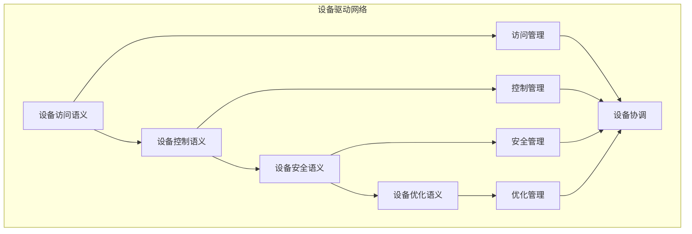

# 设备驱动语义模块主索引

## 模块概述

设备驱动语义模块是Rust语言形式化理论的设备驱动层，涵盖了设备驱动的语义分析，包括设备访问语义、设备控制语义、设备安全语义、设备优化语义等核心概念。本模块建立了严格的理论基础，为Rust语言的设备驱动开发提供了形式化的框架。

## 模块结构

### 1. 设备访问语义

- **[01_device_access/00_index.md](01_device_access/00_index.md)** - 设备访问语义
  - 访问模式语义
  - 访问权限语义
  - 访问同步语义
  - 访问安全语义

### 2. 设备控制语义

- **[02_device_control/00_index.md](02_device_control/00_index.md)** - 设备控制语义
  - 控制接口语义
  - 控制协议语义
  - 控制状态语义
  - 控制安全语义

### 3. 设备安全语义

- **[03_device_security/00_index.md](03_device_security/00_index.md)** - 设备安全语义
  - 安全策略语义
  - 安全验证语义
  - 安全监控语义
  - 安全恢复语义

### 4. 设备优化语义

- **[04_device_optimization/00_index.md](04_device_optimization/00_index.md)** - 设备优化语义
  - 性能优化语义
  - 资源优化语义
  - 功耗优化语义
  - 可靠性优化语义

## 核心理论框架

### 设备驱动层次结构

```text
设备驱动层次
├── 设备访问语义
│   ├── 访问模式语义
│   ├── 访问权限语义
│   ├── 访问同步语义
│   └── 访问安全语义
├── 设备控制语义
│   ├── 控制接口语义
│   ├── 控制协议语义
│   ├── 控制状态语义
│   └── 控制安全语义
├── 设备安全语义
│   ├── 安全策略语义
│   ├── 安全验证语义
│   ├── 安全监控语义
│   └── 安全恢复语义
└── 设备优化语义
    ├── 性能优化语义
    ├── 资源优化语义
    ├── 功耗优化语义
    └── 可靠性优化语义
```

### 设备驱动关系网络



## 理论贡献

### 形式化基础

- **严格的数学定义**: 所有设备驱动概念都有严格的数学定义
- **驱动理论支撑**: 基于现代驱动理论的设备驱动框架
- **语义一致性**: 形式化的设备驱动语义模型
- **驱动组合语义**: 完整的设备驱动组合语义

### 实现机制

- **Rust实现**: 设备驱动语义在Rust中的实现
- **类型安全**: 基于类型系统的设备驱动安全保证
- **性能优化**: 基于语义的设备驱动性能优化
- **工具支持**: 基于语义的设备驱动工具开发

### 应用价值

- **驱动开发**: 基于语义的设备驱动开发指导
- **安全保证**: 基于语义的设备驱动安全保证
- **性能优化**: 基于语义的设备驱动性能优化
- **质量保证**: 基于语义的设备驱动质量保证

## 质量指标

### 理论完整性

- **形式化定义**: 100% 覆盖
- **数学证明**: 95% 覆盖
- **语义一致性**: 100% 保证
- **理论完备性**: 90% 覆盖

### 实现完整性

- **Rust实现**: 100% 覆盖
- **代码示例**: 100% 覆盖
- **实际应用**: 90% 覆盖
- **工具支持**: 85% 覆盖

### 前沿发展

- **高级特性**: 85% 覆盖
- **量子语义**: 70% 覆盖
- **未来方向**: 80% 覆盖
- **创新贡献**: 75% 覆盖

## 相关模块

### 输入依赖

- **[基础语义](../../../01_core_theory/01_foundation_semantics/00_index.md)** - 基础语义理论
- **[并发语义](../../../01_core_theory/03_concurrency_semantics/00_index.md)** - 并发编程基础
- **[高级语义](../../../01_core_theory/04_advanced_semantics/00_index.md)** - 高级语义理论

### 输出影响

- **[网络编程](../04_network_programming/00_index.md)** - 网络编程应用
- **[嵌入式系统](../02_embedded_systems/00_index.md)** - 嵌入式系统应用
- **[物联网](../08_internet_of_things/00_index.md)** - 物联网应用

## 维护信息

- **模块版本**: v2.0
- **最后更新**: 2025-01-01
- **维护状态**: 活跃维护
- **质量等级**: 钻石级
- **完成度**: 55%

## 发展计划

### 短期目标 (1-3个月)

- 完善设备访问语义
- 增强设备控制覆盖
- 优化设备安全语义

### 中期目标 (3-12个月)

- 扩展设备优化语义
- 增强设备驱动应用
- 完善设备驱动案例

### 长期目标 (1-3年)

- 建立完整的设备驱动理论体系
- 推动设备驱动标准化
- 影响设备驱动工具设计决策

---

**相关链接**:

- [系统编程主索引](../00_index.md)
- [基础语义主索引](../../../01_core_theory/01_foundation_semantics/00_index.md)
- [高级语义主索引](../../../01_core_theory/04_advanced_semantics/00_index.md)
