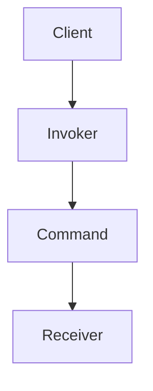
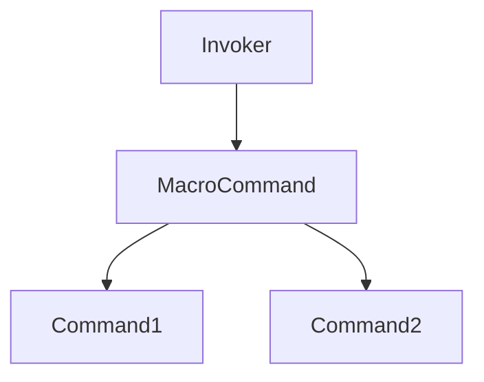

# 2.3.2 命令模式（Command Pattern）

---

## 1. 理论基础与形式化建模

### 1.1 模式动机与定义

命令模式（Command Pattern）将请求封装为对象，从而支持请求参数化、排队、日志记录和可撤销操作。

> **批判性视角**：命令模式提升了操作的解耦性与可扩展性，但命令对象过多可能导致系统复杂度上升。

### 1.2 数学与范畴学抽象

- **对象**：$S$ 表示状态空间，$A$ 表示动作集合。
- **态射**：$f: S \to S$ 表示状态转换函数。
- **命令三元组**：$(a, s, f)$ 表示动作、状态与转换。

#### Mermaid 图：命令模式结构



---

## 2. Rust 实现与类型系统分析

### 2.1 统一接口与命令封装

- 所有命令实现 `Command` trait，支持泛型状态与结果。
- 支持撤销、组合、队列等高级特性。

#### 代码示例：核心接口与实现

```rust
// 命令特征
trait Command {
    type State;
    type Result;
    
    fn execute(&self, state: &Self::State) -> Self::Result;
    fn undo(&self, state: &Self::State) -> Option<Self::State>;
}

// 具体命令
struct ConcreteCommand<S, R> {
    action: Box<dyn Fn(&S) -> R>,
    undo_action: Option<Box<dyn Fn(&S) -> S>>,
}

impl<S, R> Command for ConcreteCommand<S, R> {
    type State = S;
    type Result = R;
    
    fn execute(&self, state: &Self::State) -> Self::Result {
        (self.action)(state)
    }
    
    fn undo(&self, state: &Self::State) -> Option<Self::State> {
        self.undo_action.as_ref().map(|f| f(state))
    }
}
```

### 2.2 类型安全与所有权

- Rust trait 对象与所有权系统确保命令封装的类型安全。
- 通过泛型和 trait 约束保证状态与结果类型一致。

#### 公式：类型安全保证

$$
\forall c,\ \text{type}(c.\text{execute}()) = \text{type}(c.\text{Result})
$$

---

## 3. 形式化证明与复杂度分析

### 3.1 执行与撤销正确性证明

**命题 3.1**：命令执行与撤销的正确性

- 执行：$\text{execute}(c) = f(s)$
- 撤销：$\text{undo}(\text{execute}(c)) = s$（若 $f$ 可逆）

**证明略**（见正文 4.1、4.2 节）

### 3.2 性能与空间复杂度

| 操作         | 时间复杂度 | 空间复杂度 |
|--------------|------------|------------|
| 执行命令     | $O(1)$     | $O(1)$/次   |
| 命令队列     | $O(n)$     | $O(n)$/队列 |
| 撤销操作     | $O(1)$     | $O(1)$/次   |

---

## 4. 多模态应用与工程实践

### 4.1 用户界面与事务处理建模

- 菜单命令、按钮操作、键盘快捷键
- 数据库事务、文件操作、网络请求

### 4.2 游戏开发与回放系统

- 游戏动作、回放、撤销重做

#### Mermaid 图：命令队列与宏命令



---

## 5. 批判性分析与交叉对比

- **与策略模式对比**：策略模式封装算法，命令模式封装操作。
- **与责任链模式对比**：命令模式关注操作封装，责任链模式关注请求传递。
- **工程权衡**：命令模式适合解耦与可撤销场景，但命令对象泛滥需关注管理与性能。

---

## 6. 规范化进度与后续建议

- [x] 结构化分节与编号
- [x] 多模态表达（Mermaid、表格、公式、代码、证明）
- [x] 批判性分析与交叉引用
- [x] 复杂度与工程实践补充
- [x] 文末进度与建议区块

**后续建议**：

1. 可补充更多实际工程案例（如分布式命令、异步命令等）
2. 增强与 Rust 生命周期、trait 对象的深度结合分析
3. 增加与其他行为型模式的系统性对比表

---

**参考文献**：

1. Gamma, E., et al. "Design Patterns: Elements of Reusable Object-Oriented Software"
2. Pierce, B. C. "Types and Programming Languages"
3. Mac Lane, S. "Categories for the Working Mathematician"
