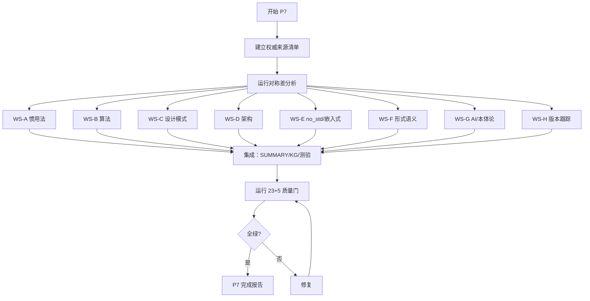

# P7 语义完备化与国际权威对齐冲刺计划

**EN**: P7 Semantic Completeness & International Authority Alignment Sprint
**Summary**: Systematically close symmetric differences between local Rust knowledge base and authoritative international sources (official books, RFCs, academic formalizations, embedded ecosystem), focusing on idioms, algorithms, design/architecture patterns, no_std/hardware, formal semantics, and AI/ontology semantics.

> **Rust 版本**: 1.97.0+ / 1.98 beta (Edition 2024)
> **计划日期**: 2026-08-04
> **前置状态**: P6 已完成，23 阻断门 + 5 语义观察门全绿，KG 692 entities / 10352 relations，generic_ratio=0.00%
> **治理依据**: AGENTS.md §2 Canonical、§3 去重、§5 质量门、§6 红线

---

## 一、P7 核心目标

1. **识别对称差**：将本地 `concept/`、`docs/`、`content/` 与国际化权威来源做系统比对，输出主题对称差、语义对称差、覆盖缺口。
2. **补齐权威缺口**：在 `concept/` 中新增/增强权威页，确保每个关键主题都有单一权威来源。
3. **强化语义表征**：为每个新增/增强主题补充思维导图、多维矩阵、决策树、反例、计算等价/形式语义分析。
4. **保持质量门全绿**：新增内容必须过 23 阻断门 + 5 观察门；KG 刷新后 generic_ratio 维持 0%。
5. **建立可持续机制**：形成季度国际来源语义抽样审计的基线数据与工具链。

---

## 二、国际化权威来源清单（P7 对齐基线）

| 领域 | 权威来源 | 本地对应位置 | 主要对称差风险 |
|---|---|---|---|
| **语言核心/TRPL** | [The Rust Programming Language](https://doc.rust-lang.org/book/) (2024 edition) | `concept/01_foundation/` ~ `03_advanced/` | 1.98 新特性、临时作用域、async 闭包细节 |
| **语言参考** | [The Rust Reference](https://doc.rust-lang.org/reference/) | 各权威页引用 | (unsafe extern, edition 2024 精确规则) |
| **Unsafe/Nomicon** | [The Rustonomicon](https://doc.rust-lang.org/nomicon/) | `concept/03_advanced/02_unsafe/` | 内存模型、aliasing、validity 最新文档 |
| **API 指南/惯用法** | [Rust API Guidelines](https://rust-lang.github.io/api-guidelines/) + [Rust Design Patterns](https://rust-unofficial.github.io/patterns/) | `concept/06_ecosystem/03_design_patterns/02_idioms_spectrum.md` | 命名、类型转换、错误处理、C-API 接口 |
| **算法与数据结构** | [Rust Algorithm Club](https://github.com/weihanglo/rust-algorithm-club) + CLRS/ Sedgewick | `concept/06_ecosystem/16_algorithm_patterns/` | 复杂度证明、no_std 算法、SIMD/并行变体 |
| **设计模式** | GoF + [design-patterns-rust](https://github.com/fadeevab/design-patterns-rust) + [Refactoring Guru Rust](https://refactoring.guru/design-patterns/rust) | `concept/06_ecosystem/03_design_patterns/` | 23 个 GoF 模式逐一 Rust 语义映射 |
| **架构模式** | [Azure Architecture Center](https://learn.microsoft.com/azure/architecture/) + [AWS Well-Architected](https://docs.aws.amazon.com/wellarchitected/latest/framework/welcome.html) + DDD 参考 | `concept/06_ecosystem/14_enterprise_architecture/` | 云原生/SRE/可观测性/事件驱动 |
| **异步** | [Asynchronous Programming in Rust](https://rust-lang.github.io/async-book/) | `concept/03_advanced/01_async/` | async fn 精确捕获、async 闭包 |
| **嵌入式/no_std** | [The Embedded Rust Book](https://docs.rust-embedded.org/book/) + [Embassy Book](https://embassy.dev/book/) + [Knurling Books](https://knurling-books.org/) | `concept/06_ecosystem/05_systems_and_embedded/` | 硬件实测、probe-rs、defmt、Embassy |
| **Cargo/工具链** | [The Cargo Book](https://doc.rust-lang.org/cargo/) + rust-lang blog | `concept/06_ecosystem/01_cargo/` | resolver v3、lockfile-path、build.warnings |
| **FFI/链接** | [The Rust FFI Omnibus](https://jakegoulding.com/rust-ffi-omnibus/) + Reference Linkage | `concept/03_advanced/04_ffi/` | repr(transparent) 1.98 严格规则 |
| **形式语义** | RustBelt (Jung et al.), Aeneas (Ho & Protzenko), Patina, Oxide, MiniRust, Prusti, Kani | `concept/04_formal/` | 计算等价、操作语义、内存模型 |
| **并发/并行/分布式** | Herlihy & Shavit, Paxos/Raft papers, Rust atomics book | `concept/03_advanced/00_concurrency/` | Send/Sync 边界、内存序、分布式一致性 |
| **版本/release notes** | [Rust release notes](https://releases.rs/) + rust-lang/blog + GitHub rust-lang/rust releases | `concept/07_future/00_version_tracking/` | 1.98/1.99/1.100 特性语义注入 |
| **AI/LLM/语义工程** | OWL2/SKOS/SHACL W3C specs, GraphRAG papers, LLM+KG surveys | `concept/00_meta/` + `tools/kg_*` | 本体论对齐、LLM 语义检索、KG 谓词精度 |

---

## 三、对称差分析方法

### 3.1 主题对称差（Subject Symmetric Difference）

对权威来源的目录/索引与本地 `concept/SUMMARY.md` 做集合运算：

- **仅存在于权威来源**（本地缺口）：需新增权威页或重定向 stub。
- **仅存在于本地**（本地原创）：需评估是否应保留或迁移到更合适位置。
- **交集**：逐页检查深度、反例、形式化、最新版本覆盖是否对齐。

工具：手工对照 + `scripts/check_authority_freshness.py`（网络依赖，观察门）。

### 3.2 语义对称差（Semantic Symmetric Difference）

对同一概念在权威来源与本地页中的定义、示例、边界条件做差异分析：

- **定义差异**：术语、前提条件、保证范围。
- **示例差异**：权威来源是否有本地未覆盖的代码模式。
- **版本差异**：权威来源是否反映 Edition 2024 / 1.97 / 1.98 新语义。
- **形式化差异**：权威来源是否有 operational semantics / typing rules 而本地只有直觉解释。

输出格式：每主题一张「语义对齐表」，列：维度、本地状态、权威来源状态、差异、修复动作。

### 3.3 计算/系统/架构语义对齐

从计算语义模型视角，补充：

- **计算等价**：同一算法/模式在 Rust 中的多种实现是否观察等价（operational / denotational equivalence）。
- **形式语言视角**：Rust 类型系统作为形式系统的可判定性、图灵完备性、表达能力边界。
- **系统语义**：并发/并行/异步/分布式在 Rust 中的语义映射（内存模型、 happens-before、消息传递、一致性模型）。
- **软件架构语义**：设计模式/架构模式的形式化描述（角色、责任、交互协议、不变量）。
- **企业架构语义**：DDD、微服务、事件驱动、CQRS、SAGA 等在 Rust 生态中的实现与权衡。

---

## 四、P7 工作流（Work Streams）

### WS-A: 惯用法全景与国际权威对齐

**目标**：将本地惯用法页扩展为覆盖官方 API Guidelines + Rust Design Patterns Idioms 的全景。

**新增/增强文件**：

1. `concept/06_ecosystem/03_design_patterns/02_idioms_spectrum.md`（增强）
   - 补充 [Rust API Guidelines](https://rust-lang.github.io/api-guidelines/) 中的 C-COMMON-CONVENTIONS、C-CONVENIENT、C-EXPORTED、C-COLLECTOR 等命名与接口惯用法。
   - 补充 [Rust Design Patterns Idioms](https://rust-unofficial.github.io/patterns/idioms/) 中的 `Default`, `Into`, `AsRef`, `Borrow`, `Deref`, `Drop` 惯用法。
   - 新增「错误处理惯用法」「集合惯用法」「FFI/C-API 惯用法」「宏惯用法」小节。

2. `concept/06_ecosystem/03_design_patterns/48_api_guidelines_idioms.md`（新增）
   - 覆盖 API Guidelines 的 30 条核心建议，每条给出 Rust 代码示例、反例、语义理由。

**输出**：语义对齐表 `reports/IDIOMS_AUTHORITY_ALIGNMENT_2026_08.md`。

### WS-B: 算法与数据结构语义图谱

**目标**：对齐 CLRS/Sedgewick/Rust Algorithm Club，补充复杂度证明、no_std 变体、SIMD/并行变体。

**新增/增强文件**：

1. `concept/06_ecosystem/16_algorithm_patterns/00_algorithm_patterns_overview.md`（增强）
   - 新增「算法语义分类学」：分治、贪心、动态规划、回溯、分支限界、随机化、近似、在线/流式。
   - 新增「计算等价」视角：同一问题的迭代 vs 递归实现观察等价证明。

2. `concept/06_ecosystem/16_algorithm_patterns/02_data_structures_in_rust.md`（新增）
   - 链表、栈、队列、堆、B-树、跳表、并查集、线段树、Trie 的 Rust 实现语义分析。
   - 强调所有权感知实现、自定义 allocator、no_std 适配。

3. `concept/06_ecosystem/16_algorithm_patterns/18_competitive_programming_idioms.md`（新增）
   - 快读/快写、宏模板、输入解析惯用法、常见题型 Rust 模式。

**输出**：语义对齐表 `reports/ALGORITHMS_AUTHORITY_ALIGNMENT_2026_08.md`。

### WS-C: 设计模式 GoF → Rust 语义映射

**目标**：23 个 GoF 模式在 Rust 中的完整语义映射，包含实现、变体、权衡、反例。

**新增/增强文件**：

1. `concept/06_ecosystem/03_design_patterns/47_rust_design_and_architecture_patterns_semantic_atlas.md`（增强）
   - 将 GoF 23 模式按创建型、结构型、行为型分类，逐一给出 Rust 实现。
   - 新增「Rust 特化模式」：类型状态模式、访问者 enum 模式、RAII 守卫模式、零大小类型模式。

2. `concept/06_ecosystem/03_design_patterns/49_gof_patterns_in_rust.md`（新增）
   - 23 个模式速查表 + 每个模式 1 页深度页（或链接到现有细分页）。

**输出**：语义对齐表 `reports/DESIGN_PATTERNS_AUTHORITY_ALIGNMENT_2026_08.md`。

### WS-D: 架构模式与企业级语义

**目标**：扩展企业架构/SRE/可观测性/云原生/事件驱动内容。

**新增/增强文件**：

1. `concept/06_ecosystem/14_enterprise_architecture/09_observability_and_sre_patterns.md`（已部分扩展，继续增强）
   - 补充 OpenTelemetry、Prometheus、Grafana、Jaeger、Loki 在 Rust 中的实现模式。
   - 补充 SLO/SLI/错误预算、混沌工程、容量规划。

2. `concept/06_ecosystem/14_enterprise_architecture/11_event_driven_and_cqrs_patterns.md`（新增）
   - 事件溯源、CQRS、SAGA、Outbox、CDC、消息队列语义。

3. `concept/06_ecosystem/14_enterprise_architecture/12_cloud_native_and_serverless_patterns.md`（新增）
   - 容器化、Kubernetes 部署模式、serverless Rust（AWS Lambda、wasmCloud）、服务网格 sidecar。

**输出**：语义对齐表 `reports/ARCHITECTURE_AUTHORITY_ALIGNMENT_2026_08.md`。

### WS-E: no_std / 裸机 / 嵌入式硬件实测

**目标**：从文档走向可编译、可模拟/可硬件验证的 no_std 知识体系。

**新增/增强文件**：

1. `concept/06_ecosystem/05_systems_and_embedded/38_no_std_bare_metal_rust.md`（增强）
   - 补充 `build-std`、panic handler、global allocator、custom test framework。
   - 新增「QEMU 仿真运行」「硬件目标实测」附录。

2. `concept/06_ecosystem/05_systems_and_embedded/45_embedded_hardware_validation.md`（新增）
   - 使用 `probe-rs` + `defmt` + `embassy` 在真实硬件（或 QEMU）上做端到端验证。
   - 包含最小可运行示例与预期输出。

3. `concept/06_ecosystem/05_systems_and_embedded/46_rtos_and_scheduling_in_rust.md`（新增）
   - RTIC、Tock、Hubris、Embassy 调度模型对比。

**输出**：语义对齐表 `reports/EMBEDDED_AUTHORITY_ALIGNMENT_2026_08.md`。

### WS-F: 形式语义与计算等价

**目标**：强化形式语义、计算等价、操作语义、内存模型、类型理论内容。

**新增/增强文件**：

1. `concept/04_formal/00_type_theory/11_formal_design_pattern_theory.md`（增强）
   - 补充 Felleisen 表达力理论、观察等价、上下文等价、操作语义基础。

2. `concept/04_formal/08_algorithm_semantics/05_algorithm_equivalence.md`（增强）
   - 补充「迭代 vs 递归观察等价」「尾递归优化语义」「并行前缀和语义」。

3. `concept/04_formal/10_architecture_semantics/02_architecture_pattern_semantics.md`（增强）
   - 架构模式的进程代数 / 状态机 / Petri 网形式化描述。

4. `concept/04_formal/11_computational_models/01_computational_equivalence_in_rust.md`（新增）
   - Rust 可计算性、图灵完备性、类型系统图灵完备性、停机问题不可判定性。
   - 安全 Rust 与 unsafe Rust 的表达力差异。

**输出**：语义对齐表 `reports/FORMAL_SEMANTICS_AUTHORITY_ALIGNMENT_2026_08.md`。

### WS-G: AI × 语义工程 / 本体论

**目标**：将 KG 与 LLM/语义检索/本体工程对齐，形成可演化的语义基础设施。

**新增/增强文件**：

1. `concept/00_meta/00_framework/kg_ontology_v2.md`（已扩展，继续增强）
   - 补充 OWL2/SKOS/SHACL 映射、LLM 语义检索架构、GraphRAG 模式。
   - 定义 `ex:explainedByLLM`、`ex:verifiedByCompiler`、`ex:derivedFromRFC` 等谓词。

2. `concept/00_meta/00_framework/semantic_space.md`（新增，继承归档 PLAN_Semantic_Space_Wave.md）
   - 实现 Wave 11 计划的核心交付物：Rust 表征空间总论。

3. `tools/kg_rag/llm_semantic_retriever.py`（新增或增强）
   - 基于 KG 的 RAG 检索器原型，支持 concept/ 权威页的语义检索。

**输出**：语义对齐表 `reports/AI_ONTOLOGY_AUTHORITY_ALIGNMENT_2026_08.md`。

### WS-H: 版本跟踪与最新特性语义注入

**目标**：保持 Rust 1.98/1.99/1.100 版本跟踪与国际 release notes 同步。

**新增/增强文件**：

1. `concept/07_future/00_version_tracking/rust_1_99_preview.md`（如不存在则新增，存在则增强）
2. `concept/07_future/00_version_tracking/rust_1_100_preview.md`（如不存在则增强）
3. 向相关 `concept/` 权威页注入 1.98/1.99/1.100 特性小节与双向链接。

**输出**：语义对齐表 `reports/VERSION_AUTHORITY_ALIGNMENT_2026_08.md`。

---

## 五、执行顺序与依赖

**并行策略**：WS-A~H 可独立推进；每个 WS 内部按「先新增权威页 → 再补思维表征/反例/决策树 → 再刷新 KG」顺序。

---

## 六、验收标准

1. 每个 WS 至少输出 1 份语义对齐表（`reports/*_AUTHORITY_ALIGNMENT_2026_08.md`）。
2. 新增/增强文件必须通过 23 阻断门 + 5 观察门。
3. KG 刷新后：`generic_ratio=0.00%`，entities ≥ 700，relations ≥ 10500。
4. `concept/` 内容页 mindmap 覆盖率 ≥ 100%，反例存在率 ≥ 97%。
5. 新增权威页必须包含 EN 标题、Summary、Rust 版本、Bloom 层级、权威来源声明。
6. 新增代码块必须标注 `compile_fail`/`should_panic`/`nostd`/`dep` 等，并过 `check_concept_code_blocks.py`。
7. 版本跟踪页与权威页双向链接覆盖率 100%（含 1.98/1.99/1.100）。

---

## 七、风险与红线

- **红线 1**：禁止新增重复权威页；新增前必须运行 `detect_content_overlap.py`。
- **红线 2**：禁止在 `book/`、`tmp/` 创建持久内容。
- **红线 3**：禁止未经验证的「完成」声明；所有 100% 结论必须附质量门日志。
- **风险 1**：网络依赖检查（authority freshness）可能因网络波动失败，仅作为观察输入，不纳入阻断门。
- **风险 2**：no_std 硬件实测依赖真实硬件或 QEMU，如环境不可用则改用 `build-std` + `cargo check --target thumbv7m-none-eabi` 验证。
- **风险 3**：子代理 API 可能 403，大规模内容创建将优先本地编辑。

---

## 八、即时下一步（第 1 轮并行任务）

| # | 任务 | 负责人 | 交付物 |
|---|---|---|---|
| 1 | 建立权威来源清单与本地映射表 | main | `reports/P7_AUTHORITY_SOURCE_INVENTORY_2026_08_04.md` |
| 2 | 对 `02_idioms_spectrum.md` 做 API Guidelines 语义注入 | main | 增强后的 `02_idioms_spectrum.md` |
| 3 | 创建 `semantic_space.md`（继承 Wave 11 计划） | main | `concept/00_meta/00_framework/semantic_space.md` |
| 4 | 创建 `01_computational_equivalence_in_rust.md` | main | `concept/04_formal/11_computational_models/01_computational_equivalence_in_rust.md` |
| 5 | 更新 1.99/1.100 版本跟踪页 | main | `concept/07_future/00_version_tracking/rust_1_99_preview.md` + `rust_1_100_preview.md` |
| 6 | 刷新 KG 与 SUMMARY（每轮内容新增后） | main | KG 规模报告、SUMMARY 更新 |

---

## 九、待用户确认事项

请从以下选项中选择推进方式：

1. **全部推进**：按 WS-A~H 全部并行执行，直到完成 100%。
2. **优先推进关键 WS**：仅 WS-A（惯用法）、WS-C（设计模式）、WS-E（no_std/硬件）、WS-F（形式语义）。
3. **先完成基础设施**：先完成权威来源清单、semantic_space.md、计算等价页、KG 刷新，再分 WS 推进。
4. **用户指定优先级**：请告诉我您希望优先哪个 WS。

默认推荐：**1. 全部推进**。
