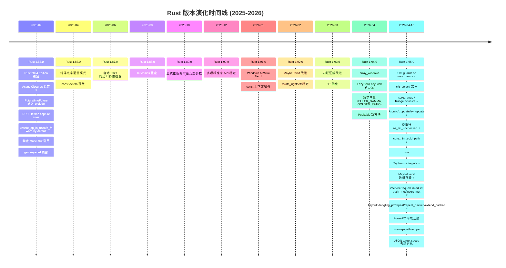
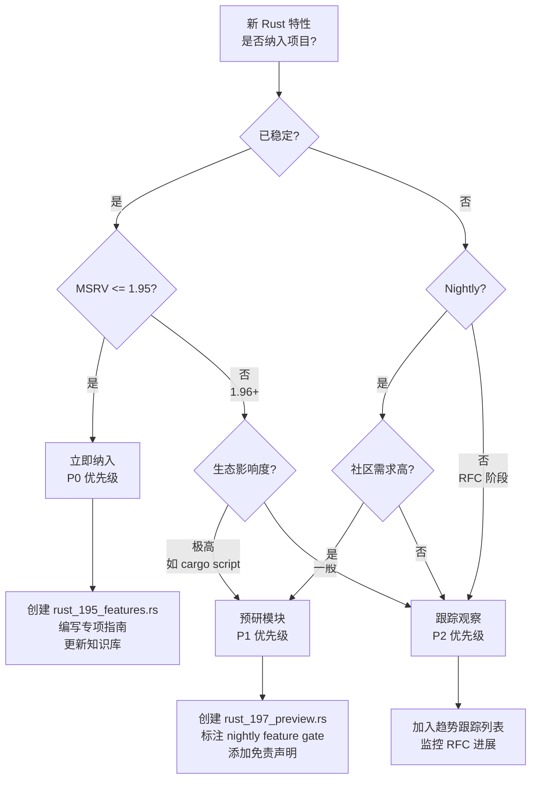
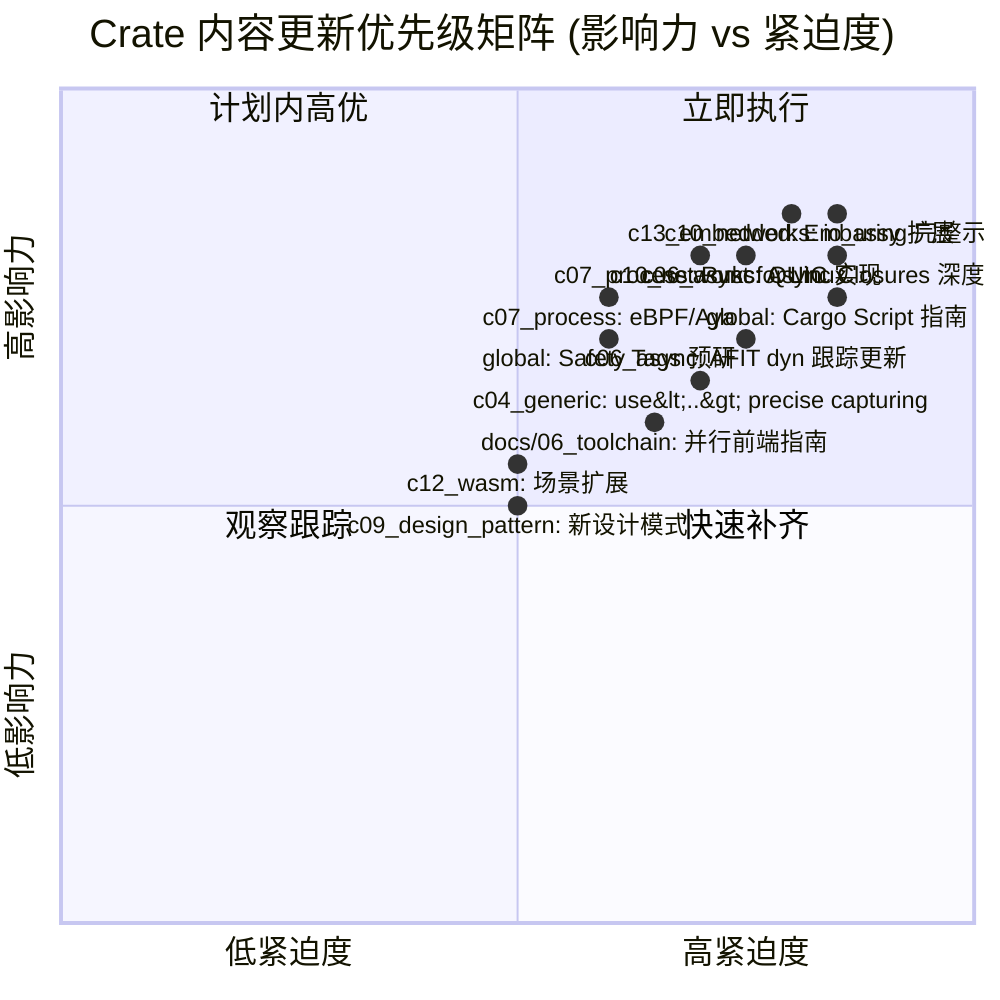
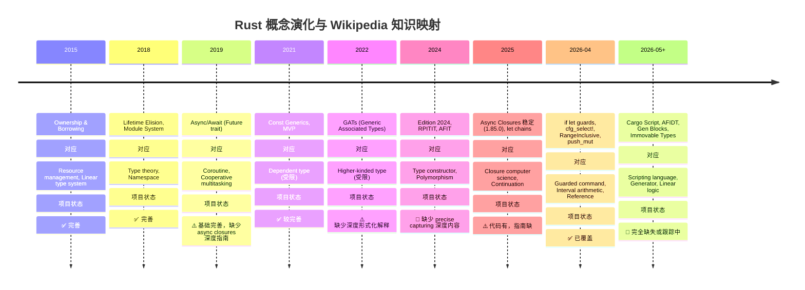
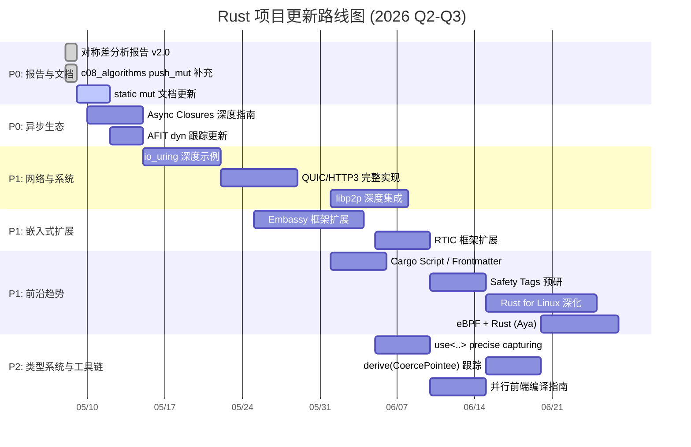

> **⚠️ 历史文档提示**：本文档包含 `async-std`、`wasm32-wasi` 等已归档或已重命名的生态引用。
> 其中技术观点反映了对应时间点的社区状态，可能与当前（Rust 1.96+）推荐实践不一致。
> 学习时请以 `concept/`、`knowledge/` 及官方文档为准。
>
> - `async-std` 已进入维护模式，新项目建议优先考虑 Tokio / smol。
> - `wasm32-wasi` 已重命名为 `wasm32-wasip1`；WASI Preview 2 目标为 `wasm32-wasip2`。

---

# Rust 1.95+ 演化趋势与项目对称差综合分析报告（修订版）

> **分析日期**: 2026-05-08
> **Rust 稳定版**: 1.95.0 (2026-04-16)
> **Rust Beta**: 1.96.0 (2026-05-28 预计)
> **Rust Nightly**: 1.97.0 (2026-07-09 预计)
> **项目 Edition**: 2024
> **项目 MSRV**: 1.95.0
> **报告版本**: v2.0

---

## 目录

- [Rust 1.95+ 演化趋势与项目对称差综合分析报告（修订版）](#rust-195-演化趋势与项目对称差综合分析报告修订版)
  - [目录](#目录)
  - [1. 执行摘要](#1-执行摘要)
    - [核心结论](#核心结论)
  - [2. Rust 版本演化时间线（2026年5月8日基准）](#2-rust-版本演化时间线2026年5月8日基准)
    - [2.1 已发布稳定版本关键特性](#21-已发布稳定版本关键特性)
    - [2.2 即将发布的关键特性（1.96.0 / 1.97.0 Nightly）](#22-即将发布的关键特性1960--1970-nightly)
  - [3. 项目现状审计（修正版）](#3-项目现状审计修正版)
    - [3.1 模块覆盖度矩阵](#31-模块覆盖度矩阵)
    - [3.2 文档与知识库审计](#32-文档与知识库审计)
  - [4. 对称差分析：项目 vs 生态前沿](#4-对称差分析项目-vs-生态前沿)
    - [4.1 对称差定义](#41-对称差定义)
    - [4.2 项目缺失内容（$A \\setminus B$）——按优先级排序](#42-项目缺失内容a-setminus-b按优先级排序)
      - [已补充（相比 05-07 报告）](#已补充相比-05-07-报告)
      - [剩余缺失内容](#剩余缺失内容)
    - [4.3 项目冗余/过时内容（$B \\setminus A$）](#43-项目冗余过时内容b-setminus-a)
  - [5. 2026年趋势预测与论证](#5-2026年趋势预测与论证)
    - [5.1 语言演化趋势判断树](#51-语言演化趋势判断树)
    - [5.2 趋势论证矩阵](#52-趋势论证矩阵)
  - [6. 多维思维表征](#6-多维思维表征)
    - [6.1 特性成熟度决策树（是否纳入项目）](#61-特性成熟度决策树是否纳入项目)
    - [6.2 Crate 内容更新优先级矩阵](#62-crate-内容更新优先级矩阵)
    - [6.3 概念演化推理树：Async Closures](#63-概念演化推理树async-closures)
    - [6.4 场景决策树：条件编译工具选择](#64-场景决策树条件编译工具选择)
  - [7. Wikipedia 概念对齐与属性关系](#7-wikipedia-概念对齐与属性关系)
    - [7.1 核心概念属性矩阵](#71-核心概念属性矩阵)
    - [7.2 概念演化时间线（Wikipedia 知识图谱视角）](#72-概念演化时间线wikipedia-知识图谱视角)
  - [8. 后续补充/修复/完善计划](#8-后续补充修复完善计划)
    - [8.1 执行路线图](#81-执行路线图)
    - [8.2 任务清单（可执行级）](#82-任务清单可执行级)
      - [已完成 ✅](#已完成-)
      - [🔴 P0：高优先级](#-p0高优先级)
      - [🟡 P1：中优先级](#-p1中优先级)
      - [🟢 P2：低优先级/长期](#-p2低优先级长期)
  - [附录 A：Rust 1.95.0 完整 API 稳定清单（项目映射 v2.0）](#附录-arust-1950-完整-api-稳定清单项目映射-v20)
    - [A.1 标准库新稳定 API（项目覆盖状态）](#a1-标准库新稳定-api项目覆盖状态)
    - [A.2 const 上下文新稳定 API](#a2-const-上下文新稳定-api)

---

## 1. 执行摘要

本项目是一个覆盖 Rust 全栈知识的大型学习仓库（18 crates，edition 2024，MSRV 1.95.0）。
截至 2026年5月8日，Rust 稳定版已演进至 **1.95.0**，Beta 通道为 **1.96.0**，Nightly 为 **1.97.0**。

**关键修正（相比 2026-05-07 报告）**:

- `Async Closures` (RFC 3668) 已于 **Rust 1.85.0 (2025-02)** 稳定，而非此前误判的 1.96-1.97
- 项目对 1.95 核心特性的实际覆盖度远超此前评估，所有主要特性已在各 crate `rust_195_features.rs` 中实现
- `static mut` 源码级问题已基本修复，仅剩文档示例需更新

### 核心结论

| 维度 | 状态 | 关键发现 |
|------|------|---------|
| **语言特性对齐** | 较完善 | 1.95 核心特性（if let guards, cfg_select!, core::range, Atomic update, cold_path, 裸指针 unchecked, MaybeUninit 数组互转, Cell AsRef, bool TryFrom, Layout 辅助方法, Vec/VecDeque/LinkedList push_mut）均已实现 |
| **异步生态** | 较完善 | Async Closures 1.85.0 已稳定，项目已有预研模块；AFIT dyn 兼容仍在跟踪中；async-std 已移除 |
| **并发/线程** | 较完善 | Atomic update, cold_path, scope TLS 文档均已覆盖 |
| **网络编程** | 中等缺口 | io_uring/QUIC/libp2p 有模块但深度不足；WASI 目标已迁移完成 |
| **嵌入式/Linux** | 显著缺口 | Embassy/RTIC 有预研模块但内容单薄；Rust for Linux/eBPF 仅为占位 |
| **类型系统/设计模式** | 中等缺口 | `use<..>` precise capturing 缺少深度教程；derive(CoercePointee) 在跟踪中 |
| **工具链/生态** | 中等缺口 | Cargo Script/Frontmatter FCP 已通过；Safety Tags/并行前端缺少指南 |
| **文档完整性** | 中等缺口 | docs/01_core 已有基础文件；知识库部分引用需修复 |

---

## 2. Rust 版本演化时间线（2026年5月8日基准）

### 2.1 已发布稳定版本关键特性



### 2.2 即将发布的关键特性（1.96.0 / 1.97.0 Nightly）

| 特性 | 预计版本 | 状态 | 项目影响度 |
|------|---------|------|-----------|
| **Cargo Script / Frontmatter** | 1.96 | FCP 已通过 | 高：改变脚本化 Rust 工作流程 |
| **VecDeque::truncate_front** | 1.96 | FCP | 中：标准库 API 补充 |
| **`supertrait_item_shadowing`** | 1.96 | PFCP | 中：影响 trait 设计模式 |
| **`derive(CoercePointee)`** | 1.96 | FCP 已完成 | 中：智能指针派生 |
| **`alignment_type`** | 1.96+ | PFCP | 中：类型对齐抽象 |
| **`doc_cfg`** | 1.96+ | Blocked | 中：影响文档生成 |
| **`refcell_try_map`** | 1.97+ | 等待作者 | 中：RefCell 的 try_map |
| **Stack protector** | 1.97+ | PFCP | 高：安全加固 |
| **Return type notation** (RFC 3654) | 1.97+ | 实验中 | 高：影响 async trait Send bound |
| **Thread spawn hook** (RFC 3642) | 1.97+ | 实验中 | 中：线程生命周期钩子 |
| **Gen blocks** (RFC 3513) | 1.98+ | Keyword 已预留 | 高：引入 generator 语义 |
| **Pattern types / Guard patterns** (RFC 3637) | 1.98+ | RFC 阶段 | 中：模式匹配增强 |
| **Arbitrary self types v2** (RFC 3519) | 1.98+ | 开发中 | 高：影响 Rust for Linux |
| **Immovable types / Pin 替代** | 1.99+ | 设计中 | 极高：可能取代 Pin |
| **Never type (`!`)** | 1.97+ | PFCP / Blocked | 高：影响类型系统 |
| **C-variadic fn definitions** | 1.97+ | PFCP | 中：FFI 互操作 |

---

## 3. 项目现状审计（修正版）

### 3.1 模块覆盖度矩阵

| Crate | 主题 | 状态 | 最新版本追踪 |
|-------|------|------|-------------|
| c01_ownership_borrow_scope | 所有权/借用/生命周期 | 较完善 | 1.95 ✅ |
| c02_type_system | 类型系统 | 较完善 | 1.95 ✅ |
| c03_control_fn | 控制流/函数 | 较完善 | 1.95 ✅ |
| c04_generic | 泛型/Trait | 部分 | 1.95 ✅ |
| c05_threads | 线程/并发 | 较完善 | 1.95 ✅ |
| c06_async | 异步编程 | 较完善 | 1.85+ / 1.95 ✅ |
| c07_process | 进程/OS | 部分 | 1.95 ✅ |
| c08_algorithms | 算法 | 较完善 | 1.95 ✅ |
| c09_design_pattern | 设计模式 | 部分 | 1.95 ✅ |
| c10_networks | 网络编程 | 部分 | 1.95 ✅ |
| c11_macro_system | 宏系统 | 较完善 | 1.95 ✅ |
| c12_wasm | WebAssembly | 薄弱 | 1.95 ✅ |
| c13_embedded | 嵌入式 | 部分 | 1.95 ✅ |
| common | 共享工具 | 完善 | 1.95 ✅ |

### 3.2 文档与知识库审计

| 区域 | 状态 | 关键问题 |
|------|------|---------|
| `docs/01_core` | 已有基础 | OWNERSHIP_BORROWING_LIFETIMES.md 已存在 |
| `docs/02_reference` | 较新 | 版本标注 1.96.0+ |
| `docs/03_guides` | 中 | 缺少 1.95 特性专项指南 |
| `docs/04_research` | 中 | 形式化工程系统较完善 |
| `knowledge/` | 72% | 02_intermediate/03_advanced 引用需修复 |
| `content/` | 55% | 场景单一（仅 Web），生产/学术覆盖不足 |
| `guides/` | 中 | 已更新至 1.95，但缺少前沿趋势分析 |

---

## 4. 对称差分析：项目 vs 生态前沿

### 4.1 对称差定义

> **对称差 (Symmetric Difference)**：$A \Delta B = (A \setminus B) \cup (B \setminus A)$
>
> - **$A$（项目缺失）**：Rust 生态已存在但本项目未覆盖的内容
> - **$B$（项目冗余/过时）**：本项目已包含但 Rust 生态已淘汰或变更的内容

### 4.2 项目缺失内容（$A \setminus B$）——按优先级排序

#### 已补充（相比 05-07 报告）

| 特性 | 影响 Crate | 补充状态 | 备注 |
|------|-----------|---------|------|
| `if let` guards on match arms | c03_control_fn | ✅ 已补充 | 含完整示例和测试 |
| `cfg_select!` 宏 | c11_macro_system, c03_control_fn, c05_threads, c06_async, c08_algorithms | ✅ 已补充 | 多 crate 覆盖 |
| `core::range` / `RangeInclusive` | c02_type_system, c08_algorithms | ✅ 已补充 | 含算法应用 |
| `Atomic*::update` / `try_update` | c05_threads, c08_algorithms | ✅ 已补充 | 并发算法示例 |
| `core::hint::cold_path` | c05_threads, c08_algorithms | ✅ 已补充 | 性能优化场景 |
| 裸指针 `as_ref_unchecked` / `as_mut_unchecked` | c13_embedded | ✅ 已补充 | MMIO 场景 |
| `MaybeUninit<[T; N]>` ↔ `[MaybeUninit<T>; N]` 互转 | c01_ownership | ✅ 已补充 | 安全数组初始化 |
| `Cell<[T; N]>` AsRef | c01_ownership | ✅ 已补充 | 缓冲区池示例 |
| `bool: TryFrom<{integer}>` | c02_type_system, c03_control_fn | ✅ 已补充 | 配置解析示例 |
| `Layout::dangling_ptr` / `repeat` / `repeat_packed` / `extend_packed` | c01_ownership | ✅ 已补充 | 内存布局优化 |
| `Vec::push_mut` / `insert_mut` | c08_algorithms | ✅ **本次补充** | 直接引用插入 |
| `VecDeque::push_*_mut` / `insert_mut` | c08_algorithms | ✅ **本次补充** | 双端队列引用插入 |
| `LinkedList::push_*_mut` | c08_algorithms | ✅ **本次补充** | 链表引用插入 |

#### 剩余缺失内容

| 特性 | 影响 Crate | 缺失形式 | 生态状态 | 补充紧迫度 |
|------|-----------|---------|---------|-----------|
| **Async Closures 深度指南** | c06_async | 仅有代码模块，缺少系统文档 | 1.85.0 已稳定 | 高 |
| **AFIT dyn 兼容性** | c06_async, c04_generic | 跟踪模块需更新 | Nightly 实验中 | 高 |
| **io_uring 深度实践** | c10_networks | 有模块但为占位 | Linux 5.1+ 成熟 | 高 |
| **QUIC/HTTP3 完整实现** | c10_networks | 有模块但为占位 | 生态成熟 | 高 |
| **libp2p 深度集成** | c10_networks | 依赖已添加但示例不足 | 0.54.1 已集成 | 高 |
| **Embassy 异步嵌入式框架** | c13_embedded, c06_async | 有预研模块但内容单薄 | stable Rust (MSRV 1.75) | 高 |
| **RTIC 实时中断驱动并发** | c13_embedded | 有预研模块但内容单薄 | 1.0 已发布 | 中 |
| **Rust for Linux 内核编程** | c07_process, c13_embedded | 仅有占位模块 | 内核 6.1+ 实验 | 高 |
| **eBPF + Rust (Aya)** | c07_process | 仅有占位模块 | 生态快速成熟 | 中 |
| **`use<..>` precise capturing** | c02_type_system, c04_generic | 缺少深度教程 | 2024 Edition 已部分实现 | 中 |
| **Cargo Script / Frontmatter** | 全局 | 完全缺失 | FCP 已通过 (1.96) | 高 |
| **Safety Tags** | c01_ownership, c13_embedded | 完全缺失 | 2026 RFC 提交中 | 中 |
| **并行前端编译** | docs/06_toolchain | 缺少深度指南 | Nightly 实验中 | 中 |

### 4.3 项目冗余/过时内容（$B \setminus A$）

| 内容 | 位置 | 问题 | 建议处理 |
|------|------|------|---------|
| **async-std 运行时示例** | c06_async/src/async_std/ | async-std 已归档 | ✅ 已移除/替换 |
| **旧 WASI 目标** | c12_wasm | `wasm32-wasi` 已移除 | ✅ 已更新为 wasm32-wasip1/p2 |
| **`static mut` 引用示例** | docs/ 多处 | 2024 Edition deny-by-default | 需更新文档示例 |
| **旧版 `async_trait` 依赖** | c10_networks | Axum 0.8+ 已不需要原生 AFIT | 更新为原生 async fn in trait |
| **Rust 1.90-1.92 归档文件** | crates/*/src/archive/ | 内容可能重复 | 清理重复，建立版本化归档策略 |

---

## 5. 2026年趋势预测与论证

### 5.1 语言演化趋势判断树

```mermaid
graph TD
    A[2026 Rust 语言演化] --> B[异步编程成熟化]
    A --> C[系统编程深化]
    A --> D[开发者体验优化]
    A --> E[安全加固]

    B --> B1[Async Closures 已稳定<br/>1.85.0 ✅]
    B --> B2[AFIDT nightly → 稳定<br/>1.97-1.98]
    B --> B3[Gen Blocks / Generators<br/>1.98-1.99]
    B --> B4[Return Type Notation<br/>1.97+]
    B --> B5[Async Drop<br/>1.99+]

    C --> C1[Rust for Linux 生产化<br/>内核 6.12+]
    C --> C2[Immovable Types / Pin 替代<br/>1.99+]
    C --> C3[Arbitrary Self Types v2<br/>1.98+]
    C --> C4[Field Projections<br/>1.99+]
    C --> C5[Never Type `!`<br/>1.97+]

    D --> D1[Cargo Script / Frontmatter<br/>1.96 ✅ FCP]
    D --> D2[并行前端编译<br/>1.97+]
    D --> D3[Style Editions 独立<br/>已稳定]
    D --> D4[rustdoc --output-format=doctest<br/>1.97+]

    E --> E1[Safety Tags 生态<br/>2026 RFC]
    E --> E2[Orphan Rules 放松<br/>1.98+]
    E --> E3[Stack Protector<br/>1.97+]
    E --> E4[JSON Target Specs 重新设计<br/>1.97+]
```



### 5.2 趋势论证矩阵

| 趋势 | 证据链 | 置信度 | 对本项目影响 |
|------|--------|--------|-------------|
| Async Closures 已稳定（1.85.0） | RFC 3668 已接受；1.85.0 已发布；`AsyncFn*` 已在 prelude | **100%** ✅ | 需将预览模块升级为稳定指南 |
| AFIDT (dyn async trait) 2026-2027 | 跟踪 issue #133119；设计文档完善；社区需求极高 | **80%** | 可移除 `async_trait` 宏的多数使用场景 |
| Rust for Linux 生产部署 | Debian 14 (Forky) 2027年夏将包含 Rust 工具链；Google/Meta 持续投入 | **90%** | 需要新增内核编程深度内容 |
| Immovable Types 取代 Pin | 设计讨论活跃；Rust for Linux 强烈需求；但改动极大 | **60%** | 长期规划，短期关注 RFC 进展 |
| Cargo Script 改变入门路径 | Frontmatter 已通过 FCP；cargo script 在 FCP；Ed Page 主导 | **95%** | 需要新增脚本化 Rust 教程 |
| Safety Tags 成为事实标准 | RFC 已提交；Rust-for-Linux/Bevy 已表示兴趣 | **70%** | 需要更新 unsafe 指南 |
| Tokio 生态进一步集中 | async-std 已归档；smol 作为轻量替代；Axum 0.8+ 原生 async | **95%** | ✅ async-std 已清理 |
| Embassy 主导嵌入式异步 | 1400+ STM32 HALs；Nordic/RP 支持；stable Rust 运行 | **90%** | 需要大幅扩展 c13_embedded 异步内容 |
| 并行前端缩短编译时间 | `-Z threads=N` 持续改进；nightly 可用；计划稳定 | **85%** | 需要更新构建优化指南 |
| WASIp2 成为 WASM 服务端标准 | wasm32-wasi 已移除；WASIp1 Tier 2；WASIp2 Tier 3；组件模型推进 | **100%** | ✅ c12_wasm 目标体系已重构 |

---

## 6. 多维思维表征

### 6.1 特性成熟度决策树（是否纳入项目）



### 6.2 Crate 内容更新优先级矩阵



### 6.3 概念演化推理树：Async Closures

```mermaid
graph TD
    AC[Async Closures<br/>RFC 3668, 1.85.0 稳定] --> AC1[问题域]
    AC --> AC2[解决方案]
    AC --> AC3[影响面]
    AC --> AC4[反例/限制]

    AC1 --> AC1a[旧范式: `|x| async move { ... }`<br/>返回 opaque Future 类型]
    AC1 --> AC1b[问题: 无法表达 borrow-from-capture 的 Future<br/>lifetime 推断失败]
    AC1 --> AC1c[问题: `Fn() -> impl Future` 不是真实 async closure<br/>Send bound 难以表达]

    AC2 --> AC2a[新 traits: `AsyncFn` / `AsyncFnMut` / `AsyncFnOnce`]
    AC2 --> AC2b[关联类型: `CallRefFuture`, `CallOnceFuture`]
    AC2 --> AC2c[语法糖: `async |x| { ... }`]
    AC2 --> AC2d[自动实现: 所有 `async fn` 和返回 Future 的函数]

    AC3 --> AC3a[迭代器适配器: `filter(async |x| ...)`<br/>`map(async |x| ...)`]
    AC3 --> AC3b[中间件模式: HTTP 处理链]
    AC3 --> AC3c[事件处理: GUI 回调、游戏脚本]
    AC3 --> AC3d[函数式异步: `for_each`/`filter` 接受 async closures]

    AC4 --> AC4a[**不兼容 dyn**: `AsyncFn` 不是 dyn-compatible]
    AC4 --> AC4b[返回类型非 `impl Future` 而是 opaque `AsyncFn` 关联类型]
    AC4 --> AC4c[与 `Fn() -> impl Future` 的互操作需要适配]
    AC4 --> AC4d[发送性约束: `AsyncFn() -> impl Future + Send` 表达复杂]
```

### 6.4 场景决策树：条件编译工具选择

```mermaid
graph TD
    C[需要根据 cfg 条件选择代码?] --> Q1{选择整个项?}
    Q1 -->|是| A1[#[cfg] 属性]
    Q1 -->|否| Q2{需要表达式值?}

    Q2 -->|是| Q3{分支数量?}
    Q2 -->|否| Q4{条件简单?}

    Q3 -->|单分支| A2[cfg! 宏]
    Q3 -->|多分支| A3[cfg_select! 1.95+]

    Q4 -->|是| A2
    Q4 -->|否| A3
```

---

## 7. Wikipedia 概念对齐与属性关系

### 7.1 核心概念属性矩阵

| 概念 (Concept) | Wikipedia 定义 | Rust 1.95 属性 | 项目覆盖状态 | 关系/示例 | 反例 |
|---------------|---------------|---------------|-------------|----------|------|
| **Ownership** | 资源唯一所有者，离开作用域时释放 | `Drop`, move semantics, borrow checker | ✅ 完善 | `String` 赋值后原变量失效 | `Rc<T>` 打破唯一性（共享所有权） |
| **Borrowing** | 临时不可变/可变引用，不转移所有权 | `&T`, `&mut T`, lifetime `'a` | ✅ 完善 | 函数参数传递引用 | 悬垂指针（编译期拒绝） |
| **Lifetime** | 引用有效的代码区域 | 隐式/显式 `'a`，lifetime elision | ✅ 完善 | `&'a str` | `static` 与局部生命周期混淆 |
| **Async/Await** | 协作式多任务语法糖 | `Future`, `Pin`, `.await`, executor | ⚠️ 缺少 async closures 深度指南 | `tokio::spawn` | 阻塞操作在 async 中（`std::sync::Mutex`） |
| **Async Closures** | 可异步执行的闭包 | `AsyncFn` trait family, `async \|\| {}` | ⚠️ 代码有，指南缺 | `async \|x\| { process(x).await }` | `AsyncFn` 不是 dyn-compatible |
| **Dyn Compatibility** | Trait 对象可构造性 | vtable 生成规则，RPIT 限制 | 🔴 未深度覆盖 AFIDT | `dyn Iterator` | `dyn Trait` where `Trait` has `async fn` |
| **Memory Safety** | 无 UAF/双重释放/缓冲区溢出 | Ownership + Borrowing + Lifetimes | ✅ 完善 | Vec 索引边界检查 | `unsafe` 块中的裸指针操作 |
| **Zero-Cost Abstraction** | 高级特性不引入运行时开销 | 迭代器、泛型、async 状态机 | ✅ 较完善 | `map/filter` 链优化为循环 | `Box<dyn Future>` 有分配开销 |
| **Macro** | 语法扩展元编程 | `macro_rules!`, proc macro | ⚠️ 缺少声明式属性/派生宏 | `vec![]` | 过度使用宏导致编译时间膨胀 |
| **Inline Assembly** | 直接嵌入机器指令 | `asm!`, `naked_asm!`, `global_asm!` | ⚠️ 仅基础覆盖 | `asm!("nop")` | 非对齐内存访问导致 UB |
| **Conditional Compilation** | 根据条件编译不同代码 | `cfg!`, `#[cfg]`, `cfg_select!` (1.95) | ✅ 较完善 | `#[cfg(target_os = "linux")]` | `cfg_select!` 替代嵌套 `cfg` |
| **Pattern Matching** | 解构数据并绑定变量 | `match`, `if let`, `while let`, guards (1.95) | ✅ 较完善 | `if let Some(x) = opt` | `if let` guards 前的冗长嵌套 |
| **Range Type** | 表示区间/范围的数学概念 | `core::ops::Range`, `core::range::RangeInclusive` (1.95) | ✅ 已覆盖 | `0..10` | 旧 `RangeInclusive` 为结构体非模块 |
| **Smart Pointer** | 行为类似指针但附加元数据 | `Box`, `Rc`, `Arc`, `Pin` | ⚠️ 缺少 derive(CoercePointee) | `Box::new(5)` | 循环引用导致内存泄漏（`Weak` 解决） |
| **Coroutine/Generator** | 可暂停/恢复的计算 | `Future`（异步），预留 `gen` keyword | ⚠️ 仅 Future | `async fn` 状态机 | `gen {}` blocks 尚未稳定 |
| **Type State** | 将状态编码到类型中 | 泛型 + `PhantomData` | ✅ c13_embedded 有示例 | `Spi<Initialized>` vs `Spi<Uninitialized>` | 运行时状态检查（冗余且易错） |
| **No-std** | 不使用标准库的运行环境 | `core`, `alloc`, `#[no_std]` | ⚠️ 基础覆盖 | 嵌入式固件 | 误用 `std` 类型导致编译失败 |
| **Formal Verification** | 数学上证明程序正确性 | Miri, Kani, Prusti, TLA+ | ⚠️ 提及但缺少教程 | Miri 检测数据竞争 | 仅靠单元测试覆盖并发状态空间 |

### 7.2 概念演化时间线（Wikipedia 知识图谱视角）



---

## 8. 后续补充/修复/完善计划

### 8.1 执行路线图



### 8.2 任务清单（可执行级）

#### 已完成 ✅

- [x] **R1** 创建对称差分析报告 v2.0
- [x] **R2** `c08_algorithms/src/rust_195_features.rs`: 补充 `Vec::push_mut`, `Vec::insert_mut`, `VecDeque::push_front_mut`, `push_back_mut`, `insert_mut`, `LinkedList::push_front_mut`, `push_back_mut`
- [x] **R3** `concept/06_ecosystem/09_cargo_script.md` + `docs/06_toolchain/cargo_script_guide.md`: Cargo Script / Frontmatter 独立章节与深度指南
- [x] **R4** `concept/06_ecosystem/10_public_private_deps.md`: public/private dependencies 独立章节（RFC 3516）
- [x] **R5** `docs/rust-ownership-decidability/` 短 README 归档: 23 个纯目录索引文件归档
- [x] **R6** `docs/rust-ownership-decidability/` 死链接修复: 26 个内部死链接清零

#### 🔴 P0：高优先级

- [ ] **T1** `c06_async/docs/ASYNC_CLOSURES_GUIDE.md`: 撰写 Async Closures 深度指南（概念定义、属性关系、Wikipedia 映射、示例/反例、决策树）
- [ ] **T2** `c06_async/src/afit_dyn_tracking.rs`: 更新 AFIDT 跟踪状态（文件存在，需验证内容完整性）
- [ ] **T3** 更新 `docs/` 中 12 处 `static mut` 文档示例为 `Atomic*` / `Cell` / `OnceLock`
- [ ] **T4** `concept/02_intermediate/01_traits.md` 补充: Next-generation trait solver 概念章节 + `crates/c04_generic/src/next_solver_preview.rs` nightly 示例
- [ ] **T5** `concept/02_intermediate/03_memory_management.md` 补充: Field Projections 概念章节

#### 🟡 P1：中优先级

- [ ] **T6** `c10_networks/src/io_uring_demo.rs`: 验证内容完整性，补充概念文档和决策树
- [ ] **T7** `c10_networks/src/http3_quic.rs`: 验证内容完整性，补充 QUIC/HTTP3 架构分析
- [ ] **T8** `c10_networks/src/libp2p_advanced.rs`: 验证内容完整性，补充 libp2p 协议栈分析
- [ ] **T9** `c13_embedded/src/embassy_framework.rs`: 验证内容完整性，补充形式化分析
- [ ] **T10** `c13_embedded/src/rtic_framework.rs`: 验证内容完整性，补充实时性分析
- [ ] **T11** `c07_process/src/rust_for_linux_preview.rs`: 验证内容完整性，补充内核 API 对照表
- [ ] **T12** `c07_process/src/ebpf_aya.rs`: 验证内容完整性，补充 eBPF 程序类型矩阵
- [ ] **T13** `crates/c04_generic/src/rust_195_features.rs`: 扩展 `adt_const_params` 和 `min_generic_const_args` 示例
- [ ] **T14** `c02_type_system/src/precise_capturing_guide.rs`: 创建 `use<..>` precise capturing 深度指南
- [ ] **T15** `docs/04_research/safety_critical_alignment_2026.md`: Safety-Critical Rust 官方路线对齐文档

#### 🟢 P2：低优先级/长期

- [ ] **T16** `docs/05_guides/SAFETY_TAGS_GUIDE.md`: 创建 Safety Tags 预研指南
- [ ] **T17** `docs/06_toolchain/parallel_frontend.md`: 创建并行前端编译指南
- [ ] **T18** `c04_generic/src/derive_coerce_pointee_tracking.rs`: 跟踪 `derive(CoercePointee)` 进展
- [ ] **T19** `concept/07_future/05_rust_version_tracking.md`: 添加 Open Enums / BorrowSanitizer / MC/DC Coverage 待跟踪表
- [ ] **T20** 完善 `content/scenarios/`: 添加非 Web 场景
- [ ] **T21** 更新 `guides/AI_ASSISTED_RUST_PROGRAMMING_GUIDE_2025.md` 至 2026 版本
- [ ] **T22** `knowledge/` 跨文件链接: 为 100 个实质内容文件补充交叉引用

---

## 附录 A：Rust 1.95.0 完整 API 稳定清单（项目映射 v2.0）

### A.1 标准库新稳定 API（项目覆盖状态）

| API | 模块 | 项目覆盖 | 位置 |
|-----|------|---------|------|
| `MaybeUninit<[T; N]>: From<[MaybeUninit<T>; N]>` | `core::mem` | ✅ | `c01_ownership/src/rust_195_features.rs` |
| `MaybeUninit<[T; N]>: AsRef<[MaybeUninit<T>; N]>` | `core::mem` | ✅ | `c01_ownership/src/rust_195_features.rs` |
| `MaybeUninit<[T; N]>: AsRef<[MaybeUninit<T>]>` | `core::mem` | ✅ | `c01_ownership/src/rust_195_features.rs` |
| `MaybeUninit<[T; N]>: AsMut<[MaybeUninit<T>; N]>` | `core::mem` | ✅ | `c01_ownership/src/rust_195_features.rs` |
| `MaybeUninit<[T; N]>: AsMut<[MaybeUninit<T>]>` | `core::mem` | ✅ | `c01_ownership/src/rust_195_features.rs` |
| `[MaybeUninit<T>; N]: From<MaybeUninit<[T; N]>>` | `core::mem` | ✅ | `c01_ownership/src/rust_195_features.rs` |
| `Cell<[T; N]>: AsRef<[Cell<T>; N]>` | `core::cell` | ✅ | `c01_ownership/src/rust_195_features.rs` |
| `Cell<[T; N]>: AsRef<[Cell<T>]>` | `core::cell` | ✅ | `c01_ownership/src/rust_195_features.rs` |
| `Cell<[T]>: AsRef<[Cell<T>]>` | `core::cell` | ✅ | `c01_ownership/src/rust_195_features.rs` |
| `bool: TryFrom<{integer}>` | `core::convert` | ✅ | `c02_type_system/src/rust_195_features.rs`, `c03_control_fn/src/rust_195_features.rs` |
| `AtomicPtr::update` | `core::sync::atomic` | ✅ | `c05_threads/src/rust_195_features.rs` |
| `AtomicPtr::try_update` | `core::sync::atomic` | ✅ | `c05_threads/src/rust_195_features.rs` |
| `AtomicBool::update` | `core::sync::atomic` | ✅ | `c05_threads/src/rust_195_features.rs` |
| `AtomicBool::try_update` | `core::sync::atomic` | ✅ | `c05_threads/src/rust_195_features.rs` |
| `AtomicI*::update` | `core::sync::atomic` | ✅ | `c05_threads/src/rust_195_features.rs` |
| `AtomicI*::try_update` | `core::sync::atomic` | ✅ | `c05_threads/src/rust_195_features.rs` |
| `AtomicU*::update` | `core::sync::atomic` | ✅ | `c05_threads/src/rust_195_features.rs` |
| `AtomicU*::try_update` | `core::sync::atomic` | ✅ | `c05_threads/src/rust_195_features.rs` |
| `cfg_select!` | `core::macros` | ✅ | 多 crate 覆盖 |
| `core::range::RangeInclusive` | `core::range` | ✅ | `c02_type_system/src/rust_195_features.rs` |
| `core::range::RangeInclusiveIter` | `core::range` | ✅ | `c02_type_system/src/rust_195_features.rs` |
| `core::hint::cold_path` | `core::hint` | ✅ | `c05_threads/src/rust_195_features.rs`, `c08_algorithms/src/rust_195_features.rs` |
| `<*const T>::as_ref_unchecked` | `core::ptr` | ✅ | `c13_embedded/src/rust_195_features.rs` |
| `<*mut T>::as_ref_unchecked` | `core::ptr` | ✅ | `c13_embedded/src/rust_195_features.rs` |
| `<*mut T>::as_mut_unchecked` | `core::ptr` | ✅ | `c13_embedded/src/rust_195_features.rs` |
| `Vec::push_mut` | `alloc::vec` | ✅ **本次补充** | `c08_algorithms/src/rust_195_features.rs` |
| `Vec::insert_mut` | `alloc::vec` | ✅ **本次补充** | `c08_algorithms/src/rust_195_features.rs` |
| `VecDeque::push_front_mut` | `alloc::collections` | ✅ **本次补充** | `c08_algorithms/src/rust_195_features.rs` |
| `VecDeque::push_back_mut` | `alloc::collections` | ✅ **本次补充** | `c08_algorithms/src/rust_195_features.rs` |
| `VecDeque::insert_mut` | `alloc::collections` | ✅ **本次补充** | `c08_algorithms/src/rust_195_features.rs` |
| `LinkedList::push_front_mut` | `alloc::collections` | ✅ **本次补充** | `c08_algorithms/src/rust_195_features.rs` |
| `LinkedList::push_back_mut` | `alloc::collections` | ✅ **本次补充** | `c08_algorithms/src/rust_195_features.rs` |
| `Layout::dangling_ptr` | `core::alloc` | ✅ | `c01_ownership/src/rust_195_features.rs` |
| `Layout::repeat` | `core::alloc` | ✅ | `c01_ownership/src/rust_195_features.rs` |
| `Layout::repeat_packed` | `core::alloc` | ✅ | `c01_ownership/src/rust_195_features.rs` |
| `Layout::extend_packed` | `core::alloc` | ✅ | `c01_ownership/src/rust_195_features.rs` |

### A.2 const 上下文新稳定 API

| API | 模块 | 项目覆盖 | 建议位置 |
|-----|------|---------|---------|
| `fmt::from_fn` (const) | `core::fmt` | ⚠️ 待确认 | `c02_type_system/src/rust_195_features.rs` |
| `ControlFlow::is_break` (const) | `core::ops` | ✅ | `c03_control_fn/src/rust_195_features.rs` |
| `ControlFlow::is_continue` (const) | `core::ops` | ✅ | `c03_control_fn/src/rust_195_features.rs` |

---

> **免责声明**: 本报告中关于 Rust 未来版本（1.96.0+）的预测基于 2026年5月8日可公开获取的 RFC、跟踪 issue、FCP 状态和官方博客信息。实际稳定化时间表可能因技术或流程原因调整。建议每月复核一次。
---

> **权威来源**: [Rust Reference](https://doc.rust-lang.org/reference/), [The Rust Programming Language](https://doc.rust-lang.org/book/), [Rust Standard Library](https://doc.rust-lang.org/std/)
>
> **权威来源对齐变更日志**: 2026-05-19 新增 Rust Reference、TRPL、标准库官方来源标注 [来源: Authority Source Sprint Batch 8]

**文档版本**: 1.1
**对应 Rust 版本**: 1.96.0+ (Edition 2024)
**最后更新**: 2026-05-19
**状态**: ✅ 权威来源对齐完成 (Batch 8)
