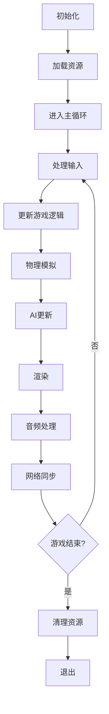
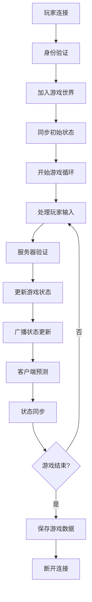

# 游戏开发 (Game Development) - Rust架构指南

## 概述

游戏开发行业需要高性能、低延迟的实时系统，Rust的内存安全和零成本抽象特性使其成为游戏开发的理想选择。从游戏引擎到网络服务器，Rust都能提供卓越的性能表现。

## 核心挑战

- **性能要求**: 60FPS渲染、低延迟网络
- **实时性**: 实时游戏逻辑、物理模拟
- **并发处理**: 多玩家同步、AI计算
- **资源管理**: 内存优化、资源加载
- **跨平台**: 多平台支持、移动端优化

## 技术栈选型

### 核心框架

```toml
[dependencies]
# 游戏引擎
bevy = "0.12"
amethyst = "0.20"
ggez = "0.9"

# 图形渲染
wgpu = "0.18"
vulkano = "0.34"
glium = "0.32"

# 音频
rodio = "0.17"
cpal = "0.15"
kira = "0.8"

# 物理引擎
rapier2d = "0.17"
rapier3d = "0.17"
nphysics3d = "0.16"

# 网络
tokio = { version = "1.35", features = ["full"] }
quinn = "0.10"
webrtc = "0.8"

# 序列化
serde = { version = "1.0", features = ["derive"] }
bincode = "1.3"
```

### 行业特定库

```toml
[dependencies]
# 数学库
glam = "0.25"
nalgebra = "0.32"
cgmath = "0.18"

# 资源管理
asset = "0.1"
notify = "6.1"

# 输入处理
winit = "0.29"
gilrs = "0.9"

# 调试和性能
tracy-client = "0.20"
perf-event = "0.4"
```

## 架构模式

### 1. ECS架构 (Entity-Component-System)

```rust
use bevy::prelude::*;

// 组件定义
#[derive(Component)]
pub struct Position {
    pub x: f32,
    pub y: f32,
}

#[derive(Component)]
pub struct Velocity {
    pub x: f32,
    pub y: f32,
}

#[derive(Component)]
pub struct Health {
    pub current: f32,
    pub maximum: f32,
}

// 系统定义
fn movement_system(
    mut query: Query<(&mut Position, &Velocity)>,
    time: Res<Time>,
) {
    for (mut position, velocity) in query.iter_mut() {
        position.x += velocity.x * time.delta_seconds();
        position.y += velocity.y * time.delta_seconds();
    }
}

fn health_system(
    mut query: Query<&mut Health>,
    mut commands: Commands,
) {
    for mut health in query.iter_mut() {
        if health.current <= 0.0 {
            // 处理死亡逻辑
        }
    }
}

// 应用配置
fn main() {
    App::new()
        .add_plugins(DefaultPlugins)
        .add_systems(Update, (movement_system, health_system))
        .run();
}
```

### 2. 客户端-服务器架构

```rust
// 客户端
pub struct GameClient {
    connection: Connection,
    game_state: GameState,
    input_handler: InputHandler,
    renderer: Renderer,
}

impl GameClient {
    pub async fn run(&mut self) -> Result<(), GameError> {
        loop {
            // 处理输入
            let input = self.input_handler.poll_input();
            
            // 发送输入到服务器
            self.connection.send_input(input).await?;
            
            // 接收服务器更新
            let update = self.connection.receive_update().await?;
            
            // 更新本地状态
            self.game_state.apply_update(update);
            
            // 渲染
            self.renderer.render(&self.game_state);
            
            // 控制帧率
            tokio::time::sleep(Duration::from_millis(16)).await; // ~60 FPS
        }
    }
}

// 服务器
pub struct GameServer {
    clients: HashMap<ClientId, ClientConnection>,
    game_world: GameWorld,
    physics_engine: PhysicsEngine,
}

impl GameServer {
    pub async fn run(&mut self) -> Result<(), ServerError> {
        loop {
            // 处理客户端输入
            self.process_client_inputs().await?;
            
            // 更新游戏逻辑
            self.update_game_logic();
            
            // 物理模拟
            self.physics_engine.step();
            
            // 发送状态更新给所有客户端
            self.broadcast_state_updates().await?;
            
            // 控制更新频率
            tokio::time::sleep(Duration::from_millis(16)).await;
        }
    }
}
```

### 3. 状态同步模式

```rust
// 游戏状态
#[derive(Debug, Clone, Serialize, Deserialize)]
pub struct GameState {
    pub entities: HashMap<EntityId, Entity>,
    pub world: WorldState,
    pub timestamp: u64,
}

#[derive(Debug, Clone, Serialize, Deserialize)]
pub struct Entity {
    pub id: EntityId,
    pub position: Vector2<f32>,
    pub velocity: Vector2<f32>,
    pub health: f32,
    pub entity_type: EntityType,
}

// 状态同步
pub trait StateSynchronizer {
    async fn synchronize_state(&self, client_state: &GameState) -> Result<GameState, SyncError>;
    async fn predict_state(&self, input: &PlayerInput) -> GameState;
    async fn reconcile_state(&self, predicted: &GameState, actual: &GameState) -> GameState;
}
```

## 业务领域建模

### 核心游戏概念

```rust
// 游戏世界
pub struct GameWorld {
    pub entities: HashMap<EntityId, Entity>,
    pub systems: Vec<Box<dyn GameSystem>>,
    pub physics_world: PhysicsWorld,
    pub audio_manager: AudioManager,
    pub resource_manager: ResourceManager,
}

// 实体系统
pub trait Entity {
    fn update(&mut self, delta_time: f32);
    fn render(&self, renderer: &mut Renderer);
    fn handle_collision(&mut self, other: &Entity);
    fn is_alive(&self) -> bool;
}

// 游戏系统
pub trait GameSystem {
    fn update(&self, world: &mut GameWorld, delta_time: f32);
    fn priority(&self) -> SystemPriority;
}

// 输入处理
#[derive(Debug, Clone)]
pub struct PlayerInput {
    pub movement: Vector2<f32>,
    pub actions: Vec<Action>,
    pub timestamp: u64,
}

#[derive(Debug, Clone)]
pub enum Action {
    Jump,
    Attack,
    Interact,
    UseItem(ItemId),
}
```

### 游戏逻辑组件

```rust
// 玩家组件
#[derive(Component)]
pub struct Player {
    pub id: PlayerId,
    pub name: String,
    pub level: u32,
    pub experience: u32,
    pub inventory: Inventory,
}

// 物品系统
#[derive(Component)]
pub struct Item {
    pub id: ItemId,
    pub name: String,
    pub item_type: ItemType,
    pub stats: ItemStats,
    pub rarity: Rarity,
}

// 技能系统
#[derive(Component)]
pub struct Skill {
    pub id: SkillId,
    pub name: String,
    pub cooldown: f32,
    pub mana_cost: f32,
    pub damage: f32,
}
```

## 数据建模

### 游戏数据存储

```rust
// 存档系统
#[derive(Debug, Clone, Serialize, Deserialize)]
pub struct GameSave {
    pub player_data: PlayerData,
    pub world_data: WorldData,
    pub inventory_data: InventoryData,
    pub quest_data: QuestData,
    pub timestamp: DateTime<Utc>,
    pub version: String,
}

// 配置数据
#[derive(Debug, Clone, Serialize, Deserialize)]
pub struct GameConfig {
    pub graphics: GraphicsConfig,
    pub audio: AudioConfig,
    pub controls: ControlsConfig,
    pub network: NetworkConfig,
}

// 资源数据
#[derive(Debug, Clone)]
pub struct GameAsset {
    pub id: AssetId,
    pub asset_type: AssetType,
    pub data: Vec<u8>,
    pub metadata: AssetMetadata,
}
```

### 网络数据模型

```rust
// 网络消息
#[derive(Debug, Clone, Serialize, Deserialize)]
pub enum NetworkMessage {
    PlayerInput(PlayerInput),
    GameState(GameState),
    ChatMessage(ChatMessage),
    PlayerJoin(PlayerJoin),
    PlayerLeave(PlayerLeave),
}

// 协议定义
pub trait NetworkProtocol {
    fn serialize(&self, message: &NetworkMessage) -> Result<Vec<u8>, ProtocolError>;
    fn deserialize(&self, data: &[u8]) -> Result<NetworkMessage, ProtocolError>;
}
```

## 流程建模

### 游戏主循环



### 多人游戏流程



## 组件建模

### 渲染系统

```rust
// 渲染器
pub struct Renderer {
    device: wgpu::Device,
    queue: wgpu::Queue,
    surface: wgpu::Surface,
    render_pipeline: wgpu::RenderPipeline,
    vertex_buffer: wgpu::Buffer,
    index_buffer: wgpu::Buffer,
}

impl Renderer {
    pub fn new(window: &Window) -> Result<Self, RenderError> {
        // 初始化WebGPU
        let instance = wgpu::Instance::new(wgpu::InstanceDescriptor {
            backends: wgpu::Backends::all(),
            ..Default::default()
        });
        
        let surface = unsafe { instance.create_surface(window) }?;
        let adapter = instance.request_adapter(&wgpu::RequestAdapterOptions {
            power_preference: wgpu::PowerPreference::default(),
            compatible_surface: Some(&surface),
            force_fallback_adapter: false,
        }).await.ok_or(RenderError::NoAdapter)?;
        
        let (device, queue) = adapter.request_device(
            &wgpu::DeviceDescriptor::default(),
            None,
        ).await?;
        
        // 创建渲染管线
        let render_pipeline = self.create_render_pipeline(&device);
        
        Ok(Self {
            device,
            queue,
            surface,
            render_pipeline,
            vertex_buffer,
            index_buffer,
        })
    }
    
    pub fn render(&self, game_state: &GameState) -> Result<(), RenderError> {
        // 渲染逻辑
        let frame = self.surface.get_current_texture()?;
        let view = frame.texture.create_view(&wgpu::TextureViewDescriptor::default());
        
        let mut encoder = self.device.create_command_encoder(&wgpu::CommandEncoderDescriptor {
            label: Some("Render Encoder"),
        });
        
        {
            let mut render_pass = encoder.begin_render_pass(&wgpu::RenderPassDescriptor {
                label: Some("Render Pass"),
                color_attachments: &[Some(wgpu::RenderPassColorAttachment {
                    view: &view,
                    resolve_target: None,
                    ops: wgpu::Operations {
                        load: wgpu::LoadOp::Clear(wgpu::Color::BLACK),
                        store: true,
                    },
                })],
                depth_stencil_attachment: None,
            });
            
            render_pass.set_pipeline(&self.render_pipeline);
            render_pass.set_vertex_buffer(0, self.vertex_buffer.slice(..));
            render_pass.set_index_buffer(self.index_buffer.slice(..), wgpu::IndexFormat::Uint16);
            render_pass.draw_indexed(0..6, 0, 0..1);
        }
        
        self.queue.submit(std::iter::once(encoder.finish()));
        frame.present();
        
        Ok(())
    }
}
```

### 音频系统

```rust
// 音频管理器
pub struct AudioManager {
    device: rodio::Device,
    sink: rodio::Sink,
    sounds: HashMap<SoundId, Sound>,
    music: Option<Music>,
}

impl AudioManager {
    pub fn new() -> Result<Self, AudioError> {
        let device = rodio::default_output_device()
            .ok_or(AudioError::NoDevice)?;
        let sink = rodio::Sink::new(&device);
        
        Ok(Self {
            device,
            sink,
            sounds: HashMap::new(),
            music: None,
        })
    }
    
    pub fn play_sound(&mut self, sound_id: &SoundId) -> Result<(), AudioError> {
        if let Some(sound) = self.sounds.get(sound_id) {
            let source = rodio::Decoder::new(std::io::Cursor::new(&sound.data))?;
            self.sink.append(source);
        }
        Ok(())
    }
    
    pub fn play_music(&mut self, music: Music) -> Result<(), AudioError> {
        self.stop_music();
        let source = rodio::Decoder::new(std::io::Cursor::new(&music.data))?;
        self.sink.append(source);
        self.music = Some(music);
        Ok(())
    }
    
    pub fn stop_music(&mut self) {
        self.sink.stop();
        self.music = None;
    }
}
```

### 物理系统

```rust
// 物理引擎
pub struct PhysicsEngine {
    world: rapier3d::DynamicsWorld,
    rigid_bodies: HashMap<EntityId, rapier3d::RigidBodyHandle>,
    colliders: HashMap<EntityId, rapier3d::ColliderHandle>,
}

impl PhysicsEngine {
    pub fn new() -> Self {
        let gravity = rapier3d::Vector::new(0.0, -9.81, 0.0);
        let world = rapier3d::DynamicsWorld::new(gravity);
        
        Self {
            world,
            rigid_bodies: HashMap::new(),
            colliders: HashMap::new(),
        }
    }
    
    pub fn add_rigid_body(
        &mut self,
        entity_id: EntityId,
        position: Vector3<f32>,
        mass: f32,
    ) {
        let rigid_body = rapier3d::RigidBodyBuilder::dynamic()
            .translation(rapier3d::Vector::new(position.x, position.y, position.z))
            .build();
        
        let handle = self.world.insert_rigid_body(rigid_body);
        self.rigid_bodies.insert(entity_id, handle);
    }
    
    pub fn add_collider(
        &mut self,
        entity_id: EntityId,
        shape: rapier3d::ColliderShape,
    ) {
        if let Some(body_handle) = self.rigid_bodies.get(&entity_id) {
            let collider = rapier3d::ColliderBuilder::new(shape).build();
            let handle = self.world.insert_collider(collider, *body_handle);
            self.colliders.insert(entity_id, handle);
        }
    }
    
    pub fn step(&mut self, delta_time: f32) {
        self.world.step();
    }
    
    pub fn get_position(&self, entity_id: &EntityId) -> Option<Vector3<f32>> {
        self.rigid_bodies.get(entity_id).and_then(|handle| {
            self.world.rigid_body(*handle).map(|body| {
                let translation = body.translation();
                Vector3::new(translation.x, translation.y, translation.z)
            })
        })
    }
}
```

## 性能优化

### 内存管理

```rust
// 对象池
pub struct ObjectPool<T> {
    objects: Vec<T>,
    available: Vec<usize>,
    factory: Box<dyn Fn() -> T>,
}

impl<T> ObjectPool<T> {
    pub fn new(capacity: usize, factory: impl Fn() -> T + 'static) -> Self {
        let mut objects = Vec::with_capacity(capacity);
        let mut available = Vec::with_capacity(capacity);
        
        for i in 0..capacity {
            objects.push(factory());
            available.push(i);
        }
        
        Self {
            objects,
            available,
            factory: Box::new(factory),
        }
    }
    
    pub fn acquire(&mut self) -> Option<&mut T> {
        self.available.pop().map(|index| &mut self.objects[index])
    }
    
    pub fn release(&mut self, index: usize) {
        self.available.push(index);
    }
}

// 空间分区
pub struct SpatialHashGrid {
    cell_size: f32,
    grid: HashMap<(i32, i32), Vec<EntityId>>,
}

impl SpatialHashGrid {
    pub fn new(cell_size: f32) -> Self {
        Self {
            cell_size,
            grid: HashMap::new(),
        }
    }
    
    pub fn insert(&mut self, entity_id: EntityId, position: Vector2<f32>) {
        let cell = self.get_cell(position);
        self.grid.entry(cell).or_insert_with(Vec::new).push(entity_id);
    }
    
    pub fn query_nearby(&self, position: Vector2<f32>, radius: f32) -> Vec<EntityId> {
        let mut result = Vec::new();
        let cell_radius = (radius / self.cell_size).ceil() as i32;
        let center_cell = self.get_cell(position);
        
        for dx in -cell_radius..=cell_radius {
            for dy in -cell_radius..=cell_radius {
                let cell = (center_cell.0 + dx, center_cell.1 + dy);
                if let Some(entities) = self.grid.get(&cell) {
                    result.extend(entities.iter().cloned());
                }
            }
        }
        
        result
    }
    
    fn get_cell(&self, position: Vector2<f32>) -> (i32, i32) {
        (
            (position.x / self.cell_size).floor() as i32,
            (position.y / self.cell_size).floor() as i32,
        )
    }
}
```

### 渲染优化

```rust
// 批处理渲染
pub struct BatchRenderer {
    batches: HashMap<MaterialId, RenderBatch>,
    max_vertices_per_batch: usize,
}

impl BatchRenderer {
    pub fn new(max_vertices_per_batch: usize) -> Self {
        Self {
            batches: HashMap::new(),
            max_vertices_per_batch,
        }
    }
    
    pub fn add_sprite(&mut self, sprite: &Sprite, material: MaterialId) {
        let batch = self.batches.entry(material).or_insert_with(|| {
            RenderBatch::new(self.max_vertices_per_batch)
        });
        
        if batch.is_full() {
            self.flush_batch(material);
            let new_batch = RenderBatch::new(self.max_vertices_per_batch);
            self.batches.insert(material, new_batch);
        }
        
        self.batches.get_mut(&material).unwrap().add_sprite(sprite);
    }
    
    pub fn render_all(&mut self, renderer: &mut Renderer) {
        for (material, batch) in self.batches.iter() {
            if !batch.is_empty() {
                renderer.render_batch(batch, material);
            }
        }
    }
}

// 视锥剔除
pub struct FrustumCuller {
    planes: [Plane; 6],
}

impl FrustumCuller {
    pub fn new(view_projection: Matrix4<f32>) -> Self {
        let planes = Self::extract_planes(view_projection);
        Self { planes }
    }
    
    pub fn is_visible(&self, aabb: &AABB) -> bool {
        for plane in &self.planes {
            if plane.distance_to_point(aabb.center()) < -aabb.radius() {
                return false;
            }
        }
        true
    }
    
    fn extract_planes(view_projection: Matrix4<f32>) -> [Plane; 6] {
        // 从视图投影矩阵提取视锥平面
        // 实现细节...
        [Plane::default(); 6]
    }
}
```

## 网络优化

### 预测和回滚

```rust
// 客户端预测
pub struct ClientPrediction {
    input_buffer: VecDeque<PlayerInput>,
    state_buffer: VecDeque<GameState>,
    max_buffer_size: usize,
}

impl ClientPrediction {
    pub fn new(max_buffer_size: usize) -> Self {
        Self {
            input_buffer: VecDeque::new(),
            state_buffer: VecDeque::new(),
            max_buffer_size,
        }
    }
    
    pub fn add_input(&mut self, input: PlayerInput) {
        self.input_buffer.push_back(input);
        if self.input_buffer.len() > self.max_buffer_size {
            self.input_buffer.pop_front();
        }
    }
    
    pub fn predict_state(&self, current_state: &GameState) -> GameState {
        let mut predicted_state = current_state.clone();
        
        for input in &self.input_buffer {
            predicted_state = self.apply_input(&predicted_state, input);
        }
        
        predicted_state
    }
    
    pub fn reconcile(&mut self, server_state: &GameState) {
        // 如果预测状态与服务器状态差异过大，进行回滚
        if let Some(last_predicted) = self.state_buffer.back() {
            if self.distance(last_predicted, server_state) > THRESHOLD {
                // 回滚到服务器状态，重新应用输入
                let mut reconciled_state = server_state.clone();
                for input in &self.input_buffer {
                    reconciled_state = self.apply_input(&reconciled_state, input);
                }
                // 更新状态...
            }
        }
    }
}

// 插值
pub struct Interpolation {
    previous_state: Option<GameState>,
    current_state: Option<GameState>,
    interpolation_factor: f32,
}

impl Interpolation {
    pub fn new() -> Self {
        Self {
            previous_state: None,
            current_state: None,
            interpolation_factor: 0.0,
        }
    }
    
    pub fn update(&mut self, new_state: GameState) {
        self.previous_state = self.current_state.take();
        self.current_state = Some(new_state);
        self.interpolation_factor = 0.0;
    }
    
    pub fn interpolate(&mut self, alpha: f32) -> Option<GameState> {
        if let (Some(prev), Some(curr)) = (&self.previous_state, &self.current_state) {
            Some(self.interpolate_states(prev, curr, alpha))
        } else {
            self.current_state.clone()
        }
    }
    
    fn interpolate_states(&self, prev: &GameState, curr: &GameState, alpha: f32) -> GameState {
        // 在状态之间进行插值
        // 实现细节...
        curr.clone()
    }
}
```

## 测试策略

### 单元测试

```rust
#[cfg(test)]
mod tests {
    use super::*;
    
    #[test]
    fn test_physics_collision() {
        let mut physics = PhysicsEngine::new();
        
        // 创建两个碰撞体
        physics.add_rigid_body(EntityId(1), Vector3::new(0.0, 0.0, 0.0), 1.0);
        physics.add_rigid_body(EntityId(2), Vector3::new(1.0, 0.0, 0.0), 1.0);
        
        physics.add_collider(EntityId(1), rapier3d::ColliderShape::ball(0.5));
        physics.add_collider(EntityId(2), rapier3d::ColliderShape::ball(0.5));
        
        // 模拟物理
        physics.step(0.016);
        
        // 验证碰撞
        let pos1 = physics.get_position(&EntityId(1)).unwrap();
        let pos2 = physics.get_position(&EntityId(2)).unwrap();
        
        assert!(pos1.distance(pos2) > 0.0);
    }
    
    #[test]
    fn test_input_handling() {
        let mut input_handler = InputHandler::new();
        
        let input = PlayerInput {
            movement: Vector2::new(1.0, 0.0),
            actions: vec![Action::Jump],
            timestamp: 1000,
        };
        
        input_handler.process_input(input);
        
        assert_eq!(input_handler.get_movement(), Vector2::new(1.0, 0.0));
        assert!(input_handler.is_action_pressed(Action::Jump));
    }
}
```

### 性能测试

```rust
#[cfg(test)]
mod performance_tests {
    use super::*;
    use std::time::Instant;
    
    #[test]
    fn test_render_performance() {
        let mut renderer = Renderer::new(&create_test_window()).unwrap();
        let game_state = create_test_game_state(1000); // 1000个实体
        
        let start = Instant::now();
        for _ in 0..100 {
            renderer.render(&game_state).unwrap();
        }
        let duration = start.elapsed();
        
        // 确保渲染100帧不超过1秒
        assert!(duration.as_secs_f32() < 1.0);
    }
    
    #[test]
    fn test_physics_performance() {
        let mut physics = PhysicsEngine::new();
        
        // 创建1000个物理对象
        for i in 0..1000 {
            physics.add_rigid_body(
                EntityId(i),
                Vector3::new(i as f32, 0.0, 0.0),
                1.0,
            );
        }
        
        let start = Instant::now();
        for _ in 0..1000 {
            physics.step(0.016);
        }
        let duration = start.elapsed();
        
        // 确保1000步物理模拟不超过100ms
        assert!(duration.as_millis() < 100);
    }
}
```

## 部署和发布

### 构建配置

```toml
# Cargo.toml
[package]
name = "my-game"
version = "0.1.0"
edition = "2021"

[profile.release]
opt-level = 3
lto = true
codegen-units = 1
panic = "abort"
strip = true

[profile.dev]
opt-level = 0
debug = true

[dependencies]
# 开发依赖
[dev-dependencies]
criterion = "0.5"
```

### 跨平台构建

```rust
// 平台特定代码
#[cfg(target_os = "windows")]
mod platform {
    use windows::Win32::Foundation::*;
    
    pub fn get_system_info() -> SystemInfo {
        // Windows特定实现
    }
}

#[cfg(target_os = "linux")]
mod platform {
    pub fn get_system_info() -> SystemInfo {
        // Linux特定实现
    }
}

#[cfg(target_os = "macos")]
mod platform {
    pub fn get_system_info() -> SystemInfo {
        // macOS特定实现
    }
}
```

## 总结

游戏开发行业的Rust架构需要特别关注：

1. **性能**: 使用ECS架构、对象池、空间分区
2. **实时性**: 客户端预测、服务器权威、状态同步
3. **渲染**: 批处理、视锥剔除、LOD系统
4. **网络**: 低延迟、高吞吐量、可靠传输
5. **跨平台**: 统一API、平台抽象、资源管理

通过遵循这些设计原则和最佳实践，可以构建出高性能、低延迟的游戏系统。
