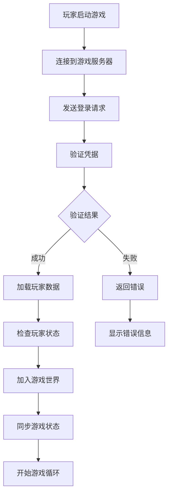
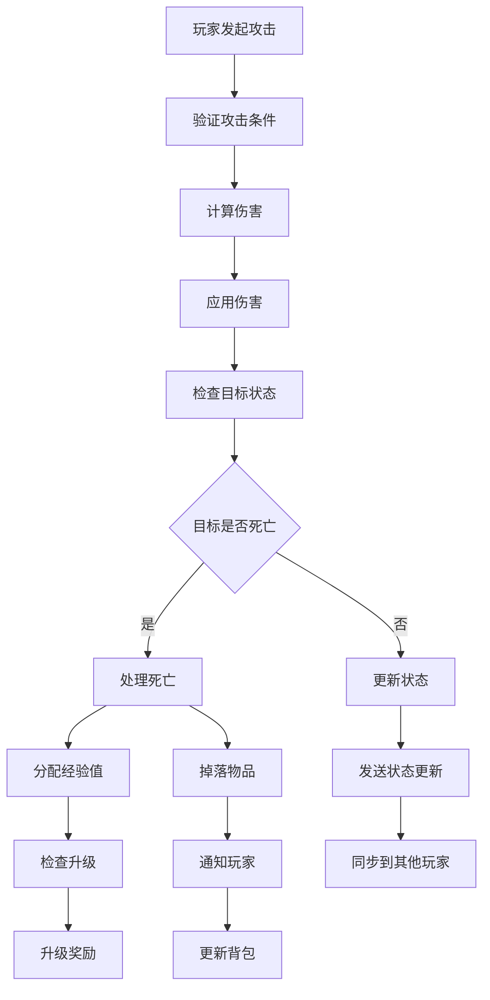
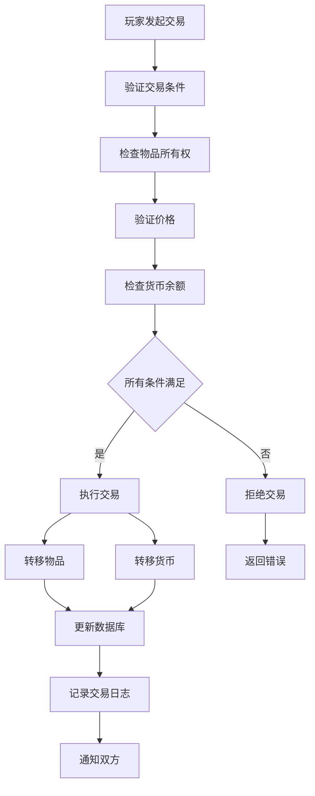

# 游戏开发行业 - 业务建模详细指南

## 概述

本文档详细描述了游戏开发行业的业务建模，包括业务流程、数据建模、流程建模和概念建模。

## 1. 业务领域概念建模

### 1.1 核心业务概念

#### 游戏世界聚合根

```rust
#[derive(Debug, Clone)]
pub struct GameWorld {
    pub id: WorldId,
    pub name: String,
    pub world_type: WorldType,
    pub max_players: u32,
    pub current_players: u32,
    pub status: WorldStatus,
    pub entities: HashMap<EntityId, Entity>,
    pub physics_world: PhysicsWorld,
    pub game_rules: GameRules,
    pub created_at: DateTime<Utc>,
}

#[derive(Debug, Clone)]
pub struct GameRules {
    pub max_health: f32,
    pub respawn_time: Duration,
    pub score_multiplier: f32,
    pub team_size: u32,
    pub match_duration: Duration,
}

impl GameWorld {
    pub fn can_join(&self, player: &Player) -> bool {
        self.status == WorldStatus::Active && 
        self.current_players < self.max_players
    }
    
    pub fn add_player(&mut self, player: Player) -> Result<(), WorldError> {
        if !self.can_join(&player) {
            return Err(WorldError::CannotJoin);
        }
        
        self.current_players += 1;
        self.entities.insert(player.id.clone(), Entity::Player(player));
        Ok(())
    }
    
    pub fn remove_player(&mut self, player_id: &PlayerId) {
        if self.entities.remove(player_id).is_some() {
            self.current_players = self.current_players.saturating_sub(1);
        }
    }
}
```

#### 玩家聚合根

```rust
#[derive(Debug, Clone)]
pub struct Player {
    pub id: PlayerId,
    pub username: String,
    pub level: u32,
    pub experience: u32,
    pub health: f32,
    pub position: Vector3<f32>,
    pub inventory: Inventory,
    pub skills: Vec<Skill>,
    pub stats: PlayerStats,
    pub team_id: Option<TeamId>,
    pub last_seen: DateTime<Utc>,
}

#[derive(Debug, Clone)]
pub struct PlayerStats {
    pub kills: u32,
    pub deaths: u32,
    pub assists: u32,
    pub wins: u32,
    pub losses: u32,
    pub play_time: Duration,
}

impl Player {
    pub fn gain_experience(&mut self, amount: u32) {
        self.experience += amount;
        
        // 检查升级
        let new_level = self.calculate_level();
        if new_level > self.level {
            self.level = new_level;
            self.on_level_up();
        }
    }
    
    pub fn take_damage(&mut self, damage: f32) -> bool {
        self.health = (self.health - damage).max(0.0);
        self.health <= 0.0
    }
    
    pub fn heal(&mut self, amount: f32) {
        self.health = (self.health + amount).min(100.0);
    }
    
    fn calculate_level(&self) -> u32 {
        (self.experience / 1000) + 1
    }
    
    fn on_level_up(&mut self) {
        // 升级奖励逻辑
        self.health = 100.0; // 满血复活
    }
}
```

#### 物品系统

```rust
#[derive(Debug, Clone)]
pub struct Item {
    pub id: ItemId,
    pub name: String,
    pub item_type: ItemType,
    pub rarity: Rarity,
    pub stats: ItemStats,
    pub durability: Option<u32>,
    pub stackable: bool,
    pub max_stack: u32,
}

#[derive(Debug, Clone)]
pub struct Inventory {
    pub items: HashMap<SlotId, InventorySlot>,
    pub capacity: u32,
    pub gold: u32,
}

#[derive(Debug, Clone)]
pub struct InventorySlot {
    pub item: Option<Item>,
    pub quantity: u32,
    pub locked: bool,
}

impl Inventory {
    pub fn add_item(&mut self, item: Item, quantity: u32) -> Result<(), InventoryError> {
        if item.stackable {
            // 查找现有堆叠
            for slot in self.items.values_mut() {
                if let Some(existing_item) = &slot.item {
                    if existing_item.id == item.id && slot.quantity < item.max_stack {
                        let space_left = item.max_stack - slot.quantity;
                        let to_add = quantity.min(space_left);
                        slot.quantity += to_add;
                        
                        if to_add == quantity {
                            return Ok(());
                        }
                    }
                }
            }
        }
        
        // 需要新槽位
        if self.items.len() >= self.capacity as usize {
            return Err(InventoryError::Full);
        }
        
        let slot_id = self.find_empty_slot();
        self.items.insert(slot_id, InventorySlot {
            item: Some(item),
            quantity,
            locked: false,
        });
        
        Ok(())
    }
    
    fn find_empty_slot(&self) -> SlotId {
        for i in 0..self.capacity {
            let slot_id = SlotId(i);
            if !self.items.contains_key(&slot_id) {
                return slot_id;
            }
        }
        SlotId(0) // 不应该到达这里
    }
}
```

### 1.2 值对象

```rust
#[derive(Debug, Clone, PartialEq, Eq, Hash)]
pub struct PlayerId(String);

#[derive(Debug, Clone, PartialEq, Eq, Hash)]
pub struct WorldId(String);

#[derive(Debug, Clone, PartialEq, Eq, Hash)]
pub struct ItemId(String);

#[derive(Debug, Clone, PartialEq, Eq, Hash)]
pub struct SlotId(u32);

#[derive(Debug, Clone)]
pub struct Vector3<T> {
    pub x: T,
    pub y: T,
    pub z: T,
}

impl<T> Vector3<T> {
    pub fn new(x: T, y: T, z: T) -> Self {
        Self { x, y, z }
    }
}

#[derive(Debug, Clone)]
pub struct Money {
    pub amount: u32,
    pub currency: Currency,
}

#[derive(Debug, Clone)]
pub enum Currency {
    Gold,
    Gems,
    Credits,
}
```

## 2. 数据建模

### 2.1 数据库设计

#### 玩家相关表

```sql
-- 玩家表
CREATE TABLE players (
    id UUID PRIMARY KEY,
    username VARCHAR(50) UNIQUE NOT NULL,
    email VARCHAR(255) UNIQUE NOT NULL,
    password_hash VARCHAR(255) NOT NULL,
    level INTEGER NOT NULL DEFAULT 1,
    experience INTEGER NOT NULL DEFAULT 0,
    health DECIMAL(5,2) NOT NULL DEFAULT 100.00,
    position_x DECIMAL(10,6) NOT NULL DEFAULT 0.0,
    position_y DECIMAL(10,6) NOT NULL DEFAULT 0.0,
    position_z DECIMAL(10,6) NOT NULL DEFAULT 0.0,
    gold INTEGER NOT NULL DEFAULT 0,
    gems INTEGER NOT NULL DEFAULT 0,
    credits INTEGER NOT NULL DEFAULT 0,
    kills INTEGER NOT NULL DEFAULT 0,
    deaths INTEGER NOT NULL DEFAULT 0,
    assists INTEGER NOT NULL DEFAULT 0,
    wins INTEGER NOT NULL DEFAULT 0,
    losses INTEGER NOT NULL DEFAULT 0,
    play_time_seconds INTEGER NOT NULL DEFAULT 0,
    last_seen TIMESTAMP WITH TIME ZONE NOT NULL,
    created_at TIMESTAMP WITH TIME ZONE NOT NULL,
    updated_at TIMESTAMP WITH TIME ZONE NOT NULL
);

-- 玩家物品表
CREATE TABLE player_items (
    id UUID PRIMARY KEY,
    player_id UUID NOT NULL,
    item_id UUID NOT NULL,
    slot_id INTEGER NOT NULL,
    quantity INTEGER NOT NULL DEFAULT 1,
    durability INTEGER,
    locked BOOLEAN NOT NULL DEFAULT false,
    created_at TIMESTAMP WITH TIME ZONE NOT NULL,
    FOREIGN KEY (player_id) REFERENCES players(id),
    FOREIGN KEY (item_id) REFERENCES items(id)
);

-- 玩家技能表
CREATE TABLE player_skills (
    id UUID PRIMARY KEY,
    player_id UUID NOT NULL,
    skill_id UUID NOT NULL,
    level INTEGER NOT NULL DEFAULT 1,
    experience INTEGER NOT NULL DEFAULT 0,
    cooldown_until TIMESTAMP WITH TIME ZONE,
    FOREIGN KEY (player_id) REFERENCES players(id),
    FOREIGN KEY (skill_id) REFERENCES skills(id)
);
```

#### 游戏世界表

```sql
-- 游戏世界表
CREATE TABLE game_worlds (
    id UUID PRIMARY KEY,
    name VARCHAR(100) NOT NULL,
    world_type VARCHAR(50) NOT NULL,
    max_players INTEGER NOT NULL,
    current_players INTEGER NOT NULL DEFAULT 0,
    status VARCHAR(20) NOT NULL DEFAULT 'active',
    game_rules JSONB NOT NULL,
    created_at TIMESTAMP WITH TIME ZONE NOT NULL,
    updated_at TIMESTAMP WITH TIME ZONE NOT NULL
);

-- 世界实体表
CREATE TABLE world_entities (
    id UUID PRIMARY KEY,
    world_id UUID NOT NULL,
    entity_type VARCHAR(50) NOT NULL,
    entity_data JSONB NOT NULL,
    position_x DECIMAL(10,6) NOT NULL,
    position_y DECIMAL(10,6) NOT NULL,
    position_z DECIMAL(10,6) NOT NULL,
    created_at TIMESTAMP WITH TIME ZONE NOT NULL,
    FOREIGN KEY (world_id) REFERENCES game_worlds(id)
);

-- 游戏会话表
CREATE TABLE game_sessions (
    id UUID PRIMARY KEY,
    world_id UUID NOT NULL,
    session_type VARCHAR(50) NOT NULL,
    status VARCHAR(20) NOT NULL DEFAULT 'active',
    start_time TIMESTAMP WITH TIME ZONE NOT NULL,
    end_time TIMESTAMP WITH TIME ZONE,
    winner_team_id UUID,
    session_data JSONB,
    FOREIGN KEY (world_id) REFERENCES game_worlds(id)
);
```

#### 物品和技能表

```sql
-- 物品表
CREATE TABLE items (
    id UUID PRIMARY KEY,
    name VARCHAR(100) NOT NULL,
    item_type VARCHAR(50) NOT NULL,
    rarity VARCHAR(20) NOT NULL,
    stats JSONB NOT NULL,
    durability INTEGER,
    stackable BOOLEAN NOT NULL DEFAULT false,
    max_stack INTEGER NOT NULL DEFAULT 1,
    created_at TIMESTAMP WITH TIME ZONE NOT NULL
);

-- 技能表
CREATE TABLE skills (
    id UUID PRIMARY KEY,
    name VARCHAR(100) NOT NULL,
    skill_type VARCHAR(50) NOT NULL,
    base_damage DECIMAL(8,2) NOT NULL,
    mana_cost INTEGER NOT NULL DEFAULT 0,
    cooldown_seconds INTEGER NOT NULL DEFAULT 0,
    range DECIMAL(8,2) NOT NULL DEFAULT 0.0,
    description TEXT,
    created_at TIMESTAMP WITH TIME ZONE NOT NULL
);

-- 交易记录表
CREATE TABLE transactions (
    id UUID PRIMARY KEY,
    player_id UUID NOT NULL,
    transaction_type VARCHAR(50) NOT NULL,
    item_id UUID,
    quantity INTEGER NOT NULL,
    price_amount INTEGER NOT NULL,
    price_currency VARCHAR(20) NOT NULL,
    timestamp TIMESTAMP WITH TIME ZONE NOT NULL,
    FOREIGN KEY (player_id) REFERENCES players(id),
    FOREIGN KEY (item_id) REFERENCES items(id)
);
```

### 2.2 仓储实现

```rust
pub struct PostgresPlayerRepository {
    pool: PgPool,
}

#[async_trait]
impl PlayerRepository for PostgresPlayerRepository {
    async fn save(&self, player: &Player) -> Result<(), RepositoryError> {
        let query = sqlx::query!(
            r#"
            INSERT INTO players (
                id, username, email, password_hash, level, experience, health,
                position_x, position_y, position_z, gold, gems, credits,
                kills, deaths, assists, wins, losses, play_time_seconds,
                last_seen, created_at, updated_at
            ) VALUES ($1, $2, $3, $4, $5, $6, $7, $8, $9, $10, $11, $12, $13, $14, $15, $16, $17, $18, $19, $20, $21, $22)
            ON CONFLICT (id) DO UPDATE SET
                level = $5, experience = $6, health = $7,
                position_x = $8, position_y = $9, position_z = $10,
                gold = $11, gems = $12, credits = $13,
                kills = $14, deaths = $15, assists = $16,
                wins = $17, losses = $18, play_time_seconds = $19,
                last_seen = $20, updated_at = $22
            "#,
            player.id.to_string(),
            player.username,
            player.email,
            player.password_hash,
            player.level as i32,
            player.experience as i32,
            player.health,
            player.position.x,
            player.position.y,
            player.position.z,
            player.inventory.gold as i32,
            player.inventory.gems as i32,
            player.inventory.credits as i32,
            player.stats.kills as i32,
            player.stats.deaths as i32,
            player.stats.assists as i32,
            player.stats.wins as i32,
            player.stats.losses as i32,
            player.stats.play_time.as_secs() as i32,
            player.last_seen,
            player.created_at,
            player.updated_at
        );
        
        query.execute(&self.pool).await?;
        Ok(())
    }
    
    async fn find_by_id(&self, id: &PlayerId) -> Result<Option<Player>, RepositoryError> {
        let row = sqlx::query!(
            r#"
            SELECT * FROM players WHERE id = $1
            "#,
            id.to_string()
        )
        .fetch_optional(&self.pool)
        .await?;
        
        if let Some(row) = row {
            let player = Player {
                id: PlayerId::new(row.id),
                username: row.username,
                email: row.email,
                password_hash: row.password_hash,
                level: row.level as u32,
                experience: row.experience as u32,
                health: row.health,
                position: Vector3::new(row.position_x, row.position_y, row.position_z),
                inventory: Inventory::new(), // 需要单独加载
                skills: Vec::new(), // 需要单独加载
                stats: PlayerStats {
                    kills: row.kills as u32,
                    deaths: row.deaths as u32,
                    assists: row.assists as u32,
                    wins: row.wins as u32,
                    losses: row.losses as u32,
                    play_time: Duration::from_secs(row.play_time_seconds as u64),
                },
                team_id: None, // 需要单独加载
                last_seen: row.last_seen,
            };
            Ok(Some(player))
        } else {
            Ok(None)
        }
    }
}
```

## 3. 流程建模

### 3.1 玩家登录流程



### 3.2 战斗流程



### 3.3 交易流程



### 3.4 流程实现

```rust
pub struct GameSessionWorkflow {
    player_service: Box<dyn PlayerService>,
    world_service: Box<dyn WorldService>,
    combat_service: Box<dyn CombatService>,
    notification_service: Box<dyn NotificationService>,
}

impl GameSessionWorkflow {
    pub async fn process_attack(
        &self,
        attacker_id: &PlayerId,
        target_id: &EntityId,
        skill_id: Option<SkillId>,
    ) -> Result<CombatResult, WorkflowError> {
        // 1. 获取攻击者和目标
        let attacker = self.player_service.get_player(attacker_id).await?;
        let target = self.world_service.get_entity(target_id).await?;
        
        // 2. 验证攻击条件
        if !self.can_attack(&attacker, &target).await? {
            return Err(WorkflowError::InvalidAttack);
        }
        
        // 3. 计算伤害
        let damage = if let Some(skill_id) = skill_id {
            self.combat_service.calculate_skill_damage(&attacker, skill_id).await?
        } else {
            self.combat_service.calculate_basic_damage(&attacker).await?
        };
        
        // 4. 应用伤害
        let is_dead = self.combat_service.apply_damage(&target, damage).await?;
        
        // 5. 处理结果
        if is_dead {
            self.handle_death(&attacker, &target).await?;
        }
        
        // 6. 同步状态
        self.world_service.broadcast_combat_result(&CombatResult {
            attacker_id: attacker_id.clone(),
            target_id: target_id.clone(),
            damage,
            is_dead,
        }).await?;
        
        Ok(CombatResult {
            attacker_id: attacker_id.clone(),
            target_id: target_id.clone(),
            damage,
            is_dead,
        })
    }
    
    async fn handle_death(&self, killer: &Player, victim: &Entity) -> Result<(), WorkflowError> {
        // 分配经验值
        if let Entity::Player(victim_player) = victim {
            let experience = self.calculate_experience_reward(killer, victim_player);
            self.player_service.add_experience(&killer.id, experience).await?;
        }
        
        // 处理掉落物品
        let drops = self.calculate_drops(victim);
        for drop in drops {
            self.world_service.spawn_item(drop).await?;
        }
        
        // 安排重生
        if let Entity::Player(victim_player) = victim {
            self.schedule_respawn(&victim_player.id).await?;
        }
        
        Ok(())
    }
}
```

## 4. 游戏规则引擎

### 4.1 规则定义

```rust
pub trait GameRule {
    async fn evaluate(&self, context: &GameContext) -> Result<RuleResult, RuleError>;
    fn priority(&self) -> u32;
    fn name(&self) -> &str;
}

pub struct LevelRequirementRule {
    required_level: u32,
}

#[async_trait]
impl GameRule for LevelRequirementRule {
    async fn evaluate(&self, context: &GameContext) -> Result<RuleResult, RuleError> {
        let player = &context.player;
        
        if player.level < self.required_level {
            Ok(RuleResult::Violation {
                rule_name: self.name().to_string(),
                message: format!("Required level: {}", self.required_level),
                severity: ViolationSeverity::Medium,
            })
        } else {
            Ok(RuleResult::Compliant)
        }
    }
    
    fn priority(&self) -> u32 {
        100
    }
    
    fn name(&self) -> &str {
        "LevelRequirementRule"
    }
}

pub struct CooldownRule {
    cooldown_duration: Duration,
}

#[async_trait]
impl GameRule for CooldownRule {
    async fn evaluate(&self, context: &GameContext) -> Result<RuleResult, RuleError> {
        let skill = &context.skill;
        let now = Utc::now();
        
        if let Some(cooldown_until) = skill.cooldown_until {
            if now < cooldown_until {
                let remaining = cooldown_until - now;
                Ok(RuleResult::Violation {
                    rule_name: self.name().to_string(),
                    message: format!("Skill on cooldown for {:?}", remaining),
                    severity: ViolationSeverity::Low,
                })
            } else {
                Ok(RuleResult::Compliant)
            }
        } else {
            Ok(RuleResult::Compliant)
        }
    }
    
    fn priority(&self) -> u32 {
        200
    }
    
    fn name(&self) -> &str {
        "CooldownRule"
    }
}
```

## 5. 事件系统

### 5.1 事件定义

```rust
#[derive(Debug, Clone, Serialize, Deserialize)]
pub enum GameEvent {
    PlayerJoined(PlayerJoinedEvent),
    PlayerLeft(PlayerLeftEvent),
    PlayerMoved(PlayerMovedEvent),
    PlayerAttacked(PlayerAttackedEvent),
    PlayerDied(PlayerDiedEvent),
    ItemDropped(ItemDroppedEvent),
    ItemPickedUp(ItemPickedUpEvent),
    SkillUsed(SkillUsedEvent),
    LevelUp(LevelUpEvent),
}

#[derive(Debug, Clone, Serialize, Deserialize)]
pub struct PlayerAttackedEvent {
    pub attacker_id: PlayerId,
    pub target_id: EntityId,
    pub damage: f32,
    pub skill_id: Option<SkillId>,
    pub timestamp: DateTime<Utc>,
}

#[derive(Debug, Clone, Serialize, Deserialize)]
pub struct PlayerDiedEvent {
    pub player_id: PlayerId,
    pub killer_id: Option<PlayerId>,
    pub position: Vector3<f32>,
    pub experience_dropped: u32,
    pub items_dropped: Vec<Item>,
    pub timestamp: DateTime<Utc>,
}
```

### 5.2 事件处理器

```rust
pub struct CombatEventHandler {
    player_service: Box<dyn PlayerService>,
    world_service: Box<dyn WorldService>,
    notification_service: Box<dyn NotificationService>,
}

#[async_trait]
impl EventHandler for CombatEventHandler {
    async fn handle(&self, event: &GameEvent) -> Result<(), EventError> {
        match event {
            GameEvent::PlayerAttacked(attack_event) => {
                self.handle_player_attack(attack_event).await?;
            }
            GameEvent::PlayerDied(death_event) => {
                self.handle_player_death(death_event).await?;
            }
            _ => {}
        }
        Ok(())
    }
}

impl CombatEventHandler {
    async fn handle_player_attack(&self, event: &PlayerAttackedEvent) -> Result<(), EventError> {
        // 更新战斗统计
        self.player_service.update_combat_stats(&event.attacker_id, &event.target_id).await?;
        
        // 发送战斗通知
        self.notification_service.send_combat_notification(event).await?;
        
        Ok(())
    }
    
    async fn handle_player_death(&self, event: &PlayerDiedEvent) -> Result<(), EventError> {
        // 处理死亡奖励
        if let Some(killer_id) = &event.killer_id {
            self.player_service.add_experience(killer_id, event.experience_dropped).await?;
        }
        
        // 生成掉落物品
        for item in &event.items_dropped {
            self.world_service.spawn_item_at_position(item, &event.position).await?;
        }
        
        // 安排重生
        self.world_service.schedule_respawn(&event.player_id).await?;
        
        Ok(())
    }
}
```

## 总结

游戏开发行业的业务建模需要特别关注：

1. **业务概念建模**: 明确定义玩家、游戏世界、物品等核心概念
2. **数据建模**: 设计支持实时游戏的数据结构
3. **流程建模**: 详细描述战斗、交易、升级等游戏流程
4. **规则引擎**: 实现灵活的游戏规则管理
5. **事件系统**: 支持实时游戏状态同步

通过这种详细的业务建模，可以构建出流畅、有趣的游戏体验。
